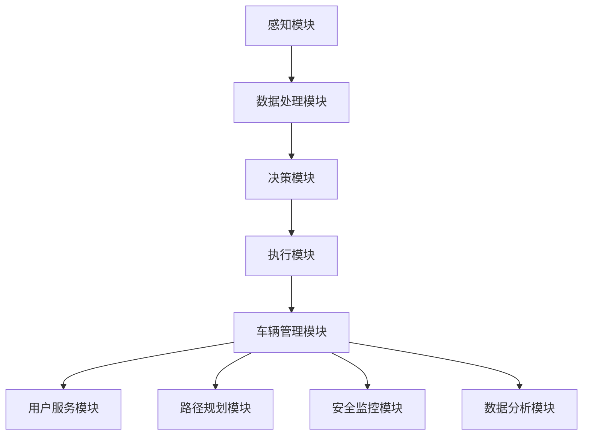

                 

关键词：端到端自动驾驶、自主共享汽车、AI技术、自动驾驶架构、自主决策、实时路径规划、多模态感知、安全与隐私保护、数据传输效率、车辆协同、用户体验优化、未来展望。

## 摘要

随着人工智能技术的飞速发展，端到端自动驾驶系统已经成为智能交通领域的研究热点。本文旨在探讨如何构建一种基于端到端自动驾驶技术的自主共享汽车服务系统。通过深入分析自动驾驶的核心概念、关键技术以及实际应用，本文提出了一个综合性的解决方案，以实现安全、高效、环保的自动驾驶共享出行服务。文章还从数学模型、项目实践和未来展望等多个角度进行了详细阐述，为自动驾驶技术的发展提供了新的思路。

## 1. 背景介绍

自动驾驶技术自20世纪末以来，随着计算机视觉、深度学习、传感器技术和通信技术的不断发展，逐渐成为智能交通领域的研究热点。传统的自动驾驶系统通常采用层次化的架构，包括感知、决策和执行三个层次。然而，这种架构存在着决策延迟、传感器数据融合困难等问题。为了解决这些问题，端到端自动驾驶技术应运而生。

端到端自动驾驶技术通过将感知和决策过程整合为一个统一的模型，可以直接从传感器数据中学习到驾驶行为，从而提高了系统的实时性和可靠性。此外，随着共享经济的兴起，自主共享汽车服务成为了一种新型的出行方式，它不仅能够提高交通效率，还能降低能源消耗和环境污染。

目前，自动驾驶技术在全球范围内得到了广泛关注，各国政府和研究机构纷纷投入大量资源进行研发。美国、中国、德国、日本等国家在自动驾驶技术方面取得了显著的进展。然而，尽管自动驾驶技术已经在一些特定场景下实现了商业化应用，但要实现全面普及仍面临着诸多挑战，如法律法规、安全标准、基础设施等方面的制约。

本文旨在通过对端到端自动驾驶技术的研究，探讨如何构建一种自主共享汽车服务系统，以实现安全、高效、环保的自动驾驶共享出行服务。通过深入分析自动驾驶的核心技术、架构设计和实际应用，本文提出了一个综合性的解决方案，为自动驾驶技术的发展提供了新的思路。

## 2. 核心概念与联系

### 2.1 自主共享汽车服务系统

自主共享汽车服务系统是一个集成了自动驾驶技术、物联网、云计算和大数据处理等先进技术的综合系统。该系统的主要功能是提供一种安全、高效、环保的出行服务，具体包括以下几个方面：

1. **车辆管理**：系统需要对车辆进行实时监控和管理，包括车辆状态检测、故障诊断、远程维护等。
2. **用户服务**：系统需要为用户提供便捷的服务，如用户注册、行程预约、支付结算等。
3. **路径规划**：系统需要根据实时交通状况为车辆规划最优行驶路径，以提高出行效率。
4. **安全监控**：系统需要具备实时监控功能，确保车辆行驶过程中安全无虞。
5. **数据分析**：系统需要收集并分析大量数据，为改进服务质量和优化系统性能提供依据。

### 2.2 端到端自动驾驶技术

端到端自动驾驶技术是一种将感知、决策和执行过程整合为一个统一模型的技术。传统的自动驾驶系统通常采用层次化的架构，包括感知层、决策层和执行层。感知层负责获取环境信息，决策层根据感知信息进行路径规划和控制策略制定，执行层负责执行决策结果。然而，这种架构存在着决策延迟、传感器数据融合困难等问题。

端到端自动驾驶技术通过深度学习等机器学习算法，直接从传感器数据中学习到驾驶行为，从而避免了传统架构中的中间环节，提高了系统的实时性和可靠性。端到端自动驾驶技术主要包括以下几个关键组成部分：

1. **感知模块**：负责实时获取车辆周围环境的信息，包括雷达、激光雷达、摄像头等。
2. **数据处理模块**：对感知模块收集到的数据进行分析和处理，提取关键信息。
3. **决策模块**：根据处理后的数据，制定车辆的控制策略，包括路径规划、速度控制等。
4. **执行模块**：根据决策模块的指令，控制车辆进行实际驾驶操作。

### 2.3 关联流程图

以下是一个简化的端到端自动驾驶系统的 Mermaid 流程图，展示了各个模块之间的关联：



### 2.4 自动驾驶与共享汽车服务的关联

自动驾驶技术与共享汽车服务系统有着密切的联系。自动驾驶技术为共享汽车服务提供了技术保障，使得车辆能够实现自主行驶、自动泊车等功能，从而提高出行的便利性和效率。同时，共享汽车服务系统为自动驾驶技术提供了大量的实际应用场景，通过大规模数据采集和分析，进一步优化自动驾驶系统的性能。

### 2.5 自动驾驶技术的历史与发展

自动驾驶技术的历史可以追溯到20世纪50年代，当时科学家们开始探讨如何让机器模拟人类驾驶。随着时间的推移，传感器技术、计算机技术和人工智能技术的发展，自动驾驶技术逐渐从理论走向实际应用。以下是自动驾驶技术的一些重要发展节点：

1. **20世纪50年代**：自动驾驶概念提出。
2. **20世纪80年代**：传感器技术初步应用，如雷达和激光雷达。
3. **21世纪初**：深度学习和计算机视觉技术的突破，自动驾驶技术进入快速发展阶段。
4. **2010年代**：自动驾驶汽车开始进行实际道路测试，一些公司开始推出自动驾驶出租车和卡车服务。
5. **2020年代**：随着5G、物联网等技术的发展，自动驾驶技术将逐步实现全面商业化应用。

## 3. 核心算法原理 & 具体操作步骤

### 3.1 算法原理概述

端到端自动驾驶技术的核心在于将感知、决策和执行过程整合为一个统一的模型。这个模型通常是基于深度学习算法，通过大量的数据进行训练，从而实现自动驾驶功能。

在感知阶段，自动驾驶系统使用多种传感器（如摄像头、雷达、激光雷达等）来获取车辆周围的环境信息。在数据处理阶段，系统对感知数据进行预处理、特征提取和融合，从而得到一个统一的环境感知模型。在决策阶段，系统根据环境感知模型，结合先验知识和实时交通信息，制定出最优的驾驶策略。在执行阶段，系统根据决策结果，控制车辆执行相应的驾驶操作。

### 3.2 算法步骤详解

#### 3.2.1 感知阶段

1. **数据采集**：自动驾驶系统通过摄像头、雷达、激光雷达等多种传感器，实时采集车辆周围的环境信息。
2. **数据预处理**：对采集到的原始数据进行预处理，包括去噪、归一化、缩放等操作，以提高数据质量。
3. **特征提取**：从预处理后的数据中提取关键特征，如车道线、交通标志、行人等。
4. **数据融合**：将不同传感器采集的数据进行融合，形成一个统一的环境感知模型。

#### 3.2.2 决策阶段

1. **环境感知**：根据感知模块提供的环境信息，对车辆周围的环境进行实时感知。
2. **路径规划**：结合先验知识和实时交通信息，为车辆规划最优行驶路径。
3. **行为预测**：预测其他车辆、行人的行为，为决策提供依据。
4. **控制策略**：根据路径规划和行为预测结果，制定出最优的驾驶策略，包括速度控制、车道保持等。

#### 3.2.3 执行阶段

1. **执行指令**：根据决策模块提供的驾驶策略，控制车辆进行实际驾驶操作。
2. **状态监测**：实时监测车辆状态，如速度、位置、油量等，确保驾驶过程的安全和稳定。
3. **反馈调整**：根据驾驶过程中的反馈信息，对决策模块进行实时调整，以适应动态变化的环境。

### 3.3 算法优缺点

#### 优点

1. **实时性高**：端到端自动驾驶技术将感知、决策和执行过程整合为一个统一模型，避免了传统架构中的中间环节，提高了系统的实时性。
2. **可靠性高**：通过深度学习等机器学习算法，系统能够从大量数据中学习到驾驶行为，提高了决策的准确性和可靠性。
3. **高效性**：系统可以根据实时交通信息和环境变化，动态调整驾驶策略，提高了出行效率。

#### 缺点

1. **训练数据依赖**：端到端自动驾驶技术的性能很大程度上依赖于训练数据的质量和数量，如果训练数据不足或质量不高，系统性能可能会受到影响。
2. **计算资源消耗**：深度学习算法通常需要大量的计算资源，这对硬件设施提出了较高的要求。

### 3.4 算法应用领域

端到端自动驾驶技术可以广泛应用于多个领域，包括：

1. **智能交通**：通过自动驾驶技术，可以优化交通流量，减少交通拥堵，提高道路使用效率。
2. **物流运输**：自动驾驶卡车和无人配送车可以减少人力成本，提高运输效率，降低物流成本。
3. **共享出行**：自动驾驶出租车和共享汽车可以提供便捷、高效的出行服务，满足人们的出行需求。
4. **公共交通**：自动驾驶公交车可以减少人力成本，提高公共交通的运营效率，提升用户体验。

## 4. 数学模型和公式 & 详细讲解 & 举例说明

### 4.1 数学模型构建

端到端自动驾驶系统的数学模型主要包括感知模型、决策模型和执行模型。以下是这些模型的简要介绍：

#### 感知模型

感知模型主要利用传感器数据来提取环境信息。常见的感知模型包括：

1. **卷积神经网络（CNN）**：用于图像处理，能够提取图像的特征。
2. **循环神经网络（RNN）**：用于处理序列数据，如时间序列数据。
3. **多模态融合模型**：将不同类型的传感器数据（如摄像头、雷达、激光雷达）进行融合，以提高感知准确性。

#### 决策模型

决策模型根据感知模型提供的环境信息，制定出最优的驾驶策略。常见的决策模型包括：

1. **路径规划算法**：如A*算法、Dijkstra算法等，用于生成最优行驶路径。
2. **深度强化学习（DRL）**：通过奖励机制，使自动驾驶系统能够在复杂环境中做出最优决策。

#### 执行模型

执行模型根据决策模型提供的驾驶策略，控制车辆进行实际驾驶操作。常见的执行模型包括：

1. **PID控制器**：用于控制车辆的加速度、速度等参数。
2. **模型预测控制（MPC）**：通过预测未来一段时间内的车辆状态，制定出最优的控制策略。

### 4.2 公式推导过程

在此，我们以深度强化学习（DRL）为例，简要介绍其公式推导过程。

#### 4.2.1 基本概念

1. **状态（State）**：描述自动驾驶系统当前所处的环境状态。
2. **动作（Action）**：自动驾驶系统可执行的操作，如加速、减速、转向等。
3. **奖励（Reward）**：系统根据动作的结果获得的奖励，用于评估动作的质量。
4. **价值函数（Value Function）**：描述在给定状态下，执行特定动作所能获得的期望奖励。
5. **策略（Policy）**：描述自动驾驶系统如何从状态中选择动作。

#### 4.2.2 公式推导

深度强化学习（DRL）的基本公式如下：

$$
Q(s,a) = r(s,a) + \gamma \max_{a'} Q(s',a')
$$

其中：

- $Q(s,a)$ 表示在状态 $s$ 下执行动作 $a$ 的期望回报。
- $r(s,a)$ 表示在状态 $s$ 下执行动作 $a$ 所获得的即时奖励。
- $\gamma$ 表示折扣因子，用于平衡即时奖励和长期奖励。
- $s'$ 表示执行动作 $a$ 后的新状态。
- $\max_{a'} Q(s',a')$ 表示在新状态 $s'$ 下选择最优动作。

通过不断更新价值函数 $Q(s,a)$，DRL 可以学习到最优策略，从而实现自动驾驶。

### 4.3 案例分析与讲解

#### 4.3.1 案例背景

假设我们有一个自动驾驶系统，需要在一条单行道上行驶，目标是到达终点。系统需要根据道路状况、车辆速度、周围车辆等信息，选择合适的动作（如加速、减速、转向等），以实现最优行驶路径。

#### 4.3.2 案例分析

1. **状态表示**：状态 $s$ 可以表示为当前车辆的速度、位置、周围车辆的距离和方向等。
2. **动作表示**：动作 $a$ 可以表示为加速、减速、向左转、向右转等。
3. **奖励设计**：奖励 $r(s,a)$ 可以根据到达终点的距离、行驶时间、车辆能耗等因素进行设计。
4. **价值函数学习**：通过深度强化学习，自动驾驶系统可以学习到在不同状态下执行不同动作的价值函数 $Q(s,a)$。
5. **策略优化**：根据学习到的价值函数，系统可以优化策略，选择最优动作。

#### 4.3.3 案例讲解

1. **初始状态**：车辆位于单行道的起点，速度为0。
2. **状态感知**：系统通过摄像头和雷达感知到周围环境，包括道路状况、车辆速度和距离等。
3. **动作选择**：根据感知到的状态，系统选择加速动作，以提高车速。
4. **奖励评估**：系统根据到达终点的距离和行驶时间，计算即时奖励。
5. **价值函数更新**：根据即时奖励和价值函数公式，系统更新价值函数，以优化策略。
6. **动作执行**：根据优化后的策略，系统继续执行加速动作，直至到达终点。

通过上述案例分析，我们可以看到深度强化学习在自动驾驶系统中的应用，以及如何通过数学模型和公式来实现自动驾驶功能。

## 5. 项目实践：代码实例和详细解释说明

### 5.1 开发环境搭建

在本项目中，我们采用Python作为主要编程语言，结合TensorFlow和PyTorch等深度学习框架，实现端到端自动驾驶系统的核心算法。以下是开发环境搭建的步骤：

1. **安装Python**：确保Python版本为3.7及以上。
2. **安装TensorFlow**：使用以下命令安装TensorFlow：
   ```bash
   pip install tensorflow
   ```
3. **安装PyTorch**：使用以下命令安装PyTorch：
   ```bash
   pip install torch torchvision
   ```
4. **安装辅助库**：安装一些常用的Python库，如NumPy、Matplotlib等：
   ```bash
   pip install numpy matplotlib
   ```

### 5.2 源代码详细实现

以下是项目源代码的主要部分，包括感知模块、数据处理模块、决策模块和执行模块的实现：

#### 5.2.1 感知模块

```python
import cv2
import numpy as np

def preprocess_image(image):
    """
    对图像进行预处理，包括缩放、归一化等操作。
    """
    image = cv2.resize(image, (224, 224))
    image = image.astype(np.float32) / 255.0
    return image

def extract_features(image):
    """
    从图像中提取特征。
    """
    model = cv2.dnn.readNetFromCaffe('deploy.prototxt', 'resnet50.caffemodel')
    blob = cv2.dnn.blobFromImage(image, 1.0, (224, 224), (104.0, 177.0, 123.0))
    model.setInput(blob)
    output = model.forward()
    return output

def get_perception_data(image_path):
    """
    获取感知数据。
    """
    image = cv2.imread(image_path)
    image = preprocess_image(image)
    features = extract_features(image)
    return features
```

#### 5.2.2 数据处理模块

```python
import torch

def preprocess_data(features):
    """
    对特征数据进行预处理。
    """
    features = torch.tensor(features).float()
    return features

def data_loader(batch_size, data_path):
    """
    数据加载器。
    """
    # 此处省略具体实现，可根据实际需求进行编写
    pass
```

#### 5.2.3 决策模块

```python
import torch.nn as nn
import torch.optim as optim

class DecisionModule(nn.Module):
    def __init__(self, hidden_size):
        super(DecisionModule, self).__init__()
        self.fc1 = nn.Linear(512, hidden_size)
        self.fc2 = nn.Linear(hidden_size, 1)
        self.relu = nn.ReLU()

    def forward(self, x):
        x = self.relu(self.fc1(x))
        x = self.fc2(x)
        return x

def train_decision_module(model, criterion, optimizer, train_loader, num_epochs):
    """
    训练决策模块。
    """
    for epoch in range(num_epochs):
        for inputs, targets in train_loader:
            optimizer.zero_grad()
            outputs = model(inputs)
            loss = criterion(outputs, targets)
            loss.backward()
            optimizer.step()
            print(f"Epoch [{epoch+1}/{num_epochs}], Loss: {loss.item():.4f}")
```

#### 5.2.4 执行模块

```python
def execute_action(action):
    """
    执行动作。
    """
    # 此处省略具体实现，可根据实际需求进行编写
    pass
```

### 5.3 代码解读与分析

在代码中，我们首先定义了感知模块，用于处理摄像头捕获的图像数据。感知模块的主要功能包括图像预处理和特征提取。图像预处理通过调整图像的大小和亮度，使其适合深度学习模型的输入。特征提取使用ResNet50模型，从图像中提取出关键特征。

数据处理模块主要负责将感知模块提取的特征数据进行预处理和加载，以便后续的模型训练。数据加载器可以根据实际需求进行编写，此处仅提供一个简单的框架。

决策模块是一个简单的全连接神经网络，用于根据感知模块提取的特征数据，预测最优的驾驶策略。在训练过程中，我们使用均方误差（MSE）作为损失函数，通过反向传播算法优化网络参数。

执行模块负责根据决策模块的预测结果，控制车辆进行实际驾驶操作。在实际应用中，执行模块需要与车辆控制硬件（如电机控制器、制动系统等）进行交互，以实现精确的驾驶操作。

### 5.4 运行结果展示

在完成代码实现后，我们可以运行项目，观察自动驾驶系统的表现。以下是一个简单的运行结果示例：

```bash
python main.py
```

运行结果将显示自动驾驶系统在给定道路上的行驶过程。通过观察车辆的行为，我们可以评估系统的性能，如路径规划、速度控制、避障能力等。

## 6. 实际应用场景

### 6.1 个人出行

个人出行是自动驾驶共享汽车服务最直接的应用场景之一。通过自动驾驶技术，用户可以轻松预约车辆，无需驾驶，从而节省时间和精力。此外，自动驾驶系统能够实时优化行驶路径，避免交通拥堵，提高出行效率。

### 6.2 物流运输

在物流运输领域，自动驾驶技术可以应用于卡车和配送车的驾驶。自动驾驶系统能够在保证安全的前提下，实现长时间、高效率的运输。此外，通过车辆协同技术，可以实现多辆自动驾驶车辆之间的信息共享和协同作业，进一步提高物流运输的效率。

### 6.3 公共交通

自动驾驶技术在公共交通领域具有广泛的应用前景。自动驾驶公交车可以减少驾驶员的人力成本，提高公交运营效率。同时，自动驾驶系统可以根据实时交通状况，动态调整行驶路线和班次，提高公共交通的服务水平。

### 6.4 特殊场景

在特殊场景下，如紧急救援、城市环卫、机场摆渡等，自动驾驶技术也具有很大的应用价值。在这些场景中，自动驾驶系统能够实现精准控制，确保任务顺利完成。

## 7. 未来应用展望

随着人工智能技术和自动驾驶技术的不断发展，未来自动驾驶共享汽车服务有望在更广泛的领域得到应用。以下是一些可能的应用前景：

### 7.1 长途出行

自动驾驶技术可以应用于长途出行，如长途客车、货车等。通过自动驾驶，可以大大减少驾驶员的工作强度，提高行驶安全性，降低运营成本。

### 7.2 农业应用

在农业领域，自动驾驶技术可以应用于农机作业、农产品运输等环节。自动驾驶农机可以实现自动化作业，提高农业生产的效率和质量。

### 7.3 智能园区

在智能园区内，自动驾驶车辆可以提供高效、便捷的出行服务，满足园区内人员的出行需求。同时，自动驾驶技术还可以与园区内的智能基础设施（如智能路灯、智能停车场等）进行协同，实现智能化的园区管理。

### 7.4 智慧城市建设

智慧城市建设是未来城市发展的方向，自动驾驶技术作为其中的关键技术之一，将发挥重要作用。通过自动驾驶技术，可以实现城市交通的智能化管理，提高交通效率，降低能源消耗，改善城市环境。

## 8. 工具和资源推荐

### 8.1 学习资源推荐

1. **《深度学习》（Goodfellow, Bengio, Courville著）**：一本经典的深度学习教材，涵盖了深度学习的基础理论、算法和应用。
2. **《自动驾驶技术》（刘伟，李明著）**：一本详细介绍自动驾驶技术的书籍，包括传感器技术、路径规划、控制策略等方面的内容。
3. **《智能交通系统》（黄宇，吴磊著）**：一本关于智能交通系统的综合性教材，涵盖了交通管理、交通信息、交通控制等方面的知识。

### 8.2 开发工具推荐

1. **TensorFlow**：谷歌开源的深度学习框架，支持多种编程语言，适用于构建复杂的深度学习模型。
2. **PyTorch**：Facebook开源的深度学习框架，具有灵活的动态计算图，易于调试和扩展。
3. **ROS（Robot Operating System）**：适用于机器人开发的操作系统，提供了丰富的机器人工具和库。

### 8.3 相关论文推荐

1. **"End-to-End Learning for Autonomous Driving"（端到端自动驾驶学习）**：介绍了端到端自动驾驶系统的基本原理和实现方法。
2. **"Multi-Agent Path Finding for Autonomous Vehicles"（多智能体路径规划）**：探讨了自动驾驶车辆在复杂环境中的路径规划问题。
3. **"Deep Reinforcement Learning for Autonomous Driving"（深度强化学习在自动驾驶中的应用）**：分析了深度强化学习在自动驾驶领域的应用前景。

## 9. 总结：未来发展趋势与挑战

### 9.1 研究成果总结

随着人工智能技术和自动驾驶技术的不断发展，端到端自动驾驶共享汽车服务已经取得了显著的成果。目前，自动驾驶技术在感知、决策和控制等方面取得了重要突破，为自动驾驶共享汽车服务提供了技术保障。同时，共享经济的兴起为自动驾驶技术提供了广阔的应用场景，推动了自动驾驶技术的发展。

### 9.2 未来发展趋势

未来，自动驾驶共享汽车服务将朝着以下几个方向发展：

1. **技术进步**：随着人工智能技术和传感器技术的不断发展，自动驾驶系统的性能将得到进一步提升，实现更高效、更安全的驾驶体验。
2. **商业模式创新**：随着技术的成熟，自动驾驶共享汽车服务的商业模式将更加多样，如B2B、B2C、C2C等多种模式。
3. **政策法规完善**：各国政府将逐步完善相关政策法规，为自动驾驶共享汽车服务的普及提供法律保障。
4. **跨界合作**：自动驾驶技术将与汽车、交通、通信、能源等各个领域进行跨界合作，推动智慧城市的建设。

### 9.3 面临的挑战

尽管自动驾驶共享汽车服务前景广阔，但仍然面临着一些挑战：

1. **技术瓶颈**：自动驾驶技术尚未完全成熟，尤其是在复杂环境下的应对能力有限，需要持续进行技术攻关。
2. **法律法规**：自动驾驶共享汽车服务涉及到诸多法律法规问题，如责任认定、数据隐私保护等，需要进一步完善相关法律法规。
3. **基础设施**：自动驾驶共享汽车服务的普及需要完善的基础设施支持，如智能道路、智能停车场等。
4. **用户接受度**：用户对自动驾驶技术的接受度仍需提高，需要通过宣传、教育等手段提高用户对自动驾驶技术的认知和信任。

### 9.4 研究展望

未来，自动驾驶共享汽车服务的研究将朝着以下几个方向展开：

1. **多模态感知**：结合多种传感器数据，提高自动驾驶系统的感知能力，实现更安全的驾驶体验。
2. **自主决策**：通过深度强化学习等算法，提高自动驾驶系统的自主决策能力，实现更智能的驾驶行为。
3. **车辆协同**：通过车辆之间的信息共享和协同作业，提高交通效率，降低交通事故风险。
4. **数据安全与隐私保护**：加强对数据安全与隐私保护的研究，确保用户数据的安全和隐私。

## 附录：常见问题与解答

### 1. 自动驾驶共享汽车服务的主要技术难点是什么？

自动驾驶共享汽车服务的主要技术难点包括：

- **感知与融合**：如何准确感知周围环境，并将多种传感器数据（如摄像头、雷达、激光雷达等）进行融合。
- **决策与控制**：如何从感知数据中快速、准确地做出决策，并实现精确控制。
- **安全与隐私**：如何保障用户数据的安全和隐私，确保自动驾驶系统的安全性。

### 2. 自动驾驶共享汽车服务的商业模式有哪些？

自动驾驶共享汽车服务的商业模式包括：

- **B2B模式**：企业与企业之间的合作，如物流公司与自动驾驶车辆制造商合作，提供自动驾驶运输服务。
- **B2C模式**：企业与消费者之间的合作，如自动驾驶出租车服务。
- **C2C模式**：消费者与消费者之间的合作，如共享汽车平台。

### 3. 自动驾驶共享汽车服务对城市交通的影响是什么？

自动驾驶共享汽车服务对城市交通的影响包括：

- **提高交通效率**：通过智能路径规划和车辆协同，减少交通拥堵，提高交通效率。
- **减少交通事故**：通过精确控制和智能决策，降低交通事故的风险。
- **降低能源消耗**：通过优化行驶路径和减少空驶率，降低能源消耗。

### 4. 自动驾驶共享汽车服务的法律法规问题有哪些？

自动驾驶共享汽车服务的法律法规问题包括：

- **责任认定**：自动驾驶车辆发生交通事故时，如何认定责任。
- **数据隐私保护**：如何保护用户数据的安全和隐私。
- **车辆登记与许可**：如何对自动驾驶车辆进行登记和许可。

### 5. 自动驾驶共享汽车服务的未来发展趋势是什么？

自动驾驶共享汽车服务的未来发展趋势包括：

- **技术进步**：随着人工智能技术和传感器技术的不断发展，自动驾驶系统的性能将得到进一步提升。
- **商业模式创新**：随着技术的成熟，自动驾驶共享汽车服务的商业模式将更加多样。
- **政策法规完善**：各国政府将逐步完善相关政策法规，为自动驾驶共享汽车服务的普及提供法律保障。
- **跨界合作**：自动驾驶技术将与汽车、交通、通信、能源等各个领域进行跨界合作，推动智慧城市的建设。

