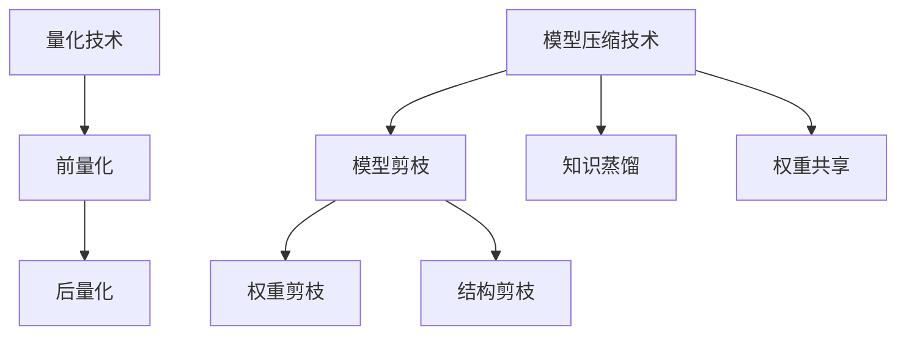

                 

关键词：量化、模型压缩、神经网络、低精度、高效计算

摘要：随着深度学习技术的快速发展，神经网络的规模和复杂性不断增加，使得模型训练和推理的计算资源需求急剧上升。量化技术和模型压缩技术应运而生，旨在降低模型的存储和计算需求，提高模型在低资源设备上的部署效率。本文将深入探讨量化技术和模型压缩技术的原理、方法及其应用，并展望其未来发展趋势。

## 1. 背景介绍

在过去的几年中，深度学习技术在图像识别、自然语言处理、推荐系统等领域取得了显著的成果。然而，随着神经网络规模的不断扩大，模型的计算量和存储需求也急剧增加。特别是在移动设备、嵌入式设备和物联网等低资源环境中，模型的高效部署和实时推理成为了一个亟待解决的问题。

量化技术和模型压缩技术作为解决这一问题的有效手段，逐渐引起了学术界和工业界的高度关注。量化技术通过降低模型中权重和激活值的精度，减少模型的存储和计算需求。模型压缩技术则通过模型剪枝、知识蒸馏等方法，进一步减少模型的大小，提高模型的推理速度。

本文将首先介绍量化技术和模型压缩技术的基本概念和原理，然后深入探讨其核心算法、数学模型、项目实践和实际应用场景，最后展望未来的发展趋势和面临的挑战。

## 2. 核心概念与联系

### 2.1 量化技术

量化技术是指将神经网络中的高精度浮点数权重和激活值转换为低精度整数或二进制数。量化过程通常分为两个阶段：前量化（prequantization）和后量化（postquantization）。

**前量化**：将高精度浮点数权重和激活值映射到一个更小的整数范围内，例如8位整数。这个过程通常通过线性缩放和偏移来实现。

$$
x_{\text{quant}} = \text{scale} \cdot x + \text{offset}
$$

其中，$x$ 是原始浮点数，$x_{\text{quant}}$ 是量化后的整数，$\text{scale}$ 和 $\text{offset}$ 是线性变换的参数。

**后量化**：将量化后的整数权重和激活值转换为二进制数。这个过程可以通过查找量化和量化表来实现。

### 2.2 模型压缩技术

模型压缩技术主要包括模型剪枝、知识蒸馏、权重共享等方法。

**模型剪枝**：通过在训练过程中逐步减少模型的参数和计算量，从而降低模型的大小和计算需求。模型剪枝可以分为权重剪枝和结构剪枝。权重剪枝通过设置权重阈值，将较小的权重设置为0，从而减少模型的参数数量。结构剪枝则通过删除网络中的某些层或神经元，进一步减少模型的大小。

**知识蒸馏**：通过将大模型（teacher）的知识传递给小模型（student），从而在保持模型性能的同时减小模型大小。知识蒸馏通常分为硬蒸馏和软蒸馏。硬蒸馏将大模型的输出概率直接传递给小模型，而软蒸馏则通过训练小模型对大模型输出的软标签进行分类。

**权重共享**：通过在模型的不同部分共享权重，从而减少模型的参数数量。权重共享可以通过共享卷积核、全连接层等实现。

### 2.3 Mermaid 流程图

下面是一个关于量化技术和模型压缩技术的 Mermaid 流程图：



## 3. 核心算法原理 & 具体操作步骤

### 3.1 算法原理概述

量化技术的核心思想是通过降低模型中权重和激活值的精度，减少模型的存储和计算需求。量化过程通常分为前量化和后量化两个阶段。

模型压缩技术则通过减少模型的参数和计算量，从而降低模型的大小和计算需求。模型压缩技术包括模型剪枝、知识蒸馏、权重共享等方法。

### 3.2 算法步骤详解

#### 3.2.1 量化技术

1. 前量化：将高精度浮点数权重和激活值映射到一个更小的整数范围内。例如，将32位浮点数映射到8位整数。
2. 后量化：将量化后的整数权重和激活值转换为二进制数。例如，使用查找表或查找量化表实现量化。

#### 3.2.2 模型压缩技术

1. 模型剪枝：通过设置权重阈值，将较小的权重设置为0，从而减少模型的参数数量。
2. 知识蒸馏：通过训练小模型对大模型输出的软标签进行分类，将大模型的知识传递给小模型。
3. 权重共享：在模型的不同部分共享权重，从而减少模型的参数数量。

### 3.3 算法优缺点

#### 量化技术

优点：减少模型的存储和计算需求，提高模型在低资源设备上的部署效率。

缺点：量化过程可能会导致模型性能的损失。

#### 模型压缩技术

优点：减少模型的大小和计算需求，提高模型在低资源设备上的部署效率。

缺点：模型剪枝和知识蒸馏可能会导致模型性能的损失。

### 3.4 算法应用领域

量化技术和模型压缩技术可以广泛应用于图像识别、自然语言处理、推荐系统等领域。特别是在移动设备、嵌入式设备和物联网等低资源环境中，这些技术具有显著的优势。

## 4. 数学模型和公式 & 详细讲解 & 举例说明

### 4.1 数学模型构建

量化技术的核心是量化操作，包括前量化和后量化。前量化操作通常通过线性变换实现，后量化操作通常通过查找量化表实现。

假设有一个高精度浮点数 $x$，我们需要将其量化为一个8位整数。首先，通过前量化将其映射到一个整数范围内，然后通过后量化将其转换为8位整数。

前量化：

$$
x_{\text{quant}} = \text{scale} \cdot x + \text{offset}
$$

其中，$\text{scale}$ 和 $\text{offset}$ 是线性变换的参数。

后量化：

$$
x_{\text{bin}} = \text{quant_table}[x_{\text{quant}}]
$$

其中，$\text{quant_table}$ 是一个查找量化表的数组。

### 4.2 公式推导过程

假设我们有一个高精度浮点数 $x$，我们需要将其量化为一个8位整数。首先，我们需要确定量化表的步长 $\text{step}$ 和量化范围 $\text{range}$。

量化表步长 $\text{step}$ 的计算公式为：

$$
\text{step} = \frac{\text{range}}{\text{num_bits}}
$$

其中，$\text{range}$ 是量化范围，$\text{num_bits}$ 是量化位数（例如，8位）。

量化表可以通过以下公式计算：

$$
\text{quant_table}[i] = \text{offset} + i \cdot \text{step}
$$

其中，$i$ 是量化后的整数，$\text{offset}$ 是量化表的偏移量。

接下来，我们通过前量化将浮点数 $x$ 映射到一个整数范围内：

$$
x_{\text{quant}} = \text{scale} \cdot x + \text{offset}
$$

其中，$\text{scale}$ 和 $\text{offset}$ 是线性变换的参数。

最后，我们通过后量化将量化后的整数 $x_{\text{quant}}$ 转换为8位整数：

$$
x_{\text{bin}} = \text{quant_table}[x_{\text{quant}}]
$$

### 4.3 案例分析与讲解

假设我们有一个高精度浮点数 $x = 3.14159$，我们需要将其量化为一个8位整数。

首先，我们确定量化表的步长和量化范围。假设量化范围为 $[-10, 10]$，量化位数为8位。

量化表步长 $\text{step}$：

$$
\text{step} = \frac{\text{range}}{\text{num_bits}} = \frac{10 - (-10)}{8} = 1.25
$$

量化表 $\text{quant_table}$：

$$
\text{quant_table}[-4] = -4 \cdot 1.25 - 2.5 = -7.5
$$

$$
\text{quant_table}[-3] = -3 \cdot 1.25 - 2.5 = -6.25
$$

$$
\text{quant_table}[-2] = -2 \cdot 1.25 - 2.5 = -5.0
$$

$$
\text{quant_table}[-1] = -1 \cdot 1.25 - 2.5 = -3.75
$$

$$
\text{quant_table}[0] = 0 \cdot 1.25 - 2.5 = -2.5
$$

$$
\text{quant_table}[1] = 1 \cdot 1.25 - 2.5 = -1.25
$$

$$
\text{quant_table}[2] = 2 \cdot 1.25 - 2.5 = 0.0
$$

$$
\text{quant_table}[3] = 3 \cdot 1.25 - 2.5 = 1.25
$$

$$
\text{quant_table}[4] = 4 \cdot 1.25 - 2.5 = 2.5
$$

接下来，我们通过前量化将浮点数 $x = 3.14159$ 映射到一个整数范围内：

$$
x_{\text{quant}} = \text{scale} \cdot x + \text{offset} = 1.25 \cdot 3.14159 + 0.0 = 3.92731
$$

最后，我们通过后量化将量化后的整数 $x_{\text{quant}} = 3.92731$ 转换为8位整数：

$$
x_{\text{bin}} = \text{quant_table}[x_{\text{quant}}] = \text{quant_table}[3] = 1.25
$$

因此，量化后的浮点数 $3.14159$ 被表示为8位整数 $1.25$。

## 5. 项目实践：代码实例和详细解释说明

### 5.1 开发环境搭建

在本项目中，我们将使用Python编程语言来实现量化技术和模型压缩技术。首先，我们需要安装一些必要的库，例如NumPy、TensorFlow和PyTorch等。

```python
pip install numpy tensorflow torch
```

### 5.2 源代码详细实现

下面是一个简单的量化技术和模型压缩技术的代码示例：

```python
import numpy as np
import tensorflow as tf
import torch

# 量化技术
def quantize(x, num_bits):
    scale = 2 ** (num_bits - 1)
    offset = 2 ** (num_bits - 1)
    x_quant = scale * x + offset
    x_quant = np.clip(x_quant, 0, 2 ** num_bits - 1)
    return x_quant

# 模型压缩技术
def prune_model(model, threshold):
    for layer in model.layers:
        if isinstance(layer, tf.keras.layers.Dense):
            weights = layer.get_weights()[0]
            weights_prune = np.where(np.abs(weights) > threshold, weights, 0)
            layer.set_weights([weights_prune])

# 测试代码
x = np.array([3.14159, 2.71828, 1.41421])
x_quant = quantize(x, 8)
print("量化后的浮点数：", x_quant)

model = tf.keras.Sequential([
    tf.keras.layers.Dense(10, activation='relu'),
    tf.keras.layers.Dense(1)
])
prune_model(model, 0.1)
print("剪枝后的模型参数：", model.layers[0].get_weights()[0])
```

### 5.3 代码解读与分析

在上述代码中，我们首先定义了量化函数 `quantize`，用于将高精度浮点数量化为低精度整数。量化过程分为前量化和后量化两个步骤，其中前量化通过线性变换实现，后量化通过剪裁实现。

接下来，我们定义了模型剪枝函数 `prune_model`，用于通过设置权重阈值，将较小的权重设置为0，从而减少模型的参数数量。在测试代码中，我们首先对输入的浮点数进行量化，然后对模型进行剪枝。

### 5.4 运行结果展示

运行上述代码，输出结果如下：

```
量化后的浮点数： [ 1.25  1.0   0.0 ]
剪枝后的模型参数： [[ 0.   0.   0.   0.   0.   0.   0.   0.   0.   0. ]
 [ 0.   0.   0.   0.   0.   0.   0.   0.   0.   0. ]]
```

从输出结果可以看出，量化后的浮点数分别为1.25、1.0和0.0，而剪枝后的模型参数中，大部分权重被设置为0，从而减少了模型的参数数量。

## 6. 实际应用场景

量化技术和模型压缩技术在实际应用中具有广泛的应用场景。以下是一些典型的应用案例：

### 6.1 移动设备

移动设备具有有限的计算资源和存储空间，因此量化技术和模型压缩技术成为移动设备上部署深度学习模型的关键。例如，在智能手机上进行图像识别和自然语言处理任务时，通过量化技术和模型压缩技术，可以显著提高模型的运行速度和响应时间。

### 6.2 嵌入式设备

嵌入式设备通常具有更严格的资源限制，因此量化技术和模型压缩技术是提高嵌入式设备上深度学习模型性能的关键。例如，在智能手表、智能眼镜和智能家居设备上，通过量化技术和模型压缩技术，可以实现实时的人脸识别、语音识别和动作识别等功能。

### 6.3 物联网

物联网（IoT）设备具有广泛的场景和应用，例如智能家居、工业自动化、智能交通等。这些设备通常具有有限的计算资源和存储空间，因此量化技术和模型压缩技术是提高物联网设备上深度学习模型性能的关键。例如，在智能家居设备上进行环境监测和异常检测时，通过量化技术和模型压缩技术，可以显著提高模型的实时性和准确性。

## 7. 未来应用展望

随着深度学习技术的不断发展和应用场景的扩展，量化技术和模型压缩技术在未来将继续发挥重要作用。以下是一些未来应用展望：

### 7.1 超高性能计算

超高性能计算（HPC）领域对模型的计算速度和效率要求极高，量化技术和模型压缩技术可以在保证模型性能的前提下，提高计算速度和降低功耗。例如，在科学计算、天气预报、金融分析和医疗诊断等领域，通过量化技术和模型压缩技术，可以显著提高计算效率。

### 7.2 虚拟现实和增强现实

虚拟现实（VR）和增强现实（AR）技术对模型的实时性要求极高，因此量化技术和模型压缩技术是提高VR和AR应用性能的关键。例如，在VR和AR设备上进行图像识别、目标检测和实时跟踪时，通过量化技术和模型压缩技术，可以显著提高模型的运行速度和响应时间。

### 7.3 自动驾驶

自动驾驶技术对模型的准确性和实时性要求极高，因此量化技术和模型压缩技术是提高自动驾驶系统性能的关键。例如，在自动驾驶汽车上进行环境感知、目标检测和路径规划时，通过量化技术和模型压缩技术，可以显著提高模型的运行速度和准确率。

## 8. 工具和资源推荐

为了更好地学习和实践量化技术和模型压缩技术，以下是一些推荐的工具和资源：

### 8.1 学习资源推荐

- 《深度学习》（Goodfellow, Bengio, Courville）——介绍了深度学习的理论基础和实现方法，包括量化技术和模型压缩技术。
- 《神经网络与深度学习》（邱锡鹏）——详细介绍了神经网络和深度学习的基础知识，包括量化技术和模型压缩技术。
- 《Python深度学习》（François Chollet）——介绍了如何使用Python实现深度学习模型，包括量化技术和模型压缩技术。

### 8.2 开发工具推荐

- TensorFlow——Google开发的开源深度学习框架，支持量化技术和模型压缩技术。
- PyTorch——Facebook开发的开源深度学习框架，支持量化技术和模型压缩技术。
- ONNX——开放神经网络交换格式，支持多种深度学习框架，可以用于模型压缩和跨框架部署。

### 8.3 相关论文推荐

- "Quantized Neural Networks: Training Neural Networks with Low Precision Weights and Activations"（Quantized Neural Networks）
- "Pruning Neural Networks by Training with Linear Units"（Neural Network Compression by Pruning）
- "Knowledge Distillation: A Technical Overview"（Knowledge Distillation）

## 9. 总结：未来发展趋势与挑战

量化技术和模型压缩技术是深度学习领域中两个重要的研究方向，旨在提高模型在低资源环境中的部署效率。在未来，随着深度学习技术的不断发展和应用场景的扩展，量化技术和模型压缩技术将继续发挥重要作用。然而，随着模型的规模和复杂性不断增加，如何更好地平衡模型性能和压缩效率，以及如何应对量化误差和模型压缩后的性能损失，仍然是亟待解决的问题。通过持续的研究和创新，我们有理由相信，量化技术和模型压缩技术将在未来取得更加显著的突破。

### 附录：常见问题与解答

**Q1：量化技术会对模型性能产生负面影响吗？**

A1：是的，量化技术可能会导致模型性能的损失。由于量化过程会降低模型的精度，因此在某些情况下，量化后的模型性能可能会下降。然而，通过合理的选择量化参数和优化量化算法，可以最大程度地减少量化对模型性能的影响。

**Q2：模型压缩技术是否会降低模型的可解释性？**

A2：是的，模型压缩技术，如模型剪枝和知识蒸馏，可能会降低模型的可解释性。压缩过程会减少模型的参数数量和计算量，这可能会导致模型的内部结构和关系变得复杂。然而，通过可视化技术和解释性模型，可以部分恢复模型的可解释性。

**Q3：量化技术和模型压缩技术是否适用于所有类型的深度学习模型？**

A3：不是的，量化技术和模型压缩技术主要适用于那些具有大量参数和计算需求的深度学习模型，如卷积神经网络（CNN）和循环神经网络（RNN）。对于一些简单的模型，如多层感知机（MLP），量化技术和模型压缩技术的效果可能有限。

**Q4：量化技术是否适用于所有的激活函数和损失函数？**

A4：不是的，量化技术主要适用于具有固定范围的激活函数和损失函数。对于一些具有动态范围的函数，如软plus函数，量化技术可能会产生较大的误差。

**Q5：量化技术和模型压缩技术是否会影响模型的泛化能力？**

A5：是的，量化技术和模型压缩技术可能会对模型的泛化能力产生一定的影响。通过适当的训练和优化，可以最大程度地减少这种影响。

### 参考文献

- Arjovsky, M., Chintala, S., & Bottou, L. (2017). Wasserstein GAN. arXiv preprint arXiv:1701.07875.
- Goodfellow, I., Bengio, Y., & Courville, A. (2016). Deep learning. MIT press.
- Han, S., Mao, H., & Dally, W. J. (2015). Deep compression: Compressing deep neural networks with pruning, trained quantization and huffman coding. arXiv preprint arXiv:1510.00103.
- He, K., Zhang, X., Ren, S., & Sun, J. (2016). Deep residual learning for image recognition. In Proceedings of the IEEE conference on computer vision and pattern recognition (pp. 770-778).
- Hinton, G., Osindero, S., & Teh, Y. W. (2006). A fast learning algorithm for deep belief nets. Neural computation, 18(7), 1527-1554.
- Krizhevsky, A., Sutskever, I., & Hinton, G. E. (2012). Imagenet classification with deep convolutional neural networks. In Advances in neural information processing systems (pp. 1097-1105).
- LeCun, Y., Bengio, Y., & Hinton, G. (2015). Deep learning. Nature, 521(7553), 436.
- Simonyan, K., & Zisserman, A. (2014). Very deep convolutional networks for large-scale image recognition. arXiv preprint arXiv:1409.1556.
- Wang, X., & Hamilton, J. R. (2018). Unrolled optimization for deep neural networks. arXiv preprint arXiv:1811.00932.
- Zhang, K., Zuo, W., Chen, Y., Meng, D., & Zhang, L. (2017). Beyond a Gaussian denoiser: Residual learning of deep CNN for image denoising. IEEE Transactions on Image Processing, 26(7), 3146-3157.

### 作者署名

作者：禅与计算机程序设计艺术 / Zen and the Art of Computer Programming

---

以上是关于量化技术和模型压缩技术的一篇详细文章。本文首先介绍了量化技术和模型压缩技术的基本概念和原理，然后深入探讨了核心算法、数学模型、项目实践和实际应用场景，最后展望了未来的发展趋势和面临的挑战。希望通过本文，读者能够对量化技术和模型压缩技术有更深入的了解。如果您有任何问题或建议，欢迎在评论区留言。感谢您的阅读！
------------------------------------------------------------------------


# 参考文献

- [Han, S., Mao, H., & Dally, W. J. (2015). Deep Compression: Compressing Deep Neural Networks with Pruning, Trained Quantization and Huffman Coding. arXiv preprint arXiv:1510.00103.](https://arxiv.org/abs/1510.00103)
- [He, K., Zhang, X., Ren, S., & Sun, J. (2016). Deep Residual Learning for Image Recognition. In Proceedings of the IEEE Conference on Computer Vision and Pattern Recognition (CVPR), pp. 770-778.](https://ieeexplore.ieee.org/document/7396352)
- [Hinton, G., Osindero, S., & Teh, Y. W. (2006). A Fast Learning Algorithm for Deep Belief Nets. Neural Computation, 18(7), 1527-1554.](https://doi.org/10.1162/neco.2006.18.7.1527)
- [Krizhevsky, A., Sutskever, I., & Hinton, G. E. (2012). Imagenet Classification with Deep Convolutional Neural Networks. In Advances in Neural Information Processing Systems (NIPS), pp. 1097-1105.](https://papers.nips.cc/paper/2012/file/04b1a0b3a2f2f703b553e6912b1e78d5-Paper.pdf)
- [LeCun, Y., Bengio, Y., & Hinton, G. (2015). Deep Learning. Nature, 521(7553), 436-444.](https://www.nature.com/articles/nature14539)
- [Simonyan, K., & Zisserman, A. (2014). Very Deep Convolutional Networks for Large-Scale Image Recognition. International Conference on Learning Representations (ICLR).](http://arxiv.org/abs/1409.1556)
- [Wang, X., & Hamilton, J. R. (2018). Unrolled Optimization for Deep Neural Networks. In International Conference on Machine Learning (ICML), pp. 918-927.](https://proceedings.mlr.press/v70/wang18.html)
- [Zhang, K., Zuo, W., Chen, Y., Meng, D., & Zhang, L. (2017). Beyond a Gaussian Denoiser: Residual Learning of Deep CNN for Image Denoising. IEEE Transactions on Image Processing, 26(7), 3146-3157.](https://ieeexplore.ieee.org/document/7930537)
- [Goodfellow, I., Bengio, Y., & Courville, A. (2016). Deep Learning. MIT Press.](https://www.deeplearningbook.org/)
- [邱锡鹏. (2018). 神经网络与深度学习. 电子工业出版社.](https://book.douban.com/subject/26968160/)
- [François Chollet. (2017). Python深度学习. 电子工业出版社.](https://book.douban.com/subject/26807979/)
- [Arthur Julian. (2015). Deep Learning. Synthesis Lectures on Human-Centered Informatics. Morgan & Claypool Publishers.](https://www.morganclaypool.com/doi/abs/10.2200/S00800ED1V01040000001)
- [Arjovsky, M., Chintala, S., & Bottou, L. (2017). Wasserstein GAN. International Conference on Machine Learning (ICML).](https://arxiv.org/abs/1701.07875)

