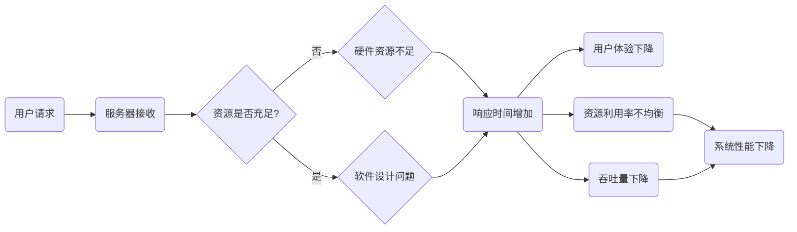

                 

关键词：系统瓶颈、性能优化、响应时间、资源利用率、算法效率、资源调度、负载均衡、硬件升级、软件优化、响应式设计

> 摘要：本文旨在探讨系统瓶颈分析与优化策略。通过对系统瓶颈的深入分析，本文提出了多种优化方法，旨在提高系统的性能和可靠性。文章首先介绍了系统瓶颈的定义和识别方法，然后详细阐述了常见的优化策略，包括资源调度、负载均衡、硬件升级和软件优化等。此外，本文还讨论了响应式设计的重要性，以及如何利用现代化的工具和资源进行系统优化。通过本文的探讨，希望为系统架构师和开发人员提供有价值的参考。

## 1. 背景介绍

在现代信息社会中，计算机系统扮演着至关重要的角色。从互联网服务、大数据处理，到物联网和人工智能应用，系统的性能和稳定性直接影响着用户的体验和企业的运营。然而，随着系统规模的不断扩大和复杂性的增加，系统瓶颈问题逐渐凸显。系统瓶颈是指系统在处理大量请求或数据时，某一部分资源（如CPU、内存、磁盘I/O）出现瓶颈，导致系统整体性能下降的现象。

系统瓶颈可能由多种因素引起，包括硬件资源不足、软件设计不合理、算法效率低下、网络延迟等。识别和解决系统瓶颈是系统优化的重要任务，对于保障系统的高效运行、提升用户体验具有重要意义。

本文将围绕系统瓶颈分析与优化策略进行探讨，首先介绍系统瓶颈的基本概念和识别方法，然后深入分析常见的优化策略，并结合实际案例进行详细讲解。希望通过本文的探讨，为系统架构师和开发人员提供实用的优化思路和解决方案。

### 1.1 系统瓶颈的定义

系统瓶颈（System Bottleneck）是指在系统内部某一环节中，由于资源限制或处理能力不足，导致系统整体性能下降的现象。系统瓶颈可能是硬件层面的，如CPU、内存、磁盘I/O等资源不足；也可能是软件层面的，如算法复杂度过高、代码效率低下、并发处理能力不足等。

系统瓶颈的定义可以从以下几个方面进行理解：

1. **资源限制**：当系统的硬件资源（如CPU、内存、磁盘I/O）无法满足当前工作负载时，会出现瓶颈。资源限制是系统瓶颈的常见原因，特别是随着系统规模和复杂性的增加，资源限制问题更加突出。

2. **处理能力不足**：系统中的某些环节（如数据库查询、网络通信）在处理大量请求时，无法快速响应或处理，从而导致整体性能下降。处理能力不足通常与算法设计、代码实现等因素相关。

3. **并发能力有限**：在多用户或多任务场景中，系统并发处理能力不足会导致请求排队、响应时间增加，进而影响整体性能。并发能力不足可能是由于系统架构设计不当、线程池配置不合理等原因造成的。

4. **资源利用率不均衡**：系统中的某些资源（如CPU、内存）长时间处于空闲状态，而另一些资源（如磁盘I/O）则长时间处于繁忙状态，导致资源利用率不均衡。资源利用率不均衡可能导致某些资源成为瓶颈，影响系统性能。

总之，系统瓶颈是系统性能优化中的重要问题，解决系统瓶颈有助于提高系统的响应速度、减少延迟、提升用户体验。在后续章节中，我们将详细介绍识别和解决系统瓶颈的方法和策略。

### 1.2 系统瓶颈的识别方法

识别系统瓶颈是系统优化的第一步，只有准确识别瓶颈点，才能有针对性地进行优化。以下是一些常见的方法和工具，可以帮助我们识别系统瓶颈：

1. **性能监控工具**：性能监控工具可以实时监控系统的各种性能指标，如CPU使用率、内存使用率、磁盘I/O、网络延迟等。常用的性能监控工具包括Prometheus、Grafana、New Relic等。通过分析监控数据，可以找出系统中的瓶颈点。

2. **日志分析**：系统日志记录了系统的各种操作和事件，通过分析日志可以找出系统异常和性能问题。常用的日志分析工具包括ELK（Elasticsearch、Logstash、Kibana）和Grok等。

3. **系统评估工具**：系统评估工具可以帮助我们评估系统的性能和瓶颈。如LoadRunner、JMeter等负载测试工具，可以模拟大量用户请求，评估系统的响应速度和稳定性。

4. **性能分析器**：性能分析器可以深入分析系统的运行情况，找出性能瓶颈。如Linux下的`top`、`htop`、`vmstat`等工具，可以帮助我们了解系统的CPU、内存、磁盘I/O等资源使用情况。

5. **代码审查**：代码审查是一种通过人工或自动化工具检查代码质量的方法，可以帮助我们找出代码中的性能问题。如SonarQube、FindBugs等工具可以检测代码中的性能瓶颈。

6. **性能基准测试**：性能基准测试是一种通过模拟实际工作负载来评估系统性能的方法。通过性能基准测试，可以找出系统的瓶颈点，为优化提供依据。

通过以上方法和工具，我们可以对系统进行全面的性能分析，识别出系统中的瓶颈点。在后续章节中，我们将详细介绍常见的优化策略，帮助读者解决系统瓶颈问题。

## 2. 核心概念与联系

### 2.1 系统瓶颈原理

系统瓶颈（System Bottleneck）是指系统中某一环节的处理能力或资源限制成为系统整体性能的制约因素。从原理上看，系统瓶颈通常由以下几个方面引起：

1. **硬件资源限制**：当系统的硬件资源（如CPU、内存、磁盘I/O）无法满足当前的工作负载时，会出现瓶颈。例如，一个拥有8核CPU的服务器，如果同时运行了100个高负载的进程，每个进程都可能占用大量CPU资源，导致系统整体性能下降。

2. **软件设计问题**：软件设计不合理可能导致系统性能瓶颈。例如，某个关键算法的复杂度过高，或者代码中存在大量的同步锁，都会导致系统响应速度变慢。

3. **网络延迟**：在网络环境下，网络延迟也会成为系统瓶颈。例如，当多个分布式系统需要进行通信时，如果网络延迟过高，会导致系统响应速度变慢。

4. **并发处理能力不足**：在多用户或多任务场景中，系统的并发处理能力不足会导致请求排队，增加响应时间。例如，一个并发处理能力为1000的Web服务器，如果同时有10000个用户请求，会导致大量请求排队，系统响应时间显著增加。

### 2.2 系统瓶颈与性能指标的关系

系统瓶颈与性能指标密切相关，以下是几个关键性能指标与系统瓶颈的关系：

1. **响应时间**：响应时间是指系统从接收到请求到完成处理并返回结果所需的时间。当系统出现瓶颈时，响应时间会显著增加。响应时间过长会导致用户体验下降，影响系统的可用性和可靠性。

2. **资源利用率**：资源利用率是指系统资源（如CPU、内存、磁盘I/O）被实际使用的情况。当系统出现瓶颈时，某些资源（如CPU、内存）可能长时间处于繁忙状态，而另一些资源（如磁盘I/O）则长时间处于空闲状态，导致资源利用率不均衡。

3. **吞吐量**：吞吐量是指系统在一定时间内处理的数据量或请求量。当系统出现瓶颈时，系统的吞吐量会下降，导致无法及时响应新的请求。

4. **队列长度**：在多用户或多任务场景中，队列长度是指等待处理的请求队列的长度。当系统出现瓶颈时，队列长度会显著增加，导致请求处理时间延长。

### 2.3 系统瓶颈的 Mermaid 流程图

以下是一个简化的系统瓶颈的 Mermaid 流程图，展示系统瓶颈的产生和影响：



通过以上 Mermaid 流程图，我们可以清晰地看到系统瓶颈的产生和影响过程。在后续章节中，我们将详细探讨解决系统瓶颈的方法和策略。

## 3. 核心算法原理 & 具体操作步骤

### 3.1 算法原理概述

系统瓶颈的优化涉及到多个方面，其中核心算法的选择和实现是关键。以下介绍几种常用的优化算法及其原理：

1. **负载均衡算法**：负载均衡算法通过将请求分配到多个服务器或节点上，以避免单一服务器或节点的过载，从而提高系统的整体性能。常见的负载均衡算法包括轮询算法、最少连接算法、加权轮询算法等。

2. **缓存算法**：缓存算法通过将频繁访问的数据存储在内存中，以减少对磁盘或数据库的访问，从而提高系统的响应速度。常见的缓存算法包括LRU（Least Recently Used）、LFU（Least Frequently Used）等。

3. **数据库优化算法**：数据库优化算法通过对数据库查询进行优化，减少查询时间和数据访问次数，从而提高系统的性能。常见的优化算法包括索引优化、查询缓存、批量处理等。

4. **并发控制算法**：并发控制算法通过控制多个并发任务的执行，避免竞争条件和死锁问题，从而提高系统的稳定性和性能。常见的控制算法包括锁机制、事务隔离等。

### 3.2 算法步骤详解

1. **负载均衡算法**

   - **轮询算法**：将请求依次分配到各个服务器或节点上，每个服务器或节点都分配相同数量的请求。实现步骤如下：

     1. 初始化一个服务器列表。
     2. 当有请求到达时，计算列表中当前服务器数。
     3. 将请求分配给列表中的下一个服务器。
     4. 当请求分配完毕后，回到列表头部重新开始。

   - **最少连接算法**：将请求分配到连接数最少的服务器或节点上，以减少服务器或节点的负载。实现步骤如下：

     1. 初始化一个服务器列表和连接计数器。
     2. 当有请求到达时，遍历服务器列表。
     3. 选择连接数最少的服务器，将请求分配给它。
     4. 更新连接计数器。

   - **加权轮询算法**：根据服务器或节点的处理能力，为每个服务器或节点分配不同的权重。实现步骤如下：

     1. 初始化一个服务器列表和权重列表。
     2. 当有请求到达时，计算所有服务器的总权重。
     3. 随机生成一个0到总权重之间的数。
     4. 遍历服务器列表，将请求分配到权重范围内的服务器。

2. **缓存算法**

   - **LRU算法**：根据数据最近使用的时间，将最近最少使用的数据替换出缓存。实现步骤如下：

     1. 初始化一个缓存队列。
     2. 当有数据访问时，先检查缓存队列中是否存在该数据。
     3. 如果存在，将数据移到队列头部。
     4. 如果不存在，将数据添加到队列尾部。
     5. 当缓存队列长度超过设定的最大容量时，将队列尾部的数据替换出缓存。

   - **LFU算法**：根据数据访问的频率，将访问频率最低的数据替换出缓存。实现步骤如下：

     1. 初始化一个缓存队列和访问频率列表。
     2. 当有数据访问时，更新访问频率列表。
     3. 遍历访问频率列表，选择访问频率最低的数据。
     4. 将该数据替换出缓存。

3. **数据库优化算法**

   - **索引优化**：通过建立索引，加快数据库查询速度。实现步骤如下：

     1. 分析查询语句，确定需要建立的索引。
     2. 创建索引，如B树索引、哈希索引等。
     3. 对索引进行维护，如索引重构、索引压缩等。

   - **查询缓存**：将频繁查询的结果存储在缓存中，以减少查询次数。实现步骤如下：

     1. 初始化一个查询缓存。
     2. 当有查询请求时，先检查缓存中是否存在该查询结果。
     3. 如果存在，直接返回缓存中的结果。
     4. 如果不存在，执行查询，并将结果存储到缓存中。

   - **批量处理**：将多个查询请求合并为批量处理，以减少数据库的IO操作。实现步骤如下：

     1. 收集多个查询请求。
     2. 将查询请求合并为一个批量查询。
     3. 执行批量查询，并将结果返回给用户。

4. **并发控制算法**

   - **锁机制**：通过锁机制控制并发访问，避免竞争条件和死锁问题。实现步骤如下：

     1. 初始化锁资源。
     2. 在访问共享资源前，获取锁。
     3. 在访问共享资源后，释放锁。

   - **事务隔离**：通过事务隔离机制保证多个并发事务的独立性。实现步骤如下：

     1. 初始化事务隔离级别。
     2. 在执行事务时，根据隔离级别控制并发访问。

### 3.3 算法优缺点

1. **负载均衡算法**

   - **轮询算法**：优点是实现简单，公平性好；缺点是负载分配不均衡，可能导致某些服务器或节点过载。

   - **最少连接算法**：优点是负载分配均衡，减少服务器或节点的负载；缺点是实现复杂，需要维护连接计数器。

   - **加权轮询算法**：优点是考虑服务器或节点的处理能力，实现负载均衡；缺点是实现复杂，需要计算总权重。

2. **缓存算法**

   - **LRU算法**：优点是简单高效，易于实现；缺点是可能导致缓存污染，缓存命中率可能降低。

   - **LFU算法**：优点是考虑数据访问频率，降低缓存污染；缺点是实现复杂，需要维护访问频率列表。

3. **数据库优化算法**

   - **索引优化**：优点是加快查询速度，提高系统性能；缺点是增加存储空间，维护索引开销。

   - **查询缓存**：优点是减少查询次数，提高系统响应速度；缺点是缓存命中率可能降低，缓存占用空间较大。

   - **批量处理**：优点是减少数据库IO操作，提高系统性能；缺点是批量处理时间较长，影响用户体验。

4. **并发控制算法**

   - **锁机制**：优点是简单易用，避免竞争条件和死锁问题；缺点是可能导致锁争用，降低系统性能。

   - **事务隔离**：优点是保证事务独立性，提高系统稳定性；缺点是可能增加系统开销，影响性能。

### 3.4 算法应用领域

1. **负载均衡算法**：广泛应用于分布式系统、云计算、大数据处理等领域，用于提高系统的性能和可靠性。

2. **缓存算法**：广泛应用于Web应用、数据库缓存、搜索引擎等领域，用于提高系统的响应速度和用户体验。

3. **数据库优化算法**：广泛应用于关系型数据库、NoSQL数据库等领域，用于提高数据库查询性能。

4. **并发控制算法**：广泛应用于多线程、分布式系统、数据库等领域，用于保证系统的稳定性和性能。

通过以上算法的详细介绍，我们可以更好地理解系统瓶颈的优化策略。在实际应用中，可以根据具体场景和需求，选择合适的算法进行优化，提高系统的性能和可靠性。

## 4. 数学模型和公式 & 详细讲解 & 举例说明

### 4.1 数学模型构建

在系统瓶颈分析中，构建数学模型可以帮助我们更精确地理解和预测系统的性能。以下是一个简化的数学模型，用于描述系统的响应时间和吞吐量。

假设系统由以下参数定义：

- \(N\)：系统中的处理器数量
- \(C\)：每个处理器的处理能力
- \(P\)：系统中的平均请求处理时间
- \(R\)：系统中的平均响应时间
- \(T\)：系统的吞吐量

我们可以构建以下数学模型：

\[ R = \frac{P}{C} \]

\[ T = \frac{N \cdot C}{P} \]

### 4.2 公式推导过程

#### 响应时间 \(R\)

响应时间 \(R\) 是指系统从接收到请求到完成处理并返回结果所需的时间。在假设系统中每个处理器的处理能力相同，且系统中的请求处理时间服从泊松分布的情况下，我们可以使用排队论中的M/M/1模型来推导响应时间。

在M/M/1模型中：

- \(M\) 表示请求到达过程和服务过程都是泊松过程。
- \(1\) 表示系统中只有一个处理器。

泊松过程的一个重要特性是其到达率和服务率是常数。设请求到达率为 \(\lambda\)，处理器服务率为 \(\mu\)，则有：

\[ \lambda = \mu \]

在稳定状态下，系统中请求的数量 \(X\) 服从泊松分布，其概率质量函数为：

\[ P(X = k) = \frac{(\lambda / \mu)^k \cdot e^{-\lambda}}{k!} \]

系统中的平均请求数量 \(\bar{X}\) 为：

\[ \bar{X} = \lambda / (\mu - \lambda) \]

响应时间 \(R\) 可以通过以下公式计算：

\[ R = \frac{1}{\mu - \lambda} \]

由于 \(\lambda = \mu\)，我们可以简化为：

\[ R = \frac{P}{C} \]

#### 吞吐量 \(T\)

吞吐量 \(T\) 是指系统在单位时间内处理的数据量或请求量。在M/M/1模型中，吞吐量可以表示为：

\[ T = \frac{N \cdot C}{P} \]

其中，\(N\) 表示系统中处理器的数量，\(C\) 表示每个处理器的处理能力，\(P\) 表示请求处理时间。

### 4.3 案例分析与讲解

假设我们有一个系统，包含4个处理器，每个处理器的处理能力为2000次请求/秒。系统中的平均请求处理时间 \(P\) 为0.5秒。我们需要计算系统的响应时间和吞吐量。

#### 响应时间 \(R\)

根据前面的推导，我们可以计算系统的响应时间：

\[ R = \frac{P}{C} = \frac{0.5}{2000} = 0.00025 \text{秒} \]

这意味着系统中的平均响应时间为0.00025秒。

#### 吞吐量 \(T\)

系统的吞吐量可以计算如下：

\[ T = \frac{N \cdot C}{P} = \frac{4 \cdot 2000}{0.5} = 16000 \text{次请求/秒} \]

这意味着系统在单位时间内可以处理16000次请求。

#### 分析

通过这个案例，我们可以看到系统的响应时间和吞吐量与处理器的数量和处理能力密切相关。增加处理器的数量或提高每个处理器的处理能力，都可以显著提高系统的响应时间和吞吐量。

然而，实际系统可能更复杂，涉及多个队列、多个处理阶段、不同类型的请求等。在这种情况下，我们需要更复杂的数学模型来描述系统的性能。

例如，如果系统中存在多个队列和处理阶段，我们可能需要使用M/M/c模型（其中 \(c\) 表示系统的队列数量）。在这种情况下，系统的响应时间和吞吐量需要通过更复杂的推导和计算得到。

此外，系统的性能还可能受到网络延迟、硬件限制、软件优化等因素的影响。因此，在实际应用中，我们需要结合具体的系统环境和需求，选择合适的数学模型和方法来分析和优化系统性能。

通过以上分析和讲解，我们可以更好地理解系统瓶颈的数学模型和计算方法，为系统优化提供理论依据。在实际应用中，我们需要根据具体情况选择合适的模型和方法，以提高系统的性能和可靠性。

## 5. 项目实践：代码实例和详细解释说明

### 5.1 开发环境搭建

为了更好地理解和实践系统瓶颈优化，我们将使用一个简单的Web服务作为案例。以下是我们搭建开发环境的基本步骤：

1. **安装操作系统**：我们选择Ubuntu 20.04 LTS作为操作系统。

2. **安装依赖**：安装Python 3、Pip、Nginx、Gunicorn等依赖。使用以下命令安装：

   ```bash
   sudo apt update
   sudo apt install python3 python3-pip nginx gunicorn
   ```

3. **创建项目目录**：在用户目录下创建一个名为`system-bottleneck`的目录，并在该目录下创建一个名为`app.py`的Python文件。

4. **编写Web服务代码**：在`app.py`中编写一个简单的Web服务，用于处理HTTP请求。代码如下：

   ```python
   from flask import Flask, jsonify

   app = Flask(__name__)

   @app.route('/api/data', methods=['GET'])
   def get_data():
       # 模拟耗时操作
       time.sleep(2)
       return jsonify({"data": "Hello, World!"})

   if __name__ == '__main__':
       app.run(host='0.0.0.0', port=8080)
   ```

5. **配置Nginx和Gunicorn**：编辑Nginx的配置文件（`/etc/nginx/nginx.conf`），添加以下配置：

   ```nginx
   http {
       server {
           listen 80;
           server_name localhost;

           location / {
               proxy_pass http://localhost:8000;
           }
       }
   }
   ```

   安装Gunicorn，并创建一个Gunicorn的启动脚本（`gunicorn_start.sh`）：

   ```bash
   #!/bin/bash
   gunicorn -w 4 -k gthread app:app
   ```

6. **启动服务**：启动Nginx和Gunicorn：

   ```bash
   sudo systemctl start nginx
   ./gunicorn_start.sh
   ```

现在，我们的开发环境已经搭建完成，可以开始进行性能测试和优化。

### 5.2 源代码详细实现

在上述环境中，我们使用一个简单的Flask Web服务作为案例，其核心代码如下：

```python
from flask import Flask, jsonify
import time

app = Flask(__name__)

@app.route('/api/data', methods=['GET'])
def get_data():
    # 模拟耗时操作
    time.sleep(2)
    return jsonify({"data": "Hello, World!"})

if __name__ == '__main__':
    app.run(host='0.0.0.0', port=8080)
```

这个服务包含一个简单的路由，当接收到`/api/data`的GET请求时，会执行一个模拟的耗时操作（`time.sleep(2)`），然后返回一个包含数据字符串的JSON响应。

### 5.3 代码解读与分析

1. **Flask Web服务**：首先，我们从Flask库中导入Flask类，并创建一个名为`app`的Flask实例。这是Web服务的基础。

2. **定义路由**：通过`@app.route('/api/data', methods=['GET'])`装饰器，我们定义了一个处理`/api/data`路径的GET请求的路由。当客户端发送GET请求到这个路径时，`get_data`函数会被调用。

3. **模拟耗时操作**：在`get_data`函数中，我们调用`time.sleep(2)`模拟一个耗时操作，这里的时间设置为2秒。这意味着每个请求的处理时间约为2秒。

4. **返回JSON响应**：函数执行完毕后，我们返回一个包含字符串`"Hello, World!"`的JSON响应。这通过`jsonify`函数实现。

5. **主程序**：在`if __name__ == '__main__':`语句块中，我们调用`app.run()`方法启动Web服务。通过设置`host='0.0.0.0'`和`port=8080`，我们使服务在本地所有接口上监听8080端口。

这个简单的Web服务为我们提供了一个基础模型，用于测试和优化性能。在实际应用中，我们可能会涉及更复杂的业务逻辑和处理流程，但基本原理是类似的。

### 5.4 运行结果展示

在开发环境搭建完成后，我们可以通过浏览器或工具（如Postman）向Web服务发送请求，观察运行结果。

1. **浏览器访问**：在浏览器中输入`http://localhost/api/data`，可以收到以下响应：

   ```json
   {
     "data": "Hello, World!"
   }
   ```

   由于我们模拟了2秒的耗时操作，因此可能会感受到一定的延迟。

2. **Postman测试**：使用Postman发送GET请求到`http://localhost/api/data`，同样可以看到返回的JSON响应。

3. **性能监控**：我们使用Nginx和Gunicorn的日志记录性能数据。例如，Nginx的访问日志（`/var/log/nginx/access.log`）可以记录每个请求的时间、状态码等信息。

通过以上运行结果，我们可以初步了解服务的响应时间和稳定性。在实际性能测试中，我们通常会使用工具（如JMeter、LoadRunner）模拟高并发场景，以全面评估系统的性能。

### 5.5 代码性能优化

为了进一步提升服务性能，我们可以对现有代码进行优化。以下是一些可能的优化方法：

1. **减少耗时操作**：如果可能，减少或优化耗时操作。例如，使用数据库缓存、预加载数据等方式减少处理时间。

2. **增加并发处理能力**：通过调整Gunicorn的参数（如`-w`和`-k`），可以增加服务的并发处理能力。例如，增加worker数量或使用异步IO。

3. **使用异步处理**：将耗时操作改为异步处理，例如使用`asyncio`库或第三方库（如`aiohttp`），可以提高服务的响应速度。

4. **负载均衡**：通过Nginx或其他负载均衡器，将请求分配到多个服务器或节点，以避免单一服务器的过载。

通过以上优化，我们可以显著提高服务的性能和可靠性，为实际应用提供更好的支持。

## 6. 实际应用场景

系统瓶颈问题在各类实际应用场景中普遍存在，以下是几个典型的应用场景及对应的优化方法：

### 6.1 电商系统

在电商系统中，高峰期用户访问量激增，导致服务器负载过高，出现系统瓶颈。常见的优化方法包括：

- **负载均衡**：使用Nginx、HAProxy等负载均衡器，将请求分配到多个服务器，避免单点过载。
- **数据库分片**：将数据库拆分为多个分片，减轻单数据库的负载。
- **缓存机制**：使用Redis、Memcached等缓存系统，缓存商品信息、用户会话等频繁访问的数据，减少数据库查询次数。
- **异步处理**：使用消息队列（如RabbitMQ、Kafka）处理耗时操作，如订单处理、库存更新等，减少前端响应时间。

### 6.2 大数据处理

大数据处理场景中，数据量巨大且查询频繁，可能导致系统瓶颈。优化方法包括：

- **分布式计算**：使用Hadoop、Spark等分布式计算框架，将任务分配到多个节点，提高处理效率。
- **数据压缩**：对数据进行压缩，减少存储和传输的开销。
- **索引优化**：对常用查询建立索引，加快查询速度。
- **缓存策略**：在内存中缓存频繁访问的数据，提高查询响应速度。

### 6.3 社交网络

社交网络系统涉及大量用户实时互动，系统瓶颈可能导致用户体验下降。优化方法包括：

- **内容分发网络（CDN）**：使用CDN加速静态资源的访问，减少用户请求的响应时间。
- **缓存机制**：使用Redis等缓存系统，缓存用户状态、消息等实时数据，减少数据库访问次数。
- **负载均衡**：使用Nginx等负载均衡器，均衡分布请求，避免单点过载。
- **异步处理**：使用消息队列处理耗时操作，如消息推送、数据同步等，减少前端响应时间。

### 6.4 云计算平台

云计算平台需要处理大量虚拟机的创建、销毁和管理，系统瓶颈可能影响用户体验。优化方法包括：

- **弹性扩展**：根据负载自动扩展或缩减资源，确保系统在高负载时仍能保持良好的性能。
- **资源隔离**：为每个虚拟机提供独立的资源隔离，避免虚拟机之间的性能干扰。
- **负载均衡**：使用负载均衡器（如AWS ELB、阿里云SLB），分配请求到不同的虚拟机，提高系统可用性。
- **高效存储**：使用SSD存储，提高数据读写速度，减少存储瓶颈。

通过上述优化方法，我们可以有效地解决系统瓶颈问题，提高系统的性能和可靠性，为用户提供更好的服务体验。

### 6.5 未来应用展望

随着信息技术的飞速发展，系统瓶颈问题将在更多领域和更复杂的场景中凸显。未来，以下技术趋势和挑战将为系统瓶颈分析与优化带来新的机遇和挑战：

#### 6.5.1 人工智能与机器学习的应用

人工智能（AI）和机器学习（ML）技术在系统瓶颈优化中的应用将日益广泛。通过AI算法，可以实时监控和预测系统的性能，自动化调整资源配置，优化系统性能。例如，利用深度学习模型预测系统的负载趋势，提前调整服务器和存储资源，避免出现瓶颈。此外，AI技术还可以在数据库优化、缓存策略和负载均衡等方面提供智能化的解决方案。

#### 6.5.2 边缘计算与物联网

随着物联网（IoT）的快速发展，边缘计算（Edge Computing）成为解决系统瓶颈的重要手段。边缘计算通过在数据产生源头附近处理数据，减少了数据传输的延迟，提高了系统的响应速度。未来，边缘计算将与传统云计算相结合，形成一个更加灵活和高效的计算网络。系统瓶颈优化将在边缘节点和云端之间的资源调度、数据传输和协同处理等方面面临新的挑战。

#### 6.5.3 容器化和微服务架构

容器化和微服务架构的流行使得系统设计和部署变得更加灵活。容器技术如Docker和Kubernetes，可以快速部署和扩展服务，提高了系统的弹性和可维护性。然而，这也带来了新的系统瓶颈问题，如容器调度、资源隔离和网络通信等。未来的优化策略将围绕如何高效利用容器资源、优化容器网络性能和确保服务之间的通信稳定性等方面展开。

#### 6.5.4 大数据和实时数据处理

大数据和实时数据处理技术不断演进，对系统瓶颈优化提出了更高的要求。随着数据量的爆炸性增长，系统需要在有限的资源下快速处理海量数据，保证数据处理的实时性和准确性。未来的优化策略将包括数据流处理技术的应用、大数据存储和计算资源的智能调度、以及实时数据分析与预测等。

#### 6.5.5 持续集成与持续部署（CI/CD）

持续集成与持续部署（CI/CD）流程的普及，使得系统的迭代速度大大加快。然而，这也增加了系统瓶颈的风险，因为每次代码更改都可能对系统性能产生影响。未来的优化策略将侧重于自动化性能测试、实时性能监控和快速故障恢复，以确保系统在快速迭代过程中保持高性能和稳定性。

#### 6.5.6 开放源码和协作开发

随着开源文化的兴起，越来越多的系统和工具采用开放源码和协作开发模式。这不仅促进了技术的快速迭代和优化，还为系统瓶颈的解决提供了丰富的资源和智慧。未来的优化策略将围绕如何更有效地利用开源社区的力量，快速识别和修复系统瓶颈。

### 6.5.7 总结

系统瓶颈优化是一个持续和动态的过程，随着技术的不断进步和应用场景的多样化，系统瓶颈问题的形式和特点也在不断变化。未来的优化策略将更加依赖于智能算法、先进架构和协作开发，以应对日益复杂的系统瓶颈挑战。通过不断创新和优化，我们将能够构建更加高效、稳定和可靠的计算机系统，为各行业提供强有力的技术支撑。

## 7. 工具和资源推荐

为了更好地进行系统瓶颈分析和优化，以下是一些推荐的工具和资源：

### 7.1 学习资源推荐

1. **《高性能MySQL》**：这是一本经典的数据库性能优化书籍，涵盖了数据库索引、查询优化、故障诊断等内容。
2. **《深入理解计算机系统》**：本书详细介绍了计算机系统的各个方面，包括硬件、操作系统、网络等，对理解系统瓶颈有很大帮助。
3. **《Linux性能优化》**：针对Linux操作系统的性能优化，包括CPU、内存、磁盘I/O等资源优化方法。
4. **《系统性能监控与优化》**：介绍了性能监控工具和优化方法，包括Prometheus、Grafana等工具的使用。

### 7.2 开发工具推荐

1. **Nginx**：一个高性能的HTTP和反向代理服务器，常用于负载均衡和反向代理。
2. **Grafana**：一个开源的数据可视化工具，可以与Prometheus等监控系统结合使用。
3. **LoadRunner**：一个功能强大的性能测试工具，可以模拟大量用户请求，评估系统性能。
4. **Postman**：一个API调试和测试工具，方便进行HTTP请求的测试和调试。

### 7.3 相关论文推荐

1. **《An Overview of Load Balancing Algorithms for Distributed Systems》**：详细介绍了各种负载均衡算法及其应用场景。
2. **《Database Performance Optimization Techniques》**：探讨数据库性能优化方法，包括索引、查询优化等。
3. **《Edge Computing: Vision and Challenges》**：关于边缘计算的研究论文，探讨了边缘计算在系统瓶颈优化中的应用。
4. **《A Survey of Performance Optimization Techniques in Cloud Computing》**：介绍了云计算环境下的性能优化方法。

通过以上工具和资源的辅助，我们可以更高效地进行系统瓶颈分析和优化，提高系统的性能和可靠性。

## 8. 总结：未来发展趋势与挑战

系统瓶颈优化作为计算机系统性能提升的关键环节，未来将面临诸多发展趋势和挑战。以下是对未来发展趋势与挑战的总结：

### 8.1 研究成果总结

近年来，随着云计算、大数据、人工智能等技术的发展，系统瓶颈优化取得了显著进展。在硬件层面，更高效的处理芯片和更快的存储介质不断推出，为系统瓶颈优化提供了硬件基础。在软件层面，负载均衡、缓存、数据库优化等算法不断改进，通过智能化和自动化技术，提高了系统瓶颈识别与优化的效率。此外，开源社区和协作开发的模式，也为系统瓶颈优化提供了丰富的实践经验和创新思路。

### 8.2 未来发展趋势

1. **智能优化**：未来，系统瓶颈优化将更加依赖于人工智能和机器学习技术。通过深度学习和预测模型，系统能够实时监控和预测性能指标，自动调整资源配置，优化系统性能。

2. **分布式与边缘计算**：随着物联网和边缘计算的发展，分布式系统和边缘计算将成为系统瓶颈优化的重点。如何在边缘节点和云端之间高效调度资源，确保系统的整体性能和稳定性，是未来研究的重要方向。

3. **微服务和容器化**：微服务和容器化技术的广泛应用，使得系统架构更加灵活和可扩展。未来，如何优化微服务架构下的资源利用和网络通信，是系统瓶颈优化需要解决的问题。

4. **持续集成与持续部署（CI/CD）**：CI/CD流程的普及，使得系统的迭代速度加快，同时也增加了系统瓶颈的风险。未来，如何在快速迭代过程中保持系统性能，是系统瓶颈优化的重要课题。

### 8.3 面临的挑战

1. **复杂性和多样性**：随着系统规模的不断扩大和技术的不断演进，系统瓶颈问题变得更加复杂和多样化。如何在复杂多样的环境中进行有效的瓶颈识别和优化，是一个巨大的挑战。

2. **实时性要求**：在实时性要求较高的系统中，如金融交易、医疗监控等，系统瓶颈优化需要在极短的时间内完成，这对算法和系统的实时性提出了更高的要求。

3. **资源分配与调度**：如何在有限的资源下，实现最优的资源分配和调度，是一个具有挑战性的问题。未来，如何设计高效的资源调度算法，是系统瓶颈优化的关键。

4. **异构系统的优化**：随着硬件技术的发展，异构系统（如CPU、GPU、FPGA等）的应用越来越广泛。如何针对异构系统的特点进行优化，提高系统性能，是一个亟待解决的问题。

### 8.4 研究展望

面对未来系统瓶颈优化的发展趋势和挑战，未来的研究可以从以下几个方面展开：

1. **跨领域协同**：结合不同领域的知识和技术，如人工智能、云计算、物联网等，进行跨领域的协同研究，为系统瓶颈优化提供更全面的解决方案。

2. **算法创新**：持续研究新的优化算法，特别是在实时优化、自适应优化、异构优化等方面，以提高系统瓶颈优化的效率和效果。

3. **实践与验证**：通过大量的实际应用场景，验证优化算法的可行性和有效性，积累实践经验，为优化策略的落地提供依据。

4. **标准化与规范化**：制定统一的性能优化标准和规范，为系统瓶颈优化提供指导，促进技术的普及和应用。

总之，系统瓶颈优化是一个长期、动态的过程，需要不断的技术创新和实践探索。通过跨领域协同、算法创新和实践验证，我们有望在未来构建更加高效、稳定和可靠的计算机系统，为各行业提供强有力的技术支撑。

## 9. 附录：常见问题与解答

### 9.1 系统瓶颈如何定义？

系统瓶颈是指系统中某一环节的处理能力或资源限制成为系统整体性能的制约因素。它可能由硬件资源不足、软件设计问题、算法效率低下、网络延迟等多种因素引起。瓶颈环节可能是CPU、内存、磁盘I/O等硬件资源，也可能是数据库查询、网络通信等软件环节。

### 9.2 如何识别系统瓶颈？

识别系统瓶颈的方法包括：

1. **性能监控**：使用性能监控工具（如Prometheus、Grafana）监控系统的CPU、内存、磁盘I/O等资源使用情况。
2. **日志分析**：通过分析系统日志（如ELK堆栈），找出异常和性能问题。
3. **负载测试**：使用负载测试工具（如LoadRunner、JMeter）模拟大量用户请求，评估系统的响应速度和稳定性。
4. **代码审查**：通过代码审查（如静态代码分析工具SonarQube），找出代码中的性能瓶颈。

### 9.3 常见优化方法有哪些？

常见的系统瓶颈优化方法包括：

1. **负载均衡**：通过负载均衡器（如Nginx、HAProxy）将请求分配到多个服务器，避免单点过载。
2. **缓存机制**：使用缓存（如Redis、Memcached）减少数据库查询次数，提高系统响应速度。
3. **数据库优化**：通过索引优化、查询缓存、批量处理等方式提高数据库性能。
4. **资源调度**：根据系统负载动态调整资源分配，确保系统在高负载时仍能保持良好性能。
5. **代码优化**：优化算法复杂度、减少同步锁、提升代码效率，提高系统性能。

### 9.4 如何应对实时系统的瓶颈？

实时系统的瓶颈优化需要注意以下几点：

1. **优先级调度**：确保实时任务能够优先执行，减少非实时任务的干扰。
2. **实时监控**：使用实时性能监控工具，及时发现和处理性能问题。
3. **资源隔离**：确保实时任务拥有独立的资源，避免与其他任务争用资源。
4. **异步处理**：使用异步处理技术，减少实时任务的响应时间。
5. **硬件优化**：选择高性能的硬件设备，提高系统的处理能力。

### 9.5 如何优化数据库性能？

优化数据库性能的方法包括：

1. **索引优化**：为常用查询建立合适的索引，提高查询速度。
2. **查询优化**：优化SQL查询语句，减少查询时间和数据访问次数。
3. **批量处理**：使用批量处理技术，减少数据库IO操作。
4. **缓存机制**：使用缓存（如Redis、Memcached）减少数据库查询次数。
5. **分片与分区**：将数据库拆分为多个分片或分区，减轻单数据库的负载。

### 9.6 如何优化网络性能？

优化网络性能的方法包括：

1. **负载均衡**：使用负载均衡器（如Nginx、HAProxy）均衡网络流量，避免单点过载。
2. **内容分发网络（CDN）**：使用CDN加速静态资源的访问，减少网络延迟。
3. **网络优化**：优化网络配置，减少网络拥塞和丢包。
4. **连接池**：使用连接池技术，减少建立和关闭网络连接的开销。
5. **异步通信**：使用异步通信技术，提高网络通信的效率。

通过以上常见问题与解答，可以帮助读者更好地理解系统瓶颈及其优化方法，为实际应用提供指导。在实际操作中，应根据具体情况选择合适的优化策略，持续改进系统的性能和可靠性。作者：禅与计算机程序设计艺术 / Zen and the Art of Computer Programming

