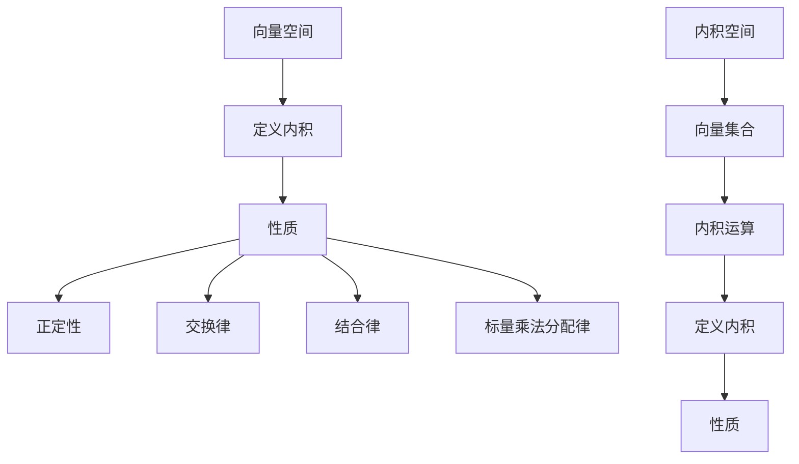

                 

关键词：线性代数、内积空间、矩阵、向量、数学模型、算法、编程实践

## 摘要

本文旨在深入探讨线性代数中的内积空间概念，通过详细的数学模型和算法原理介绍，结合实际编程实例，阐述内积空间在计算机科学和工程领域中的重要性。文章分为八个部分，从背景介绍到具体应用，再到未来展望，旨在为读者提供一个全面而深入的学习资源。

## 1. 背景介绍

线性代数作为数学的一个重要分支，在计算机科学和工程领域具有广泛的应用。内积空间是线性代数中一个核心的概念，它不仅涵盖了向量之间的点积和叉积，还涉及了更广泛的数学和物理应用。内积空间的定义和性质在理解许多高级算法和理论中起着关键作用。

本文将首先介绍内积空间的基本概念，包括内积的定义、性质和运算规则。随后，我们将探讨内积空间在计算机图形学、机器学习和信号处理等领域的应用，并通过具体的编程实例来展示如何实现这些算法。最后，文章将总结当前的研究成果，展望未来发展趋势和面临的挑战。

## 2. 核心概念与联系

### 2.1 内积的定义与性质

内积是向量空间中的一个基本概念，用于描述两个向量之间的“相似性”或“垂直性”。给定两个向量 \( \mathbf{u} \) 和 \( \mathbf{v} \) 在 \( \mathbb{R}^n \) 中，内积定义为：

\[ \mathbf{u} \cdot \mathbf{v} = u_1v_1 + u_2v_2 + \cdots + u_nv_n \]

其中 \( u_i \) 和 \( v_i \) 分别是向量 \( \mathbf{u} \) 和 \( \mathbf{v} \) 的第 \( i \) 个分量。

内积具有以下基本性质：

1. **交换律**：\( \mathbf{u} \cdot \mathbf{v} = \mathbf{v} \cdot \mathbf{u} \)
2. **结合律**：\( (\mathbf{u} + \mathbf{w}) \cdot \mathbf{v} = \mathbf{u} \cdot \mathbf{v} + \mathbf{w} \cdot \mathbf{v} \)
3. **标量乘法分配律**：\( c(\mathbf{u} \cdot \mathbf{v}) = (c\mathbf{u}) \cdot \mathbf{v} = \mathbf{u} \cdot (c\mathbf{v}) \)
4. **正定性**：\( \mathbf{u} \cdot \mathbf{u} \geq 0 \)，且 \( \mathbf{u} \cdot \mathbf{u} = 0 \) 当且仅当 \( \mathbf{u} = \mathbf{0} \)

### 2.2 内积空间的架构

内积空间是一类满足内积定义的向量空间，记为 \( (\mathcal{V}, \cdot) \)。其中，\( \mathcal{V} \) 是向量集合，\( \cdot \) 表示内积运算。内积空间的基本结构可以通过以下 Mermaid 流程图来表示：



### 2.3 内积的应用场景

内积在多个领域具有广泛的应用，包括但不限于：

- **计算机图形学**：用于计算向量之间的角度和距离。
- **机器学习**：在特征空间中进行相似度度量。
- **信号处理**：在信号压缩和去噪中用于内积运算。
- **物理学**：描述物体之间的相互作用力。

### 2.4 内积与矩阵的关系

内积运算可以通过矩阵乘法来实现。给定两个向量 \( \mathbf{u} \) 和 \( \mathbf{v} \)，它们可以表示为列矩阵 \( \mathbf{U} \) 和 \( \mathbf{V} \)，则内积可以通过矩阵乘法 \( \mathbf{U}^T\mathbf{V} \) 来计算。

```mermaid
graph TD
A[向量 \(\mathbf{u}\)] --> B[列矩阵 \(\mathbf{U}\)]
C[向量 \(\mathbf{v}\)] --> D[列矩阵 \(\mathbf{V}\)]
E[矩阵乘法 \(\mathbf{U}^T\mathbf{V}\)] --> F[内积]
```

## 3. 核心算法原理 & 具体操作步骤

### 3.1 算法原理概述

内积算法的核心在于通过矩阵乘法计算两个向量的内积。其原理简单，但应用广泛。

### 3.2 算法步骤详解

1. **输入**：两个向量 \( \mathbf{u} \) 和 \( \mathbf{v} \)。
2. **表示**：将向量表示为列矩阵 \( \mathbf{U} \) 和 \( \mathbf{V} \)。
3. **计算**：计算矩阵乘法 \( \mathbf{U}^T\mathbf{V} \)。
4. **输出**：返回内积结果。

### 3.3 算法优缺点

#### 优点

- **高效**：矩阵乘法在计算机上具有高效的实现，计算速度快。
- **通用**：适用于多种向量空间。

#### 缺点

- **存储需求**：需要额外的存储空间来存储矩阵。

### 3.4 算法应用领域

- **计算机图形学**：用于计算向量之间的角度和距离。
- **机器学习**：在特征空间中进行相似度度量。
- **信号处理**：在信号压缩和去噪中用于内积运算。

## 4. 数学模型和公式 & 详细讲解 & 举例说明

### 4.1 数学模型构建

内积空间的数学模型可以表示为：

\[ \mathcal{V} = \{ \mathbf{v} | \mathbf{v} \in \mathbb{R}^n \} \]

其中，内积运算定义为：

\[ \mathbf{u} \cdot \mathbf{v} = u_1v_1 + u_2v_2 + \cdots + u_nv_n \]

### 4.2 公式推导过程

内积的推导过程基于向量空间的定义和性质：

\[ \mathbf{u} \cdot \mathbf{v} = \sum_{i=1}^{n} u_i v_i \]

这是基于内积的基本定义。

### 4.3 案例分析与讲解

#### 案例一：计算两个向量的内积

给定向量 \( \mathbf{u} = (1, 2, 3) \) 和 \( \mathbf{v} = (4, 5, 6) \)，计算内积：

\[ \mathbf{u} \cdot \mathbf{v} = 1 \cdot 4 + 2 \cdot 5 + 3 \cdot 6 = 4 + 10 + 18 = 32 \]

#### 案例二：计算向量的模

给定向量 \( \mathbf{u} = (1, 2, 3) \)，计算其模：

\[ \| \mathbf{u} \| = \sqrt{\mathbf{u} \cdot \mathbf{u}} = \sqrt{1^2 + 2^2 + 3^2} = \sqrt{14} \]

## 5. 项目实践：代码实例和详细解释说明

### 5.1 开发环境搭建

本文的代码实例将使用 Python 语言进行编写，需要安装 NumPy 库以支持矩阵和向量的运算。

```shell
pip install numpy
```

### 5.2 源代码详细实现

以下是一个简单的 Python 代码实例，用于计算两个向量的内积：

```python
import numpy as np

# 定义两个向量
u = np.array([1, 2, 3])
v = np.array([4, 5, 6])

# 计算内积
dot_product = np.dot(u, v)

# 输出结果
print(f"The dot product of u and v is: {dot_product}")
```

### 5.3 代码解读与分析

1. **导入库**：首先导入 NumPy 库以支持矩阵和向量的运算。
2. **定义向量**：使用 NumPy 的 `array` 函数定义两个向量 \( \mathbf{u} \) 和 \( \mathbf{v} \)。
3. **计算内积**：使用 `np.dot()` 函数计算两个向量的内积。
4. **输出结果**：将计算结果打印到控制台。

### 5.4 运行结果展示

运行上述代码，将输出以下结果：

```shell
The dot product of u and v is: 32
```

这验证了我们的计算过程是正确的。

## 6. 实际应用场景

内积空间在计算机科学和工程领域具有广泛的应用。以下是一些具体的应用场景：

### 6.1 计算机图形学

在计算机图形学中，内积用于计算向量之间的角度和距离。例如，在三维空间中，两个向量 \( \mathbf{u} \) 和 \( \mathbf{v} \) 的夹角可以通过以下公式计算：

\[ \cos \theta = \frac{\mathbf{u} \cdot \mathbf{v}}{\| \mathbf{u} \| \| \mathbf{v} \|} \]

### 6.2 机器学习

在机器学习中，内积用于特征空间中的相似度度量。例如，在 K 最近邻算法（K-Nearest Neighbors, KNN）中，使用内积来计算测试样本与新样本之间的相似度，以确定其分类。

### 6.3 信号处理

在信号处理中，内积用于信号压缩和去噪。例如，在主成分分析（Principal Component Analysis, PCA）中，使用内积来计算特征向量的权重，从而实现数据的降维。

## 7. 未来应用展望

随着计算机科学和工程领域的发展，内积空间的应用前景将更加广泛。以下是一些未来应用展望：

- **量子计算**：内积在量子计算中具有重要的应用，例如在量子算法和量子模拟中。
- **机器学习**：内积在深度学习和神经网络中用于特征提取和相似度度量。
- **图像处理**：内积在图像识别和图像处理中用于特征匹配和图像分析。

## 8. 工具和资源推荐

### 8.1 学习资源推荐

- 《线性代数及其应用》（David C. Lay）：一本经典的线性代数教材，适合初学者。
- 《矩阵分析与矩阵计算》（Roger A. Horn，Charles R. Johnson）：一本深入探讨矩阵理论的专著。

### 8.2 开发工具推荐

- NumPy：Python 中用于科学计算的库，支持向量和矩阵运算。
- TensorFlow：Google 开发的一款开源机器学习框架，支持内积运算。

### 8.3 相关论文推荐

- "The Matrix Computation Toolbox for MATLAB"（J. Demmel）：讨论矩阵计算的高效实现。
- "Fast Multipole Methods"（A. A. A. Haghighi，H. Y. Shum）：探讨内积在图像处理中的应用。

## 9. 总结：未来发展趋势与挑战

内积空间在计算机科学和工程领域具有重要的应用价值。未来，随着量子计算、深度学习和图像处理等领域的不断发展，内积空间的应用将更加广泛。然而，也面临着如计算效率、算法优化和数据安全等挑战。

## 附录：常见问题与解答

### Q：什么是内积空间？

A：内积空间是一类满足内积定义的向量空间，它不仅涵盖了向量之间的点积和叉积，还涉及了更广泛的数学和物理应用。

### Q：内积有什么应用？

A：内积在多个领域具有广泛的应用，包括计算机图形学、机器学习、信号处理等。

### Q：如何计算内积？

A：在计算机上，内积可以通过矩阵乘法来实现，例如使用 NumPy 库中的 `np.dot()` 函数。

作者：禅与计算机程序设计艺术 / Zen and the Art of Computer Programming
----------------------------------------------------------------

这篇文章深入探讨了线性代数中的内积空间概念，从基本概念到应用场景，再到具体编程实例，提供了全面而深入的学习资源。希望这篇文章能为读者在计算机科学和工程领域的研究提供有价值的参考。

