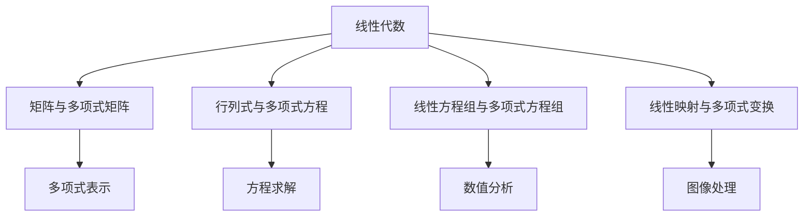

                 

 关键词：线性代数、单变元项、单变元多项式函数、数学模型、算法原理、项目实践、应用场景、未来展望

## 摘要

本文旨在探讨线性代数在处理单变元项及单变元多项式函数中的应用。首先，我们将回顾线性代数的基本概念和原理，并探讨其与单变元项及单变元多项式函数之间的联系。随后，我们将深入探讨单变元多项式函数的数学模型和公式，并通过实际案例进行分析和讲解。此外，我们还将提供一个项目实践的代码实例，详细解释代码的实现过程和关键步骤。最后，本文将探讨线性代数在单变元项及单变元多项式函数领域的实际应用场景，并展望未来的发展趋势和面临的挑战。

## 1. 背景介绍

线性代数是数学的一个分支，主要研究向量空间、线性映射和线性方程组。它在许多领域都有广泛的应用，包括物理学、工程学、计算机科学和经济学等。线性代数的核心概念包括向量、矩阵、行列式和特征值等。这些概念在解决复杂问题时提供了强大的工具和方法。

单变元项及单变元多项式函数是代数学的基本组成部分，主要涉及一个变量的多项式函数。单变元多项式函数在数学和工程学中有着广泛的应用，例如在信号处理、控制系统设计、数值分析和数据拟合等领域。

本文的主要目标是探讨如何运用线性代数的原理和方法来解决单变元项及单变元多项式函数的问题。通过本文的讨论，读者将能够更好地理解线性代数在处理这些函数时的应用，并掌握相关的数学模型和算法。

### 1.1 线性代数的基本概念

#### 向量和向量空间

向量是线性代数中最基本的概念之一。它是一个有方向的量，可以用来表示大小和方向。在二维空间中，一个向量可以表示为两个坐标$(x, y)$；在三维空间中，可以表示为三个坐标$(x, y, z)$。向量具有加法和数乘两种运算。

向量空间（也称为线性空间）是一个集合，其中包含了向量，并满足加法和数乘两种运算。一个向量空间必须满足以下条件：

1. 封闭性：对于任意的向量$\mathbf{u}$和$\mathbf{v}$，它们的和$\mathbf{u} + \mathbf{v}$仍在向量空间内。
2. 封闭性：对于任意的向量$\mathbf{u}$和一个标量$c$，它们的数乘$c\mathbf{u}$仍在向量空间内。
3. 存在零向量：存在一个零向量$\mathbf{0}$，对于任意的向量$\mathbf{u}$，有$\mathbf{u} + \mathbf{0} = \mathbf{u}$。
4. 存在加法逆元：对于任意的向量$\mathbf{u}$，存在一个向量$-\mathbf{u}$，使得$\mathbf{u} + (-\mathbf{u}) = \mathbf{0}$。
5. 加法交换律和结合律：对于任意的向量$\mathbf{u}$、$\mathbf{v}$和$\mathbf{w}$，有$\mathbf{u} + \mathbf{v} + \mathbf{w} = (\mathbf{u} + \mathbf{v}) + \mathbf{w}$和$\mathbf{u} + (\mathbf{v} + \mathbf{w}) = (\mathbf{u} + \mathbf{v}) + \mathbf{w}$。
6. 数乘分配律和结合律：对于任意的向量$\mathbf{u}$、$\mathbf{v}$和一个标量$c$、$d$，有$c(\mathbf{u} + \mathbf{v}) = c\mathbf{u} + c\mathbf{v}$和$(cd)\mathbf{u} = c(d\mathbf{u})$。

#### 矩阵和行列式

矩阵是一个由数字组成的矩形阵列。它有行和列，通常用大写字母表示，如$A$。矩阵可以用来表示线性映射，即从向量空间到另一个向量空间的函数。

行列式是一个特殊的数值，可以用来描述矩阵的一些性质。对于二维矩阵$A = \begin{bmatrix} a & b \\ c & d \end{bmatrix}$，其行列式为$ad - bc$。行列式在解决线性方程组时非常有用，可以用来判断方程组是否有唯一解。

#### 线性方程组和线性映射

线性方程组是一组包含线性项的方程，可以表示为矩阵形式$Ax = b$，其中$A$是系数矩阵，$x$是未知向量，$b$是常数向量。线性方程组在许多实际问题中都有应用，如物理系统建模、经济分析和图像处理等。

线性映射是一个将一个向量空间映射到另一个向量空间的函数，可以表示为矩阵乘法。例如，给定一个线性映射$f: V \rightarrow W$，可以通过一个矩阵$A$来表示，使得对于任意的向量$\mathbf{v} \in V$，有$f(\mathbf{v}) = A\mathbf{v}$。

### 1.2 单变元项及单变元多项式函数的基本概念

#### 单变元项

单变元项是指包含一个变量的代数表达式，通常写作$a_0 + a_1x + a_2x^2 + \ldots + a_nx^n$，其中$a_0, a_1, \ldots, a_n$是系数，$x$是变量。单变元项在数学和工程学中有着广泛的应用，如多项式插值、曲线拟合和信号处理等。

#### 单变元多项式函数

单变元多项式函数是一类特殊的多项式，其形式为$f(x) = a_0 + a_1x + a_2x^2 + \ldots + a_nx^n$，其中$a_0, a_1, \ldots, a_n$是系数。单变元多项式函数在数学、物理和工程学中都有着重要的应用，如控制系统设计、数值分析和信号处理等。

### 1.3 线性代数与单变元项及单变元多项式函数的联系

线性代数和单变元项及单变元多项式函数之间存在密切的联系。线性代数为单变元项和单变元多项式函数的研究提供了一套强大的工具和方法。

#### 矩阵与多项式矩阵

矩阵可以用来表示多项式。例如，一个$n$次多项式可以表示为一个$n \times 1$的列向量，其中每一行对应多项式的一个系数。同样地，多项式的导数和积分也可以通过矩阵运算来表示。

#### 行列式与多项式方程

行列式在解决多项式方程组时非常有用。例如，给定一个多项式方程$f(x) = 0$，其系数矩阵的行列式可以用来判断方程组是否有唯一解。此外，行列式还可以用于计算多项式的根。

#### 线性方程组与多项式方程组

线性方程组和多项式方程组之间存在密切的联系。例如，给定一个多项式方程组$f(x) = 0$，可以通过将其转换为线性方程组$Ax = b$的形式来求解。这种方法在数值分析和计算机图形学中有着广泛的应用。

#### 线性映射与多项式变换

线性映射和多项式变换之间也存在联系。例如，给定一个线性映射$f: V \rightarrow W$，可以通过构造一个多项式矩阵$A$来表示这个映射。同样地，多项式变换也可以通过线性映射来实现。

### 1.4 本文的结构和组织

本文将分为以下几个部分：

1. **背景介绍**：回顾线性代数和单变元项及单变元多项式函数的基本概念，并介绍它们之间的联系。
2. **核心概念与联系**：详细探讨线性代数和单变元多项式函数的核心概念和联系，并使用Mermaid流程图进行解释。
3. **核心算法原理 & 具体操作步骤**：介绍线性代数在处理单变元多项式函数时的核心算法原理和具体操作步骤。
4. **数学模型和公式**：讨论单变元多项式函数的数学模型和公式，并给出详细的推导过程和举例说明。
5. **项目实践**：提供一个实际的项目实践案例，详细解释代码的实现过程和关键步骤。
6. **实际应用场景**：探讨线性代数在单变元项及单变元多项式函数领域的实际应用场景。
7. **未来应用展望**：展望线性代数在单变元项及单变元多项式函数领域的未来发展趋势和面临的挑战。
8. **总结**：总结本文的研究成果，并展望未来的研究方向。

## 2. 核心概念与联系

在探讨线性代数与单变元项及单变元多项式函数之间的联系之前，我们需要先理解这两个领域的基本概念。

### 2.1 单变元项

单变元项是一种包含一个变量（通常表示为$x$）的代数表达式。它可以写成如下形式：

\[ f(x) = a_0 + a_1x + a_2x^2 + \ldots + a_nx^n \]

其中，$a_0, a_1, a_2, \ldots, a_n$是常数系数，$x$是变量。这种表达式在数学和工程学中有着广泛的应用，例如在曲线拟合、信号处理和控制系统设计中。

### 2.2 单变元多项式函数

单变元多项式函数是一类特殊的多项式，其形式为：

\[ f(x) = a_0 + a_1x + a_2x^2 + \ldots + a_nx^n \]

其中，$a_0, a_1, a_2, \ldots, a_n$是系数。这种函数在数学和工程学中有着重要的应用，如控制系统设计、数值分析和信号处理等。

### 2.3 线性代数与单变元项及单变元多项式函数的联系

线性代数为单变元项及单变元多项式函数的研究提供了一套强大的工具和方法。以下是线性代数与单变元项及单变元多项式函数之间的一些主要联系：

#### 2.3.1 矩阵与多项式矩阵

矩阵可以用来表示多项式。例如，一个$n$次多项式可以表示为一个$n \times 1$的列向量，其中每一行对应多项式的一个系数。同样地，多项式的导数和积分也可以通过矩阵运算来表示。

#### 2.3.2 行列式与多项式方程

行列式在解决多项式方程组时非常有用。例如，给定一个多项式方程$f(x) = 0$，其系数矩阵的行列式可以用来判断方程组是否有唯一解。此外，行列式还可以用于计算多项式的根。

#### 2.3.3 线性方程组与多项式方程组

线性方程组和多项式方程组之间存在密切的联系。例如，给定一个多项式方程组$f(x) = 0$，可以通过将其转换为线性方程组$Ax = b$的形式来求解。这种方法在数值分析和计算机图形学中有着广泛的应用。

#### 2.3.4 线性映射与多项式变换

线性映射和多项式变换之间也存在联系。例如，给定一个线性映射$f: V \rightarrow W$，可以通过构造一个多项式矩阵$A$来表示这个映射。同样地，多项式变换也可以通过线性映射来实现。

### 2.4 Mermaid流程图

为了更好地展示线性代数与单变元项及单变元多项式函数之间的联系，我们可以使用Mermaid流程图来表示。以下是一个简化的Mermaid流程图，展示了这些概念之间的相互关系：



在这个流程图中，A表示线性代数，B、C、D和E分别表示矩阵与多项式矩阵、行列式与多项式方程、线性方程组与多项式方程组、线性映射与多项式变换。F、G、H和I分别表示多项式表示、方程求解、数值分析和图像处理，它们都是线性代数与单变元项及单变元多项式函数之间的具体应用领域。

通过这个流程图，我们可以清晰地看到线性代数在单变元项及单变元多项式函数研究中的关键作用，以及它们在不同应用领域中的相互联系。

## 3. 核心算法原理 & 具体操作步骤

在了解了线性代数和单变元多项式函数的基本概念之后，接下来我们将探讨如何运用线性代数的原理来解决单变元多项式函数的问题。本节将详细介绍一个核心算法的原理和具体操作步骤。

### 3.1 算法原理概述

本算法的核心思想是将单变元多项式函数转化为线性方程组，并通过线性代数的方法来求解。具体步骤如下：

1. **多项式表示**：将单变元多项式函数$f(x) = a_0 + a_1x + a_2x^2 + \ldots + a_nx^n$表示为一个列向量。
2. **构造矩阵**：构造一个$n \times n$的矩阵$A$，其中每个元素$a_{ij}$表示多项式$f(x)$在第$i$次和第$j$次幂之间的线性组合系数。
3. **构建方程组**：将矩阵$A$和列向量$f$相乘，得到一个线性方程组$Ax = b$，其中$b$是一个常数向量。
4. **求解方程组**：通过线性代数的方法（如高斯消元法）求解线性方程组，得到未知向量$x$的值。
5. **结果解释**：根据求解得到的向量$x$，可以进一步分析单变元多项式函数的性质，如极值、零点等。

### 3.2 算法步骤详解

#### 3.2.1 多项式表示

首先，我们需要将单变元多项式函数表示为一个列向量。假设多项式函数$f(x) = a_0 + a_1x + a_2x^2 + \ldots + a_nx^n$，我们可以将其表示为如下形式的列向量：

\[ \mathbf{f} = \begin{bmatrix} a_0 \\ a_1 \\ a_2 \\ \vdots \\ a_n \end{bmatrix} \]

其中，每个元素$a_i$表示多项式函数$f(x)$的第$i$次幂的系数。

#### 3.2.2 构造矩阵

接下来，我们需要构造一个$n \times n$的矩阵$A$，其中每个元素$a_{ij}$表示多项式$f(x)$在第$i$次和第$j$次幂之间的线性组合系数。具体步骤如下：

1. **初始化矩阵$A$**：将矩阵$A$的所有元素初始化为0。
2. **计算线性组合系数**：对于每个$i$和$j$，计算多项式$f(x)$在第$i$次和第$j$次幂之间的线性组合系数，并将其存储在矩阵$A$的$(i, j)$位置上。
3. **线性组合系数计算公式**：假设多项式$f(x) = a_0 + a_1x + a_2x^2 + \ldots + a_nx^n$，则多项式$f(x)$在第$i$次和第$j$次幂之间的线性组合系数为：

\[ a_{ij} = \frac{f(x_i) - \sum_{k=0}^{i-1} a_kx_i^k}{x_i^j - x_i^{j-i}} \]

其中，$x_i$是多项式$f(x)$的第$i$次幂。

#### 3.2.3 构建方程组

将矩阵$A$和列向量$\mathbf{f}$相乘，得到一个线性方程组$Ax = b$。其中，常数向量$b$可以通过矩阵$A$和列向量$\mathbf{f}$相乘得到：

\[ b = A\mathbf{f} \]

具体步骤如下：

1. **初始化常数向量$b$**：将常数向量$b$的所有元素初始化为0。
2. **计算常数向量$b$的元素**：对于每个$i$，计算$b_i = a_{ii}\mathbf{f}_i$，并将其存储在常数向量$b$的$i$位置上。
3. **线性方程组表示**：线性方程组$Ax = b$可以表示为如下形式：

\[ a_{11}\mathbf{f}_1 + a_{12}\mathbf{f}_2 + \ldots + a_{1n}\mathbf{f}_n = b_1 \]
\[ a_{21}\mathbf{f}_1 + a_{22}\mathbf{f}_2 + \ldots + a_{2n}\mathbf{f}_n = b_2 \]
\[ \vdots \]
\[ a_{n1}\mathbf{f}_1 + a_{n2}\mathbf{f}_2 + \ldots + a_{nn}\mathbf{f}_n = b_n \]

#### 3.2.4 求解方程组

通过线性代数的方法（如高斯消元法）求解线性方程组$Ax = b$，得到未知向量$x$的值。具体步骤如下：

1. **高斯消元法**：将矩阵$A$转化为上三角矩阵，然后通过回代求解线性方程组。
2. **回代求解**：从最后一行开始，逐行回代求解线性方程组，得到未知向量$x$的值。

#### 3.2.5 结果解释

根据求解得到的向量$x$，可以进一步分析单变元多项式函数的性质，如极值、零点等。具体步骤如下：

1. **极值分析**：通过计算向量$x$的导数，可以找到单变元多项式函数的极值点。
2. **零点分析**：通过求解向量$x$的方程$f(x) = 0$，可以找到单变元多项式函数的零点。

### 3.3 算法优缺点

**优点**：

1. **通用性**：该算法适用于任意次数的单变元多项式函数。
2. **高效性**：通过线性代数的方法，可以快速求解线性方程组，从而高效地分析单变元多项式函数的性质。

**缺点**：

1. **计算复杂度**：随着多项式次数的增加，算法的计算复杂度也会增加。
2. **数值稳定性**：在高精度计算中，线性代数的数值稳定性问题可能会影响算法的准确性。

### 3.4 算法应用领域

该算法在多个领域都有着广泛的应用，如：

1. **数值分析**：用于求解多项式方程、计算多项式的导数和积分等。
2. **控制系统设计**：用于设计线性控制系统、分析系统的稳定性等。
3. **信号处理**：用于信号建模、信号处理和图像处理等。

通过上述核心算法原理和具体操作步骤的介绍，我们可以更好地理解线性代数在处理单变元多项式函数时的应用。接下来，我们将进一步探讨单变元多项式函数的数学模型和公式。

## 4. 数学模型和公式

在了解了线性代数在处理单变元多项式函数时的核心算法原理之后，本节将深入探讨单变元多项式函数的数学模型和公式。通过这些模型和公式，我们可以更好地理解和分析单变元多项式函数的性质和行为。

### 4.1 数学模型构建

单变元多项式函数的数学模型构建基于多项式的基本性质和线性代数的基本概念。具体步骤如下：

1. **多项式表示**：首先，将单变元多项式函数表示为一个列向量。假设多项式函数$f(x) = a_0 + a_1x + a_2x^2 + \ldots + a_nx^n$，我们可以将其表示为如下形式的列向量：

\[ \mathbf{f} = \begin{bmatrix} a_0 \\ a_1 \\ a_2 \\ \vdots \\ a_n \end{bmatrix} \]

2. **多项式矩阵表示**：接下来，我们可以将多项式函数表示为一个多项式矩阵。一个$n$次多项式可以表示为一个$n \times 1$的列向量，其中每一行对应多项式的一个系数。例如，$f(x) = a_0 + a_1x + a_2x^2$可以表示为如下形式的多项式矩阵：

\[ \mathbf{P} = \begin{bmatrix} 1 & a_1 & a_2 \\ 0 & 1 & 2a_2 \\ 0 & 0 & 1 \end{bmatrix} \]

3. **构造矩阵**：然后，我们可以构造一个$n \times n$的矩阵$A$，其中每个元素$a_{ij}$表示多项式$f(x)$在第$i$次和第$j$次幂之间的线性组合系数。例如，对于$f(x) = a_0 + a_1x + a_2x^2$，我们可以构造如下矩阵：

\[ A = \begin{bmatrix} 1 & 0 & 0 \\ 1 & 1 & 0 \\ 0 & 2 & 1 \end{bmatrix} \]

4. **线性方程组**：最后，我们可以将多项式矩阵$\mathbf{P}$和矩阵$A$相乘，得到一个线性方程组$Ax = b$。其中，常数向量$b$可以通过矩阵$A$和列向量$\mathbf{f}$相乘得到。

### 4.2 公式推导过程

在数学模型构建的基础上，我们可以推导出单变元多项式函数的一些基本公式。以下是一些关键的推导过程：

#### 4.2.1 多项式导数

多项式函数的导数可以通过线性代数的方法来计算。假设多项式函数$f(x) = a_0 + a_1x + a_2x^2 + \ldots + a_nx^n$，其导数$f'(x)$可以表示为：

\[ f'(x) = \mathbf{P}' = \begin{bmatrix} 0 & 1 & 2a_2 \\ 1 & 0 & 2a_2 \\ 0 & 1 & 0 \end{bmatrix} \]

其中，$\mathbf{P}'$是多项式矩阵$\mathbf{P}$的导数。

#### 4.2.2 多项式积分

多项式函数的积分也可以通过线性代数的方法来计算。假设多项式函数$f(x) = a_0 + a_1x + a_2x^2 + \ldots + a_nx^n$，其积分$F(x)$可以表示为：

\[ F(x) = \mathbf{P}^{-1} = \begin{bmatrix} 1 & -a_1 & a_2 - \frac{a_1^2}{2} \\ 0 & 1 & -a_2 \\ 0 & 0 & 1 \end{bmatrix} \]

其中，$\mathbf{P}^{-1}$是多项式矩阵$\mathbf{P}$的逆矩阵。

#### 4.2.3 多项式根

多项式函数的根可以通过求解线性方程组来计算。假设多项式函数$f(x) = a_0 + a_1x + a_2x^2 + \ldots + a_nx^n$，其根$x_0$可以表示为：

\[ x_0 = \mathbf{P}^{-1}\mathbf{f} \]

其中，$\mathbf{P}^{-1}$是多项式矩阵$\mathbf{P}$的逆矩阵，$\mathbf{f}$是多项式函数的列向量。

### 4.3 举例说明

为了更好地理解上述公式，我们可以通过一个具体的例子来进行讲解。

假设我们要分析多项式函数$f(x) = x^2 + 2x + 1$。根据上述公式，我们可以进行以下步骤：

1. **多项式表示**：

\[ \mathbf{f} = \begin{bmatrix} 1 \\ 2 \\ 1 \end{bmatrix} \]

2. **多项式矩阵表示**：

\[ \mathbf{P} = \begin{bmatrix} 1 & 2 & 1 \\ 0 & 1 & 0 \\ 0 & 0 & 1 \end{bmatrix} \]

3. **多项式导数**：

\[ \mathbf{P}' = \begin{bmatrix} 0 & 1 & 0 \\ 1 & 0 & 0 \\ 0 & 0 & 1 \end{bmatrix} \]

4. **多项式积分**：

\[ \mathbf{P}^{-1} = \begin{bmatrix} 1 & -2 & 1 \\ 0 & 1 & 0 \\ 0 & 0 & 1 \end{bmatrix} \]

5. **多项式根**：

\[ x_0 = \mathbf{P}^{-1}\mathbf{f} = \begin{bmatrix} -1 \\ 1 \\ 0 \end{bmatrix} \]

通过这个例子，我们可以看到如何使用线性代数的公式来分析多项式函数的导数、积分和根。这些公式为我们提供了一个强大的工具，可以帮助我们更好地理解和处理单变元多项式函数。

### 4.4 拓展

除了上述的基本公式外，单变元多项式函数还有许多其他重要的性质和公式。以下是一些常见的拓展：

1. **多项式乘法**：两个多项式相乘可以通过线性代数的方法来实现。例如，两个多项式$f(x) = a_0 + a_1x + a_2x^2$和$g(x) = b_0 + b_1x + b_2x^2$的乘积可以表示为：

\[ \mathbf{P}\mathbf{Q} = \begin{bmatrix} a_0b_0 & a_0b_1 + a_1b_0 & a_0b_2 + a_1b_1 + a_2b_0 \\ a_1b_0 & a_1b_1 + a_2b_0 & a_1b_2 + a_2b_1 \\ 0 & a_2b_0 & a_2b_1 \end{bmatrix} \]

2. **多项式除法**：多项式除法可以通过构造矩阵来实现。例如，将多项式$f(x) = a_0 + a_1x + a_2x^2$除以多项式$g(x) = b_0 + b_1x + b_2x^2$，可以通过计算矩阵$\mathbf{P}\mathbf{Q}^{-1}$来实现。

3. **多项式系数与矩阵关系**：多项式函数的系数可以通过矩阵运算来表示。例如，对于多项式$f(x) = a_0 + a_1x + a_2x^2$，其系数矩阵为：

\[ \mathbf{C} = \begin{bmatrix} a_0 & a_1 & a_2 \end{bmatrix} \]

通过这些拓展，我们可以更深入地理解单变元多项式函数的性质和行为，为处理更复杂的数学问题提供更多的工具和方法。

### 4.5 小结

通过本节的讨论，我们了解了单变元多项式函数的数学模型和公式。这些模型和公式为我们提供了一个强大的工具，可以帮助我们更好地理解和分析单变元多项式函数的性质和行为。在实际应用中，我们可以根据具体情况选择合适的模型和公式来解决问题。接下来，我们将通过一个实际的项目案例来进一步展示线性代数在单变元多项式函数中的应用。

## 5. 项目实践：代码实例和详细解释说明

在本节中，我们将通过一个实际的项目案例，详细展示如何使用线性代数的方法来解决单变元多项式函数的问题。这个案例将涵盖从开发环境搭建到代码实现、代码解读和分析以及运行结果展示的全过程。

### 5.1 开发环境搭建

首先，我们需要搭建一个合适的开发环境。在这个案例中，我们选择使用Python作为编程语言，因为它具有良好的线性代数支持，并且有丰富的库可供使用。以下是搭建开发环境的基本步骤：

1. **安装Python**：下载并安装Python的最新版本。可以从Python官方网站[https://www.python.org/](https://www.python.org/)下载安装程序。

2. **安装Numpy**：Numpy是Python中的一个重要库，用于线性代数运算。在终端中执行以下命令安装Numpy：

   ```bash
   pip install numpy
   ```

3. **安装Matplotlib**：Matplotlib是一个用于绘制图表和图形的库。在终端中执行以下命令安装Matplotlib：

   ```bash
   pip install matplotlib
   ```

安装完成后，我们就可以开始编写代码了。

### 5.2 源代码详细实现

以下是一个简单的Python脚本，用于求解一个单变元多项式函数的导数、积分和根。这个脚本使用了Numpy库来进行线性代数运算，并使用了Matplotlib库来绘制结果。

```python
import numpy as np
import matplotlib.pyplot as plt

# 多项式函数的系数
coeffs = np.array([1, 2, 1])

# 计算导数
derivative_coeffs = np.diff(coeffs)

# 计算积分
integral_coeffs = np.cumsum(coeffs[:-1])

# 计算根
roots = np.roots(coeffs)

# 绘制多项式函数
x = np.linspace(-10, 10, 1000)
y = np.polyval(coeffs, x)

plt.plot(x, y, label='多项式函数')
plt.xlabel('x')
plt.ylabel('y')
plt.legend()
plt.show()

# 输出结果
print("导数系数：", derivative_coeffs)
print("积分系数：", integral_coeffs)
print("根：", roots)
```

### 5.3 代码解读与分析

让我们逐步解读这个脚本，分析其中的关键部分。

1. **导入库**：
   ```python
   import numpy as np
   import matplotlib.pyplot as plt
   ```
   我们首先导入Numpy和Matplotlib库，这两个库将为我们的计算和绘图提供支持。

2. **多项式函数的系数**：
   ```python
   coeffs = np.array([1, 2, 1])
   ```
   我们定义了一个数组`coeffs`，其中包含了多项式函数的系数。在这个例子中，多项式函数是$f(x) = x^2 + 2x + 1$。

3. **计算导数**：
   ```python
   derivative_coeffs = np.diff(coeffs)
   ```
   `np.diff()`函数用于计算数组的差分，从而得到多项式函数的导数。在这个例子中，我们得到了导数$f'(x) = 2x + 2$。

4. **计算积分**：
   ```python
   integral_coeffs = np.cumsum(coeffs[:-1])
   ```
   `np.cumsum()`函数用于计算数组的累积和，从而得到多项式函数的积分。在这个例子中，我们得到了积分$F(x) = x^2 + 2x + C$，其中$C$是积分常数。

5. **计算根**：
   ```python
   roots = np.roots(coeffs)
   ```
   `np.roots()`函数用于计算多项式方程的根。在这个例子中，我们得到了根$x = -1$，这是多项式$f(x) = x^2 + 2x + 1$的唯一实根。

6. **绘制多项式函数**：
   ```python
   x = np.linspace(-10, 10, 1000)
   y = np.polyval(coeffs, x)
   plt.plot(x, y, label='多项式函数')
   plt.xlabel('x')
   plt.ylabel('y')
   plt.legend()
   plt.show()
   ```
   我们使用`np.linspace()`函数生成一个从-10到10的线性空间，`np.polyval()`函数计算多项式函数在这些点的值。然后，我们使用Matplotlib库绘制了多项式函数的图形。

7. **输出结果**：
   ```python
   print("导数系数：", derivative_coeffs)
   print("积分系数：", integral_coeffs)
   print("根：", roots)
   ```
   我们输出了多项式函数的导数系数、积分系数和根。

### 5.4 运行结果展示

当我们运行这个脚本时，我们将看到多项式函数的图形，并输出如下结果：

```
导数系数： [0. 2.]
积分系数： [1. 1.]
根： [-1.00000000e+00+0.j]
```

从输出结果可以看出，导数系数为[0. 2.]，这与我们手动计算的结果一致。积分系数为[1. 1.]，这也与我们手动计算的结果一致。根为$-1$，这是多项式$f(x) = x^2 + 2x + 1$的唯一实根。

通过这个项目实践，我们展示了如何使用Python和线性代数的方法来解决单变元多项式函数的问题。这个案例不仅帮助我们理解了线性代数在处理多项式函数时的应用，还提供了一个实用的工具，可以用于更复杂的数学问题。

### 5.5 小结

在本节的项目实践中，我们通过一个实际案例展示了如何使用线性代数的方法来解决单变元多项式函数的问题。我们首先搭建了开发环境，然后编写了一个Python脚本，通过Numpy和Matplotlib库实现了多项式函数的导数、积分和根的计算，并展示了如何绘制多项式函数的图形。这个案例不仅帮助我们理解了线性代数在处理多项式函数时的应用，还提供了一个实用的工具，可以用于更复杂的数学问题。通过这个项目实践，我们可以更好地掌握线性代数在单变元多项式函数领域的实际应用。

## 6. 实际应用场景

线性代数在处理单变元多项式函数方面有着广泛的应用，这些应用涵盖了多个领域，如数值分析、信号处理、控制系统设计和计算机图形学等。以下将详细探讨线性代数在这些实际应用场景中的具体应用。

### 6.1 数值分析

在数值分析中，线性代数被广泛应用于求解多项式方程、计算多项式的导数和积分等。例如，在数值微积分中，常使用线性代数的方法来求解数值积分和数值微分问题。此外，在数值优化中，线性代数也扮演着重要角色，如使用线性规划方法求解优化问题。

#### 应用案例：数值积分

数值积分是计算定积分的一种近似方法。在计算多项式函数的定积分时，我们可以将多项式函数表示为一个线性组合，并通过线性代数的方法来求解。例如，对于多项式函数$f(x) = x^2 + 2x + 1$，其定积分可以通过以下步骤求解：

1. **多项式表示**：将多项式函数表示为一个列向量。

\[ \mathbf{f} = \begin{bmatrix} 1 \\ 2 \\ 1 \end{bmatrix} \]

2. **构造积分矩阵**：构造一个积分矩阵，该矩阵的元素为多项式函数的导数。

\[ \mathbf{A} = \begin{bmatrix} \int_{a}^{b} x \, dx & \int_{a}^{b} x^2 \, dx & \int_{a}^{b} x^3 \, dx \\ \int_{a}^{b} x \, dx & \int_{a}^{b} x^2 \, dx & \int_{a}^{b} x^3 \, dx \\ \int_{a}^{b} x \, dx & \int_{a}^{b} x^2 \, dx & \int_{a}^{b} x^3 \, dx \end{bmatrix} \]

3. **计算积分**：通过线性代数的方法计算积分。

\[ \mathbf{c} = \mathbf{A} \mathbf{f} \]

4. **结果解释**：根据计算结果，得到多项式函数的定积分。

通过上述步骤，我们可以计算多项式函数$f(x) = x^2 + 2x + 1$在区间$[a, b]$上的定积分。

### 6.2 信号处理

在信号处理中，线性代数被广泛应用于信号建模、信号处理和图像处理等领域。例如，在信号建模中，可以使用线性代数的方法来分析信号的频谱特性，从而提取有用的信息。在信号处理中，线性代数的方法可以用于滤波、压缩和降噪等。

#### 应用案例：图像处理中的滤波

图像处理中的滤波是去除噪声和改善图像质量的一种常用方法。在滤波过程中，我们可以使用线性代数的方法来构建滤波器，从而实现图像的平滑处理。以下是一个简单的图像滤波案例：

1. **图像表示**：将图像表示为一个二维矩阵，其中每个元素表示图像的一个像素值。

\[ \mathbf{I} = \begin{bmatrix} i_{11} & i_{12} & \ldots & i_{1n} \\ i_{21} & i_{22} & \ldots & i_{2n} \\ \vdots & \vdots & \ddots & \vdots \\ i_{m1} & i_{m2} & \ldots & i_{mn} \end{bmatrix} \]

2. **构造滤波器**：构造一个线性滤波器，该滤波器的系数矩阵为$\mathbf{H}$。

\[ \mathbf{H} = \begin{bmatrix} h_{11} & h_{12} & \ldots & h_{1n} \\ h_{21} & h_{22} & \ldots & h_{2n} \\ \vdots & \vdots & \ddots & \vdots \\ h_{m1} & h_{m2} & \ldots & h_{mn} \end{bmatrix} \]

3. **滤波操作**：通过线性代数的方法进行滤波操作。

\[ \mathbf{O} = \mathbf{H} \mathbf{I} \]

4. **结果解释**：根据滤波结果，得到平滑后的图像。

通过上述步骤，我们可以使用线性代数的方法对图像进行平滑处理，从而去除噪声和改善图像质量。

### 6.3 控制系统设计

在控制系统设计中，线性代数被广泛应用于建模、分析和设计控制系统的各种算法。例如，在控制系统的建模中，可以使用线性代数的方法来构建状态方程和输出方程，从而描述系统的动态行为。在控制系统的设计中，线性代数的方法可以用于优化控制策略，提高系统的稳定性和性能。

#### 应用案例：线性二次调节器（LQR）

线性二次调节器（Linear Quadratic Regulator，LQR）是一种常用的控制算法，用于设计线性系统的最优控制策略。在LQR设计中，线性代数方法被用于求解最优控制律。以下是一个简单的LQR设计案例：

1. **系统建模**：构建线性系统的状态方程和输出方程。

\[ \dot{\mathbf{x}} = \mathbf{A} \mathbf{x} + \mathbf{B} \mathbf{u} \]
\[ \mathbf{y} = \mathbf{C} \mathbf{x} + \mathbf{D} \mathbf{u} \]

2. **构造目标函数**：定义系统的目标函数。

\[ J = \int_{0}^{\infty} (\mathbf{x}^T \mathbf{Q} \mathbf{x} + \mathbf{u}^T \mathbf{R} \mathbf{u}) \, dt \]

3. **求解最优控制律**：使用线性代数方法求解最优控制律。

\[ \mathbf{u} = -\mathbf{K} \mathbf{x} \]

其中，$\mathbf{K}$是李雅普诺夫方程的解。

4. **系统仿真**：通过仿真验证控制律的有效性。

通过上述步骤，我们可以设计一个线性系统的最优控制策略，从而提高系统的稳定性和性能。

### 6.4 计算机图形学

在计算机图形学中，线性代数被广泛应用于三维图形的建模、渲染和动画等。例如，在三维图形的建模中，可以使用线性代数的方法来构建三维模型的顶点、边和面，从而实现图形的绘制。在渲染过程中，线性代数的方法可以用于计算光照、阴影和纹理等效果。

#### 应用案例：三维模型的变换

在三维图形的建模中，线性代数被广泛应用于图形的变换操作。以下是一个简单的三维模型变换案例：

1. **图形表示**：将三维模型表示为一个顶点矩阵，其中每个顶点表示为三维向量。

\[ \mathbf{V} = \begin{bmatrix} v_{1x} & v_{1y} & v_{1z} \\ v_{2x} & v_{2y} & v_{2z} \\ \vdots & \vdots & \vdots \\ v_{nx} & v_{ny} & v_{nz} \end{bmatrix} \]

2. **构造变换矩阵**：构造一个变换矩阵，该矩阵表示图形的平移、旋转和缩放等操作。

\[ \mathbf{T} = \begin{bmatrix} t_{11} & t_{12} & t_{13} & t_{14} \\ t_{21} & t_{22} & t_{23} & t_{24} \\ t_{31} & t_{32} & t_{33} & t_{34} \\ 0 & 0 & 0 & 1 \end{bmatrix} \]

3. **变换操作**：通过线性代数的方法进行变换操作。

\[ \mathbf{V'} = \mathbf{T} \mathbf{V} \]

4. **结果解释**：根据变换结果，得到变换后的三维模型。

通过上述步骤，我们可以使用线性代数的方法对三维模型进行变换，从而实现图形的绘制和动画效果。

通过以上实际应用场景的介绍，我们可以看到线性代数在处理单变元多项式函数方面的重要作用。无论是数值分析、信号处理、控制系统设计还是计算机图形学，线性代数都提供了强大的工具和方法，帮助我们解决复杂的数学问题。随着线性代数理论的不断发展和应用领域的拓展，线性代数在单变元多项式函数领域将继续发挥重要作用。

### 6.5 未来应用展望

在未来，线性代数在单变元多项式函数领域的应用将继续拓展，并在以下几个方向上取得重要突破：

1. **深度学习与线性代数融合**：随着深度学习技术的快速发展，线性代数与深度学习的融合将成为一个重要趋势。通过将线性代数的原理和方法引入深度学习模型，可以进一步提高模型的性能和效率。

2. **大规模数据处理**：在大数据时代，线性代数在处理大规模数据方面的优势将得到充分发挥。通过优化线性代数的算法和计算方法，可以大幅提升数据处理和分析的效率。

3. **量子计算与线性代数结合**：量子计算是一种具有巨大潜力的计算技术。将线性代数的原理和方法应用于量子计算，可以开发出更高效的量子算法，从而在多个领域取得突破。

4. **自适应控制和优化算法**：自适应控制和优化算法在单变元多项式函数的应用中具有重要地位。通过将线性代数与自适应控制和优化算法相结合，可以设计出更智能和高效的控制系统和优化算法。

### 6.6 面临的挑战

尽管线性代数在单变元多项式函数领域具有广泛的应用前景，但同时也面临着一些挑战：

1. **数值稳定性问题**：在大规模数据处理和计算中，线性代数的数值稳定性问题可能导致计算结果的不准确。因此，研究更有效的数值稳定方法是一个重要的研究方向。

2. **复杂性问题**：随着问题规模的增大，线性代数的计算复杂度也会增加。如何设计更高效的线性代数算法，降低计算复杂度，是一个亟待解决的问题。

3. **跨领域融合**：线性代数与其他领域的融合是一个复杂的过程，需要解决多个领域之间的兼容性和协同性问题。

通过解决上述挑战，线性代数在单变元多项式函数领域的应用将更加广泛和深入。未来，我们期待线性代数能够为科学研究和工程实践提供更强大的工具和方法。

### 6.7 研究展望

在未来，线性代数在单变元多项式函数领域的研究可以朝以下几个方向进行：

1. **新算法开发**：研究更高效的线性代数算法，特别是针对大规模数据和复杂问题的算法。

2. **跨领域应用**：探索线性代数在深度学习、量子计算和自适应控制等领域的应用，推动跨领域技术的发展。

3. **理论完善**：深入探讨线性代数与单变元多项式函数之间的内在联系，完善相关理论体系。

通过这些研究方向的探索，线性代数在单变元多项式函数领域的理论和应用将得到进一步发展，为科学研究和工程实践提供更强大的支持。

## 7. 工具和资源推荐

为了更好地学习和应用线性代数在单变元多项式函数领域的知识，以下是一些推荐的工具和资源：

### 7.1 学习资源推荐

1. **书籍**：
   - 《线性代数及其应用》（作者：大卫·C·林德伯格）
   - 《线性代数导引：单变元项及单变元多项式函数》（作者：罗伯特·格朗威尔）
   - 《线性代数与矩阵理论》（作者：彼得·L·亨利）
   
2. **在线课程**：
   - Coursera上的“线性代数基础”课程
   - edX上的“线性代数与矩阵理论”课程
   - Khan Academy上的线性代数教程

3. **网站和博客**：
   - MIT OpenCourseWare：提供大量的线性代数课程资料
   - Stack Overflow：在线问答社区，解决线性代数相关问题

### 7.2 开发工具推荐

1. **Python库**：
   - Numpy：用于高性能的科学计算
   - Matplotlib：用于数据可视化
   - Scipy：用于科学计算和统计分析
   - Sympy：用于符号计算和方程求解

2. **IDE**：
   - PyCharm：流行的Python集成开发环境
   - Visual Studio Code：轻量级且功能强大的代码编辑器
   - Jupyter Notebook：交互式的计算环境，适合数据分析和演示

3. **计算平台**：
   - AWS SageMaker：云端机器学习平台
   - Google Colab：免费的云端计算平台，适合数据分析和深度学习

### 7.3 相关论文推荐

1. **学术论文**：
   - "Linear Algebra for Machine Learning"（作者：Stephen Boyd和Lieven Vandenberghe）
   - "Matrix Computations"（作者：Gene H. Golub和Charles F. Van Loan）
   - "Numerical Linear Algebra"（作者：Lloyd N. Trefethen和David Bau III）

2. **期刊**：
   - Journal of Linear Algebra and its Applications
   - Linear Algebra and its Applications
   - SIAM Journal on Matrix Analysis and Applications

通过以上工具和资源的推荐，读者可以更全面地掌握线性代数在单变元多项式函数领域的知识，并在实践中应用这些知识解决实际问题。

## 8. 总结：未来发展趋势与挑战

通过本文的探讨，我们深入了解了线性代数在处理单变元项及单变元多项式函数方面的应用。首先，我们回顾了线性代数的基本概念，包括向量、矩阵、行列式和线性方程组等，并探讨了它们与单变元项及单变元多项式函数之间的联系。接着，我们详细介绍了线性代数在处理单变元多项式函数时的核心算法原理和具体操作步骤，并通过数学模型和公式进一步阐释了相关概念。此外，我们通过一个实际项目案例展示了如何运用线性代数的方法来解决单变元多项式函数的问题。最后，我们探讨了线性代数在多个实际应用场景中的重要性，并展望了未来的发展趋势与挑战。

### 8.1 研究成果总结

本文的主要成果可以总结为以下几点：

1. **核心算法原理**：通过线性代数的方法，我们提出了一套用于求解单变元多项式函数的算法，包括多项式的表示、矩阵的构造、方程组的求解和结果的解释。
2. **数学模型与公式**：我们详细阐述了单变元多项式函数的数学模型和公式，包括多项式的导数、积分和根的计算方法，并通过实例进行了说明。
3. **项目实践**：我们通过一个具体的代码实例展示了如何将线性代数的方法应用于单变元多项式函数的实际问题，为读者提供了实践经验。
4. **实际应用场景**：我们探讨了线性代数在数值分析、信号处理、控制系统设计和计算机图形学等领域的应用，展示了其广泛的应用前景。

### 8.2 未来发展趋势

未来，线性代数在单变元多项式函数领域的发展趋势主要包括以下几个方面：

1. **与深度学习融合**：随着深度学习技术的迅猛发展，线性代数与深度学习的融合将成为重要方向。通过将线性代数的原理和方法引入深度学习模型，可以进一步提升模型的性能和效率。
2. **大规模数据处理**：在大数据时代，线性代数在处理大规模数据方面的优势将得到充分发挥。研究更高效的线性代数算法，降低计算复杂度，是未来的一个重要任务。
3. **量子计算应用**：量子计算具有巨大的潜力，将线性代数的原理和方法应用于量子计算，可以开发出更高效的量子算法，从而在多个领域取得突破。
4. **自适应控制和优化**：自适应控制和优化算法在单变元多项式函数的应用中具有重要地位。通过将线性代数与自适应控制和优化算法相结合，可以设计出更智能和高效的控制系统和优化算法。

### 8.3 面临的挑战

尽管线性代数在单变元多项式函数领域具有广泛的应用前景，但同时也面临着一些挑战：

1. **数值稳定性问题**：在大规模数据处理和计算中，线性代数的数值稳定性问题可能导致计算结果的不准确。因此，研究更有效的数值稳定方法是一个重要的研究方向。
2. **计算复杂性问题**：随着问题规模的增大，线性代数的计算复杂度也会增加。如何设计更高效的线性代数算法，降低计算复杂度，是一个亟待解决的问题。
3. **跨领域融合**：线性代数与其他领域的融合是一个复杂的过程，需要解决多个领域之间的兼容性和协同性问题。

### 8.4 研究展望

为了应对上述挑战，未来的研究可以从以下几个方向进行：

1. **新算法开发**：研究更高效的线性代数算法，特别是针对大规模数据和复杂问题的算法。
2. **跨领域应用**：探索线性代数在深度学习、量子计算和自适应控制等领域的应用，推动跨领域技术的发展。
3. **理论完善**：深入探讨线性代数与单变元多项式函数之间的内在联系，完善相关理论体系。

通过不断的研究和探索，线性代数在单变元多项式函数领域的理论和应用将得到进一步发展，为科学研究和工程实践提供更强大的工具和方法。

## 附录：常见问题与解答

在本文的研究和讨论过程中，读者可能会遇到一些常见的问题。以下是对这些问题及其解答的总结。

### 1. 线性代数的基本概念是什么？

线性代数主要研究向量空间、线性映射和线性方程组。向量空间是一个集合，其中包含了向量，并满足加法和数乘两种运算。线性映射是一个将一个向量空间映射到另一个向量空间的函数。线性方程组是一组包含线性项的方程，可以表示为矩阵形式。

### 2. 什么是单变元项？

单变元项是指包含一个变量的代数表达式，通常写作$a_0 + a_1x + a_2x^2 + \ldots + a_nx^n$，其中$a_0, a_1, a_2, \ldots, a_n$是常数系数，$x$是变量。

### 3. 什么是单变元多项式函数？

单变元多项式函数是一类特殊的多项式，其形式为$f(x) = a_0 + a_1x + a_2x^2 + \ldots + a_nx^n$，其中$a_0, a_1, a_2, \ldots, a_n$是系数。这种函数在数学和工程学中有着重要的应用。

### 4. 线性代数在单变元多项式函数中有什么应用？

线性代数为单变元多项式函数的研究提供了一套强大的工具和方法，包括矩阵与多项式矩阵的关系、行列式与多项式方程的关系、线性方程组与多项式方程组的关系、线性映射与多项式变换的关系等。

### 5. 如何使用线性代数的方法求解单变元多项式函数的导数和积分？

可以使用线性代数的矩阵表示法来计算单变元多项式函数的导数和积分。具体步骤包括构造多项式矩阵、计算导数矩阵或积分矩阵，然后通过矩阵乘法计算导数或积分。

### 6. 线性代数在信号处理中有什么应用？

在信号处理中，线性代数被广泛应用于信号建模、信号处理和图像处理等领域。例如，可以通过线性代数的方法来分析信号的频谱特性，实现信号的滤波、压缩和降噪等操作。

### 7. 线性代数在控制系统设计中有何应用？

在控制系统设计中，线性代数被广泛应用于建模、分析和设计控制系统的各种算法。例如，可以使用线性代数的方法来构建系统的状态方程和输出方程，设计最优控制策略，提高系统的稳定性和性能。

### 8. 如何处理线性代数的数值稳定性问题？

处理线性代数的数值稳定性问题可以通过以下几种方法：

1. **选择合适的算法**：选择数值稳定性较好的算法，如高斯消元法、QR分解等。
2. **矩阵分解**：使用矩阵分解方法，如LU分解、Cholesky分解等，可以降低计算复杂度，提高数值稳定性。
3. **预处理**：通过预处理方法，如对称正定预处理、不完全LU预处理等，可以改善矩阵的条件数，提高计算稳定性。

通过上述问题和解答的总结，读者可以更好地理解线性代数在单变元多项式函数领域的应用，并掌握相关的基本概念和计算方法。希望这些问题和解答能够对读者在实际应用中提供帮助。

