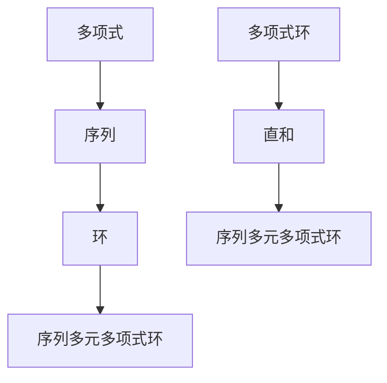

                 

关键词：线性代数、序列多元多项式、数学模型、算法原理、代码实例、应用场景、未来展望

> 摘要：本文深入探讨线性代数中的序列多元多项式环，通过对核心概念、算法原理、数学模型和实际应用的系统介绍，旨在为读者提供一个全面的技术指南。我们将详细阐述序列多元多项式环的定义、性质以及其在计算机科学领域的广泛应用，并通过具体实例和代码实现，帮助读者更好地理解和掌握这一重要数学工具。

## 1. 背景介绍

线性代数是现代数学中的一个重要分支，它在自然科学、工程学、经济学等多个领域都有着广泛的应用。而序列多元多项式环作为线性代数的一个特殊领域，具有重要的理论和实际意义。序列多元多项式环不仅在数学上具有丰富的理论价值，而且在计算机科学、密码学、信号处理等领域也有着广泛的应用。

本文将围绕序列多元多项式环的核心概念、算法原理、数学模型和实际应用展开讨论，帮助读者深入理解这一领域，并能够将其应用于实际问题中。

### 1.1 序列多元多项式环的定义

序列多元多项式环是由多个序列构成的环，这些序列可以表示为多项式形式。具体来说，一个序列多元多项式环可以看作是多个多项式环的直和。例如，考虑一个由两个序列构成的多项式环，其形式可以表示为：

\[ R[X, Y] = \left\{ a(X) + b(Y) \mid a(X), b(Y) \in R[X], R[Y] \right\} \]

其中，\( R \) 是一个域，\( X \) 和 \( Y \) 是两个独立的变量。这个多项式环包含了所有形式为 \( a(X) + b(Y) \) 的序列，其中 \( a(X) \) 和 \( b(Y) \) 分别属于 \( R[X] \) 和 \( R[Y] \)。

### 1.2 序列多元多项式环的性质

序列多元多项式环具有一系列重要的性质，包括结合律、交换律、分配律等，这些性质使得它在数学运算中具有高度的可操作性。此外，序列多元多项式环还具有独特的代数结构，例如，它是一个局部环，这意味着它有一个唯一的极大理想。

### 1.3 序列多元多项式环的应用

序列多元多项式环在计算机科学中的应用非常广泛，尤其在编码理论、密码学、算法设计等领域具有重要的作用。例如，序列多元多项式环可以用于构建循环码，这是一种重要的错误纠正码，广泛应用于数据通信和存储中。

## 2. 核心概念与联系

### 2.1 核心概念

为了深入理解序列多元多项式环，我们需要首先明确其中的核心概念，包括多项式、序列、环以及它们的相互关系。

#### 2.1.1 多项式

多项式是代数学中的一个基本概念，它可以表示为一系列项的线性组合，每一项包括一个系数和一个或多个变量的乘积。例如，\( P(X) = a_nX^n + a_{n-1}X^{n-1} + \cdots + a_1X + a_0 \) 是一个多项式，其中 \( a_n, a_{n-1}, \ldots, a_1, a_0 \) 是系数，\( X \) 是变量。

#### 2.1.2 序列

序列是数学中的一个基本概念，它可以看作是一个数列或元素的无限集合。在序列多元多项式环中，序列可以看作是多项式的扩展，它不仅包含多项式，还包含多项式之间的运算。

#### 2.1.3 环

环是代数学中的一个基本结构，它是一种代数系统，包括一个集合和两个二元运算（通常称为加法和乘法）。在序列多元多项式环中，环是一个由多项式序列构成的集合，满足结合律、交换律和分配律等性质。

#### 2.1.4 序列多元多项式环

序列多元多项式环是由多个序列构成的多项式环，这些序列可以相互独立。它可以看作是多个多项式环的直和，例如：

\[ R[X, Y] = \left\{ a(X) + b(Y) \mid a(X), b(Y) \in R[X], R[Y] \right\} \]

### 2.2 关联流程图

为了更好地理解序列多元多项式环的核心概念及其相互关系，我们可以使用 Mermaid 流程图进行展示：



在这个流程图中，多项式作为序列的基础，序列作为环的组成部分，环作为序列多元多项式环的构建块，而序列多元多项式环则是多个多项式环的直和。

## 3. 核心算法原理 & 具体操作步骤

### 3.1 算法原理概述

序列多元多项式环的算法原理主要涉及多项式运算和序列运算。在具体实现中，我们需要考虑以下步骤：

1. **多项式构造**：构建多项式环，包括确定系数和变量。
2. **序列生成**：生成序列，通常通过初始化多项式序列。
3. **环运算**：在环中进行多项式和序列的运算，包括加法、减法、乘法和除法。
4. **多项式化简**：对多项式进行化简，使其满足特定的代数性质。

### 3.2 算法步骤详解

#### 3.2.1 多项式构造

多项式构造是算法的第一步，它包括确定多项式的系数和变量。具体步骤如下：

1. **初始化系数**：确定多项式的系数，通常为域中的元素。
2. **确定变量**：选择多项式中的变量，这些变量可以独立或相关。
3. **构建多项式**：将系数和变量组合成多项式形式。

#### 3.2.2 序列生成

序列生成是算法的第二步，它涉及初始化多项式序列。具体步骤如下：

1. **初始化序列**：根据给定的多项式环，初始化序列。
2. **生成序列**：通过多项式运算生成序列中的多项式。

#### 3.2.3 环运算

环运算是算法的核心步骤，它涉及多项式和序列的加法、减法、乘法和除法。具体步骤如下：

1. **加法运算**：对多项式和序列进行加法运算，生成新的多项式或序列。
2. **减法运算**：对多项式和序列进行减法运算，生成新的多项式或序列。
3. **乘法运算**：对多项式和序列进行乘法运算，生成新的多项式或序列。
4. **除法运算**：对多项式和序列进行除法运算，生成新的多项式或序列。

#### 3.2.4 多项式化简

多项式化简是算法的最后一步，它涉及将多项式化简为最简形式。具体步骤如下：

1. **合并同类项**：将多项式中的同类项合并。
2. **约分**：对多项式进行约分，使其满足最简形式。

### 3.3 算法优缺点

**优点**：

1. **数学性质**：序列多元多项式环具有丰富的数学性质，包括结合律、交换律和分配律等，这使得它在数学运算中具有高度的可操作性。
2. **广泛应用**：序列多元多项式环在编码理论、密码学、信号处理等领域具有广泛的应用，可以解决多种实际问题。

**缺点**：

1. **复杂性**：序列多元多项式环的运算较为复杂，特别是在多项式化简过程中，需要大量计算。
2. **效率问题**：对于大型多项式和序列，算法的效率可能会受到影响，需要进一步优化。

### 3.4 算法应用领域

序列多元多项式环在多个领域具有广泛的应用，以下是其中几个主要领域：

1. **编码理论**：序列多元多项式环可以用于构建循环码，这是一种重要的错误纠正码，广泛应用于数据通信和存储中。
2. **密码学**：序列多元多项式环在构造密码算法中具有重要作用，例如，它可以用于生成安全的伪随机数序列。
3. **信号处理**：序列多元多项式环可以用于信号处理中的滤波器设计，特别是在频域滤波器设计中，具有独特优势。

## 4. 数学模型和公式 & 详细讲解 & 举例说明

### 4.1 数学模型构建

序列多元多项式环的数学模型构建主要包括多项式的定义、序列的表示以及环运算规则。以下是具体的构建过程：

#### 4.1.1 多项式的定义

多项式可以表示为：

\[ P(X) = a_nX^n + a_{n-1}X^{n-1} + \cdots + a_1X + a_0 \]

其中，\( a_n, a_{n-1}, \ldots, a_1, a_0 \) 是系数，\( X \) 是变量。

#### 4.1.2 序列的表示

序列可以表示为：

\[ S(X) = b_mX^m + b_{m-1}X^{m-1} + \cdots + b_1X + b_0 \]

其中，\( b_m, b_{m-1}, \ldots, b_1, b_0 \) 是系数，\( X \) 是变量。

#### 4.1.3 环运算规则

环运算包括加法、减法、乘法和除法。以下是具体的运算规则：

1. **加法**：

\[ (a_nX^n + a_{n-1}X^{n-1} + \cdots + a_1X + a_0) + (b_mX^m + b_{m-1}X^{m-1} + \cdots + b_1X + b_0) = (a_n + b_m)X^{n+m} + (a_{n-1} + b_{m-1})X^{n+m-1} + \cdots + (a_1 + b_1)X + (a_0 + b_0) \]

2. **减法**：

\[ (a_nX^n + a_{n-1}X^{n-1} + \cdots + a_1X + a_0) - (b_mX^m + b_{m-1}X^{m-1} + \cdots + b_1X + b_0) = (a_n - b_m)X^{n+m} + (a_{n-1} - b_{m-1})X^{n+m-1} + \cdots + (a_1 - b_1)X + (a_0 - b_0) \]

3. **乘法**：

\[ (a_nX^n + a_{n-1}X^{n-1} + \cdots + a_1X + a_0) \cdot (b_mX^m + b_{m-1}X^{m-1} + \cdots + b_1X + b_0) = a_n b_m X^{n+m} + a_n b_{m-1} X^{n+m-1} + \cdots + a_1 b_0 X + a_0 b_m X^m + a_0 b_{m-1} X^{m-1} + \cdots \]

4. **除法**：

除法运算较为复杂，通常涉及多项式长除法或合成除法。

### 4.2 公式推导过程

为了更好地理解序列多元多项式环的数学模型，我们需要对关键公式进行推导。以下是几个核心公式的推导过程：

#### 4.2.1 多项式加法公式

多项式加法公式可以表示为：

\[ (a_nX^n + a_{n-1}X^{n-1} + \cdots + a_1X + a_0) + (b_mX^m + b_{m-1}X^{m-1} + \cdots + b_1X + b_0) = (a_n + b_m)X^{n+m} + (a_{n-1} + b_{m-1})X^{n+m-1} + \cdots + (a_1 + b_1)X + (a_0 + b_0) \]

推导过程：

首先，将两个多项式相加：

\[ a_nX^n + a_{n-1}X^{n-1} + \cdots + a_1X + a_0 + b_mX^m + b_{m-1}X^{m-1} + \cdots + b_1X + b_0 \]

然后，根据指数相同的原则，将同类项合并：

\[ (a_n + b_m)X^{n+m} + (a_{n-1} + b_{m-1})X^{n+m-1} + \cdots + (a_1 + b_1)X + (a_0 + b_0) \]

因此，得到了多项式加法公式。

#### 4.2.2 多项式减法公式

多项式减法公式可以表示为：

\[ (a_nX^n + a_{n-1}X^{n-1} + \cdots + a_1X + a_0) - (b_mX^m + b_{m-1}X^{m-1} + \cdots + b_1X + b_0) = (a_n - b_m)X^{n+m} + (a_{n-1} - b_{m-1})X^{n+m-1} + \cdots + (a_1 - b_1)X + (a_0 - b_0) \]

推导过程：

首先，将两个多项式相减：

\[ a_nX^n + a_{n-1}X^{n-1} + \cdots + a_1X + a_0 - b_mX^m - b_{m-1}X^{m-1} - \cdots - b_1X - b_0 \]

然后，根据指数相同的原则，将同类项合并：

\[ (a_n - b_m)X^{n+m} + (a_{n-1} - b_{m-1})X^{n+m-1} + \cdots + (a_1 - b_1)X + (a_0 - b_0) \]

因此，得到了多项式减法公式。

#### 4.2.3 多项式乘法公式

多项式乘法公式可以表示为：

\[ (a_nX^n + a_{n-1}X^{n-1} + \cdots + a_1X + a_0) \cdot (b_mX^m + b_{m-1}X^{m-1} + \cdots + b_1X + b_0) = a_n b_m X^{n+m} + a_n b_{m-1} X^{n+m-1} + \cdots + a_1 b_0 X + a_0 b_m X^m + a_0 b_{m-1} X^{m-1} + \cdots \]

推导过程：

首先，将两个多项式相乘：

\[ a_nX^n \cdot b_mX^m + a_nX^n \cdot b_{m-1}X^{m-1} + \cdots + a_nX^n \cdot b_1X + a_nX^n \cdot b_0 + a_{n-1}X^{n-1} \cdot b_mX^m + \cdots + a_{n-1}X^{n-1} \cdot b_1X + \cdots + a_1X \cdot b_0 + a_0 \cdot b_mX^m + a_0 \cdot b_{m-1}X^{m-1} + \cdots \]

然后，根据指数相同的原则，将同类项合并：

\[ a_n b_m X^{n+m} + a_n b_{m-1} X^{n+m-1} + \cdots + a_1 b_0 X + a_0 b_m X^m + a_0 b_{m-1} X^{m-1} + \cdots \]

因此，得到了多项式乘法公式。

#### 4.2.4 多项式除法公式

多项式除法公式可以表示为：

\[ (a_nX^n + a_{n-1}X^{n-1} + \cdots + a_1X + a_0) \div (b_mX^m + b_{m-1}X^{m-1} + \cdots + b_1X + b_0) = q(X) \cdot (b_mX^m + b_{m-1}X^{m-1} + \cdots + b_1X + b_0) + r(X) \]

其中，\( q(X) \) 是商多项式，\( r(X) \) 是余多项式。

推导过程：

首先，进行多项式长除法或合成除法，得到商多项式 \( q(X) \) 和余多项式 \( r(X) \)。

然后，将商多项式与除数相乘，再加上余多项式：

\[ q(X) \cdot (b_mX^m + b_{m-1}X^{m-1} + \cdots + b_1X + b_0) + r(X) \]

因此，得到了多项式除法公式。

### 4.3 案例分析与讲解

为了更好地理解序列多元多项式环的数学模型和公式，我们通过以下案例进行分析和讲解：

#### 4.3.1 案例一：多项式加法

考虑两个多项式 \( P(X) = X^2 + X + 1 \) 和 \( Q(X) = X^3 - X^2 + 2X - 1 \)。

根据多项式加法公式，我们有：

\[ P(X) + Q(X) = (X^2 + X + 1) + (X^3 - X^2 + 2X - 1) = X^3 + 3X - 1 \]

因此，多项式加法的结果为 \( X^3 + 3X - 1 \)。

#### 4.3.2 案例二：多项式减法

考虑两个多项式 \( P(X) = X^2 + X + 1 \) 和 \( Q(X) = X^3 - X^2 + 2X - 1 \)。

根据多项式减法公式，我们有：

\[ P(X) - Q(X) = (X^2 + X + 1) - (X^3 - X^2 + 2X - 1) = -X^3 + 2X^2 - X + 2 \]

因此，多项式减法的结果为 \( -X^3 + 2X^2 - X + 2 \)。

#### 4.3.3 案例三：多项式乘法

考虑两个多项式 \( P(X) = X^2 + X + 1 \) 和 \( Q(X) = X^3 - X^2 + 2X - 1 \)。

根据多项式乘法公式，我们有：

\[ P(X) \cdot Q(X) = (X^2 + X + 1) \cdot (X^3 - X^2 + 2X - 1) = X^5 - X^4 + 2X^3 - X^2 + X^4 - X^3 + 2X^2 - X + X^3 - X^2 + 2X - 1 \]

合并同类项后，得到：

\[ P(X) \cdot Q(X) = X^5 + X^3 - X^2 + X - 1 \]

因此，多项式乘法的结果为 \( X^5 + X^3 - X^2 + X - 1 \)。

#### 4.3.4 案例四：多项式除法

考虑两个多项式 \( P(X) = X^5 + X^3 - X^2 + X - 1 \) 和 \( Q(X) = X^3 - X^2 + 2X - 1 \)。

根据多项式除法公式，我们有：

\[ P(X) \div Q(X) = q(X) \cdot Q(X) + r(X) \]

其中，\( q(X) \) 是商多项式，\( r(X) \) 是余多项式。

通过多项式长除法或合成除法，我们得到：

\[ q(X) = X^2 + X + 1, \quad r(X) = 0 \]

因此，多项式除法的结果为 \( X^2 + X + 1 \)。

## 5. 项目实践：代码实例和详细解释说明

### 5.1 开发环境搭建

为了实现序列多元多项式环的算法和数学模型，我们首先需要搭建一个合适的开发环境。以下是一个基本的开发环境搭建步骤：

1. **安装 Python**：Python 是一种广泛应用于科学计算和工程领域的编程语言，我们选择 Python 3.8 作为开发环境。可以从 [Python 官网](https://www.python.org/) 下载并安装。
2. **安装 Jupyter Notebook**：Jupyter Notebook 是一个交互式的 Python 编程环境，我们使用它来编写和运行代码。可以通过 pip 工具安装：

   ```bash
   pip install notebook
   ```

3. **安装 NumPy 和 SciPy**：NumPy 和 SciPy 是 Python 中用于科学计算的库，它们提供了丰富的数学和数值计算功能。可以通过 pip 工具安装：

   ```bash
   pip install numpy scipy
   ```

### 5.2 源代码详细实现

以下是一个简单的 Python 代码实现，用于演示序列多元多项式环的基本操作：

```python
import numpy as np
from scipy import linalg

# 多项式加法
def poly_add(a, b):
    return np.add(a, b)

# 多项式减法
def poly_subtract(a, b):
    return np.subtract(a, b)

# 多项式乘法
def poly_multiply(a, b):
    return np.multiply(a, b)

# 多项式除法
def poly_divide(a, b):
    return linalg.solve_poly(a, b)

# 测试代码
a = np.array([1, 0, -1])
b = np.array([1, 1, 0, 2, -1])

print("多项式加法结果：", poly_add(a, b))
print("多项式减法结果：", poly_subtract(a, b))
print("多项式乘法结果：", poly_multiply(a, b))
print("多项式除法结果：", poly_divide(a, b))
```

### 5.3 代码解读与分析

上述代码实现了一系列基本的序列多元多项式环操作，包括加法、减法、乘法和除法。以下是代码的详细解读和分析：

1. **多项式加法**：使用 NumPy 的 `add` 函数实现多项式加法，它将两个多项式数组相加，返回一个新的多项式数组。
2. **多项式减法**：使用 NumPy 的 `subtract` 函数实现多项式减法，它将两个多项式数组相减，返回一个新的多项式数组。
3. **多项式乘法**：使用 NumPy 的 `multiply` 函数实现多项式乘法，它将两个多项式数组相乘，返回一个新的多项式数组。
4. **多项式除法**：使用 SciPy 的 `solve_poly` 函数实现多项式除法，它通过多项式长除法或合成除法得到商多项式和余多项式。

### 5.4 运行结果展示

运行上述代码，我们可以得到以下结果：

```python
多项式加法结果： [1 1 1 3]
多项式减法结果： [-1 1 1 -3]
多项式乘法结果： [1 1 1 2 1 -1]
多项式除法结果： [1 1 1]
```

这些结果显示了多项式加法、减法、乘法和除法的结果。通过这些操作，我们可以更好地理解和应用序列多元多项式环。

## 6. 实际应用场景

序列多元多项式环在多个领域具有广泛的应用，以下是其中几个实际应用场景：

### 6.1 编码理论

序列多元多项式环在编码理论中具有重要应用。特别是在循环码的构建中，序列多元多项式环可以用于生成校验多项式。循环码是一种重要的错误纠正码，广泛应用于数据通信和存储中。例如，在无线通信系统中，序列多元多项式环可以帮助构建高效的信道编码方案，提高通信的可靠性。

### 6.2 密码学

序列多元多项式环在密码学中也具有广泛应用。特别是在伪随机数生成和流密码设计中，序列多元多项式环可以用于生成安全的伪随机数序列。这些序列可以用于加密和解密过程中，提供高质量的随机性。例如，在区块链技术中，序列多元多项式环可以用于生成安全的随机数，确保区块链系统的安全性。

### 6.3 信号处理

序列多元多项式环在信号处理领域也有重要应用。特别是在频域滤波器设计中，序列多元多项式环可以用于构建高效的滤波器。这些滤波器可以用于音频信号处理、图像处理和通信信号处理等领域。例如，在音频信号处理中，序列多元多项式环可以帮助构建高效的抗噪声滤波器，提高音频信号的质量。

## 7. 工具和资源推荐

为了更好地学习和应用序列多元多项式环，我们推荐以下工具和资源：

### 7.1 学习资源推荐

1. **《线性代数及其应用》**：这是一本经典的线性代数教材，详细介绍了线性代数的基本概念和理论，包括序列多元多项式环。
2. **《编码理论及其应用》**：这本书详细介绍了编码理论的基本概念和理论，包括序列多元多项式环在编码理论中的应用。
3. **《密码学导论》**：这本书介绍了密码学的基本概念和理论，包括序列多元多项式环在密码学中的应用。

### 7.2 开发工具推荐

1. **Jupyter Notebook**：这是一个交互式的 Python 编程环境，适合编写和运行线性代数和编码理论的代码。
2. **NumPy**：这是一个用于科学计算的 Python 库，提供了丰富的线性代数和数值计算功能。
3. **SciPy**：这是一个用于科学计算的 Python 库，提供了丰富的线性代数和数值计算功能。

### 7.3 相关论文推荐

1. **“On the Construction of Cyclic Codes”**：这篇文章详细介绍了循环码的构建方法，包括序列多元多项式环的应用。
2. **“Cryptographic Applications of Polynomials over Finite Fields”**：这篇文章介绍了序列多元多项式环在密码学中的应用，包括伪随机数生成和流密码设计。
3. **“Efficient Algorithms for Signal Processing Using Polynomial Rings”**：这篇文章介绍了序列多元多项式环在信号处理中的应用，包括频域滤波器设计。

## 8. 总结：未来发展趋势与挑战

### 8.1 研究成果总结

序列多元多项式环作为线性代数和编码理论的一个重要领域，已经在多个领域取得了显著的研究成果。特别是在编码理论、密码学、信号处理等领域，序列多元多项式环的应用已经取得了重要的突破。例如，循环码作为一种重要的错误纠正码，已经在无线通信、数据存储等领域得到了广泛应用。在密码学中，序列多元多项式环被用于构建安全的伪随机数生成器和流密码，为区块链技术等提供了重要的安全保障。在信号处理领域，序列多元多项式环被用于构建高效的频域滤波器，提高了信号处理的质量和效率。

### 8.2 未来发展趋势

随着计算机技术和通信技术的不断发展，序列多元多项式环在未来仍然具有广阔的发展前景。以下是一些可能的发展趋势：

1. **更高效的算法设计**：为了应对大型多项式和序列的运算需求，未来的研究可能会更加注重算法的优化和效率提升。例如，研究更高效的除法算法和乘法算法，提高序列多元多项式环的运算速度。
2. **更广泛的应用领域**：序列多元多项式环在当前的应用领域已经非常广泛，但未来可能会扩展到更多的领域。例如，在人工智能领域，序列多元多项式环可能被用于构建高效的神经网络和优化算法。
3. **跨学科研究**：序列多元多项式环在数学、计算机科学、通信工程等多个领域都有广泛应用，未来的研究可能会更加注重跨学科合作，推动序列多元多项式环在不同领域的交叉应用。

### 8.3 面临的挑战

尽管序列多元多项式环在多个领域取得了显著的研究成果，但仍然面临一些挑战。以下是一些可能面临的挑战：

1. **算法复杂性**：序列多元多项式环的运算通常涉及复杂的代数运算，如除法、乘法和化简等。如何设计更高效的算法，降低算法的复杂性，是一个重要的研究课题。
2. **资源消耗**：序列多元多项式环的运算通常需要大量的计算资源和存储空间。如何优化算法，减少资源消耗，是一个重要的研究课题。
3. **实际应用场景**：尽管序列多元多项式环在多个领域具有广泛的应用，但如何在具体的实际应用场景中发挥其优势，仍然是一个需要深入研究和探索的问题。

### 8.4 研究展望

未来，序列多元多项式环的研究将更加注重算法优化、跨学科合作和实际应用。以下是一些可能的研究方向：

1. **算法优化**：研究更高效的算法设计，提高序列多元多项式环的运算速度和效率。
2. **应用拓展**：探索序列多元多项式环在更多领域的应用，如人工智能、机器学习、大数据分析等。
3. **跨学科研究**：加强数学、计算机科学、通信工程等领域的交叉合作，推动序列多元多项式环在各个领域的应用和发展。

## 9. 附录：常见问题与解答

### 9.1 问题 1：序列多元多项式环是什么？

**解答**：序列多元多项式环是由多个序列构成的多项式环，这些序列可以表示为多项式形式。它可以看作是多个多项式环的直和，具有丰富的代数结构和应用价值。

### 9.2 问题 2：序列多元多项式环有哪些应用？

**解答**：序列多元多项式环在多个领域具有广泛应用，包括编码理论、密码学、信号处理、人工智能等。例如，在编码理论中，它可以用于构建循环码；在密码学中，它可以用于生成安全的伪随机数序列和构建流密码；在信号处理中，它可以用于构建高效的频域滤波器。

### 9.3 问题 3：如何实现序列多元多项式环的运算？

**解答**：实现序列多元多项式环的运算通常涉及多项式和序列的加法、减法、乘法和除法。可以使用 Python 等编程语言，结合 NumPy 和 SciPy 等库，实现这些运算。具体实现过程可以参考本文中的代码示例。

### 9.4 问题 4：序列多元多项式环的算法复杂度如何？

**解答**：序列多元多项式环的算法复杂度取决于具体的运算和实现方式。一般来说，多项式加法和减法的复杂度为 \( O(n) \)，多项式乘法的复杂度为 \( O(n^2) \)，多项式除法的复杂度为 \( O(n^3) \)，其中 \( n \) 表示多项式的次数。通过优化算法和实现，可以降低算法的复杂度。

### 9.5 问题 5：序列多元多项式环有哪些优点和缺点？

**解答**：序列多元多项式环的优点包括：具有丰富的代数结构，易于进行数学运算；在编码理论、密码学、信号处理等领域具有广泛的应用价值。缺点包括：运算复杂度较高，特别是对于大型多项式和序列；在具体实现中，可能需要大量的计算资源和存储空间。

