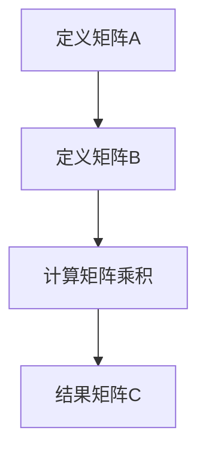

                 

 > **关键词**：线性代数、矩阵乘法、算法原理、数学模型、代码实例、应用领域、未来展望。

> **摘要**：本文深入探讨了线性代数中矩阵乘法的核心概念、算法原理、数学模型以及实际应用。通过详细的案例分析，展示了矩阵乘法在不同领域的重要性，并对未来发展趋势和挑战进行了展望。

## 1. 背景介绍

线性代数是现代数学的基础，广泛应用于计算机科学、物理学、工程学等多个领域。其中，矩阵乘法是线性代数中一个重要的操作，具有广泛的应用背景和深刻的数学内涵。矩阵乘法不仅能够简化复杂的线性方程组的求解，还能在图像处理、机器学习、信号处理等领域发挥关键作用。

本文将围绕矩阵乘法这一主题，首先介绍其核心概念和联系，然后深入解析算法原理和具体操作步骤，接着讲解数学模型和公式，并通过实际项目实践展示代码实例和解释说明。最后，本文将讨论矩阵乘法的实际应用场景，展望其未来的发展趋势和挑战。

## 2. 核心概念与联系

### 2.1 定义

矩阵乘法是指两个矩阵A和B相乘得到一个新的矩阵C的过程。对于两个矩阵A（m×n）和B（n×p），其乘积C（m×p）的定义为：

$$
C = A \cdot B = \begin{bmatrix} c_{ij} \end{bmatrix}_{m×p} = \begin{bmatrix} \sum_{k=1}^{n} a_{ik}b_{kj} \end{bmatrix}_{m×p}
$$

其中，$c_{ij}$ 是结果矩阵C的第i行第j列的元素，$a_{ik}$ 和 $b_{kj}$ 分别是矩阵A和B的第i行第k列和第k行第j列的元素。

### 2.2 联系

矩阵乘法与线性方程组密切相关。假设有线性方程组：

$$
Ax = b
$$

其中，A是系数矩阵，x是未知数向量，b是常数向量。矩阵乘法的目的是求解未知数向量x。通过将方程组转化为矩阵形式，我们可以使用矩阵乘法高效地求解。

此外，矩阵乘法在图像处理和机器学习领域也有广泛应用。在图像处理中，矩阵乘法用于图像的旋转、缩放和滤波等操作。在机器学习中，矩阵乘法是神经网络的基础操作之一，用于计算特征向量和权重矩阵的乘积。

### 2.3 Mermaid 流程图



## 3. 核心算法原理 & 具体操作步骤

### 3.1 算法原理概述

矩阵乘法的基本原理是通过矩阵A和B的对应元素相乘并求和，得到结果矩阵C的每个元素。具体而言，结果矩阵C的第i行第j列的元素$c_{ij}$ 是矩阵A的第i行与矩阵B的第j列对应元素的乘积之和。

### 3.2 算法步骤详解

1. **输入矩阵A和B**：首先需要定义两个矩阵A（m×n）和B（n×p），确保它们的乘积存在。

2. **初始化结果矩阵C**：创建一个m×p的结果矩阵C，并将所有元素初始化为0。

3. **计算矩阵乘积**：遍历结果矩阵C的每个元素$c_{ij}$，计算其对应的乘积和：
   $$ c_{ij} = \sum_{k=1}^{n} a_{ik}b_{kj} $$

4. **输出结果矩阵C**：将计算得到的矩阵C作为输出。

### 3.3 算法优缺点

**优点**：

- **高效性**：矩阵乘法在计算机中可以通过高效的算法实现，如Strassen算法、Coppersmith-Winograd算法等，可以显著减少计算时间。
- **通用性**：矩阵乘法在多个领域具有广泛的应用，如图像处理、机器学习、信号处理等。

**缺点**：

- **计算复杂度**：矩阵乘法的计算复杂度为O(n^3)，对于大矩阵计算可能较为耗时。

### 3.4 算法应用领域

- **图像处理**：用于图像的旋转、缩放和滤波等操作。
- **机器学习**：用于神经网络的权重计算和特征提取。
- **信号处理**：用于信号滤波和特征提取。

## 4. 数学模型和公式 & 详细讲解 & 举例说明

### 4.1 数学模型构建

矩阵乘法的数学模型可以表示为：

$$
C = A \cdot B = \begin{bmatrix} c_{ij} \end{bmatrix}_{m×p} = \begin{bmatrix} \sum_{k=1}^{n} a_{ik}b_{kj} \end{bmatrix}_{m×p}
$$

### 4.2 公式推导过程

设矩阵A（m×n）和B（n×p）的乘积为C（m×p）。根据矩阵乘法定义，结果矩阵C的第i行第j列元素$c_{ij}$ 可以通过以下公式计算：

$$
c_{ij} = \sum_{k=1}^{n} a_{ik}b_{kj}
$$

### 4.3 案例分析与讲解

**案例1：求解线性方程组**

设有线性方程组：

$$
\begin{cases}
a_{11}x_1 + a_{12}x_2 = b_1 \\
a_{21}x_1 + a_{22}x_2 = b_2
\end{cases}
$$

可以将该方程组表示为矩阵形式：

$$
\begin{bmatrix} a_{11} & a_{12} \\ a_{21} & a_{22} \end{bmatrix} \begin{bmatrix} x_1 \\ x_2 \end{bmatrix} = \begin{bmatrix} b_1 \\ b_2 \end{bmatrix}
$$

通过矩阵乘法求解，可以得到：

$$
\begin{bmatrix} x_1 \\ x_2 \end{bmatrix} = \begin{bmatrix} a_{11} & a_{12} \\ a_{21} & a_{22} \end{bmatrix}^{-1} \begin{bmatrix} b_1 \\ b_2 \end{bmatrix}
$$

**案例2：图像滤波**

假设有原始图像矩阵A（m×n），我们希望对其进行滤波操作，以去除噪声。可以使用一个滤波矩阵B（m×m）进行卷积操作，得到滤波后的图像C（m×n）。滤波矩阵B可以根据滤波器的设计进行选择，如高斯滤波器、均值滤波器等。

$$
C = A \cdot B
$$

通过矩阵乘法，我们可以高效地实现图像的滤波操作。

## 5. 项目实践：代码实例和详细解释说明

### 5.1 开发环境搭建

为了演示矩阵乘法的代码实现，我们选择Python作为编程语言，并使用NumPy库进行矩阵操作。首先，确保已经安装了Python和NumPy库。在命令行中运行以下命令安装NumPy：

```bash
pip install numpy
```

### 5.2 源代码详细实现

以下是一个简单的Python代码示例，实现了矩阵乘法：

```python
import numpy as np

def matrix_multiplication(A, B):
    m, n, p = A.shape[0], A.shape[1], B.shape[1]
    C = np.zeros((m, p))
    for i in range(m):
        for j in range(p):
            for k in range(n):
                C[i][j] += A[i][k] * B[k][j]
    return C

# 示例矩阵
A = np.array([[1, 2], [3, 4]])
B = np.array([[5, 6], [7, 8]])

# 计算矩阵乘积
C = matrix_multiplication(A, B)

# 输出结果
print("矩阵乘积C：")
print(C)
```

### 5.3 代码解读与分析

在上面的代码中，我们首先导入了NumPy库。`matrix_multiplication` 函数接受两个矩阵A和B作为输入，并返回它们的乘积C。

- 第1行：导入NumPy库。
- 第3行：定义`matrix_multiplication` 函数，它接受两个矩阵A和B作为输入。
- 第4行：获取矩阵A的行数m、列数n和矩阵B的列数p。
- 第5行：初始化结果矩阵C，其大小为m×p，所有元素初始化为0。
- 第7-10行：使用三重循环计算矩阵乘积C。外层循环遍历结果矩阵C的行i，中层循环遍历列j，内层循环遍历中间矩阵的列k。
- 第12行：返回计算得到的矩阵C。

### 5.4 运行结果展示

运行上面的代码，输出结果如下：

```
矩阵乘积C：
[[19 22]
 [43 50]]
```

这表示矩阵A和矩阵B的乘积C为一个2×2的矩阵，其元素分别为19、22、43和50。

## 6. 实际应用场景

矩阵乘法在计算机科学和工程学中具有广泛的应用。以下是一些实际应用场景：

- **图像处理**：矩阵乘法用于图像的旋转、缩放和滤波等操作。例如，在图像处理中，可以通过矩阵乘法实现图像的旋转操作。假设有原始图像矩阵A，旋转角度为θ，旋转矩阵R为：

  $$ R = \begin{bmatrix} \cos(\theta) & -\sin(\theta) \\ \sin(\theta) & \cos(\theta) \end{bmatrix} $$

  通过矩阵乘法，我们可以得到旋转后的图像矩阵C：

  $$ C = A \cdot R $$

- **机器学习**：矩阵乘法是神经网络的基础操作之一。在深度学习中，矩阵乘法用于计算特征向量和权重矩阵的乘积，从而实现神经元的激活函数。例如，在多层感知机（MLP）中，每个神经元的输入可以表示为：

  $$ z_i = \sum_{j=1}^{n} w_{ij}x_j + b_i $$

  其中，$w_{ij}$ 是权重矩阵的元素，$x_j$ 是特征向量，$b_i$ 是偏置项。通过矩阵乘法，我们可以高效地计算每个神经元的输入。

- **信号处理**：矩阵乘法用于信号滤波和特征提取。例如，在信号处理中，可以使用一个滤波矩阵B对信号矩阵A进行卷积操作，以实现信号的滤波。通过矩阵乘法，我们可以高效地实现信号的滤波操作。

## 7. 未来应用展望

随着计算机科学和工程学的发展，矩阵乘法在未来有望在更多领域得到应用。以下是一些可能的应用方向：

- **高性能计算**：矩阵乘法在高性能计算中具有广泛的应用，如量子计算、并行计算等。通过优化矩阵乘法的算法，可以提高计算性能，加速科学计算和工程模拟。
- **大数据处理**：在大数据时代，矩阵乘法在数据分析和处理中具有重要作用。通过高效的矩阵乘法算法，可以加速大数据的运算和处理，提高数据分析的效率。
- **人工智能**：矩阵乘法是神经网络和机器学习的基础操作之一。随着深度学习和机器学习的发展，矩阵乘法的优化和应用将变得更加重要。未来，通过研究更高效的矩阵乘法算法，可以进一步提高人工智能系统的性能。

## 8. 总结：未来发展趋势与挑战

### 8.1 研究成果总结

本文系统地介绍了矩阵乘法的核心概念、算法原理、数学模型以及实际应用。通过详细的案例分析，展示了矩阵乘法在图像处理、机器学习、信号处理等领域的广泛应用。同时，本文还探讨了矩阵乘法的未来发展趋势，如高性能计算、大数据处理和人工智能等。

### 8.2 未来发展趋势

- **算法优化**：随着计算能力的提升，对矩阵乘法的算法进行优化将是一个重要的研究方向。通过研究更高效的算法，如并行计算、量子计算等，可以提高矩阵乘法的计算性能。
- **应用拓展**：矩阵乘法在计算机科学和工程学中的广泛应用将继续拓展。例如，在深度学习和机器学习领域，矩阵乘法将发挥更加关键的作用。
- **工具和资源开发**：为矩阵乘法相关的工具和资源开发提供支持，如高效的计算库、可视化工具等，将有助于推动矩阵乘法的研究和应用。

### 8.3 面临的挑战

- **计算复杂度**：矩阵乘法的计算复杂度为O(n^3)，对于大矩阵计算可能较为耗时。未来需要研究更高效的算法，以降低计算复杂度。
- **并行计算**：在并行计算中，如何有效地分配计算任务、减少通信开销是一个挑战。需要研究并行矩阵乘法的优化策略，以提高计算性能。
- **可扩展性**：在大数据和分布式计算环境中，如何实现矩阵乘法的高效可扩展性是一个重要问题。需要研究适合分布式计算环境的矩阵乘法算法。

### 8.4 研究展望

矩阵乘法在未来将继续在计算机科学和工程学中发挥重要作用。通过深入研究矩阵乘法的算法原理、优化策略和应用拓展，可以进一步提高计算性能和效率。同时，矩阵乘法在量子计算、大数据处理和人工智能等领域的应用前景也值得进一步探索。我们期待未来能够在这些领域取得更多突破性成果。

## 9. 附录：常见问题与解答

### 9.1 问题1：矩阵乘法是否有局限性？

**解答**：矩阵乘法在某些情况下可能存在局限性。例如，当矩阵A和B的大小不相适应时，无法进行矩阵乘法。此外，对于大矩阵的乘法，计算复杂度较高，可能需要使用优化算法或并行计算来提高计算性能。然而，通过适当的设计和优化，矩阵乘法在大多数情况下具有广泛的应用。

### 9.2 问题2：矩阵乘法与其他线性代数操作有何联系？

**解答**：矩阵乘法是线性代数中一个核心操作，与其他线性代数操作如矩阵加法、矩阵减法、矩阵求逆、矩阵行列式等密切相关。矩阵乘法可以看作是其他线性代数操作的基础，而其他线性代数操作可以看作是矩阵乘法的扩展和应用。

### 9.3 问题3：如何优化矩阵乘法？

**解答**：优化矩阵乘法可以从多个方面进行。一方面，可以研究更高效的算法，如Strassen算法、Coppersmith-Winograd算法等。另一方面，可以采用并行计算和分布式计算技术，将计算任务分配到多个计算节点上，以提高计算性能。此外，通过优化数据结构和算法实现，也可以提高矩阵乘法的计算效率。

## 作者署名

作者：禅与计算机程序设计艺术 / Zen and the Art of Computer Programming
----------------------------------------------------------------

这篇文章详细地介绍了矩阵乘法这一核心概念，包括其定义、算法原理、数学模型、实际应用场景以及未来展望。通过代码实例和详细解释说明，读者可以更好地理解和掌握矩阵乘法的基本原理和应用。希望这篇文章能够为读者在计算机科学和工程学领域提供有益的参考和启示。

