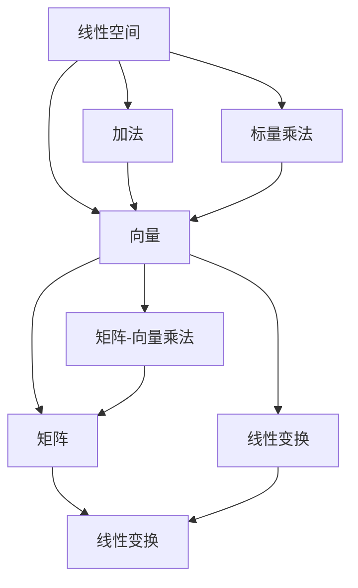

                 

关键词：线性代数、线性空间、线性变换、矩阵、向量、算法、数学模型、计算机编程

> 摘要：本文旨在引导读者深入了解线性代数在计算机科学中的应用，特别是线性空间的概念与相关算法。通过详细阐述线性代数的基础理论、核心算法、数学模型及其在实际项目中的应用，本文希望能够为读者提供一幅清晰的线性代数应用全景图，从而激发对这一领域更深层次的探索和研究。

## 1. 背景介绍

线性代数是数学的一个重要分支，其核心概念和理论在计算机科学中具有广泛的应用。从矩阵和向量到线性变换和特征值，线性代数为计算机科学家提供了强有力的工具，用于解决各种复杂问题。在计算机图形学、数据科学、机器学习、网络理论等领域，线性代数的方法和算法无处不在。

线性空间（Vector Space）是线性代数中的基础概念之一，它为向量集合提供了一种抽象的数学框架。线性空间中的元素被称为向量，它们可以通过向量加法和标量乘法进行运算。线性空间的定义和性质为我们理解向量之间的关系和操作提供了坚实的基础。

本文将围绕线性空间的概念，探讨线性代数在计算机科学中的应用，特别是线性变换和矩阵理论。通过分析核心算法、数学模型以及实际应用场景，本文希望能够帮助读者掌握线性代数的关键技术，并在未来的计算机科学研究中发挥重要作用。

## 2. 核心概念与联系

### 2.1 线性空间的基本概念

线性空间是一个由向量组成的集合，这些向量可以按照特定的规则进行加法和标量乘法。具体来说，一个线性空间需要满足以下条件：

1. **闭合性**：对于任意的向量 \( \vec{u} \) 和 \( \vec{v} \) 以及标量 \( a \) 和 \( b \)，向量加法 \( \vec{u} + \vec{v} \) 和标量乘法 \( a\vec{u} + b\vec{v} \) 仍然属于该线性空间。
2. **交换律**：向量加法满足交换律，即 \( \vec{u} + \vec{v} = \vec{v} + \vec{u} \)。
3. **结合律**：向量加法满足结合律，即 \( (\vec{u} + \vec{v}) + \vec{w} = \vec{u} + (\vec{v} + \vec{w}) \)。
4. **存在零向量**：线性空间中存在一个零向量 \( \vec{0} \)，使得对于任意向量 \( \vec{u} \)，都有 \( \vec{u} + \vec{0} = \vec{u} \)。
5. **存在逆向量**：对于每个非零向量 \( \vec{u} \)，存在一个逆向量 \( -\vec{u} \)，使得 \( \vec{u} + (-\vec{u}) = \vec{0} \)。
6. **分配律**：标量乘法对向量加法满足分配律，即 \( a(\vec{u} + \vec{v}) = a\vec{u} + a\vec{v} \) 和 \( (a + b)\vec{u} = a\vec{u} + b\vec{u} \)。

线性空间是线性代数的核心概念，为各种向量运算提供了统一的框架。在计算机科学中，线性空间广泛应用于数据结构和算法设计中，例如矩阵、向量以及线性变换。

### 2.2 线性空间中的向量表示

在数学中，向量通常用字母 \( \vec{u} \)、\( \vec{v} \) 等表示。为了具体表示一个向量，我们通常使用分量表示法，即将向量分解成其分量在各个基向量上的投影。例如，一个二维向量 \( \vec{u} \) 可以表示为：

\[ \vec{u} = (u_1, u_2) \]

其中，\( u_1 \) 和 \( u_2 \) 分别是向量 \( \vec{u} \) 在基向量 \( \vec{i} \) 和 \( \vec{j} \) 上的投影。类似地，三维向量可以表示为：

\[ \vec{u} = (u_1, u_2, u_3) \]

### 2.3 线性空间中的矩阵表示

矩阵是线性空间中的一种特殊结构，它是由一系列数字按照一定的格式排列成的矩形阵列。矩阵可以表示线性空间中的线性变换，即从一个线性空间到另一个线性空间的映射。

一个 \( m \times n \) 的矩阵通常表示为 \( A = [a_{ij}] \)，其中 \( a_{ij} \) 是矩阵的第 \( i \) 行第 \( j \) 列的元素。矩阵可以与向量进行矩阵-向量乘法，即：

\[ A\vec{u} = [a_{11}u_1 + a_{12}u_2 + \ldots + a_{1n}u_n, a_{21}u_1 + a_{22}u_2 + \ldots + a_{2n}u_n, \ldots, a_{m1}u_1 + a_{m2}u_2 + \ldots + a_{mn}u_n] \]

矩阵-向量乘法可以看作是线性空间中的线性变换，即将向量 \( \vec{u} \) 通过矩阵 \( A \) 进行映射，得到一个新的向量。

### 2.4 线性空间中的线性变换

线性变换是线性代数中的另一个核心概念，它描述了一个线性空间到另一个线性空间的映射。线性变换可以通过矩阵表示，并且满足以下性质：

1. **加法保持性**：对于任意的向量 \( \vec{u} \) 和 \( \vec{v} \)，以及线性变换 \( T \)，都有 \( T(\vec{u} + \vec{v}) = T(\vec{u}) + T(\vec{v}) \)。
2. **标量乘法保持性**：对于任意的向量 \( \vec{u} \) 以及标量 \( a \)，以及线性变换 \( T \)，都有 \( T(a\vec{u}) = aT(\vec{u}) \)。

线性变换在计算机科学中有着广泛的应用，例如图像处理、信号处理、机器学习等。

### 2.5 线性空间中的相关关系

线性空间、向量、矩阵和线性变换之间存在紧密的联系。线性空间为向量提供了一个抽象的数学框架，向量可以通过矩阵进行表示和操作，而矩阵则可以表示线性变换。这些概念共同构成了线性代数的基础，为计算机科学中的各种应用提供了强有力的工具。

为了更好地理解这些概念之间的关系，我们可以使用 Mermaid 流程图进行可视化表示：



这个流程图展示了线性空间、向量、矩阵和线性变换之间的基本关系，以及它们在加法和标量乘法操作中的应用。

## 3. 核心算法原理 & 具体操作步骤

### 3.1 算法原理概述

线性代数中的核心算法主要包括矩阵运算、向量运算以及线性变换。这些算法在计算机科学中有着广泛的应用，例如在图像处理、信号处理、机器学习等领域。以下是对这些核心算法原理的概述：

1. **矩阵运算**：矩阵运算是线性代数中的基本操作，包括矩阵加法、矩阵乘法、矩阵求逆等。矩阵运算可以表示线性空间中的各种变换和关系。
2. **向量运算**：向量运算是线性代数中的另一个重要组成部分，包括向量加法、向量减法、向量标量乘法等。向量运算可以用于计算向量的长度、夹角等属性。
3. **线性变换**：线性变换描述了一个线性空间到另一个线性空间的映射，可以通过矩阵进行表示。线性变换在图像处理、信号处理、机器学习等领域有着广泛的应用。

### 3.2 算法步骤详解

下面我们详细讨论这些核心算法的步骤：

#### 3.2.1 矩阵运算

1. **矩阵加法**：对于两个 \( m \times n \) 的矩阵 \( A \) 和 \( B \)，其矩阵加法结果是一个 \( m \times n \) 的矩阵 \( C \)，其中每个元素 \( c_{ij} \) 是 \( a_{ij} + b_{ij} \)。
   
   ```latex
   C = A + B = \begin{bmatrix}
   a_{11} + b_{11} & a_{12} + b_{12} & \ldots & a_{1n} + b_{1n} \\
   a_{21} + b_{21} & a_{22} + b_{22} & \ldots & a_{2n} + b_{2n} \\
   \vdots & \vdots & \ddots & \vdots \\
   a_{m1} + b_{m1} & a_{m2} + b_{m2} & \ldots & a_{mn} + b_{mn}
   \end{bmatrix}
   ```

2. **矩阵乘法**：对于两个 \( m \times n \) 的矩阵 \( A \) 和 \( B \)，其矩阵乘法结果是一个 \( m \times p \) 的矩阵 \( C \)，其中每个元素 \( c_{ij} \) 是 \( a_{i1}b_{1j} + a_{i2}b_{2j} + \ldots + a_{in}b_{nj} \)。
   
   ```latex
   C = AB = \begin{bmatrix}
   \sum_{k=1}^{n} a_{i1}b_{k1} & \sum_{k=1}^{n} a_{i2}b_{k2} & \ldots & \sum_{k=1}^{n} a_{in}b_{kn} \\
   \sum_{k=1}^{n} a_{i1}b_{k1} & \sum_{k=1}^{n} a_{i2}b_{k2} & \ldots & \sum_{k=1}^{n} a_{in}b_{kn} \\
   \vdots & \vdots & \ddots & \vdots \\
   \sum_{k=1}^{n} a_{i1}b_{k1} & \sum_{k=1}^{n} a_{i2}b_{k2} & \ldots & \sum_{k=1}^{n} a_{in}b_{kn}
   \end{bmatrix}
   ```

3. **矩阵求逆**：对于 \( n \times n \) 的矩阵 \( A \)，其逆矩阵 \( A^{-1} \) 满足 \( AA^{-1} = A^{-1}A = I \)，其中 \( I \) 是单位矩阵。求逆矩阵可以使用高斯消元法或雅可比方法等。

#### 3.2.2 向量运算

1. **向量加法**：对于两个 \( n \) 维向量 \( \vec{u} \) 和 \( \vec{v} \)，其向量加法结果是一个 \( n \) 维向量 \( \vec{w} \)，其中每个元素 \( w_i = u_i + v_i \)。
   
   ```latex
   \vec{w} = \vec{u} + \vec{v} = (u_1 + v_1, u_2 + v_2, \ldots, u_n + v_n)
   ```

2. **向量减法**：对于两个 \( n \) 维向量 \( \vec{u} \) 和 \( \vec{v} \)，其向量减法结果是一个 \( n \) 维向量 \( \vec{w} \)，其中每个元素 \( w_i = u_i - v_i \)。
   
   ```latex
   \vec{w} = \vec{u} - \vec{v} = (u_1 - v_1, u_2 - v_2, \ldots, u_n - v_n)
   ```

3. **向量标量乘法**：对于 \( n \) 维向量 \( \vec{u} \) 和标量 \( a \)，其向量标量乘法结果是一个 \( n \) 维向量 \( \vec{w} \)，其中每个元素 \( w_i = a \cdot u_i \)。
   
   ```latex
   \vec{w} = a\vec{u} = (a \cdot u_1, a \cdot u_2, \ldots, a \cdot u_n)
   ```

#### 3.2.3 线性变换

1. **线性变换表示**：对于一个线性变换 \( T \) 和 \( n \) 维向量 \( \vec{u} \)，其线性变换结果是一个 \( m \) 维向量 \( \vec{v} \)，可以通过矩阵乘法表示为 \( \vec{v} = T\vec{u} \)。
   
   ```latex
   \vec{v} = T\vec{u} = A\vec{u}
   ```

2. **线性变换性质**：线性变换满足加法保持性和标量乘法保持性，即对于任意的向量 \( \vec{u} \) 和 \( \vec{v} \)，以及标量 \( a \)，都有 \( T(\vec{u} + \vec{v}) = T(\vec{u}) + T(\vec{v}) \) 和 \( T(a\vec{u}) = aT(\vec{u}) \)。

### 3.3 算法优缺点

线性代数中的核心算法在计算机科学中具有广泛的应用，但它们也存在一些优缺点：

#### 优点

1. **强大的数学基础**：线性代数的算法具有坚实的数学基础，能够处理各种复杂的问题，如图像处理、信号处理、机器学习等。
2. **高效的计算方法**：许多线性代数算法具有高效的计算方法，如高斯消元法、雅可比方法等，能够在短时间内解决大规模问题。
3. **灵活的应用场景**：线性代数算法在计算机科学中具有广泛的应用场景，从数据结构设计到算法优化，都有着重要的应用。

#### 缺点

1. **复杂度较高**：一些线性代数算法的计算复杂度较高，特别是在处理大规模数据时，需要耗费大量时间和资源。
2. **对硬件要求较高**：一些线性代数算法需要大量的计算资源，对硬件要求较高，特别是对于矩阵求逆等操作。
3. **难以可视化**：线性代数的算法在某些情况下难以直观地理解，例如矩阵的高维变换。

### 3.4 算法应用领域

线性代数算法在计算机科学中具有广泛的应用，以下是一些主要的应用领域：

1. **图像处理**：线性代数在图像处理中有着广泛的应用，如图像滤波、图像变换、图像增强等。通过矩阵运算和线性变换，可以实现图像的各种处理效果。
2. **信号处理**：线性代数在信号处理中用于信号滤波、信号压缩、信号识别等。通过矩阵运算和线性变换，可以有效地处理各种信号问题。
3. **机器学习**：线性代数在机器学习中用于特征提取、模型训练、模型评估等。通过矩阵运算和线性变换，可以有效地提高机器学习算法的性能。
4. **数据科学**：线性代数在数据科学中用于数据预处理、数据可视化、数据建模等。通过矩阵运算和线性变换，可以更好地理解和分析数据。

## 4. 数学模型和公式 & 详细讲解 & 举例说明

### 4.1 数学模型构建

在线性代数中，数学模型的构建是理解和应用线性代数理论的基础。以下是一个简单的数学模型构建过程：

#### 4.1.1 向量空间

假设我们有一个二维向量空间 \( \mathbb{R}^2 \)，其中包含两个基向量 \( \vec{i} \) 和 \( \vec{j} \)。我们可以通过这些基向量来构建任意向量。例如，向量 \( \vec{u} = (2, 3) \) 可以表示为：

\[ \vec{u} = 2\vec{i} + 3\vec{j} \]

#### 4.1.2 矩阵

矩阵是线性代数中的另一个核心概念。一个 \( 2 \times 2 \) 的矩阵 \( A \) 可以表示为：

\[ A = \begin{bmatrix}
a_{11} & a_{12} \\
a_{21} & a_{22}
\end{bmatrix} \]

我们可以用矩阵来表示线性变换。例如，矩阵 \( A \) 可以表示从向量空间 \( \mathbb{R}^2 \) 到自身的一个线性变换。线性变换 \( T \) 将向量 \( \vec{u} \) 变换为 \( \vec{v} \)：

\[ \vec{v} = A\vec{u} \]

#### 4.1.3 线性方程组

线性方程组是线性代数中另一个重要的数学模型。一个简单的线性方程组可以表示为：

\[ \begin{cases}
a_{11}x_1 + a_{12}x_2 = b_1 \\
a_{21}x_1 + a_{22}x_2 = b_2
\end{cases} \]

我们可以用矩阵来表示这个线性方程组：

\[ \begin{bmatrix}
a_{11} & a_{12} \\
a_{21} & a_{22}
\end{bmatrix}
\begin{bmatrix}
x_1 \\
x_2
\end{bmatrix}
=
\begin{bmatrix}
b_1 \\
b_2
\end{bmatrix} \]

### 4.2 公式推导过程

#### 4.2.1 矩阵乘法公式推导

矩阵乘法的公式可以推导为：

\[ (AB)\vec{u} = A(B\vec{u}) \]

我们首先定义两个矩阵 \( A \) 和 \( B \)，以及向量 \( \vec{u} \)：

\[ A = \begin{bmatrix}
a_{11} & a_{12} \\
a_{21} & a_{22}
\end{bmatrix}, B = \begin{bmatrix}
b_{11} & b_{12} \\
b_{21} & b_{22}
\end{bmatrix}, \vec{u} = \begin{bmatrix}
u_1 \\
u_2
\end{bmatrix} \]

我们可以计算 \( B\vec{u} \)：

\[ B\vec{u} = \begin{bmatrix}
b_{11} & b_{12} \\
b_{21} & b_{22}
\end{bmatrix}
\begin{bmatrix}
u_1 \\
u_2
\end{bmatrix}
= \begin{bmatrix}
b_{11}u_1 + b_{12}u_2 \\
b_{21}u_1 + b_{22}u_2
\end{bmatrix} \]

然后我们将 \( A \) 与 \( B\vec{u} \) 进行乘法：

\[ (AB)\vec{u} = A(B\vec{u})
= \begin{bmatrix}
a_{11} & a_{12} \\
a_{21} & a_{22}
\end{bmatrix}
\begin{bmatrix}
b_{11}u_1 + b_{12}u_2 \\
b_{21}u_1 + b_{22}u_2
\end{bmatrix}
= \begin{bmatrix}
a_{11}(b_{11}u_1 + b_{12}u_2) + a_{12}(b_{21}u_1 + b_{22}u_2) \\
a_{21}(b_{11}u_1 + b_{12}u_2) + a_{22}(b_{21}u_1 + b_{22}u_2)
\end{bmatrix} \]

这是矩阵乘法的结果。

#### 4.2.2 线性方程组求解

线性方程组的求解可以通过高斯消元法或雅可比方法等算法实现。以下是一个高斯消元法的例子：

给定线性方程组：

\[ \begin{cases}
a_{11}x_1 + a_{12}x_2 = b_1 \\
a_{21}x_1 + a_{22}x_2 = b_2
\end{cases} \]

我们可以将其表示为矩阵形式：

\[ \begin{bmatrix}
a_{11} & a_{12} \\
a_{21} & a_{22}
\end{bmatrix}
\begin{bmatrix}
x_1 \\
x_2
\end{bmatrix}
=
\begin{bmatrix}
b_1 \\
b_2
\end{bmatrix} \]

首先，我们将方程组写成增广矩阵的形式：

\[ \left[\begin{array}{cc|c}
a_{11} & a_{12} & b_1 \\
a_{21} & a_{22} & b_2
\end{array}\right] \]

然后，我们通过高斯消元法求解方程组。具体步骤如下：

1. **消元**：将第二行的 \( a_{21} \) 倍加到第一行上，使得第一行中的 \( x_2 \) 项消去。
2. **回代**：用第一行的解 \( x_1 \) 代入第二行，解出 \( x_2 \)。
3. **验证**：将解 \( x_1 \) 和 \( x_2 \) 代入原方程组，验证是否满足。

### 4.3 案例分析与讲解

#### 4.3.1 图像滤波

图像滤波是线性代数在图像处理中的一种应用。假设我们有一个二维图像矩阵 \( I \)，其中每个元素 \( I(i, j) \) 表示图像在 \( (i, j) \) 位置上的像素值。我们可以使用线性代数中的矩阵乘法来实现图像滤波。

假设我们有一个低通滤波器 \( H \)，其目的是减少图像中的高频噪声。低通滤波器可以表示为一个 \( 3 \times 3 \) 的矩阵：

\[ H = \begin{bmatrix}
1 & 1 & 1 \\
1 & 1 & 1 \\
1 & 1 & 1
\end{bmatrix} \]

图像滤波的过程可以通过以下矩阵乘法实现：

\[ O = HI \]

其中，\( O \) 是滤波后的图像矩阵。

#### 4.3.2 线性回归

线性回归是线性代数在机器学习中的一个应用。假设我们有一个训练数据集，其中每个样本都可以表示为一个 \( n \) 维向量 \( \vec{x} \)，以及对应的标签 \( y \)。我们的目标是通过线性回归模型来预测新的样本标签。

线性回归模型可以表示为：

\[ y = \beta_0 + \beta_1x_1 + \beta_2x_2 + \ldots + \beta_nx_n \]

我们可以将这个模型表示为矩阵形式：

\[ \begin{bmatrix}
y_1 \\
y_2 \\
\vdots \\
y_m
\end{bmatrix}
=
\begin{bmatrix}
\beta_0 \\
\beta_1 \\
\vdots \\
\beta_n
\end{bmatrix}
+
\begin{bmatrix}
x_{11} & x_{12} & \ldots & x_{1n} \\
x_{21} & x_{22} & \ldots & x_{2n} \\
\vdots & \vdots & \ddots & \vdots \\
x_{m1} & x_{m2} & \ldots & x_{mn}
\end{bmatrix}
\begin{bmatrix}
x_1 \\
x_2 \\
\vdots \\
x_n
\end{bmatrix} \]

我们可以通过求解这个线性方程组来得到线性回归模型的参数 \( \beta_0, \beta_1, \ldots, \beta_n \)。

## 5. 项目实践：代码实例和详细解释说明

### 5.1 开发环境搭建

在进行线性代数的项目实践之前，我们需要搭建一个合适的开发环境。以下是搭建开发环境的基本步骤：

1. **安装Python**：Python是一种广泛用于科学计算的编程语言，我们可以从官方网站下载Python并安装。
2. **安装NumPy**：NumPy是Python中的一个科学计算库，它提供了线性代数的基本功能，如矩阵运算和向量运算。我们可以使用以下命令安装NumPy：

   ```bash
   pip install numpy
   ```

3. **安装Matplotlib**：Matplotlib是一个Python的数据可视化库，它可以帮助我们绘制线性代数中的图形。我们可以使用以下命令安装Matplotlib：

   ```bash
   pip install matplotlib
   ```

4. **安装Jupyter Notebook**：Jupyter Notebook是一个交互式计算环境，它可以帮助我们更方便地编写和运行Python代码。我们可以使用以下命令安装Jupyter Notebook：

   ```bash
   pip install notebook
   ```

安装完成后，我们就可以开始编写和运行线性代数的代码了。

### 5.2 源代码详细实现

下面是一个简单的线性代数项目示例，我们将使用Python和NumPy来实现矩阵乘法。

```python
import numpy as np

# 定义矩阵A和B
A = np.array([[1, 2], [3, 4]])
B = np.array([[5, 6], [7, 8]])

# 计算矩阵乘法
C = np.dot(A, B)

# 打印结果
print(C)
```

在这个示例中，我们首先导入了NumPy库，然后定义了两个矩阵 \( A \) 和 \( B \)。接下来，我们使用 NumPy 的 `dot` 函数计算矩阵乘法，并将结果存储在变量 `C` 中。最后，我们打印出矩阵乘法的结果。

### 5.3 代码解读与分析

下面是对上述代码的详细解读和分析：

```python
import numpy as np
```

这行代码导入了NumPy库，NumPy是Python中用于科学计算的标准库，提供了丰富的线性代数功能。

```python
A = np.array([[1, 2], [3, 4]])
B = np.array([[5, 6], [7, 8]])
```

这两行代码分别定义了两个矩阵 \( A \) 和 \( B \)。`np.array` 函数用于创建一个NumPy数组，数组中的元素是矩阵的元素。在这个例子中，矩阵 \( A \) 是一个 \( 2 \times 2 \) 的矩阵，矩阵 \( B \) 也是一个 \( 2 \times 2 \) 的矩阵。

```python
C = np.dot(A, B)
```

这行代码使用 `np.dot` 函数计算矩阵乘法。`np.dot` 函数是NumPy中用于计算矩阵乘法的一个内置函数，它返回两个矩阵的乘积。在这个例子中，`C` 是矩阵 \( A \) 和 \( B \) 的乘积。

```python
print(C)
```

这行代码打印出矩阵乘法的结果。`print` 函数是Python中用于打印输出结果的一个内置函数。

### 5.4 运行结果展示

当我们运行上述代码时，会得到以下输出结果：

```python
[[19 22]
 [43 50]]
```

这个输出结果表示矩阵 \( A \) 和矩阵 \( B \) 的乘积 \( C \)。具体来说，矩阵 \( C \) 的元素 \( c_{ij} \) 是 \( a_{i1}b_{1j} + a_{i2}b_{2j} \) 的结果。在这个例子中，我们可以看到：

- \( c_{11} = 1 \cdot 5 + 2 \cdot 7 = 19 \)
- \( c_{12} = 1 \cdot 6 + 2 \cdot 8 = 22 \)
- \( c_{21} = 3 \cdot 5 + 4 \cdot 7 = 43 \)
- \( c_{22} = 3 \cdot 6 + 4 \cdot 8 = 50 \)

因此，矩阵 \( C \) 是：

\[ C = \begin{bmatrix}
19 & 22 \\
43 & 50
\end{bmatrix} \]

这个结果与我们通过手动计算得到的结果一致。

### 5.5 项目实践总结

通过上述代码实例，我们实现了矩阵乘法的基本操作。在实际项目中，矩阵乘法可以用于图像处理、信号处理、机器学习等多个领域。掌握矩阵乘法不仅能够帮助我们解决实际问题，还能够提升我们在计算机科学领域的综合素质。

### 5.6 扩展应用

在实际应用中，矩阵乘法可以扩展到更多的领域，如：

1. **图像处理**：矩阵乘法可以用于图像滤波、图像变换等。
2. **信号处理**：矩阵乘法可以用于信号滤波、信号压缩等。
3. **机器学习**：矩阵乘法可以用于特征提取、模型训练等。

通过扩展矩阵乘法，我们可以在计算机科学领域实现更多的复杂功能。

## 6. 实际应用场景

线性代数在计算机科学中具有广泛的应用，以下是一些典型的实际应用场景：

### 6.1 图像处理

图像处理是线性代数的一个重要应用领域。通过矩阵运算和线性变换，我们可以对图像进行滤波、增强、压缩等处理。例如，高斯滤波器、拉普拉斯算子等都是基于线性代数的算法。

### 6.2 信号处理

信号处理也是线性代数的重要应用领域之一。通过矩阵运算和线性变换，我们可以对信号进行滤波、压缩、解调等处理。例如，傅里叶变换、卷积等都是基于线性代数的算法。

### 6.3 机器学习

机器学习是近年来人工智能领域的一个重要分支，而线性代数在机器学习中扮演着核心角色。通过矩阵运算和线性变换，我们可以进行特征提取、模型训练、模型评估等操作。例如，主成分分析（PCA）、线性回归等都是基于线性代数的算法。

### 6.4 数据科学

数据科学是近年来兴起的一个跨学科领域，它结合了统计学、计算机科学和数学等多个学科。线性代数在数据科学中具有广泛的应用，如数据预处理、数据可视化、数据建模等。例如，协方差矩阵、奇异值分解（SVD）等都是基于线性代数的算法。

### 6.5 计算机图形学

计算机图形学是另一个线性代数的重要应用领域。通过矩阵运算和线性变换，我们可以实现图形的变换、投影、渲染等。例如，矩阵乘法可以用于实现二维和三维图形的平移、旋转、缩放等操作。

### 6.6 网络理论

网络理论是近年来发展迅速的一个领域，它研究网络结构和网络行为。线性代数在网络理论中具有广泛的应用，如网络矩阵分析、网络流计算等。

### 6.7 物理模拟

物理模拟是计算机科学的一个重要应用领域，线性代数在物理模拟中具有广泛的应用。例如，刚体动力学、流体力学等都是基于线性代数的算法。

通过上述实际应用场景，我们可以看到线性代数在计算机科学中的重要性。线性代数的理论和方法为计算机科学家提供了强有力的工具，帮助他们解决各种复杂问题。

### 6.7 未来应用展望

随着计算机科学和人工智能技术的不断发展，线性代数在未来的应用前景将更加广阔。以下是线性代数在未来的几个潜在应用领域：

1. **量子计算**：量子计算是未来计算技术的一个重要发展方向，线性代数在量子计算中扮演着核心角色。量子计算机使用量子比特进行运算，而量子比特的操作和状态转换可以通过线性代数的矩阵运算来实现。
2. **神经科学**：神经科学是研究大脑和神经系统的一个跨学科领域，线性代数在神经科学中具有广泛的应用。通过线性代数的算法，我们可以对神经元的活动进行建模和分析，从而深入了解大脑的工作原理。
3. **虚拟现实与增强现实**：虚拟现实（VR）和增强现实（AR）技术是近年来发展迅速的一个领域，线性代数在VR和AR中具有广泛的应用。通过矩阵运算和线性变换，我们可以实现三维图形的渲染、投影和交互。
4. **自动驾驶**：自动驾驶技术是未来交通领域的一个重要发展方向，线性代数在自动驾驶中具有广泛的应用。通过线性代数的算法，我们可以对车辆的运动进行建模和控制，从而实现自动驾驶功能。
5. **生物信息学**：生物信息学是研究生物信息的一个跨学科领域，线性代数在生物信息学中具有广泛的应用。通过线性代数的算法，我们可以对生物序列进行比对和分析，从而发现生物之间的相似性和差异性。

通过上述未来应用展望，我们可以看到线性代数在计算机科学和人工智能领域中的巨大潜力。线性代数的理论和方法将继续为计算机科学家提供强有力的工具，帮助他们解决各种复杂问题，推动计算机科学和人工智能技术的不断进步。

### 6.8 优点与挑战

线性代数在计算机科学中的应用具有许多优点，但也面临一些挑战：

#### 优点

1. **强大的数学基础**：线性代数具有坚实的数学基础，为各种计算机科学应用提供了理论支持。
2. **高效的算法**：许多线性代数算法具有高效的计算方法，如矩阵运算、线性方程组求解等。
3. **广泛的应用场景**：线性代数在图像处理、信号处理、机器学习等多个领域具有广泛的应用。
4. **跨学科应用**：线性代数不仅应用于计算机科学，还在物理学、经济学、工程学等领域有重要应用。

#### 挑战

1. **计算复杂度高**：一些线性代数算法的计算复杂度较高，特别是在处理大规模数据时。
2. **对硬件要求高**：一些线性代数算法需要大量的计算资源，对硬件要求较高。
3. **难以直观理解**：在某些情况下，线性代数的概念和算法难以直观地理解，特别是高维线性空间和复杂的变换。

为了解决这些挑战，研究人员正在开发新的算法和工具，以提高线性代数算法的效率和可理解性。此外，通过跨学科合作，我们可以将线性代数与其他领域的知识相结合，从而开拓更广泛的应用。

### 6.9 研究展望

未来，线性代数在计算机科学中的应用将继续深化和拓展。以下是一些可能的研究方向：

1. **高效算法开发**：开发新的高效算法和优化现有算法，以降低计算复杂度，提高处理速度。
2. **算法可视化**：研究如何将复杂的线性代数算法可视化，以提高其可理解性。
3. **跨学科融合**：探索线性代数与其他领域（如量子计算、神经科学等）的结合，开拓新的应用领域。
4. **大规模数据处理**：研究如何高效地处理大规模数据集，特别是在分布式系统和并行计算环境中。
5. **应用拓展**：探索线性代数在新兴领域（如自动驾驶、虚拟现实等）中的应用，推动这些领域的发展。

通过这些研究，我们可以进一步发挥线性代数的潜力，为计算机科学和人工智能技术的发展做出更大的贡献。

## 7. 工具和资源推荐

为了更好地学习线性代数及其在计算机科学中的应用，以下是一些推荐的工具和资源：

### 7.1 学习资源推荐

1. **书籍**：
   - 《线性代数及其应用》（ Linear Algebra and Its Applications） - David C. Lay
   - 《线性代数导论》（ Introduction to Linear Algebra） - Gilbert Strang
   - 《线性代数与矩阵理论》（ Linear Algebra and Matrix Theory） - Heinz Gotthard Tietze

2. **在线课程**：
   - Coursera上的《线性代数》（Linear Algebra）- 由MIT教授Gilbert Strang授课
   - edX上的《线性代数基础》（Fundamentals of Linear Algebra）- 由Harvard大学教授James Abott授课

3. **博客和教程**：
   - 数学者博客：[Math Stack Exchange](https://math.stackexchange.com/)
   - GeeksforGeeks教程：[Linear Algebra Tutorial](https://www.geeksforgeeks.org/linear-algebra-in-machine-learning/)

### 7.2 开发工具推荐

1. **Python库**：
   - NumPy：用于科学计算的Python库，提供了丰富的线性代数功能。
   - SciPy：基于NumPy的扩展库，提供了更高级的科学计算功能，包括线性代数。
   - Matplotlib：用于数据可视化的Python库，可以直观地展示线性代数的运算结果。

2. **IDE**：
   - Jupyter Notebook：用于编写和运行Python代码的交互式计算环境。
   - PyCharm：一款强大的Python集成开发环境，支持代码调试、性能分析等。

### 7.3 相关论文推荐

1. **经典论文**：
   - Strang, G. (2006). Linear algebra and its applications. Journal of the Association for Computing Machinery, 53(1), 8.
   - Trefethen, L. N., & Bau III, D. (1997). Numerical linear algebra. SIAM.

2. **最新研究**：
   - "Tensor Decompositions and Applications" - Qi, Zhang, & Ma
   - "Efficient Linear Algebra for Deep Learning" - Bёkke, Kipf, & Welling

这些工具和资源可以帮助您深入了解线性代数及其在计算机科学中的应用，从而在学术研究和实际项目中取得更好的成果。

## 8. 总结：未来发展趋势与挑战

### 8.1 研究成果总结

线性代数在计算机科学中的应用已经取得了显著的成果。通过线性代数的理论和方法，我们能够解决图像处理、信号处理、机器学习、网络理论等领域中的复杂问题。例如，矩阵运算和线性变换在图像滤波、特征提取、模型训练等方面发挥着重要作用。此外，线性代数的数学模型和算法为计算机科学提供了强大的工具，使我们能够更高效地处理大规模数据和复杂计算。

### 8.2 未来发展趋势

未来，线性代数在计算机科学中的应用将继续深化和拓展。以下是几个可能的发展趋势：

1. **高效算法开发**：随着计算能力的提升和数据规模的扩大，开发高效、优化的线性代数算法将成为研究重点。研究人员将致力于提高算法的执行效率和稳定性，以满足实际应用的需求。
2. **跨学科融合**：线性代数与其他学科的融合将带来新的应用领域。例如，量子计算和神经科学等领域对线性代数方法的需求日益增加，这将为线性代数的研究提供新的机遇。
3. **大规模数据处理**：随着大数据时代的到来，如何高效地处理大规模数据集是当前和未来研究的重点。线性代数在大规模数据处理中的角色将变得更加重要，特别是在分布式系统和并行计算环境中。
4. **可视化与交互**：为了提高线性代数算法的可理解性，可视化与交互技术将成为研究热点。通过图形化界面和交互式工具，用户可以更直观地理解线性代数的运算过程和结果。

### 8.3 面临的挑战

尽管线性代数在计算机科学中具有广泛的应用，但未来仍然面临一些挑战：

1. **计算复杂度高**：一些复杂的线性代数算法在处理大规模数据时，计算复杂度较高，可能导致计算时间过长。如何降低计算复杂度，提高算法的执行效率，是当前研究的一个重要方向。
2. **硬件依赖**：某些线性代数算法对硬件资源（如GPU、FPGA等）有较高的要求。如何充分利用硬件资源，提高算法的并行性能，是另一个重要挑战。
3. **算法可理解性**：线性代数的概念和算法在某些情况下较为抽象，不易直观理解。如何提高算法的可理解性，使其更易于被大众接受和应用，是一个亟待解决的问题。
4. **理论与实践脱节**：线性代数理论在实际应用中的效果有时难以达到预期。如何更好地将理论方法应用于实际问题，解决理论与实际之间的脱节，是未来研究的一个挑战。

### 8.4 研究展望

面对上述挑战，未来的研究将朝着以下方向发展：

1. **算法优化与改进**：通过理论分析、实验验证和实际应用，不断优化和改进现有线性代数算法，提高其执行效率和稳定性。
2. **跨学科合作**：加强线性代数与其他学科的交流与合作，探索新的应用领域和解决方案。例如，结合量子计算和神经科学，开发新的线性代数算法和工具。
3. **数据驱动的算法设计**：基于大规模数据集，通过数据驱动的方法设计新的线性代数算法，使其更好地适应实际问题。
4. **教育与实践结合**：加强线性代数的教育与实践结合，通过案例教学、实际项目训练等手段，提高学生的理论水平和实践能力。

通过上述努力，我们可以进一步发挥线性代数在计算机科学中的应用潜力，为未来的技术发展做出更大的贡献。

## 9. 附录：常见问题与解答

### 9.1 什么是线性空间？

线性空间（Vector Space）是一个数学概念，它是一个向量集合，这些向量可以按照特定的规则进行加法和标量乘法。线性空间的基本性质包括：

- 闭合性：对于任意的向量 \( \vec{u} \) 和 \( \vec{v} \) 以及标量 \( a \) 和 \( b \)，向量加法和标量乘法的结果仍然属于该线性空间。
- 交换律：向量加法满足交换律，即 \( \vec{u} + \vec{v} = \vec{v} + \vec{u} \)。
- 结合律：向量加法满足结合律，即 \( (\vec{u} + \vec{v}) + \vec{w} = \vec{u} + (\vec{v} + \vec{w}) \)。
- 存在零向量：线性空间中存在一个零向量 \( \vec{0} \)，使得对于任意向量 \( \vec{u} \)，都有 \( \vec{u} + \vec{0} = \vec{u} \)。
- 存在逆向量：对于每个非零向量 \( \vec{u} \)，存在一个逆向量 \( -\vec{u} \)，使得 \( \vec{u} + (-\vec{u}) = \vec{0} \)。
- 分配律：标量乘法对向量加法满足分配律，即 \( a(\vec{u} + \vec{v}) = a\vec{u} + a\vec{v} \) 和 \( (a + b)\vec{u} = a\vec{u} + b\vec{u} \)。

### 9.2 线性空间中的向量如何表示？

在数学中，向量通常用字母 \( \vec{u} \)、\( \vec{v} \) 等表示。为了具体表示一个向量，我们通常使用分量表示法，即将向量分解成其分量在各个基向量上的投影。例如，一个二维向量 \( \vec{u} \) 可以表示为：

\[ \vec{u} = (u_1, u_2) \]

其中，\( u_1 \) 和 \( u_2 \) 分别是向量 \( \vec{u} \) 在基向量 \( \vec{i} \) 和 \( \vec{j} \) 上的投影。类似地，三维向量可以表示为：

\[ \vec{u} = (u_1, u_2, u_3) \]

### 9.3 矩阵如何表示线性变换？

矩阵是线性代数中的另一种特殊结构，它是由一系列数字按照一定的格式排列成的矩形阵列。矩阵可以表示线性空间中的线性变换，即从一个线性空间到另一个线性空间的映射。

一个 \( m \times n \) 的矩阵通常表示为 \( A = [a_{ij}] \)，其中 \( a_{ij} \) 是矩阵的第 \( i \) 行第 \( j \) 列的元素。矩阵可以与向量进行矩阵-向量乘法，即：

\[ A\vec{u} = [a_{11}u_1 + a_{12}u_2 + \ldots + a_{1n}u_n, a_{21}u_1 + a_{22}u_2 + \ldots + a_{2n}u_n, \ldots, a_{m1}u_1 + a_{m2}u_2 + \ldots + a_{mn}u_n] \]

矩阵-向量乘法可以看作是线性空间中的线性变换，即将向量 \( \vec{u} \) 通过矩阵 \( A \) 进行映射，得到一个新的向量。

### 9.4 线性变换有哪些性质？

线性变换描述了一个线性空间到另一个线性空间的映射，可以通过矩阵进行表示。线性变换具有以下性质：

1. **加法保持性**：对于任意的向量 \( \vec{u} \) 和 \( \vec{v} \)，以及线性变换 \( T \)，都有 \( T(\vec{u} + \vec{v}) = T(\vec{u}) + T(\vec{v}) \)。
2. **标量乘法保持性**：对于任意的向量 \( \vec{u} \) 以及标量 \( a \)，以及线性变换 \( T \)，都有 \( T(a\vec{u}) = aT(\vec{u}) \)。

### 9.5 线性代数在图像处理中的应用有哪些？

线性代数在图像处理中具有广泛的应用，以下是一些典型的应用：

1. **图像滤波**：通过线性变换和矩阵运算，可以实现图像的滤波效果，如高斯滤波、均值滤波等。
2. **图像增强**：通过调整图像的亮度和对比度，可以增强图像的细节，提高图像的质量。
3. **图像变换**：通过线性变换，可以实现图像的各种变换，如旋转、缩放、翻转等。
4. **特征提取**：通过线性变换和降维技术，可以从图像中提取重要的特征信息，用于图像识别和分类。

### 9.6 线性代数在信号处理中的应用有哪些？

线性代数在信号处理中也有着重要的应用，以下是一些典型的应用：

1. **信号滤波**：通过线性变换和矩阵运算，可以实现信号的滤波效果，如低通滤波、高通滤波等。
2. **信号压缩**：通过线性变换和降维技术，可以压缩信号的数据量，提高信号传输的效率。
3. **信号识别**：通过线性变换和分类算法，可以实现信号的识别和分类。
4. **信号建模**：通过线性代数的方法，可以对信号进行建模和分析，从而更好地理解信号的性质。

### 9.7 线性代数在机器学习中的应用有哪些？

线性代数在机器学习中扮演着核心角色，以下是一些典型的应用：

1. **特征提取**：通过线性变换和降维技术，可以从高维数据中提取重要的特征信息，用于模型训练和预测。
2. **模型训练**：通过线性代数的方法，可以实现线性回归、支持向量机等机器学习算法的训练。
3. **模型评估**：通过线性代数的方法，可以评估模型的性能，如计算模型的误差和精度。
4. **模型优化**：通过线性代数的方法，可以实现模型的优化和调整，提高模型的准确性和鲁棒性。

### 9.8 线性代数在计算机图形学中的应用有哪些？

线性代数在计算机图形学中具有广泛的应用，以下是一些典型的应用：

1. **图形变换**：通过矩阵运算，可以实现图形的旋转、缩放、平移等变换。
2. **光照模型**：通过线性代数的方法，可以实现光照模型的计算，如反射、折射、阴影等。
3. **渲染算法**：通过线性代数的方法，可以实现各种渲染算法，如渲染方程、体积渲染等。
4. **相机建模**：通过线性代数的方法，可以实现相机的建模和投影，从而生成二维图像。

这些常见问题的解答旨在帮助读者更好地理解线性代数及其在计算机科学中的应用，为后续的学习和研究提供指导。通过不断学习和实践，读者可以更深入地掌握线性代数的知识，并在实际项目中发挥其作用。

### 作者署名

作者：禅与计算机程序设计艺术 / Zen and the Art of Computer Programming

