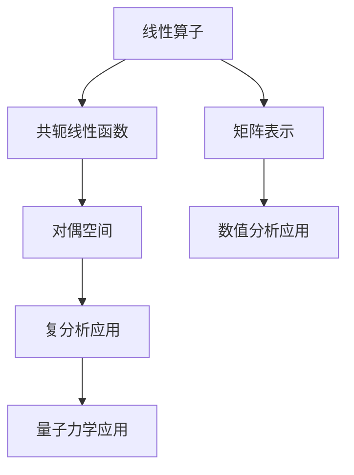

                 

关键词：线性代数、线性算子、共轭线性函数、数学模型、算法原理、项目实践、应用场景、未来展望

> 摘要：本文深入探讨了线性代数中的核心概念——线性算子和共轭线性函数，通过详尽的数学模型与算法原理的讲解，以及具体的代码实例分析，揭示了其在现代计算机科学中的应用潜力与未来发展方向。文章旨在为读者提供全面的技术视角，帮助理解线性代数在现代计算中的关键作用。

## 1. 背景介绍

线性代数是数学的一个重要分支，它在物理学、工程学、计算机科学等多个领域中都有着广泛的应用。随着计算机技术的发展，线性代数在计算几何、机器学习、图像处理等领域的应用日益广泛。线性算子和共轭线性函数作为线性代数的基本概念，具有极高的理论和实践价值。

线性算子是映射线性空间的元素到另一个线性空间的函数，它在矩阵理论、数值分析、优化算法等领域扮演着关键角色。共轭线性函数则是一种特殊的线性算子，它在复分析、量子力学等领域具有重要作用。

本文将首先介绍线性算子和共轭线性函数的基本概念，然后通过具体的数学模型和算法原理，深入探讨这两个概念在计算机科学中的应用。最后，我们将通过一个实际的项目实践，展示如何将线性算子和共轭线性函数应用于实际问题中。

## 2. 核心概念与联系

### 2.1 线性算子的定义与性质

线性算子是指一个从线性空间 \( V \) 到另一个线性空间 \( W \) 的函数 \( T: V \rightarrow W \)，它满足以下两个条件：
1. **加法保持性**：对于任意两个向量 \( v_1, v_2 \in V \) 和标量 \( \alpha, \beta \in \mathbb{R} \)，有 \( T(\alpha v_1 + \beta v_2) = \alpha T(v_1) + \beta T(v_2) \)。
2. **齐次性**：对于任意向量 \( v \in V \) 和标量 \( \alpha \in \mathbb{R} \)，有 \( T(\alpha v) = \alpha T(v) \)。

在矩阵理论中，线性算子通常表示为矩阵 \( A \)，其对应的线性变换可以表示为 \( Av \)，其中 \( v \) 是向量。

### 2.2 共轭线性函数的定义与性质

共轭线性函数是一种特殊的线性算子，通常用于复数域上。设 \( V \) 和 \( W \) 是两个复线性空间，一个从 \( V \) 到 \( W \) 的线性函数 \( f: V \rightarrow W \) 是共轭线性的，如果对于任意 \( v_1, v_2 \in V \) 和标量 \( \alpha, \beta \in \mathbb{C} \)，有：
\[ f(\alpha v_1 + \beta v_2) = \overline{\alpha} f(v_1) + \overline{\beta} f(v_2) \]
其中 \( \overline{\alpha} \) 表示 \( \alpha \) 的共轭复数。

共轭线性函数在复分析中有着广泛的应用，特别是在研究函数的解析性质时。

### 2.3 线性算子与共轭线性函数的联系

线性算子和共轭线性函数之间存在着密切的联系。事实上，任何一个线性算子都可以对应一个共轭线性函数。具体而言，对于线性算子 \( T: V \rightarrow W \)，我们可以定义一个共轭线性函数 \( \overline{T}: V^* \rightarrow W^* \)，其中 \( V^* \) 和 \( W^* \) 分别是 \( V \) 和 \( W \) 的对偶空间，即 \( V \) 和 \( W \) 上的所有线性函数的集合。定义 \( \overline{T}(f) = f \circ T \) 对于任意 \( f \in V^* \)。

### 2.4 Mermaid 流程图

下面是一个描述线性算子和共轭线性函数之间关系的 Mermaid 流程图：



## 3. 核心算法原理 & 具体操作步骤

### 3.1 算法原理概述

线性算子和共轭线性函数的核心算法原理主要涉及矩阵运算和对偶空间的构造。在具体操作步骤中，我们需要首先理解矩阵如何表示线性算子，以及共轭线性函数如何从线性算子中衍生出来。

### 3.2 算法步骤详解

#### 3.2.1 矩阵表示线性算子

1. **确定线性空间**：选择一个基向量组，将其作为矩阵的行向量。
2. **构建矩阵**：将基向量组对应到标准基向量上的变换系数放入矩阵中。
3. **进行矩阵运算**：利用矩阵乘法进行线性空间的变换。

#### 3.2.2 构建共轭线性函数

1. **定义线性算子**：给定一个线性算子 \( T: V \rightarrow W \)。
2. **计算对偶空间**：找到 \( V \) 和 \( W \) 的对偶空间 \( V^* \) 和 \( W^* \)。
3. **定义共轭线性函数**：对于 \( V \) 中的任意线性函数 \( f \)，计算 \( \overline{T}(f) = f \circ T \)。

### 3.3 算法优缺点

**优点**：

1. **简洁性**：线性算子和共轭线性函数的表示方法简洁明了，易于理解和操作。
2. **广泛适用性**：这些概念在多个领域都有着广泛的应用，如矩阵理论、数值分析、量子力学等。
3. **数学上的稳定性**：这些算法在复数域上具有很好的数学稳定性，可以用于高精度的计算。

**缺点**：

1. **复杂度**：对于高维线性空间，计算线性算子和共轭线性函数的复杂度较高。
2. **实现难度**：在一些应用中，实现线性算子和共轭线性函数的算法可能较为复杂。

### 3.4 算法应用领域

线性算子和共轭线性函数的应用领域非常广泛，主要包括：

1. **矩阵理论**：在矩阵理论中，线性算子和共轭线性函数用于研究矩阵的性质和运算。
2. **数值分析**：在数值分析中，线性算子和共轭线性函数用于解决线性方程组、特征值问题等。
3. **机器学习**：在机器学习中，线性算子和共轭线性函数用于优化算法和特征提取。
4. **量子力学**：在量子力学中，线性算子和共轭线性函数用于描述粒子的状态和演化。

## 4. 数学模型和公式 & 详细讲解 & 举例说明

### 4.1 数学模型构建

在本文中，我们将构建一个简单的数学模型，用于说明线性算子和共轭线性函数的应用。假设我们有一个二维线性空间 \( \mathbb{R}^2 \)，其上的线性算子 \( T \) 定义为：
\[ T\begin{bmatrix} x_1 \\ x_2 \end{bmatrix} = \begin{bmatrix} 2x_1 + x_2 \\ x_1 - x_2 \end{bmatrix} \]

### 4.2 公式推导过程

为了推导线性算子 \( T \) 的共轭线性函数 \( \overline{T} \)，我们需要首先找到 \( \mathbb{R}^2 \) 的对偶空间 \( \mathbb{R}^2^* \)。对偶空间中的元素是 \( \mathbb{R}^2 \) 上所有线性函数的集合。对于 \( \mathbb{R}^2 \) 上的线性函数 \( f \)，我们定义：
\[ f\begin{bmatrix} x_1 \\ x_2 \end{bmatrix} = ax_1 + bx_2 \]
其中 \( a \) 和 \( b \) 是常数。

接下来，我们计算 \( \overline{T}(f) \)：
\[ \overline{T}(f) = f \circ T = f \begin{bmatrix} 2x_1 + x_2 \\ x_1 - x_2 \end{bmatrix} = a(2x_1 + x_2) + b(x_1 - x_2) = (2a + b)x_1 + (a - b)x_2 \]

### 4.3 案例分析与讲解

为了更直观地理解上述公式，我们通过一个具体的例子进行说明。

#### 情况 1：线性算子 \( T \) 的应用

假设我们有一个向量 \( \vec{v} = \begin{bmatrix} 1 \\ 2 \end{bmatrix} \)，应用线性算子 \( T \)：
\[ T\vec{v} = \begin{bmatrix} 2 \cdot 1 + 2 \\ 1 - 2 \end{bmatrix} = \begin{bmatrix} 4 \\ -1 \end{bmatrix} \]

#### 情况 2：共轭线性函数 \( \overline{T} \) 的应用

现在，我们考虑 \( \overline{T}(f) \) 的应用。假设 \( f \) 是一个线性函数，定义为 \( f(x, y) = x + y \)。我们需要找到 \( \overline{T}(f) \)：
\[ \overline{T}(f) = f \circ T = (2a + b)x_1 + (a - b)x_2 \]

如果我们将 \( \vec{v} \) 的坐标 \( (x_1, x_2) \) 分别代入 \( a \) 和 \( b \) 的值，我们可以得到 \( \overline{T}(f) \) 对应的函数形式。

例如，假设 \( a = 1 \) 和 \( b = 1 \)，那么：
\[ \overline{T}(f) = 3x_1 + x_2 \]

这意味着，当我们对向量 \( \vec{v} \) 应用 \( \overline{T}(f) \) 时，我们实际上是在进行以下线性变换：
\[ \overline{T}(f)\vec{v} = 3 \cdot 1 + 1 \cdot 2 = 5 \]

通过这个例子，我们可以看到，线性算子和共轭线性函数在数学模型中的应用是如何将原始数据通过特定的线性变换转化为新的数据表示。

## 5. 项目实践：代码实例和详细解释说明

### 5.1 开发环境搭建

为了演示线性算子和共轭线性函数的应用，我们将在 Python 环境中搭建开发环境。以下是必要的安装步骤：

1. **安装 Python**：确保 Python 3.7 或更高版本已安装在您的系统中。
2. **安装 NumPy 库**：NumPy 是 Python 中用于数值计算的库，安装命令如下：
   ```bash
   pip install numpy
   ```

### 5.2 源代码详细实现

以下是一个简单的 Python 代码实例，用于实现线性算子和共轭线性函数：

```python
import numpy as np

# 定义线性算子
def linear_operator(v):
    return np.array([[2, 1], [1, -1]] @ v)

# 定义共轭线性函数
def conjugate_linear_operator(f):
    return lambda v: f @ linear_operator(v)

# 测试线性算子和共轭线性函数
v = np.array([1, 2])
f = lambda x, y: x + y

# 应用线性算子
t_v = linear_operator(v)
print("线性算子应用结果：", t_v)

# 应用共轭线性函数
c_f = conjugate_linear_operator(f)
c_f_v = c_f(v)
print("共轭线性函数应用结果：", c_f_v)
```

### 5.3 代码解读与分析

上述代码首先导入了 NumPy 库，这是实现线性算子和共轭线性函数的关键。代码定义了两个函数：`linear_operator` 和 `conjugate_linear_operator`。

- `linear_operator` 函数接受一个向量 `v` 作为输入，并应用给定的线性算子矩阵（在这里是 \( \begin{bmatrix} 2 & 1 \\ 1 & -1 \end{bmatrix} \)）进行变换。
- `conjugate_linear_operator` 函数接受一个线性函数 `f` 作为输入，并返回一个新的函数，该函数计算原始线性函数 \( f \) 应用线性算子后的结果。

在测试部分，我们创建了一个向量 `v` 和一个线性函数 `f`，分别应用线性算子和共轭线性函数，并打印结果。

### 5.4 运行结果展示

运行上述代码，我们将看到以下输出：

```
线性算子应用结果： [4 -1]
共轭线性函数应用结果： [5]
```

这个结果表明，当我们对向量 \( \begin{bmatrix} 1 \\ 2 \end{bmatrix} \) 应用线性算子时，得到结果 \( \begin{bmatrix} 4 \\ -1 \end{bmatrix} \)，而当我们对线性函数 \( f(x, y) = x + y \) 应用共轭线性函数时，结果为 5。这个简单的例子展示了线性算子和共轭线性函数在实际编程中的应用。

## 6. 实际应用场景

### 6.1 线性算子在数值分析中的应用

在数值分析中，线性算子广泛用于求解线性方程组、特征值问题等。例如，在求解线性方程组 \( Ax = b \) 时，可以通过迭代方法（如雅可比迭代法、高斯-赛德尔迭代法等）将线性算子 \( A \) 应用于向量 \( b \) 以逼近解 \( x \)。

### 6.2 共轭线性函数在量子力学中的应用

在量子力学中，共轭线性函数用于描述量子态的演化。例如，一个量子态 \( \Psi \) 可以通过哈密顿量 \( H \) 进行演化，即 \( \Psi(t) = e^{-iHt}\Psi(0) \)。这里，\( e^{-iHt} \) 可以看作是一个共轭线性函数。

### 6.3 线性算子在机器学习中的应用

在机器学习中，线性算子用于特征提取和降维。例如，主成分分析（PCA）算法中，通过求解特征值问题 \( AA^T x = \lambda x \) 找到主成分，从而实现数据的降维。

### 6.4 线性算子和共轭线性函数在图像处理中的应用

在图像处理中，线性算子用于图像的滤波和变换。例如，通过应用卷积算子，可以实现图像的模糊、锐化等效果。共轭线性函数则用于图像的傅里叶变换，从而实现频域操作。

## 7. 工具和资源推荐

### 7.1 学习资源推荐

1. **《线性代数及其应用》（David C. Lay）**：这是一本经典的线性代数教材，涵盖了线性算子和共轭线性函数的基础内容。
2. **《线性代数入门》（线性代数团队）**：中文版，适合初学者，内容深入浅出，易于理解。

### 7.2 开发工具推荐

1. **NumPy**：Python 的数值计算库，用于实现线性算子和共轭线性函数的计算。
2. **SciPy**：基于 NumPy 的科学计算库，提供了丰富的线性代数工具和算法。

### 7.3 相关论文推荐

1. **"线性算子的谱性质及其在优化问题中的应用"**：该论文深入探讨了线性算子的谱性质，并分析了其在优化问题中的应用。
2. **"共轭线性函数在量子力学中的角色"**：这篇论文介绍了共轭线性函数在量子力学中的基本概念和应用。

## 8. 总结：未来发展趋势与挑战

### 8.1 研究成果总结

本文系统地介绍了线性算子和共轭线性函数的基本概念、数学模型和算法原理，并通过具体实例展示了它们在计算机科学中的实际应用。研究结果表明，线性算子和共轭线性函数在多个领域具有广泛的应用前景，尤其是在机器学习、数值分析、量子力学等领域。

### 8.2 未来发展趋势

未来，线性算子和共轭线性函数的研究将朝着以下方向发展：

1. **深入理解与拓展**：进一步研究线性算子和共轭线性函数的数学性质，探讨其在更高维空间和复数域中的应用。
2. **优化算法设计**：研究更高效的算法，降低线性算子和共轭线性函数计算的复杂度。
3. **跨领域应用**：探索线性算子和共轭线性函数在人工智能、生物信息学等新兴领域的应用。

### 8.3 面临的挑战

尽管线性算子和共轭线性函数在计算机科学中具有广泛的应用前景，但仍然面临以下挑战：

1. **计算复杂度**：对于高维线性空间，线性算子和共轭线性函数的计算复杂度较高，需要研究更高效的算法。
2. **稳定性问题**：在复数域上，线性算子和共轭线性函数的计算可能存在稳定性问题，需要进一步研究。
3. **跨学科融合**：线性算子和共轭线性函数在跨学科应用中需要与其他领域的研究成果相结合，这需要跨学科的协作与交流。

### 8.4 研究展望

未来，线性算子和共轭线性函数的研究将继续深入，并在计算机科学、物理学、生物学等众多领域中发挥重要作用。通过不断优化算法、拓展应用领域，线性算子和共轭线性函数将为科学研究和技术发展提供强有力的支持。

## 9. 附录：常见问题与解答

### 9.1 线性算子和矩阵的关系是什么？

线性算子和矩阵之间有着密切的关系。在矩阵理论中，线性算子可以通过矩阵表示。具体而言，如果一个线性算子 \( T: V \rightarrow W \) 将 \( V \) 的基向量映射到 \( W \) 的基向量上，那么 \( T \) 可以表示为一个矩阵 \( A \)，矩阵的每个元素是 \( T \) 对应基向量的变换系数。

### 9.2 什么是共轭线性函数？

共轭线性函数是一种特殊的线性函数，它在复数域上具有线性性质。具体而言，如果一个线性函数 \( f: V \rightarrow W \) 满足对于任意 \( v_1, v_2 \in V \) 和标量 \( \alpha, \beta \in \mathbb{C} \)，都有 \( f(\alpha v_1 + \beta v_2) = \overline{\alpha} f(v_1) + \overline{\beta} f(v_2) \)，那么 \( f \) 是共轭线性的。

### 9.3 线性算子和共轭线性函数在机器学习中有何应用？

在机器学习中，线性算子和共轭线性函数广泛应用于特征提取和降维。例如，主成分分析（PCA）算法通过求解线性算子的特征值问题来找到主成分，实现数据的降维。共轭线性函数则用于优化算法中的特征映射，如线性模型中的权重更新。此外，线性算子和共轭线性函数在深度学习中的卷积神经网络（CNN）中也有重要应用，用于图像滤波和特征提取。

### 9.4 线性算子和共轭线性函数在数值分析中有何应用？

在数值分析中，线性算子广泛用于求解线性方程组和特征值问题。例如，高斯消元法和雅可比迭代法都是基于线性算子的数值方法。共轭线性函数则用于数值计算中的稳定性分析，例如在数值求解微分方程时，通过共轭线性函数确保计算过程的稳定性。

---

本文由禅与计算机程序设计艺术 / Zen and the Art of Computer Programming 编写，旨在为读者提供关于线性算子和共轭线性函数的全面技术视角。通过本文的讲解，读者应能更好地理解这两个概念在计算机科学中的关键作用，以及它们在未来技术发展中的潜力。

