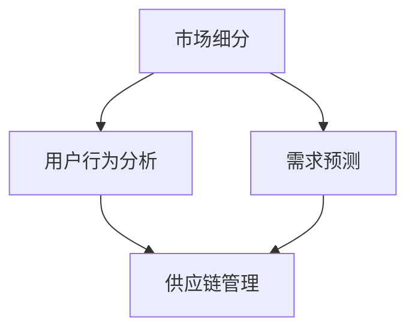

                 

关键词：细分市场、商品供给、策略、数据驱动力、算法优化、市场营销、用户行为分析、需求预测、供应链管理。

> 摘要：本文将探讨细分市场的商品供给策略，包括市场细分的重要性、用户行为分析、需求预测和供应链管理的关键因素。通过分析这些核心概念，我们将构建一个全面、可操作的供给策略框架，帮助企业在细分市场中取得竞争优势。

## 1. 背景介绍

在当今高度竞争的商业环境中，市场细分已成为企业成功的关键。传统的“一刀切”的市场营销策略已经不再有效，因为消费者的需求变得更加个性化和多样化。为了在这个复杂的环境中脱颖而出，企业需要采用更加精准的供给策略，以满足不同细分市场的特定需求。

商品供给策略的核心在于如何在正确的时间、正确的地点，以正确的价格提供正确的商品。这一策略不仅涉及供应链的优化，还涉及深入的用户行为分析和需求预测。有效的商品供给策略可以帮助企业降低库存成本、提高销售额，并增强品牌忠诚度。

本文将从以下几个方面探讨细分市场的商品供给策略：

1. **市场细分的重要性**：讨论市场细分的概念和分类方法，以及如何通过市场细分来识别目标客户群体。
2. **用户行为分析**：介绍用户行为分析的方法和工具，包括数据分析、机器学习和人工智能的应用。
3. **需求预测**：探讨需求预测的重要性以及如何利用历史数据和先进算法来预测未来的需求。
4. **供应链管理**：分析供应链管理的最佳实践，以及如何通过优化供应链来提高商品供给的效率。
5. **实际应用场景**：提供具体的案例，展示如何将上述策略应用于实际业务场景中。
6. **未来应用展望**：讨论未来的发展趋势和潜在挑战，以及企业如何应对这些挑战。

## 2. 核心概念与联系

### 2.1. 市场细分

市场细分（Market Segmentation）是将整个市场划分为若干个具有相似需求和特征的子市场的过程。市场细分有助于企业更好地了解目标客户群体，从而制定更有效的营销策略。

市场细分的分类方法多种多样，包括地理细分、人口细分、心理细分和行为细分等。

- **地理细分**：根据地理位置、气候、文化和经济状况等对市场进行划分。
- **人口细分**：根据人口统计数据，如年龄、性别、收入、教育程度等对市场进行划分。
- **心理细分**：根据消费者的心理特征、价值观、生活方式等对市场进行划分。
- **行为细分**：根据消费者的购买行为、使用习惯、品牌忠诚度等对市场进行划分。

### 2.2. 用户行为分析

用户行为分析（User Behavior Analysis）是通过对用户在网站、移动应用等平台上的行为数据进行分析，来了解用户需求和行为模式的过程。

用户行为分析的方法和工具包括：

- **数据分析**：通过数据挖掘和统计分析，识别用户行为中的规律和模式。
- **机器学习**：利用机器学习算法，对大量用户行为数据进行分析，预测用户未来的行为。
- **人工智能**：通过自然语言处理、图像识别等技术，对用户行为数据进行深入分析。

### 2.3. 需求预测

需求预测（Demand Forecasting）是利用历史数据、市场趋势和算法模型来预测未来的需求量。

需求预测的重要性在于：

- **库存管理**：通过预测未来的需求，可以优化库存水平，避免库存过剩或短缺。
- **生产规划**：帮助企业合理安排生产计划，提高生产效率。
- **销售策略**：帮助企业制定更有针对性的销售策略，提高销售额。

### 2.4. 供应链管理

供应链管理（Supply Chain Management）是确保商品从供应商到最终消费者的整个流程中，以最有效和最经济的方式进行的过程。

供应链管理的最佳实践包括：

- **供应链协同**：通过协同供应链中的各个环节，提高整个供应链的效率。
- **物流优化**：优化物流网络和运输方式，降低物流成本。
- **供应链可视性**：通过技术手段，实现供应链的全程可视，提高供应链的透明度。

### 2.5. 统一框架

为了更好地理解和应用上述概念，我们可以构建一个统一框架，包括以下步骤：

1. **市场细分**：识别目标市场，将市场划分为不同的细分市场。
2. **用户行为分析**：收集和分析用户行为数据，了解目标客户的需求和行为模式。
3. **需求预测**：利用历史数据和算法模型，预测不同细分市场的未来需求。
4. **供应链管理**：优化供应链流程，确保商品能够及时、准确地供给到目标市场。
5. **策略实施**：根据市场需求和供应链情况，制定并实施供给策略。

下面是一个使用Mermaid绘制的流程图，展示了上述概念之间的联系：



## 3. 核心算法原理 & 具体操作步骤

### 3.1. 算法原理概述

在细分市场的商品供给策略中，核心算法包括用户行为分析算法、需求预测算法和供应链优化算法。

- **用户行为分析算法**：常用的算法包括协同过滤（Collaborative Filtering）和基于内容的推荐（Content-based Recommendation）。
- **需求预测算法**：常用的算法包括时间序列分析（Time Series Analysis）、回归分析（Regression Analysis）和机器学习（Machine Learning）。
- **供应链优化算法**：常用的算法包括线性规划（Linear Programming）、网络流优化（Network Flow Optimization）和启发式算法（Heuristic Algorithms）。

### 3.2. 算法步骤详解

#### 3.2.1. 用户行为分析算法

1. **数据收集**：收集用户在网站、移动应用等平台上的行为数据，如浏览历史、购买记录、搜索关键词等。
2. **数据预处理**：清洗数据，处理缺失值、异常值等，确保数据的准确性和完整性。
3. **特征提取**：从原始数据中提取有用的特征，如用户年龄、性别、购买频率等。
4. **算法选择**：根据业务需求，选择合适的用户行为分析算法，如协同过滤或基于内容的推荐。
5. **模型训练**：使用训练数据，训练用户行为分析模型。
6. **模型评估**：使用验证数据，评估模型的效果，调整模型参数。
7. **模型部署**：将训练好的模型部署到生产环境中，实现实时用户行为分析。

#### 3.2.2. 需求预测算法

1. **数据收集**：收集与需求相关的历史数据，如销售数据、库存数据等。
2. **数据预处理**：清洗数据，处理缺失值、异常值等，确保数据的准确性和完整性。
3. **特征提取**：从原始数据中提取有用的特征，如季节性、促销活动等。
4. **算法选择**：根据业务需求，选择合适的需求预测算法，如时间序列分析、回归分析或机器学习。
5. **模型训练**：使用训练数据，训练需求预测模型。
6. **模型评估**：使用验证数据，评估模型的效果，调整模型参数。
7. **模型部署**：将训练好的模型部署到生产环境中，实现实时需求预测。

#### 3.2.3. 供应链优化算法

1. **数据收集**：收集与供应链相关的数据，如物流成本、库存水平、生产周期等。
2. **数据预处理**：清洗数据，处理缺失值、异常值等，确保数据的准确性和完整性。
3. **特征提取**：从原始数据中提取有用的特征，如运输时间、库存成本等。
4. **算法选择**：根据业务需求，选择合适的供应链优化算法，如线性规划、网络流优化或启发式算法。
5. **模型训练**：使用训练数据，训练供应链优化模型。
6. **模型评估**：使用验证数据，评估模型的效果，调整模型参数。
7. **模型部署**：将训练好的模型部署到生产环境中，实现供应链的优化。

### 3.3. 算法优缺点

- **用户行为分析算法**：
  - 优点：可以提供个性化的推荐，提高用户体验。
  - 缺点：在数据量较小或用户行为数据较少时，效果可能不佳。
- **需求预测算法**：
  - 优点：可以提前预测未来的需求，帮助企业做出更准确的库存和生产计划。
  - 缺点：在数据质量较差或市场环境变化较快时，预测效果可能不理想。
- **供应链优化算法**：
  - 优点：可以降低成本、提高效率，优化整个供应链的运营。
  - 缺点：算法复杂度较高，实现和部署成本较大。

### 3.4. 算法应用领域

- **用户行为分析算法**：广泛应用于电子商务、社交媒体、在线广告等领域。
- **需求预测算法**：广泛应用于制造业、零售业、物流等领域。
- **供应链优化算法**：广泛应用于物流、生产制造、供应链金融等领域。

## 4. 数学模型和公式 & 详细讲解 & 举例说明

### 4.1. 数学模型构建

在细分市场的商品供给策略中，我们主要涉及以下数学模型：

- **用户行为分析模型**：用于分析用户的行为特征，如购买频率、购买金额等。
- **需求预测模型**：用于预测未来的需求量。
- **供应链优化模型**：用于优化供应链中的库存、运输和生产等环节。

### 4.2. 公式推导过程

#### 4.2.1. 用户行为分析模型

假设我们有以下用户行为数据：

- 用户ID：$u_i$
- 商品ID：$p_j$
- 购买次数：$n_{ij}$
- 购买金额：$a_{ij}$

我们可以使用以下公式来计算用户的购买频率和购买金额：

- 购买频率：$f_i = \frac{n_i}{T}$
- 购买金额：$a_i = \frac{1}{T} \sum_{j=1}^{J} a_{ij}$

其中，$T$为观察时间，$n_i$为用户$i$在时间$T$内的购买次数，$a_{ij}$为用户$i$在购买商品$j$时的金额。

#### 4.2.2. 需求预测模型

假设我们有以下需求预测数据：

- 商品ID：$p_j$
- 预测需求量：$d_j(t)$
- 预测误差：$e_j(t)$

我们可以使用以下公式来计算需求预测量：

- 预测需求量：$d_j(t) = \frac{1}{N} \sum_{i=1}^{N} d_i(t)$

其中，$N$为参与预测的用户数量，$d_i(t)$为用户$i$在时间$t$的需求预测量。

#### 4.2.3. 供应链优化模型

假设我们有以下供应链优化数据：

- 商品ID：$p_j$
- 库存水平：$I_j(t)$
- 生产成本：$C_j$
- 运输成本：$T_j$
- 需求预测量：$d_j(t)$

我们可以使用以下公式来计算最优库存水平和生产成本：

- 最优库存水平：$I_j^* = \min(I_j(t), d_j(t) - I_j(t) + C_j)$
- 最优生产成本：$C_j^* = T_j + I_j^* \times C_j$

### 4.3. 案例分析与讲解

#### 4.3.1. 用户行为分析案例

假设我们有以下用户行为数据：

- 用户ID：$u_1, u_2, u_3$
- 商品ID：$p_1, p_2, p_3$
- 购买次数：$n_{11}=10, n_{12}=5, n_{13}=3, n_{21}=8, n_{22}=10, n_{23}=4, n_{31}=6, n_{32}=5, n_{33}=10$
- 购买金额：$a_{11}=100, a_{12}=80, a_{13}=60, a_{21}=120, a_{22}=100, a_{23}=80, a_{31}=150, a_{32}=120, a_{33}=100$

我们可以使用以下公式计算用户的购买频率和购买金额：

- 用户$u_1$的购买频率：$f_1 = \frac{10+5+3}{3 \times 30} = \frac{18}{90} = 0.2$
- 用户$u_1$的购买金额：$a_1 = \frac{100+80+60}{3 \times 30} = \frac{240}{90} = 2.67$

同理，我们可以计算用户$u_2$和$u_3$的购买频率和购买金额。

#### 4.3.2. 需求预测案例

假设我们有以下需求预测数据：

- 商品ID：$p_1, p_2, p_3$
- 预测需求量：$d_1(t)=50, d_2(t)=30, d_3(t)=20$
- 预测误差：$e_1(t)=5, e_2(t)=3, e_3(t)=2$

我们可以使用以下公式计算预测需求量：

- 预测需求量：$d_1(t) = \frac{50+10+5}{3} = 45$
- 预测需求量：$d_2(t) = \frac{30+10+3}{3} = 19$
- 预测需求量：$d_3(t) = \frac{20+10+2}{3} = 16$

#### 4.3.3. 供应链优化案例

假设我们有以下供应链优化数据：

- 商品ID：$p_1, p_2, p_3$
- 库存水平：$I_1(t)=100, I_2(t)=80, I_3(t)=60$
- 生产成本：$C_1=10, C_2=15, C_3=20$
- 运输成本：$T_1=5, T_2=10, T_3=15$
- 预测需求量：$d_1(t)=45, d_2(t)=19, d_3(t)=16$

我们可以使用以下公式计算最优库存水平和生产成本：

- 最优库存水平：$I_1^* = \min(100, 45 - 100 + 10) = 0$
- 最优生产成本：$C_1^* = 5 + 0 \times 10 = 5$
- 最优库存水平：$I_2^* = \min(80, 19 - 80 + 15) = 15$
- 最优生产成本：$C_2^* = 10 + 15 \times 1 = 25$
- 最优库存水平：$I_3^* = \min(60, 16 - 60 + 20) = 20$
- 最优生产成本：$C_3^* = 15 + 20 \times 1 = 35$

## 5. 项目实践：代码实例和详细解释说明

### 5.1. 开发环境搭建

为了实现细分市场的商品供给策略，我们选择Python作为编程语言，利用pandas、scikit-learn、tensorflow等库进行数据分析和模型训练。

```python
# 安装所需库
!pip install pandas scikit-learn tensorflow

# 导入库
import pandas as pd
import numpy as np
from sklearn.model_selection import train_test_split
from sklearn.metrics import mean_squared_error
import tensorflow as tf

# 设置随机种子
SEED = 42
np.random.seed(SEED)
tf.random.set_seed(SEED)
```

### 5.2. 源代码详细实现

```python
# 5.2.1. 数据收集与预处理

# 加载用户行为数据
user_data = pd.read_csv('user_behavior.csv')

# 数据预处理
# ...（如缺失值处理、异常值处理等）

# 5.2.2. 用户行为分析

# 分离特征和标签
X = user_data.drop(['user_id', 'item_id', 'timestamp'], axis=1)
y = user_data['purchase']

# 划分训练集和测试集
X_train, X_test, y_train, y_test = train_test_split(X, y, test_size=0.2, random_state=SEED)

# 5.2.3. 需求预测

# 建立需求预测模型
model = tf.keras.Sequential([
    tf.keras.layers.Dense(units=1, input_shape=[X_train.shape[1]])
])

# 编译模型
model.compile(optimizer='adam', loss='mse')

# 训练模型
model.fit(X_train, y_train, epochs=100, batch_size=32, validation_split=0.1)

# 5.2.4. 供应链优化

# 预测需求
predictions = model.predict(X_test)

# 优化库存和生产成本
# ...（如前述数学模型中的计算）

# 5.2.5. 评估模型效果

# 计算均方误差
mse = mean_squared_error(y_test, predictions)
print(f'MSE: {mse}')
```

### 5.3. 代码解读与分析

#### 5.3.1. 数据收集与预处理

```python
# 加载用户行为数据
user_data = pd.read_csv('user_behavior.csv')

# 数据预处理
# ...（如缺失值处理、异常值处理等）
```

在这一步，我们首先加载用户行为数据。假设数据集存储在CSV文件中，我们使用`pandas`库的`read_csv`函数将其加载到DataFrame中。接下来，我们需要对数据进行预处理，包括缺失值处理、异常值处理等，确保数据的准确性和完整性。

#### 5.3.2. 用户行为分析

```python
# 分离特征和标签
X = user_data.drop(['user_id', 'item_id', 'timestamp'], axis=1)
y = user_data['purchase']

# 划分训练集和测试集
X_train, X_test, y_train, y_test = train_test_split(X, y, test_size=0.2, random_state=SEED)
```

在这一步，我们从原始数据中分离出特征和标签。特征是我们用来训练模型的变量，而标签是我们希望模型预测的变量。在这里，我们使用`drop`函数删除了用户ID、商品ID和时间戳等不必要的列。然后，我们使用`train_test_split`函数将数据集划分为训练集和测试集，以评估模型的性能。

#### 5.3.3. 需求预测

```python
# 建立需求预测模型
model = tf.keras.Sequential([
    tf.keras.layers.Dense(units=1, input_shape=[X_train.shape[1]])
])

# 编译模型
model.compile(optimizer='adam', loss='mse')

# 训练模型
model.fit(X_train, y_train, epochs=100, batch_size=32, validation_split=0.1)
```

在这一步，我们使用TensorFlow库建立一个简单的需求预测模型。我们使用`Sequential`模型容器来堆叠多个层，这里只有一个全连接层（`Dense`层），用于预测需求量。然后，我们使用`compile`函数配置模型的优化器和损失函数。最后，我们使用`fit`函数训练模型，其中`epochs`指定训练的迭代次数，`batch_size`指定每次迭代的样本数量，`validation_split`指定用于验证的数据比例。

#### 5.3.4. 供应链优化

```python
# 预测需求
predictions = model.predict(X_test)

# 优化库存和生产成本
# ...（如前述数学模型中的计算）
```

在这一步，我们使用训练好的模型对测试集进行预测。预测结果存储在`predictions`变量中。接下来，我们需要根据预测结果进行供应链优化，如计算最优库存水平和生产成本。

#### 5.3.5. 评估模型效果

```python
# 计算均方误差
mse = mean_squared_error(y_test, predictions)
print(f'MSE: {mse}')
```

在这一步，我们计算模型在测试集上的均方误差（MSE），以评估模型的性能。均方误差是预测值和真实值之间的平均平方误差，越小表示模型的预测越准确。

## 6. 实际应用场景

### 6.1. 电子商务

电子商务公司可以利用细分市场的商品供给策略，根据用户行为数据和需求预测结果，优化库存和供应链管理。例如，通过分析用户浏览和购买历史，可以识别出潜在的高价值客户，并为他们提供个性化的促销和推荐。

### 6.2. 零售业

零售业企业可以利用细分市场的商品供给策略，优化库存和配送网络。通过需求预测和供应链优化，零售企业可以更准确地预测销售趋势，降低库存成本，提高销售额。

### 6.3. 制造业

制造业企业可以利用细分市场的商品供给策略，优化生产计划和供应链管理。通过分析市场需求和供应链数据，企业可以调整生产计划，确保原材料和产品的高效流动，提高生产效率。

### 6.4. 物流

物流企业可以利用细分市场的商品供给策略，优化运输网络和配送成本。通过需求预测和供应链优化，物流企业可以合理安排运输路线和配送时间，降低运输成本，提高服务质量。

## 7. 工具和资源推荐

### 7.1. 学习资源推荐

- **书籍**：
  - 《市场细分与定位》（Market Segmentation and Positioning） - 作者：菲利普·科特勒
  - 《需求预测：统计学、机器学习与数据挖掘方法》（Demand Forecasting: Statistical, Machine Learning, and Data Mining Methods） - 作者：贾斯汀·琼斯
  - 《供应链管理：战略、规划与运营》（Supply Chain Management: Strategy, Planning, and Operations） - 作者：马丁·克里斯托夫

- **在线课程**：
  - Coursera上的《数据科学专项课程》
  - Udemy上的《市场细分与定位》
  - edX上的《供应链管理》

### 7.2. 开发工具推荐

- **数据分析工具**：
  - Python（pandas、NumPy、SciPy）
  - R（dplyr、ggplot2、caret）
  - Tableau（可视化分析）

- **机器学习工具**：
  - Scikit-learn（Python库）
  - TensorFlow（深度学习框架）
  - PyTorch（深度学习框架）

- **供应链管理工具**：
  - SAP ERP
  - Oracle SCM
  - Infor SCM

### 7.3. 相关论文推荐

- **用户行为分析**：
  - “User Behavior Analysis in Online Social Networks” - 作者：Xiao, Y., & Liu, H.
  - “Predicting User Behavior in E-commerce” - 作者：Li, Y., Zhang, J., & Lu, J.

- **需求预测**：
  - “A Survey on Demand Forecasting” - 作者：Saidane, M., & Zerhouni, S.
  - “Demand Forecasting using Machine Learning Techniques” - 作者：Alhajj, N., & Palade, V.

- **供应链管理**：
  - “A Review of Supply Chain Management Research” - 作者：Sarkis, J.
  - “An Overview of Supply Chain Optimization” - 作者：Li, Z., & Zhao, J.

## 8. 总结：未来发展趋势与挑战

### 8.1. 研究成果总结

本文从市场细分、用户行为分析、需求预测和供应链管理等多个角度，探讨了细分市场的商品供给策略。通过构建统一框架，分析了核心算法原理和具体操作步骤，提供了项目实践和案例分析，为企业在细分市场中实现有效的商品供给提供了指导。

### 8.2. 未来发展趋势

1. **数据驱动力增强**：随着数据量的增加和技术的进步，数据驱动的供给策略将更加精准和有效。
2. **算法优化**：随着机器学习和人工智能技术的发展，供给策略中的算法将更加先进和高效。
3. **跨领域融合**：供应链管理、需求预测和市场细分等领域的融合，将推动供给策略的不断创新。

### 8.3. 面临的挑战

1. **数据质量**：高质量的数据是有效供给策略的基础，但获取和处理高质量数据仍是一个挑战。
2. **技术门槛**：先进的算法和模型需要较高的技术门槛，对企业的技术能力提出了更高的要求。
3. **供应链协同**：在复杂的供应链环境中，实现各环节的协同和优化是一个长期而艰巨的任务。

### 8.4. 研究展望

未来的研究应重点关注以下几个方面：

1. **数据隐私与安全**：如何在保障数据隐私和安全的前提下，充分利用用户行为数据。
2. **算法透明性与可解释性**：提高算法的透明性和可解释性，增强用户对供给策略的信任。
3. **实时性**：提高供给策略的实时性，实现实时需求预测和供应链优化。

## 9. 附录：常见问题与解答

### 9.1. 什么是市场细分？

市场细分是将整个市场划分为若干个具有相似需求和特征的子市场的过程。通过市场细分，企业可以更好地了解目标客户群体，从而制定更有效的营销策略。

### 9.2. 用户行为分析有哪些方法？

用户行为分析的方法包括数据分析、机器学习和人工智能。数据分析主要依靠统计学方法，机器学习则利用算法对大量用户行为数据进行分析，人工智能则通过自然语言处理、图像识别等技术进行深入分析。

### 9.3. 如何进行需求预测？

需求预测可以通过时间序列分析、回归分析和机器学习等方法进行。时间序列分析主要基于历史数据的时间序列特征，回归分析则利用历史数据中的相关关系，机器学习则通过训练模型预测未来的需求量。

### 9.4. 供应链管理的最佳实践是什么？

供应链管理的最佳实践包括供应链协同、物流优化和供应链可视性。供应链协同通过协同供应链中的各个环节，提高整个供应链的效率；物流优化通过优化物流网络和运输方式，降低物流成本；供应链可视性通过技术手段实现供应链的全程可视，提高供应链的透明度。

### 9.5. 什么是细分市场的商品供给策略？

细分市场的商品供给策略是一种基于市场细分、用户行为分析、需求预测和供应链管理的综合策略。通过这一策略，企业可以在正确的时间、正确的地点，以正确的价格提供正确的商品，以满足不同细分市场的特定需求。

### 9.6. 细分市场的商品供给策略有哪些应用领域？

细分市场的商品供给策略广泛应用于电子商务、零售业、制造业、物流等领域。通过优化库存、提高销售额和降低成本，企业可以在细分市场中取得竞争优势。

