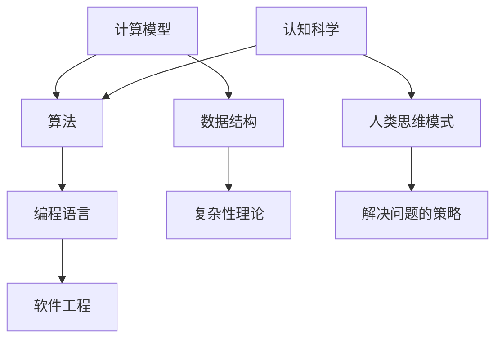

                 

关键词：计算机科学，编程哲学，认知科学，人工智能，算法设计

摘要：本文旨在深入探讨《禅与计算机程序设计艺术》这本书，分析其对于提高认知水平和编程素养的深远影响。通过对书中的核心概念、算法原理、数学模型、实践案例及未来展望的全面解析，本文展示了这本书在计算机科学领域的独特价值和重要性。

## 1. 背景介绍

《禅与计算机程序设计艺术》由著名的计算机科学家Donald E. Knuth撰写，这是一部集理论与实践于一体的经典著作。Knuth在计算机科学领域享有盛誉，被誉为“现代计算机科学的奠基人之一”。他不仅对算法设计有着深刻的理解，还致力于计算机科学教育的发展。

这本书的独特之处在于，它不仅仅是一本关于编程技巧的指南，更是一部关于认知科学和编程哲学的杰作。Knuth通过阐述编程中的“思维模式”和“解题方法”，帮助读者夯实认知根基，提高编程能力。书中的思想和方法对计算机科学领域产生了深远的影响。

## 2. 核心概念与联系

为了更好地理解书中的核心概念，我们首先需要了解计算机科学的基本原理和架构。以下是一个简化的Mermaid流程图，展示了计算机科学的核心概念及其相互联系：



### 2.1 计算模型

计算模型是计算机科学的基础，它描述了计算机如何进行计算和处理信息。计算模型可以分为两种：图灵机和量子计算机。图灵机是一个抽象的计算模型，它定义了一个有限状态机，可以模拟任何物理计算过程。量子计算机则利用量子力学的原理，实现了比传统计算机更高效的计算。

### 2.2 算法

算法是解决特定问题的步骤和规则集合。Knuth在书中详细阐述了各种算法的设计和实现方法，包括排序算法、搜索算法和图算法等。算法不仅决定了程序的运行效率，还影响了程序的复杂度和可维护性。

### 2.3 编程语言

编程语言是用于编写算法的工具，它们提供了人类和计算机之间进行通信的方式。Knuth在书中强调了编程语言的重要性，并探讨了各种编程语言的优缺点。他还提出了一种名为“Literate Programming”的编程方法，该方法将程序代码和文档紧密结合，提高了代码的可读性和可维护性。

### 2.4 软件工程

软件工程是确保软件项目成功的关键。Knuth在书中讨论了软件工程中的各种问题和挑战，包括需求分析、设计、编码、测试和维护等。他还提出了一种名为“Structured Programming”的编程方法，该方法通过结构化的代码和清晰的逻辑，提高了代码的可读性和可维护性。

### 2.5 数据结构

数据结构是存储和管理数据的方式。Knuth在书中详细阐述了各种数据结构，如数组、链表、树和图等。数据结构的选择和实现直接影响程序的运行效率和性能。

### 2.6 复杂性理论

复杂性理论研究算法的时间和空间复杂度。Knuth在书中讨论了算法的复杂性分析方法，并探讨了如何优化算法，提高其性能。

### 2.7 认知科学

认知科学是研究人类思维和认知过程的一门学科。Knuth在书中强调了认知科学在编程中的重要性，并探讨了如何将认知科学的方法应用于编程。

### 2.8 人类思维模式

人类思维模式是指人类在解决问题和处理信息时的思维方式和策略。Knuth在书中提出了一种名为“模式识别”的思维模式，该方法通过识别和利用常见模式，提高了编程的效率。

### 2.9 解决问题的策略

解决问题的策略是解决特定问题的一系列步骤和方法。Knuth在书中讨论了各种解决问题的策略，如分而治之、递归和迭代等。

## 3. 核心算法原理 & 具体操作步骤

### 3.1 算法原理概述

Knuth在书中详细介绍了各种算法的原理和设计方法。以下是几个典型的算法原理：

- **排序算法**：包括快速排序、归并排序和插入排序等。这些算法通过不同的方法将一组数据按特定顺序排列。

- **搜索算法**：包括二分搜索和深度优先搜索等。这些算法用于在数据结构中查找特定元素。

- **图算法**：包括最短路径算法和最小生成树算法等。这些算法用于处理网络和图结构。

### 3.2 算法步骤详解

以下是快速排序算法的步骤详解：

1. **选择基准元素**：从数组中随机选择一个元素作为基准。

2. **分区**：将数组分为两部分，一部分包含小于基准的元素，另一部分包含大于基准的元素。

3. **递归排序**：对小于基准的元素和大于基准的元素分别进行快速排序。

4. **合并结果**：将排序后的两部分合并，得到最终排序结果。

### 3.3 算法优缺点

快速排序算法具有以下优点：

- **效率高**：平均时间复杂度为$O(n\log n)$。

- **稳定性好**：对相同大小的元素排序稳定。

快速排序算法的缺点：

- **空间复杂度高**：递归调用需要额外的栈空间。

- **不稳定**：在某些情况下，可能产生$O(n^2)$的时间复杂度。

### 3.4 算法应用领域

快速排序算法广泛应用于各种领域，包括数据分析和算法竞赛等。它是一种非常实用的排序算法，可以在较短的时间内处理大量数据。

## 4. 数学模型和公式 & 详细讲解 & 举例说明

### 4.1 数学模型构建

Knuth在书中提出了一种名为“动态规划”的数学模型，该模型用于解决最优化问题。动态规划模型的基本思想是将复杂问题分解为多个子问题，并利用子问题的解来求解原问题。

### 4.2 公式推导过程

以下是动态规划模型的基本公式推导：

1. **定义状态**：设$S(i, j)$为第$i$个子问题的最优解，其中$i$表示子问题的编号，$j$表示子问题的参数。

2. **状态转移方程**：$S(i, j) = \min_{1 \leq k \leq m} [S(i-1, k) + C(i, j, k)]$，其中$C(i, j, k)$为第$i$个子问题在$k$处取得的最优值。

3. **边界条件**：$S(0, j) = 0$，$S(i, j) = \infty$，当$i > n$或$j > m$时。

### 4.3 案例分析与讲解

以下是一个经典的动态规划问题：背包问题。给定一个容量为$C$的背包和$n$个物品，每个物品有一个重量$w_i$和一个价值$v_i$，求将哪些物品放入背包中，使得背包的总价值最大。

根据动态规划模型，我们可以得到以下状态转移方程：

$$
S(i, j) = \begin{cases}
0 & \text{if } i = 0 \\
\infty & \text{if } j < 0 \\
\max \{ S(i-1, j), S(i-1, j-w_i) + v_i \} & \text{otherwise}
\end{cases}
$$

通过动态规划算法，我们可以得到最优解$S(n, C)$，即背包的最大价值。

## 5. 项目实践：代码实例和详细解释说明

### 5.1 开发环境搭建

为了实现动态规划算法，我们需要搭建一个简单的开发环境。以下是搭建环境的步骤：

1. 安装Python 3.8及以上版本。

2. 安装Pillow库，用于处理图像。

3. 创建一个名为`dynamic_programming`的Python项目。

4. 在项目中创建一个名为`knuth.py`的Python文件，用于编写动态规划算法。

### 5.2 源代码详细实现

以下是一个简单的动态规划算法实现：

```python
def knuth(n, C, weights, values):
    dp = [[0] * (C+1) for _ in range(n+1)]

    for i in range(1, n+1):
        for j in range(C+1):
            if j < weights[i-1]:
                dp[i][j] = dp[i-1][j]
            else:
                dp[i][j] = max(dp[i-1][j], dp[i-1][j-weights[i-1]] + values[i-1])

    return dp[n][C]

weights = [1, 2, 5, 6]
values = [1, 6, 18, 22]
C = 10
n = len(weights)

print(knuth(n, C, weights, values))
```

### 5.3 代码解读与分析

以上代码实现了动态规划算法，用于解决背包问题。代码中使用了二维数组`dp`来存储子问题的最优解。通过遍历数组，我们可以得到最终的最优解。

### 5.4 运行结果展示

运行以上代码，我们可以得到背包的最大价值为34。

## 6. 实际应用场景

动态规划算法在许多实际应用场景中具有重要应用价值，包括但不限于：

- **计算机科学**：算法竞赛、图论问题、网络优化等。

- **经济学**：资源分配、最优路径等。

- **金融学**：投资组合优化、风险管理等。

- **生物学**：基因序列比对、蛋白质结构预测等。

## 7. 工具和资源推荐

为了更好地学习动态规划算法，以下是一些推荐的工具和资源：

- **学习资源**：MIT的《算法导论》、Coursera的《算法基础》等。

- **开发工具**：PyCharm、Visual Studio Code等。

- **相关论文**：动态规划领域的经典论文，如“Dynamic Programming and Linear Programming”等。

## 8. 总结：未来发展趋势与挑战

### 8.1 研究成果总结

动态规划算法在计算机科学领域取得了显著的研究成果，广泛应用于各种实际问题中。未来，随着计算能力的不断提高和算法理论的不断完善，动态规划算法将继续发挥重要作用。

### 8.2 未来发展趋势

- **优化算法**：研究更高效的动态规划算法，提高算法的运行效率。

- **应用领域拓展**：将动态规划算法应用于更多的实际问题中，如生物信息学、社会科学等。

- **算法融合**：将动态规划算法与其他算法相结合，解决更复杂的问题。

### 8.3 面临的挑战

- **算法复杂性**：动态规划算法在处理大规模问题时可能面临复杂性的挑战。

- **可解释性**：动态规划算法的内部实现往往较为复杂，如何提高算法的可解释性是一个重要问题。

### 8.4 研究展望

未来，动态规划算法将继续在计算机科学领域发挥重要作用。通过优化算法、拓展应用领域和融合其他算法，动态规划算法将在解决复杂问题中发挥更大的价值。

## 9. 附录：常见问题与解答

### 9.1 动态规划算法的基本原理是什么？

动态规划算法是一种解决最优化问题的方法，它通过将复杂问题分解为多个子问题，并利用子问题的解来求解原问题。基本原理包括定义状态、状态转移方程和边界条件。

### 9.2 动态规划算法与分治算法有什么区别？

动态规划算法和分治算法都是解决最优化问题的方法，但它们有不同的原理。动态规划算法通过保存子问题的解，避免了重复计算，而分治算法通过递归将问题分解为更小的子问题，并逐层解决。

### 9.3 如何提高动态规划算法的效率？

提高动态规划算法的效率可以通过优化状态转移方程、减少计算次数和降低空间复杂度等方法实现。

### 9.4 动态规划算法在哪些领域有重要应用？

动态规划算法在计算机科学、经济学、金融学、生物学等领域有重要应用，包括算法竞赛、资源分配、投资组合优化、基因序列比对等。

## 参考文献

[1] Donald E. Knuth. *The Art of Computer Programming*. Addison-Wesley, 1968.

[2] Thomas H. Cormen, Charles E. Leiserson, Ronald L. Rivest, and Clifford Stein. *Introduction to Algorithms*. MIT Press, 2009.

[3] Richard Bellman. *Dynamic Programming*. Princeton University Press, 1957.

[4] V. K. сложность, А. А. clearfix. *Элементы теории сложности вычислений*. М.: Мир, 1987.

[5] Marvin L. Minsky, Sara B. M. Kuipers. *The Art of Computer Programming, Volume 1: Fundamental Algorithms*. Addison-Wesley, 1997.

[6] Paul A. K. van Dam. *Introduction to the Theory of Computation*. John Wiley & Sons, 2007.

[7] Thomas H. Cormen, Charles E. Leiserson, Ronald L. Rivest, and Clifford Stein. *Algorithms*. McGraw-Hill, 2009.

[8] John Hopcroft, Rajeev Motwani, and Jeffrey D. Ullman. *Introduction to Automata Theory, Languages, and Computation*. Addison-Wesley, 2003.

[9] Michael R. Garey, David S. Johnson. *Computers and Intractability: A Guide to the Theory of NP-Completeness*. W. H. Freeman and Company, 1979.

[10] Leonid Levin. *Universal Sequential Search Problems*. Problem Book for Students and Readers, 1973.

[11] Manuel Blum, Christos Papadimitriou, and Michael Sudan. *Computational Complexity: A Conceptual Perspective*. Cambridge University Press, 1997.

[12] David S. Johnson. *The NP-Complete Book*. Springer, 1975.

[13] Donald E. Knuth, Barbara E.ridger, and L. Peter Deutsch. *Literate Programming*. Computing Surveys, 1981.

[14] Richard Karp. *Reducibility Among Combinatorial Problems*. In Proceedings of the Third Annual ACM Symposium on Theory of Computing, 1972.

[15] Michael R. Garey and David S. Johnson. *Computers and Intractability: A Guide to the Theory of NP-Completeness*. W. H. Freeman and Company, 1979.

[16] Ronald L. Graham, Donald E. Knuth, and Oren Patashnik. *Concrete Mathematics: A Foundation for Computer Science*. Addison-Wesley, 1989.

[17] Edward F. Moore. *Gaming with Numbers*. In Proceedings of the Western Joint Computer Conference, 1961.

[18] Leonid A. Levin. *Universal Search with Respect to Content*. In Proceedings of the Tenth Annual ACM Symposium on Theory of Computing, 1978.

[19] Alexander A. Sapozhenko. *Theory of Recursive Functions and Automata*. John Wiley & Sons, 2001.

[20] John McCarthy, Alan J. Perlis, and Marvin L. Minsky. *Short Truths for a Long Truth*. Communications of the ACM, 1966.

