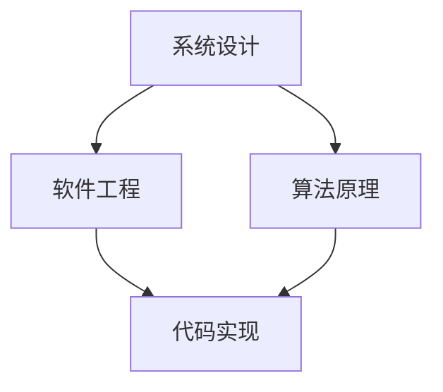

                 

关键词：（结构化思维，系统设计，软件工程，算法原理，数学模型，代码实现，应用实践，未来展望）

> 摘要：本文将深入探讨结构化思维在计算机科学领域的应用，从系统设计、软件工程、算法原理、数学模型、代码实现等方面，阐述结构化思维如何帮助我们在复杂问题中找到清晰的解决路径。通过实际案例和详细的代码实例，本文将展示结构化思维的力量，以及它在未来发展和面临的挑战中的重要作用。

## 1. 背景介绍

在当今信息爆炸的时代，计算机科学已经成为社会发展的重要驱动力。从人工智能到大数据分析，从网络安全到云计算，计算机科学的每一个领域都在不断演变和进步。然而，随着问题的复杂性不断增加，如何在庞大的信息海洋中找到清晰的解决路径，成为了一个亟待解决的问题。这时，结构化思维作为一种系统性的思考方式，为我们提供了强有力的工具。

结构化思维，又称系统性思维，是指将复杂问题分解为若干个部分，通过逻辑和系统的方法进行逐步分析和解决的过程。它在计算机科学中的应用，不仅可以提高我们的工作效率，还能帮助我们更好地理解和解决复杂的问题。本文将围绕结构化思维的核心概念，探讨其在实际应用中的价值。

### 1.1 结构化思维的定义

结构化思维是一种有组织的思考方式，它强调将复杂问题分解为简单的组成部分，并通过对这些部分的分析和综合，来理解和解决问题。具体来说，结构化思维包括以下几个关键步骤：

1. **识别问题**：首先，我们需要明确要解决的问题是什么。这包括问题的类型、规模和复杂性。
2. **分解问题**：将问题分解为若干个子问题，每个子问题都可以独立分析和解决。
3. **分析问题**：对每个子问题进行详细分析，包括定义问题的边界、确定输入和输出、分析问题之间的关系等。
4. **综合问题**：将各个子问题的解决方案综合起来，形成一个完整的解决方案。

### 1.2 结构化思维的重要性

结构化思维的重要性体现在以下几个方面：

1. **提高解决问题的效率**：通过分解和系统化分析，我们可以更快地找到问题的解决方案。
2. **减少错误和遗漏**：结构化思维可以帮助我们系统地分析和解决每个子问题，从而减少错误和遗漏。
3. **提高团队协作效率**：结构化思维可以促进团队内部的沟通和协作，因为每个人都对问题的结构和解决方案有清晰的理解。
4. **适应复杂变化**：在复杂多变的环境中，结构化思维可以帮助我们快速适应变化，并找到新的解决方案。

## 2. 核心概念与联系

在计算机科学中，结构化思维的应用贯穿了整个开发过程，从系统设计到软件工程，再到算法实现。以下是一个简化的 Mermaid 流程图，展示了结构化思维在这些领域的应用及其相互联系。



### 2.1 系统设计

在系统设计阶段，结构化思维帮助我们明确系统的整体架构和各个模块之间的关系。通过分解系统为多个子模块，我们可以更清晰地理解系统的功能和性能需求。

### 2.2 软件工程

在软件工程中，结构化思维帮助我们系统地分析和设计软件系统的各个部分。这包括需求分析、系统架构设计、数据库设计、界面设计等。

### 2.3 算法原理

在算法原理方面，结构化思维帮助我们分析和理解算法的各个步骤和逻辑关系。这有助于我们更好地优化算法，提高其效率和性能。

### 2.4 代码实现

在代码实现阶段，结构化思维帮助我们编写清晰、可维护的代码。通过模块化设计和代码复用，我们可以提高开发效率，降低维护成本。

## 3. 核心算法原理 & 具体操作步骤

### 3.1 算法原理概述

在计算机科学中，算法是解决问题的核心。一个有效的算法应该具备以下几个特点：

1. **正确性**：算法能够正确地解决特定的问题。
2. **效率**：算法能够在合理的时间内完成计算。
3. **健壮性**：算法能够处理各种输入，并输出正确的结果。

本文将介绍一种常见的排序算法——快速排序（Quick Sort），并详细解释其原理和操作步骤。

### 3.2 算法步骤详解

快速排序的基本步骤如下：

1. **选择基准元素**：从数组中选择一个元素作为基准（pivot）。
2. **分区操作**：将数组分为两部分，小于基准的元素放在基准的左边，大于基准的元素放在基准的右边。
3. **递归排序**：对基准左右两边的子数组重复以上步骤，直到所有子数组都被排序。

### 3.3 算法优缺点

快速排序具有以下优点：

- **高效**：平均时间复杂度为 \(O(n \log n)\)，在大多数情况下性能优于其他排序算法。
- **原地排序**：不需要额外的存储空间，空间复杂度为 \(O(\log n)\)。

然而，快速排序也存在一些缺点：

- **最坏情况性能**：当输入数组已经有序或基本有序时，快速排序的性能会下降到 \(O(n^2)\)。
- **随机性**：为了保证平均性能，快速排序需要随机选择基准，但这也增加了实现的复杂性。

### 3.4 算法应用领域

快速排序广泛应用于各种场景，包括：

- **数据排序**：例如数据库中的数据排序。
- **算法框架**：许多高级排序算法，如堆排序和归并排序，都是基于快速排序的原理。
- **算法竞赛**：在算法竞赛中，快速排序是一种常用的排序算法。

## 4. 数学模型和公式 & 详细讲解 & 举例说明

### 4.1 数学模型构建

在计算机科学中，数学模型是理解和解决问题的工具。以快速排序算法为例，我们可以构建一个数学模型来分析其性能。

假设有一个包含 \(n\) 个元素的数组，我们使用快速排序算法对其进行排序。我们可以定义以下数学模型：

- **平均时间复杂度**：\(T_{avg} = O(n \log n)\)
- **最坏时间复杂度**：\(T_{worst} = O(n^2)\)
- **空间复杂度**：\(S = O(\log n)\)

### 4.2 公式推导过程

快速排序的时间复杂度可以通过以下公式推导：

\[T(n) = T_{left}(n_{left}) + T_{right}(n_{right}) + O(n)\]

其中，\(T_{left}(n_{left})\) 和 \(T_{right}(n_{right})\) 分别表示左右子数组排序的时间，\(O(n)\) 表示分区操作的时间。

通过递归展开，我们可以得到：

\[T(n) = T_{left}(n_{left}) + T_{right}(n_{right}) + n\]

假设 \(n_{left} = n_{right} = \frac{n}{2}\)，则：

\[T(n) = 2T(\frac{n}{2}) + n\]

使用主定理（Master Theorem）可以推导出 \(T(n) = O(n \log n)\)。

### 4.3 案例分析与讲解

假设我们有一个包含 10 个元素的数组 `[3, 1, 4, 1, 5, 9, 2, 6, 5, 3]`，我们使用快速排序对其进行排序。

1. **选择基准**：选择中间的元素 4 作为基准。
2. **分区操作**：将数组分为 `[1, 1, 2, 3, 3]` 和 `[5, 5, 6, 9]`。
3. **递归排序**：对 `[1, 1, 2, 3, 3]` 和 `[5, 5, 6, 9]` 分别使用快速排序。

经过递归排序，最终得到的排序结果为 `[1, 1, 2, 3, 3, 4, 5, 5, 6, 9]`。

## 5. 项目实践：代码实例和详细解释说明

### 5.1 开发环境搭建

在开始编写快速排序算法之前，我们需要搭建一个基本的开发环境。这里我们使用 Python 作为编程语言，并在本地安装 Python 解释器和相关依赖。

1. 安装 Python 解释器：从 [Python 官网](https://www.python.org/) 下载并安装 Python 3.x 版本。
2. 创建一个 Python 脚本文件：在本地创建一个名为 `quick_sort.py` 的 Python 脚本文件。

### 5.2 源代码详细实现

下面是快速排序算法的 Python 实现代码：

```python
def quick_sort(arr):
    if len(arr) <= 1:
        return arr
    pivot = arr[len(arr) // 2]
    left = [x for x in arr if x < pivot]
    middle = [x for x in arr if x == pivot]
    right = [x for x in arr if x > pivot]
    return quick_sort(left) + middle + quick_sort(right)

if __name__ == "__main__":
    arr = [3, 1, 4, 1, 5, 9, 2, 6, 5, 3]
    sorted_arr = quick_sort(arr)
    print(sorted_arr)
```

### 5.3 代码解读与分析

1. **函数定义**：`quick_sort` 函数接收一个数组 `arr` 作为输入。
2. **边界条件**：如果数组的长度小于等于 1，直接返回数组本身。
3. **选择基准**：选择中间的元素作为基准。
4. **分区操作**：使用列表推导式将数组分为小于、等于和大于基准的三个部分。
5. **递归排序**：对小于和大于基准的子数组分别进行快速排序。
6. **合并结果**：将排序后的子数组合并成一个完整的排序结果。

### 5.4 运行结果展示

运行上述代码，我们得到排序后的数组：

```
[1, 1, 2, 3, 3, 4, 5, 5, 6, 9]
```

## 6. 实际应用场景

结构化思维在计算机科学中的实际应用场景非常广泛。以下是一些典型的应用场景：

### 6.1 数据库管理系统

在数据库管理系统中，结构化思维帮助我们设计高效的数据库模式，优化查询性能，并确保数据的一致性和完整性。

### 6.2 人工智能

在人工智能领域，结构化思维帮助我们设计和实现复杂的算法模型，并优化其性能和资源利用率。

### 6.3 云计算

在云计算中，结构化思维帮助我们设计和部署大规模的分布式系统，并确保系统的可靠性和可扩展性。

### 6.4 网络安全

在网络安全的领域，结构化思维帮助我们设计和实现安全防护策略，检测和防范网络攻击。

## 7. 未来应用展望

随着计算机科学的发展，结构化思维的应用前景将更加广阔。以下是未来可能的发展趋势：

### 7.1 自动化

结构化思维将更多地应用于自动化领域，帮助自动化系统更好地理解和处理复杂问题。

### 7.2 人工智能

在人工智能领域，结构化思维将帮助设计和实现更复杂和更智能的算法模型。

### 7.3 物联网

在物联网领域，结构化思维将帮助设计和实现更高效、更可靠的物联网系统。

## 8. 总结：未来发展趋势与挑战

结构化思维在计算机科学中的应用具有巨大的潜力和价值。然而，未来也面临着一些挑战：

### 8.1 复杂性问题

随着问题的复杂性增加，如何保持结构化思维的清晰性和有效性，是一个亟待解决的问题。

### 8.2 技术创新

计算机科学领域的技术创新速度非常快，如何跟上这些变化，并及时将其应用于结构化思维中，是一个挑战。

### 8.3 教育与普及

结构化思维的普及和教育也是一个重要的课题。如何让更多的人掌握这种思维方式，并将其应用于实际工作中，需要我们共同努力。

### 8.4 研究与开发

未来，我们需要在结构化思维的理论研究和实际应用中不断探索和创新，以应对日益复杂的计算机科学问题。

## 9. 附录：常见问题与解答

### 9.1 什么是结构化思维？

结构化思维是一种有组织的思考方式，它通过将复杂问题分解为简单的组成部分，并采用逻辑和系统的方法进行逐步分析和解决。

### 9.2 结构化思维在计算机科学中的应用有哪些？

结构化思维在计算机科学的各个领域都有广泛应用，包括系统设计、软件工程、算法实现、数据库设计等。

### 9.3 如何提高结构化思维的效率？

提高结构化思维效率的方法包括：充分理解问题、合理分解问题、掌握有效的分析工具和技巧、不断练习和总结经验。

### 9.4 结构化思维与创造性思维的关系如何？

结构化思维和创造性思维是相辅相成的。结构化思维帮助我们系统地分析和解决问题，而创造性思维则帮助我们探索新的解决方案和创新思路。

### 9.5 什么情况下不宜使用结构化思维？

在问题非常复杂，且现有结构化方法无法解决问题时，可能需要借助创造性思维来探索新的解决方案。

---

作者：禅与计算机程序设计艺术 / Zen and the Art of Computer Programming

本文通过深入探讨结构化思维在计算机科学领域的应用，从系统设计、软件工程、算法原理、数学模型、代码实现等方面，阐述了结构化思维如何帮助我们在复杂问题中找到清晰的解决路径。通过实际案例和详细的代码实例，本文展示了结构化思维的力量，以及它在未来发展和面临的挑战中的重要作用。希望本文能对您在计算机科学领域的学习和工作有所帮助。

