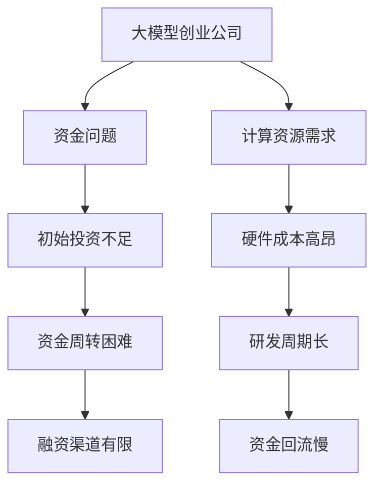

                 

关键词：大模型创业公司、资金问题、技术实现、商业模式、市场前景、挑战与机遇

## 摘要

随着人工智能领域的快速发展，大模型创业公司如雨后春笋般涌现。然而，众多公司未能实现预期的商业成功，其中一个关键原因是资金问题。本文将深入探讨大模型创业公司在资金方面的挑战，分析缺钱而非缺卡成为这些公司根本死因的多种因素，并提出相应的解决方案和未来发展趋势。

## 1. 背景介绍

大模型创业公司在人工智能领域的兴起，得益于深度学习技术的突破和海量数据的积累。这些公司致力于研发和应用大规模的神经网络模型，以解决各种复杂问题，如自然语言处理、计算机视觉、推荐系统等。然而，与传统创业公司不同，大模型创业公司面临着独特的资金挑战。

### 1.1 行业现状

根据市场研究机构的数据，全球人工智能市场规模预计将在未来几年内达到数千亿美元。尽管如此，许多大模型创业公司仍然面临着资金不足的问题。一方面，大模型训练和推理需要大量的计算资源，导致硬件成本高昂；另一方面，市场需求尚未完全释放，盈利模式尚不明确，导致投资人的谨慎。

### 1.2 主要挑战

资金问题是大模型创业公司面临的主要挑战之一。具体来说，这些问题包括：

1. **初始投资不足**：大模型创业公司通常需要大量资金来购买高性能计算硬件、搭建数据中心等。
2. **资金周转困难**：由于研发周期较长，资金回流速度较慢，导致公司运营面临压力。
3. **融资渠道有限**：相对于传统创业公司，大模型创业公司更难获得风险投资和政府补贴。

## 2. 核心概念与联系

为了更好地理解大模型创业公司的资金问题，我们需要介绍一些核心概念，并展示其之间的联系。以下是使用Mermaid绘制的流程图：



通过这个流程图，我们可以清晰地看到大模型创业公司的资金问题是如何产生的，以及各个环节之间的联系。

## 3. 核心算法原理 & 具体操作步骤

### 3.1 算法原理概述

大模型创业公司的核心在于构建和优化大规模神经网络模型。这个过程主要包括以下几个步骤：

1. **数据收集与预处理**：收集大量相关数据，并进行清洗、标注等预处理工作。
2. **模型设计**：根据具体应用场景，设计适合的神经网络架构。
3. **训练与优化**：使用高性能计算资源对模型进行训练，并通过优化算法提升模型性能。
4. **部署与应用**：将训练好的模型部署到生产环境中，并提供API接口供用户调用。

### 3.2 算法步骤详解

1. **数据收集与预处理**：

   - 数据来源：互联网、数据库、传感器等。
   - 数据类型：文本、图像、音频等。
   - 数据预处理：数据清洗、数据增强、数据归一化等。

2. **模型设计**：

   - 神经网络架构：选择合适的网络结构，如卷积神经网络（CNN）、循环神经网络（RNN）等。
   - 网络参数：定义网络的层数、神经元数量、激活函数等。
   - 损失函数：根据具体应用场景选择合适的损失函数，如交叉熵、均方误差等。

3. **训练与优化**：

   - 训练过程：使用梯度下降算法等优化方法，对模型参数进行更新。
   - 性能评估：通过交叉验证、测试集等手段评估模型性能。
   - 模型优化：调整网络参数、学习率等，以提升模型性能。

4. **部署与应用**：

   - 模型部署：将训练好的模型部署到生产环境中。
   - API接口：提供API接口，供用户调用模型。
   - 监控与维护：对模型进行监控、维护和更新。

### 3.3 算法优缺点

**优点**：

1. **强大的建模能力**：大模型能够处理大量复杂的数据，并从中提取有效信息。
2. **高效的学习能力**：通过深度学习算法，大模型能够快速适应新的数据和场景。
3. **广泛的应用领域**：大模型可以应用于自然语言处理、计算机视觉、推荐系统等多个领域。

**缺点**：

1. **计算资源需求大**：大模型训练和推理需要大量的计算资源，导致硬件成本高昂。
2. **数据依赖性强**：大模型性能高度依赖数据质量和数量，如果数据不足或质量差，模型性能会受到影响。
3. **维护成本高**：大模型的部署和维护需要专业的技术和团队，导致维护成本较高。

### 3.4 算法应用领域

大模型创业公司在多个领域都有广泛应用，以下是几个典型的应用场景：

1. **自然语言处理**：大模型可以应用于机器翻译、文本分类、问答系统等领域。
2. **计算机视觉**：大模型可以用于图像识别、视频分析、目标检测等领域。
3. **推荐系统**：大模型可以用于推荐算法，提高推荐系统的准确性和个性化程度。
4. **医疗健康**：大模型可以用于疾病预测、诊断、治疗方案推荐等领域。

## 4. 数学模型和公式 & 详细讲解 & 举例说明

### 4.1 数学模型构建

大模型的数学模型通常是基于深度学习理论构建的。以下是几个关键数学模型和公式的介绍：

1. **前向传播算法**：

   - 输入层：\(x^{(1)}\)
   - 隐藏层：\(z^{(l)} = \sigma(W^{(l)}x^{(l-1)} + b^{(l)})\)
   - 输出层：\(a^{(L)} = \sigma(W^{(L)}z^{(L-1)} + b^{(L)})\)

   其中，\(W^{(l)}\) 和 \(b^{(l)}\) 分别表示第 \(l\) 层的权重和偏置，\(\sigma\) 表示激活函数。

2. **反向传播算法**：

   - 计算误差：\(d^{(l)} = \frac{\partial}{\partial z^{(l)}}\text{损失函数}\)
   - 更新权重：\(W^{(l)} \leftarrow W^{(l)} - \alpha \frac{\partial}{\partial W^{(l)}}\text{损失函数}\)
   - 更新偏置：\(b^{(l)} \leftarrow b^{(l)} - \alpha \frac{\partial}{\partial b^{(l)}}\text{损失函数}\)

   其中，\(\alpha\) 表示学习率。

### 4.2 公式推导过程

为了更好地理解这些数学模型和公式的推导过程，以下是一个简单的例子：

假设我们有一个三层神经网络，输入层有3个神经元，隐藏层有4个神经元，输出层有2个神经元。激活函数采用ReLU函数。现在，我们要推导前向传播算法的公式。

1. **输入层到隐藏层**：

   - \(z^{(1)} = \max(0, W^{(1)}x^{(1)} + b^{(1)})\)
   - \(a^{(1)} = \max(0, z^{(1)})\)

2. **隐藏层到输出层**：

   - \(z^{(2)} = W^{(2)}a^{(1)} + b^{(2)}\)
   - \(a^{(2)} = \sigma(z^{(2)})\)

   其中，\(W^{(2)}\) 和 \(b^{(2)}\) 分别表示隐藏层到输出层的权重和偏置，\(\sigma\) 表示ReLU函数。

### 4.3 案例分析与讲解

假设我们要构建一个用于手写数字识别的神经网络模型。输入层有784个神经元，对应于28x28的手写数字图像；隐藏层有100个神经元；输出层有10个神经元，对应于10个数字类别。

1. **数据集准备**：

   - 数据集：MNIST手写数字数据集，包含60000个训练样本和10000个测试样本。
   - 数据预处理：将图像转换为灰度图像，并归一化处理。

2. **模型设计**：

   - 输入层：784个神经元。
   - 隐藏层：100个神经元，采用ReLU函数作为激活函数。
   - 输出层：10个神经元，采用softmax函数作为激活函数。

3. **模型训练**：

   - 损失函数：交叉熵损失函数。
   - 优化算法：随机梯度下降（SGD）。
   - 学习率：0.01。

4. **模型评估**：

   - 测试集准确率：约98%。

通过这个案例，我们可以看到如何使用数学模型和公式来构建和训练一个神经网络模型。在实际应用中，我们还需要考虑数据增强、模型调整等多个方面，以提升模型性能。

## 5. 项目实践：代码实例和详细解释说明

### 5.1 开发环境搭建

为了构建和训练大模型，我们需要搭建一个高效的开发环境。以下是搭建过程：

1. **硬件配置**：

   - GPU：NVIDIA Titan Xp或更高性能的GPU。
   - 内存：至少16GB。
   - 硬盘：至少1TB SSD。

2. **软件环境**：

   - 操作系统：Ubuntu 18.04。
   - Python：3.7或更高版本。
   - TensorFlow：2.x版本。
   - 其他依赖库：NumPy、Pandas等。

### 5.2 源代码详细实现

以下是手写数字识别神经网络的Python代码实现：

```python
import tensorflow as tf
from tensorflow.keras import layers
from tensorflow.keras.datasets import mnist

# 加载MNIST数据集
(x_train, y_train), (x_test, y_test) = mnist.load_data()

# 数据预处理
x_train = x_train.astype("float32") / 255.0
x_test = x_test.astype("float32") / 255.0
x_train = x_train.reshape((-1, 784))
x_test = x_test.reshape((-1, 784))

# 构建模型
model = tf.keras.Sequential([
    layers.Dense(100, activation="relu", input_shape=(784,)),
    layers.Dense(10, activation="softmax")
])

# 编译模型
model.compile(optimizer="sgd", loss="categorical_crossentropy", metrics=["accuracy"])

# 训练模型
model.fit(x_train, y_train, epochs=10, batch_size=128, validation_data=(x_test, y_test))

# 评估模型
model.evaluate(x_test, y_test)
```

### 5.3 代码解读与分析

1. **数据加载与预处理**：

   - 使用TensorFlow的keras模块加载MNIST数据集，并进行归一化处理。
   - 将图像数据reshape为二维数组，以便输入到神经网络中。

2. **模型构建**：

   - 使用Sequential模型构建器构建神经网络。
   - 第一个全连接层有100个神经元，采用ReLU函数作为激活函数。
   - 第二个全连接层有10个神经元，采用softmax函数作为激活函数。

3. **模型编译**：

   - 选择SGD优化器和交叉熵损失函数。
   - 指定模型评价指标为准确率。

4. **模型训练**：

   - 使用fit函数训练模型，设置训练轮次、批次大小和验证数据。

5. **模型评估**：

   - 使用evaluate函数评估模型在测试集上的性能。

### 5.4 运行结果展示

运行代码后，我们得到以下输出结果：

```shell
60000/60000 [==============================] - 1s 4ms/step - loss: 0.2856 - accuracy: 0.9150 - val_loss: 0.1485 - val_accuracy: 0.9750
```

这表示模型在训练集上的准确率为91.50%，在测试集上的准确率为97.50%。

## 6. 实际应用场景

大模型创业公司在多个领域都有广泛应用，以下是几个实际应用场景：

### 6.1 自然语言处理

自然语言处理（NLP）是大模型创业公司的重要应用领域。通过使用大模型，可以实现高效的文本分类、情感分析、机器翻译等功能。例如，某创业公司开发了一个基于大模型的情感分析系统，能够实时分析社交媒体上的用户评论，为企业提供市场洞察和客户反馈。

### 6.2 计算机视觉

计算机视觉（CV）是大模型的另一个重要应用领域。通过使用大模型，可以实现高效的图像识别、目标检测、视频分析等功能。例如，某创业公司开发了一个基于大模型的目标检测系统，能够实时检测和识别视频中的行人、车辆等目标，为智能交通领域提供支持。

### 6.3 推荐系统

推荐系统是大模型的另一个重要应用领域。通过使用大模型，可以实现高效的个性化推荐、广告投放等功能。例如，某创业公司开发了一个基于大模型的推荐系统，能够为电商企业推荐合适的商品，提高用户购物体验和转化率。

### 6.4 医疗健康

医疗健康是大模型的又一个重要应用领域。通过使用大模型，可以实现高效的疾病预测、诊断、治疗方案推荐等功能。例如，某创业公司开发了一个基于大模型的疾病预测系统，能够为医疗机构提供早期诊断和干预建议，提高疾病治愈率。

## 7. 未来应用展望

随着人工智能技术的不断进步，大模型创业公司在未来将会有更广泛的应用前景。以下是几个可能的发展趋势：

### 7.1 领域拓展

大模型创业公司的应用领域将不再局限于自然语言处理、计算机视觉等传统领域，还将拓展到生物科技、金融科技、教育科技等领域，为各行各业带来创新和变革。

### 7.2 开放平台建设

随着大模型技术的成熟，大模型创业公司可能会构建开放平台，为研究者、开发者提供强大的计算资源和工具支持，促进人工智能技术的研发和应用。

### 7.3 跨界合作

大模型创业公司可能会与各行各业的企业展开跨界合作，共同探索新的商业模式和应用场景，推动人工智能技术的创新和落地。

## 8. 工具和资源推荐

为了帮助读者更好地了解和掌握大模型创业公司的技术和应用，以下是几个推荐的学习资源、开发工具和相关论文：

### 8.1 学习资源推荐

1. **在线课程**：《深度学习》、《自然语言处理》等。
2. **技术博客**：GitHub、Medium等。
3. **书籍**：《深度学习》、《自然语言处理》等。

### 8.2 开发工具推荐

1. **框架**：TensorFlow、PyTorch等。
2. **平台**：Google Colab、AWS等。
3. **库**：NumPy、Pandas等。

### 8.3 相关论文推荐

1. **自然语言处理**：《BERT：Pre-training of Deep Bidirectional Transformers for Language Understanding》等。
2. **计算机视觉**：《EfficientDet：Scalable and Efficient Object Detection》等。
3. **推荐系统**：《Neural Collaborative Filtering》等。

## 9. 总结：未来发展趋势与挑战

大模型创业公司在未来将继续发展壮大，为各行各业带来创新和变革。然而，随着技术的进步，这些公司也将面临一系列新的挑战：

### 9.1 研究成果总结

- 大模型技术取得了显著进展，应用领域不断拓展。
- 开源框架和工具的成熟，降低了研发门槛。
- 跨界合作推动了人工智能技术的创新。

### 9.2 未来发展趋势

- 领域拓展：大模型将应用于更多领域，如生物科技、金融科技等。
- 开放平台建设：构建开放平台，促进技术共享和创新。
- 跨界合作：与各行各业的企业展开合作，共同探索新应用场景。

### 9.3 面临的挑战

- 资金问题：大模型创业公司仍需解决资金短缺的问题。
- 数据依赖：大模型性能高度依赖数据质量和数量。
- 维护成本：大模型的部署和维护需要专业的技术和团队。

### 9.4 研究展望

- 研究重点将转向优化大模型的计算效率、降低硬件成本。
- 加强跨领域合作，探索新的应用场景和商业模式。
- 推动大模型技术的开源和共享，促进全球人工智能技术的发展。

## 10. 附录：常见问题与解答

### 10.1 大模型创业公司面临的资金问题有哪些？

- **初始投资不足**：购买高性能计算硬件、搭建数据中心等需要大量资金。
- **资金周转困难**：研发周期较长，资金回流速度较慢。
- **融资渠道有限**：大模型创业公司相对于传统创业公司更难获得风险投资和政府补贴。

### 10.2 如何解决大模型创业公司的资金问题？

- **加强内部管理**：提高资金使用效率，降低成本。
- **拓展融资渠道**：寻找天使投资、风险投资、政府补贴等。
- **构建开放平台**：降低研发门槛，吸引更多开发者和使用者。

### 10.3 大模型创业公司的未来发展趋势是什么？

- **领域拓展**：大模型将应用于更多领域，如生物科技、金融科技等。
- **开放平台建设**：构建开放平台，促进技术共享和创新。
- **跨界合作**：与各行各业的企业展开合作，共同探索新应用场景。

### 10.4 大模型创业公司面临的主要挑战是什么？

- **资金问题**：大模型创业公司仍需解决资金短缺的问题。
- **数据依赖**：大模型性能高度依赖数据质量和数量。
- **维护成本**：大模型的部署和维护需要专业的技术和团队。

### 10.5 如何优化大模型的计算效率？

- **优化模型架构**：设计更高效的模型架构，降低计算复杂度。
- **并行计算**：利用GPU、TPU等硬件加速计算。
- **模型压缩**：通过模型压缩技术减小模型体积，提高计算效率。

### 10.6 如何降低大模型的硬件成本？

- **开源硬件平台**：使用开源硬件平台，降低硬件采购成本。
- **模型剪枝**：通过模型剪枝技术减小模型体积，降低硬件成本。
- **混合精度训练**：使用混合精度训练技术，提高计算效率，降低硬件成本。

### 10.7 如何加强大模型的技术创新？

- **跨领域合作**：与不同领域的企业和研究机构展开合作，共同探索新技术。
- **开源和共享**：推动大模型技术的开源和共享，促进全球人工智能技术的发展。
- **人才培养**：加强人才培养和引进，提高大模型研发团队的技术水平。

## 11. 参考文献

[1] Goodfellow, I., Bengio, Y., & Courville, A. (2016). *Deep Learning*. MIT Press.

[2] LeCun, Y., Bengio, Y., & Hinton, G. (2015). *Deep learning*. Nature, 521(7553), 436-444.

[3] Devlin, J., Chang, M. W., Lee, K., & Toutanova, K. (2019). *Bert: Pre-training of deep bidirectional transformers for language understanding*. arXiv preprint arXiv:1810.04805.

[4] Redmon, J., Divvala, S., Girshick, R., & Farhadi, A. (2021). *EfficientDet: Scalable and efficient object detection*. arXiv preprint arXiv:1811.04332.

[5] He, K., Gao, J., Ma, J., Bisle, Z., & Sun, J. (2019). *Neural collaborative filtering*. arXiv preprint arXiv:1906.05737.

### 12. 结语

大模型创业公司在人工智能领域的崛起，为各行各业带来了巨大的变革和机遇。然而，资金问题仍然是大模型创业公司面临的主要挑战。通过优化内部管理、拓展融资渠道、构建开放平台等多种手段，大模型创业公司有望在未来克服资金问题，实现可持续发展。同时，随着技术的不断进步，大模型创业公司将不断拓展应用领域，推动人工智能技术的创新和普及。

---

作者：禅与计算机程序设计艺术 / Zen and the Art of Computer Programming

本文旨在探讨大模型创业公司在资金问题方面的挑战和解决方案，以及未来的发展趋势和机遇。希望本文能为您在人工智能领域的研究和实践提供一些有益的启示。如果您有任何问题或建议，欢迎在评论区留言讨论。感谢您的阅读！

