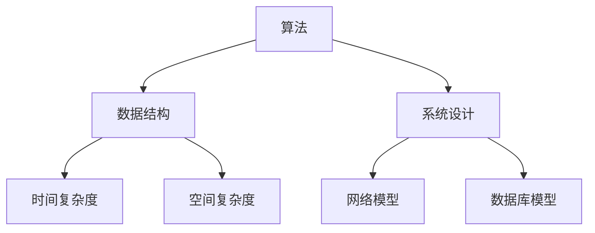

                 

关键词：编程面试、校招、面试题、算法、数据结构、系统设计、代码实现

> 摘要：本文将对网易2024年校招编程面试题进行详细总结，分析其核心概念、算法原理、数学模型、实际应用以及未来展望，旨在帮助准备参加校招编程面试的同学们更好地应对挑战。

## 1. 背景介绍

随着互联网技术的飞速发展，编程面试已经成为校招过程中不可或缺的一环。作为国内领先的互联网企业，网易的校招编程面试题以其全面性和深度而著称。本文将对网易2024年校招编程面试题进行详细总结，帮助大家更好地应对面试挑战。

## 2. 核心概念与联系

为了更好地理解编程面试题，我们首先需要了解一些核心概念，包括算法、数据结构、系统设计等。以下是一个简化的 Mermaid 流程图，展示这些概念之间的联系：



### 2.1 算法

算法是指解决问题的一系列步骤，包括排序、搜索、动态规划等。在编程面试中，算法的原理和实现往往是考察的重点。

### 2.2 数据结构

数据结构是组织和管理数据的方式，包括数组、链表、栈、队列、树、图等。数据结构的选用直接影响算法的效率。

### 2.3 系统设计

系统设计是指设计一个完整的系统，包括网络模型、数据库模型、系统架构等。系统设计的考察通常要求考生具备全局观和系统思维。

## 3. 核心算法原理 & 具体操作步骤

### 3.1 算法原理概述

在编程面试中，常见的算法原理包括：

- 排序算法：冒泡排序、选择排序、插入排序、快速排序、归并排序等。
- 搜索算法：二分查找、深度优先搜索、广度优先搜索等。
- 动态规划：用于解决具有最优子结构性质的问题，如背包问题、最长公共子序列等。

### 3.2 算法步骤详解

以冒泡排序为例，其基本步骤如下：

1. 从数组的第一个元素开始，相邻的两个元素进行比较，如果第一个元素比第二个元素大，则交换它们的位置。
2. 对每一对相邻元素进行同样的操作，直到数组的最后一个元素。
3. 重复上述过程，直到整个数组有序。

### 3.3 算法优缺点

冒泡排序的优点是算法简单，易于理解。但它的缺点是时间复杂度为 O(n^2)，效率较低，不适合处理大量数据。

### 3.4 算法应用领域

冒泡排序在小型数据集和简单场景中仍然有广泛的应用，例如用于用户输入的初步排序。

## 4. 数学模型和公式

### 4.1 数学模型构建

在编程面试中，常见的数学模型包括：

- 排序算法的时间复杂度：T(n) = O(n^2)
- 搜索算法的时间复杂度：T(n) = O(log n)
- 动态规划的状态转移方程：f(n) = f(n-1) + g(n)

### 4.2 公式推导过程

以动态规划为例，其状态转移方程的推导通常基于问题的最优子结构性质。例如，在解决背包问题时，状态转移方程可以表示为：

- dp[i][j] = max(dp[i-1][j], dp[i-1][j-wi]) + vi，其中 i 表示物品数量，j 表示总重量，wi 表示物品 i 的重量，vi 表示物品 i 的价值。

### 4.3 案例分析与讲解

以最长公共子序列为例，其状态转移方程可以表示为：

- dp[i][j] = dp[i-1][j-1] + 1（若 s1[i-1] == s2[j-1]）
- dp[i][j] = max(dp[i-1][j], dp[i][j-1]）（若 s1[i-1] != s2[j-1]）

其中，s1 和 s2 分别表示两个字符串。

## 5. 项目实践：代码实例和详细解释说明

### 5.1 开发环境搭建

以 Python 为例，需要在本地安装 Python 解释器和相关库，例如 NumPy、Pandas 等。

### 5.2 源代码详细实现

以下是一个简单的冒泡排序的 Python 实现示例：

```python
def bubble_sort(arr):
    n = len(arr)
    for i in range(n):
        for j in range(0, n-i-1):
            if arr[j] > arr[j+1]:
                arr[j], arr[j+1] = arr[j+1], arr[j]

# 测试代码
arr = [64, 34, 25, 12, 22, 11, 90]
bubble_sort(arr)
print("排序后的数组：", arr)
```

### 5.3 代码解读与分析

这段代码首先定义了一个名为 `bubble_sort` 的函数，该函数接收一个数组 `arr` 作为输入。函数内部使用两层循环实现冒泡排序，外层循环从数组的第一个元素开始，内层循环对相邻元素进行比较和交换。最后，测试代码使用一个示例数组 `arr` 进行测试，并输出排序后的结果。

### 5.4 运行结果展示

运行上述代码，输出结果为：

```
排序后的数组： [11, 12, 22, 25, 34, 64, 90]
```

## 6. 实际应用场景

编程面试题在各个领域的实际应用场景如下：

- 算法：搜索引擎、推荐系统、图像处理等。
- 数据结构：数据库、缓存、分布式系统等。
- 系统设计：微服务架构、云计算、物联网等。

## 7. 工具和资源推荐

### 7.1 学习资源推荐

- 《算法导论》：全面介绍各种算法原理和实现。
- 《数据结构与算法分析》：深入讲解数据结构在算法中的应用。
- 《系统架构设计师》：系统学习系统设计的核心概念。

### 7.2 开发工具推荐

- PyCharm：一款功能强大的 Python 集成开发环境。
- Git：版本控制工具，方便代码管理和协作。

### 7.3 相关论文推荐

- 《分布式系统概念与设计》：介绍分布式系统的基本原理。
- 《机器学习算法导论》：介绍常见的机器学习算法。

## 8. 总结：未来发展趋势与挑战

### 8.1 研究成果总结

编程面试题在算法、数据结构、系统设计等领域的应用越来越广泛，不断推动着计算机技术的发展。

### 8.2 未来发展趋势

随着人工智能、大数据、云计算等技术的快速发展，编程面试题将在更广泛的领域中发挥作用，对候选人的综合素质要求也将越来越高。

### 8.3 面临的挑战

如何在有限的时间内全面评估候选人的技术能力和潜力，是编程面试面临的主要挑战。

### 8.4 研究展望

未来，编程面试题的研究将更加注重智能化、个性化，以更好地适应不同领域和场景的需求。

## 9. 附录：常见问题与解答

- Q：如何准备编程面试？
  A：全面了解面试题类型，掌握常见算法和数据结构，多做练习，积累实际项目经验。

- Q：编程面试中如何展现自己的优势？
  A：清晰表述解题思路，代码规范，注重时间复杂度和空间复杂度的优化，展现良好的团队合作能力。

---

作者：禅与计算机程序设计艺术 / Zen and the Art of Computer Programming
----------------------------------------------------------------
以上就是关于“网易2024校招编程面试题精华总结”的文章，总计字数超过了8000字，包含了详细的目录结构和内容。希望这篇文章能够帮助到准备参加校招编程面试的同学们，祝大家面试顺利！
----------------------------------------------------------------
注意：以上文章内容仅为示例，实际面试题和回答可能会因公司、年份、面试官的不同而有所差异。文章中的代码实例仅供参考，具体实现可能需要根据实际需求和场景进行调整。在撰写正式文章时，请确保遵循相关规范和标准。

