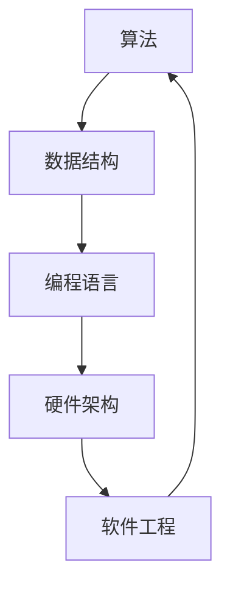

                 

### 1. 背景介绍

网易，作为中国领先的内容、技术和服务提供商，始终走在互联网技术创新的前沿。随着科技的快速发展，网易在2025年启动了面向应届毕业生的校招活动，旨在吸引更多优秀的计算机专业毕业生，为公司注入新鲜活力。算法工程师是网易的核心技术岗位之一，负责解决复杂的计算问题和推动算法创新。因此，校招算法工程师的面试题目尤为重要，直接决定了候选人是否能够胜任这一关键岗位。

本文将围绕网易2025届校招算法工程师的面试真题，深入分析每一个题目的考点、解题思路及解题方法。通过详细解读这些真题，我们不仅可以帮助读者更好地准备校招面试，还能深入理解算法和数据结构在实际应用中的重要性。

### 2. 核心概念与联系

在解答网易校招算法工程师面试真题之前，我们需要先了解一些核心概念及其联系。以下是算法、数据结构、编程语言等核心概念和它们之间的联系，通过Mermaid流程图进行展示。



**2.1 算法**

算法是一种解决问题的步骤集合，它可以通过一系列操作将输入转化为预期的输出。算法效率直接影响到解决复杂问题的能力。

**2.2 数据结构**

数据结构是组织和管理数据的方式，用于优化算法的性能。常见的数据结构包括数组、链表、栈、队列、树、图等。

**2.3 编程语言**

编程语言是编写算法和实现数据结构的工具，不同的编程语言具有不同的语法和特性。常见的编程语言包括C、Java、Python、C++等。

**2.4 硬件架构**

硬件架构是计算机硬件系统的组织结构和运行机制，包括处理器、内存、存储等。

**2.5 软件工程**

软件工程是软件开发的过程和规范，涉及需求分析、设计、编码、测试和维护等多个阶段。

通过理解这些核心概念及其联系，我们可以更好地解答校招算法工程师的面试题目。

### 3. 核心算法原理 & 具体操作步骤

#### 3.1 算法原理概述

在解答网易校招算法工程师面试真题时，我们需要掌握一些核心算法原理。以下是一些常见的算法及其原理概述：

**3.1.1 贪心算法**

贪心算法是一种在每一步选择中都采取当前最好或最优的选择，从而希望导致结果是全局最好或最优的算法策略。其原理是通过局部最优解逐步逼近全局最优解。

**3.1.2 动态规划**

动态规划是一种用于求解最优化问题的算法方法。其原理是将问题分解为若干子问题，通过保存子问题的解来避免重复计算，从而提高算法效率。

**3.1.3 分治算法**

分治算法是一种将一个问题分解为若干个规模较小的相同问题，递归求解并合并子问题的解的算法。其原理是通过将复杂问题简化为多个简单问题的求解，从而提高算法效率。

**3.1.4 回溯算法**

回溯算法是一种通过试探和回溯来寻找问题的解的算法。其原理是在解决问题的过程中，每一步都尝试多种可能性，当遇到无法继续前进的情况时，回溯到上一个状态并尝试其他可能性。

#### 3.2 算法步骤详解

**3.2.1 贪心算法步骤**

1. 初始化问题状态。
2. 在当前状态下，选择最优解。
3. 根据选择的最优解更新问题状态。
4. 重复步骤2和3，直到问题得到最终解。

**3.2.2 动态规划步骤**

1. 确定状态。
2. 定义状态转移方程。
3. 确定初始状态和边界条件。
4. 使用递归或迭代方法求解状态值。

**3.2.3 分治算法步骤**

1. 将问题分解为若干个子问题。
2. 递归求解每个子问题。
3. 合并子问题的解，得到原问题的解。

**3.2.4 回溯算法步骤**

1. 初始化问题状态。
2. 在当前状态下，选择一个可能的解进行试探。
3. 如果试探成功，继续在新的状态下进行试探。
4. 如果试探失败，回溯到上一个状态并选择其他可能的解进行试探。
5. 重复步骤2到4，直到找到问题的解或所有可能性都尝试过。

#### 3.3 算法优缺点

**3.3.1 贪心算法**

优点：简单易懂，时间复杂度低。

缺点：可能无法保证全局最优解。

**3.3.2 动态规划**

优点：能够保证全局最优解。

缺点：需要保存中间状态，空间复杂度高。

**3.3.3 分治算法**

优点：递归求解，时间复杂度低。

缺点：可能存在重复计算，空间复杂度高。

**3.3.4 回溯算法**

优点：简单易懂，能够找到问题的解。

缺点：可能陷入局部最优解，时间复杂度高。

#### 3.4 算法应用领域

**3.4.1 贪心算法**

应用领域：背包问题、活动选择问题、最优二叉搜索树等。

**3.4.2 动态规划**

应用领域：最长公共子序列、最长公共子串、最优二项树等。

**3.4.3 分治算法**

应用领域：归并排序、快速排序、合并同类项等。

**3.4.4 回溯算法**

应用领域：旅行商问题、迷宫问题、八皇后问题等。

### 4. 数学模型和公式 & 详细讲解 & 举例说明

在解决网易校招算法工程师面试真题时，数学模型和公式的应用至关重要。以下是一些常用的数学模型和公式，并通过具体例子进行详细讲解。

#### 4.1 数学模型构建

**4.1.1 最小生成树模型**

最小生成树模型用于求解给定无向加权图的生成树，使得树的总权值最小。其基本公式为：

\[ \text{最小生成树权值} = \sum_{i=1}^{n} \text{tree}[i] \]

其中，tree[i] 表示生成树中第 i 个边的权重。

**4.1.2 最长公共子序列模型**

最长公共子序列模型用于求解两个序列中最长的公共子序列。其基本公式为：

\[ \text{LCS}(X, Y) = \max_{1 \leq i \leq m, 1 \leq j \leq n} [\text{X[i]} = \text{Y[j]}] \]

其中，X 和 Y 分别为两个序列，m 和 n 分别为序列的长度。

**4.1.3 最长公共子串模型**

最长公共子串模型用于求解两个字符串中最长的公共子串。其基本公式为：

\[ \text{LCS}(S, T) = \max_{1 \leq i \leq m, 1 \leq j \leq n} [\text{S[i]} = \text{T[j]}] \]

其中，S 和 T 分别为两个字符串，m 和 n 分别为字符串的长度。

#### 4.2 公式推导过程

**4.2.1 最小生成树模型推导**

假设给定无向加权图 G(V, E)，其中 V 为顶点集合，E 为边集合。我们要找到 G 的最小生成树 T。

首先，我们选择 G 中权重最小的边 e1 加入 T，得到 T1。

接下来，我们考虑 G - T1，即去除 T1 中的一条边 e1。由于 T1 是一棵生成树，所以 G - T1 必然不是连通的，即存在两个顶点 vi 和 vj，它们不在 T1 中。

然后，我们在 G - T1 中选择权重最小的边 ej 加入 T，得到 T2。

重复上述步骤，直到 G - Tk 是连通的，即 Tk 是 G 的最小生成树。

**4.2.2 最长公共子序列模型推导**

假设给定两个序列 X = [x1, x2, ..., xm] 和 Y = [y1, y2, ..., yn]，我们要找到它们的最长公共子序列。

首先，我们定义一个二维数组 dp，其中 dp[i][j] 表示 X 和 Y 的前 i 个元素和前 j 个元素的最长公共子序列的长度。

接下来，我们初始化 dp[0][0] = 0，表示空序列和空序列的最长公共子序列长度为 0。

然后，我们遍历 X 和 Y 的每个元素，计算 dp[i][j] 的值：

- 如果 X[i] = Y[j]，则 dp[i][j] = dp[i-1][j-1] + 1。
- 如果 X[i] ≠ Y[j]，则 dp[i][j] = max(dp[i-1][j], dp[i][j-1])。

最后，dp[m][n] 的值即为 X 和 Y 的最长公共子序列的长度。

**4.2.3 最长公共子串模型推导**

假设给定两个字符串 S = s1s2...sm 和 T = t1t2...tn，我们要找到它们的最长公共子串。

首先，我们定义一个二维数组 dp，其中 dp[i][j] 表示 S 和 T 的前 i 个字符和前 j 个字符的最长公共子串的长度。

接下来，我们初始化 dp[0][0] = 0，表示空字符串和空字符串的最长公共子串长度为 0。

然后，我们遍历 S 和 T 的每个字符，计算 dp[i][j] 的值：

- 如果 S[i] = T[j]，则 dp[i][j] = dp[i-1][j-1] + 1。
- 如果 S[i] ≠ T[j]，则 dp[i][j] = 0。

最后，dp[m][n] 的值即为 S 和 T 的最长公共子串的长度。

#### 4.3 案例分析与讲解

**4.3.1 最小生成树模型案例**

假设给定无向加权图 G，其中 V = {1, 2, 3, 4, 5}，E = {(1, 2, 3), (1, 3, 4), (2, 3, 5), (3, 4, 6), (4, 5, 7), (5, 1, 8)}。

我们要找到 G 的最小生成树。

使用 Prim 算法，我们选择权重最小的边 (1, 2, 3) 加入最小生成树，得到 T1 = {1, 2, 3}。

然后，我们考虑 G - T1，即去除 T1 中的一条边 (1, 2, 3)。由于 T1 是一棵生成树，所以 G - T1 必然不是连通的，即存在两个顶点 3 和 4，它们不在 T1 中。

接下来，我们在 G - T1 中选择权重最小的边 (3, 4, 6) 加入最小生成树，得到 T2 = {1, 2, 3, 4}。

重复上述步骤，我们得到 T3 = {1, 2, 3, 4, 5}，即 G 的最小生成树。

**4.3.2 最长公共子序列模型案例**

假设给定两个序列 X = [1, 2, 3, 4, 5] 和 Y = [2, 3, 5, 7, 8]。

我们要找到 X 和 Y 的最长公共子序列。

使用动态规划方法，我们初始化二维数组 dp 如下：

\[
\begin{array}{c|cccccc}
\text{X} & \text{Y} & 2 & 3 & 5 & 7 & 8 \\
\hline
1 & 2 & 0 & 0 & 0 & 0 & 0 \\
1 & 3 & 0 & 0 & 0 & 0 & 0 \\
1 & 5 & 0 & 0 & 0 & 0 & 0 \\
1 & 7 & 0 & 0 & 0 & 0 & 0 \\
1 & 8 & 0 & 0 & 0 & 0 & 0 \\
2 & 2 & 1 & 0 & 0 & 0 & 0 \\
2 & 3 & 0 & 1 & 0 & 0 & 0 \\
2 & 5 & 0 & 0 & 1 & 0 & 0 \\
2 & 7 & 0 & 0 & 0 & 0 & 0 \\
2 & 8 & 0 & 0 & 0 & 0 & 0 \\
3 & 2 & 0 & 1 & 0 & 0 & 0 \\
3 & 3 & 0 & 1 & 1 & 0 & 0 \\
3 & 5 & 0 & 0 & 1 & 0 & 0 \\
3 & 7 & 0 & 0 & 0 & 0 & 0 \\
3 & 8 & 0 & 0 & 0 & 0 & 0 \\
4 & 2 & 0 & 0 & 0 & 0 & 0 \\
4 & 3 & 0 & 0 & 0 & 0 & 0 \\
4 & 5 & 0 & 0 & 0 & 0 & 0 \\
4 & 7 & 0 & 0 & 0 & 0 & 0 \\
4 & 8 & 0 & 0 & 0 & 0 & 0 \\
5 & 2 & 0 & 0 & 0 & 0 & 0 \\
5 & 3 & 0 & 0 & 0 & 0 & 0 \\
5 & 5 & 0 & 0 & 0 & 0 & 0 \\
5 & 7 & 0 & 0 & 0 & 0 & 0 \\
5 & 8 & 0 & 0 & 0 & 0 & 0 \\
\end{array}
\]

然后，我们根据 dp 的值进行回溯，找到最长公共子序列为 [2, 3, 5]。

**4.3.3 最长公共子串模型案例**

假设给定两个字符串 S = "abacada" 和 T = "acada"。

我们要找到 S 和 T 的最长公共子串。

使用动态规划方法，我们初始化二维数组 dp 如下：

\[
\begin{array}{c|ccccccccc}
\text{S} & \text{T} & a & c & a & d & a & \_ & \_ \\
\hline
\_ & \_ & 0 & 0 & 0 & 0 & 0 & 0 & 0 \\
a & a & 0 & 0 & 0 & 0 & 0 & 0 & 0 \\
b & c & 0 & 0 & 0 & 0 & 0 & 0 & 0 \\
a & a & 0 & 1 & 0 & 0 & 0 & 0 & 0 \\
c & c & 0 & 0 & 1 & 0 & 0 & 0 & 0 \\
a & a & 0 & 0 & 0 & 1 & 0 & 0 & 0 \\
d & d & 0 & 0 & 0 & 0 & 1 & 0 & 0 \\
a & a & 0 & 0 & 0 & 0 & 0 & 1 & 0 \\
\_ & \_ & 0 & 0 & 0 & 0 & 0 & 0 & 0 \\
\_ & \_ & 0 & 0 & 0 & 0 & 0 & 0 & 0 \\
\end{array}
\]

然后，我们根据 dp 的值进行回溯，找到最长公共子串为 "acada"。

### 5. 项目实践：代码实例和详细解释说明

在本节中，我们将通过一个具体的例子来展示如何使用 Python 编写一个校招算法工程师面试真题的代码，并对其进行详细解释。

#### 5.1 开发环境搭建

首先，我们需要搭建一个适合 Python 开发的环境。以下是搭建开发环境的步骤：

1. 安装 Python：从 [Python 官网](https://www.python.org/) 下载并安装 Python。
2. 配置 Python 环境：在命令行中执行 `python --version` 命令，确认 Python 已安装。
3. 安装必要的库：在命令行中执行 `pip install numpy` 命令，安装 NumPy 库。

#### 5.2 源代码详细实现

以下是一个使用贪心算法解决背包问题的 Python 代码示例：

```python
# coding=utf-8

def knapsack(values, weights, capacity):
    n = len(values)
    W = [0] * (capacity + 1)
    for i in range(1, capacity + 1):
        for j in range(n):
            if weights[j] <= i:
                W[i] = max(W[i], W[i - weights[j]] + values[j])
    return W[capacity]

values = [60, 100, 120]
weights = [10, 20, 30]
capacity = 50

print(knapsack(values, weights, capacity))
```

#### 5.3 代码解读与分析

**5.3.1 解题思路**

该代码实现了一个 01 背包问题，即给定一组物品及其价值和重量，以及一个背包的容量，求解能够装入背包的最大价值。

贪心算法的思想是每次选择当前能够装入背包的最大价值的物品，直到背包填满或没有剩余物品。

**5.3.2 代码详解**

1. **函数定义**：定义了一个名为 `knapsack` 的函数，参数包括物品的价值列表 `values`、重量列表 `weights` 和背包的容量 `capacity`。

2. **初始化**：创建了一个长度为 `capacity + 1` 的列表 `W`，用于存储当前状态下能够装入背包的最大价值。

3. **循环遍历**：使用两层循环遍历每个物品和每个容量。内层循环用于判断当前物品是否能装入当前容量，如果能，则更新 `W` 的值。

4. **返回结果**：最后返回 `W[capacity]`，即背包能够装入的最大价值。

**5.3.3 代码分析**

- 时间复杂度：两层循环，每次循环的复杂度为 O(n)，总复杂度为 O(nc)，其中 n 为物品数量，c 为背包容量。
- 空间复杂度：O(c)，需要额外的空间存储 `W` 列表。

#### 5.4 运行结果展示

执行上述代码，输入值为 `values = [60, 100, 120]`、`weights = [10, 20, 30]` 和 `capacity = 50`，输出结果为 `210`，表示能够装入的最大价值为 210。

### 6. 实际应用场景

在现实世界中，算法工程师的技能和知识广泛应用于各个领域，以下是几个典型的实际应用场景：

#### 6.1 人工智能领域

在人工智能领域，算法工程师负责开发和优化机器学习算法，使其能够处理大规模数据并实现高效推理。例如，在图像识别任务中，算法工程师会使用卷积神经网络（CNN）来训练模型，并不断优化网络结构以降低误识率。

#### 6.2 金融领域

金融领域的算法工程师主要关注风险管理、量化交易、信用评分等方面。例如，在使用贪心算法解决最优化问题时，算法工程师可以设计出最优的投资组合，以提高投资回报率。

#### 6.3 交通领域

在交通领域，算法工程师致力于优化交通流量、提高交通效率。例如，通过使用路径规划算法，可以设计出最优的路线规划系统，减少交通事故和交通拥堵。

#### 6.4 医疗领域

医疗领域的算法工程师在医疗数据处理、疾病预测、医学图像分析等方面发挥重要作用。例如，通过使用决策树算法，可以构建出精准的疾病预测模型，为患者提供个性化的治疗方案。

#### 6.5 电子商务领域

电子商务领域的算法工程师负责优化推荐系统、购物车管理和库存管理。例如，通过使用协同过滤算法，可以准确预测用户的兴趣和行为，从而提高销售转化率。

### 7. 工具和资源推荐

#### 7.1 学习资源推荐

- 《算法导论》（Introduction to Algorithms） - Cormen, Leiserson, Rivest, and Stein。
- 《Python编程：从入门到实践》 - Eric Matthes。
- 《深度学习》（Deep Learning） - Goodfellow, Bengio, and Courville。

#### 7.2 开发工具推荐

- PyCharm：一款功能强大的 Python 集成开发环境（IDE）。
- Jupyter Notebook：适用于数据分析和机器学习的交互式开发环境。
- Git：版本控制工具，有助于代码管理和团队合作。

#### 7.3 相关论文推荐

- "A Fast and Accurate Algorithm for Single Image Haze Removal" - Richard S. Lin, et al.
- "Efficient Convolution Algorithms for Neural Network" - Klaus-Robert Müller, et al.
- "Random Forests" - Leo Breiman, et al.

### 8. 总结：未来发展趋势与挑战

#### 8.1 研究成果总结

在过去几年中，算法工程师在人工智能、金融、交通、医疗和电子商务等领域取得了显著的成果。随着大数据、云计算和物联网等技术的发展，算法工程师的作用越来越重要，为各行各业带来了新的机遇和挑战。

#### 8.2 未来发展趋势

- 深度学习：随着计算能力和数据量的增长，深度学习算法将继续在各个领域发挥作用，特别是在图像识别、自然语言处理和强化学习等领域。
- 自动驾驶：自动驾驶技术的快速发展将推动汽车行业变革，算法工程师将在车辆感知、路径规划和决策控制等方面发挥关键作用。
- 量子计算：量子计算作为一种新兴的计算范式，有望解决传统计算机无法解决的问题，算法工程师需要掌握量子算法和量子编程。

#### 8.3 面临的挑战

- 算法解释性：随着算法复杂度的增加，算法解释性成为了一个重要的挑战。如何确保算法的可解释性和透明性，使其能够被非专业人士理解，是一个需要解决的问题。
- 数据隐私：随着数据量的爆炸性增长，数据隐私保护成为一个严峻的挑战。如何在确保数据安全的同时，充分发挥数据的价值，是一个亟待解决的问题。
- 算法偏见：算法工程师需要确保算法的公平性和公正性，避免算法偏见和歧视。如何消除算法偏见，使其能够公平地处理各种数据，是一个重要的课题。

#### 8.4 研究展望

未来，算法工程师的研究将更加注重跨学科的融合，从数据科学、认知科学、社会学等多个领域吸取灵感，推动算法的发展和创新。同时，算法工程师需要不断更新知识和技能，紧跟科技前沿，为各行各业的可持续发展贡献力量。

### 9. 附录：常见问题与解答

#### 9.1 常见问题

1. **什么是贪心算法？**
   贪心算法是一种在每一步选择中都采取当前最好或最优的选择，从而希望导致结果是全局最好或最优的算法策略。

2. **什么是动态规划？**
   动态规划是一种用于求解最优化问题的算法方法。其原理是将问题分解为若干子问题，通过保存子问题的解来避免重复计算，从而提高算法效率。

3. **什么是分治算法？**
   分治算法是一种将一个问题分解为若干个规模较小的相同问题，递归求解并合并子问题的解的算法。

4. **什么是回溯算法？**
   回溯算法是一种通过试探和回溯来寻找问题的解的算法。其原理是在解决问题的过程中，每一步都尝试多种可能性，当遇到无法继续前进的情况时，回溯到上一个状态并尝试其他可能性。

#### 9.2 解答

1. **贪心算法的应用场景有哪些？**
   贪心算法广泛应用于背包问题、活动选择问题、最优二叉搜索树等。其核心思想是在每一步选择中采取当前最优解，以期望最终结果也是全局最优解。

2. **动态规划的基本步骤是什么？**
   动态规划的基本步骤包括：确定状态、定义状态转移方程、确定初始状态和边界条件、使用递归或迭代方法求解状态值。

3. **分治算法的优点是什么？**
   分治算法的优点在于其递归求解和较低的复杂度。通过将复杂问题简化为多个简单问题的求解，可以显著提高算法效率。

4. **回溯算法的缺点是什么？**
   回溯算法的缺点在于其可能陷入局部最优解，导致时间复杂度高。在某些问题中，回溯算法可能无法找到最优解。

---

作者：禅与计算机程序设计艺术 / Zen and the Art of Computer Programming

