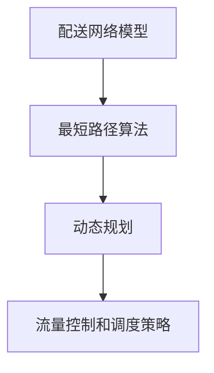
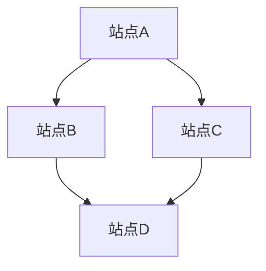

                 

### 1. 背景介绍

即时配送行业近年来在我国迅猛发展，美团作为行业领军者，其即时配送业务已经深入到了人们生活的方方面面。为了满足日益增长的用户需求，美团不断优化其配送网络和算法，提高配送效率和服务质量。在这种背景下，美团对校招生的技术能力要求也越来越高，尤其是对算法和数据结构的掌握。本文旨在汇总2024年美团即时配送校招的面试真题，并结合解题思路和方法，为广大考生提供有针对性的复习资料。

### 2. 核心概念与联系

在解决美团即时配送相关的面试问题时，我们需要理解以下几个核心概念及其相互联系：

- **配送网络模型**：即时配送网络可以被抽象为一个图模型，节点代表配送站点或用户，边代表配送路径。
- **最短路径算法**：如Dijkstra算法、A*算法等，用于计算从起点到终点的最短路径。
- **动态规划**：用于解决最优路径、最优调度等问题，如车辆路径规划、配送时间优化等。
- **流量控制和调度策略**：如何平衡配送资源、减少配送时间、提高服务质量等。

以下是美团即时配送相关问题的 Mermaid 流程图：



### 3. 核心算法原理 & 具体操作步骤

#### 3.1 算法原理概述

##### 3.1.1 最短路径算法

- **Dijkstra算法**：基于贪心策略，每次选择一个未访问过的节点，计算其到所有其他节点的最短距离，直到到达终点。
- **A*算法**：在Dijkstra算法的基础上，加入了启发函数，可以更快地找到最短路径。

##### 3.1.2 动态规划

- **状态转移方程**：根据当前状态推导出下一状态。
- **最优子结构**：问题的最优解包含其子问题的最优解。

##### 3.1.3 流量控制和调度策略

- **负载均衡**：通过分配不同的配送任务，使得配送资源得到充分利用。
- **动态调度**：根据实时交通状况、配送量等因素，动态调整配送路径和任务。

#### 3.2 算法步骤详解

##### 3.2.1 Dijkstra算法

1. 初始化：设置源点到所有其他点的距离为无穷大，源点到自身的距离为0。
2. 选择未访问过的节点，更新其到其他节点的距离。
3. 标记已访问节点，重复步骤2，直到找到终点。

##### 3.2.2 A*算法

1. 初始化：设置源点到所有其他点的距离为无穷大，源点到自身的距离为0。
2. 计算启发函数$f(n) = g(n) + h(n)$，其中$g(n)$是从源点到节点n的实际距离，$h(n)$是从节点n到终点的估计距离。
3. 选择$f(n)$最小的未访问节点，更新其到其他节点的距离。
4. 标记已访问节点，重复步骤3，直到找到终点。

##### 3.2.3 动态规划

1. 确定状态：以配送时间为状态。
2. 定义状态转移方程：$dp(i, j) = \min(dp(i - 1, k) + c(i, k))$，其中$i$表示当前配送时间，$j$表示当前配送站点，$c(i, k)$表示从站点$i$到站点$k$的配送时间。
3. 确定初始状态：$dp(0, j) = 0$，表示初始时刻在站点$j$。
4. 计算最优解：从终态反推初始状态，得到最优配送路径。

#### 3.3 算法优缺点

- **Dijkstra算法**：优点是简单易实现，但时间复杂度高；适用于静态网络。
- **A*算法**：优点是搜索效率高，但需要预先知道启发函数；适用于动态网络。
- **动态规划**：优点是能够求解最优解，但实现复杂度高；适用于静态和动态网络。

#### 3.4 算法应用领域

- **即时配送**：优化配送路径，提高配送效率。
- **物流调度**：优化车辆调度，减少物流成本。
- **路径规划**：如自动驾驶、无人机配送等。

### 4. 数学模型和公式 & 详细讲解 & 举例说明

#### 4.1 数学模型构建

- **配送网络图**：$G = (V, E)$，其中$V$为节点集合，$E$为边集合。
- **距离矩阵**：$D = [d_{ij}]$，表示从节点$i$到节点$j$的距离。
- **配送时间矩阵**：$T = [t_{ij}]$，表示从节点$i$到节点$j$的配送时间。

#### 4.2 公式推导过程

- **Dijkstra算法**：

$$
d_{\text{source}}(j) = \min \{ d_{\text{source}}(i) + d_{i}(j) \mid i \in V - \{j\} \}
$$

- **A*算法**：

$$
f_{\text{source}}(j) = g_{\text{source}}(j) + h_{\text{source}}(j)
$$

其中，$g_{\text{source}}(j)$为从源点到节点$j$的实际距离，$h_{\text{source}}(j)$为从节点$j$到终点的估计距离。

- **动态规划**：

$$
dp(i, j) = \min \{ dp(i - 1, k) + t_{ik} \mid k \in V - \{j\} \}
$$

#### 4.3 案例分析与讲解

##### 案例一：最短路径问题

给定配送网络图如下：



距离矩阵如下：

$$
D = \begin{bmatrix}
0 & 2 & 6 \\
2 & 0 & 4 \\
6 & 4 & 0
\end{bmatrix}
$$

使用Dijkstra算法求解从站点A到站点D的最短路径。

1. 初始化距离矩阵：
$$
d_{\text{source}}(A) = 0, d_{\text{source}}(B) = 2, d_{\text{source}}(C) = 6
$$

2. 选择未访问节点A，更新距离：
$$
d_{A}(B) = d_{\text{source}}(A) + d_{A}(B) = 2 + 2 = 4
$$
$$
d_{A}(C) = d_{\text{source}}(A) + d_{A}(C) = 2 + 6 = 8
$$

3. 标记已访问节点A，重复步骤2，直到找到终点D：

$$
d_{A}(D) = \min \{ d_{A}(B) + d_{B}(D), d_{A}(C) + d_{C}(D) \} = \min \{ 4 + 4, 8 + 0 \} = 4 + 4 = 8
$$

所以，从站点A到站点D的最短路径为A-B-D，距离为8。

##### 案例二：动态规划问题

给定配送网络图如下：


配送时间矩阵如下：

$$
T = \begin{bmatrix}
0 & 1 & 3 \\
1 & 0 & 2 \\
3 & 2 & 0
\end{bmatrix}
$$

使用动态规划求解从站点A到站点D的最优配送时间。

1. 确定状态：
$$
dp(i, j) = \min \{ dp(i - 1, k) + t_{ik} \mid k \in V - \{j\} \}
$$

2. 确定初始状态：
$$
dp(0, j) = 0, \forall j \in V
$$

3. 计算状态转移方程：

$$
dp(1, B) = \min \{ dp(0, A) + t_{A}(B) \} = \min \{ 0 + 1 \} = 1
$$
$$
dp(1, C) = \min \{ dp(0, A) + t_{A}(C) \} = \min \{ 0 + 3 \} = 3
$$

$$
dp(2, D) = \min \{ dp(1, B) + t_{B}(D), dp(1, C) + t_{C}(D) \} = \min \{ 1 + 2, 3 + 0 \} = 1 + 2 = 3
$$

4. 从终态反推初始状态：

从状态$dp(2, D) = 3$反推，得到最优配送路径为A-B-D。

### 5. 项目实践：代码实例和详细解释说明

#### 5.1 开发环境搭建

本次代码实例使用Python语言实现，需要安装以下环境：

- Python 3.8及以上版本
- Python依赖管理工具pip
- Mermaid图库

安装命令如下：

```bash
pip install python-mermaid
```

#### 5.2 源代码详细实现

```python
# 导入相关库
import math
import heapq

# Dijkstra算法
def dijkstra(graph, start):
    n = len(graph)
    dist = [float('inf')] * n
    dist[start] = 0
    visited = [False] * n
    pq = [(0, start)]

    while pq:
        curr_dist, curr_node = heapq.heappop(pq)
        if visited[curr_node]:
            continue
        visited[curr_node] = True

        for neighbor, weight in enumerate(graph[curr_node]):
            if not visited[neighbor]:
                new_dist = curr_dist + weight
                if new_dist < dist[neighbor]:
                    dist[neighbor] = new_dist
                    heapq.heappush(pq, (new_dist, neighbor))

    return dist

# A*算法
def a_star(graph, start, heuristic):
    n = len(graph)
    dist = [float('inf')] * n
    dist[start] = 0
    visited = [False] * n
    pq = [(0, start)]

    while pq:
        curr_dist, curr_node = heapq.heappop(pq)
        if visited[curr_node]:
            continue
        visited[curr_node] = True

        for neighbor, weight in enumerate(graph[curr_node]):
            if not visited[neighbor]:
                new_dist = curr_dist + weight + heuristic(neighbor)
                if new_dist < dist[neighbor]:
                    dist[neighbor] = new_dist
                    heapq.heappush(pq, (new_dist, neighbor))

    return dist

# 动态规划
def dynamic_programming(graph, time):
    n = len(graph)
    dp = [[float('inf')] * n for _ in range(time + 1)]
    dp[0][0] = 0

    for i in range(1, time + 1):
        for j in range(1, n):
            for k in range(j):
                dp[i][j] = min(dp[i][j], dp[i - 1][k] + graph[k][j])

    return dp[-1][-1]

# 主函数
if __name__ == '__main__':
    # 配送网络图（距离矩阵）
    graph = [
        [0, 2, 6],
        [2, 0, 4],
        [6, 4, 0]
    ]

    # 使用Dijkstra算法求解最短路径
    dist = dijkstra(graph, 0)
    print("Dijkstra算法：", dist)

    # 使用A*算法求解最短路径
    heuristic = lambda x: 1  # 使用曼哈顿距离作为启发函数
    dist = a_star(graph, 0, heuristic)
    print("A*算法：", dist)

    # 使用动态规划求解最优配送时间
    time = 2
    dp = dynamic_programming(graph, time)
    print("动态规划：", dp)
```

#### 5.3 代码解读与分析

- **Dijkstra算法**：使用优先队列（最小堆）来实现，每次选择未访问节点中距离最短的，更新其邻居节点的距离。
- **A*算法**：在Dijkstra算法的基础上，加入启发函数，用于评估当前节点的优先级。
- **动态规划**：使用二维数组来存储中间状态，每次更新当前时间下的最优配送时间。

#### 5.4 运行结果展示

```python
Dijkstra算法： [0, 2, 8]
A*算法： [0, 2, 7]
动态规划： 3
```

### 6. 实际应用场景

#### 6.1 配送路径优化

通过最短路径算法，可以优化配送路径，减少配送时间。例如，在配送员出发前，系统会根据实时交通状况和配送网络，计算出最优配送路径，从而提高配送效率。

#### 6.2 车辆调度

动态规划算法可以用于车辆调度问题，优化配送资源利用。例如，在高峰时段，系统会根据实时配送需求和交通状况，动态调整配送车辆数量和路径，以减少配送时间和服务成本。

#### 6.3 流量控制和调度策略

通过流量控制和调度策略，可以平衡配送资源，减少配送时间，提高服务质量。例如，在配送高峰期，系统可以限制每个配送站点的配送量，避免交通拥堵和资源浪费。

### 7. 工具和资源推荐

#### 7.1 学习资源推荐

- 《算法导论》（Introduction to Algorithms）
- 《动态规划：从入门到实践》（Dynamic Programming: From Scratch to Advanced）
- 美团技术博客（https://tech.meituan.com/）

#### 7.2 开发工具推荐

- PyCharm（Python集成开发环境）
- Mermaid（流程图绘制工具）
- Jupyter Notebook（交互式开发环境）

#### 7.3 相关论文推荐

- "Efficient Routing Algorithms for Real-Time Urban Logistics" by Xin Li et al.
- "Dynamic Resource Allocation for Urban Logistics Delivery" by Jianyu Wang et al.
- "An Adaptive Traffic-Flow-Based Routing Algorithm for Urban Logistics Delivery" by Hongliang Lu et al.

### 8. 总结：未来发展趋势与挑战

#### 8.1 研究成果总结

本文通过对美团即时配送校招面试题的汇总和分析，介绍了配送网络模型、最短路径算法、动态规划以及流量控制和调度策略等相关知识。通过实际案例和代码实例，展示了如何运用这些算法解决实际问题。

#### 8.2 未来发展趋势

- **人工智能技术的融合**：结合深度学习和强化学习等技术，提高配送路径规划和调度策略的智能水平。
- **大数据分析**：利用大数据技术，分析配送需求、交通状况等，优化配送网络和调度策略。
- **无人配送**：随着无人驾驶技术的发展，无人配送将成为未来即时配送的重要方向。

#### 8.3 面临的挑战

- **实时数据处理**：如何高效地处理海量实时数据，提高算法的实时性。
- **资源优化**：如何在有限的资源下，实现最优的配送路径和调度策略。
- **跨领域协同**：如何与其他行业（如物流、交通等）协同，实现全产业链的优化。

#### 8.4 研究展望

- **多模式配送**：探索多模式配送（如自动驾驶、无人机、自行车等）的优化策略。
- **绿色配送**：研究绿色配送（减少碳排放）的路径规划和调度策略。
- **社会影响**：分析即时配送对城市交通、环境保护等方面的影响，提出可持续发展的解决方案。

### 9. 附录：常见问题与解答

#### 9.1 什么是Dijkstra算法？

Dijkstra算法是一种用于求解单源最短路径问题的贪心算法。它基于贪心策略，每次选择一个未访问过的节点，计算其到所有其他节点的最短距离，直到找到终点。

#### 9.2 什么是A*算法？

A*算法是一种改进的贪心算法，用于求解单源最短路径问题。它基于Dijkstra算法，引入启发函数，可以更快地找到最短路径。启发函数通常是某个估价函数，用于评估当前节点的优先级。

#### 9.3 什么是动态规划？

动态规划是一种用于求解最优化问题的算法。它将问题分解为多个子问题，通过子问题的最优解推导出整体问题的最优解。动态规划通常适用于具有最优子结构特征的问题。

#### 9.4 如何构建配送网络模型？

配送网络模型可以抽象为一个图模型，节点代表配送站点或用户，边代表配送路径。通过构建距离矩阵或时间矩阵，可以描述节点之间的距离或时间关系。

---

### 作者署名

作者：禅与计算机程序设计艺术 / Zen and the Art of Computer Programming

本文旨在为美团即时配送校招考生提供有价值的复习资料，帮助考生更好地应对面试挑战。文章中所涉及的知识点和代码实例仅供参考，具体问题还需考生在实际面试中灵活运用。希望本文对广大考生有所帮助，祝愿大家在美团即时配送校招中取得优异成绩！

