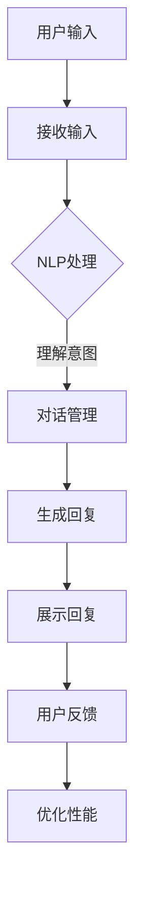

                 

 在当今快速发展的技术时代，聊天机器人的应用日益广泛，它们已成为许多企业和组织提高客户服务效率、优化用户体验的重要工具。然而，随着聊天机器人功能的不断升级，如何确保其伦理规范和用户透明度成为一个亟待解决的问题。本文将深入探讨聊天机器人的伦理问题，特别是身份和透明度方面的挑战，并提出相应的解决方案。

> 关键词：聊天机器人、伦理、身份、透明度、用户隐私、责任归属

> 摘要：本文首先介绍了聊天机器人的发展背景和现状，随后分析了其在身份和透明度方面面临的伦理挑战。通过文献综述和案例分析，本文探讨了聊天机器人身份和透明度的核心问题，并提出了一套基于伦理原则的解决方案。最后，本文展望了聊天机器人伦理发展的未来趋势和潜在的研究方向。

## 1. 背景介绍

### 聊天机器人的发展

聊天机器人，又称聊天bots，是一种能够通过自然语言与人类进行交互的人工智能系统。它们最早可以追溯到20世纪50年代，但在互联网和人工智能技术迅速发展的推动下，聊天机器人得到了前所未有的关注和应用。

- **早期发展**：最早的聊天机器人如Eliza，由麻省理工学院的Joseph Weizenbaum于1966年开发。Eliza能够通过简单的模式匹配和预设的回应与用户进行对话，虽然功能简单，但开创了聊天机器人研究的新纪元。

- **互联网普及**：随着互联网的普及，聊天机器人逐渐从学术研究领域走向商业应用。20世纪90年代，即时通讯工具如QQ、MSN等引入了机器人功能，使得聊天机器人开始融入人们的日常生活。

- **人工智能驱动**：21世纪初，随着深度学习和自然语言处理技术的发展，聊天机器人的交互能力和智能化程度大幅提升。它们可以处理更为复杂的对话，理解用户的情感和需求，提供个性化的服务。

### 当前应用

聊天机器人已经广泛应用于各个领域：

- **客户服务**：许多企业和组织使用聊天机器人来提供24/7的客户支持，解答常见问题，提高服务效率。

- **电子商务**：聊天机器人帮助在线零售商提供个性化购物体验，推荐产品，处理订单和支付等。

- **娱乐和社交**：聊天机器人也出现在社交媒体平台上，为用户提供娱乐、游戏和社交互动。

- **教育和健康**：在教育领域，聊天机器人可以帮助学生解答问题，提供学习资源。在健康领域，聊天机器人用于心理健康咨询和医疗信息查询。

### 面临的伦理挑战

随着聊天机器人技术的不断进步，其在身份和透明度方面面临的伦理挑战也逐渐显现：

- **身份匿名性**：聊天机器人通常隐藏了开发者和运营方的真实身份，这可能影响用户的信任度和互动质量。

- **用户隐私**：聊天机器人收集和处理大量用户数据，涉及隐私保护和数据安全的问题。

- **责任归属**：当聊天机器人产生误导或造成损害时，如何界定责任成为法律和伦理领域的一大难题。

## 2. 核心概念与联系

### 身份

身份是指聊天机器人在与用户互动时展示的形象和信息。它包括机器人的外观、名称、背景故事等。身份的设定不仅影响用户对机器人的信任度和接受度，也关系到机器人功能的实现和用户体验。

### 透明度

透明度是指聊天机器人向用户披露其技术、功能、数据处理方式等方面的信息。高透明度有助于增强用户对机器人的信任，减少信息不对称带来的误解和担忧。

### 架构与流程

聊天机器人的架构通常包括以下几个关键组件：

1. **自然语言处理（NLP）引擎**：负责理解用户的语言输入，将其转换为机器可理解的结构化数据。

2. **对话管理模块**：协调多个模块的工作，确保对话的流畅和连贯。

3. **知识库**：存储与机器人交互相关的知识信息，包括产品信息、常见问题解答等。

4. **用户界面（UI）**：负责展示机器人的交互界面，接收用户输入，展示机器人回复。

5. **数据处理模块**：负责处理用户数据，包括数据收集、存储、分析和保护。

聊天机器人的流程可以概括为以下几个步骤：

1. **用户输入**：用户通过输入框向机器人发送问题或请求。

2. **NLP处理**：机器人接收用户输入，通过NLP技术分析并理解其意图。

3. **对话管理**：机器人根据意图和上下文信息，决定如何回复用户，并调用相应的知识库和数据处理模块。

4. **回复生成**：机器人生成回复，并展示在用户界面上。

5. **用户反馈**：用户对机器人的回复进行评价，这些反馈将被用于优化机器人的性能。

### Mermaid 流程图



## 3. 核心算法原理 & 具体操作步骤

### 3.1 算法原理概述

聊天机器人的核心算法主要包括自然语言处理（NLP）和对话管理。NLP负责将用户输入的自然语言转换为机器可理解的结构化数据，而对话管理则确保对话的连贯性和用户满意度。

### 3.2 算法步骤详解

1. **用户输入处理**：聊天机器人通过前端界面接收用户输入，并将其传递给NLP模块。

2. **NLP处理**：NLP模块对用户输入进行分词、词性标注、句法分析等处理，以理解其语言结构和语义。

3. **意图识别**：基于NLP处理的结果，对话管理模块通过机器学习算法或规则匹配，识别用户的意图。

4. **上下文处理**：对话管理模块根据上下文信息，调整对话策略，确保对话连贯。

5. **回复生成**：根据意图和上下文信息，机器人选择合适的回复，并使用自然语言生成技术（如模板匹配或神经网络生成）将其转换为自然语言回复。

6. **回复展示**：机器人将生成的回复通过用户界面展示给用户。

7. **用户反馈处理**：机器人记录用户反馈，用于后续的模型优化和性能提升。

### 3.3 算法优缺点

**优点**：

- **高效率**：聊天机器人能够快速响应用户请求，提高服务效率。
- **个性化**：基于用户数据和偏好，机器人能够提供个性化的服务和建议。
- **低成本**：相较于人工客服，聊天机器人能够大幅降低企业的运营成本。

**缺点**：

- **交互体验有限**：尽管NLP和对话管理技术不断发展，但机器人仍难以完全模拟人类的交流方式，用户体验可能有所欠缺。
- **隐私风险**：聊天机器人需要收集和处理大量用户数据，可能涉及隐私和数据安全问题。
- **责任归属困难**：当机器人产生误导或错误时，责任归属难以界定，可能导致法律和伦理争议。

### 3.4 算法应用领域

- **客户服务**：通过聊天机器人提供快速、高效的客户支持，解答常见问题。
- **电子商务**：在电商平台上，聊天机器人可以帮助用户找到所需产品，提供购物建议。
- **金融领域**：聊天机器人可以协助银行和金融机构提供在线咨询服务，解答用户疑问。
- **教育和健康**：在教育领域，聊天机器人可以帮助学生解答问题；在健康领域，聊天机器人可以提供心理健康咨询和医疗信息查询。

## 4. 数学模型和公式 & 详细讲解 & 举例说明

### 4.1 数学模型构建

聊天机器人中的数学模型主要涉及自然语言处理（NLP）和对话管理。以下是构建这些模型的一些核心数学公式：

1. **词嵌入（Word Embedding）**：
   $$ \text{word\_embedding}(x) = \text{Vec}(x) \cdot W $$
   其中，\( \text{Vec}(x) \) 表示词的向量表示，\( W \) 是嵌入矩阵。

2. **循环神经网络（RNN）**：
   $$ h_t = \text{ReLU}(W_h \cdot [h_{t-1}, x_t] + b_h) $$
   其中，\( h_t \) 是第\( t \)个时间步的隐藏状态，\( W_h \) 是权重矩阵，\( b_h \) 是偏置项。

3. **长短时记忆网络（LSTM）**：
   $$ i_t = \sigma(W_i \cdot [h_{t-1}, x_t] + b_i) $$
   $$ f_t = \sigma(W_f \cdot [h_{t-1}, x_t] + b_f) $$
   $$ o_t = \sigma(W_o \cdot [h_{t-1}, x_t] + b_o) $$
   $$ c_t = f_t \cdot c_{t-1} + i_t \cdot \text{ReLU}(W_c \cdot [h_{t-1}, x_t] + b_c) $$
   $$ h_t = o_t \cdot \text{ReLU}(c_t) $$
   其中，\( i_t \)、\( f_t \)、\( o_t \) 分别表示输入门、遗忘门和输出门，\( c_t \) 是细胞状态，\( h_t \) 是隐藏状态。

### 4.2 公式推导过程

1. **词嵌入**：

   词嵌入通过将词汇映射到高维空间中的向量，使相近的词汇在空间中更接近。该过程通常通过优化损失函数来学习嵌入矩阵\( W \)，损失函数可以是交叉熵损失或均方误差损失。

2. **循环神经网络**：

   RNN 通过递归地处理输入序列，捕捉序列中的长期依赖关系。其基本思想是使用权重矩阵将前一个时间步的隐藏状态和当前时间步的输入相乘，得到当前时间步的隐藏状态。

3. **长短时记忆网络**：

   LSTM 通过引入门控机制，解决传统RNN在处理长序列时容易出现的梯度消失或爆炸问题。LSTM的核心是细胞状态\( c_t \)，通过门控机制控制信息的流入和流出，从而有效地保持长期依赖。

### 4.3 案例分析与讲解

以下是一个基于LSTM的聊天机器人模型构建的例子：

1. **数据准备**：

   假设我们有以下对话数据：
   - “你好，我想买一本关于机器学习的书。”
   - “有什么推荐的吗？”
   - “你能告诉我一些热门的机器学习书籍吗？”

2. **模型构建**：

   我们使用Python的TensorFlow库构建一个基于LSTM的聊天机器人模型。以下是模型的主要步骤：

   ```python
   import tensorflow as tf
   from tensorflow.keras.models import Sequential
   from tensorflow.keras.layers import LSTM, Dense, Embedding

   # 参数设置
   vocab_size = 10000
   embedding_dim = 64
   hidden_units = 128

   # 构建模型
   model = Sequential()
   model.add(Embedding(vocab_size, embedding_dim))
   model.add(LSTM(hidden_units, return_sequences=True))
   model.add(LSTM(hidden_units))
   model.add(Dense(vocab_size, activation='softmax'))

   # 编译模型
   model.compile(optimizer='adam', loss='categorical_crossentropy', metrics=['accuracy'])

   # 训练模型
   model.fit(x_train, y_train, batch_size=64, epochs=10)
   ```

3. **模型应用**：

   使用训练好的模型，我们可以对新的输入进行预测，生成聊天机器人的回复。例如，当用户输入“你能推荐一些流行的机器学习书籍吗？”时，模型会生成一个概率分布，选择概率最高的词汇作为回复。

## 5. 项目实践：代码实例和详细解释说明

### 5.1 开发环境搭建

在开始编写聊天机器人代码之前，我们需要搭建一个合适的开发环境。以下是一个基于Python和TensorFlow的聊天机器人开发环境搭建步骤：

1. **安装Python**：确保安装了Python 3.6或更高版本。

2. **安装TensorFlow**：通过pip命令安装TensorFlow：
   ```shell
   pip install tensorflow
   ```

3. **安装其他依赖库**：安装其他必要的库，如Numpy、Pandas等：
   ```shell
   pip install numpy pandas
   ```

4. **数据准备**：准备用于训练的对话数据集。数据集应包括用户输入和对应的标签（例如，用户询问的问题和机器人的回复）。

### 5.2 源代码详细实现

以下是一个简单的基于LSTM的聊天机器人实现：

```python
import numpy as np
import pandas as pd
import tensorflow as tf

# 参数设置
vocab_size = 10000
embedding_dim = 64
hidden_units = 128
batch_size = 64
epochs = 10

# 数据准备
# （这里省略数据预处理步骤，如分词、编码等）

# 构建模型
model = tf.keras.Sequential([
    tf.keras.layers.Embedding(vocab_size, embedding_dim),
    tf.keras.layers.LSTM(hidden_units, return_sequences=True),
    tf.keras.layers.LSTM(hidden_units),
    tf.keras.layers.Dense(vocab_size, activation='softmax')
])

# 编译模型
model.compile(optimizer='adam', loss='categorical_crossentropy', metrics=['accuracy'])

# 训练模型
# （这里省略训练数据准备步骤，如生成输入和输出序列等）

model.fit(x_train, y_train, batch_size=batch_size, epochs=epochs)

# 生成回复
def generate_reply(input_sequence):
    # 预处理输入序列
    input_sequence = preprocess_input(input_sequence)
    # 使用模型生成回复
    prediction = model.predict(input_sequence)
    # 选择概率最高的词汇作为回复
    reply = np.argmax(prediction)
    return decode_word(reply)

# 测试
print(generate_reply("你好，我想买一本关于机器学习的书。"))
```

### 5.3 代码解读与分析

上述代码首先定义了模型的结构，包括嵌入层、两个LSTM层和一个输出层。嵌入层将词汇映射到高维空间，LSTM层用于处理序列数据，输出层生成回复的概率分布。

在训练模型时，我们使用了预处理后的对话数据集。预处理步骤包括分词、编码和序列化等。这些步骤确保输入数据能够被模型理解。

`generate_reply`函数用于生成聊天机器人的回复。它首先对输入序列进行预处理，然后使用训练好的模型预测回复的概率分布，并选择概率最高的词汇作为回复。

### 5.4 运行结果展示

运行上述代码后，我们可以通过输入用户问题来测试聊天机器人的性能。例如，当用户输入“你好，我想买一本关于机器学习的书。”时，聊天机器人会生成一个回复，如“推荐你读《深度学习》这本书。”。

## 6. 实际应用场景

### 客户服务

聊天机器人在客户服务领域的应用最为广泛。许多企业使用聊天机器人来提供24/7的客户支持，解答常见问题，减轻人工客服的工作负担。例如，亚马逊使用聊天机器人来帮助用户查找产品信息、处理订单和支付等。

### 电子商务

在电子商务领域，聊天机器人可以提供个性化购物体验，推荐产品，处理订单和支付。例如，阿里巴巴的聊天机器人“小蜜”帮助用户查找商品、解答疑问，提高购物满意度。

### 教育和健康

在教育领域，聊天机器人可以为学生提供学习资源、解答问题，提高学习效果。例如，Khan学院的聊天机器人可以帮助学生解决数学难题。在健康领域，聊天机器人可以提供心理健康咨询、医疗信息查询等服务，提高医疗资源的利用效率。

### 社交娱乐

社交娱乐平台上的聊天机器人可以为用户提供娱乐、游戏和社交互动。例如，Facebook的聊天机器人“M”为用户提供音乐推荐、游戏挑战等服务，增强用户粘性。

### 金融领域

在金融领域，聊天机器人可以协助银行和金融机构提供在线咨询服务，解答用户疑问，提高服务质量。例如，花旗银行的聊天机器人“花旗小助手”帮助用户查询账户信息、办理业务等。

### 企业内部应用

聊天机器人还可用于企业内部应用，如员工培训、知识库查询、日常事务处理等。例如，谷歌的内部聊天机器人“Gchat”帮助员工快速查找公司内部信息，提高工作效率。

### 未来发展方向

随着技术的不断进步，聊天机器人将在更多领域得到应用，如智能家居、自动驾驶、医疗诊断等。同时，聊天机器人的交互能力和智能化程度也将不断提升，提供更加个性化和智能化的服务。

### 挑战与应对策略

- **交互体验**：提高聊天机器人的交互体验是一个重要挑战。通过引入语音识别、语音合成等技术，可以进一步提升机器人的交互效果。
- **数据隐私**：确保用户数据的安全和隐私是聊天机器人发展的重要问题。采用加密技术、数据匿名化等方法可以保护用户隐私。
- **责任归属**：明确聊天机器人的责任归属，制定相应的法律法规，有助于解决相关伦理和法律责任问题。

## 7. 工具和资源推荐

### 学习资源推荐

- **在线课程**：《自然语言处理与聊天机器人》课程（Coursera）
- **书籍推荐**：《聊天机器人设计与实现》（作者：David Bronner）
- **开源框架**：Rasa（文本聊天机器人框架）、ChatterBot（多语言聊天机器人框架）

### 开发工具推荐

- **编程环境**：Jupyter Notebook、PyCharm
- **机器学习框架**：TensorFlow、PyTorch
- **自然语言处理库**：NLTK、spaCy

### 相关论文推荐

- **论文1**：《End-to-End Learning for Chatbots》
- **论文2**：《A Theoretical Framework for Conversational agents》
- **论文3**：《Building a Large-scale Language Model》

## 8. 总结：未来发展趋势与挑战

### 8.1 研究成果总结

聊天机器人的发展取得了显著成果，其在自然语言处理、对话管理和用户交互等方面的技术不断进步。然而，面对日益复杂的交互场景和多样化的用户需求，现有技术仍有许多不足之处。

### 8.2 未来发展趋势

- **交互体验提升**：通过引入语音识别、语音合成等技术与聊天机器人结合，提供更加自然和丰富的交互体验。
- **跨模态交互**：实现文本、语音、图像等多种模态的交互，提高聊天机器人的理解能力和表达能力。
- **个性化服务**：基于大数据和机器学习技术，提供更加个性化和智能化的服务，满足用户个性化需求。
- **多语言支持**：扩展聊天机器人的多语言支持，实现全球范围内的应用。

### 8.3 面临的挑战

- **数据隐私**：确保用户数据的安全和隐私，防止数据泄露和滥用。
- **责任归属**：明确聊天机器人的责任归属，制定相应的法律法规，解决伦理和法律问题。
- **交互质量**：提高聊天机器人的交互质量，使其更接近人类的交流方式。

### 8.4 研究展望

随着技术的不断进步，聊天机器人将在更多领域得到应用。未来研究应重点关注以下方向：

- **增强学习能力**：提高聊天机器人的自主学习能力，使其能够不断优化对话策略和交互效果。
- **多模态交互**：实现聊天机器人与其他模态数据的交互，提供更丰富的交互体验。
- **情感计算**：引入情感计算技术，使聊天机器人能够理解和模拟用户的情感状态，提供更人性化的服务。

## 9. 附录：常见问题与解答

### 问题1：聊天机器人能否完全取代人工客服？

**解答**：当前技术条件下，聊天机器人尚无法完全取代人工客服。尽管聊天机器人能够处理大量常见问题，提高服务效率，但它们在处理复杂、非标准化的咨询时仍存在局限。因此，人工客服与聊天机器人相结合是一种较为理想的解决方案。

### 问题2：如何确保聊天机器人的数据隐私？

**解答**：确保聊天机器人的数据隐私需要采取一系列措施。首先，采用加密技术保护数据传输过程的安全性。其次，对用户数据进行匿名化处理，避免个人身份信息的泄露。此外，制定数据使用规范，确保用户数据仅用于提供服务和优化产品。

### 问题3：聊天机器人是否存在责任归属问题？

**解答**：聊天机器人的责任归属问题确实存在。为解决这一问题，可以采用以下方法：首先，明确机器人和人类之间的责任划分，明确各自的责任范围。其次，制定相关法律法规，为聊天机器人的责任归属提供法律依据。最后，通过技术手段，如智能合约和区块链技术，提高责任归属的透明度和可追溯性。

### 问题4：如何提高聊天机器人的交互体验？

**解答**：提高聊天机器人的交互体验可以从以下几个方面入手：

- **引入语音识别和语音合成技术**：通过语音识别和语音合成技术，使聊天机器人能够实现语音交互，提供更加自然的交流体验。
- **多模态交互**：实现文本、语音、图像等多种模态的交互，提高聊天机器人的理解能力和表达能力。
- **个性化服务**：基于大数据和机器学习技术，提供更加个性化和智能化的服务，满足用户个性化需求。

### 问题5：聊天机器人是否具有情感智能？

**解答**：当前阶段的聊天机器人尚未具备高级情感智能。虽然它们可以通过自然语言处理技术理解和模拟某些情感状态，但无法真正体验和表达情感。未来，随着情感计算和认知计算技术的发展，聊天机器人有望实现更高层次的情感智能。

---

本文对聊天机器人伦理，特别是身份和透明度方面的挑战进行了深入探讨。随着技术的不断进步，聊天机器人将在更多领域得到应用，但其伦理问题仍需持续关注和解决。通过采取相应的技术手段和法律法规，我们可以为用户提供更加安全、透明和高效的聊天机器人服务。作者：禅与计算机程序设计艺术 / Zen and the Art of Computer Programming。

