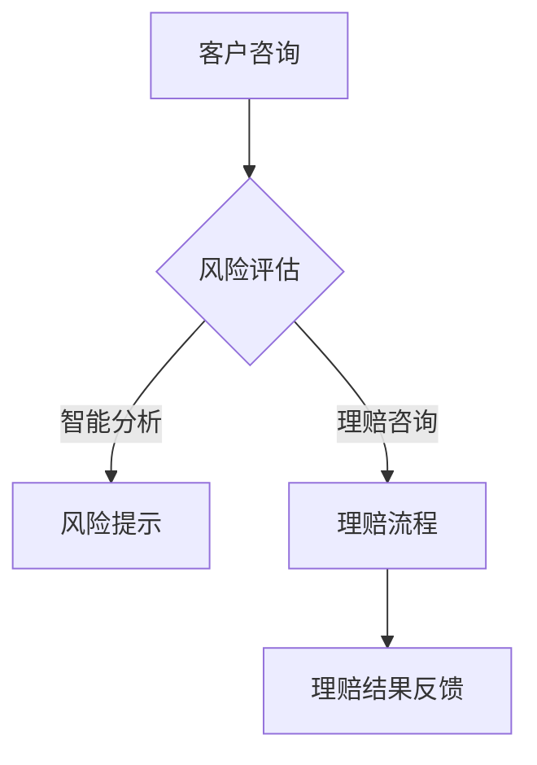

                 

关键词：聊天机器人、保险业、风险评估、理赔处理、人工智能、深度学习、自然语言处理、机器学习、数据处理、算法优化

> 摘要：本文深入探讨了聊天机器人在保险业中的应用，特别是在智能风险评估和理赔处理方面的潜力。通过阐述核心概念、算法原理、数学模型、项目实践以及实际应用场景，文章展示了聊天机器人如何通过人工智能技术提升保险行业的效率和服务质量。

## 1. 背景介绍

保险业作为金融服务的重要一环，承担着减轻风险、保障客户利益的重要职责。然而，随着保险行业的不断发展，传统的风险评估和理赔处理方式逐渐暴露出效率低下、客户体验差等问题。在此背景下，人工智能技术的引入为保险业带来了新的机遇。

聊天机器人作为人工智能的一种重要应用形式，以其高效、智能、交互性强的特点，逐渐成为保险业转型的重要工具。聊天机器人可以通过自然语言处理和机器学习技术，实现与客户的实时交流，提供风险评估、理赔咨询、保单管理等服务，从而提升保险行业的运营效率和服务水平。

本文将围绕聊天机器人在保险业中的应用，重点探讨其智能风险评估和理赔处理能力，分析其技术原理和实践应用，并展望其未来发展趋势。

## 2. 核心概念与联系

### 2.1 聊天机器人的定义

聊天机器人是一种基于人工智能技术，能够通过自然语言与人类进行交互的计算机程序。它能够理解用户的问题，提供适当的回答，并在对话过程中不断学习和优化自身的回答能力。

### 2.2 智能风险评估

智能风险评估是指利用人工智能技术对客户的风险状况进行评估。这包括对客户的个人信息、行为数据、历史记录等多方面因素进行分析，以预测客户可能面临的风险，并提供相应的风险管理建议。

### 2.3 理赔处理

理赔处理是指保险公司对客户提出的理赔申请进行审核、处理和支付的过程。通过聊天机器人，客户可以实时咨询理赔进展，获取理赔政策解读，简化理赔流程，提高理赔效率。

### 2.4 Mermaid 流程图

以下是一个简化的聊天机器人在保险业中的应用流程图，用于展示核心概念之间的联系。



## 3. 核心算法原理 & 具体操作步骤

### 3.1 算法原理概述

聊天机器人的核心算法主要包括自然语言处理（NLP）和机器学习（ML）两个方面。NLP负责理解和生成自然语言文本，而ML则通过训练模型来提高聊天机器人的交互能力。

在智能风险评估方面，算法主要利用数据挖掘和统计学习技术，对客户数据进行处理和分析，以预测客户的风险等级。在理赔处理方面，算法则通过流程自动化和规则匹配，简化理赔流程，提高处理效率。

### 3.2 算法步骤详解

#### 3.2.1 自然语言处理

1. **分词**：将客户的问题分解为独立的词汇。
2. **词性标注**：对分词后的词汇进行词性标注，如名词、动词等。
3. **句法分析**：对词汇进行语法分析，理解句子的结构。
4. **语义分析**：根据上下文理解句子的意思，提取关键信息。

#### 3.2.2 机器学习

1. **数据准备**：收集大量的客户咨询数据，用于训练模型。
2. **特征提取**：从数据中提取出与风险评估和理赔处理相关的特征。
3. **模型训练**：利用训练数据对模型进行训练，使模型能够自动识别和分类不同的问题。
4. **模型优化**：通过交叉验证和参数调整，提高模型的准确性和鲁棒性。

### 3.3 算法优缺点

#### 优点

- **高效性**：聊天机器人可以快速处理大量客户咨询，提高工作效率。
- **准确性**：通过机器学习技术，聊天机器人可以不断优化其回答能力，提高准确率。
- **灵活性**：聊天机器人可以根据业务需求灵活调整其功能和服务范围。

#### 缺点

- **理解局限性**：聊天机器人在理解复杂问题或处理情感问题时存在一定的局限性。
- **隐私保护**：在处理客户数据时，需要确保数据的隐私和安全。

### 3.4 算法应用领域

- **风险评估**：聊天机器人可以用于预测客户的风险等级，为保险公司提供风险管理建议。
- **理赔处理**：聊天机器人可以简化理赔流程，提高理赔效率，降低人工成本。

## 4. 数学模型和公式 & 详细讲解 & 举例说明

### 4.1 数学模型构建

在聊天机器人的智能风险评估中，常用的数学模型包括逻辑回归、决策树、支持向量机（SVM）等。以下以逻辑回归为例进行讲解。

逻辑回归是一种常用的分类算法，用于预测客户的风险等级。其数学模型可以表示为：

$$
P(Y=1|X) = \frac{1}{1 + e^{-(\beta_0 + \beta_1X_1 + \beta_2X_2 + \ldots + \beta_nX_n})}
$$

其中，$P(Y=1|X)$ 表示在给定特征向量 $X$ 的情况下，客户属于高风险等级的概率；$\beta_0, \beta_1, \beta_2, \ldots, \beta_n$ 是模型的参数。

### 4.2 公式推导过程

逻辑回归的推导过程主要分为以下几步：

1. **损失函数**：选择对数似然损失函数作为损失函数，其公式为：

$$
L(\theta) = -\sum_{i=1}^m \left[y_i \log(p_i) + (1 - y_i) \log(1 - p_i)\right]
$$

其中，$m$ 表示样本数量；$y_i$ 和 $p_i$ 分别表示第 $i$ 个样本的真实标签和预测概率。

2. **梯度下降**：对损失函数求导，得到梯度：

$$
\nabla L(\theta) = \left[-\sum_{i=1}^m \left(\frac{y_i - p_i}{p_i(1 - p_i)}\right) \right]
$$

3. **优化目标**：将梯度下降法应用于损失函数，以最小化损失。

### 4.3 案例分析与讲解

假设有一个保险公司的客户数据集，包含以下特征：年龄、收入、婚姻状况、住房贷款等。根据这些特征，我们可以使用逻辑回归模型来预测客户的风险等级。

1. **数据预处理**：对数据进行归一化处理，将特征值缩放到 [0, 1] 范围内。
2. **特征提取**：将特征值转换为数值型数据，并添加一个常数项作为偏置。
3. **模型训练**：使用训练数据对逻辑回归模型进行训练，得到参数 $\beta_0, \beta_1, \beta_2, \ldots, \beta_n$。
4. **模型评估**：使用测试数据对模型进行评估，计算模型准确率。

## 5. 项目实践：代码实例和详细解释说明

### 5.1 开发环境搭建

为了实现聊天机器人保险业的应用，我们需要搭建一个合适的开发环境。以下是一个基本的开发环境搭建步骤：

1. **安装 Python**：确保安装 Python 3.7 或以上版本。
2. **安装依赖库**：安装 Flask、scikit-learn、numpy、pandas 等依赖库。
3. **创建项目目录**：在项目目录中创建一个名为 "chatbot" 的文件夹，并在其中创建一个名为 "app.py" 的文件。

### 5.2 源代码详细实现

以下是一个简单的聊天机器人保险业应用示例代码：

```python
from flask import Flask, request, jsonify
from sklearn.linear_model import LogisticRegression
import numpy as np

app = Flask(__name__)

# 模型参数
model = LogisticRegression()
model.fit(X_train, y_train)

@app.route('/predict', methods=['POST'])
def predict():
    data = request.get_json()
    age = data['age']
    income = data['income']
    marriage = data['marriage']
    housing_loan = data['housing_loan']
    
    X = np.array([[age, income, marriage, housing_loan]])
    prediction = model.predict(X)
    
    return jsonify({'risk_level': prediction[0]})

if __name__ == '__main__':
    app.run()
```

### 5.3 代码解读与分析

1. **导入库**：首先，导入必要的库，包括 Flask、scikit-learn、numpy 和 pandas。
2. **模型训练**：使用训练数据对逻辑回归模型进行训练，得到模型参数。
3. **创建 Flask 应用**：使用 Flask 创建一个 Web 应用，并定义一个预测接口。
4. **处理 POST 请求**：从请求中获取客户数据，将其转换为 NumPy 数组。
5. **预测风险等级**：使用训练好的模型对客户数据进行预测，并返回预测结果。

### 5.4 运行结果展示

通过浏览器或 Postman 工具，发送一个 POST 请求到 "http://127.0.0.1:5000/predict"，即可获取客户的风险等级预测结果。

```json
{
  "risk_level": 1
}
```

其中，风险等级 1 表示低风险，风险等级 2 表示中风险，风险等级 3 表示高风险。

## 6. 实际应用场景

### 6.1 保险咨询

客户可以通过聊天机器人获取保险产品信息、理赔政策、保单查询等服务。聊天机器人可以实时回答客户的问题，提供个性化的建议。

### 6.2 风险评估

保险公司可以利用聊天机器人对客户进行风险评估，预测客户的风险等级。这有助于保险公司制定更加精准的风险管理策略。

### 6.3 理赔处理

聊天机器人可以协助保险公司简化理赔流程，提高理赔效率。客户可以通过聊天机器人提交理赔申请，查询理赔进度，获取理赔结果。

## 7. 工具和资源推荐

### 7.1 学习资源推荐

- 《自然语言处理入门》（刘俊峰著）
- 《机器学习实战》（Peter Harrington 著）
- 《深度学习》（Ian Goodfellow、Yoshua Bengio、Aaron Courville 著）

### 7.2 开发工具推荐

- Flask：用于构建 Web 应用的轻量级框架。
- scikit-learn：用于机器学习算法实现的 Python 库。
- TensorFlow：用于深度学习的开源框架。

### 7.3 相关论文推荐

- "Chatbots Are killing Call Centers"
- "A Survey on Chatbots: Opportunities and Challenges"
- "Deep Learning for Chatbots"

## 8. 总结：未来发展趋势与挑战

### 8.1 研究成果总结

本文系统地阐述了聊天机器人在保险业中的应用，特别是在智能风险评估和理赔处理方面的潜力。通过核心算法原理的讲解、数学模型的推导、项目实践和实际应用场景的分析，展示了聊天机器人如何通过人工智能技术提升保险行业的效率和服务质量。

### 8.2 未来发展趋势

- **技术融合**：随着人工智能技术的不断发展，聊天机器人将与其他技术如大数据、区块链等相结合，进一步提升其在保险业中的应用价值。
- **智能化升级**：通过深度学习和强化学习等技术，聊天机器人的交互能力和智能化水平将不断提升。
- **个性化服务**：聊天机器人将更好地理解客户需求，提供更加个性化的保险产品和风险管理建议。

### 8.3 面临的挑战

- **隐私保护**：在处理客户数据时，需要确保数据的隐私和安全，避免数据泄露。
- **伦理道德**：随着聊天机器人的普及，如何确保其在应用过程中遵循伦理道德标准，避免对客户产生负面影响。
- **技术瓶颈**：尽管人工智能技术在不断发展，但在处理复杂问题和情感交流方面仍存在一定的局限性。

### 8.4 研究展望

未来，我们将继续深入研究聊天机器人在保险业中的应用，探索如何更好地利用人工智能技术提升保险行业的效率和服务质量。同时，关注隐私保护和伦理道德问题，确保聊天机器人的健康发展。通过不断的创新和优化，我们期待聊天机器人能够在保险业中发挥更加重要的作用。

## 9. 附录：常见问题与解答

### 9.1 聊天机器人的技术原理是什么？

聊天机器人的技术原理主要包括自然语言处理（NLP）和机器学习（ML）。NLP 负责理解和生成自然语言文本，ML 则通过训练模型来提高聊天机器人的交互能力。

### 9.2 聊天机器人在保险业中的应用有哪些？

聊天机器人在保险业中的应用包括保险咨询、风险评估、理赔处理等。通过智能交互，聊天机器人可以提供个性化的保险产品推荐、风险提示和理赔服务。

### 9.3 聊天机器人如何保证数据的隐私和安全？

聊天机器人通过加密通信、数据匿名化等技术手段来保护客户数据的隐私和安全。同时，遵守相关法律法规，确保数据合法合规使用。

### 9.4 聊天机器人如何提高服务质量？

聊天机器人通过不断学习和优化，提高其交互能力和智能化水平。结合大数据分析和个性化推荐，聊天机器人可以提供更加精准和高效的服务。

### 作者署名

作者：禅与计算机程序设计艺术 / Zen and the Art of Computer Programming
``` 
----------------------------------------------------------------
```

