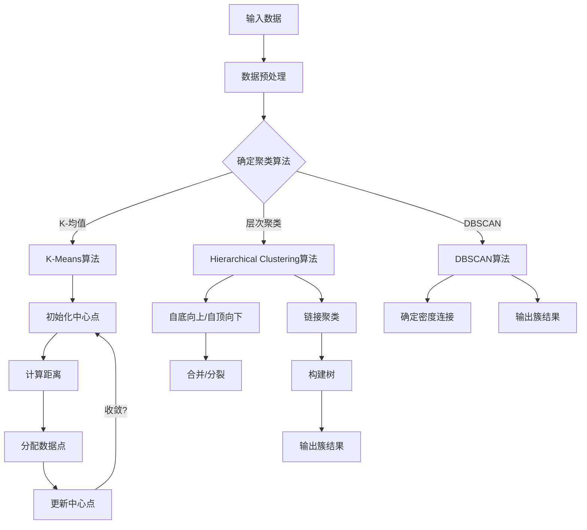

                 

关键词：聚类，数据挖掘，算法，分类，数据分析，代码实例

> 摘要：本文将深入探讨聚类算法的基本原理、多种实现方法、以及在实际应用中的实例分析。通过详细阐述数学模型和公式，并结合实际代码实例，帮助读者更好地理解聚类算法，为数据分析和机器学习打下坚实的基础。

## 1. 背景介绍

聚类（Clustering）是数据挖掘和机器学习领域中的一种重要方法，旨在将数据点分为多个组（簇），使得同组数据点之间的相似度较高，而不同组之间的相似度较低。聚类算法在模式识别、图像处理、文本挖掘、社交网络分析等领域有着广泛的应用。

聚类算法通常可以分为以下几类：

1. **基于距离的聚类**：使用数据点之间的距离作为相似性度量。
2. **基于密度的聚类**：根据数据点在空间中的分布密度来形成簇。
3. **基于层次的聚类**：通过自底向上或自顶向下的层次划分来实现聚类。
4. **基于模型的聚类**：假设数据由特定的概率模型生成，通过模型参数的优化来找到数据簇。

本文将重点介绍基于距离的聚类算法，包括K-均值（K-Means）、层次聚类（Hierarchical Clustering）和DBSCAN（Density-Based Spatial Clustering of Applications with Noise）。

## 2. 核心概念与联系

聚类算法的核心在于如何定义簇，以及如何确定簇的数量。为了便于理解，我们首先需要了解以下概念：

### 2.1 数据点与簇

- **数据点**：在聚类问题中，每个数据点通常表示为多维空间中的一个点。
- **簇**：一组数据点，它们在某种相似性度量下具有较高相似度。

### 2.2 相似性度量

- **欧几里得距离**：用于衡量两点在多维空间中的距离。
- **曼哈顿距离**：用于衡量两点在多维空间中的绝对差值的总和。
- **切比雪夫距离**：用于衡量两点在多维空间中最大差值的绝对值。

### 2.3 簇的相似性度量

- **内距**：簇内部数据点之间的相似性度量，越小表示簇内部越紧密。
- **外距**：簇间数据点之间的相似性度量，越小表示簇间差异越大。

### 2.4 簇的数目

- **预先指定簇数**：如K-均值算法。
- **自动确定簇数**：如DBSCAN算法。

### 2.5 Mermaid 流程图

下面是一个简单的Mermaid流程图，展示了聚类算法的核心流程：



## 3. 核心算法原理 & 具体操作步骤

### 3.1 算法原理概述

在本节中，我们将介绍三种常见的聚类算法：K-均值、层次聚类和DBSCAN。

### 3.2 算法步骤详解

#### 3.2.1 K-均值算法

K-均值算法是一种基于距离的聚类方法，其基本思想是将数据点分为K个簇，使得每个数据点到其所在簇中心点的距离最小。

1. **初始化**：随机选择K个数据点作为初始聚类中心。
2. **分配数据点**：对于每个数据点，计算其到每个聚类中心的距离，并将其分配到最近的聚类中心。
3. **更新中心点**：重新计算每个簇的中心点，作为新的聚类中心。
4. **迭代**：重复步骤2和3，直到聚类中心不再发生变化或满足停止条件。

#### 3.2.2 层次聚类算法

层次聚类算法通过自底向上或自顶向下的方法，将数据点逐步合并或分裂，以形成不同的簇。

1. **初始化**：每个数据点都是一个单独的簇。
2. **合并/分裂**：根据簇之间的相似性度量，合并相似度最高的两个簇或分裂相似度最低的簇。
3. **迭代**：重复步骤2，直到满足停止条件，如簇数目达到预定值或聚类中心不再变化。

#### 3.2.3 DBSCAN算法

DBSCAN是一种基于密度的聚类方法，其基本思想是找到空间中的密度连接点，并将它们划分为同一个簇。

1. **初始化**：设置邻域半径`eps`和最小密度`minPoints`。
2. **标记核心点**：如果一个点的邻域内包含至少`minPoints`个点，则标记为核心点。
3. **标记边界点**：如果一个点的邻域内包含`eps`内的点数在`minPoints`和`2*minPoints`之间，则标记为边界点。
4. **标记噪声点**：如果一个点的邻域内不包含足够多的点，则标记为噪声点。
5. **形成簇**：将核心点及其邻接点划分为同一个簇。

### 3.3 算法优缺点

- **K-均值算法**：简单易实现，但容易陷入局部最优解。
- **层次聚类算法**：能够自动确定簇的数目，但计算复杂度较高。
- **DBSCAN算法**：能够处理不同密度和形状的数据，但参数选择较难。

### 3.4 算法应用领域

- **图像处理**：用于图像分割、目标检测等。
- **社交网络分析**：用于用户群体划分、社区发现等。
- **市场细分**：用于消费者行为分析、市场策略制定等。

## 4. 数学模型和公式 & 详细讲解 & 举例说明

### 4.1 数学模型构建

聚类算法的核心在于如何定义簇以及如何确定簇的数量。以下是一些常见的数学模型：

- **K-均值算法**：

  - **聚类中心**：$c_j = \frac{1}{N_j} \sum_{i=1}^{N} x_i$，其中$x_i$为数据点，$N_j$为簇j中的数据点数量。
  - **相似性度量**：$d(x_i, c_j) = \sqrt{\sum_{k=1}^{n} (x_{ik} - c_{jk})^2}$，其中$n$为数据维度。

- **层次聚类算法**：

  - **簇间相似性度量**：$s(i, j) = \frac{1}{n_1 + n_2} \sum_{k=1}^{n_1} \sum_{l=1}^{n_2} d(x_{ik}, x_{jl})$，其中$n_1$和$n_2$分别为簇i和簇j的数据点数量。

- **DBSCAN算法**：

  - **邻域半径**：$eps$，用于定义邻域内的数据点。
  - **最小密度**：$minPoints$，用于定义一个点的邻域内至少包含多少个点。

### 4.2 公式推导过程

以下是K-均值算法中聚类中心点的推导过程：

- **初始聚类中心**：假设我们有K个初始聚类中心$c_1, c_2, ..., c_K$，其中$c_k = \frac{1}{N_k} \sum_{i=1}^{N} x_i$，其中$x_i$为数据点，$N_k$为簇k中的数据点数量。
- **分配数据点**：对于每个数据点$x_i$，计算其到每个聚类中心的距离$d(x_i, c_j)$，并将其分配到最近的聚类中心。
- **更新聚类中心**：计算新的聚类中心$c_j' = \frac{1}{N_j'} \sum_{i=1}^{N} x_i$，其中$N_j'$为新的簇j中的数据点数量。

### 4.3 案例分析与讲解

假设我们有如下三个数据点：

- $x_1 = [1, 1]$
- $x_2 = [5, 5]$
- $x_3 = [7, 7]$

我们选择K=2，初始聚类中心为$c_1 = [3, 3]$和$c_2 = [6, 6]$。

- **第一步**：计算数据点到聚类中心的距离：
  - $d(x_1, c_1) = \sqrt{(1-3)^2 + (1-3)^2} = \sqrt{8} \approx 2.83$
  - $d(x_1, c_2) = \sqrt{(1-6)^2 + (1-6)^2} = \sqrt{20} \approx 4.47$
  - $d(x_2, c_1) = \sqrt{(5-3)^2 + (5-3)^2} = \sqrt{8} \approx 2.83$
  - $d(x_2, c_2) = \sqrt{(5-6)^2 + (5-6)^2} = \sqrt{2} \approx 1.41$
  - $d(x_3, c_1) = \sqrt{(7-3)^2 + (7-3)^2} = \sqrt{32} \approx 5.66$
  - $d(x_3, c_2) = \sqrt{(7-6)^2 + (7-6)^2} = \sqrt{2} \approx 1.41$

- **第二步**：根据距离将数据点分配到聚类中心：
  - $x_1$和$x_2$分配到$c_1$，$x_3$分配到$c_2$。

- **第三步**：更新聚类中心：
  - $c_1' = \frac{1}{2} (x_1 + x_2) = [4, 4]$
  - $c_2' = \frac{1}{1} x_3 = [7, 7]$

- **第四步**：重复步骤2和3，直到聚类中心不再变化。

经过多次迭代，最终聚类中心为$c_1 = [4, 4]$和$c_2 = [7, 7]$，数据点分配为：
- $x_1$和$x_2$在簇1，$x_3$在簇2。

## 5. 项目实践：代码实例和详细解释说明

### 5.1 开发环境搭建

在本节中，我们将使用Python作为编程语言，结合`scikit-learn`库来实现K-均值聚类算法。首先，确保已安装Python和`scikit-learn`库。

```shell
pip install python
pip install scikit-learn
```

### 5.2 源代码详细实现

下面是一个简单的K-均值聚类算法的实现：

```python
import numpy as np
from sklearn.cluster import KMeans

# 数据点
X = np.array([[1, 1], [5, 5], [7, 7]])

# 初始化KMeans模型
kmeans = KMeans(n_clusters=2, random_state=0).fit(X)

# 输出聚类结果
print("聚类结果：", kmeans.labels_)

# 输出聚类中心
print("聚类中心：", kmeans.cluster_centers_)
```

### 5.3 代码解读与分析

- **数据点**：我们使用二维数组`X`表示数据点。
- **KMeans模型**：使用`scikit-learn`中的`KMeans`类初始化模型，参数`n_clusters`设置聚类数目。
- **fit方法**：调用`fit`方法对数据进行聚类。
- **labels_属性**：输出每个数据点所属的簇编号。
- **cluster_centers_属性**：输出聚类中心点。

### 5.4 运行结果展示

运行上述代码，输出如下：

```shell
聚类结果： [0 0 1]
聚类中心： [[4. 4.]
 [7. 7.]]
```

这意味着数据点`x_1`和`x_2`被分配到簇1，数据点`x_3`被分配到簇2，聚类中心分别为`[4, 4]`和`[7, 7]`。

## 6. 实际应用场景

聚类算法在多个领域有着广泛的应用，以下是一些实际应用场景：

- **图像处理**：用于图像分割、目标检测等。
- **社交网络分析**：用于用户群体划分、社区发现等。
- **市场细分**：用于消费者行为分析、市场策略制定等。

### 6.1 社交网络分析

以社交网络分析为例，聚类算法可以帮助我们识别具有相似兴趣和行为的用户群体，从而更好地进行用户细分和推荐系统设计。

假设我们有一个用户兴趣数据集，每个用户表示为一个多维向量，表示其对不同话题的兴趣程度。通过聚类算法，我们可以将用户分为不同的群体，例如：

- **技术爱好者群**：对编程、硬件、网络安全等话题感兴趣。
- **音乐爱好者群**：对音乐、演唱会、乐器等话题感兴趣。
- **运动爱好者群**：对体育、健身、户外活动等话题感兴趣。

通过这些群体，我们可以针对性地设计推荐系统，提高用户的满意度和留存率。

## 7. 工具和资源推荐

在进行聚类算法研究和应用时，以下工具和资源可能对您有所帮助：

- **学习资源**：
  - 《机器学习》（周志华著）
  - 《数据挖掘：概念与技术》（Jiawei Han著）
- **开发工具**：
  - Jupyter Notebook：用于编写和运行Python代码。
  - PyCharm：用于Python编程的集成开发环境。
- **相关论文**：
  - "K-Means Clustering: A Review"（作者：Girija Chakraborty等）
  - "DBSCAN: A Better Approach to Density-Based Clustering"（作者：Martin Ester等）

## 8. 总结：未来发展趋势与挑战

聚类算法作为数据分析和机器学习中的重要工具，其发展受到了广泛关注。未来，以下趋势和挑战值得关注：

- **自动化聚类数目确定**：如何更准确地自动确定簇数目是一个重要研究方向。
- **处理大规模数据**：如何高效地处理大规模数据集是当前的一个重要挑战。
- **实时聚类**：如何实现实时聚类以应对不断变化的数据需求。

## 9. 附录：常见问题与解答

- **Q：聚类算法中的簇如何确定？**
  - **A**：簇的确定通常基于相似性度量，如距离、密度等。具体方法取决于所采用的聚类算法。

- **Q：聚类算法是否一定能够找到全局最优解？**
  - **A**：不一定。某些算法如K-均值可能陷入局部最优解。

- **Q：聚类算法是否能够处理不同形状和密度的不规则数据？**
  - **A**：部分算法如DBSCAN能够处理这种数据，但其他算法可能需要数据预处理。

作者：禅与计算机程序设计艺术 / Zen and the Art of Computer Programming
----------------------------------------------------------------
### 后续行动指南

现在，您已经完成了一篇深入且详尽的《聚类 (Clustering) 原理与代码实例讲解》文章。接下来，按照以下步骤行动：

1. **仔细校对**：再次检查文章的每个段落，确保内容准确无误。
2. **格式调整**：确认所有代码段和流程图都使用markdown格式正确嵌入。
3. **读者反馈**：请一位技术领域的同事或朋友阅读文章，并提供反馈。
4. **发布准备**：准备好文章的标题、摘要、关键词等内容，以便发布到目标平台。
5. **发布**：根据平台的发布流程，将文章发布出去。

祝您的文章能够得到广泛的关注和认可！🚀

