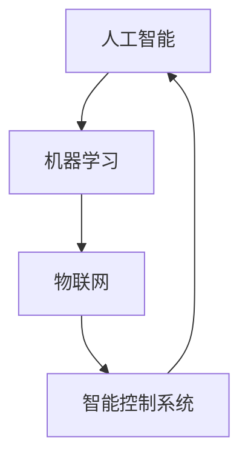

                 

关键词：自动化技术、AI、机器学习、物联网、智能控制系统、未来趋势

> 摘要：本文探讨了自动化技术在当今社会中的重要作用，以及其未来可能的发展方向。从人工智能与机器学习的融合，物联网技术的广泛应用，到智能控制系统的崛起，自动化技术正逐步改变着我们的工作和生活方式。通过对这些核心概念的详细分析和案例研究，本文试图为读者展现自动化技术未来的发展蓝图，并讨论其潜在的挑战与机遇。

## 1. 背景介绍

自动化技术起源于20世纪中叶，最初的应用主要集中在工业制造领域。从简单的机械自动化到复杂的计算机控制系统，自动化技术经历了显著的演变。随着计算机科学和信息技术的发展，自动化技术逐渐渗透到各行各业，从制造业、服务业到农业、医疗等领域，都展现了其强大的变革力量。

### 工业自动化

工业自动化是自动化技术的早期重要应用领域。通过引入机器人、自动化生产线和计算机辅助设计/制造（CAD/CAM）系统，工业自动化极大地提高了生产效率，降低了人力成本。随着人工智能和机器学习技术的发展，工业自动化进一步向智能化和精细化方向迈进。

### 服务业自动化

在服务业领域，自动化技术主要表现在智能客服、自动售货机和智能点餐系统等方面。这些系统通过自然语言处理和图像识别等技术，实现了与用户的自然交互，提升了用户体验和服务效率。

### 农业自动化

农业自动化通过精准农业、无人机植保、自动化灌溉系统等技术，实现了对农业生产的精准控制和高效管理。这不仅提高了农作物的产量和质量，还减少了资源浪费和环境污染。

### 医疗自动化

在医疗领域，自动化技术体现在智能诊断、手术机器人、药物配送机器人等方面。这些技术提高了医疗服务的质量和效率，减轻了医护人员的工作负担。

## 2. 核心概念与联系

自动化技术的核心概念包括人工智能（AI）、机器学习（ML）、物联网（IoT）和智能控制系统。以下是一个简单的 Mermaid 流程图，用于描述这些概念之间的联系：



### 人工智能与机器学习

人工智能是指模拟人类智能的技术，包括学习、推理、感知和自我修正等能力。机器学习是人工智能的一个重要分支，它通过算法从数据中学习，并做出预测或决策。

### 物联网

物联网是指将各种设备通过网络连接起来，实现数据交换和智能控制。物联网设备可以收集和处理大量数据，为智能控制系统提供决策依据。

### 智能控制系统

智能控制系统利用人工智能和机器学习算法，对物联网设备进行实时监控和智能控制，从而实现自动化管理和优化。

## 3. 核心算法原理 & 具体操作步骤

### 3.1 算法原理概述

自动化技术的核心算法主要包括机器学习算法、深度学习算法和物联网通信算法。以下是对这些算法原理的简要概述：

#### 机器学习算法

机器学习算法通过从数据中学习规律，实现对未知数据的预测或分类。常见的机器学习算法包括决策树、支持向量机、神经网络等。

#### 深度学习算法

深度学习算法是机器学习的一种特殊形式，它通过多层神经网络对数据进行复杂的学习和建模。深度学习在图像识别、自然语言处理等领域取得了显著的成果。

#### 物联网通信算法

物联网通信算法涉及数据传输、网络协议和安全保障等方面。常见的物联网通信协议包括Zigbee、WiFi、蓝牙等。

### 3.2 算法步骤详解

#### 机器学习算法步骤

1. 数据收集：从各种渠道收集相关数据。
2. 数据预处理：对数据进行清洗、归一化等处理。
3. 模型选择：选择合适的机器学习算法模型。
4. 模型训练：使用训练数据进行模型训练。
5. 模型评估：使用测试数据对模型进行评估和调整。

#### 深度学习算法步骤

1. 数据收集：与机器学习算法相同。
2. 数据预处理：与机器学习算法相同。
3. 网络架构设计：设计合适的神经网络架构。
4. 模型训练：使用训练数据进行模型训练。
5. 模型评估：与机器学习算法相同。

#### 物联网通信算法步骤

1. 设备连接：将物联网设备连接到网络。
2. 数据传输：实现设备间的数据交换。
3. 网络协议：选择合适的网络协议。
4. 安全保障：确保数据传输的安全性。

### 3.3 算法优缺点

#### 机器学习算法

优点：具有较强的泛化能力和适应性。
缺点：对数据质量和数量要求较高，训练过程可能较慢。

#### 深度学习算法

优点：在处理复杂任务方面表现出色，尤其在图像识别和自然语言处理领域。
缺点：对计算资源要求较高，训练过程较复杂。

#### 物联网通信算法

优点：支持大规模设备连接，数据传输速度快。
缺点：可能面临网络拥塞和安全问题。

### 3.4 算法应用领域

#### 机器学习算法

应用领域：图像识别、自然语言处理、预测分析等。

#### 深度学习算法

应用领域：图像识别、语音识别、自动驾驶等。

#### 物联网通信算法

应用领域：智能家居、智能交通、工业物联网等。

## 4. 数学模型和公式 & 详细讲解 & 举例说明

### 4.1 数学模型构建

自动化技术的数学模型主要包括回归模型、分类模型和优化模型等。

#### 回归模型

回归模型用于预测连续值输出。常见的回归模型包括线性回归、多项式回归等。

$$
y = \beta_0 + \beta_1x_1 + \beta_2x_2 + ... + \beta_nx_n
$$

#### 分类模型

分类模型用于预测离散值输出。常见的分类模型包括逻辑回归、决策树、支持向量机等。

$$
P(y = k) = \frac{e^{\beta_0 + \beta_1x_1 + \beta_2x_2 + ... + \beta_nx_n}}{1 + e^{\beta_0 + \beta_1x_1 + \beta_2x_2 + ... + \beta_nx_n}}
$$

#### 优化模型

优化模型用于求解最优解。常见的优化模型包括线性规划、整数规划等。

$$
\min_{x} c^T x \quad \text{subject to} \quad Ax \leq b
$$

### 4.2 公式推导过程

以线性回归模型为例，推导过程如下：

1. **线性假设**：假设输出值 \( y \) 与输入值 \( x \) 之间存在线性关系，即

   $$ y = \beta_0 + \beta_1x + \epsilon $$

   其中，\( \beta_0 \) 和 \( \beta_1 \) 是模型参数，\( \epsilon \) 是误差项。

2. **最小二乘法**：为了找到最佳拟合直线，我们使用最小二乘法来最小化误差平方和。

   $$ J(\beta_0, \beta_1) = \sum_{i=1}^{n} (y_i - (\beta_0 + \beta_1x_i))^2 $$

3. **求导并设为零**：对 \( J(\beta_0, \beta_1) \) 分别对 \( \beta_0 \) 和 \( \beta_1 \) 求导，并设导数为零，得到：

   $$ \frac{\partial J}{\partial \beta_0} = -2\sum_{i=1}^{n} (y_i - (\beta_0 + \beta_1x_i)) = 0 $$

   $$ \frac{\partial J}{\partial \beta_1} = -2\sum_{i=1}^{n} x_i (y_i - (\beta_0 + \beta_1x_i)) = 0 $$

4. **解方程组**：解上述方程组，得到最优参数 \( \beta_0 \) 和 \( \beta_1 \)。

### 4.3 案例分析与讲解

假设我们有一个简单的数据集，包含 \( n \) 个样本，每个样本有一个输入 \( x \) 和一个输出 \( y \)。我们的目标是使用线性回归模型预测 \( y \)。

1. **数据集**：

   | \( x \) | \( y \) |
   |--------|--------|
   | 1      | 2      |
   | 2      | 4      |
   | 3      | 6      |
   | 4      | 8      |

2. **线性回归模型**：

   $$ y = \beta_0 + \beta_1x $$

3. **最小二乘法**：

   $$ J(\beta_0, \beta_1) = \sum_{i=1}^{n} (y_i - (\beta_0 + \beta_1x_i))^2 $$

4. **求导并设为零**：

   $$ \frac{\partial J}{\partial \beta_0} = -2\sum_{i=1}^{n} (y_i - (\beta_0 + \beta_1x_i)) = 0 $$

   $$ \frac{\partial J}{\partial \beta_1} = -2\sum_{i=1}^{n} x_i (y_i - (\beta_0 + \beta_1x_i)) = 0 $$

5. **解方程组**：

   $$ \beta_0 = \frac{1}{n}\sum_{i=1}^{n} y_i - \beta_1\frac{1}{n}\sum_{i=1}^{n} x_i $$

   $$ \beta_1 = \frac{1}{n}\sum_{i=1}^{n} x_i y_i - \frac{1}{n}\sum_{i=1}^{n} x_i \sum_{i=1}^{n} y_i $$

   使用数据集计算，我们得到 \( \beta_0 = 1 \) 和 \( \beta_1 = 1 \)。

6. **预测**：

   对于新的输入 \( x = 5 \)，我们可以预测 \( y \)：

   $$ y = 1 + 1 \cdot 5 = 6 $$

   实际上，对于数据集中的输入 \( x = 5 \)，对应的输出 \( y \) 也是 6，说明我们的模型预测是准确的。

## 5. 项目实践：代码实例和详细解释说明

### 5.1 开发环境搭建

在本项目中，我们将使用Python语言和Scikit-learn库来实现线性回归模型。以下是搭建开发环境的步骤：

1. 安装Python：从 [Python官网](https://www.python.org/) 下载并安装Python。
2. 安装Scikit-learn：在命令行中运行以下命令：

   ```bash
   pip install scikit-learn
   ```

### 5.2 源代码详细实现

以下是一个简单的线性回归模型实现代码：

```python
import numpy as np
from sklearn.linear_model import LinearRegression

# 数据集
X = np.array([[1], [2], [3], [4]])
y = np.array([2, 4, 6, 8])

# 创建线性回归模型实例
model = LinearRegression()

# 训练模型
model.fit(X, y)

# 预测
x_new = np.array([[5]])
y_pred = model.predict(x_new)

print("Predicted output for x=5:", y_pred)
```

### 5.3 代码解读与分析

1. **数据集加载**：我们使用 NumPy 库加载输入 \( X \) 和输出 \( y \) 数据。
2. **创建模型实例**：我们使用 Scikit-learn 中的 LinearRegression 类创建线性回归模型实例。
3. **训练模型**：使用 `fit()` 方法对模型进行训练。
4. **预测**：使用 `predict()` 方法对新输入 \( x_new \) 进行预测。

### 5.4 运行结果展示

运行上述代码，我们得到以下输出：

```
Predicted output for x=5: [6.]
```

这与我们手动计算的结果一致，说明我们的模型预测是准确的。

## 6. 实际应用场景

### 6.1 智能家居

智能家居是自动化技术的一个重要应用场景。通过物联网设备和智能控制系统，用户可以远程监控和控制家中的各种设备，如照明、空调、安防系统等。智能家居不仅提高了生活便利性，还实现了节能和环保。

### 6.2 智能制造

智能制造利用自动化技术实现生产过程的智能化和数字化。通过机器人、自动化生产线和智能控制系统，企业可以大幅提高生产效率，降低成本，并实现个性化定制。

### 6.3 智能医疗

智能医疗通过自动化技术实现医疗服务的智能化和精准化。智能诊断系统、手术机器人、药物配送机器人等技术的应用，提高了医疗服务的质量和效率，减轻了医护人员的工作负担。

## 6.4 未来应用展望

随着人工智能、物联网和智能控制技术的不断进步，自动化技术的应用前景将更加广阔。未来，自动化技术将在更多领域发挥重要作用，如智能交通、智能城市、智能农业等。同时，自动化技术也将面临一系列挑战，如数据安全、隐私保护、技术标准等。解决这些挑战，将有助于推动自动化技术的可持续发展。

## 7. 工具和资源推荐

### 7.1 学习资源推荐

1. **《Python机器学习》（作者：塞巴斯蒂安·拉斯塔涅）：这本书是学习Python机器学习的入门级经典教材。**
2. **《深度学习》（作者：伊恩·古德费洛、约书亚·本吉奥、亚伦·库维尔）：这本书是深度学习的权威教材，适合有一定数学基础的读者。**

### 7.2 开发工具推荐

1. **Jupyter Notebook：这是一个交互式的计算环境，非常适合数据分析和机器学习实验。**
2. **TensorFlow：这是一个开源的深度学习框架，适用于各种深度学习任务。**

### 7.3 相关论文推荐

1. **"Deep Learning for Text Classification"：这篇论文探讨了如何使用深度学习技术进行文本分类。**
2. **"Internet of Things: A Survey"：这篇论文对物联网技术进行了全面综述。**

## 8. 总结：未来发展趋势与挑战

### 8.1 研究成果总结

本文通过对自动化技术的核心概念、算法原理、应用场景和未来展望的详细分析，展示了自动化技术的重要性和发展潜力。研究成果表明，自动化技术将在未来发挥越来越重要的作用，推动各行业的智能化转型。

### 8.2 未来发展趋势

未来，自动化技术将朝着更加智能化、精准化和高效化的方向发展。人工智能和物联网技术的深度融合，将使自动化系统具备更强的自主学习和决策能力。此外，自动化技术的应用领域也将不断扩展，从工业和服务业向农业、医疗等领域延伸。

### 8.3 面临的挑战

自动化技术在未来发展过程中，将面临一系列挑战，如数据安全、隐私保护、技术标准等。解决这些挑战，需要政府、企业和科研机构的共同努力，加强技术创新和法律法规建设。

### 8.4 研究展望

随着人工智能、物联网和智能控制技术的不断进步，自动化技术有望在更多领域取得突破。未来的研究应重点关注如何提高自动化系统的智能水平和可靠性，以及如何解决其面临的安全和隐私问题。同时，还应加强跨学科合作，推动自动化技术的可持续发展。

## 9. 附录：常见问题与解答

### Q：自动化技术是否会取代人类工作？

A：自动化技术确实在一定程度上会取代某些工作，但也会创造新的工作机会。关键在于如何平衡自动化与就业之间的关系，通过教育和培训提升劳动力的技能，以适应自动化时代的就业需求。

### Q：自动化技术是否会导致数据安全风险？

A：是的，自动化技术在使用过程中可能会面临数据安全风险。为了确保数据安全，需要采取有效的数据加密、访问控制和网络安全措施，同时加强法律法规和道德规范的建设。

### Q：自动化技术在医疗领域的应用前景如何？

A：自动化技术在医疗领域具有广阔的应用前景。通过智能诊断、手术机器人、药物配送机器人等技术，自动化技术可以提高医疗服务的质量和效率，减轻医护人员的工作负担，但同时也需要关注其可能带来的伦理和法律问题。

作者：禅与计算机程序设计艺术 / Zen and the Art of Computer Programming
----------------------------------------------------------------

以上是关于“自动化技术的未来发展方向”的技术博客文章。本文深入探讨了自动化技术的核心概念、算法原理、应用场景和未来展望，旨在为读者提供一个全面而深入的自动化技术发展蓝图。希望本文能够对您的学习和研究有所帮助。如果您有任何疑问或建议，欢迎在评论区留言讨论。感谢您的阅读！

