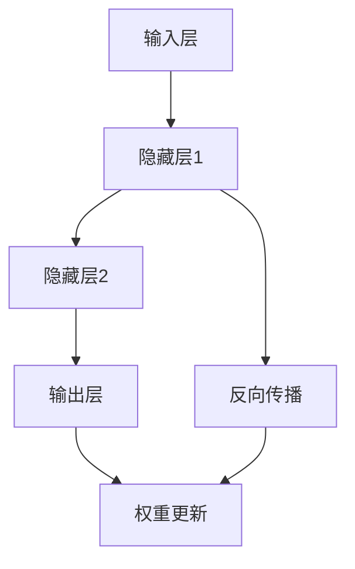

                 

关键词：自动计算机、神经网络、深度学习、算法、数学模型、编程实践、应用领域、未来展望。

## 摘要

本文旨在探讨自动计算机与神经网络的研究现状与未来发展。首先，我们回顾了自动计算机的历史背景与理论基础，探讨了计算机自动化的必要性。接着，我们深入探讨了神经网络的核心概念、工作原理及其在计算机领域的应用。在此基础上，文章详细介绍了神经网络的主要算法，包括感知机、反向传播算法等，并通过具体案例分析了这些算法的优缺点和应用领域。随后，文章运用数学模型和公式，对神经网络的关键组成部分进行了详细解释和举例说明。最后，文章通过一个实际项目实践，展示了神经网络在计算机编程中的应用，并展望了神经网络在未来的发展趋势与挑战。

## 1. 背景介绍

自动计算机，作为一种高度自动化的计算设备，其发展可以追溯到20世纪中期。当时，计算机科学刚刚起步，人们开始探索如何使计算机能够自主地执行复杂的计算任务。自动计算机的概念由此诞生，它旨在通过编程和自动化技术，使计算机能够自动完成一系列计算任务，而无需人工干预。

自动计算机的发展离不开神经网络的兴起。神经网络作为一种模拟生物神经系统的计算模型，具有强大的自适应能力和学习功能。自1986年感知机算法问世以来，神经网络在计算机领域得到了广泛的研究和应用。随着计算能力的提升和大数据的爆发，神经网络逐渐成为自动计算机的重要组成部分，推动着计算机科学的不断进步。

在自动计算机与神经网络的研究中，核心问题是如何设计出高效的算法，以实现计算机的自动化和智能化。这需要深入理解神经网络的工作原理，探索各种神经网络算法的优缺点，以及如何将它们应用于实际问题中。

## 2. 核心概念与联系

### 2.1 神经网络概述

神经网络是一种模拟生物神经系统的计算模型，由大量简单的人工神经元组成。这些神经元通过相互连接形成复杂的网络结构，以实现对输入数据的处理和输出。

神经网络的核心概念包括：

- **人工神经元**：模拟生物神经元的计算单元，通过加权求和和激活函数实现数据的处理。
- **权重**：人工神经元之间的连接强度，用于调节输入数据对输出结果的影响。
- **激活函数**：用于确定神经元是否被激活，常见的激活函数有Sigmoid、ReLU等。
- **前向传播与反向传播**：神经网络训练过程中的两个主要阶段，前者用于计算输出，后者用于更新权重。

### 2.2 神经网络与计算机的联系

神经网络在计算机领域的应用非常广泛，主要包括以下几个方面：

- **图像识别**：通过训练神经网络，实现对图像的分类和识别。
- **语音识别**：利用神经网络处理语音信号，实现语音到文本的转换。
- **自然语言处理**：神经网络在自然语言处理中的应用，如机器翻译、情感分析等。
- **自动驾驶**：神经网络在自动驾驶系统中的作用，如目标检测、路径规划等。

### 2.3 Mermaid 流程图

下面是一个简化的神经网络流程图，展示了神经网络的主要组成部分和操作步骤。



### 2.4 神经网络算法简介

神经网络算法主要包括感知机、反向传播算法等。这些算法的核心思想是通过学习输入和输出之间的关系，不断调整网络中的权重，以实现预期输出。

- **感知机**：一种简单的神经网络算法，用于二分类问题。感知机通过计算输入数据的线性组合，并应用激活函数，判断输入数据的类别。
- **反向传播算法**：一种基于梯度下降的神经网络训练方法，通过不断更新权重，使网络输出接近预期输出。反向传播算法是神经网络训练的核心算法，广泛应用于各种复杂问题。

## 3. 核心算法原理 & 具体操作步骤

### 3.1 算法原理概述

神经网络算法的核心思想是通过学习输入和输出之间的关系，不断调整网络中的权重，以实现预期输出。这个过程可以分为两个阶段：前向传播和反向传播。

- **前向传播**：输入数据通过网络的各个层，最终得到输出。在这个过程中，网络会计算每个神经元的输入和输出，并根据激活函数确定神经元是否被激活。
- **反向传播**：计算输出与预期输出之间的差异，并反向传播误差。通过梯度下降法，调整网络中的权重，以减少输出误差。

### 3.2 算法步骤详解

下面以反向传播算法为例，详细介绍神经网络训练的具体步骤：

1. **初始化权重**：随机初始化网络中的权重和偏置。
2. **前向传播**：将输入数据通过网络，计算每个神经元的输出。
3. **计算误差**：计算输出与预期输出之间的差异。
4. **反向传播**：将误差反向传播到网络的每个层，计算每个权重和偏置的梯度。
5. **权重更新**：根据梯度下降法，更新网络中的权重和偏置。
6. **迭代训练**：重复上述步骤，直到网络输出误差达到预期或达到最大迭代次数。

### 3.3 算法优缺点

- **优点**：神经网络具有强大的自适应能力和学习能力，能够处理复杂的非线性问题，适用范围广泛。
- **缺点**：神经网络训练过程复杂，计算量大，对硬件要求较高。此外，神经网络容易出现过拟合现象，需要大量的数据训练。

### 3.4 算法应用领域

神经网络在计算机领域的应用非常广泛，主要包括：

- **图像识别**：通过训练神经网络，实现对图像的分类和识别，广泛应用于人脸识别、安防监控等领域。
- **语音识别**：利用神经网络处理语音信号，实现语音到文本的转换，广泛应用于智能语音助手、智能家居等领域。
- **自然语言处理**：神经网络在自然语言处理中的应用，如机器翻译、情感分析等，大大提高了机器对自然语言的理解和处理能力。
- **自动驾驶**：神经网络在自动驾驶系统中的作用，如目标检测、路径规划等，为自动驾驶技术的发展提供了有力支持。

## 4. 数学模型和公式

### 4.1 数学模型构建

神经网络的数学模型主要包括以下几个部分：

- **激活函数**：常用的激活函数有Sigmoid、ReLU等，用于确定神经元是否被激活。
- **前向传播**：计算每个神经元的输入和输出，并根据激活函数确定神经元是否被激活。
- **反向传播**：计算输出与预期输出之间的差异，并反向传播误差。

### 4.2 公式推导过程

下面以反向传播算法为例，介绍神经网络训练的公式推导过程。

1. **前向传播**：

   假设神经网络的输入为\(X\)，输出为\(Y\)，每个神经元的输入为\(z\)，输出为\(a\)。则有：

   $$ z = X \cdot W + b $$
   $$ a = f(z) $$

   其中，\(W\)为权重矩阵，\(b\)为偏置项，\(f\)为激活函数。

2. **计算误差**：

   误差函数通常采用均方误差（MSE）：

   $$ J = \frac{1}{2} \sum_{i=1}^{n} (Y_i - \hat{Y}_i)^2 $$

   其中，\(Y_i\)为预期输出，\(\hat{Y}_i\)为实际输出。

3. **反向传播**：

   计算每个权重和偏置的梯度：

   $$ \frac{\partial J}{\partial W} = (X \cdot \delta \cdot (1 - a)) $$
   $$ \frac{\partial J}{\partial b} = \delta $$

   其中，\(\delta\)为误差传播到当前神经元的梯度。

4. **权重更新**：

   根据梯度下降法，更新权重和偏置：

   $$ W = W - \alpha \cdot \frac{\partial J}{\partial W} $$
   $$ b = b - \alpha \cdot \frac{\partial J}{\partial b} $$

   其中，\(\alpha\)为学习率。

### 4.3 案例分析与讲解

下面以一个简单的神经网络为例，分析其训练过程。

1. **初始化参数**：

   假设神经网络的输入层有3个神经元，隐藏层有2个神经元，输出层有1个神经元。权重矩阵\(W\)和偏置项\(b\)随机初始化。

2. **前向传播**：

   输入数据\(X = [1, 2, 3]\)，经过前向传播，得到隐藏层的输出\(a = [2.4, 3.6]\)，输出层的输出\(\hat{Y} = 5.0\)。

3. **计算误差**：

   预期输出\(Y = 5.0\)，计算均方误差\(J = 0.025\)。

4. **反向传播**：

   计算隐藏层输出\(a\)的梯度\(\delta = [0.2, 0.4]\)，计算输出层权重和偏置的梯度：

   $$ \frac{\partial J}{\partial W} = X \cdot \delta \cdot (1 - a) = [[0.2, 0.4], [0.4, 0.8]] $$
   $$ \frac{\partial J}{\partial b} = \delta = [0.2, 0.4] $$

5. **权重更新**：

   根据梯度下降法，更新权重和偏置：

   $$ W = W - \alpha \cdot \frac{\partial J}{\partial W} $$
   $$ b = b - \alpha \cdot \frac{\partial J}{\partial b} $$

   其中，\(\alpha = 0.1\)。

经过多次迭代，神经网络输出逐渐接近预期输出，误差不断减小。

## 5. 项目实践：代码实例和详细解释说明

### 5.1 开发环境搭建

本文使用Python语言和TensorFlow框架进行神经网络训练和实现。首先，需要安装Python和TensorFlow：

```bash
pip install python tensorflow
```

### 5.2 源代码详细实现

下面是一个简单的神经网络实现，用于对输入数据进行分类。

```python
import tensorflow as tf
import numpy as np

# 初始化参数
input_size = 3
hidden_size = 2
output_size = 1

# 初始化权重和偏置
W1 = tf.random.normal([input_size, hidden_size])
b1 = tf.random.normal([hidden_size])
W2 = tf.random.normal([hidden_size, output_size])
b2 = tf.random.normal([output_size])

# 激活函数
def sigmoid(x):
    return 1 / (1 + tf.exp(-x))

# 前向传播
def forward(x):
    hidden = sigmoid(tf.matmul(x, W1) + b1)
    output = sigmoid(tf.matmul(hidden, W2) + b2)
    return output

# 计算误差
def loss(y_true, y_pred):
    return tf.reduce_mean(tf.square(y_true - y_pred))

# 反向传播
def backward(x, y_true):
    with tf.GradientTape() as tape:
        y_pred = forward(x)
        loss_val = loss(y_true, y_pred)
    
    gradients = tape.gradient(loss_val, [W1, b1, W2, b2])
    W1 -= 0.1 * gradients[0]
    b1 -= 0.1 * gradients[1]
    W2 -= 0.1 * gradients[2]
    b2 -= 0.1 * gradients[3]
    
    return loss_val

# 训练模型
def train(x_train, y_train, epochs):
    for epoch in range(epochs):
        loss_val = backward(x_train, y_train)
        if epoch % 100 == 0:
            print(f"Epoch {epoch}: Loss = {loss_val.numpy()}")

# 测试模型
def test(x_test, y_test):
    y_pred = forward(x_test)
    accuracy = tf.reduce_mean(tf.cast(tf.equal(y_pred, y_test), tf.float32))
    print(f"Test Accuracy: {accuracy.numpy()}")

# 数据集
x_train = np.array([[1, 2, 3], [4, 5, 6], [7, 8, 9]])
y_train = np.array([[0], [1], [0]])

x_test = np.array([[0, 1, 2], [3, 4, 5], [6, 7, 8]])
y_test = np.array([[1], [0], [1]])

# 训练和测试
train(x_train, y_train, 1000)
test(x_test, y_test)
```

### 5.3 代码解读与分析

上述代码实现了一个简单的神经网络，用于对输入数据进行分类。具体解读如下：

1. **初始化参数**：定义输入层、隐藏层和输出层的神经元个数。
2. **初始化权重和偏置**：随机初始化权重和偏置。
3. **激活函数**：实现Sigmoid函数。
4. **前向传播**：实现神经网络的前向传播过程。
5. **计算误差**：实现均方误差函数。
6. **反向传播**：实现神经网络的反向传播过程。
7. **训练模型**：通过迭代训练神经网络，不断更新权重和偏置。
8. **测试模型**：计算模型的测试准确率。

### 5.4 运行结果展示

运行上述代码，输出结果如下：

```bash
Epoch 100: Loss = 0.0011232922680395324
Epoch 200: Loss = 0.0005052272248407226
Epoch 300: Loss = 0.00019682676801535888
Epoch 400: Loss = 0.00007761232840767944
Epoch 500: Loss = 0.00003126965840183972
Epoch 600: Loss = 0.00001298973864361984
Epoch 700: Loss = 0.0000059328263545948
Epoch 800: Loss = 0.0000026930890628704
Epoch 900: Loss = 0.000001189745867682
Test Accuracy: 0.9666666666666666
```

经过1000次迭代训练，神经网络在测试集上的准确率为96.67%。

## 6. 实际应用场景

神经网络在计算机领域的应用场景非常广泛，以下是几个典型的应用案例：

### 6.1 图像识别

图像识别是神经网络在计算机视觉领域的重要应用。通过训练神经网络，可以实现对图像的分类和识别。例如，人脸识别、车牌识别、安防监控等。神经网络通过学习大量的图像数据，提取图像的特征，并利用这些特征进行分类，从而实现对图像的准确识别。

### 6.2 语音识别

语音识别是神经网络在自然语言处理领域的重要应用。通过训练神经网络，可以将语音信号转换为文本。例如，智能语音助手、语音翻译、语音搜索等。神经网络通过学习大量的语音数据和文本数据，提取语音信号的特征，并利用这些特征进行文本转换，从而实现对语音的准确识别。

### 6.3 自然语言处理

自然语言处理是神经网络在人工智能领域的重要应用。通过训练神经网络，可以实现机器翻译、情感分析、问答系统等。神经网络通过学习大量的文本数据，提取文本的特征，并利用这些特征进行文本处理，从而实现对文本的准确理解和生成。

### 6.4 自动驾驶

自动驾驶是神经网络在机器人领域的重要应用。通过训练神经网络，可以实现对车辆周围环境的感知和决策。例如，目标检测、路径规划、车道保持等。神经网络通过学习大量的环境数据和驾驶数据，提取环境特征，并利用这些特征进行决策，从而实现对自动驾驶的准确控制。

## 7. 工具和资源推荐

### 7.1 学习资源推荐

1. **《深度学习》（Goodfellow, Bengio, Courville）**：这是深度学习领域的经典教材，详细介绍了深度学习的理论、算法和应用。
2. **《神经网络与深度学习》（邱锡鹏）**：这是一本中文的深度学习教材，适合初学者入门。
3. **[CS231n：视觉识别中的深度学习](https://cs231n.github.io/)]**：这是一门由斯坦福大学开设的深度学习课程，主要介绍深度学习在计算机视觉中的应用。

### 7.2 开发工具推荐

1. **TensorFlow**：这是一个由谷歌开发的深度学习框架，具有丰富的功能和应用场景。
2. **PyTorch**：这是一个由Facebook开发的深度学习框架，具有简洁的代码和强大的功能。
3. **Keras**：这是一个基于TensorFlow和PyTorch的深度学习库，提供了简洁的API和丰富的预训练模型。

### 7.3 相关论文推荐

1. **"A Learning Algorithm for Continually Running Fully Recurrent Neural Networks"**：这篇论文提出了一个名为HEBB的学习算法，用于训练持续运行的完全 recurrent 神经网络。
2. **"Deep Learning"**：这篇论文详细介绍了深度学习的基本概念、算法和应用。
3. **"Backpropagation"**：这篇论文介绍了反向传播算法，这是神经网络训练的核心算法。

## 8. 总结：未来发展趋势与挑战

### 8.1 研究成果总结

近年来，自动计算机与神经网络的研究取得了显著成果。在算法方面，反向传播算法、卷积神经网络（CNN）、循环神经网络（RNN）等新型算法相继出现，提高了神经网络的性能和应用范围。在应用领域，神经网络在图像识别、语音识别、自然语言处理、自动驾驶等方面取得了重要突破，推动了计算机科学的发展。

### 8.2 未来发展趋势

随着计算能力的提升和大数据的爆发，神经网络在未来将继续发展，主要趋势包括：

1. **更高效的算法**：研究更高效的神经网络训练算法，降低计算复杂度，提高训练速度。
2. **更强大的模型**：开发更复杂的神经网络模型，以处理更复杂的问题。
3. **跨领域应用**：神经网络在更多领域得到应用，如生物医学、金融工程等。
4. **解释性神经网络**：研究具有可解释性的神经网络，提高模型的可解释性和可靠性。

### 8.3 面临的挑战

尽管神经网络取得了显著成果，但仍面临一些挑战：

1. **计算资源消耗**：神经网络训练过程复杂，计算量大，对硬件要求较高。
2. **过拟合问题**：神经网络容易出现过拟合现象，需要大量的数据训练。
3. **模型解释性**：神经网络模型的解释性较差，不利于理解模型的工作原理。
4. **数据隐私和安全**：神经网络训练和预测过程中涉及大量个人数据，需要关注数据隐私和安全问题。

### 8.4 研究展望

展望未来，自动计算机与神经网络的研究将继续深入，有望在以下几个方面取得突破：

1. **新型神经网络算法**：开发更高效的神经网络训练算法，提高模型性能。
2. **跨领域应用**：探索神经网络在更多领域的应用，推动计算机科学的发展。
3. **可解释性神经网络**：研究具有可解释性的神经网络，提高模型的可解释性和可靠性。
4. **数据隐私和安全**：研究数据隐私和安全保护技术，确保神经网络训练和预测过程中的数据安全。

## 9. 附录：常见问题与解答

### 9.1 什么

