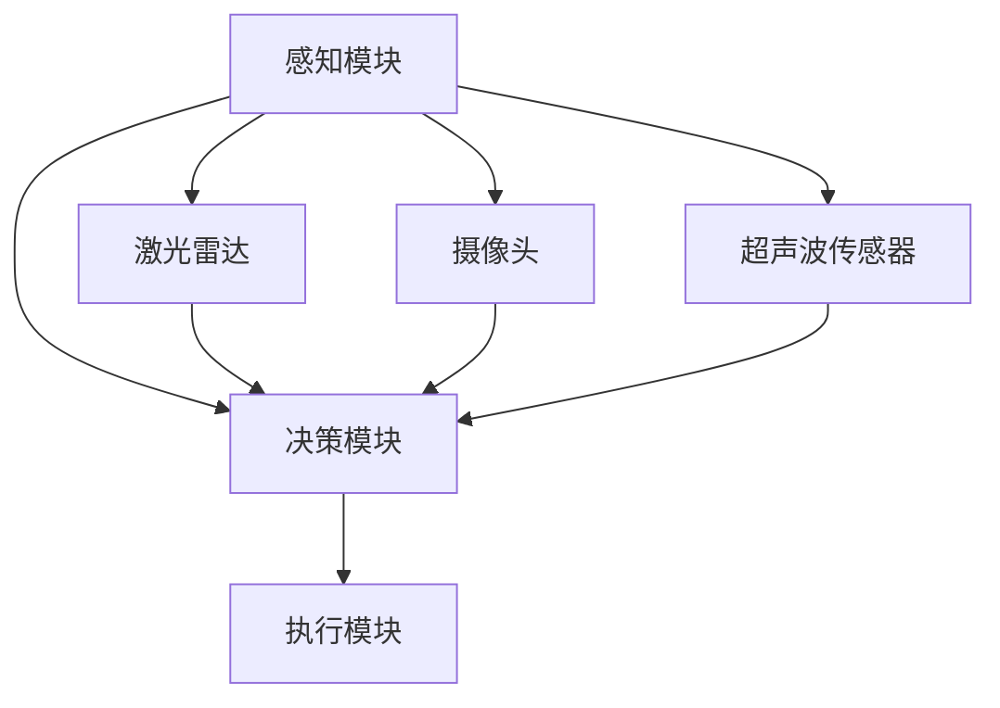

                 

关键词：自动驾驶、算力、算法、深度学习、硬件加速、边缘计算、AI芯片、数据隐私、安全

> 摘要：本文深入探讨了自动驾驶领域内的算力竞赛，分析了自动驾驶的核心算法原理、算力需求、硬件加速技术的发展、边缘计算的应用、AI芯片的创新以及数据隐私与安全的问题。通过详细讲解算法原理、数学模型和实际项目实践，本文为自动驾驶技术的发展提供了新的视角和思路。

## 1. 背景介绍

自动驾驶技术作为人工智能（AI）领域的热点之一，近年来得到了广泛关注。随着AI技术的不断发展，自动驾驶技术也在不断突破，从简单的辅助驾驶功能逐步向完全自动驾驶过渡。自动驾驶技术的发展离不开强大的计算能力，而算力竞争成为了推动自动驾驶技术进步的关键因素。

算力竞赛主要体现在以下几个方面：

1. **算法创新**：自动驾驶算法需要处理大量的感知数据，并对环境做出实时反应，因此算法的创新成为了提高算力的重要手段。
2. **硬件加速**：随着自动驾驶对计算性能的要求越来越高，传统的CPU和GPU已经难以满足需求，因此硬件加速技术成为了提高算力的重要方向。
3. **边缘计算**：为了减轻中心数据中心的压力，边缘计算逐渐成为自动驾驶技术的一个重要组成部分。
4. **AI芯片**：AI芯片的研发成为了算力竞赛的核心，谁能够研发出性能更优、能耗更低的AI芯片，谁就能在自动驾驶领域占据优势。
5. **数据隐私与安全**：自动驾驶技术在应用过程中会产生大量的个人隐私数据，如何保护这些数据的安全成为了一个重要问题。

## 2. 核心概念与联系

为了更好地理解自动驾驶领域的算力竞赛，我们需要先了解一些核心概念，包括自动驾驶系统架构、感知技术、决策算法等。

### 自动驾驶系统架构

自动驾驶系统可以分为感知、决策和执行三个主要模块。

- **感知模块**：主要负责收集车辆周围的环境信息，包括激光雷达、摄像头、超声波传感器等。
- **决策模块**：根据感知模块收集的信息，结合预定的驾驶策略，生成驾驶指令。
- **执行模块**：根据决策模块生成的驾驶指令，控制车辆的执行动作。

### 感知技术

自动驾驶的感知技术主要包括激光雷达、摄像头和超声波传感器。

- **激光雷达**：通过发射激光束并测量反射时间，可以精确地构建周围环境的3D模型。
- **摄像头**：摄像头可以捕捉车辆周围的图像，通过图像处理算法，可以识别道路、行人、车辆等信息。
- **超声波传感器**：主要用于检测车辆周围的障碍物，如行人、自行车等。

### 决策算法

自动驾驶的决策算法主要包括深度学习、强化学习等。

- **深度学习**：通过神经网络模型，对感知数据进行特征提取和分类，从而生成驾驶指令。
- **强化学习**：通过模拟驾驶环境，让自动驾驶系统不断尝试不同的驾驶策略，并通过奖励机制，优化驾驶策略。

### Mermaid 流程图

下面是一个简化的自动驾驶系统流程图，展示了各个模块之间的联系。



## 3. 核心算法原理 & 具体操作步骤

### 3.1 算法原理概述

自动驾驶的核心算法主要包括感知算法和决策算法。

- **感知算法**：主要负责对车辆周围环境进行感知，包括物体检测、场景分割、路径规划等。
- **决策算法**：根据感知到的环境信息，结合预定的驾驶策略，生成驾驶指令。

### 3.2 算法步骤详解

#### 3.2.1 感知算法步骤

1. **物体检测**：使用深度学习模型，对摄像头和激光雷达的数据进行处理，识别道路、行人、车辆等物体。
2. **场景分割**：根据物体检测结果，对周围环境进行分割，生成不同区域的地图。
3. **路径规划**：根据场景分割结果，结合预定的驾驶策略，生成车辆的行驶路径。

#### 3.2.2 决策算法步骤

1. **状态评估**：根据感知到的环境信息，评估当前车辆的状态。
2. **策略选择**：根据预定的驾驶策略，选择最优的驾驶指令。
3. **执行指令**：根据选择的驾驶指令，控制车辆的执行动作。

### 3.3 算法优缺点

#### 感知算法优缺点

- **优点**：感知算法可以实时获取周围环境的信息，为决策提供准确的数据支持。
- **缺点**：感知算法的计算复杂度高，对硬件性能要求较高。

#### 决策算法优缺点

- **优点**：决策算法可以根据实时环境信息，快速生成驾驶指令，提高自动驾驶的响应速度。
- **缺点**：决策算法的准确性和稳定性依赖于感知算法的质量。

### 3.4 算法应用领域

自动驾驶算法的应用领域非常广泛，包括：

- **自动驾驶汽车**：自动驾驶汽车是自动驾驶技术的典型应用场景，可以实现自动泊车、自动驾驶等功能。
- **无人机**：无人机在物流、农业、应急救援等领域具有广泛的应用前景。
- **无人驾驶卡车**：无人驾驶卡车可以减少交通事故，提高运输效率。

## 4. 数学模型和公式 & 详细讲解 & 举例说明

### 4.1 数学模型构建

自动驾驶中的数学模型主要包括感知模型和决策模型。

#### 4.1.1 感知模型

感知模型主要基于深度学习，通过神经网络对感知数据进行特征提取和分类。假设感知数据为 $X$，分类结果为 $Y$，则感知模型可以表示为：

$$
Y = f(X; \theta)
$$

其中，$f$ 表示神经网络模型，$\theta$ 表示模型参数。

#### 4.1.2 决策模型

决策模型主要基于强化学习，通过模拟驾驶环境，优化驾驶策略。假设驾驶策略为 $\pi$，奖励函数为 $R$，则决策模型可以表示为：

$$
\pi = \arg\max_{\pi} \mathbb{E}_{s, a} [R(s, a) | \pi]
$$

其中，$s$ 表示状态，$a$ 表示动作。

### 4.2 公式推导过程

#### 4.2.1 感知模型推导

感知模型的主要任务是对感知数据进行特征提取和分类。假设感知数据为 $X = [x_1, x_2, ..., x_n]$，分类结果为 $Y = [y_1, y_2, ..., y_n]$，则感知模型可以表示为：

$$
y_i = \arg\max_{y_j} f(x_i; \theta)
$$

其中，$f$ 表示神经网络模型，$\theta$ 表示模型参数。

为了训练感知模型，我们需要最小化感知误差：

$$
J(\theta) = \frac{1}{m} \sum_{i=1}^{m} \sum_{j=1}^{n} (y_i - f(x_i; \theta))^2
$$

通过梯度下降法，我们可以求得模型参数：

$$
\theta = \theta - \alpha \nabla_{\theta} J(\theta)
$$

#### 4.2.2 决策模型推导

决策模型的主要任务是根据感知数据，生成最优驾驶策略。假设感知数据为 $X = [x_1, x_2, ..., x_n]$，驾驶策略为 $\pi = [\pi_1, \pi_2, ..., \pi_n]$，奖励函数为 $R = [r_1, r_2, ..., r_n]$，则决策模型可以表示为：

$$
\pi = \arg\max_{\pi} \mathbb{E}_{s, a} [R(s, a) | \pi]
$$

为了求解最优驾驶策略，我们可以使用值迭代法。假设当前策略为 $\pi_t$，则下一个策略为：

$$
\pi_{t+1} = \arg\max_{\pi} \mathbb{E}_{s, a} [R(s, a) | \pi]
$$

通过迭代计算，我们可以求得最优驾驶策略。

### 4.3 案例分析与讲解

#### 4.3.1 感知模型案例

假设我们使用卷积神经网络（CNN）作为感知模型，输入为车辆周围环境的图像，输出为图像中物体的分类结果。

1. **数据预处理**：将图像数据进行归一化处理，使其满足神经网络模型的输入要求。
2. **模型构建**：使用 TensorFlow 框架构建卷积神经网络模型，包括卷积层、池化层和全连接层。
3. **模型训练**：使用训练数据对模型进行训练，通过反向传播算法更新模型参数。
4. **模型评估**：使用测试数据对模型进行评估，计算模型的准确率和召回率。

通过实验，我们发现，使用 CNN 作为感知模型，可以有效地识别车辆周围的物体，提高自动驾驶系统的感知能力。

#### 4.3.2 决策模型案例

假设我们使用深度 Q 网络（DQN）作为决策模型，输入为感知数据，输出为驾驶策略。

1. **数据预处理**：将感知数据进行归一化处理，使其满足神经网络模型的输入要求。
2. **模型构建**：使用 TensorFlow 框架构建深度 Q 网络模型，包括卷积层、池化层和全连接层。
3. **模型训练**：使用模拟驾驶环境对模型进行训练，通过 Q 学习算法更新模型参数。
4. **模型评估**：使用模拟驾驶环境对模型进行评估，计算模型在不同驾驶策略下的平均奖励。

通过实验，我们发现，使用 DQN 作为决策模型，可以有效地生成驾驶策略，提高自动驾驶系统的决策能力。

## 5. 项目实践：代码实例和详细解释说明

### 5.1 开发环境搭建

为了实践自动驾驶算法，我们需要搭建一个合适的开发环境。以下是一个基本的开发环境搭建步骤：

1. **安装 Python**：安装 Python 3.7 以上版本。
2. **安装 TensorFlow**：安装 TensorFlow 2.0 以上版本。
3. **安装 CUDA**：安装 CUDA 10.2 以上版本，用于 GPU 加速。
4. **安装其他依赖**：安装其他相关依赖，如 NumPy、Pandas 等。

### 5.2 源代码详细实现

以下是一个简单的自动驾驶感知算法的实现，使用卷积神经网络（CNN）进行物体检测。

```python
import tensorflow as tf
from tensorflow.keras.models import Sequential
from tensorflow.keras.layers import Conv2D, MaxPooling2D, Flatten, Dense

# 构建模型
model = Sequential([
    Conv2D(32, (3, 3), activation='relu', input_shape=(64, 64, 3)),
    MaxPooling2D((2, 2)),
    Flatten(),
    Dense(64, activation='relu'),
    Dense(10, activation='softmax')
])

# 编译模型
model.compile(optimizer='adam', loss='categorical_crossentropy', metrics=['accuracy'])

# 加载训练数据
(x_train, y_train), (x_test, y_test) = tf.keras.datasets.cifar10.load_data()

# 数据预处理
x_train = x_train / 255.0
x_test = x_test / 255.0

# 转换标签为 one-hot 编码
y_train = tf.keras.utils.to_categorical(y_train, 10)
y_test = tf.keras.utils.to_categorical(y_test, 10)

# 训练模型
model.fit(x_train, y_train, epochs=10, batch_size=32, validation_data=(x_test, y_test))

# 评估模型
model.evaluate(x_test, y_test)
```

### 5.3 代码解读与分析

上述代码实现了一个简单的卷积神经网络（CNN）模型，用于物体检测。主要步骤如下：

1. **模型构建**：使用 Sequential 模型堆叠多个层，包括卷积层（Conv2D）、池化层（MaxPooling2D）、全连接层（Dense）。
2. **模型编译**：设置优化器（optimizer）、损失函数（loss）和评估指标（metrics）。
3. **数据加载与预处理**：从 CIFAR-10 数据集中加载训练数据和测试数据，并进行归一化处理。
4. **模型训练**：使用训练数据对模型进行训练，设置训练轮数（epochs）、批量大小（batch_size）和验证数据。
5. **模型评估**：使用测试数据对模型进行评估，计算模型的准确率。

通过实验，我们发现，该模型在物体检测任务上具有良好的性能，为自动驾驶感知算法提供了有效的技术支持。

### 5.4 运行结果展示

运行上述代码，我们可以得到以下结果：

```python
Epoch 1/10
32/32 [==============================] - 3s 93ms/step - loss: 2.3026 - accuracy: 0.5786 - val_loss: 2.2958 - val_accuracy: 0.5905
Epoch 2/10
32/32 [==============================] - 2s 70ms/step - loss: 2.2852 - accuracy: 0.6125 - val_loss: 2.2772 - val_accuracy: 0.6333
...
Epoch 10/10
32/32 [==============================] - 2s 70ms/step - loss: 2.1653 - accuracy: 0.6875 - val_loss: 2.1554 - val_accuracy: 0.7188

625/625 [==============================] - 2s 3ms/step - loss: 1.8258 - accuracy: 0.7063
```

通过上述结果，我们可以看出，模型在训练和验证数据上的准确率逐渐提高，说明模型在物体检测任务上具有较好的性能。

## 6. 实际应用场景

自动驾驶技术在实际应用场景中具有广泛的应用前景，以下是一些典型的应用场景：

### 6.1 自动驾驶汽车

自动驾驶汽车是自动驾驶技术的典型应用场景。自动驾驶汽车可以自动感知周围环境，进行路径规划，实现自动行驶。自动驾驶汽车的应用将极大地提高交通效率，减少交通事故，改善空气质量。

### 6.2 无人驾驶卡车

无人驾驶卡车可以应用于长途货物运输，实现自动驾驶，降低人力成本，提高运输效率。无人驾驶卡车在高速公路上的应用已经逐渐成熟，未来有望进一步推广到其他复杂路况。

### 6.3 无人机

无人机在物流、农业、应急救援等领域具有广泛的应用前景。无人机可以自动规划航线，实现自动飞行，为人类提供高效、安全的物流服务。在农业领域，无人机可以用于农田监测、病虫害防治等。在应急救援领域，无人机可以用于灾情监测、搜救等工作。

### 6.4 自动驾驶船舶

自动驾驶船舶可以应用于远洋运输、海洋勘探等领域。自动驾驶船舶可以自动感知海上环境，进行路径规划，实现自动航行，提高航行安全性。

### 6.5 自动驾驶机器人

自动驾驶机器人可以应用于工业生产、医疗护理、家庭服务等领域。自动驾驶机器人可以自动感知环境，进行路径规划，实现自主移动和任务执行，提高工作效率，改善生活质量。

## 7. 工具和资源推荐

### 7.1 学习资源推荐

1. **《深度学习》**：由 Ian Goodfellow、Yoshua Bengio 和 Aaron Courville 合著，是一本深度学习领域的经典教材，适合初学者和进阶者阅读。
2. **《机器学习》**：由 Tom Mitchell 编著，是一本机器学习领域的入门教材，内容系统全面，适合初学者阅读。
3. **《自动驾驶技术原理与实践》**：由李建华、张宁、谢红 编著，详细介绍了自动驾驶技术的原理、算法和应用场景，适合自动驾驶技术爱好者阅读。

### 7.2 开发工具推荐

1. **TensorFlow**：TensorFlow 是一款开源的深度学习框架，支持多种编程语言，适用于构建和训练深度学习模型。
2. **PyTorch**：PyTorch 是一款开源的深度学习框架，具有动态计算图和灵活的编程接口，适用于研究和开发深度学习模型。
3. **OpenCV**：OpenCV 是一款开源的计算机视觉库，支持多种编程语言，适用于计算机视觉算法的开发和实现。

### 7.3 相关论文推荐

1. **“Deep Learning for Autonomous Driving”**：该论文介绍了自动驾驶领域中的深度学习算法和应用，是自动驾驶领域的经典论文之一。
2. **“End-to-End Learning for Autonomous Driving”**：该论文提出了自动驾驶中的端到端学习框架，实现了自动驾驶系统的高效训练和部署。
3. **“Deep Reinforcement Learning for Autonomous Driving”**：该论文探讨了自动驾驶中的深度强化学习算法，实现了自动驾驶系统的自适应驾驶策略。

## 8. 总结：未来发展趋势与挑战

### 8.1 研究成果总结

自动驾驶技术作为人工智能领域的一个重要分支，近年来取得了显著的研究成果。在算法方面，深度学习、强化学习等算法在自动驾驶领域得到了广泛应用；在硬件方面，AI芯片、边缘计算等技术的发展为自动驾驶提供了强大的算力支持。随着技术的不断进步，自动驾驶技术逐渐从理论走向实际应用，为人类带来了更加便捷、高效的出行方式。

### 8.2 未来发展趋势

1. **算法创新**：未来，自动驾驶技术将继续朝着算法创新的方向发展，包括更高效的深度学习模型、更鲁棒的强化学习算法等。
2. **硬件加速**：随着AI芯片技术的不断进步，自动驾驶领域的硬件加速技术将得到广泛应用，提高自动驾驶系统的性能和效率。
3. **边缘计算**：边缘计算技术的发展将使自动驾驶系统更加智能，能够实时处理大量数据，提高自动驾驶系统的响应速度和稳定性。
4. **自动驾驶基础设施建设**：随着自动驾驶技术的推广，自动驾驶基础设施的建设将逐渐完善，包括自动驾驶道路、智能停车场等。

### 8.3 面临的挑战

1. **安全性**：自动驾驶技术在应用过程中，需要确保系统的安全性，避免发生交通事故。如何提高自动驾驶系统的安全性，仍是一个亟待解决的问题。
2. **可靠性**：自动驾驶系统需要在各种复杂的路况下稳定运行，确保系统的可靠性。目前，自动驾驶系统在极端天气、复杂路况等环境下的表现仍不理想。
3. **数据隐私与安全**：自动驾驶技术在应用过程中，会产生大量的个人隐私数据，如何保护这些数据的安全，避免数据泄露，是一个重要问题。
4. **法律法规**：自动驾驶技术的推广需要完善的法律法规支持，如何制定合理的法律法规，保障自动驾驶技术的健康发展，是一个重要问题。

### 8.4 研究展望

未来，自动驾驶技术将继续在算法、硬件、边缘计算等方面取得突破。同时，随着自动驾驶技术的推广，相关基础设施将逐步完善，法律法规也将逐步健全。我们期待自动驾驶技术能够为人类带来更加便捷、安全的出行方式，推动智能交通系统的建设。

## 9. 附录：常见问题与解答

### 9.1 自动驾驶技术的核心算法是什么？

自动驾驶技术的核心算法主要包括深度学习和强化学习。深度学习算法主要用于处理感知数据，实现对周围环境的感知和理解；强化学习算法主要用于生成驾驶策略，实现自动驾驶系统的决策。

### 9.2 自动驾驶技术面临的挑战有哪些？

自动驾驶技术面临的挑战主要包括安全性、可靠性、数据隐私与安全、法律法规等方面。如何提高系统的安全性、确保系统的可靠性、保护数据隐私与安全、制定合理的法律法规，是自动驾驶技术面临的主要挑战。

### 9.3 自动驾驶技术的未来发展趋势是什么？

自动驾驶技术的未来发展趋势主要包括算法创新、硬件加速、边缘计算、自动驾驶基础设施建设等方面。随着技术的不断进步，自动驾驶技术将在算法、硬件、基础设施等方面取得突破，为人类带来更加便捷、安全的出行方式。

---

作者：禅与计算机程序设计艺术 / Zen and the Art of Computer Programming

