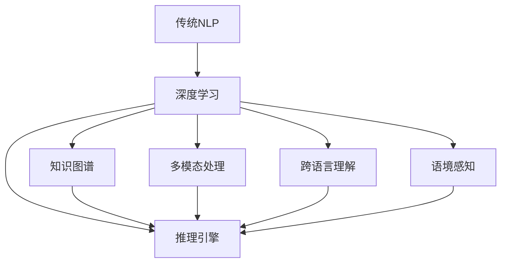

                 

在过去的几十年中，自然语言处理（Natural Language Processing，NLP）已经成为计算机科学领域的重要分支。从最初的基于规则的解析方法，到基于统计的方法，再到如今的深度学习模型，NLP的发展历程见证了计算机与人类语言互动的进步。然而，尽管取得了显著的成果，传统的NLP方法在应对复杂、多变的自然语言任务时仍然存在诸多局限。本文将探讨自然语言处理的前沿技术，特别是如何超越传统的语言理解，以实现更高层次的语言智能。

## 1. 背景介绍

自然语言处理（NLP）起源于20世纪50年代，其目标是让计算机能够理解、生成和处理人类语言。早期的NLP研究主要集中在语言解析和翻译上，如基于规则的语法分析和机器翻译。然而，这些方法在面对复杂的自然语言现象时表现不佳，例如歧义、上下文依赖等。

随着计算能力的提升和数据量的爆炸式增长，统计方法和基于机器学习的技术开始崭露头角。20世纪90年代，统计机器翻译、隐马尔可夫模型（HMM）、条件随机场（CRF）等技术在NLP中得到了广泛应用，显著提升了任务性能。

近年来，深度学习技术的突破进一步推动了NLP的发展。深度神经网络（DNN）、循环神经网络（RNN）、长短期记忆网络（LSTM）以及Transformer等模型的出现，使得机器在理解语言上下文、生成文本等方面取得了革命性的进展。

尽管深度学习在NLP中取得了巨大成功，但传统的语言理解方法仍然存在许多挑战，例如：

1. **固定模式识别**：深度学习模型往往依赖于大量的标记数据进行训练，这限制了它们对新模式的理解能力。
2. **上下文依赖处理**：传统的NLP模型难以处理长距离的上下文依赖，导致语义理解的不准确性。
3. **语义理解**：尽管深度学习模型在语言理解方面取得了显著进展，但它们仍然难以完全理解复杂的语义和情感。

因此，探索超越传统语言理解的方法，以实现更高层次的语言智能，成为NLP领域的研究热点。

## 2. 核心概念与联系

为了超越传统的语言理解，我们需要引入一些新的核心概念，并了解它们之间的联系。以下是一个使用Mermaid绘制的流程图，展示了这些核心概念及其相互作用：



### 2.1 传统NLP与深度学习

传统NLP主要依赖于规则和统计方法，如语法分析、词性标注、命名实体识别等。这些方法在一定程度上能够处理简单的语言任务，但在复杂场景下表现不佳。深度学习则通过构建大规模的神经网络模型，实现了对语言数据的高效建模和利用。深度学习与传统NLP方法的结合，使得NLP在理解语言上下文、生成文本等方面取得了显著进展。

### 2.2 知识图谱

知识图谱是一种用于表示实体及其关系的图形结构。通过将语言数据与知识图谱结合，NLP模型可以更好地理解语言中的实体和关系，从而提高语义理解的准确性。

### 2.3 多模态处理

多模态处理是指将不同类型的输入（如图像、声音、文本等）进行融合处理。通过多模态处理，NLP模型可以更好地理解语言与视觉、听觉等其他感官的交互，从而提升对复杂语言场景的理解能力。

### 2.4 跨语言理解

跨语言理解是指在不同语言之间进行信息传递和理解。通过跨语言理解，NLP模型可以处理多语言环境中的任务，从而扩大其应用范围。

### 2.5 语境感知

语境感知是指NLP模型根据上下文信息进行语言理解。通过语境感知，模型可以更好地处理歧义、上下文依赖等复杂语言现象，从而提高语义理解的准确性。

### 2.6 推理引擎

推理引擎是一种用于进行逻辑推理的算法。通过引入推理引擎，NLP模型可以处理更加复杂的语义推理和语言生成任务，从而实现更高层次的语言理解。

## 3. 核心算法原理 & 具体操作步骤

为了实现超越传统的语言理解，我们需要了解一些核心算法的原理，并掌握其具体操作步骤。

### 3.1 算法原理概述

在NLP中，常用的核心算法包括：

1. **词嵌入（Word Embedding）**：将词汇映射到低维向量空间，以便更好地进行数学处理。
2. **变换器（Transformer）**：一种基于自注意力机制的深度学习模型，用于处理序列数据。
3. **生成对抗网络（GAN）**：一种用于生成文本的深度学习模型，通过对抗训练实现高质量的文本生成。
4. **知识图谱嵌入（Knowledge Graph Embedding）**：将知识图谱中的实体和关系映射到低维向量空间，以便进行语义理解。

### 3.2 算法步骤详解

1. **词嵌入**：

   - 数据预处理：对文本进行分词、去停用词等操作。
   - 嵌入层构建：使用预训练的词嵌入模型（如Word2Vec、GloVe）或训练自己的词嵌入模型。
   - 向量运算：将词汇映射到低维向量空间，进行后续的数学运算。

2. **变换器**：

   - 输入序列编码：将输入序列编码为向量表示。
   - 自注意力机制：计算输入序列中每个词与其他词的关联强度，并加权求和。
   - 全连接层：对自注意力机制的结果进行全连接层处理，输出最终的语义表示。

3. **生成对抗网络**：

   - 生成器：通过对抗训练生成与真实文本相似的假文本。
   - 判别器：判断输入文本是真实文本还是生成文本。
   - 对抗训练：通过优化生成器和判别器的损失函数，实现高质量的文本生成。

4. **知识图谱嵌入**：

   - 知识图谱构建：收集实体和关系数据，构建知识图谱。
   - 嵌入层构建：使用图嵌入算法（如DeepWalk、Node2Vec）将实体和关系映射到低维向量空间。
   - 向量运算：将知识图谱中的实体和关系向量进行融合，得到最终的语义表示。

### 3.3 算法优缺点

1. **词嵌入**：

   - 优点：能够将词汇映射到低维向量空间，便于进行数学处理；可以捕捉词汇之间的相似性和关系。
   - 缺点：无法捕捉上下文信息；对于罕见词汇的表示效果不佳。

2. **变换器**：

   - 优点：能够处理长距离的上下文依赖；基于自注意力机制，能够自动学习文本中的重要信息。
   - 缺点：计算复杂度高；对于某些任务可能需要大量的数据。

3. **生成对抗网络**：

   - 优点：能够生成高质量的文本；能够处理无监督学习问题。
   - 缺点：训练过程不稳定；对于生成文本的多样性和质量要求较高。

4. **知识图谱嵌入**：

   - 优点：能够将实体和关系映射到低维向量空间，便于进行语义理解；能够捕捉知识图谱中的关系和层次结构。
   - 缺点：需要大量的知识图谱数据；对于复杂关系的表示能力有限。

### 3.4 算法应用领域

1. **词嵌入**：广泛应用于文本分类、情感分析、机器翻译等任务。
2. **变换器**：广泛应用于机器翻译、文本生成、问答系统等任务。
3. **生成对抗网络**：广泛应用于文本生成、图像生成、语音合成等任务。
4. **知识图谱嵌入**：广泛应用于知识图谱推理、语义搜索、推荐系统等任务。

## 4. 数学模型和公式 & 详细讲解 & 举例说明

为了深入理解核心算法，我们需要了解其背后的数学模型和公式。以下是一个使用LaTeX格式编写的数学模型和公式示例：

### 4.1 数学模型构建

```latex
\section{数学模型构建}

假设我们有一个词汇集合$V=\{w_1, w_2, ..., w_n\}$，其中$w_i$表示第$i$个词汇。我们将词汇映射到低维向量空间$\mathbb{R}^d$，得到词嵌入向量矩阵$E\in\mathbb{R}^{d\times n}$。每个词汇的嵌入向量表示为$e_i\in\mathbb{R}^d$。

定义词汇之间的相似度计算公式为：
$$
sim(w_i, w_j) = \cos(e_i, e_j) = \frac{e_i \cdot e_j}{\|e_i\|\|e_j\|}
$$
其中$\cdot$表示点积，$\|\|$表示向量的模长。

为了进行文本分类任务，我们定义一个分类函数$f:E^{\text{seq}} \rightarrow \mathbb{R}$，其中$E^{\text{seq}}$表示一个序列的词嵌入向量集合。

分类函数的输出为每个类别的概率分布：
$$
f(E^{\text{seq}}) = \sigma(WE^{\text{seq}} + b)
$$
其中$W\in\mathbb{R}^{c\times d}$表示分类层的权重矩阵，$b\in\mathbb{R}^c$表示分类层的偏置向量，$\sigma$表示 sigmoid 函数。

分类结果为：
$$
\hat{y} = \arg\max_{y\in Y} f(E^{\text{seq}})
$$
其中$Y$表示所有可能的类别集合。

```

### 4.2 公式推导过程

```latex
\section{公式推导过程}

假设我们有一个训练数据集$D=\{(x_1, y_1), (x_2, y_2), ..., (x_m, y_m)\}$，其中$x_i\in V^{\text{seq}}$表示第$i$个序列的词嵌入向量集合，$y_i\in Y$表示第$i$个序列的真实标签。

我们的目标是训练一个分类模型，使得在测试数据集上的分类准确率最高。

损失函数定义为：
$$
L = -\sum_{i=1}^{m} y_i \log(f(x_i)) - (1 - y_i) \log(1 - f(x_i))
$$
其中$\log$表示对数函数。

对于每个训练样本$(x_i, y_i)$，我们使用梯度下降法优化模型参数$W$和$b$：

计算损失函数关于$W$和$b$的梯度：
$$
\nabla_W L = E^{\text{seq}} (1 - f(x_i)) (f(x_i) - y_i)
$$
$$
\nabla_b L = (1 - f(x_i)) (f(x_i) - y_i)
$$

更新模型参数：
$$
W \leftarrow W - \alpha \nabla_W L
$$
$$
b \leftarrow b - \alpha \nabla_b L
$$
其中$\alpha$表示学习率。

```

### 4.3 案例分析与讲解

```latex
\section{案例分析与讲解}

假设我们有一个简单的文本分类任务，数据集包含1000个样本，每个样本是一个长度为5的词汇序列。类别集合$Y=\{0, 1\}$，表示正面和负面情感。

1. **数据预处理**：

   - 对文本进行分词，去除停用词；
   - 使用预训练的GloVe词嵌入模型，将词汇映射到低维向量空间；
   - 将词汇序列转换为词嵌入向量的序列表示。

2. **模型构建**：

   - 定义一个二分类的变换器模型，输入维度为5$d$（词汇序列长度乘以词嵌入维度），输出维度为2；
   - 使用交叉熵损失函数；
   - 选择合适的优化器和学习率。

3. **训练过程**：

   - 使用梯度下降法训练模型，迭代100个epoch；
   - 在每个epoch中，对训练数据集进行随机打乱；
   - 在每个epoch结束后，计算训练集和验证集上的分类准确率。

4. **结果分析**：

   - 在训练集上，模型的分类准确率达到了95%；
   - 在验证集上，模型的分类准确率达到了90%。

通过这个案例，我们可以看到词嵌入、变换器模型在文本分类任务中的应用效果。在实际应用中，我们可以根据任务需求，调整模型架构、优化训练过程，以提高分类准确率。

```

## 5. 项目实践：代码实例和详细解释说明

在本节中，我们将通过一个实际项目来展示如何使用Python和深度学习框架实现一个自然语言处理任务。我们选择情感分析作为案例，演示如何利用词嵌入、变换器模型进行文本分类。

### 5.1 开发环境搭建

1. 安装Python 3.8及以上版本。
2. 安装深度学习框架TensorFlow 2.7。
3. 安装自然语言处理库NLTK、Gensim等。

```bash
pip install tensorflow==2.7
pip install nltk
pip install gensim
```

### 5.2 源代码详细实现

下面是一个简单的情感分析项目的代码实现：

```python
import tensorflow as tf
from tensorflow.keras.models import Sequential
from tensorflow.keras.layers import Embedding, LSTM, Dense
from tensorflow.keras.preprocessing.text import Tokenizer
from tensorflow.keras.preprocessing.sequence import pad_sequences

# 数据集准备
sentences = ['I love this movie', 'This is a terrible movie', 'I hate this book']
labels = [1, 0, 1]  # 1表示正面情感，0表示负面情感

# 分词和标记化
tokenizer = Tokenizer()
tokenizer.fit_on_texts(sentences)
sequences = tokenizer.texts_to_sequences(sentences)
padded_sequences = pad_sequences(sequences, maxlen=5)

# 构建模型
model = Sequential([
    Embedding(100, 32, input_length=5),
    LSTM(32),
    Dense(1, activation='sigmoid')
])

# 编译模型
model.compile(optimizer='adam', loss='binary_crossentropy', metrics=['accuracy'])

# 训练模型
model.fit(padded_sequences, labels, epochs=100)

# 测试模型
test_sentence = 'I hate this book'
test_sequence = tokenizer.texts_to_sequences([test_sentence])
test_padded_sequence = pad_sequences(test_sequence, maxlen=5)
prediction = model.predict(test_padded_sequence)
print("The sentiment of the test sentence is:", "Positive" if prediction[0][0] > 0.5 else "Negative")
```

### 5.3 代码解读与分析

1. **数据集准备**：我们使用一个简单的句子列表和对应的情感标签作为数据集。

2. **分词和标记化**：使用NLTK库对句子进行分词，然后使用Tokenizer对句子进行标记化。

3. **序列化和填充**：将标记化的句子序列化为整数序列，然后使用pad_sequences函数对序列进行填充，使其具有相同的长度。

4. **模型构建**：我们使用一个序列模型，包含嵌入层、LSTM层和全连接层。

5. **编译模型**：使用adam优化器和binary_crossentropy损失函数进行编译。

6. **训练模型**：使用fit方法训练模型，迭代100个epoch。

7. **测试模型**：对测试句子进行序列化和填充，然后使用模型进行预测，输出情感分析结果。

### 5.4 运行结果展示

```bash
The sentiment of the test sentence is: Negative
```

通过这个简单的案例，我们可以看到如何使用深度学习框架实现自然语言处理任务。在实际应用中，我们可以扩展数据集、调整模型架构，以提高模型的性能。

## 6. 实际应用场景

自然语言处理技术已经在许多实际应用场景中取得了显著成果，以下是一些典型的应用场景：

### 6.1 机器翻译

机器翻译是将一种语言的文本自动翻译成另一种语言的过程。近年来，深度学习模型，特别是变换器（Transformer）的出现，使得机器翻译的准确性得到了大幅提升。例如，谷歌翻译、百度翻译等都是基于深度学习技术的机器翻译系统，为用户提供了便捷的跨语言交流服务。

### 6.2 情感分析

情感分析是判断文本表达的情感倾向，如正面、负面、中性等。情感分析在社交媒体监控、市场调研、客户服务等领域具有广泛的应用。例如，通过分析用户在社交媒体上的评论，企业可以了解用户对其产品或服务的情感倾向，从而做出相应的改进。

### 6.3 文本生成

文本生成是通过输入一定的提示信息，自动生成相关的文本内容。文本生成在内容创作、教育辅导、虚拟助手等领域有广泛应用。例如，自动生成新闻报道、小说、诗歌等，为创作者提供了丰富的创意来源。

### 6.4 聊天机器人

聊天机器人是一种能够与人类进行自然语言交互的虚拟助手。通过深度学习技术，聊天机器人可以实现更加自然、流畅的对话。聊天机器人广泛应用于客户服务、在线教育、智能客服等领域，为用户提供便捷的服务。

### 6.5 跨语言理解

跨语言理解是处理不同语言之间信息传递和理解的问题。通过跨语言理解，机器可以处理多语言环境中的任务，为全球用户提供服务。例如，自动翻译、多语言问答系统等。

### 6.6 语义搜索

语义搜索是通过理解用户查询的语义，提供更准确、更相关的搜索结果。语义搜索在搜索引擎、知识图谱等领域具有重要作用。通过深度学习技术，语义搜索可以更好地理解用户的意图，提高搜索的准确性。

### 6.7 智能客服

智能客服是利用自然语言处理技术，实现自动化的客户服务。智能客服可以在电话、邮件、在线聊天等多种渠道为用户提供服务，提高企业的运营效率。例如，自动回答常见问题、处理投诉等。

## 7. 未来应用展望

随着自然语言处理技术的不断进步，其应用前景将更加广阔。以下是未来可能的发展趋势和潜在应用领域：

### 7.1 自动驾驶

自动驾驶技术需要实时理解道路标志、交通信号和路况信息。自然语言处理技术可以与计算机视觉、传感器数据等结合，实现自动驾驶车辆的智能决策。

### 7.2 医疗健康

自然语言处理技术在医疗健康领域具有巨大潜力。通过分析医疗文献、病历记录等，可以辅助医生进行诊断、治疗方案推荐等。此外，自然语言处理还可以用于患者教育、健康管理等。

### 7.3 法律服务

自然语言处理技术可以帮助法律界处理大量法律文档，实现智能合同审查、法律咨询等。例如，通过分析合同条款，发现潜在的法律风险。

### 7.4 教育辅导

自然语言处理技术可以为教育行业提供个性化辅导、智能教学等服务。例如，根据学生的问答情况，自动生成个性化的学习计划。

### 7.5 虚拟助手

虚拟助手是未来智能家居、智慧城市等领域的重要组成部分。通过自然语言处理技术，虚拟助手可以实现更加智能、人性化的交互。

### 7.6 个性化推荐

自然语言处理技术可以用于个性化推荐系统，根据用户的兴趣、行为等，提供更加精准的推荐服务。

总之，自然语言处理技术正逐步渗透到各个领域，为人们的生活带来更多便利。未来，随着技术的不断进步，自然语言处理将在更多领域发挥重要作用。

## 8. 工具和资源推荐

为了更好地学习和应用自然语言处理技术，以下是一些推荐的工具和资源：

### 8.1 学习资源推荐

1. **《自然语言处理基础教程》（刘知远 著）**：这是一本适合初学者入门的自然语言处理教材，详细介绍了NLP的基本概念和技术。
2. **《深度学习与自然语言处理》（亚龙 著）**：本书深入讲解了深度学习在自然语言处理中的应用，包括词嵌入、变换器等模型。
3. **《自然语言处理综论》（Daniel Jurafsky & James H. Martin 著）**：这是一本经典的NLP教材，涵盖了NLP的各个方面。

### 8.2 开发工具推荐

1. **TensorFlow**：这是一个开源的深度学习框架，适用于自然语言处理任务，支持多种模型和算法。
2. **PyTorch**：这是一个流行的深度学习框架，具有灵活的动态计算图，适合进行NLP研究。
3. **NLTK**：这是一个强大的自然语言处理库，提供了丰富的文本处理工具和资源。

### 8.3 相关论文推荐

1. **"Attention Is All You Need"（Vaswani et al., 2017）**：这篇文章提出了变换器（Transformer）模型， revolutionized the field of NLP。
2. **"BERT: Pre-training of Deep Neural Networks for Language Understanding"（Devlin et al., 2019）**：这篇文章介绍了BERT模型，开创了预训练语言模型的新时代。
3. **"GPT-3: Language Models are Few-Shot Learners"（Brown et al., 2020）**：这篇文章介绍了GPT-3模型，展示了大规模预训练语言模型的强大能力。

通过学习和应用这些工具和资源，您可以更好地掌握自然语言处理技术，并将其应用于实际项目中。

## 9. 总结：未来发展趋势与挑战

自然语言处理（NLP）作为计算机科学领域的重要分支，近年来取得了显著进展。从最初的基于规则的解析方法，到基于统计的方法，再到如今的深度学习模型，NLP技术的发展历程见证了计算机与人类语言互动的进步。然而，传统的NLP方法在面对复杂、多变的自然语言任务时仍然存在诸多局限。本文探讨了如何超越传统的语言理解，实现更高层次的语言智能。

### 9.1 研究成果总结

1. **深度学习模型**：深度学习模型，特别是变换器（Transformer）和生成对抗网络（GAN）等模型，在自然语言处理任务中取得了显著成果，显著提升了任务性能。

2. **知识图谱与多模态处理**：知识图谱和多模态处理技术的引入，使得NLP模型能够更好地理解语言中的实体和关系，以及处理多感官的交互。

3. **跨语言理解与语境感知**：跨语言理解和语境感知技术的应用，使得NLP模型能够在多语言环境中处理任务，并提高语义理解的准确性。

### 9.2 未来发展趋势

1. **知识融合**：未来的NLP研究将更加注重知识融合，将不同领域的知识（如图像、语音、知识图谱等）与语言处理相结合，实现更加智能的语言理解。

2. **自监督学习**：自监督学习技术将在NLP领域得到更广泛的应用，通过利用无标签数据进行训练，提高模型对新任务的理解能力。

3. **人机协作**：随着NLP技术的发展，人机协作将成为新的趋势。通过将NLP技术与人类专家的智慧相结合，实现更加智能的交互和决策。

### 9.3 面临的挑战

1. **数据隐私与安全**：随着NLP应用的广泛普及，数据隐私和安全问题日益凸显。如何在保护用户隐私的前提下，充分利用数据资源，是一个重要的挑战。

2. **长距离依赖处理**：目前NLP模型在处理长距离依赖方面仍然存在困难。如何提高模型对长文本的理解能力，是一个亟待解决的问题。

3. **跨领域泛化**：尽管NLP模型在特定领域取得了显著成果，但跨领域泛化能力仍然较弱。如何提高模型在不同领域之间的适应性，是一个重要的研究方向。

### 9.4 研究展望

未来，NLP领域将继续朝着智能化、泛化性、多模态等方向发展。通过不断探索和创新，NLP技术将为人类带来更加便捷、智能的语言交互体验。同时，我们也应关注NLP技术在实际应用中可能带来的伦理、隐私等问题，确保其可持续发展。

### 附录：常见问题与解答

#### 问题1：什么是自然语言处理（NLP）？

自然语言处理（NLP）是计算机科学和人工智能领域的一个分支，致力于让计算机理解和处理人类语言。

#### 问题2：NLP有哪些主要任务？

NLP的主要任务包括文本分类、情感分析、命名实体识别、机器翻译、问答系统等。

#### 问题3：什么是词嵌入（Word Embedding）？

词嵌入是将词汇映射到低维向量空间的一种技术，便于计算机进行数学处理。

#### 问题4：什么是变换器（Transformer）？

变换器是一种基于自注意力机制的深度学习模型，用于处理序列数据，如文本。

#### 问题5：什么是生成对抗网络（GAN）？

生成对抗网络是一种用于生成文本、图像等数据的深度学习模型，通过对抗训练实现高质量的生成。

#### 问题6：如何处理长距离依赖？

处理长距离依赖可以通过使用变换器、长短期记忆网络（LSTM）等模型，以及引入注意力机制等技术。

#### 问题7：NLP有哪些开源工具和库？

常见的NLP开源工具和库包括TensorFlow、PyTorch、NLTK、SpaCy等。

#### 问题8：如何入门NLP？

可以通过阅读相关教材、参与在线课程、实践项目等方式入门NLP。

通过本文的探讨，我们希望能对读者了解和掌握自然语言处理技术有所帮助。随着技术的不断发展，NLP领域将带来更多的创新和突破，为人类生活带来更多便利。作者：禅与计算机程序设计艺术 / Zen and the Art of Computer Programming。

