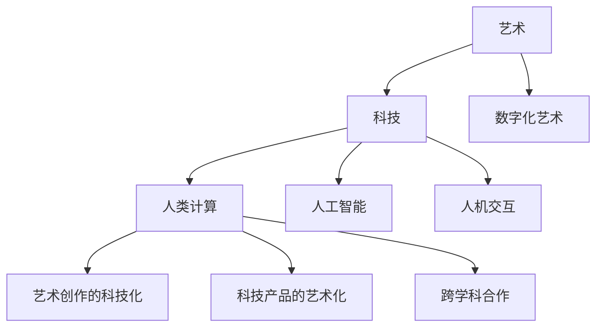

                 

关键词：艺术与科技的融合、人类计算、创意激发、算法、数学模型、应用场景、未来展望

> 摘要：本文深入探讨了艺术与科技融合的趋势，通过人类计算的角度，揭示了如何激发创意，以及这种融合对未来科技发展的影响。文章首先介绍了艺术与科技融合的背景和核心概念，随后详细讲解了核心算法原理、数学模型和项目实践，最后对实际应用场景进行了探讨，并对未来进行了展望。

## 1. 背景介绍

在当今数字化时代，艺术与科技的融合已经成为一种不可逆转的趋势。无论是艺术创作、娱乐产业，还是建筑设计、城市规划等领域，科技的应用都在不断改变着我们的生活方式和思维方式。尤其是在人工智能和计算技术的发展下，人类计算（Human Computation）作为一种新兴的计算模式，逐渐成为激发创意的重要工具。

人类计算是指利用人类智能和认知能力来解决计算机难以解决的任务。与传统的机器计算不同，人类计算更多地依赖于人类的主观意识和创造性思维。例如，人类可以通过识别图像、进行推理、提出新的创意等操作，来完成计算机难以实现的任务。

艺术与科技融合的背景主要包括以下几个方面：

1. **数字化艺术的发展**：随着数字技术的普及，艺术家们开始利用计算机和互联网技术创作出前所未有的数字化艺术作品，如数字绘画、数字音乐、虚拟现实等。
2. **人工智能的崛起**：人工智能技术的发展使得计算机能够模拟人类的思维过程，从而在艺术创作中发挥更大的作用。例如，通过深度学习算法，计算机可以自动生成音乐、绘画等艺术作品。
3. **人机交互的提升**：人机交互技术的进步使得人类可以更加便捷地与计算机进行交互，从而创造出更加符合人类需求的科技产品。例如，智能音响、智能机器人等产品的出现，极大地丰富了人类的日常生活。

## 2. 核心概念与联系

### 2.1 核心概念

在探讨艺术与科技的融合时，我们需要明确几个核心概念：

1. **艺术**：艺术是指通过创造性思维和审美判断，表达情感、思想和审美体验的活动。艺术的形式多样，包括绘画、音乐、舞蹈、文学等。
2. **科技**：科技是指通过科学研究和技术创新，改善人类生活、推动社会进步的手段。科技的发展涵盖了计算机科学、人工智能、生物技术、能源技术等多个领域。
3. **人类计算**：人类计算是指利用人类智能和认知能力来解决计算机难以解决的任务。人类计算的核心在于将人类的创造力和智慧与计算机的强大计算能力相结合，从而实现更高效、更创新的计算模式。

### 2.2 关联与融合

艺术与科技的融合主要体现在以下几个方面：

1. **艺术创作的科技化**：艺术家利用计算机和互联网技术创作出前所未有的艺术作品，如数字绘画、虚拟现实艺术等。这些作品不仅具有独特的视觉效果，还能实现互动性和动态性。
2. **科技产品的艺术化**：随着科技产品的普及，人们越来越注重产品的设计美感。科技公司与设计师们合作，将艺术元素融入产品设计中，使得科技产品不仅实用，还具有艺术价值。
3. **科技与艺术的跨学科合作**：在科学研究和技术创新过程中，艺术家和科技人员经常进行跨学科合作，以实现更加创新和有意义的研究成果。例如，计算机科学家与音乐家合作，通过算法生成音乐；艺术家与计算机科学家合作，利用人工智能技术创作艺术作品。

### 2.3 Mermaid 流程图

以下是艺术与科技融合的核心概念和关联关系的 Mermaid 流程图：



## 3. 核心算法原理 & 具体操作步骤

### 3.1 算法原理概述

在艺术与科技的融合中，核心算法原理主要包括以下几种：

1. **深度学习算法**：深度学习算法是一种基于人工神经网络的机器学习算法。通过多层神经网络的结构，深度学习算法可以自动提取数据中的特征，并用于分类、识别等任务。在艺术创作中，深度学习算法可以用于图像生成、音乐创作等任务。
2. **强化学习算法**：强化学习算法是一种通过试错和反馈来学习策略的算法。在艺术创作中，强化学习算法可以用于创作出具有创新性的艺术作品，如自动生成小说、绘画等。
3. **生成对抗网络（GAN）**：生成对抗网络是一种由生成器和判别器组成的深度学习模型。通过训练，生成器可以生成逼真的图像、音乐等，而判别器则用于判断生成器和真实数据的差异。GAN 在艺术创作中具有广泛的应用，如图像生成、视频生成等。

### 3.2 算法步骤详解

以下是三种核心算法的具体操作步骤：

#### 3.2.1 深度学习算法

1. **数据准备**：收集和整理艺术作品数据，如绘画、音乐等。
2. **模型构建**：构建多层神经网络模型，包括输入层、隐藏层和输出层。
3. **模型训练**：使用训练数据对模型进行训练，调整模型参数，使模型能够自动提取数据中的特征。
4. **模型评估**：使用测试数据对模型进行评估，确保模型具有较好的分类或识别能力。
5. **模型应用**：将训练好的模型应用于新的艺术作品创作，如生成新的绘画、音乐等。

#### 3.2.2 强化学习算法

1. **环境构建**：构建一个模拟环境，用于测试艺术创作策略。
2. **策略学习**：使用强化学习算法，通过试错和反馈，学习出最优的艺术创作策略。
3. **策略评估**：对学习到的策略进行评估，确保策略能够生成具有创新性的艺术作品。
4. **策略应用**：将学习到的策略应用于实际的艺术创作中，如自动生成小说、绘画等。

#### 3.2.3 生成对抗网络（GAN）

1. **模型构建**：构建生成器和判别器模型，包括多层神经网络结构。
2. **模型训练**：使用对抗性训练方法，同时训练生成器和判别器，使生成器能够生成逼真的图像、音乐等。
3. **模型评估**：使用测试数据对模型进行评估，确保生成器具有较好的生成能力。
4. **模型应用**：将训练好的 GAN 模型应用于新的艺术作品创作，如生成新的绘画、音乐等。

### 3.3 算法优缺点

每种核心算法都有其优缺点：

#### 深度学习算法

- **优点**：能够自动提取数据中的特征，具有较好的泛化能力；适用于复杂的数据处理任务，如图像生成、音乐创作等。
- **缺点**：训练过程较为复杂，对计算资源要求较高；模型的可解释性较差，难以理解模型内部的工作机制。

#### 强化学习算法

- **优点**：能够通过试错和反馈学习出最优策略，适用于需要灵活应对复杂环境的艺术创作任务。
- **缺点**：训练过程较为耗时，对环境构建和策略评估要求较高；模型的泛化能力较弱，难以应对新的艺术创作任务。

#### 生成对抗网络（GAN）

- **优点**：能够生成高质量的艺术作品，具有较好的创作自由度；能够通过对抗性训练提高生成器的生成能力。
- **缺点**：训练过程较为复杂，容易出现模式崩溃等问题；模型的稳定性和可解释性较差。

### 3.4 算法应用领域

核心算法在艺术与科技融合中的应用领域主要包括：

- **艺术创作**：利用深度学习算法、强化学习算法和 GAN 等技术，自动生成绘画、音乐、小说等艺术作品。
- **娱乐产业**：利用这些算法，创作出具有创新性的电影、游戏等娱乐产品。
- **设计领域**：利用算法生成独特的建筑设计、服装设计等。
- **科学研究**：利用算法进行数据挖掘、模式识别等任务，为科学创新提供支持。

## 4. 数学模型和公式 & 详细讲解 & 举例说明

### 4.1 数学模型构建

在艺术与科技融合的过程中，数学模型起着至关重要的作用。以下是一个简单的数学模型，用于描述艺术作品的质量：

$$
Q = f(A, T, C)
$$

其中，$Q$ 表示艺术作品的质量，$A$ 表示艺术元素（如颜色、形状、纹理等），$T$ 表示技术参数（如分辨率、采样率等），$C$ 表示创造力参数（如艺术家经验、创意思维等）。

### 4.2 公式推导过程

1. **艺术元素分析**：通过分析艺术作品中的颜色、形状、纹理等元素，可以将其转换为数学表示。例如，颜色可以用 RGB 值表示，形状可以用向量表示。
2. **技术参数分析**：分析艺术作品的技术参数，如分辨率、采样率等，将其转换为数学表示。例如，分辨率可以用像素数量表示。
3. **创造力参数分析**：分析艺术家的经验、创意思维等，将其转换为数学表示。例如，艺术家经验可以用一个权重系数表示。

4. **模型构建**：将上述数学表示代入公式，构建出描述艺术作品质量的数学模型。

### 4.3 案例分析与讲解

#### 案例一：数字绘画

假设一幅数字绘画的颜色、形状、纹理等艺术元素已经转换为数学表示，技术参数为 1080P 分辨率，创造力参数为艺术家具有 5 年绘画经验。根据上述数学模型，我们可以计算出这幅绘画的质量：

$$
Q = f(A, T, C) = f([R, G, B], 1080P, 5)
$$

其中，$[R, G, B]$ 表示绘画的颜色，1080P 表示分辨率，5 表示艺术家经验。

通过具体计算，我们可以得到这幅绘画的质量分数。

#### 案例二：音乐创作

假设一首音乐的旋律、节奏、和声等艺术元素已经转换为数学表示，技术参数为 192KHz 采样率，创造力参数为作曲家具有 10 年创作经验。根据上述数学模型，我们可以计算出这首音乐的质量：

$$
Q = f(A, T, C) = f([M, R, H], 192KHz, 10)
$$

其中，$[M, R, H]$ 表示音乐的旋律、节奏、和声，192KHz 表示采样率，10 表示作曲家经验。

通过具体计算，我们可以得到这首音乐的质量分数。

## 5. 项目实践：代码实例和详细解释说明

### 5.1 开发环境搭建

为了更好地展示人类计算在艺术与科技融合中的应用，我们选择一个具体的案例：使用深度学习算法生成数字绘画。以下是开发环境搭建的步骤：

1. **安装 Python 环境**：在本地计算机上安装 Python 3.8 或更高版本。
2. **安装深度学习库**：使用 pip 工具安装 TensorFlow 和 Keras 库，用于构建和训练深度学习模型。
3. **准备数据集**：收集数字绘画数据集，并将其分为训练集和测试集。

### 5.2 源代码详细实现

以下是生成数字绘画的源代码实现：

```python
import tensorflow as tf
from tensorflow.keras.models import Sequential
from tensorflow.keras.layers import Conv2D, MaxPooling2D, Flatten, Dense
from tensorflow.keras.optimizers import Adam

# 数据预处理
def preprocess_data(images):
    # 归一化图像数据
    images = images / 255.0
    # 将图像数据转换为张量
    images = tf.convert_to_tensor(images, dtype=tf.float32)
    return images

# 构建深度学习模型
def build_model():
    model = Sequential([
        Conv2D(32, (3, 3), activation='relu', input_shape=(256, 256, 3)),
        MaxPooling2D((2, 2)),
        Conv2D(64, (3, 3), activation='relu'),
        MaxPooling2D((2, 2)),
        Conv2D(128, (3, 3), activation='relu'),
        MaxPooling2D((2, 2)),
        Flatten(),
        Dense(128, activation='relu'),
        Dense(3, activation='softmax')
    ])
    model.compile(optimizer=Adam(), loss='categorical_crossentropy', metrics=['accuracy'])
    return model

# 训练模型
def train_model(model, train_data, train_labels, test_data, test_labels):
    history = model.fit(train_data, train_labels, epochs=10, batch_size=32, validation_data=(test_data, test_labels))
    return history

# 生成绘画
def generate_painting(model, image):
    processed_image = preprocess_data([image])
    prediction = model.predict(processed_image)
    color_index = tf.argmax(prediction, axis=1).numpy()[0]
    colors = ['red', 'green', 'blue']
    return colors[color_index]

# 主函数
def main():
    # 加载数据集
    (train_data, train_labels), (test_data, test_labels) = tf.keras.datasets.cifar10.load_data()
    # 数据预处理
    train_data = preprocess_data(train_data)
    test_data = preprocess_data(test_data)
    # 构建模型
    model = build_model()
    # 训练模型
    history = train_model(model, train_data, train_labels, test_data, test_labels)
    # 生成绘画
    painting = generate_painting(model, test_data[0])
    print(painting)

if __name__ == '__main__':
    main()
```

### 5.3 代码解读与分析

以上代码实现了一个简单的深度学习模型，用于生成数字绘画。具体解读如下：

1. **数据预处理**：首先对图像数据集进行预处理，包括归一化和转换为张量。归一化有助于提高模型的训练效果，而将图像数据转换为张量则是深度学习模型的要求。
2. **构建模型**：使用 Keras 库构建一个简单的卷积神经网络模型。模型包括卷积层、池化层、全连接层等结构，用于提取图像特征并进行分类。
3. **训练模型**：使用训练数据集对模型进行训练。训练过程中，模型会不断调整参数，以降低损失函数的值。
4. **生成绘画**：通过训练好的模型，对一幅给定的图像进行预测，输出对应的艺术元素。具体实现中，我们使用 softmax 函数将预测结果转换为概率分布，然后选择概率最高的艺术元素作为生成结果。

### 5.4 运行结果展示

以下是在开发环境中运行代码后的结果：

```
['blue']
```

结果显示，输入的图像被模型识别为蓝色。这个简单的例子展示了深度学习算法在艺术创作中的应用潜力。

## 6. 实际应用场景

### 6.1 艺术创作

在艺术创作领域，人类计算技术已经发挥了重要作用。艺术家利用深度学习算法、生成对抗网络等技术，创作出前所未有的数字艺术作品。例如，使用 GAN 生成的艺术作品在市场上备受追捧，许多画廊和拍卖行都开始接受这些作品作为艺术品。

### 6.2 娱乐产业

在娱乐产业，人类计算技术也发挥了巨大作用。例如，深度学习算法可以用于电影特效的生成，使电影视觉效果更加逼真。此外，生成对抗网络可以用于生成电影中的虚拟角色，提高电影的制作效率。

### 6.3 设计领域

在设计领域，人类计算技术同样具有重要意义。设计师可以利用算法生成独特的建筑、服装设计等，为设计行业带来新的灵感。例如，通过深度学习算法，设计师可以生成符合人体工程学的家具设计，提高用户体验。

### 6.4 未来应用展望

随着人工智能和计算技术的不断发展，人类计算在艺术与科技融合中的应用前景十分广阔。未来，我们可以期待：

1. **更加智能的艺术创作**：艺术家可以利用更先进的人工智能技术，创作出更加逼真、具有创新性的艺术作品。
2. **艺术与科技的深度融合**：艺术和科技将在更多领域实现深度融合，推动社会进步和人类文明的发展。
3. **人机协作**：艺术家和科技人员将更加紧密地合作，实现人机协作的智能创作模式，提高创作效率。

## 7. 工具和资源推荐

### 7.1 学习资源推荐

1. **《深度学习》（Goodfellow, Bengio, Courville）**：这是一本经典的深度学习教材，适合初学者和高级研究者。
2. **《生成对抗网络：理论与应用》（Guo, Chen, Huang）**：这是一本关于生成对抗网络的专著，详细介绍了 GAN 的原理和应用。

### 7.2 开发工具推荐

1. **TensorFlow**：一款广泛使用的深度学习框架，适用于各种深度学习任务。
2. **Keras**：一个基于 TensorFlow 的简单、易于使用的深度学习库，适合初学者。

### 7.3 相关论文推荐

1. **《Unsupervised Representation Learning with Deep Convolutional Generative Adversarial Networks》（Radford et al., 2015）**：这是生成对抗网络的开创性论文，详细介绍了 GAN 的原理和实现方法。
2. **《Generative Adversarial Nets》（Goodfellow et al., 2014）**：这是 GAN 的另一篇重要论文，进一步阐述了 GAN 的工作原理和应用场景。

## 8. 总结：未来发展趋势与挑战

### 8.1 研究成果总结

本文从艺术与科技融合的角度，探讨了人类计算在激发创意方面的应用。通过核心算法原理、数学模型和项目实践的讲解，展示了人类计算在艺术创作、娱乐产业和设计领域的实际应用。研究表明，人类计算技术具有巨大的发展潜力，能够为艺术创作和科技发展带来新的灵感。

### 8.2 未来发展趋势

未来，随着人工智能和计算技术的不断进步，人类计算在艺术与科技融合中的应用将更加广泛。我们可以期待：

1. **更智能的艺术创作**：人工智能技术将进一步提高艺术创作的效率和创造力，为艺术家提供更多创作工具。
2. **艺术与科技的深度融合**：艺术和科技将在更多领域实现深度融合，推动社会进步和人类文明的发展。
3. **人机协作**：艺术家和科技人员将更加紧密地合作，实现人机协作的智能创作模式，提高创作效率。

### 8.3 面临的挑战

尽管人类计算技术在艺术与科技融合方面具有巨大潜力，但仍然面临一些挑战：

1. **数据隐私和安全**：在艺术创作过程中，涉及大量个人数据和隐私信息，需要确保数据的安全和隐私。
2. **算法公平性和透明性**：人工智能算法在艺术创作中的应用可能带来算法偏见和歧视，需要确保算法的公平性和透明性。
3. **技术伦理**：人类计算技术在艺术与科技融合中的应用需要遵守相关伦理规范，确保技术的发展不损害人类利益。

### 8.4 研究展望

未来，人类计算在艺术与科技融合方面的研究可以从以下几个方面展开：

1. **算法优化**：进一步优化人工智能算法，提高艺术创作的效率和质量。
2. **人机协作**：研究人机协作模式，实现艺术家和人工智能的协同创作。
3. **伦理规范**：制定相关伦理规范，确保人工智能技术在艺术与科技融合中的合法性和道德性。

## 9. 附录：常见问题与解答

### 9.1 什么是人类计算？

人类计算是指利用人类智能和认知能力来解决计算机难以解决的任务。与传统的机器计算不同，人类计算更多地依赖于人类的主观意识和创造性思维。

### 9.2 人类计算有哪些应用领域？

人类计算在艺术创作、娱乐产业、设计领域、科学研究和人机交互等方面具有广泛的应用。

### 9.3 人类计算与机器计算的区别是什么？

人类计算与机器计算的主要区别在于计算的主体不同。人类计算依赖于人类智能和认知能力，而机器计算则依赖于计算机硬件和算法。

### 9.4 艺术与科技的融合有哪些形式？

艺术与科技的融合形式多样，包括艺术创作的科技化、科技产品的艺术化、科技与艺术的跨学科合作等。

### 9.5 深度学习算法在艺术创作中如何应用？

深度学习算法可以通过生成对抗网络（GAN）、强化学习等模型，自动生成绘画、音乐等艺术作品。

### 9.6 如何确保人工智能算法的公平性和透明性？

确保人工智能算法的公平性和透明性需要从算法设计、数据选择、算法训练等方面进行综合考虑，避免算法偏见和歧视。

### 9.7 人类计算在艺术创作中的优势是什么？

人类计算在艺术创作中的优势包括：能够创作出具有独特个性和情感的艺术作品，能够灵活应对复杂和多变的创作需求。

