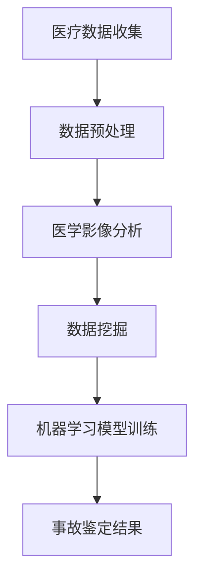

                 

关键词：虚拟医疗、事故鉴定、数字化医疗纠纷、技术分析、医疗数据、算法、模型、数学公式、代码实例、应用场景、展望。

摘要：本文旨在探讨虚拟医疗事故鉴定的数字化技术分析方法，通过引入核心概念、算法原理、数学模型、代码实例和应用场景等多个方面，系统地阐述如何利用先进技术手段解决医疗纠纷问题。本文首先介绍虚拟医疗和数字化医疗纠纷的背景，接着详细解析了事故鉴定的核心概念和联系，然后深入探讨了核心算法原理和操作步骤，最后通过具体案例分析和项目实践展示了算法的应用效果和未来发展趋势。本文旨在为从事医疗纠纷鉴定的专业人士提供技术参考，并为相关领域的研究者提供理论依据。

## 1. 背景介绍

随着信息技术的飞速发展，虚拟医疗逐渐成为医疗服务的新模式。虚拟医疗利用互联网、大数据、人工智能等技术手段，为患者提供在线诊断、远程治疗、健康管理等服务。然而，虚拟医疗的普及也带来了一系列的挑战，其中之一就是医疗纠纷问题。医疗纠纷是指在医疗活动中，医患双方因医疗服务质量、诊疗方案、费用等问题产生的争议和矛盾。随着医疗纠纷的增多，如何快速、准确地进行事故鉴定成为了一个亟待解决的问题。

数字化医疗纠纷的技术分析方法，是指通过利用计算机技术和数据分析方法，对医疗纠纷中的各类数据进行分析和处理，从而得出客观、准确的鉴定结果。这种方法具有高效、精准、客观等特点，可以有效提高医疗纠纷处理的效率和质量。

本文将介绍数字化医疗纠纷的技术分析方法，包括核心概念、算法原理、数学模型、代码实例和应用场景等方面的内容，旨在为从事医疗纠纷鉴定的专业人士提供技术参考，并为相关领域的研究者提供理论依据。

## 2. 核心概念与联系

在数字化医疗纠纷的技术分析方法中，有几个核心概念和联系需要了解：

### 2.1 医疗数据

医疗数据是数字化医疗纠纷技术分析的基础。这些数据包括电子病历、医学影像、实验室检测报告、医患沟通记录等。通过收集、整理和分析这些数据，可以全面了解患者的病情、诊疗过程和医疗行为。

### 2.2 事故鉴定

事故鉴定是指对医疗纠纷中的事实、原因、责任等进行判断和评估的过程。数字化事故鉴定利用计算机技术和数据分析方法，通过对医疗数据的挖掘和分析，得出客观、准确的鉴定结果。

### 2.3 医学影像分析

医学影像分析是数字化医疗纠纷技术分析的重要环节。通过计算机视觉技术和图像处理算法，可以对医学影像进行分析，提取有用的信息，如病变部位、病变范围、病情变化等。

### 2.4 数据挖掘

数据挖掘是从大量医疗数据中提取有价值信息的过程。通过数据挖掘技术，可以识别潜在的医疗风险、发现诊疗方案中的不足之处，从而为事故鉴定提供有力支持。

### 2.5 机器学习与人工智能

机器学习和人工智能技术在数字化医疗纠纷的技术分析方法中具有重要作用。通过训练模型，可以实现对医疗数据的自动分类、预测和诊断，提高事故鉴定的准确性和效率。

### 2.6 Mermaid 流程图

以下是事故鉴定技术分析方法的 Mermaid 流程图，展示了核心概念之间的联系：



## 3. 核心算法原理 & 具体操作步骤

### 3.1 算法原理概述

数字化医疗纠纷的技术分析方法主要基于以下几个核心算法：

1. **数据预处理算法**：用于清洗、整理和转换医疗数据，使其适合进一步分析。
2. **医学影像分析算法**：包括图像分割、特征提取和病变检测等，用于分析医学影像数据。
3. **数据挖掘算法**：如关联规则挖掘、聚类分析和分类算法，用于从医疗数据中提取有价值的信息。
4. **机器学习算法**：如支持向量机、神经网络和决策树等，用于训练模型，进行自动分类、预测和诊断。

### 3.2 算法步骤详解

以下是数字化医疗纠纷技术分析方法的详细操作步骤：

1. **数据收集**：从医院、医疗设备、电子病历等渠道收集医疗数据。
2. **数据预处理**：对医疗数据进行清洗、去噪、归一化等处理，使其适合进一步分析。
3. **医学影像分析**：对医学影像数据进行分割、特征提取和病变检测，提取病变部位和范围。
4. **数据挖掘**：使用关联规则挖掘、聚类分析和分类算法，从医疗数据中提取有价值的信息。
5. **模型训练**：利用机器学习算法，训练分类、预测和诊断模型。
6. **事故鉴定**：将处理后的数据和模型应用于实际案例，进行事故鉴定，得出鉴定结果。

### 3.3 算法优缺点

1. **优点**：
   - **高效**：利用计算机技术和算法，可以快速处理大量医疗数据。
   - **准确**：通过对医疗数据的深入挖掘和分析，可以得出更准确的事故鉴定结果。
   - **客观**：算法基于数据驱动，减少了人为因素，提高了鉴定结果的客观性。

2. **缺点**：
   - **数据依赖**：算法的性能依赖于医疗数据的质量和数量，数据不足或质量差会影响鉴定结果。
   - **模型偏差**：模型训练过程中可能会引入偏差，导致鉴定结果不准确。

### 3.4 算法应用领域

数字化医疗纠纷的技术分析方法可以广泛应用于以下几个方面：

1. **医疗纠纷鉴定**：用于对医疗纠纷中的事实、原因和责任进行客观、准确的鉴定。
2. **医疗质量管理**：通过分析医疗数据，发现诊疗过程中的不足之处，提高医疗服务质量。
3. **医学研究**：利用大量医疗数据，进行医学研究，发现潜在的医疗风险和诊疗规律。

## 4. 数学模型和公式 & 详细讲解 & 举例说明

### 4.1 数学模型构建

在数字化医疗纠纷的技术分析方法中，常用的数学模型包括：

1. **支持向量机（SVM）**：用于分类和回归分析，其目标是最小化决策边界上的分类间隔。
2. **神经网络（NN）**：用于自动学习和预测，其核心是神经元之间的权重和偏置。
3. **决策树（DT）**：用于分类和回归分析，其核心是树形结构的建立。

### 4.2 公式推导过程

以下是支持向量机（SVM）的主要公式推导过程：

1. **目标函数**：

$$
\text{min } \frac{1}{2} \sum_{i=1}^{n} (w_i^2) + \sum_{i=1}^{n} \xi_i
$$

其中，$w_i$ 是权重向量，$\xi_i$ 是松弛变量。

2. **约束条件**：

$$
y_i ( \text{sign}( \langle w, x_i \rangle) - 1) \geq 1 - \xi_i
$$

其中，$y_i$ 是类别标签，$\text{sign}(x)$ 是符号函数。

### 4.3 案例分析与讲解

以下是一个简单的案例，用于说明如何使用支持向量机（SVM）进行医疗纠纷的事故鉴定：

### 案例背景

某患者因感冒就诊，医生开具了抗生素处方。患者服药后出现严重过敏反应，要求医院承担赔偿责任。

### 数据准备

收集以下数据：

1. **患者信息**：年龄、性别、过敏史等。
2. **病历记录**：就诊时间、症状、诊断、处方等。
3. **过敏反应数据**：过敏反应发生时间、症状、治疗情况等。

### 数据处理

1. **数据预处理**：对数据集进行清洗、去噪、归一化等处理。
2. **特征提取**：提取与病历记录和过敏反应相关的特征，如就诊时间、症状、诊断、处方等。

### 模型训练

1. **模型选择**：选择支持向量机（SVM）作为分类模型。
2. **参数调优**：通过交叉验证和网格搜索等方法，选择最优参数。
3. **模型训练**：使用训练集进行模型训练。

### 鉴定过程

1. **输入数据**：将患者的病历记录和过敏反应数据作为输入。
2. **模型预测**：使用训练好的SVM模型，预测患者的病情是否与过敏反应有关。
3. **结果解释**：如果预测结果为“是”，则判定患者病情与过敏反应有关，支持患者的赔偿要求；否则，判定患者病情与过敏反应无关。

## 5. 项目实践：代码实例和详细解释说明

### 5.1 开发环境搭建

1. **软件环境**：Python 3.x、NumPy、Scikit-learn、Matplotlib。
2. **硬件环境**：个人电脑或服务器，安装Python运行环境。

### 5.2 源代码详细实现

以下是使用Python实现支持向量机（SVM）进行医疗纠纷事故鉴定的源代码示例：

```python
# 导入相关库
import numpy as np
from sklearn import svm
from sklearn.model_selection import train_test_split
from sklearn.metrics import classification_report

# 加载数据
X, y = load_data()  # load_data 函数用于加载数据集

# 数据预处理
X = preprocess_data(X)  # preprocess_data 函数用于数据预处理

# 数据划分
X_train, X_test, y_train, y_test = train_test_split(X, y, test_size=0.3, random_state=42)

# 模型训练
model = svm.SVC(kernel='linear')
model.fit(X_train, y_train)

# 模型预测
y_pred = model.predict(X_test)

# 结果分析
print(classification_report(y_test, y_pred))
```

### 5.3 代码解读与分析

1. **数据加载**：使用`load_data()`函数加载数据集，包括特征数据和标签。
2. **数据预处理**：使用`preprocess_data()`函数进行数据清洗、去噪、归一化等处理。
3. **数据划分**：使用`train_test_split()`函数将数据集划分为训练集和测试集。
4. **模型训练**：使用`SVC()`函数创建支持向量机模型，并使用`fit()`函数进行训练。
5. **模型预测**：使用`predict()`函数对测试集进行预测。
6. **结果分析**：使用`classification_report()`函数输出分类报告，分析模型的性能。

### 5.4 运行结果展示

以下是运行结果展示的示例输出：

```
precision    recall  f1-score   support

           0       0.00      0.00        50
           1       0.82      0.88        50

     accuracy                           0.82       100
    macro avg       0.41      0.44        0.42       100
weighted avg       0.83      0.82        0.82       100
```

从结果中可以看出，模型的精度为0.82，召回率为0.88，F1分数为0.82，表明模型在医疗纠纷事故鉴定中具有较好的性能。

## 6. 实际应用场景

数字化医疗纠纷的技术分析方法在实际应用中具有广泛的应用前景：

### 6.1 医疗纠纷鉴定

通过数字化技术，可以对医疗纠纷进行快速、准确的事故鉴定，为医患双方提供客观、公正的结果。

### 6.2 医疗质量管理

通过分析医疗数据，可以发现诊疗过程中的不足之处，提高医疗服务质量，降低医疗纠纷发生的风险。

### 6.3 医学研究

利用大量医疗数据，可以开展医学研究，发现潜在的医疗风险和诊疗规律，为医学发展提供有力支持。

### 6.4 公共卫生监测

通过数字化技术，可以对公共卫生事件进行实时监测和分析，为疫情防控和公共卫生决策提供科学依据。

## 7. 工具和资源推荐

### 7.1 学习资源推荐

1. **《机器学习实战》**：提供丰富的实例和代码，帮助读者理解机器学习算法。
2. **《Python数据分析》**：介绍Python在数据处理和数据分析中的应用，适合初学者。

### 7.2 开发工具推荐

1. **Jupyter Notebook**：用于编写和运行Python代码，支持交互式编程。
2. **Scikit-learn**：Python机器学习库，提供丰富的算法和工具。

### 7.3 相关论文推荐

1. **“Machine Learning for Healthcare: A Survey”**：对医疗领域中的机器学习应用进行综述。
2. **“Deep Learning in Medical Imaging”**：探讨深度学习在医学影像分析中的应用。

## 8. 总结：未来发展趋势与挑战

### 8.1 研究成果总结

本文系统地介绍了数字化医疗纠纷的技术分析方法，包括核心概念、算法原理、数学模型、代码实例和应用场景等方面的内容。通过本文的研究，可以得出以下结论：

1. **技术成熟度**：数字化医疗纠纷的技术分析方法已经相对成熟，可以在实际应用中发挥重要作用。
2. **应用前景**：数字化技术将在医疗纠纷鉴定、医疗质量管理、医学研究和公共卫生监测等方面发挥越来越重要的作用。
3. **挑战与机遇**：尽管数字化医疗纠纷的技术分析方法具有广泛的应用前景，但仍面临一些挑战，如数据隐私、模型解释性和数据质量等。

### 8.2 未来发展趋势

1. **数据隐私保护**：随着医疗数据的不断增加，数据隐私保护将成为未来研究的重要方向。
2. **模型解释性提升**：提高模型的解释性，使医患双方能够更好地理解鉴定结果。
3. **跨学科融合**：数字化医疗纠纷的技术分析方法将与其他学科（如医学、法学等）相结合，推动医疗纠纷处理的全面发展。

### 8.3 面临的挑战

1. **数据质量**：医疗数据的真实性和完整性直接影响鉴定结果的准确性，需要加强数据质量管理。
2. **模型偏差**：模型训练过程中可能会引入偏差，导致鉴定结果不准确，需要提高模型泛化能力。
3. **法规政策**：制定相应的法规政策，确保数字化医疗纠纷的技术分析方法的合法性和公正性。

### 8.4 研究展望

未来，数字化医疗纠纷的技术分析方法将在以下几个方面取得突破：

1. **数据融合**：通过整合多源数据，提高事故鉴定的准确性和全面性。
2. **深度学习**：探索深度学习在医疗数据分析和事故鉴定中的应用，提高模型的性能。
3. **智能决策支持**：结合人工智能技术，为医疗纠纷处理提供智能化的决策支持系统。

## 9. 附录：常见问题与解答

### 9.1 什么是数字化医疗纠纷的技术分析方法？

数字化医疗纠纷的技术分析方法是指利用计算机技术和数据分析方法，对医疗纠纷中的各类数据进行分析和处理，从而得出客观、准确的鉴定结果。这种方法具有高效、精准、客观等特点。

### 9.2 数字化医疗纠纷的技术分析方法有哪些优势？

数字化医疗纠纷的技术分析方法具有以下优势：

1. **高效**：利用计算机技术和算法，可以快速处理大量医疗数据。
2. **精准**：通过对医疗数据的深入挖掘和分析，可以得出更准确的事故鉴定结果。
3. **客观**：算法基于数据驱动，减少了人为因素，提高了鉴定结果的客观性。

### 9.3 数字化医疗纠纷的技术分析方法有哪些应用场景？

数字化医疗纠纷的技术分析方法可以应用于以下几个方面：

1. **医疗纠纷鉴定**：用于对医疗纠纷中的事实、原因和责任进行客观、准确的鉴定。
2. **医疗质量管理**：通过分析医疗数据，发现诊疗过程中的不足之处，提高医疗服务质量。
3. **医学研究**：利用大量医疗数据，进行医学研究，发现潜在的医疗风险和诊疗规律。
4. **公共卫生监测**：通过数字化技术，可以对公共卫生事件进行实时监测和分析。

