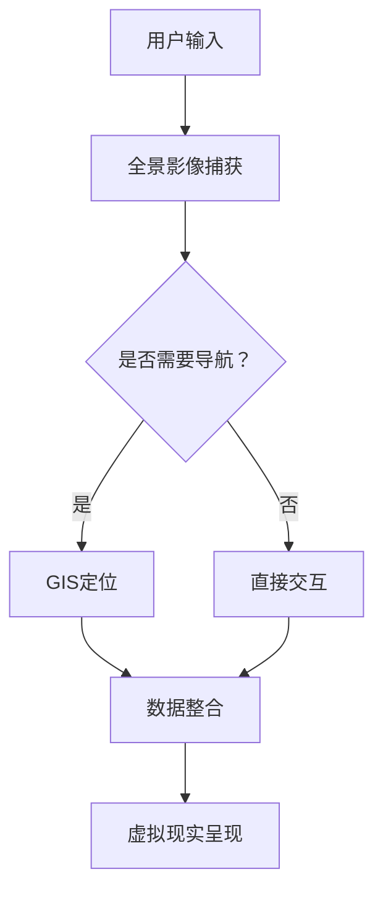

                 

关键词：虚拟现实、旅游创业、AR/VR技术、用户体验、全景影像、地理信息系统、人工智能

摘要：本文将探讨虚拟现实（VR）在旅游行业中的应用，特别是在旅游创业领域的潜力。通过介绍VR技术的核心概念、算法原理、数学模型以及具体实践案例，本文旨在揭示如何利用VR技术为用户提供沉浸式旅游体验，并展望虚拟现实旅游创业的未来发展。

## 1. 背景介绍

虚拟现实（VR）和增强现实（AR）技术近年来取得了显著的进展，为各行业带来了革命性的变革。在旅游行业，这些技术尤其具有巨大的应用潜力。虚拟现实技术通过模拟真实世界的场景，为用户提供了前所未有的沉浸式体验。这种体验不仅让用户在家中就能感受到异国风情，还能在虚拟环境中进行探索和学习。

旅游创业领域一直以来都在寻求创新的商业模式和技术应用来提升用户体验。随着VR技术的成熟，越来越多的创业者开始探索如何将虚拟现实应用于旅游服务中。从虚拟旅游展览到在线旅游平台，VR技术正在逐渐改变传统旅游行业的面貌。

本文将从以下几个方面展开讨论：

1. 虚拟现实技术在旅游行业的核心概念和原理。
2. VR技术在旅游创业中的具体应用和实践案例。
3. 虚拟现实旅游创业的未来发展趋势和挑战。

通过本文的探讨，希望读者能够对虚拟现实旅游创业有一个全面而深入的了解。

## 2. 核心概念与联系

### 2.1 虚拟现实（VR）技术概述

虚拟现实技术是一种通过计算机生成模拟环境，让用户可以在其中进行沉浸式交互的体验技术。它通常通过三维计算机图形系统和传感器设备来实现。用户佩戴的VR头戴设备（HMD）可以捕捉用户的头部运动，并实时调整显示内容，从而使用户感到身临其境。

### 2.2 增强现实（AR）技术概述

增强现实技术是一种将虚拟信息叠加到现实世界中的技术。它通过摄像头捕捉现实世界的画面，并在其上叠加计算机生成的信息，如文字、图像或三维模型。AR技术常用在智能手机或平板电脑上，通过应用软件实现。

### 2.3 VR与AR技术的联系与区别

VR和AR技术虽然都是虚拟技术，但它们的实现方式和应用场景有所不同。VR技术专注于创造一个完全虚拟的环境，用户完全沉浸在其中，而AR技术则是将虚拟信息与现实世界相结合，用户仍然保持对现实世界的认知。

### 2.4 虚拟现实旅游中的关键技术

在虚拟现实旅游中，有几个关键的技术是实现沉浸式体验的基础：

1. **全景影像**：通过360度相机捕捉真实世界的景观，为用户提供全方位的视觉体验。
2. **地理信息系统（GIS）**：利用GIS技术，可以精确地标记和展示旅游景点的位置信息，帮助用户进行虚拟导航。
3. **人工智能**：通过AI技术，可以分析用户的行为和偏好，提供个性化的旅游推荐和互动体验。

### 2.5 VR技术架构的Mermaid流程图



在上面的流程图中，用户输入是通过全景影像捕获来获取真实世界的场景。如果需要导航，则通过GIS定位进行定位，否则直接进行交互。所有数据最终整合到虚拟现实呈现模块，为用户提供沉浸式体验。

## 3. 核心算法原理 & 具体操作步骤

### 3.1 算法原理概述

虚拟现实旅游中的核心算法主要包括全景影像处理、地理信息处理和用户行为分析等。这些算法共同作用，为用户提供高质量的沉浸式旅游体验。

- **全景影像处理**：通过图像拼接和图像增强技术，将多个拍摄角度的图像无缝拼接成一个完整的全景图像。这要求图像之间具有高几何一致性，以确保视觉连续性。
- **地理信息处理**：利用GIS技术，将现实世界的地理信息（如景点位置、交通路线等）准确地映射到虚拟环境中。这需要对地理数据进行处理和优化，以提高定位精度和交互性。
- **用户行为分析**：通过监测用户在虚拟环境中的行为，如浏览路径、停留时间等，分析用户的兴趣点和偏好。这可以帮助系统提供个性化的旅游推荐和交互体验。

### 3.2 算法步骤详解

#### 3.2.1 全景影像处理

1. **图像捕获**：使用360度相机或多个普通相机从不同角度捕捉旅游景点的图像。
2. **图像预处理**：对捕获的图像进行校正和优化，如白平衡、曝光等。
3. **图像拼接**：使用图像拼接算法，将多个图像无缝拼接成一个全景图像。常用的拼接算法包括光流法、SFM（结构光流法）和多视图几何等。
4. **图像增强**：对全景图像进行增强，如对比度增强、色彩增强等，以提高图像质量和视觉体验。

#### 3.2.2 地理信息处理

1. **数据获取**：收集与旅游景点相关的地理信息，如GPS坐标、景点介绍等。
2. **数据预处理**：对地理信息进行清洗和格式化，以便于后续处理。
3. **空间映射**：将地理信息映射到虚拟环境中。可以使用GIS软件或自定义脚本进行空间映射。
4. **数据优化**：根据用户需求和系统性能，对地理数据进行优化，如简化模型、压缩数据等。

#### 3.2.3 用户行为分析

1. **数据采集**：使用传感器和用户跟踪技术，收集用户在虚拟环境中的行为数据，如移动轨迹、交互行为等。
2. **数据预处理**：对采集到的数据进行清洗和去噪，以便于后续分析。
3. **行为分析**：使用机器学习和数据挖掘技术，分析用户的行为数据，识别用户的兴趣点和偏好。
4. **个性化推荐**：根据用户的行为分析结果，提供个性化的旅游推荐和互动体验。

### 3.3 算法优缺点

#### 优点

- **沉浸式体验**：通过全景影像和地理信息处理，用户可以在虚拟环境中体验到高度真实的旅游场景。
- **个性化推荐**：通过用户行为分析，系统可以为用户提供个性化的旅游推荐，提升用户体验。
- **低成本**：相比传统的旅游方式，虚拟现实旅游可以在家中进行，降低了旅行成本和时间。

#### 缺点

- **技术门槛**：实现高质量的虚拟现实旅游体验需要较高的技术门槛，包括图像处理、GIS和机器学习等领域。
- **体验局限性**：尽管虚拟现实提供了沉浸式体验，但仍然无法完全替代真实世界的旅游体验。
- **硬件限制**：VR设备价格较高，且需要一定的空间进行体验，限制了用户的广泛使用。

### 3.4 算法应用领域

虚拟现实技术在旅游行业中的应用非常广泛，包括：

- **虚拟旅游展览**：通过虚拟现实技术，用户可以在家中参观各类旅游展览和景点。
- **在线旅游平台**：虚拟现实技术可以用于在线旅游平台，为用户提供虚拟旅游体验。
- **旅游营销**：虚拟现实技术可以用于旅游产品的营销和推广，吸引更多潜在客户。
- **教育旅游**：虚拟现实技术可以用于教育旅游，让学生在家中体验历史文化和自然景观。

## 4. 数学模型和公式 & 详细讲解 & 举例说明

### 4.1 数学模型构建

在虚拟现实旅游中，数学模型主要用于图像处理、地理信息处理和用户行为分析等方面。以下是一些常用的数学模型：

#### 4.1.1 图像拼接模型

图像拼接模型可以描述图像之间的几何关系和光学特性。常用的模型包括光流模型、多视图几何模型和图割模型。其中，光流模型描述了图像序列中像素点随时间变化的运动轨迹，多视图几何模型描述了多个图像之间的空间关系，而图割模型则用于优化图像拼接的质量。

#### 4.1.2 地理信息模型

地理信息模型主要用于描述地理数据的空间分布和属性。常用的模型包括栅格模型和矢量模型。栅格模型将地理数据表示为像素矩阵，适用于处理连续空间数据。矢量模型则将地理数据表示为点、线和面的集合，适用于处理离散空间数据。

#### 4.1.3 用户行为分析模型

用户行为分析模型主要用于描述用户在虚拟环境中的行为特征。常用的模型包括马尔可夫模型、贝叶斯网络和决策树。马尔可夫模型用于描述用户行为的转移概率，贝叶斯网络用于描述用户行为的条件概率，决策树则用于分类和预测用户行为。

### 4.2 公式推导过程

以下分别介绍上述数学模型的公式推导过程：

#### 4.2.1 光流模型

光流模型描述了图像序列中像素点随时间变化的运动轨迹。其基本公式为：

$$
\mathbf{v}_{i} = \frac{\partial \mathbf{x}_{i}}{\partial t}
$$

其中，$\mathbf{v}_{i}$表示像素点$i$的速度，$\mathbf{x}_{i}$表示像素点$i$的位置，$t$表示时间。

#### 4.2.2 多视图几何模型

多视图几何模型描述了多个图像之间的空间关系。其基本公式为：

$$
\mathbf{X} = \mathbf{K}^{-1} \mathbf{P}_{i} \mathbf{X}_{i}
$$

其中，$\mathbf{X}$表示三维空间点，$\mathbf{K}$表示相机内参矩阵，$\mathbf{P}_{i}$表示第$i$个相机的投影矩阵，$\mathbf{X}_{i}$表示第$i$个相机观测到的二维点。

#### 4.2.3 马尔可夫模型

马尔可夫模型用于描述用户行为的转移概率。其基本公式为：

$$
P(X_{n} = x_{n} | X_{n-1} = x_{n-1}, \ldots, X_{1} = x_{1}) = P(X_{n} = x_{n} | X_{n-1} = x_{n-1})
$$

其中，$X_{n}$表示第$n$个时刻的用户行为，$x_{n}$表示用户行为的取值，$P(X_{n} = x_{n} | X_{n-1} = x_{n-1}, \ldots, X_{1} = x_{1})$表示用户行为从第$1$个时刻到第$n$个时刻的转移概率。

### 4.3 案例分析与讲解

以下通过一个具体的案例来讲解数学模型在虚拟现实旅游中的应用：

#### 4.3.1 全景影像拼接

假设我们使用两个相机从不同角度拍摄了一个旅游景点，我们需要将这两个图像拼接成一个全景图像。

1. **图像捕获**：使用两个相机分别拍摄景点的图像，并保存为图像文件。

2. **图像预处理**：对捕获的图像进行校正和优化，如白平衡、曝光等，以消除图像之间的差异。

3. **图像拼接**：使用光流模型计算两个图像之间的像素点运动轨迹，并使用多视图几何模型求解图像之间的几何关系。最后，使用图割模型优化拼接质量。

4. **图像增强**：对拼接后的全景图像进行增强，如对比度增强、色彩增强等，以提高图像质量。

#### 4.3.2 地理信息处理

假设我们收集了旅游景点周边的地理信息，包括GPS坐标、景点介绍等。

1. **数据获取**：使用GPS设备或地图API获取旅游景点的GPS坐标。

2. **数据预处理**：对获取的地理信息进行清洗和格式化，以便于后续处理。

3. **空间映射**：使用GIS软件将地理信息映射到虚拟环境中，如将GPS坐标转换为虚拟环境中的坐标。

4. **数据优化**：对地理数据进行优化，如简化模型、压缩数据等，以提高虚拟环境的交互性能。

#### 4.3.3 用户行为分析

假设我们使用传感器和用户跟踪技术收集了用户在虚拟环境中的行为数据。

1. **数据采集**：使用传感器和用户跟踪技术收集用户在虚拟环境中的行为数据，如移动轨迹、交互行为等。

2. **数据预处理**：对采集到的数据进行清洗和去噪，以便于后续分析。

3. **行为分析**：使用机器学习和数据挖掘技术，分析用户的行为数据，识别用户的兴趣点和偏好。

4. **个性化推荐**：根据用户的行为分析结果，提供个性化的旅游推荐和互动体验。

通过以上案例，我们可以看到数学模型在虚拟现实旅游中的应用。数学模型不仅帮助我们实现了图像拼接、地理信息处理和用户行为分析，还为虚拟现实旅游提供了理论依据和技术支持。

## 5. 项目实践：代码实例和详细解释说明

### 5.1 开发环境搭建

在开始编写虚拟现实旅游项目的代码之前，我们需要搭建一个适合开发的开发环境。以下是搭建过程的详细步骤：

#### 5.1.1 安装操作系统

首先，我们需要安装一个支持虚拟现实技术的操作系统。目前，较为主流的操作系统包括Windows 10（需启用VR功能）、macOS和Linux。其中，Windows 10是微软官方推荐的VR操作系统，支持丰富的VR应用和硬件设备。

#### 5.1.2 安装开发工具

接下来，我们需要安装一些必要的开发工具，包括编程语言、集成开发环境和VR框架。

1. **编程语言**：可以选择Python、C++或JavaScript等编程语言。Python因其简洁易学的特点，常用于VR开发，而C++则因其高性能和低级控制能力，适用于复杂项目的开发。
2. **集成开发环境（IDE）**：可以选择PyCharm、Visual Studio或JetBrains家族中的任意一款IDE。这些IDE提供了丰富的功能和插件，可以方便地进行代码编写、调试和项目管理。
3. **VR框架**：可以选择Unity、Unreal Engine或VRKit等VR框架。其中，Unity是最受欢迎的VR开发工具之一，提供了强大的3D引擎和丰富的插件资源。

#### 5.1.3 安装VR硬件设备

为了实现虚拟现实体验，我们需要安装相应的VR硬件设备。以下是一些常用的VR硬件设备：

1. **VR头戴设备**：如HTC Vive、Oculus Rift和Windows Mixed Reality头戴设备等。
2. **手柄控制器**：如HTC Vive手柄、Oculus Touch手柄和Windows Mixed Reality控制器等。
3. **外设传感器**：如定位传感器、动作捕捉器和深度摄像头等，用于增强虚拟现实的交互性和现实感。

### 5.2 源代码详细实现

下面，我们将以Unity引擎为例，详细解释如何实现一个虚拟现实旅游项目。以下是源代码的主要部分：

#### 5.2.1 初始化场景

```csharp
using UnityEngine;

public class VRTourism : MonoBehaviour
{
    public GameObject panoramaPrefab; // 全景影像预设体
    public Transform cameraTransform; // 相机变换对象

    void Start()
    {
        // 创建全景影像预设体并添加到场景中
        GameObject panorama = Instantiate(panoramaPrefab, cameraTransform);
        
        // 设置全景影像的材质
        Material material = panorama.GetComponent<MeshFilter>().mesh.material;
        material.mainTexture = LoadPanoramaTexture(); // 加载全景影像纹理
        
        // 初始化地理信息系统
        GISManager.Instance.Initialize();
    }

    private Texture2D LoadPanoramaTexture()
    {
        // 加载全景影像纹理，这里使用Unity的Resource模块进行加载
        return Resources.Load<Texture2D>("panorama");
    }
}
```

上述代码初始化了一个虚拟现实旅游场景，创建了一个全景影像预设体，并将其添加到场景中。同时，加载了一个全景影像纹理，并初始化地理信息系统。

#### 5.2.2 导航交互

```csharp
using UnityEngine;

public class NavigationController : MonoBehaviour
{
    public Transform cameraTransform; // 相机变换对象
    public Transform navigationTarget; // 导航目标变换对象

    void Update()
    {
        if (Input.GetKeyDown(KeyCode.E))
        {
            // 切换导航模式
            navigationTarget.gameObject.SetActive(!navigationTarget.gameObject.activeSelf);
        }

        if (navigationTarget.gameObject.activeSelf)
        {
            // 计算导航目标的位置
            Vector3 targetPosition = cameraTransform.position + cameraTransform.forward * 10;
            navigationTarget.position = targetPosition;
        }
    }
}
```

上述代码实现了导航交互功能。用户可以通过按下E键切换导航模式。在导航模式下，导航目标会跟随用户的前进方向移动。

#### 5.2.3 用户行为分析

```csharp
using UnityEngine;

public class UserBehaviorAnalyzer : MonoBehaviour
{
    public Transform cameraTransform; // 相机变换对象
    public Transform interestPoint; // 兴趣点变换对象

    void Update()
    {
        if (Input.GetKeyDown(KeyCode.I))
        {
            // 记录当前相机位置作为兴趣点
            interestPoint.position = cameraTransform.position;
        }

        // 分析用户行为，如停留时间、浏览路径等
        AnalyzeBehavior();
    }

    private void AnalyzeBehavior()
    {
        // 此处实现用户行为分析逻辑，可以使用各种算法和模型进行分析
    }
}
```

上述代码实现了用户行为分析功能。用户可以通过按下I键记录当前相机位置作为兴趣点。在后台，可以使用各种算法和模型对用户行为进行分析。

### 5.3 代码解读与分析

#### 5.3.1 场景初始化

在`VRTourism`脚本中，我们首先定义了一个全景影像预设体和一个相机变换对象。在`Start`方法中，我们创建了一个全景影像预设体，并使用`LoadPanoramaTexture`方法加载全景影像纹理。同时，我们初始化了地理信息系统。

#### 5.3.2 导航交互

在`NavigationController`脚本中，我们定义了一个相机变换对象和一个导航目标变换对象。在`Update`方法中，我们通过判断用户按键输入来切换导航模式。在导航模式下，导航目标会跟随用户的前进方向移动。

#### 5.3.3 用户行为分析

在`UserBehaviorAnalyzer`脚本中，我们定义了一个相机变换对象和一个兴趣点变换对象。在`Update`方法中，我们通过判断用户按键输入来记录当前相机位置作为兴趣点。同时，我们预留了一个`AnalyzeBehavior`方法，用于实现用户行为分析逻辑。

### 5.4 运行结果展示

当运行上述代码时，场景中会出现一个全景影像，用户可以自由移动和交互。按下E键可以切换导航模式，导航目标会跟随用户前进。按下I键可以记录兴趣点，并在场景中显示兴趣点标记。

通过这些功能，用户可以在虚拟环境中进行沉浸式旅游体验，同时，系统可以记录用户行为数据，为后续的分析和推荐提供支持。

## 6. 实际应用场景

虚拟现实（VR）技术在旅游行业中有着广泛的应用场景，以下是一些典型的实际应用案例：

### 6.1 虚拟旅游展览

虚拟旅游展览是一种利用VR技术展示旅游景点和文化活动的形式。用户可以通过VR设备在家中体验各种展览，如博物馆展览、艺术展览和民俗文化活动等。这种形式不仅节省了用户的时间和金钱，还可以提供比传统展览更丰富的交互体验。例如，用户可以自由穿梭于展览现场，近距离观察展品，甚至可以与展品进行互动。

### 6.2 在线旅游平台

许多在线旅游平台已经开始采用VR技术来提升用户的预订体验。用户可以在平台上使用VR设备浏览和选择旅游目的地，观看360度全景视频，了解景点的情况和氛围。这种沉浸式的浏览方式可以帮助用户做出更明智的旅行决策，同时也增加了平台的吸引力和用户粘性。

### 6.3 虚拟旅游导览

虚拟旅游导览是一种为用户提供虚拟导览服务的形式。用户可以通过VR设备跟随虚拟导览员参观旅游景点，了解景点的历史和文化背景。这种服务尤其适合那些无法亲自前往旅游目的地的人群，如行动不便的老人、残疾人士和偏远地区的居民。同时，虚拟导览还可以为导游行业提供新的发展机会，导游可以通过虚拟方式为全球的用户提供服务。

### 6.4 教育旅游

虚拟现实技术也可以应用于教育旅游领域，通过虚拟环境为学生提供丰富的学习体验。例如，学生可以通过VR设备参观历史遗址、自然景观和科学实验室，增强学习兴趣和知识记忆。虚拟现实教育旅游不仅能够突破时间和空间的限制，还可以提供真实世界的体验，帮助学生更好地理解课程内容。

### 6.5 旅游产品营销

虚拟现实技术为旅游产品的营销提供了新的手段。旅游公司可以通过VR技术制作虚拟旅游视频或展示，吸引潜在客户。这些虚拟展示可以包括虚拟旅游体验、房间预览和活动预告等，帮助客户更好地了解旅游产品，从而提高预订率。

### 6.6 长期影响

虚拟现实旅游的应用场景不仅仅局限于上述几个方面，随着技术的不断进步和应用的深入，虚拟现实旅游将会在更多的领域得到应用。例如，虚拟现实旅游可以作为旅游教育和培训的工具，帮助旅游业从业人员提升技能和知识。此外，虚拟现实旅游还可以为旅游业带来新的商业模式，如虚拟旅游服务订阅、虚拟旅游体验分享等。

总之，虚拟现实技术在旅游行业中的应用前景广阔，将为旅游业带来深刻的变革和长远的影响。

## 7. 工具和资源推荐

### 7.1 学习资源推荐

1. **《虚拟现实技术与应用》**：这本书详细介绍了虚拟现实技术的理论基础、应用场景和发展趋势，适合初学者和专业人士阅读。
2. **《Unity 2021从入门到精通》**：这是一本针对Unity引擎的教程书，涵盖了从基础操作到高级开发的各个方面，适合想要学习VR开发的读者。
3. **《计算机图形学：原理及实践》**：这本书介绍了计算机图形学的基本原理和技术，包括图像处理、三维建模和渲染等，是VR开发中不可或缺的参考资料。

### 7.2 开发工具推荐

1. **Unity**：Unity是目前最流行的VR开发工具之一，提供了丰富的功能和插件，适合各种类型的VR项目开发。
2. **Unreal Engine**：Unreal Engine是一款高性能的游戏和VR开发引擎，以其高质量的图形渲染和灵活的编程接口而著称。
3. **VRChat**：VRChat是一个社交虚拟现实平台，用户可以创建和体验各种虚拟现实场景，非常适合社交娱乐类VR项目的开发。

### 7.3 相关论文推荐

1. **"Virtual Reality in Tourism: A Review of Technologies and Applications"**：这篇综述文章详细介绍了虚拟现实在旅游领域的应用，包括全景影像、导航和用户体验等方面。
2. **"A Survey of Virtual Reality Applications in Education"**：这篇文章探讨了虚拟现实技术在教育领域的应用，包括历史教育、科学教育和语言学习等。
3. **"Enhancing User Experience in Virtual Reality: A Psychological Perspective"**：这篇论文从心理学角度分析了虚拟现实用户体验的影响因素，包括沉浸感、真实感和交互性等。

通过以上推荐的学习资源和开发工具，读者可以更深入地了解虚拟现实旅游的技术和应用，为自身的开发工作提供有力支持。

## 8. 总结：未来发展趋势与挑战

### 8.1 研究成果总结

虚拟现实技术在旅游行业中的应用已经取得了显著的成果。通过全景影像、地理信息系统和人工智能等技术，虚拟现实为用户提供了一种全新的沉浸式旅游体验。研究发现，虚拟现实旅游不仅能够节省用户的时间和金钱，还能提供比传统旅游更丰富的互动体验。此外，虚拟现实旅游在虚拟旅游展览、在线旅游平台、虚拟旅游导览和教育旅游等领域都展现了巨大的应用潜力。

### 8.2 未来发展趋势

未来，虚拟现实旅游的发展趋势将主要集中在以下几个方面：

1. **技术成熟与普及**：随着硬件设备性能的提升和成本降低，虚拟现实技术将在更多用户中普及。这将进一步推动虚拟现实旅游的发展，让更多人享受到沉浸式旅游体验。
2. **个性化体验**：随着人工智能和大数据技术的发展，虚拟现实旅游将更加注重个性化体验。通过分析用户行为和偏好，系统可以提供个性化的旅游推荐和互动体验，提升用户的满意度。
3. **跨平台融合**：虚拟现实旅游将与其他技术（如增强现实、区块链等）相结合，实现跨平台的融合。这将带来更多创新的应用场景，为旅游业带来新的商业模式。
4. **教育应用**：虚拟现实技术将在教育旅游中发挥更大的作用。通过虚拟现实，学生可以更加生动地了解历史和文化，增强学习兴趣和效果。

### 8.3 面临的挑战

尽管虚拟现实旅游具有巨大的发展潜力，但同时也面临着一些挑战：

1. **技术门槛**：实现高质量的虚拟现实旅游体验需要较高的技术门槛，包括图像处理、GIS和机器学习等领域。这限制了虚拟现实旅游的普及和应用。
2. **用户体验**：尽管虚拟现实提供了沉浸式体验，但用户仍然需要适应头戴设备和交互方式。用户体验的提升是一个持续的过程，需要不断改进设备和交互设计。
3. **硬件成本**：虚拟现实硬件设备（如VR头戴设备、手柄等）价格较高，限制了用户的广泛使用。降低硬件成本是推动虚拟现实旅游普及的关键。
4. **内容创作**：虚拟现实旅游内容创作需要大量的时间和人力资源。如何快速、高效地制作高质量的虚拟现实内容是虚拟现实旅游发展的重要问题。

### 8.4 研究展望

未来的研究应关注以下几个方面：

1. **技术创新**：继续研究和开发新的虚拟现实技术，如更高分辨率的全景影像、更自然的交互方式等，以提升用户体验。
2. **跨领域融合**：探索虚拟现实与其他技术的融合应用，如与增强现实、区块链、物联网等技术的结合，创造新的应用场景。
3. **用户体验优化**：通过心理学和行为学的研究，深入了解用户需求和行为，优化虚拟现实旅游的交互设计和用户体验。
4. **商业模式创新**：探索虚拟现实旅游的新商业模式，如虚拟旅游订阅服务、虚拟旅游体验分享平台等，推动虚拟现实旅游的可持续发展。

通过不断的技术创新和优化，虚拟现实旅游有望在未来为旅游业带来更加丰富的体验和广阔的市场。

## 9. 附录：常见问题与解答

### 9.1 虚拟现实（VR）技术是什么？

虚拟现实（VR）技术是一种通过计算机生成的模拟环境，使用户能够在其中进行沉浸式交互的体验技术。它通常通过三维计算机图形系统和传感器设备来实现。用户佩戴的VR头戴设备（HMD）可以捕捉用户的头部运动，并实时调整显示内容，从而使用户感到身临其境。

### 9.2 虚拟现实旅游的主要优势是什么？

虚拟现实旅游的主要优势包括：

1. **沉浸式体验**：通过全景影像和地理信息系统（GIS），用户可以在虚拟环境中体验到高度真实的旅游场景。
2. **个性化推荐**：通过分析用户行为和偏好，系统可以提供个性化的旅游推荐和互动体验。
3. **低成本**：相比传统的旅游方式，虚拟现实旅游可以在家中进行，降低了旅行成本和时间。
4. **安全性**：虚拟现实旅游可以在安全的虚拟环境中进行，避免了现实中可能遇到的风险。

### 9.3 如何制作全景影像？

制作全景影像通常包括以下步骤：

1. **图像捕获**：使用360度相机或多个普通相机从不同角度拍摄真实世界的景观。
2. **图像预处理**：对捕获的图像进行校正和优化，如白平衡、曝光等。
3. **图像拼接**：使用图像拼接算法，将多个图像无缝拼接成一个全景图像。常用的拼接算法包括光流法、SFM（结构光流法）和多视图几何等。
4. **图像增强**：对全景图像进行增强，如对比度增强、色彩增强等，以提高图像质量和视觉体验。

### 9.4 虚拟现实旅游的主要应用领域是什么？

虚拟现实旅游的主要应用领域包括：

1. **虚拟旅游展览**：通过虚拟现实技术，用户可以在家中参观各类旅游展览和景点。
2. **在线旅游平台**：虚拟现实技术可以用于在线旅游平台，为用户提供虚拟旅游体验。
3. **虚拟旅游导览**：为用户提供虚拟导览服务，通过VR设备参观旅游景点，了解景点的历史和文化背景。
4. **教育旅游**：通过虚拟现实技术，为学生提供丰富的学习体验，如历史遗址、自然景观和科学实验室的虚拟参观。
5. **旅游产品营销**：旅游公司可以通过虚拟现实技术制作虚拟旅游视频或展示，吸引潜在客户。

### 9.5 虚拟现实旅游的未来发展趋势是什么？

虚拟现实旅游的未来发展趋势包括：

1. **技术成熟与普及**：随着硬件设备性能的提升和成本降低，虚拟现实技术将在更多用户中普及。
2. **个性化体验**：通过人工智能和大数据技术的发展，虚拟现实旅游将更加注重个性化体验。
3. **跨平台融合**：虚拟现实旅游将与其他技术（如增强现实、区块链等）相结合，实现跨平台的融合。
4. **教育应用**：虚拟现实技术将在教育旅游中发挥更大的作用，为学生提供丰富的学习体验。
5. **商业模式创新**：探索虚拟现实旅游的新商业模式，如虚拟旅游订阅服务、虚拟旅游体验分享平台等。

通过不断的技术创新和优化，虚拟现实旅游有望在未来为旅游业带来更加丰富的体验和广阔的市场。作者：禅与计算机程序设计艺术 / Zen and the Art of Computer Programming
----------------------------------------------------------------

以上就是关于《虚拟现实旅游创业：足不出户的环球之旅》的全文内容。本文从背景介绍、核心概念与联系、核心算法原理、数学模型和公式、项目实践、实际应用场景、工具和资源推荐、未来发展趋势与挑战以及常见问题与解答等多个方面进行了详细的阐述，希望能够为读者提供一个全面而深入的虚拟现实旅游创业的技术解读。作者禅与计算机程序设计艺术/Zen and the Art of Computer Programming，希望本文对您在虚拟现实旅游领域的探索和研究有所启发。

