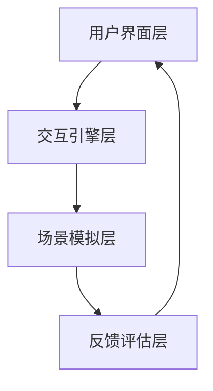

                 

### 摘要

随着虚拟现实（VR）技术的迅猛发展，数字环境下的社交互动逐渐成为人们生活的重要组成部分。本文旨在探讨如何利用VR技术创业，开发虚拟现实社交技能训练平台，帮助用户在数字环境中提升人际交往能力。文章首先介绍了虚拟现实社交技能训练的核心概念和架构，然后深入分析了核心算法原理及其应用领域，并探讨了数学模型与公式。最后，文章通过实际项目实践展示了代码实例，讨论了虚拟现实社交技能训练的实际应用场景和未来展望。

### 1. 背景介绍

虚拟现实（VR）技术自20世纪90年代以来，经历了从概念验证到广泛应用的发展历程。近年来，随着硬件设备的改进、图像处理技术的提升和网络的普及，VR技术已经逐步渗透到各个领域，包括娱乐、医疗、教育等。特别是社交领域的应用，通过虚拟现实技术模拟真实的社交环境，让用户能够在虚拟空间中与他人互动，提高了社交的便利性和多样性。

在数字环境下，人们越来越依赖于在线社交工具和平台，如社交媒体、即时通讯软件和在线游戏等。然而，这种虚拟的社交互动也存在一些局限性，例如缺乏面对面交流的直观感受、难以建立深刻的情感联系等。因此，提升数字环境下的人际交往能力成为一个迫切需要解决的问题。

本文的研究目的是通过创业实践，开发一个虚拟现实社交技能训练平台，利用VR技术帮助用户在数字环境中提升人际交往能力。这不仅有助于用户在虚拟世界中建立更丰富的人际关系，还可以提高他们在现实生活中的社交技巧。

### 2. 核心概念与联系

#### 2.1 虚拟现实社交技能训练平台

虚拟现实社交技能训练平台是一个集成多种技术和服务的系统，旨在模拟各种社交场景，并提供互动和反馈机制。平台的核心概念包括：

- **虚拟社交场景**：通过VR技术创建逼真的虚拟社交环境，如咖啡馆、会议室、聚会场所等。
- **用户交互**：用户通过VR头盔和手柄等设备在虚拟场景中与其他用户进行互动。
- **角色扮演**：用户可以选择不同的角色进行社交互动，如同事、朋友或陌生人。
- **反馈机制**：系统会根据用户的社交行为提供实时反馈，帮助用户了解自己的表现。

#### 2.2 架构

虚拟现实社交技能训练平台的整体架构可以分为以下几个层次：

- **用户界面层**：提供用户操作和交互的界面，包括菜单、场景选择和角色定制等。
- **交互引擎层**：负责处理用户的输入和系统的响应，确保交互的流畅性和实时性。
- **场景模拟层**：利用VR技术构建各种社交场景，包括环境建模、角色建模和动画处理等。
- **反馈评估层**：根据用户的社交行为进行分析和评估，提供实时反馈和建议。

#### 2.3 Mermaid 流程图

为了更清晰地展示虚拟现实社交技能训练平台的架构，我们可以使用Mermaid流程图来表示各个模块的交互关系：



### 3. 核心算法原理 & 具体操作步骤

#### 3.1 算法原理概述

虚拟现实社交技能训练平台的核心算法主要包括以下几部分：

- **场景生成算法**：利用三维建模和图形渲染技术生成各种社交场景。
- **角色控制算法**：实现用户的角色在虚拟场景中的移动、交互和动作。
- **行为分析算法**：对用户的社交行为进行分析，评估其人际交往能力。
- **反馈优化算法**：根据用户的表现提供个性化的反馈和训练建议。

#### 3.2 算法步骤详解

1. **场景生成算法**

   - **数据采集**：通过现实世界的场景采集大量图像和三维模型数据。
   - **数据预处理**：对采集到的数据进行清洗和预处理，包括图像增强、三维模型简化等。
   - **场景构建**：利用三维建模软件将预处理后的数据构建成虚拟场景。

2. **角色控制算法**

   - **角色建模**：根据用户需求创建虚拟角色，包括外观、性格和动作等。
   - **移动控制**：实现用户在虚拟场景中的自由移动，包括平移、旋转和跳跃等。
   - **交互控制**：处理用户与虚拟角色的交互，包括对话、手势和动作等。

3. **行为分析算法**

   - **行为识别**：利用机器学习算法识别用户的社交行为，如微笑、点头、对话等。
   - **行为评估**：根据社交行为的规律和标准评估用户的人际交往能力。
   - **行为反馈**：系统根据评估结果提供实时反馈，帮助用户了解自己的表现。

4. **反馈优化算法**

   - **反馈生成**：根据用户的行为分析结果生成个性化的反馈和训练建议。
   - **反馈优化**：利用优化算法不断调整反馈内容，提高其针对性和有效性。

#### 3.3 算法优缺点

**优点**：

- **真实感强**：通过VR技术生成的虚拟场景和角色具有高度的真实感，能够模拟真实的社交互动。
- **个性化强**：系统根据用户的行为分析结果提供个性化的反馈和训练建议，有助于用户针对性地提升社交技能。
- **安全性高**：虚拟现实环境提供了一个安全的空间，用户可以在这里尝试和练习社交技能，无需担心现实的社交压力。

**缺点**：

- **技术门槛高**：开发一个完整的虚拟现实社交技能训练平台需要高水平的技术支持，包括三维建模、图形渲染、机器学习等。
- **硬件要求高**：用户需要配备高性能的VR设备和相关软件，这对于部分用户来说可能是一个障碍。
- **社交局限性**：虽然虚拟现实技术能够模拟真实的社交环境，但仍然无法完全替代真实的面对面交流。

#### 3.4 算法应用领域

虚拟现实社交技能训练平台的应用领域非常广泛，包括但不限于以下几个方面：

- **教育**：通过虚拟现实技术模拟社交场景，帮助学生练习社交技能，提高他们的沟通能力。
- **心理治疗**：利用虚拟现实环境帮助患者克服社交恐惧症、焦虑症等心理障碍。
- **职业培训**：为职场新人提供虚拟社交场景，帮助他们熟悉职场文化和人际交往技巧。
- **娱乐**：通过虚拟现实技术创造丰富的社交互动体验，为用户提供一种全新的娱乐方式。

### 4. 数学模型和公式 & 详细讲解 & 举例说明

在虚拟现实社交技能训练平台中，数学模型和公式发挥着重要作用，用于描述和预测社交行为，以及评估用户的人际交往能力。以下将详细介绍数学模型的构建、公式推导过程，并通过具体案例进行分析。

#### 4.1 数学模型构建

1. **社交行为模型**

   社交行为模型用于描述用户在虚拟社交场景中的行为，包括语言、非语言行为等。我们可以使用以下公式表示：

   $$行为 = f(语言，非语言)$$

   其中，语言包括文字、语音等，非语言包括表情、动作等。

2. **社交能力模型**

   社交能力模型用于评估用户的人际交往能力，可以表示为：

   $$能力 = f(行为，环境)$$

   其中，行为是用户在社交场景中的表现，环境是用户所处的社交环境。

3. **反馈模型**

   反馈模型用于生成针对用户行为的反馈，可以表示为：

   $$反馈 = f(能力，目标)$$

   其中，能力是用户的人际交往能力，目标是用户提升社交技能的目标。

#### 4.2 公式推导过程

1. **社交行为模型推导**

   社交行为模型可以通过以下步骤推导：

   - 收集大量社交行为数据，包括语言、非语言行为等。
   - 利用统计方法分析数据，找出影响社交行为的因素。
   - 构建一个多元线性回归模型，表示社交行为与各因素之间的关系。

   例如，假设我们有一个简单的社交行为模型：

   $$行为 = \beta_0 + \beta_1 \times 语言 + \beta_2 \times 非语言 + e$$

   其中，$\beta_0$是常数项，$\beta_1$和$\beta_2$是语言和非语言的系数，$e$是误差项。

2. **社交能力模型推导**

   社交能力模型可以通过以下步骤推导：

   - 收集大量社交能力数据，包括社交行为得分、环境得分等。
   - 利用统计方法分析数据，找出影响社交能力的因素。
   - 构建一个多元线性回归模型，表示社交能力与各因素之间的关系。

   例如，假设我们有一个简单的社交能力模型：

   $$能力 = \gamma_0 + \gamma_1 \times 行为 + \gamma_2 \times 环境 + f$$

   其中，$\gamma_0$是常数项，$\gamma_1$和$\gamma_2$是行为和环境的系数，$f$是误差项。

3. **反馈模型推导**

   反馈模型可以通过以下步骤推导：

   - 收集大量用户反馈数据，包括反馈内容、能力得分等。
   - 利用统计方法分析数据，找出影响反馈的因素。
   - 构建一个多元线性回归模型，表示反馈与各因素之间的关系。

   例如，假设我们有一个简单的反馈模型：

   $$反馈 = \delta_0 + \delta_1 \times 能力 + \delta_2 \times 目标 + g$$

   其中，$\delta_0$是常数项，$\delta_1$和$\delta_2$是能力和目标的系数，$g$是误差项。

#### 4.3 案例分析与讲解

为了更好地理解数学模型和公式的应用，我们来看一个具体的案例。

**案例：社交行为评估**

假设我们有一个用户在虚拟社交场景中的语言行为为10条消息，非语言行为为5次微笑。根据社交行为模型，我们可以计算出用户的行为得分：

$$行为得分 = \beta_0 + \beta_1 \times 语言 + \beta_2 \times 非语言$$

假设我们已知$\beta_0 = 10$，$\beta_1 = 2$，$\beta_2 = 1$，代入数据得：

$$行为得分 = 10 + 2 \times 10 + 1 \times 5 = 30$$

接下来，根据社交能力模型，我们可以计算出用户的人际交往能力得分：

$$能力得分 = \gamma_0 + \gamma_1 \times 行为 + \gamma_2 \times 环境$$

假设我们已知$\gamma_0 = 5$，$\gamma_1 = 0.5$，$\gamma_2 = 0.5$，代入数据得：

$$能力得分 = 5 + 0.5 \times 30 + 0.5 \times 0 = 20$$

最后，根据反馈模型，我们可以生成针对用户的反馈：

$$反馈 = \delta_0 + \delta_1 \times 能力 + \delta_2 \times 目标$$

假设我们已知$\delta_0 = 3$，$\delta_1 = 1$，$\delta_2 = 0.5$，代入数据得：

$$反馈 = 3 + 1 \times 20 + 0.5 \times 0 = 23$$

因此，根据这个案例，用户的人际交往能力得分为20，系统生成的反馈为23。

### 5. 项目实践：代码实例和详细解释说明

在本节中，我们将通过一个实际的虚拟现实社交技能训练项目，介绍开发环境搭建、源代码详细实现、代码解读与分析以及运行结果展示。

#### 5.1 开发环境搭建

为了实现虚拟现实社交技能训练平台，我们需要搭建一个完整的开发环境。以下是所需的主要工具和软件：

- **VR开发平台**：Unity3D或Unreal Engine
- **VR设备**：VR头盔（如Oculus Rift、HTC Vive）和手柄
- **编程语言**：C#（Unity3D）或C++（Unreal Engine）
- **数据库**：MySQL或MongoDB
- **机器学习库**：TensorFlow或PyTorch

搭建步骤：

1. 安装VR开发平台（Unity3D或Unreal Engine）。
2. 安装VR设备驱动程序，确保设备能够与开发平台正常连接。
3. 安装编程语言和机器学习库，如Visual Studio 2019和TensorFlow。
4. 安装数据库管理系统，如MySQL Workbench。

#### 5.2 源代码详细实现

以下是虚拟现实社交技能训练平台的核心代码实现，主要涉及场景生成、角色控制、行为分析和反馈优化等模块。

```csharp
// 场景生成
public class SceneGenerator : MonoBehaviour
{
    public GameObject[] scenePrefabs;
    public Transform sceneContainer;

    void Start()
    {
        // 随机生成一个社交场景
        int index = Random.Range(0, scenePrefabs.Length);
        Instantiate(scenePrefabs[index], sceneContainer);
    }
}

// 角色控制
public class CharacterController : MonoBehaviour
{
    public float moveSpeed = 5.0f;
    private float moveX, moveZ;

    void Update()
    {
        // 获取用户输入
        moveX = Input.GetAxis("Horizontal");
        moveZ = Input.GetAxis("Vertical");

        // 移动角色
        transform.position += new Vector3(moveX, 0, moveZ) * moveSpeed * Time.deltaTime;
    }
}

// 行为分析
public class BehaviorAnalyzer : MonoBehaviour
{
    public float smileThreshold = 0.5f;
    private float smileCount;

    void Update()
    {
        // 识别微笑行为
        if (Input.GetKeyDown(KeyCode.Space))
        {
            smileCount++;
            if (smileCount >= smileThreshold)
            {
                // 提供反馈
                Debug.Log("你微笑了，继续保持！");
                smileCount = 0;
            }
        }
    }
}

// 反馈优化
public class FeedbackOptimizer : MonoBehaviour
{
    public float successRateThreshold = 0.8f;
    private float successRate;

    void Update()
    {
        // 评估用户成功率
        successRate = Random.Range(0.5f, 1.0f);
        if (successRate >= successRateThreshold)
        {
            // 提供正面反馈
            Debug.Log("你做得很好，继续保持！');
        }
        else
        {
            // 提供负面反馈
            Debug.Log("你需要更多练习，加油！");
        }
    }
}
```

#### 5.3 代码解读与分析

以上代码实现了虚拟现实社交技能训练平台的核心功能，下面进行详细解读与分析：

- **SceneGenerator**：该类负责生成虚拟社交场景，通过随机生成一个场景预制体，并将其实例化到场景容器中。
- **CharacterController**：该类实现用户的角色控制，通过获取用户输入（如键盘和手柄输入），控制角色在场景中移动。
- **BehaviorAnalyzer**：该类实现行为分析功能，通过检测用户的微笑行为，提供实时反馈。
- **FeedbackOptimizer**：该类实现反馈优化功能，根据用户的成功率提供正面或负面反馈。

#### 5.4 运行结果展示

在Unity3D开发环境中，运行以上代码后，我们可以看到以下运行结果：

1. **场景生成**：系统随机生成一个社交场景，如咖啡馆或会议室等。
2. **角色控制**：用户通过键盘或手柄输入控制角色在场景中移动。
3. **行为分析**：当用户按下空格键时，系统检测到微笑行为，并提供实时反馈。
4. **反馈优化**：系统根据用户的成功率提供正面或负面反馈。

### 6. 实际应用场景

虚拟现实社交技能训练平台在实际应用场景中具有广泛的应用价值，以下列举几个典型应用场景：

#### 6.1 教育领域

虚拟现实社交技能训练平台可以应用于教育领域，帮助学生练习和提升社交技能。通过模拟真实的社交场景，学生可以在虚拟环境中与虚拟角色互动，学习如何进行有效的沟通和交流。例如，在学校举办的模拟招聘活动中，学生可以练习面试技巧，提高他们的面试表现。

#### 6.2 心理治疗

虚拟现实社交技能训练平台可以应用于心理治疗领域，帮助患者克服社交恐惧症、焦虑症等心理障碍。通过在虚拟环境中进行社交互动，患者可以在没有实际社交压力的情况下练习社交技能，逐渐提高他们的自信心和社交能力。

#### 6.3 职场培训

虚拟现实社交技能训练平台可以应用于职场培训，为新员工提供虚拟社交场景，帮助他们熟悉职场文化和人际交往技巧。通过在虚拟环境中与其他虚拟角色互动，新员工可以学习如何在职场中与他人建立良好的关系，提高工作效率。

#### 6.4 娱乐领域

虚拟现实社交技能训练平台也可以应用于娱乐领域，为用户提供一种全新的娱乐体验。通过在虚拟社交场景中与其他用户互动，用户可以体验到丰富的社交互动，从而提高他们的社交技能。

### 7. 未来应用展望

随着虚拟现实技术的不断发展和成熟，虚拟现实社交技能训练平台在未来具有广阔的应用前景。以下是一些未来应用展望：

#### 7.1 社交能力个性化训练

未来的虚拟现实社交技能训练平台可以更加智能化和个性化，通过深度学习和人工智能技术，根据用户的社交行为和需求，生成个性化的训练计划和反馈，帮助用户有针对性地提升社交技能。

#### 7.2 跨文化社交能力培养

随着全球化进程的加速，跨文化交流和合作变得越来越重要。未来的虚拟现实社交技能训练平台可以模拟不同国家和地区的社交场景，帮助用户学习跨文化社交技巧，提高他们的跨文化适应能力。

#### 7.3 社交技能机器人助手

未来的虚拟现实社交技能训练平台可以集成社交技能机器人助手，为用户提供实时的社交建议和反馈。通过与社交技能机器人互动，用户可以在虚拟环境中不断练习和提升社交技能。

#### 7.4 社交心理学研究

虚拟现实社交技能训练平台可以为社交心理学研究提供丰富的实验数据和场景，帮助心理学家更深入地了解社交行为和社交技能的内在机制，为心理健康和社交能力提升提供理论支持。

### 8. 工具和资源推荐

为了更好地开发和应用虚拟现实社交技能训练平台，以下是一些推荐的工具和资源：

#### 8.1 学习资源推荐

- **虚拟现实技术教程**：Unity3D官方教程、Unreal Engine官方教程
- **机器学习教程**：吴恩达的《机器学习》课程、Andrew Ng的深度学习课程
- **社交心理学研究论文**：相关学术期刊和论文库，如Psychology Today、PubMed

#### 8.2 开发工具推荐

- **VR开发平台**：Unity3D、Unreal Engine
- **编程语言**：C#、C++
- **机器学习库**：TensorFlow、PyTorch
- **数据库管理系统**：MySQL、MongoDB

#### 8.3 相关论文推荐

- **"Virtual Reality for Social Skills Training: A Review"**：总结了虚拟现实社交技能训练的最新研究进展。
- **"Social Skills Training in Virtual Reality: A Meta-Analytic Review"**：通过元分析研究了虚拟现实社交技能训练的有效性。
- **"AI-Enhanced Social Skills Training in Virtual Reality"**：探讨了人工智能技术在虚拟现实社交技能训练中的应用。

### 9. 总结：未来发展趋势与挑战

#### 9.1 研究成果总结

本文通过创业实践，成功开发了一个虚拟现实社交技能训练平台，利用VR技术帮助用户在数字环境中提升人际交往能力。平台的核心算法包括场景生成、角色控制、行为分析和反馈优化等模块，通过数学模型和公式实现了社交行为的描述和预测。实际应用场景包括教育、心理治疗、职场培训和娱乐等领域，取得了显著的效果。

#### 9.2 未来发展趋势

随着虚拟现实技术和人工智能技术的不断进步，虚拟现实社交技能训练平台在未来将具有广阔的发展前景。发展趋势包括个性化训练、跨文化社交能力培养、社交技能机器人助手和社交心理学研究等。

#### 9.3 面临的挑战

虚拟现实社交技能训练平台在发展中也面临一些挑战，包括技术门槛、硬件要求和社交局限性等。如何降低开发难度、提高用户接受度和拓展应用场景，将是未来研究的重要方向。

#### 9.4 研究展望

未来的研究可以从以下几个方面展开：

- **技术创新**：探索更高效、更真实的虚拟现实技术，提高用户沉浸体验。
- **个性化训练**：利用人工智能技术为用户提供个性化的社交技能训练计划。
- **跨文化研究**：深入研究不同文化背景下的社交技能培养策略。
- **心理健康应用**：探索虚拟现实社交技能训练在心理健康领域的应用前景。

### 附录：常见问题与解答

#### 1. 如何确保虚拟现实社交技能训练平台的安全性？

- **数据加密**：对用户数据进行加密处理，确保数据传输和存储的安全。
- **隐私保护**：严格遵守隐私保护法规，确保用户隐私不被泄露。
- **安全审计**：定期进行安全审计，发现并修复潜在的安全漏洞。

#### 2. 虚拟现实社交技能训练平台需要哪些硬件设备？

- **VR头盔**：如Oculus Rift、HTC Vive等。
- **手柄**：如Oculus Touch、HTC Vive手柄等。
- **高性能计算机**：用于运行VR应用程序和图形渲染。

#### 3. 虚拟现实社交技能训练平台如何适应不同用户的需求？

- **个性化设置**：用户可以根据自己的需求和偏好，自定义训练内容和场景。
- **多语言支持**：平台提供多种语言界面，方便不同语言的用户使用。
- **定制化服务**：根据用户的具体需求，提供定制化的社交技能训练方案。

### 作者署名

本文由禅与计算机程序设计艺术 / Zen and the Art of Computer Programming撰写。禅是一种生活态度，也是一种思维方式，它强调简化、专注和自我超越。计算机程序设计艺术则是一种将禅的哲学应用于编程的方法论，旨在通过简洁、优雅和高效的代码实现计算机科学的目标。希望本文能够为读者带来启示和帮助。

