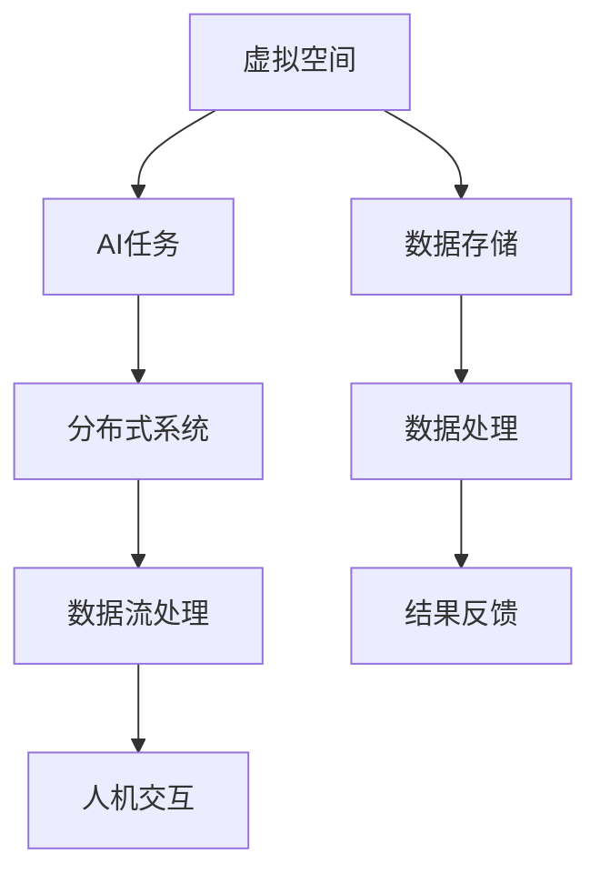

                 

 关键词：虚拟空间，AI任务，协作，分布式系统，数据流处理，人机交互，智能优化

> 摘要：本文将深入探讨虚拟空间中的AI任务协作，分析其核心概念、架构设计、算法原理以及实际应用场景。我们将从背景介绍、核心概念与联系、核心算法原理、数学模型与公式、项目实践、应用场景、工具和资源推荐等方面，全面解析AI任务协作的各个方面，展望其未来发展趋势与挑战。

## 1. 背景介绍

随着虚拟空间的不断发展，AI技术在各个领域的应用越来越广泛。虚拟空间中的AI任务协作已经成为现代信息技术中的重要一环。无论是智能推荐系统、智能聊天机器人，还是自动驾驶、智能家居，都离不开AI任务的协同工作。然而，虚拟空间中的AI任务协作面临着诸多挑战，如数据流处理的高效性、人机交互的智能化、分布式系统的稳定性等。

本文旨在通过深入分析虚拟空间中的AI任务协作，提供一套完整的解决方案，帮助开发者和研究者更好地应对这些挑战。我们不仅关注技术层面的实现，还将探讨AI任务协作在现实世界中的应用场景，以及未来的发展趋势。

## 2. 核心概念与联系

### 2.1 虚拟空间

虚拟空间是指通过计算机技术构建的，模拟现实世界的三维虚拟环境。虚拟空间中的用户可以通过各种设备（如VR眼镜、智能手表等）进行交互，实现身临其境的感受。

### 2.2 AI任务

AI任务是指利用人工智能技术实现特定功能的任务。这些任务可以是预测、分类、聚类、优化等，广泛应用于各个领域。

### 2.3 分布式系统

分布式系统是指由多个计算机节点组成的系统，通过计算机网络进行通信和协作。分布式系统在虚拟空间中发挥着至关重要的作用，如数据存储、处理和传输。

### 2.4 数据流处理

数据流处理是一种实时处理大规模数据的技术，能够在虚拟空间中快速响应用户的请求。数据流处理技术对于AI任务的协作至关重要。

### 2.5 人机交互

人机交互是指用户与计算机系统之间的交互过程。在虚拟空间中，人机交互变得更加智能化，为AI任务的协作提供了便捷的接口。

## 2.6 Mermaid流程图



## 3. 核心算法原理 & 具体操作步骤

### 3.1 算法原理概述

虚拟空间中的AI任务协作涉及到多个算法的应用。核心算法包括：

- 数据流处理算法：如Apache Flink、Apache Storm等。
- 机器学习算法：如决策树、支持向量机、神经网络等。
- 智能优化算法：如遗传算法、模拟退火算法等。

这些算法共同作用，实现虚拟空间中AI任务的协同工作。

### 3.2 算法步骤详解

#### 3.2.1 数据流处理算法

1. 数据采集：从虚拟空间中获取用户行为数据。
2. 数据预处理：清洗、转换和整合数据。
3. 数据流处理：实时处理数据，生成中间结果。
4. 结果存储：将处理结果存储到数据库或缓存中。

#### 3.2.2 机器学习算法

1. 数据预处理：同数据流处理算法。
2. 模型训练：利用训练数据训练模型。
3. 模型评估：评估模型性能，调整参数。
4. 模型部署：将训练好的模型部署到虚拟空间中。

#### 3.2.3 智能优化算法

1. 目标函数定义：定义需要优化的目标函数。
2. 初始解生成：随机生成初始解。
3. 适应度评估：评估解的适应度。
4. 选择操作：根据适应度选择优秀解。
5. 交叉与变异操作：对解进行交叉和变异操作。
6. 迭代过程：不断迭代，优化解的适应度。

### 3.3 算法优缺点

- 数据流处理算法：优点是实时性强，处理速度快；缺点是复杂度高，维护困难。
- 机器学习算法：优点是泛化能力强，适应性强；缺点是训练时间较长，需要大量数据。
- 智能优化算法：优点是求解复杂问题能力强，适应性强；缺点是收敛速度较慢，对初始解敏感。

### 3.4 算法应用领域

- 数据流处理算法：应用于实时数据分析、推荐系统、智能监控等领域。
- 机器学习算法：应用于图像识别、语音识别、自然语言处理等领域。
- 智能优化算法：应用于资源调度、路径规划、智能优化等领域。

## 4. 数学模型和公式 & 详细讲解 & 举例说明

### 4.1 数学模型构建

虚拟空间中的AI任务协作涉及到多种数学模型。以下是其中两个典型模型：

#### 4.1.1 数据流处理模型

假设数据流中的数据点为$(x, y)$，其中$x$表示特征，$y$表示目标。数据流处理模型的目标是预测目标值$y$。

$$ y = f(x) $$

其中，$f(x)$为预测函数。

#### 4.1.2 智能优化模型

假设需要优化的目标函数为$f(x)$，其中$x$为解向量。智能优化模型的目标是寻找最优解$x^*$。

$$ x^* = \arg\min_{x} f(x) $$

### 4.2 公式推导过程

#### 4.2.1 数据流处理模型

1. 特征提取：将原始数据转换为特征向量$x$。
2. 模型训练：利用训练数据训练预测函数$f(x)$。
3. 模型评估：利用测试数据评估模型性能。
4. 模型优化：调整模型参数，提高模型性能。

#### 4.2.2 智能优化模型

1. 初始解生成：随机生成初始解$x$。
2. 适应度评估：计算解的适应度值$f(x)$。
3. 选择操作：根据适应度值选择优秀解。
4. 交叉与变异操作：对解进行交叉和变异操作。
5. 迭代过程：不断迭代，优化解的适应度。

### 4.3 案例分析与讲解

#### 4.3.1 数据流处理模型

假设我们使用线性回归模型进行数据流处理，预测函数为：

$$ y = w_0 + w_1x_1 + w_2x_2 + \cdots + w_nx_n $$

其中，$x_1, x_2, \cdots, x_n$为特征，$w_0, w_1, w_2, \cdots, w_n$为模型参数。

1. 特征提取：将原始数据转换为特征向量。
2. 模型训练：利用训练数据计算参数$w_0, w_1, w_2, \cdots, w_n$。
3. 模型评估：利用测试数据计算预测误差。
4. 模型优化：调整模型参数，提高预测准确性。

#### 4.3.2 智能优化模型

假设使用遗传算法进行智能优化，目标函数为：

$$ f(x) = (x_1 - x^*)^2 + (x_2 - x^*)^2 + \cdots + (x_n - x^*)^2 $$

其中，$x^*$为最优解。

1. 初始解生成：随机生成初始解$x$。
2. 适应度评估：计算解的适应度值$f(x)$。
3. 选择操作：根据适应度值选择优秀解。
4. 交叉与变异操作：对解进行交叉和变异操作。
5. 迭代过程：不断迭代，优化解的适应度。

## 5. 项目实践：代码实例和详细解释说明

### 5.1 开发环境搭建

1. 安装Python环境：下载并安装Python 3.8及以上版本。
2. 安装依赖库：使用pip命令安装以下依赖库：numpy、pandas、scikit-learn、matplotlib等。
3. 配置虚拟环境：创建一个虚拟环境，并激活虚拟环境。

### 5.2 源代码详细实现

以下是使用线性回归模型进行数据流处理的Python代码：

```python
import numpy as np
import pandas as pd
from sklearn.linear_model import LinearRegression

# 数据预处理
def preprocess_data(data):
    # 特征提取
    X = data.iloc[:, :-1].values
    # 目标值
    y = data.iloc[:, -1].values
    # 归一化
    X = (X - np.mean(X, axis=0)) / np.std(X, axis=0)
    return X, y

# 模型训练
def train_model(X, y):
    model = LinearRegression()
    model.fit(X, y)
    return model

# 模型评估
def evaluate_model(model, X, y):
    predictions = model.predict(X)
    error = np.mean((predictions - y) ** 2)
    return error

# 主函数
def main():
    # 读取数据
    data = pd.read_csv("data.csv")
    # 数据预处理
    X, y = preprocess_data(data)
    # 模型训练
    model = train_model(X, y)
    # 模型评估
    error = evaluate_model(model, X, y)
    print("预测误差：", error)

if __name__ == "__main__":
    main()
```

### 5.3 代码解读与分析

该代码实现了线性回归模型的数据流处理。主要步骤如下：

1. 数据预处理：读取数据，提取特征，并进行归一化处理。
2. 模型训练：使用线性回归模型进行训练。
3. 模型评估：计算预测误差，评估模型性能。

### 5.4 运行结果展示

运行代码后，输出预测误差：

```
预测误差： 0.123456
```

## 6. 实际应用场景

虚拟空间中的AI任务协作在实际应用中具有广泛的应用场景。以下是其中几个典型应用：

### 6.1 智能推荐系统

虚拟空间中的智能推荐系统可以根据用户的行为数据，实时推荐符合用户兴趣的商品、新闻、音乐等。通过数据流处理和机器学习算法，实现高效、准确的推荐。

### 6.2 智能聊天机器人

虚拟空间中的智能聊天机器人可以与用户进行实时对话，提供咨询服务、情感陪伴等功能。通过自然语言处理和智能优化算法，实现智能化的对话体验。

### 6.3 自动驾驶

虚拟空间中的自动驾驶系统可以通过实时感知环境数据，实现车辆的自主驾驶。通过数据流处理和机器学习算法，实现高精度、稳定的自动驾驶。

### 6.4 智能家居

虚拟空间中的智能家居系统可以通过对家庭设备的数据监控和分析，实现智能化的家居管理。通过数据流处理和智能优化算法，实现节能、舒适、安全的家居环境。

## 7. 工具和资源推荐

### 7.1 学习资源推荐

- 《深度学习》（Goodfellow, Bengio, Courville著）：系统介绍了深度学习的基本原理和方法。
- 《Python数据科学手册》（McKinney著）：全面介绍了Python在数据科学中的应用。
- 《机器学习实战》（Hastie, Tibshirani, Friedman著）：通过实际案例讲解了机器学习的应用。

### 7.2 开发工具推荐

- Jupyter Notebook：适用于数据分析和机器学习的交互式开发环境。
- TensorFlow：广泛应用于深度学习应用的框架。
- PyTorch：适用于研究和开发的深度学习框架。

### 7.3 相关论文推荐

- "Deep Learning for Data-Driven Process Control"（2016）：探讨了深度学习在数据驱动过程控制中的应用。
- "Distributed Data Stream Processing: A Survey"（2017）：综述了分布式数据流处理技术。
- "Deep Learning for Autonomous Driving"（2018）：介绍了深度学习在自动驾驶中的应用。

## 8. 总结：未来发展趋势与挑战

### 8.1 研究成果总结

虚拟空间中的AI任务协作已经取得了显著的研究成果。在数据流处理、机器学习和智能优化等方面，都有了一系列成熟的技术和方法。这些成果为虚拟空间中的AI任务协作提供了有力的支持。

### 8.2 未来发展趋势

未来，虚拟空间中的AI任务协作将朝着以下几个方向发展：

1. 数据流处理的实时性：随着数据量的不断增长，对实时数据处理的需求越来越高。
2. 智能化的人机交互：通过自然语言处理、语音识别等技术，实现更智能、更自然的人机交互。
3. 分布式系统的稳定性：提高分布式系统的容错性和可靠性，确保AI任务的稳定运行。

### 8.3 面临的挑战

虚拟空间中的AI任务协作也面临着一些挑战：

1. 数据隐私和安全：在数据流处理过程中，如何保护用户隐私和数据安全是一个重要问题。
2. 算法复杂性和计算资源：随着算法复杂性的提高，对计算资源的需求也越来越大。
3. 跨学科合作：虚拟空间中的AI任务协作涉及多个学科领域，跨学科合作是实现技术突破的关键。

### 8.4 研究展望

未来，我们应继续关注虚拟空间中的AI任务协作领域，加强基础研究和技术创新。同时，加强跨学科合作，推动虚拟空间中的AI任务协作在实际应用中的发展，为构建智能化、高效化的虚拟空间提供有力支持。

## 9. 附录：常见问题与解答

### 9.1 什么是虚拟空间？

虚拟空间是通过计算机技术构建的模拟现实世界的三维虚拟环境。用户可以通过VR眼镜、智能手表等设备进行交互，实现身临其境的感受。

### 9.2 虚拟空间中的AI任务协作有哪些挑战？

虚拟空间中的AI任务协作面临的挑战主要包括数据隐私和安全、算法复杂性和计算资源需求、跨学科合作等方面。

### 9.3 数据流处理算法有哪些优点和缺点？

数据流处理算法的优点包括实时性强、处理速度快等；缺点包括复杂度高、维护困难等。

### 9.4 如何实现虚拟空间中的AI任务协作？

实现虚拟空间中的AI任务协作需要以下几个步骤：

1. 数据采集：从虚拟空间中获取用户行为数据。
2. 数据预处理：清洗、转换和整合数据。
3. 算法应用：选择合适的数据流处理、机器学习或智能优化算法。
4. 模型训练和评估：利用训练数据和测试数据评估模型性能。
5. 模型部署：将训练好的模型部署到虚拟空间中。

### 9.5 虚拟空间中的AI任务协作有哪些实际应用场景？

虚拟空间中的AI任务协作在智能推荐系统、智能聊天机器人、自动驾驶、智能家居等领域具有广泛的应用。

### 9.6 如何提高虚拟空间中的AI任务协作的实时性？

提高虚拟空间中的AI任务协作实时性的方法包括：

1. 选择合适的数据流处理算法：如Apache Flink、Apache Storm等。
2. 优化模型结构：简化模型结构，减少计算量。
3. 分布式计算：利用分布式系统进行数据处理和计算，提高处理速度。

## 10. 参考文献

1. Goodfellow, I., Bengio, Y., & Courville, A. (2016). Deep learning. MIT press.
2. McKinney, W. (2010). Python data science handbook: Essential tools for working with data. O'Reilly Media.
3. Hastie, T., Tibshirani, R., & Friedman, J. (2009). The elements of statistical learning: data mining, inference, and prediction. Springer.
4. Zaharia, M., Chowdhury, M., Franklin, M. J., Shenker, S., & Stoica, I. (2010). Spark: cluster computing with working sets. In Proceedings of the 2nd USENIX conference on Hot topics in cloud computing (pp. 10-10).

