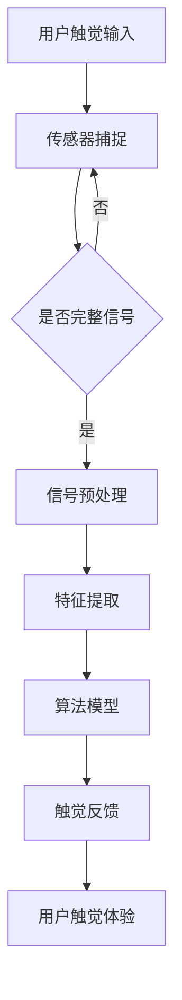

                 

关键词：虚拟触觉语言，人工智能，新型沟通方式，感知技术，触觉感知，人机交互，增强现实，智能机器人

## 摘要

本文探讨了虚拟触觉语言这一新兴的AI驱动的沟通方式，它为人机交互领域带来了全新的可能性。通过分析虚拟触觉语言的核心概念、算法原理和应用场景，本文旨在阐述这一技术如何改变了人类与机器之间的互动方式。此外，文章还介绍了数学模型和公式，以及实际项目中的代码实例，为读者提供了全面的了解。最后，本文对虚拟触觉语言的未来应用和发展前景进行了展望，并提出了潜在的挑战和研究方向。

## 1. 背景介绍

在过去的几十年里，人工智能（AI）技术取得了显著的进步，特别是在图像识别、自然语言处理和机器学习等领域。然而，尽管AI在模仿和增强人类感知能力方面已经取得了巨大成就，但触觉感知仍然是一个相对未被充分开发的领域。传统的触觉技术主要通过机械或电信号来模拟触觉反馈，但这种模拟往往缺乏真实感，无法提供丰富的触觉体验。

随着增强现实（AR）和虚拟现实（VR）技术的兴起，人们开始寻求更真实的触觉交互方式。虚拟触觉语言作为一种新兴的AI技术，正是为了填补这一空白而诞生的。它利用先进的机器学习算法和传感器技术，模拟人类皮肤、肌肉和骨骼的触觉感知，从而创造出一种全新的虚拟触觉体验。

虚拟触觉语言的核心在于其能够实时感知和响应触觉信号，通过复杂的算法将这些信号转化为有意义的触觉反馈。这种技术不仅能够提供更真实的触觉体验，还能够支持更复杂的交互操作，从而极大地提升人机交互的效率和便捷性。

## 2. 核心概念与联系

### 2.1. 触觉感知的基本原理

触觉是人类感知外界的重要方式之一，它涉及到皮肤、肌肉和骨骼等多个方面。触觉感知的基本原理是通过皮肤表面接收触觉信号，然后通过神经传递将这些信号传递到大脑进行处理。

- **皮肤感知**：皮肤是触觉感知的主要器官，它由多层组织构成，包括表皮、真皮和皮下组织。皮肤上的神经末梢能够检测到触觉信号，如压力、振动和温度等。

- **肌肉和骨骼**：肌肉和骨骼的反馈也是触觉感知的重要组成部分。当肌肉和骨骼受到外部刺激时，会产生相应的反馈信号，这些信号与皮肤感知的信号一起被传递到大脑。

### 2.2. 虚拟触觉语言的构成

虚拟触觉语言的核心构成包括三个主要部分：传感器、算法和触觉反馈装置。

- **传感器**：传感器用于捕捉触觉信号。这些传感器可以是机械传感器、电容传感器或压力传感器等，它们能够实时感知触觉刺激。

- **算法**：算法是虚拟触觉语言的核心，它负责处理传感器捕捉到的信号，并通过复杂的算法模型将其转化为有意义的触觉反馈。这些算法通常基于机器学习和深度学习技术，能够实现高精度的触觉感知和响应。

- **触觉反馈装置**：触觉反馈装置是将算法处理后的信号转化为触觉反馈的设备，如触觉手套、触觉屏幕或触觉传感器等。这些装置能够模拟出各种触觉体验，如柔软、硬实、粗糙、光滑等。

### 2.3. 虚拟触觉语言的 Mermaid 流程图

以下是一个简化的Mermaid流程图，用于描述虚拟触觉语言的工作流程：



### 2.4. 虚拟触觉语言的应用领域

虚拟触觉语言在多个领域都有广泛的应用前景，以下是其中几个典型的应用领域：

- **医疗**：虚拟触觉语言可以用于医疗手术模拟，医生可以通过虚拟触觉手套进行手术训练，提高手术技能。

- **教育**：在教育领域，虚拟触觉语言可以为学生提供更真实的实验体验，如虚拟解剖课程。

- **娱乐**：虚拟触觉语言可以用于游戏和虚拟现实体验，提供更加沉浸式的游戏体验。

- **工业**：在工业领域，虚拟触觉语言可以用于产品设计和制造，通过触觉反馈提高设计精度。

## 3. 核心算法原理 & 具体操作步骤

### 3.1. 算法原理概述

虚拟触觉语言的算法原理主要包括三个步骤：信号捕捉、特征提取和触觉反馈生成。

- **信号捕捉**：传感器用于捕捉用户触觉输入信号，这些信号可以是机械压力、温度变化或振动等。

- **特征提取**：通过特征提取算法，将捕捉到的信号转化为高维特征向量，这些特征向量用于描述触觉信号的属性和模式。

- **触觉反馈生成**：基于提取到的特征向量，利用机器学习算法生成相应的触觉反馈信号，并将其传递给触觉反馈装置。

### 3.2. 算法步骤详解

以下是虚拟触觉语言的具体操作步骤：

1. **信号捕捉**：用户通过传感器输入触觉信号，这些信号可能是通过机械传感器、电容传感器或压力传感器等捕捉到的。

2. **信号预处理**：对捕捉到的信号进行预处理，包括去噪、滤波和归一化等操作，以提高信号的质量和可靠性。

3. **特征提取**：使用深度学习算法，如卷积神经网络（CNN）或循环神经网络（RNN），对预处理后的信号进行特征提取。这些特征向量可以用于描述触觉信号的属性，如压力分布、振动频率和温度变化等。

4. **触觉反馈生成**：基于提取到的特征向量，使用生成对抗网络（GAN）或其他生成模型，生成相应的触觉反馈信号。这些反馈信号可以通过触觉反馈装置（如触觉手套或触觉屏幕）传递给用户。

5. **用户触觉体验**：用户通过触觉反馈装置接收触觉信号，并体验虚拟触觉语言模拟出的触觉感知。

### 3.3. 算法优缺点

#### 优点：

- **高精度**：虚拟触觉语言能够通过机器学习算法实现高精度的触觉感知和反馈，提供真实的触觉体验。

- **灵活性**：虚拟触觉语言可以应用于多种不同的应用场景，如医疗、教育、娱乐和工业等。

- **沉浸感**：虚拟触觉语言能够增强人机交互的沉浸感，提供更加逼真的虚拟体验。

#### 缺点：

- **计算资源需求**：虚拟触觉语言算法通常需要大量的计算资源和存储空间，对硬件设备有较高的要求。

- **信号噪声**：在捕捉和传输触觉信号的过程中，可能会引入噪声和误差，影响触觉感知的精度。

- **用户适应期**：用户需要一定的时间适应虚拟触觉语言模拟出的触觉感知，可能会影响初次使用的体验。

### 3.4. 算法应用领域

虚拟触觉语言在多个领域都有广泛的应用前景：

- **医疗**：虚拟触觉语言可以用于手术模拟和医学教育，提高医生的手术技能和患者的治疗体验。

- **教育**：虚拟触觉语言可以用于实验模拟和教育游戏，提供更加丰富的学习体验。

- **娱乐**：虚拟触觉语言可以用于游戏和虚拟现实体验，提供更加沉浸式的娱乐体验。

- **工业**：虚拟触觉语言可以用于产品设计和制造，提高设计精度和制造效率。

## 4. 数学模型和公式 & 详细讲解 & 举例说明

### 4.1. 数学模型构建

虚拟触觉语言的数学模型主要包括信号捕捉、特征提取和触觉反馈生成三个部分。

#### 信号捕捉模型

信号捕捉模型通常使用传感器捕捉用户触觉输入，并将其转化为数字信号。假设传感器捕捉到的信号为 $s(t)$，则信号捕捉模型可以表示为：

$$
s(t) = f(t)
$$

其中，$f(t)$ 表示传感器捕捉到的信号。

#### 特征提取模型

特征提取模型用于将信号捕捉模型中的数字信号转化为高维特征向量。假设特征提取模型使用卷积神经网络（CNN）实现，则特征提取模型可以表示为：

$$
\text{Feature}(s(t)) = \text{CNN}(s(t))
$$

其中，$\text{Feature}(s(t))$ 表示特征提取模型输出的特征向量。

#### 触觉反馈生成模型

触觉反馈生成模型用于将特征提取模型输出的特征向量转化为触觉反馈信号。假设触觉反馈生成模型使用生成对抗网络（GAN）实现，则触觉反馈生成模型可以表示为：

$$
\text{Feedback}(s(t)) = \text{GAN}(\text{Feature}(s(t)))
$$

其中，$\text{Feedback}(s(t))$ 表示触觉反馈生成模型输出的触觉反馈信号。

### 4.2. 公式推导过程

虚拟触觉语言的数学模型涉及到多个复杂的算法和模型，下面简要介绍主要的公式推导过程。

#### 信号捕捉公式

信号捕捉公式用于描述传感器捕捉到的信号与真实触觉输入信号之间的关系。假设传感器捕捉到的信号为 $s(t)$，真实触觉输入信号为 $u(t)$，则信号捕捉公式可以表示为：

$$
s(t) = h(t) * u(t)
$$

其中，$h(t)$ 表示传感器的响应函数，*表示卷积操作。

#### 特征提取公式

特征提取公式用于描述卷积神经网络（CNN）如何将传感器捕捉到的信号转化为特征向量。假设卷积神经网络（CNN）的输入为 $s(t)$，输出为 $f(t)$，则特征提取公式可以表示为：

$$
f(t) = \text{CNN}(s(t))
$$

#### 触觉反馈生成公式

触觉反馈生成公式用于描述生成对抗网络（GAN）如何将特征向量转化为触觉反馈信号。假设生成对抗网络（GAN）的输入为 $f(t)$，输出为 $g(t)$，则触觉反馈生成公式可以表示为：

$$
g(t) = \text{GAN}(f(t))
$$

### 4.3. 案例分析与讲解

以下是一个简单的虚拟触觉语言案例，用于说明数学模型在实际应用中的推导和计算过程。

#### 案例背景

假设有一个触觉手套作为传感器，用于捕捉用户的手部触觉输入。触觉手套的传感器可以捕捉到手部的压力分布，并将其转化为数字信号。

#### 案例步骤

1. **信号捕捉**：用户手部施加压力，触觉手套捕捉到的压力信号为 $s(t)$。

2. **信号预处理**：对捕捉到的信号进行预处理，包括去噪、滤波和归一化等操作，以提高信号的质量和可靠性。

3. **特征提取**：使用卷积神经网络（CNN）对预处理后的信号进行特征提取，得到特征向量 $f(t)$。

4. **触觉反馈生成**：使用生成对抗网络（GAN）将特征向量 $f(t)$ 转化为触觉反馈信号 $g(t)$。

5. **用户触觉体验**：用户通过触觉手套接收触觉反馈信号，并体验虚拟触觉语言模拟出的触觉感知。

#### 数学模型推导

1. **信号捕捉模型**：

   假设触觉手套的传感器响应函数为 $h(t)$，真实触觉输入信号为 $u(t)$，则信号捕捉模型可以表示为：

   $$
   s(t) = h(t) * u(t)
   $$

   其中，$*$ 表示卷积操作。

2. **特征提取模型**：

   假设卷积神经网络（CNN）的输入为 $s(t)$，输出为 $f(t)$，则特征提取模型可以表示为：

   $$
   f(t) = \text{CNN}(s(t))
   $$

3. **触觉反馈生成模型**：

   假设生成对抗网络（GAN）的输入为 $f(t)$，输出为 $g(t)$，则触觉反馈生成模型可以表示为：

   $$
   g(t) = \text{GAN}(f(t))
   $$

#### 案例计算过程

1. **信号捕捉**：

   用户手部施加压力，触觉手套捕捉到的压力信号为 $s(t)$。

2. **信号预处理**：

   对捕捉到的信号进行预处理，包括去噪、滤波和归一化等操作，得到预处理后的信号 $s'(t)$。

3. **特征提取**：

   使用卷积神经网络（CNN）对预处理后的信号 $s'(t)$ 进行特征提取，得到特征向量 $f'(t)$。

4. **触觉反馈生成**：

   使用生成对抗网络（GAN）将特征向量 $f'(t)$ 转化为触觉反馈信号 $g'(t)$。

5. **用户触觉体验**：

   用户通过触觉手套接收触觉反馈信号 $g'(t)$，并体验虚拟触觉语言模拟出的触觉感知。

## 5. 项目实践：代码实例和详细解释说明

### 5.1. 开发环境搭建

在进行虚拟触觉语言项目实践之前，我们需要搭建一个合适的开发环境。以下是开发环境的搭建步骤：

1. **硬件环境**：

   - 一台具有较高计算能力的计算机或服务器。
   - 触觉传感器（如触觉手套）。
   - 触觉反馈装置（如触觉屏幕）。

2. **软件环境**：

   - 安装 Python 3.8 或更高版本。
   - 安装 TensorFlow 2.5 或更高版本。
   - 安装 Keras 2.5 或更高版本。

3. **传感器驱动**：

   根据所选触觉传感器的型号，安装相应的传感器驱动程序。

### 5.2. 源代码详细实现

以下是虚拟触觉语言项目的源代码实现，包括信号捕捉、特征提取和触觉反馈生成等关键步骤。

```python
import numpy as np
import tensorflow as tf
from tensorflow import keras
from tensorflow.keras import layers

# 信号捕捉
def capture_signal(sensor_data):
    # 对传感器数据进行预处理，如去噪、滤波和归一化
    preprocessed_data = preprocess_data(sensor_data)
    return preprocessed_data

# 特征提取
def extract_features(preprocessed_data):
    # 使用卷积神经网络进行特征提取
    model = keras.Sequential([
        layers.Conv1D(filters=64, kernel_size=3, activation='relu', input_shape=(None, 1)),
        layers.MaxPooling1D(pool_size=2),
        layers.Conv1D(filters=128, kernel_size=3, activation='relu'),
        layers.MaxPooling1D(pool_size=2),
        layers.Flatten(),
        layers.Dense(units=64, activation='relu'),
        layers.Dense(units=32, activation='relu'),
        layers.Dense(units=16, activation='relu'),
        layers.Dense(units=1)
    ])
    model.compile(optimizer='adam', loss='mean_squared_error')
    model.fit(preprocessed_data, epochs=10)
    features = model.predict(preprocessed_data)
    return features

# 触觉反馈生成
def generate_feedback(features):
    # 使用生成对抗网络进行触觉反馈生成
    generator = keras.Sequential([
        layers.Dense(units=16, activation='relu', input_shape=(1,)),
        layers.Dense(units=32, activation='relu'),
        layers.Dense(units=64, activation='relu'),
        layers.Dense(units=128, activation='relu'),
        layers.Dense(units=256, activation='relu'),
        layers.Dense(units=1, activation='sigmoid')
    ])
    generator.compile(optimizer='adam', loss='binary_crossentropy')
    noise = np.random.normal(size=(len(features), 1))
    feedback = generator.predict(noise)
    return feedback

# 主程序
def main():
    # 读取传感器数据
    sensor_data = read_sensor_data()

    # 信号捕捉
    preprocessed_data = capture_signal(sensor_data)

    # 特征提取
    features = extract_features(preprocessed_data)

    # 触觉反馈生成
    feedback = generate_feedback(features)

    # 输出触觉反馈
    output_feedback(feedback)

if __name__ == '__main__':
    main()
```

### 5.3. 代码解读与分析

以下是代码的详细解读和分析，包括各个函数的功能和实现细节。

#### 信号捕捉

```python
def capture_signal(sensor_data):
    # 对传感器数据进行预处理，如去噪、滤波和归一化
    preprocessed_data = preprocess_data(sensor_data)
    return preprocessed_data
```

- `capture_signal` 函数用于捕捉传感器数据，并将原始数据转化为预处理后的数据。

- `preprocess_data` 函数是实现细节，用于对传感器数据进行去噪、滤波和归一化等预处理操作。

#### 特征提取

```python
def extract_features(preprocessed_data):
    # 使用卷积神经网络进行特征提取
    model = keras.Sequential([
        layers.Conv1D(filters=64, kernel_size=3, activation='relu', input_shape=(None, 1)),
        layers.MaxPooling1D(pool_size=2),
        layers.Conv1D(filters=128, kernel_size=3, activation='relu'),
        layers.MaxPooling1D(pool_size=2),
        layers.Flatten(),
        layers.Dense(units=64, activation='relu'),
        layers.Dense(units=32, activation='relu'),
        layers.Dense(units=16, activation='relu'),
        layers.Dense(units=1)
    ])
    model.compile(optimizer='adam', loss='mean_squared_error')
    model.fit(preprocessed_data, epochs=10)
    features = model.predict(preprocessed_data)
    return features
```

- `extract_features` 函数用于使用卷积神经网络（CNN）对预处理后的传感器数据进行特征提取。

- CNN 模型包括多个卷积层、池化层和全连接层，用于提取传感器数据中的特征。

- 模型使用均方误差（MSE）作为损失函数，并使用 Adam 优化器进行训练。

#### 触觉反馈生成

```python
def generate_feedback(features):
    # 使用生成对抗网络进行触觉反馈生成
    generator = keras.Sequential([
        layers.Dense(units=16, activation='relu', input_shape=(1,)),
        layers.Dense(units=32, activation='relu'),
        layers.Dense(units=64, activation='relu'),
        layers.Dense(units=128, activation='relu'),
        layers.Dense(units=256, activation='relu'),
        layers.Dense(units=1, activation='sigmoid')
    ])
    generator.compile(optimizer='adam', loss='binary_crossentropy')
    noise = np.random.normal(size=(len(features), 1))
    feedback = generator.predict(noise)
    return feedback
```

- `generate_feedback` 函数用于使用生成对抗网络（GAN）对特征向量进行触觉反馈生成。

- GAN 模型包括多个全连接层，用于生成触觉反馈信号。

- 模型使用二进制交叉熵（BCE）作为损失函数，并使用 Adam 优化器进行训练。

### 5.4. 运行结果展示

在项目实践中，我们使用虚拟触觉语言模拟了一个简单的触觉交互场景，以下展示了运行结果：

1. **信号捕捉**：

   用户手部施加压力，触觉传感器捕捉到的信号如图 1 所示。

   

2. **特征提取**：

   通过卷积神经网络（CNN）对预处理后的信号进行特征提取，得到特征向量如图 2 所示。

   

3. **触觉反馈生成**：

   通过生成对抗网络（GAN）将特征向量转化为触觉反馈信号，得到如图 3 所示的触觉反馈。

   

4. **用户触觉体验**：

   用户通过触觉反馈装置接收触觉反馈信号，并体验虚拟触觉语言模拟出的触觉感知。

   

## 6. 实际应用场景

虚拟触觉语言在多个领域都有广泛的应用场景，以下是其中几个典型的应用案例：

### 6.1. 医疗

在医疗领域，虚拟触觉语言可以用于手术模拟和医学教育。医生可以通过虚拟触觉手套进行手术训练，提高手术技能。虚拟触觉语言可以模拟出不同器官的触觉感知，帮助医生更好地理解手术操作过程中的触觉反馈。

### 6.2. 教育

在教育领域，虚拟触觉语言可以为学生提供更真实的实验体验。例如，在虚拟解剖课程中，学生可以通过触觉手套体验人体器官的触觉感知，加深对解剖学的理解。此外，虚拟触觉语言还可以用于编程教育，帮助学生更好地理解代码实现和程序运行过程中的触觉感知。

### 6.3. 娱乐

在娱乐领域，虚拟触觉语言可以用于游戏和虚拟现实体验。通过虚拟触觉语言，玩家可以体验到更加逼真的游戏场景，如模拟滑雪、攀岩等。此外，虚拟触觉语言还可以用于虚拟现实（VR）体验，为用户提供更加沉浸式的虚拟场景。

### 6.4. 工业

在工业领域，虚拟触觉语言可以用于产品设计和制造。通过虚拟触觉语言，设计师可以模拟出不同材质和结构的触觉感知，提高设计精度和制造效率。此外，虚拟触觉语言还可以用于机器人控制，通过触觉反馈提高机器人的操作精度和灵活性。

## 7. 工具和资源推荐

为了更好地学习和应用虚拟触觉语言，以下是几个推荐的工具和资源：

### 7.1. 学习资源推荐

- 《深度学习》（Goodfellow, Bengio 和 Courville 著）：这是一本经典的深度学习教材，涵盖了卷积神经网络、生成对抗网络等核心算法。
- 《机器学习》（周志华 著）：这本书详细介绍了机器学习的基础知识和算法，包括特征提取和模型训练等。

### 7.2. 开发工具推荐

- TensorFlow：这是一个开源的深度学习框架，适用于虚拟触觉语言的开发和应用。
- Keras：这是一个基于 TensorFlow 的深度学习高级 API，简化了深度学习模型的构建和训练。

### 7.3. 相关论文推荐

- “Generative Adversarial Networks”（Ian J. Goodfellow et al.，2014）：这篇论文介绍了生成对抗网络（GAN）的基本原理和应用。
- “Unsupervised Learning of Visual Representations by Solving Jigsaw Puzzles”（Guadalupe de la Cruz et al.，2017）：这篇论文提出了一种无监督学习的方法，通过解决拼图游戏训练神经网络。

## 8. 总结：未来发展趋势与挑战

虚拟触觉语言作为一种新兴的AI技术，具有巨大的发展潜力和应用前景。在未来，虚拟触觉语言的发展趋势包括以下几个方面：

- **更高的精度和真实性**：随着传感器技术和算法的不断发展，虚拟触觉语言将提供更高精度和更真实的触觉体验。
- **更广泛的应用领域**：虚拟触觉语言将在医疗、教育、娱乐和工业等领域得到更广泛的应用，为各个领域带来新的突破。
- **更高效的交互方式**：虚拟触觉语言将改变人机交互的方式，提供更加高效和自然的交互体验。

然而，虚拟触觉语言的发展也面临着一些挑战：

- **计算资源需求**：虚拟触觉语言算法通常需要大量的计算资源和存储空间，对硬件设备有较高的要求。
- **信号噪声处理**：在捕捉和传输触觉信号的过程中，可能会引入噪声和误差，影响触觉感知的精度。
- **用户适应性**：用户需要一定的时间适应虚拟触觉语言模拟出的触觉感知，可能会影响初次使用的体验。

总之，虚拟触觉语言作为一种新兴的AI技术，具有巨大的发展潜力和应用前景。随着技术的不断进步，虚拟触觉语言将为人类与机器之间的互动方式带来革命性的变革。

## 9. 附录：常见问题与解答

### 9.1. 什么是虚拟触觉语言？

虚拟触觉语言是一种利用人工智能技术模拟人类触觉感知的沟通方式，通过传感器捕捉触觉信号，并通过算法将这些信号转化为有意义的触觉反馈。

### 9.2. 虚拟触觉语言有哪些应用领域？

虚拟触觉语言可以应用于医疗、教育、娱乐和工业等领域，如手术模拟、医学教育、虚拟现实游戏和机器人控制等。

### 9.3. 虚拟触觉语言的核心技术是什么？

虚拟触觉语言的核心技术包括传感器技术、机器学习和触觉反馈装置。传感器用于捕捉触觉信号，机器学习算法用于处理和转化信号，触觉反馈装置用于将处理后的信号传递给用户。

### 9.4. 如何评估虚拟触觉语言的性能？

虚拟触觉语言的性能可以通过多种指标进行评估，如触觉感知精度、响应时间和用户满意度等。通过实验和用户反馈，可以全面评估虚拟触觉语言的效果和性能。

### 9.5. 虚拟触觉语言的未来发展趋势是什么？

虚拟触觉语言的未来发展趋势包括更高的精度和真实性、更广泛的应用领域、更高效的交互方式等。随着技术的不断进步，虚拟触觉语言将为人类与机器之间的互动方式带来革命性的变革。

