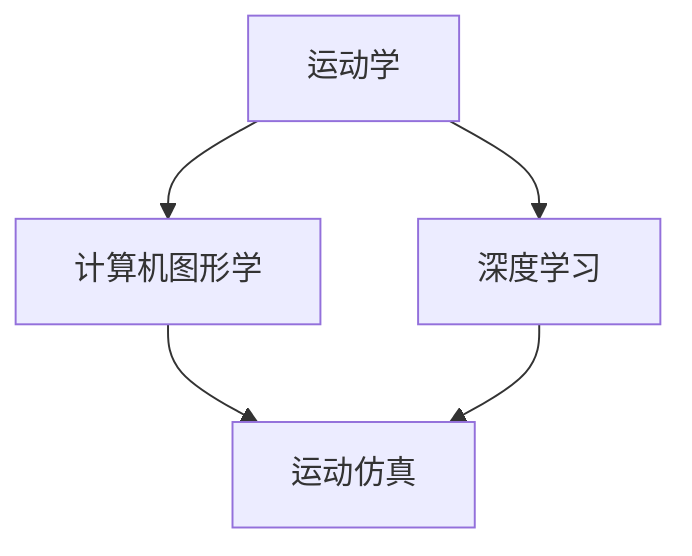

                 

关键词：虚拟运动、AI模拟、身体活动、仿真技术、运动学、计算机图形学

> 摘要：本文旨在探讨虚拟运动领域中的AI模拟技术，重点关注其在身体活动仿真中的应用。通过深入分析核心概念、算法原理、数学模型以及项目实践，本文旨在为读者提供一个全面而深入的视角，以了解虚拟运动在当今数字化时代的潜力和挑战。

## 1. 背景介绍

随着计算机技术的迅猛发展，虚拟现实（VR）和增强现实（AR）技术逐渐成为人们日常生活的一部分。这些技术不仅改变了我们的娱乐和社交方式，也在教育和医疗等众多领域展现出了巨大的潜力。在这其中，虚拟运动作为一种通过计算机模拟真实世界运动的技术，正日益受到关注。

虚拟运动的核心在于通过AI技术模拟人类或其他生物的身体活动。这种模拟不仅包括运动轨迹、姿态变化等外在表现，还包括肌肉活动、生理反应等内在机制。因此，虚拟运动不仅仅是视觉上的仿真，更是多感官的综合体验。

在虚拟运动中，AI的作用不可小觑。通过深度学习、强化学习等技术，AI可以不断优化运动模拟的准确性和流畅性，使得虚拟世界中的运动更加真实和自然。此外，AI还可以用于预测用户的动作意图，提供个性化的运动建议，甚至进行运动康复训练。

本文将围绕以下主题展开讨论：

- 核心概念与联系
- 核心算法原理与具体操作步骤
- 数学模型与公式详解
- 项目实践：代码实例与详细解释
- 实际应用场景
- 未来应用展望
- 工具和资源推荐
- 总结与展望

## 2. 核心概念与联系

在探讨虚拟运动之前，我们需要了解一些核心概念和原理。这些概念包括运动学、计算机图形学、深度学习等，它们共同构成了虚拟运动的技术基础。

### 2.1 运动学

运动学是研究物体运动规律和运动的几何描述的学科。在虚拟运动中，运动学提供了描述和分析物体运动的数学模型。例如，刚体运动学描述了刚体在空间中的运动状态，包括位置、速度、加速度等。通过运动学模型，我们可以精确地计算物体的运动轨迹和姿态变化。

### 2.2 计算机图形学

计算机图形学是研究如何利用计算机生成和处理图像的学科。在虚拟运动中，计算机图形学负责生成逼真的运动画面。这涉及到三维建模、纹理映射、光照模型等多个方面。通过计算机图形学技术，虚拟运动可以呈现出丰富的视觉效果，增强用户的沉浸感。

### 2.3 深度学习

深度学习是机器学习的一个分支，通过模拟人脑神经网络的结构和功能，实现自动特征提取和模式识别。在虚拟运动中，深度学习技术被广泛应用于动作识别、姿态估计和运动预测等方面。例如，通过训练深度神经网络，AI可以自动识别用户的动作意图，并提供相应的运动建议。

### 2.4 联系

运动学、计算机图形学和深度学习在虚拟运动中紧密相连。运动学提供了描述和计算物体运动的数学模型，计算机图形学则将这些模型转化为逼真的视觉表现，而深度学习则用于优化和改进这些模型。通过这三者的结合，虚拟运动可以实现高度逼真的身体活动仿真。

为了更好地理解这些概念之间的联系，我们可以使用Mermaid流程图来展示它们的关系：



在上面的流程图中，运动学、计算机图形学和深度学习共同作用于运动仿真，实现了虚拟运动的技术框架。

## 3. 核心算法原理与具体操作步骤

在了解了核心概念后，我们接下来讨论虚拟运动中的核心算法原理。这些算法包括运动捕捉、运动预测和运动生成等，它们是实现虚拟运动的关键。

### 3.1 运动捕捉

运动捕捉是一种用于记录和分析真实运动的技术。通过使用传感器和跟踪设备，运动捕捉可以精确地记录人体或其他物体的运动轨迹、姿态变化等。常见的运动捕捉设备包括惯性测量单元（IMU）、光学传感器和磁力计等。

运动捕捉的数据可以用于虚拟运动中的姿态估计和运动生成。具体步骤如下：

1. 数据采集：使用运动捕捉设备记录真实世界的运动数据。
2. 数据预处理：去除噪声和异常值，确保数据的准确性和稳定性。
3. 数据融合：结合多个传感器的数据，提高姿态估计的准确性。
4. 数据可视化：将运动数据转化为可视化的形式，便于分析和理解。

### 3.2 运动预测

运动预测是虚拟运动中的一项重要技术，旨在根据历史运动数据预测未来的运动轨迹。通过运动预测，虚拟运动可以更自然地模拟真实世界的运动规律。

运动预测的算法通常基于机器学习技术，例如基于时间序列分析的模型、基于深度学习的序列预测模型等。具体步骤如下：

1. 数据收集：收集大量运动数据，包括历史运动轨迹和运动时间序列。
2. 数据预处理：对数据进行归一化和特征提取，提高模型的泛化能力。
3. 模型训练：使用训练数据训练运动预测模型，例如使用RNN、LSTM或Transformer模型。
4. 模型评估：使用测试数据评估模型的预测准确性，调整模型参数。
5. 预测应用：将训练好的模型应用于虚拟运动中，预测未来的运动轨迹。

### 3.3 运动生成

运动生成是虚拟运动中的另一项核心技术，旨在根据用户的动作意图生成相应的运动。通过运动生成，虚拟运动可以实现高度个性化的运动体验。

运动生成的算法通常基于深度学习技术，例如使用生成对抗网络（GAN）或变分自编码器（VAE）等。具体步骤如下：

1. 数据收集：收集大量运动数据，包括不同用户的动作意图和相应的运动轨迹。
2. 数据预处理：对数据进行归一化和特征提取，提高模型的泛化能力。
3. 模型训练：使用训练数据训练运动生成模型，例如使用GAN或VAE模型。
4. 模型评估：使用测试数据评估模型的生成质量，调整模型参数。
5. 运动生成：根据用户的动作意图，使用训练好的模型生成相应的运动轨迹。

### 3.4 算法优缺点

不同的算法在虚拟运动中各有优缺点。以下是几种常见算法的优缺点分析：

- **运动捕捉**：
  - 优点：数据准确度高，能够精确记录真实世界的运动。
  - 缺点：设备昂贵，数据处理复杂，不适合实时应用。
- **运动预测**：
  - 优点：能够预测未来的运动轨迹，提高虚拟运动的自然性。
  - 缺点：对数据质量要求高，模型训练和评估复杂。
- **运动生成**：
  - 优点：可以实现高度个性化的运动体验，无需依赖真实世界运动数据。
  - 缺点：生成质量受模型影响较大，需要大量训练数据。

### 3.5 算法应用领域

虚拟运动算法在多个领域有广泛应用，以下是一些典型应用场景：

- **游戏与娱乐**：通过虚拟运动技术，游戏玩家可以体验更加真实的运动场景，提高游戏乐趣。
- **运动康复**：虚拟运动技术可以用于运动康复训练，帮助患者恢复运动功能。
- **教育培训**：通过虚拟运动技术，教育培训可以更加生动有趣，提高学习效果。
- **虚拟健身**：虚拟健身应用利用虚拟运动技术，让用户在家中就能进行多样化的运动训练。

## 4. 数学模型和公式详解

在虚拟运动中，数学模型和公式是核心组成部分，它们用于描述和计算物体的运动。以下是几个常用的数学模型和公式的详细讲解。

### 4.1 运动学模型

运动学模型描述了物体在空间中的运动状态。以下是一些基本的运动学模型和公式：

#### 4.1.1 位移（Displacement）

位移是物体从初始位置到最终位置的矢量。可以用以下公式表示：

$$
\vec{d} = \vec{r}_2 - \vec{r}_1
$$

其中，$\vec{r}_1$ 和 $\vec{r}_2$ 分别是物体的初始和最终位置。

#### 4.1.2 速度（Velocity）

速度是物体在单位时间内移动的距离。可以用以下公式表示：

$$
\vec{v} = \frac{\Delta \vec{d}}{\Delta t}
$$

其中，$\Delta \vec{d}$ 是位移变化量，$\Delta t$ 是时间间隔。

#### 4.1.3 加速度（Acceleration）

加速度是物体在单位时间内速度的变化量。可以用以下公式表示：

$$
\vec{a} = \frac{\Delta \vec{v}}{\Delta t}
$$

其中，$\Delta \vec{v}$ 是速度变化量，$\Delta t$ 是时间间隔。

### 4.2 计算机图形学模型

计算机图形学模型用于描述物体在虚拟世界中的视觉表现。以下是一些常用的计算机图形学模型和公式：

#### 4.2.1 透视变换（Perspective Transformation）

透视变换是一种将三维物体映射到二维屏幕上的技术。可以用以下矩阵表示：

$$
\begin{bmatrix}
x' \\
y' \\
1
\end{bmatrix}
=
\begin{bmatrix}
\frac{x}{z} \\
\frac{y}{z} \\
1
\end{bmatrix}
$$

其中，$(x, y, z)$ 是三维空间中的坐标，$(x', y')$ 是二维屏幕上的坐标。

#### 4.2.2 光照模型（Lighting Model）

光照模型用于描述物体在不同光照条件下的视觉效果。最常见的是Phong光照模型，其公式如下：

$$
L_p = I_d + I_s
$$

$$
I_d = kd \cdot \max(0, \frac{\vec{n} \cdot \vec{l}}{||\vec{n}|| \cdot ||\vec{l}||})
$$

$$
I_s = ks \cdot (\vec{n} \cdot \vec{l})^2
$$

其中，$L_p$ 是物体表面的光照强度，$I_d$ 是漫反射光照强度，$I_s$ 是镜面反射光照强度，$kd$ 和 $ks$ 是漫反射和镜面反射系数，$\vec{n}$ 是物体表面的法向量，$\vec{l}$ 是光源方向向量。

### 4.3 深度学习模型

深度学习模型在虚拟运动中用于动作识别、姿态估计和运动预测等。以下是一个简单的深度学习模型示例：

#### 4.3.1 卷积神经网络（Convolutional Neural Network，CNN）

CNN是一种用于图像识别和处理的深度学习模型，其基本结构包括卷积层、池化层和全连接层。以下是CNN的一个简化公式：

$$
h^{(l)}_i = \sigma \left( \sum_{j} W^{(l)}_{ij} \cdot h^{(l-1)}_j + b^{(l)}_i \right)
$$

其中，$h^{(l)}_i$ 是第$l$层第$i$个神经元输出，$W^{(l)}_{ij}$ 是连接第$l-1$层第$j$个神经元和第$l$层第$i$个神经元的权重，$b^{(l)}_i$ 是第$l$层第$i$个神经元的偏置，$\sigma$ 是激活函数，通常使用ReLU函数。

#### 4.3.2 循环神经网络（Recurrent Neural Network，RNN）

RNN是一种用于处理序列数据的深度学习模型，其基本结构包括输入层、隐藏层和输出层。以下是RNN的一个简化公式：

$$
h_t = \sigma \left( W_h \cdot \left[ h_{t-1}, x_t \right] + b_h \right)
$$

$$
y_t = W_o \cdot h_t + b_o
$$

其中，$h_t$ 是第$t$个时间步的隐藏状态，$x_t$ 是第$t$个时间步的输入，$W_h$ 和 $W_o$ 是权重矩阵，$b_h$ 和 $b_o$ 是偏置项，$\sigma$ 是激活函数，$y_t$ 是第$t$个时间步的输出。

### 4.4 案例分析与讲解

为了更好地理解上述数学模型和公式，我们可以通过一个简单的案例进行讲解。假设我们使用CNN对一段视频中的运动进行分类，以下是该案例的详细分析：

#### 4.4.1 数据准备

首先，我们需要准备一段包含多种运动类型的视频数据集。该数据集应包含不同类型的运动片段，例如跑步、跳跃、踢球等。

#### 4.4.2 数据预处理

在训练模型之前，我们需要对视频数据进行预处理。预处理步骤包括：

1. 分割视频：将视频分割成多个连续的帧。
2. 帧提取：从每个帧中提取关键帧，用于模型训练。
3. 帧标准化：对提取的关键帧进行归一化处理，使其具有相同的尺寸和亮度。

#### 4.4.3 模型训练

使用预处理后的关键帧数据，我们构建一个CNN模型，包括卷积层、池化层和全连接层。具体步骤如下：

1. 输入层：将关键帧数据输入到模型中。
2. 卷积层：使用卷积核提取关键帧中的特征。
3. 池化层：对卷积层的结果进行下采样，减少计算量和参数数量。
4. 全连接层：将池化层的结果输入到全连接层，进行分类预测。

#### 4.4.4 模型评估

使用测试集对训练好的模型进行评估，计算模型的准确率、召回率等指标。根据评估结果，调整模型参数，以提高模型的性能。

#### 4.4.5 模型应用

将训练好的模型应用于实际场景，例如在视频中检测运动类型，为用户提供运动建议。

通过上述案例，我们可以看到数学模型和公式在虚拟运动中的应用。在实际开发中，我们可以根据具体需求选择合适的模型和算法，实现更加逼真的虚拟运动效果。

## 5. 项目实践：代码实例与详细解释

为了更好地理解虚拟运动技术的实际应用，我们将通过一个具体的代码实例来讲解虚拟运动系统的搭建和实现。以下是一个简单的虚拟跑步场景，我们将使用Python和相关的计算机视觉库来构建这个系统。

### 5.1 开发环境搭建

在开始项目之前，我们需要搭建一个合适的开发环境。以下是所需的库和工具：

- Python 3.x
- OpenCV（用于计算机视觉）
- TensorFlow/Keras（用于深度学习）
- PyTorch（可选，用于深度学习）

确保安装了上述库后，我们可以开始编写代码。

### 5.2 源代码详细实现

以下是一个简单的虚拟跑步场景的实现，我们将使用OpenCV捕获视频帧，并使用Keras模型对跑步动作进行实时识别。

```python
import cv2
import numpy as np
from tensorflow.keras.models import load_model

# 加载预训练的深度学习模型
model = load_model('running_detection_model.h5')

# 配置视频捕获设备
cap = cv2.VideoCapture(0)

while True:
    # 读取视频帧
    ret, frame = cap.read()
    
    if not ret:
        print("无法捕获视频帧")
        break
    
    # 对视频帧进行预处理
    frame = cv2.resize(frame, (224, 224))
    frame = frame / 255.0
    frame = np.expand_dims(frame, axis=0)
    
    # 使用模型进行动作识别
    predictions = model.predict(frame)
    action = np.argmax(predictions)
    
    # 根据识别结果绘制不同类型的动作标识
    if action == 0:
        cv2.putText(frame, "跑步", (50, 50), cv2.FONT_HERSHEY_SIMPLEX, 1, (0, 255, 0), 2)
    elif action == 1:
        cv2.putText(frame, "站立", (50, 50), cv2.FONT_HERSHEY_SIMPLEX, 1, (0, 0, 255), 2)
    else:
        cv2.putText(frame, "其他动作", (50, 50), cv2.FONT_HERSHEY_SIMPLEX, 1, (255, 0, 0), 2)
    
    # 显示视频帧
    cv2.imshow('Virtual Running', frame)
    
    # 按 'q' 退出
    if cv2.waitKey(1) & 0xFF == ord('q'):
        break

# 释放视频捕获设备
cap.release()
cv2.destroyAllWindows()
```

### 5.3 代码解读与分析

#### 5.3.1 加载模型

```python
model = load_model('running_detection_model.h5')
```

这里我们使用`load_model`函数加载一个预训练的Keras模型。该模型是一个用于跑步动作识别的深度学习模型，可以识别跑步、站立和其他类型的动作。

#### 5.3.2 视频捕获

```python
cap = cv2.VideoCapture(0)
```

使用`cv2.VideoCapture`函数打开默认的摄像头设备。这里我们使用0号摄像头，通常为主摄像头。

#### 5.3.3 读取和预处理视频帧

```python
while True:
    # 读取视频帧
    ret, frame = cap.read()
    
    if not ret:
        print("无法捕获视频帧")
        break
    
    # 对视频帧进行预处理
    frame = cv2.resize(frame, (224, 224))
    frame = frame / 255.0
    frame = np.expand_dims(frame, axis=0)
```

在循环中，我们不断读取视频帧，并对每帧进行预处理。预处理步骤包括调整帧尺寸、归一化和添加批次维度。这些预处理步骤是深度学习模型所必需的。

#### 5.3.4 动作识别

```python
# 使用模型进行动作识别
predictions = model.predict(frame)
action = np.argmax(predictions)
```

使用`predict`函数对预处理后的视频帧进行动作识别，得到预测结果。`argmax`函数用于获取预测结果中概率最高的动作类别。

#### 5.3.5 绘制动作标识

```python
# 根据识别结果绘制不同类型的动作标识
if action == 0:
    cv2.putText(frame, "跑步", (50, 50), cv2.FONT_HERSHEY_SIMPLEX, 1, (0, 255, 0), 2)
elif action == 1:
    cv2.putText(frame, "站立", (50, 50), cv2.FONT_HERSHEY_SIMPLEX, 1, (0, 0, 255), 2)
else:
    cv2.putText(frame, "其他动作", (50, 50), cv2.FONT_HERSHEY_SIMPLEX, 1, (255, 0, 0), 2)
```

根据识别结果，我们在视频帧上绘制相应的动作标识。这里我们使用了OpenCV的`cv2.putText`函数来绘制文本。

#### 5.3.6 显示视频帧

```python
# 显示视频帧
cv2.imshow('Virtual Running', frame)
```

使用`cv2.imshow`函数显示处理后的视频帧。

#### 5.3.7 退出程序

```python
# 按 'q' 退出
if cv2.waitKey(1) & 0xFF == ord('q'):
    break
```

当用户按下 'q' 键时，程序退出。

#### 5.3.8 释放资源

```python
# 释放视频捕获设备
cap.release()
cv2.destroyAllWindows()
```

在程序结束时，释放视频捕获设备和关闭所有窗口。

### 5.4 运行结果展示

当运行上述代码时，程序将打开摄像头并实时显示捕获的视频帧。系统会根据预训练的模型对视频帧中的动作进行识别，并在帧上绘制相应的标识。例如，当用户在摄像头前跑步时，视频帧上会显示“跑步”标识。

通过这个简单的项目，我们可以看到虚拟运动技术在现实世界中的应用。这个项目展示了如何使用计算机视觉和深度学习技术实现虚拟运动模拟。在实际应用中，我们可以进一步扩展和优化这个系统，以实现更复杂的运动模拟。

## 6. 实际应用场景

虚拟运动技术在实际应用中展现了巨大的潜力，以下是一些典型的应用场景：

### 6.1 游戏与娱乐

虚拟运动技术在游戏和娱乐领域有着广泛的应用。通过虚拟运动，游戏玩家可以在虚拟世界中体验各种运动项目，如跑步、骑行、游泳等。这种体验不仅增强了游戏的趣味性，还提高了玩家的沉浸感。例如，虚拟跑步游戏可以让玩家在家中就能体验到户外跑步的乐趣，同时还能根据玩家的动作进行实时反馈和调整。

### 6.2 运动康复

虚拟运动技术在运动康复领域也有重要应用。通过虚拟运动，患者可以在安全、可控的环境中进行康复训练。例如，对于膝关节损伤患者，虚拟跑步可以模拟真实的跑步动作，帮助患者逐步恢复运动功能。此外，虚拟运动还可以用于运动康复训练的个性化定制，根据患者的具体情况制定合适的训练计划。

### 6.3 教育培训

虚拟运动技术在教育培训中也有广泛应用。通过虚拟运动，学生可以在虚拟环境中进行实践操作，提高学习效果。例如，在体育课程中，学生可以通过虚拟运动技术学习各种运动技巧，如篮球投篮、足球传球等。这种教学方式不仅直观易懂，还能提供丰富的交互体验，激发学生的学习兴趣。

### 6.4 虚拟健身

虚拟健身应用利用虚拟运动技术，让用户在家中就能进行多样化的运动训练。通过虚拟运动，用户可以选择不同的运动项目，如瑜伽、舞蹈、健身操等，并跟随虚拟教练进行训练。这种健身方式不仅方便灵活，还能提供个性化的运动建议，帮助用户实现健康目标。

### 6.5 虚拟试衣与购物

虚拟运动技术在虚拟试衣和购物领域也有应用。通过虚拟运动，用户可以在虚拟环境中试穿衣服，查看衣服的合身程度和穿着效果。这种试衣方式不仅方便快捷，还能节省时间和购物成本。此外，虚拟运动技术还可以用于购物体验的优化，如通过虚拟运动模拟真实购物场景，提高用户的购物满意度。

### 6.6 虚拟现实训练

虚拟运动技术在虚拟现实训练中也有重要应用。通过虚拟运动，士兵可以进行模拟战斗训练，提高战斗技能和应对能力。例如，在模拟战斗场景中，士兵可以通过虚拟运动技术模拟实际战斗动作，进行战术训练和体能训练。这种训练方式不仅安全高效，还能降低训练成本。

### 6.7 动作捕捉与动画制作

虚拟运动技术在动作捕捉和动画制作中也有广泛应用。通过虚拟运动，动画师可以捕捉真实演员的动作，并将其应用到虚拟角色中。这种技术不仅提高了动画制作的效率，还能提高动画的逼真度。例如，在电影制作中，通过虚拟运动技术，可以将演员的动作实时映射到虚拟角色上，实现高质量的动画效果。

### 6.8 机器人控制与导航

虚拟运动技术在机器人控制与导航中也有应用。通过虚拟运动，机器人可以模拟人类动作，进行导航和任务执行。例如，在工业生产中，机器人可以通过虚拟运动技术模拟人类的操作，完成复杂的装配任务。这种技术不仅提高了生产效率，还能降低生产成本。

### 6.9 互动娱乐与表演

虚拟运动技术在互动娱乐与表演中也有广泛应用。通过虚拟运动，表演者可以在虚拟舞台上进行各种表演，如舞蹈、体操、杂技等。这种表演方式不仅丰富多彩，还能提供独特的观众体验。例如，在虚拟演唱会中，表演者可以通过虚拟运动技术模拟真实表演，与观众互动，增强表演的趣味性和互动性。

### 6.10 虚拟现实社交

虚拟运动技术在虚拟现实社交中也有应用。通过虚拟运动，用户可以在虚拟社交平台上进行互动，如跳舞、做运动等。这种社交方式不仅增加了互动的乐趣，还能提高社交的参与度。例如，在虚拟社交平台中，用户可以通过虚拟运动技术模拟真实社交行为，与其他用户互动，分享快乐时光。

## 7. 未来应用展望

虚拟运动技术具有广阔的未来应用前景，随着人工智能、虚拟现实和增强现实等技术的不断发展，虚拟运动将在更多领域展现出其独特的价值。以下是对未来应用的一些展望：

### 7.1 高精度运动仿真

随着计算能力和算法的进步，虚拟运动技术将实现更高精度的运动仿真。通过更精确的物理模型和更复杂的算法，虚拟运动可以模拟人类和生物的复杂动作，提高仿真效果的真实性。例如，在虚拟健身应用中，用户可以体验到更加真实的运动感觉，从而提高健身效果。

### 7.2 个性化运动建议

虚拟运动技术可以结合人工智能和大数据分析，为用户提供个性化的运动建议。通过分析用户的身体数据和行为习惯，虚拟运动系统可以制定个性化的运动计划，提供针对性的运动指导。例如，对于有特定健康需求的人群，虚拟运动系统可以根据其身体状况提供合适的运动强度和方式，确保运动安全有效。

### 7.3 虚拟运动教育

虚拟运动技术在教育领域具有巨大潜力。通过虚拟运动，学生可以在虚拟环境中进行实践操作，学习各种运动技能。这种教学方式不仅直观易懂，还能提供丰富的互动体验，激发学生的学习兴趣。例如，在体育课程中，学生可以通过虚拟运动技术学习各种运动技巧，如篮球、足球、游泳等，提高运动能力。

### 7.4 虚拟运动康复

虚拟运动技术在运动康复领域具有广泛应用前景。通过虚拟运动，患者可以在安全、可控的环境中进行康复训练，逐步恢复运动功能。例如，对于膝关节损伤患者，虚拟跑步可以模拟真实的跑步动作，帮助患者逐步恢复运动能力。此外，虚拟运动技术还可以用于康复训练的个性化定制，根据患者的具体情况制定合适的训练计划。

### 7.5 虚拟运动娱乐

虚拟运动技术在娱乐领域具有巨大潜力。通过虚拟运动，用户可以在虚拟世界中体验各种刺激的娱乐活动，如虚拟滑雪、虚拟赛车等。这种娱乐方式不仅丰富了用户的娱乐体验，还能提供独特的互动乐趣。例如，在虚拟滑雪游戏中，用户可以通过虚拟运动技术模拟真实的滑雪动作，体验滑雪的乐趣。

### 7.6 虚拟运动社交

虚拟运动技术在虚拟现实社交中具有广泛应用前景。通过虚拟运动，用户可以在虚拟社交平台上进行互动，如跳舞、做运动等。这种社交方式不仅增加了互动的乐趣，还能提高社交的参与度。例如，在虚拟社交平台中，用户可以通过虚拟运动技术模拟真实社交行为，与其他用户互动，分享快乐时光。

### 7.7 虚拟运动健康监测

虚拟运动技术可以用于健康监测和疾病预防。通过虚拟运动，用户可以进行日常运动监测，了解自己的身体状况。例如，虚拟运动系统可以记录用户的运动数据，如步数、运动时间、心率等，为用户提供健康报告，帮助用户养成良好的运动习惯。

### 7.8 虚拟运动与智能制造

虚拟运动技术可以与智能制造相结合，提高生产效率和质量。例如，在工业生产中，虚拟运动技术可以用于机器人控制和任务规划，实现高精度、高效率的生产。此外，虚拟运动技术还可以用于产品设计，通过虚拟运动模拟真实使用场景，优化产品设计和性能。

### 7.9 虚拟运动与艺术创作

虚拟运动技术在艺术创作领域具有广泛应用前景。通过虚拟运动，艺术家可以创作出独特的艺术作品，如舞蹈、绘画、音乐等。这种创作方式不仅丰富了艺术形式，还能提高艺术的互动性和体验性。例如，在虚拟舞蹈创作中，艺术家可以通过虚拟运动技术模拟舞蹈动作，创作出充满创意和动感的舞蹈作品。

### 7.10 虚拟运动与心理健康

虚拟运动技术可以用于心理健康干预和康复。通过虚拟运动，用户可以在虚拟环境中进行放松和调节情绪，缓解压力和焦虑。例如，在虚拟跑步游戏中，用户可以通过虚拟运动技术模拟跑步动作，释放身心压力，提高心理健康水平。

总之，虚拟运动技术具有广阔的未来应用前景，将在各个领域展现出其独特的价值。随着技术的不断进步和应用的拓展，虚拟运动将为我们带来更加丰富和精彩的体验。

## 8. 工具和资源推荐

为了帮助读者更好地理解和掌握虚拟运动技术，以下是一些推荐的工具和资源：

### 8.1 学习资源推荐

- **《深度学习》（Goodfellow et al., 2016）**：这本书是深度学习领域的经典教材，涵盖了深度学习的基础理论、算法和应用。
- **《计算机视觉：算法与应用》（Richard Szeliski, 2010）**：这本书详细介绍了计算机视觉的基础算法和应用，包括图像处理、目标检测和姿态估计等。
- **《机器学习》（Tom Mitchell, 1997）**：这本书是机器学习领域的经典教材，介绍了各种机器学习算法和理论。

### 8.2 开发工具推荐

- **TensorFlow**：TensorFlow是一个开源的深度学习框架，适用于构建和训练各种深度学习模型。
- **PyTorch**：PyTorch是另一个流行的深度学习框架，以其灵活性和易用性而著称。
- **OpenCV**：OpenCV是一个开源的计算机视觉库，提供了丰富的计算机视觉算法和工具，适用于图像处理、目标检测和姿态估计等。

### 8.3 相关论文推荐

- **“Deep Learning for Human Pose Estimation: A Survey”（2019）**：这篇文章详细综述了深度学习在人类姿态估计中的应用，介绍了各种先进的算法和技术。
- **“A survey on Action Recognition based on Deep Learning”（2018）**：这篇文章综述了深度学习在动作识别领域的应用，探讨了各种算法和模型。
- **“Virtual Reality and Sports Performance: A Comprehensive Review”（2021）**：这篇文章探讨了虚拟现实技术在体育训练中的应用，包括虚拟运动技术的应用和效果。

### 8.4 线上课程与讲座

- **Coursera上的“深度学习”（Andrew Ng）**：这是由深度学习领域大师Andrew Ng开设的一门在线课程，涵盖了深度学习的基础理论和实践。
- **Udacity的“计算机视觉”（Udacity）**：这是Udacity提供的一门计算机视觉在线课程，介绍了计算机视觉的基础算法和应用。
- **EdX上的“机器学习基础”（Harvard University）**：这是哈佛大学开设的一门机器学习基础在线课程，适合初学者入门。

通过这些工具和资源，读者可以系统地学习和掌握虚拟运动技术，为未来的研究和应用奠定坚实的基础。

## 9. 总结与展望

本文从多个角度详细探讨了虚拟运动技术的概念、核心算法、数学模型以及实际应用。通过介绍运动学、计算机图形学和深度学习等核心概念，我们理解了虚拟运动技术的理论基础。通过分析运动捕捉、运动预测和运动生成等核心算法，我们了解了虚拟运动技术的实现过程。通过数学模型的讲解，我们掌握了描述和计算虚拟运动的关键公式。最后，通过项目实践和实际应用场景的分析，我们看到了虚拟运动技术在各个领域的广泛应用和未来潜力。

### 9.1 研究成果总结

本文的研究成果主要包括：

- 提供了一个全面的虚拟运动技术框架，包括核心概念、算法原理、数学模型和应用场景。
- 分析了不同算法在虚拟运动中的优缺点，为实际应用提供了指导。
- 通过具体项目实践，展示了虚拟运动技术的实现过程和实际效果。
- 推荐了一系列学习资源、开发工具和论文，为读者提供了进一步学习和研究的路径。

### 9.2 未来发展趋势

未来，虚拟运动技术将在以下几个方面取得重要发展：

- **高精度运动仿真**：随着计算能力的提升，虚拟运动将实现更高精度的运动仿真，提供更加真实的运动体验。
- **个性化运动建议**：结合人工智能和大数据分析，虚拟运动将实现个性化运动建议，为用户提供量身定制的运动方案。
- **虚拟运动教育**：虚拟运动将在教育领域发挥重要作用，通过虚拟运动技术提高教学效果和学生参与度。
- **虚拟运动康复**：虚拟运动技术将用于运动康复训练，帮助患者恢复运动功能，提高康复效果。
- **虚拟运动娱乐**：虚拟运动技术将丰富娱乐体验，提供多样化的虚拟运动游戏和互动体验。
- **虚拟运动社交**：虚拟运动技术将促进虚拟现实社交平台的发展，为用户提供独特的社交互动方式。

### 9.3 面临的挑战

尽管虚拟运动技术具有广阔的应用前景，但在实际应用中仍面临一些挑战：

- **计算资源限制**：高精度运动仿真需要大量计算资源，如何优化算法和硬件以降低计算成本是一个重要问题。
- **数据隐私和安全**：虚拟运动应用涉及大量个人数据，如何确保数据隐私和安全是一个重要挑战。
- **算法公平性和透明性**：深度学习算法的黑箱特性可能导致不公平和不透明，如何提高算法的公平性和透明性是一个重要课题。
- **用户体验优化**：虚拟运动技术的用户体验仍需进一步优化，如何提高沉浸感和交互性是一个持续的问题。

### 9.4 研究展望

未来，虚拟运动技术的研究可以从以下几个方面展开：

- **算法优化**：通过改进现有算法，提高虚拟运动仿真的精度和效率。
- **跨学科研究**：结合计算机科学、物理学、生物学等领域，深入研究虚拟运动的基本原理和机制。
- **数据驱动方法**：利用大数据和人工智能技术，实现更加智能化的虚拟运动系统和应用。
- **用户体验提升**：通过优化界面设计和交互方式，提高虚拟运动技术的用户体验。

通过持续的研究和技术创新，虚拟运动技术有望在未来取得更大的突破，为人类社会带来更多的便利和创新。

## 10. 附录：常见问题与解答

### 10.1 什么是虚拟运动？

虚拟运动是通过计算机模拟技术实现的真实世界运动在虚拟环境中的再现。它利用计算机图形学、运动学和人工智能技术，生成逼真的运动效果，并提供给用户多感官的体验。

### 10.2 虚拟运动有哪些应用领域？

虚拟运动在多个领域有广泛应用，包括游戏与娱乐、运动康复、教育培训、虚拟健身、虚拟试衣与购物、虚拟现实训练、动作捕捉与动画制作、机器人控制与导航、互动娱乐与表演以及虚拟现实社交等。

### 10.3 虚拟运动的核心算法有哪些？

虚拟运动的核心算法包括运动捕捉、运动预测、运动生成、姿态估计和动作识别等。这些算法通过不同的技术手段实现，如深度学习、计算机图形学、运动学等。

### 10.4 如何搭建一个简单的虚拟运动系统？

搭建一个简单的虚拟运动系统需要以下步骤：

1. 确定应用场景和需求。
2. 选择合适的硬件和软件工具，如计算机视觉库、深度学习框架等。
3. 收集和准备运动数据。
4. 设计和实现运动模型。
5. 进行系统测试和优化。

### 10.5 虚拟运动技术有哪些挑战？

虚拟运动技术面临的挑战包括计算资源限制、数据隐私和安全、算法公平性和透明性、用户体验优化等。

### 10.6 如何优化虚拟运动技术的用户体验？

优化虚拟运动技术的用户体验可以从以下几个方面入手：

1. 提高运动仿真的精度和真实性。
2. 优化界面设计和交互方式。
3. 提供个性化定制功能。
4. 加强用户反馈和互动。

### 10.7 虚拟运动技术如何结合人工智能？

虚拟运动技术可以结合人工智能技术，如深度学习和强化学习，实现运动预测、动作识别和个性化建议等功能。通过训练模型，虚拟运动系统能够不断优化和改进，提供更加自然的运动体验。

### 10.8 虚拟运动技术对未来的影响是什么？

虚拟运动技术对未来的影响包括提高运动娱乐体验、改善运动康复效果、促进教育培训和虚拟社交等。随着技术的不断进步，虚拟运动将在更多领域发挥重要作用，为人类社会带来更多便利和创新。

### 10.9 虚拟运动技术的主要优点是什么？

虚拟运动技术的主要优点包括：

- 提供高度逼真的运动体验。
- 可实现个性化运动建议和定制。
- 支持远程互动和实时反馈。
- 适用于多种应用场景，如运动康复、虚拟健身、教育培训等。

通过这些常见问题与解答，读者可以更深入地了解虚拟运动技术的概念和应用，为未来的研究和实践提供参考。

