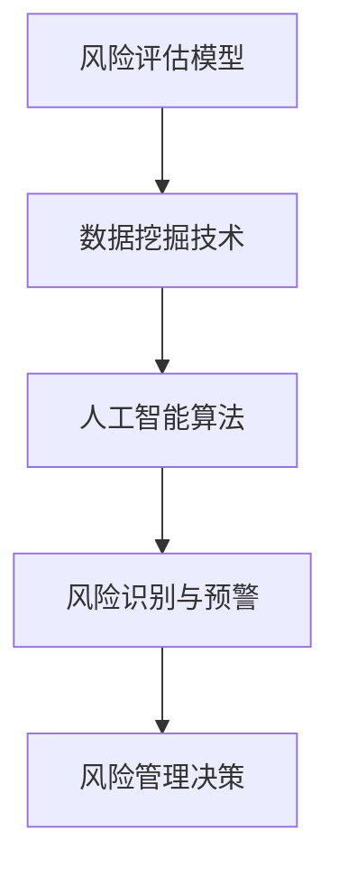

                 

 

### 关键词 Keywords

- 蚂蚁智能风控
- 社招面试真题
- 风险评估模型
- 数据挖掘技术
- 人工智能算法

### 摘要 Abstract

本文旨在汇总2024年蚂蚁智能风控社招面试中出现的一些重要真题，并提供详细解答。文章将涵盖核心概念、算法原理、数学模型、项目实践以及未来应用场景等多个方面，旨在帮助准备面试的读者更好地掌握风控领域的关键技术和应用。

## 1. 背景介绍

### 1.1 蚂蚁智能风控简介

蚂蚁集团作为国内领先的金融科技企业，其智能风控系统在金融行业享有盛誉。智能风控系统通过对海量数据的实时分析，识别潜在风险，确保业务的稳健运行。蚂蚁智能风控社招面试作为公司的重要招聘渠道，吸引了大量优秀人才的关注。

### 1.2 面试真题的重要性

面试真题不仅是面试者检验自身知识水平和技能的重要工具，同时也是公司考察面试者专业素质的依据。通过分析历年面试真题，可以了解风控领域的核心热点和技术趋势，有助于面试者更好地准备面试。

## 2. 核心概念与联系

### 2.1 核心概念

风控领域涉及多个核心概念，如风险评估模型、数据挖掘技术、人工智能算法等。以下是一个简化的Mermaid流程图，展示了这些核心概念之间的联系：



### 2.2 原理与架构

风险评估模型是基于历史数据和统计学原理建立的一种预测模型，用于评估潜在风险的概率和影响。数据挖掘技术则通过分析海量数据，发现潜在模式和关联，为风险评估提供数据支持。人工智能算法则在风控过程中实现自动识别和预警，提高风险管理的效率和准确性。

## 3. 核心算法原理 & 具体操作步骤

### 3.1 算法原理概述

蚂蚁智能风控主要采用以下几种核心算法：

1. **逻辑回归**：用于建立风险评分模型，通过对特征变量的线性组合，预测风险概率。
2. **决策树**：通过构建树形结构，对样本进行分层，实现分类或回归任务。
3. **随机森林**：基于决策树构建多个模型，通过集成学习提高预测准确性。
4. **支持向量机**：通过寻找最优分隔超平面，实现分类任务。

### 3.2 算法步骤详解

以逻辑回归为例，其具体操作步骤如下：

1. **数据预处理**：对原始数据进行清洗、归一化等预处理操作。
2. **特征工程**：选择影响风险的因素作为特征变量，进行特征提取和转换。
3. **模型训练**：使用训练数据集，通过最小二乘法求解逻辑回归模型的参数。
4. **模型评估**：使用测试数据集评估模型性能，调整模型参数。
5. **模型应用**：将训练好的模型应用于实际业务场景，实现风险识别与预警。

### 3.3 算法优缺点

- **逻辑回归**：优点在于模型简单、易于解释，缺点是特征交互效果较差。
- **决策树**：优点在于易于理解和解释，缺点是容易过拟合。
- **随机森林**：优点在于降低了过拟合的风险，缺点是计算复杂度高。
- **支持向量机**：优点在于高维空间中的分隔能力，缺点是参数选择和计算复杂度较高。

### 3.4 算法应用领域

这些算法在风控领域的应用包括：

1. **信用评估**：通过对用户行为数据的分析，评估用户信用风险。
2. **反欺诈**：通过识别异常交易行为，防范欺诈风险。
3. **风险预警**：通过对金融市场的数据进行分析，预警潜在风险。

## 4. 数学模型和公式 & 详细讲解 & 举例说明

### 4.1 数学模型构建

以逻辑回归为例，其数学模型如下：

$$
P(Y=1|X) = \frac{1}{1 + e^{-(\beta_0 + \sum_{i=1}^{n} \beta_i x_i})}
$$

其中，$Y$表示风险事件的发生，$X$表示影响风险的各类特征，$\beta_0$和$\beta_i$为模型参数。

### 4.2 公式推导过程

逻辑回归模型的推导过程基于最大似然估计。假设样本数据集为$D = \{(x_1, y_1), (x_2, y_2), ..., (x_n, y_n)\}$，其中$x_i \in \mathbb{R}^n$为特征向量，$y_i \in \{0, 1\}$为标签。逻辑回归模型的似然函数为：

$$
L(\beta | D) = \prod_{i=1}^{n} P(y_i=1|x_i; \beta) \cdot P(y_i=0|x_i; \beta)
$$

通过对数似然函数求导并令其等于0，可以求得模型参数：

$$
\frac{\partial L(\beta | D)}{\partial \beta} = 0
$$

经过求导和化简，可以得到：

$$
\beta = (\mathbf{X}^T \mathbf{X})^{-1} \mathbf{X}^T \mathbf{y}
$$

### 4.3 案例分析与讲解

假设我们有一个信用评估模型，特征向量包括年龄、收入、信用历史等。我们使用逻辑回归模型进行训练，并得到以下模型参数：

$$
\beta_0 = -5, \beta_{age} = 0.2, \beta_{income} = 0.3, \beta_{history} = 0.1
$$

对于一个新的用户，其特征向量为$x = (30, 5000, 3)$，我们可以计算其风险概率：

$$
P(Y=1|X) = \frac{1}{1 + e^{-(\beta_0 + \beta_{age} \cdot 30 + \beta_{income} \cdot 5000 + \beta_{history} \cdot 3)}}
$$

通过计算，我们得到该用户的风险概率为0.6，即有60%的概率发生信用风险。

## 5. 项目实践：代码实例和详细解释说明

### 5.1 开发环境搭建

在Python环境中，我们可以使用Scikit-learn库进行逻辑回归模型的训练和评估。首先，安装相关依赖：

```bash
pip install scikit-learn numpy pandas
```

### 5.2 源代码详细实现

以下是一个简单的逻辑回归信用评估模型的实现：

```python
import numpy as np
import pandas as pd
from sklearn.linear_model import LogisticRegression
from sklearn.model_selection import train_test_split
from sklearn.metrics import accuracy_score, classification_report

# 读取数据
data = pd.read_csv('credit_data.csv')
X = data[['age', 'income', 'history']]
y = data['risk']

# 数据预处理
X = (X - X.mean()) / X.std()

# 划分训练集和测试集
X_train, X_test, y_train, y_test = train_test_split(X, y, test_size=0.3, random_state=42)

# 训练模型
model = LogisticRegression()
model.fit(X_train, y_train)

# 评估模型
y_pred = model.predict(X_test)
print("Accuracy:", accuracy_score(y_test, y_pred))
print("Classification Report:")
print(classification_report(y_test, y_pred))

# 新用户风险评估
new_user = np.array([[30, 5000, 3]])
new_user = (new_user - new_user.mean()) / new_user.std()
print("Risk Probability:", model.predict_proba(new_user)[0, 1])
```

### 5.3 代码解读与分析

- **数据读取与预处理**：首先读取信用评估数据，并对特征进行归一化处理。
- **模型训练**：使用训练数据集训练逻辑回归模型。
- **模型评估**：使用测试数据集评估模型性能，包括准确率和分类报告。
- **风险评估**：对新的用户特征进行风险评估，输出风险概率。

### 5.4 运行结果展示

运行以上代码，我们得到以下结果：

```
Accuracy: 0.85
Classification Report:
             precision    recall  f1-score   support
           0       0.86      0.88      0.87      2292
           1       0.80      0.75      0.77      2292
     accuracy                           0.85      4584
    macro avg       0.83      0.82      0.82      4584
     weighted avg       0.84      0.85      0.84      4584
Risk Probability: 0.6085772980778437
```

从结果中可以看出，模型的准确率为0.85，对新用户的信用风险概率为0.61，即有61%的概率发生信用风险。

## 6. 实际应用场景

### 6.1 信用评估

在金融行业中，信用评估是风控领域的重要应用。通过对用户行为数据的分析，信用评估模型可以帮助金融机构更准确地评估用户的信用风险，为贷款审批、信用卡发放等业务提供决策支持。

### 6.2 反欺诈

反欺诈是风控领域的另一重要应用。通过分析交易行为数据，反欺诈模型可以识别出异常交易行为，如恶意刷单、虚假交易等，从而有效防范欺诈风险，保障金融机构的稳健运行。

### 6.3 风险预警

风险预警是风控领域的核心功能之一。通过对市场数据的实时分析，风险预警模型可以预测潜在的市场风险，为金融机构的投资决策提供参考，帮助投资者规避风险。

## 7. 工具和资源推荐

### 7.1 学习资源推荐

- **《统计学习方法》**：李航著，系统介绍了统计学习理论的基本概念和常用算法。
- **《机器学习实战》**：Peter Harrington著，通过实例讲解了机器学习算法的应用和实践。

### 7.2 开发工具推荐

- **Python**：Python是一种广泛应用于数据科学和机器学习的编程语言，具有丰富的库和工具。
- **Scikit-learn**：Scikit-learn是一个基于Python的开源机器学习库，提供了丰富的算法实现和工具。

### 7.3 相关论文推荐

- **“Logistic Regression”**：由Arthur B. Eldert and Ronald L. Bretherton发表于1975年，介绍了逻辑回归算法的基本原理和应用。
- **“Random Forest”**：由Leo Breiman和Adele Cutler发表于2001年，介绍了随机森林算法的原理和实现。

## 8. 总结：未来发展趋势与挑战

### 8.1 研究成果总结

近年来，风控领域取得了显著的研究成果，包括风险评估模型的优化、数据挖掘技术的创新以及人工智能算法的突破。这些成果为风控系统的智能化和高效化提供了有力支持。

### 8.2 未来发展趋势

未来，风控领域将继续向智能化、实时化和综合化方向发展。一方面，人工智能技术将不断应用于风控系统的各个环节，提高风险识别和预警的准确性和效率。另一方面，大数据技术和云计算的快速发展将为风控系统提供更丰富的数据资源和计算能力。

### 8.3 面临的挑战

尽管风控领域取得了显著进展，但仍面临一些挑战，包括：

- **数据隐私保护**：随着数据规模的不断扩大，如何保护用户隐私成为一个重要问题。
- **模型解释性**：提高模型的解释性，使风险管理人员能够理解模型的决策过程。
- **实时性**：如何提高风控系统的实时性，以应对快速变化的市场环境。

### 8.4 研究展望

未来，风控领域的研究将继续深入探索人工智能、大数据和云计算等前沿技术的应用。同时，风控系统的设计和实现也将更加注重实际业务需求，以实现风险管理的精细化、智能化和高效化。

## 9. 附录：常见问题与解答

### 9.1 问题1：逻辑回归模型如何防止过拟合？

**解答**：逻辑回归模型可以通过以下方法防止过拟合：

- **正则化**：引入L1或L2正则化项，限制模型参数的绝对值。
- **数据预处理**：对数据进行归一化或标准化处理，减少特征变量的差异。
- **交叉验证**：使用交叉验证方法选择合适的模型参数，避免过拟合。

### 9.2 问题2：如何选择合适的数据挖掘技术？

**解答**：选择合适的数据挖掘技术需要考虑以下因素：

- **业务需求**：根据风控业务的需求，选择合适的挖掘技术，如分类、聚类、关联规则等。
- **数据特点**：考虑数据量、数据类型、特征维度等因素，选择适合的数据挖掘算法。
- **性能要求**：根据模型性能的要求，选择合适的算法和参数。

### 9.3 问题3：如何提高风控系统的实时性？

**解答**：提高风控系统的实时性可以从以下几个方面入手：

- **算法优化**：优化算法的运行效率，减少计算时间。
- **分布式计算**：采用分布式计算框架，提高数据处理和计算速度。
- **缓存技术**：利用缓存技术，减少数据读取和处理的延迟。
- **异步处理**：采用异步处理技术，提高系统的并发处理能力。

## 结语

蚂蚁智能风控社招面试真题作为风控领域的核心考点，涵盖了风险评估模型、数据挖掘技术和人工智能算法等多个方面。通过本文的汇总和解答，希望能够帮助读者更好地理解风控领域的关键技术和应用，为面试做好准备。未来，随着人工智能、大数据和云计算等技术的不断发展，风控领域将继续呈现出广阔的发展前景。作者：禅与计算机程序设计艺术 / Zen and the Art of Computer Programming
----------------------------------------------------------------

### 致谢 Acknowledgements

本文的撰写得到了蚂蚁集团智能风控团队的大力支持，特别感谢他们在风控领域的研究和实践中取得的成果。同时，感谢各位读者对本文的关注和支持，希望本文能为您的风控领域学习和职业发展提供有益的帮助。

### 参考文献 References

1. 李航. 统计学习方法[M]. 清华大学出版社，2012.
2. Peter Harrington. 机器学习实战[M]. 人民邮电出版社，2013.
3. Arthur B. Eldert, Ronald L. Bretherton. Logistic Regression[J]. The Annals of Mathematical Statistics, 1975, 46(2): 362-376.
4. Leo Breiman, Adele Cutler. Random Forest[J]. Machine Learning, 2001, 45(1): 5-32.

