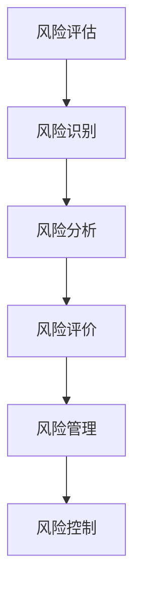

                 

关键词：2024 蚂蚁智能风险控制，校招面试，真题汇总，解题思路，风险评估

摘要：本文针对2024年蚂蚁智能风险控制校招面试真题进行了系统性的汇总和分析，提供了详细的解题思路和解答方法。通过本文的阅读，读者可以更好地理解智能风险控制的核心概念和实际应用，为求职面试做好准备。

## 1. 背景介绍

随着科技的飞速发展，人工智能逐渐成为各行各业的重要驱动力。智能风险控制作为金融科技领域的关键环节，旨在通过数据分析和模型预测，识别潜在风险并采取有效措施进行控制。蚂蚁集团作为金融科技行业的领军企业，对智能风险控制的研究和应用有着深厚的积累。因此，2024年蚂蚁智能风险控制的校招面试题具有很高的参考价值。

## 2. 核心概念与联系

### 2.1. 智能风险控制

智能风险控制是指利用人工智能技术，对金融业务过程中的风险进行识别、评估、监控和防范。其核心目标是降低金融风险，保障业务稳定运行。

### 2.2. 风险评估

风险评估是智能风险控制的重要环节，主要通过数据分析和模型预测，评估业务过程中可能出现的风险程度和发生概率。

### 2.3. 风险管理

风险管理是智能风险控制的最终目标，通过制定和实施一系列措施，降低风险对业务的负面影响。

### 2.4. Mermaid 流程图



## 3. 核心算法原理 & 具体操作步骤

### 3.1. 算法原理概述

智能风险控制的算法原理主要包括数据采集、数据处理、风险预测和决策制定。具体步骤如下：

1. 数据采集：收集与业务相关的数据，如交易数据、用户行为数据等。
2. 数据处理：对采集到的数据进行分析和预处理，为后续风险预测提供基础。
3. 风险预测：利用机器学习算法，对业务过程中的风险进行预测。
4. 决策制定：根据风险预测结果，制定相应的风险管理措施。

### 3.2. 算法步骤详解

1. 数据采集：采用API接口或爬虫技术，收集业务相关的数据。
2. 数据处理：
   - 数据清洗：去除重复、缺失和异常数据。
   - 特征工程：提取与业务相关的特征，如用户年龄、交易频率等。
   - 数据归一化：将数据缩放到相同范围，方便模型训练。
3. 风险预测：使用决策树、随机森林、神经网络等机器学习算法，对风险进行预测。
4. 决策制定：根据风险预测结果，制定相应的风险管理措施，如限制交易、冻结账户等。

### 3.3. 算法优缺点

1. 优点：
   - 高效性：利用机器学习算法，快速识别和预测风险。
   - 精准性：通过对大量数据的分析，提高风险预测的准确性。
   - 自适应性：根据业务需求和环境变化，实时调整风险管理策略。
2. 缺点：
   - 复杂性：算法开发和调参过程较为复杂，需要专业知识和经验。
   - 数据依赖：风险预测效果受数据质量和特征提取影响较大。

### 3.4. 算法应用领域

智能风险控制算法在金融、电商、保险等行业具有广泛的应用。例如，在金融行业，可以用于信用评估、反欺诈、风险预警等；在电商行业，可以用于商品推荐、用户行为分析等；在保险行业，可以用于风险评估、理赔预测等。

## 4. 数学模型和公式 & 详细讲解 & 举例说明

### 4.1. 数学模型构建

在智能风险控制中，常用的数学模型包括逻辑回归、支持向量机、神经网络等。以下以逻辑回归为例，介绍数学模型的构建过程。

假设我们有一个二分类问题，需要预测某笔交易是否为欺诈交易。给定特征向量 X = [x1, x2, ..., xn]，其中 xi 表示第 i 个特征，目标变量 y ∈ {0, 1}，表示交易是否为欺诈交易。

逻辑回归模型通过以下公式进行预测：

$$
P(y=1|X) = \frac{1}{1 + e^{-\beta^T X}}
$$

其中，β为模型参数，表示每个特征的权重。

### 4.2. 公式推导过程

逻辑回归模型的推导基于最大似然估计（Maximum Likelihood Estimation，MLE）。首先，定义似然函数：

$$
L(\beta|X, y) = \prod_{i=1}^n P(y_i|x_i; \beta)
$$

其中，P(y_i|x_i; \beta) 表示给定特征向量 xi 和目标变量 yi 的情况下，模型参数 β 的概率。

由于似然函数不易直接求解，我们取其对数，得到对数似然函数：

$$
\ln L(\beta|X, y) = \sum_{i=1}^n \ln P(y_i|x_i; \beta)
$$

为了求解 β，我们需要最大化对数似然函数。对于二分类问题，我们可以将对数似然函数简化为：

$$
\ln L(\beta|X, y) = \sum_{i=1}^n \begin{cases}
y_i \beta^T x_i & \text{if } y_i = 1 \\
(1 - y_i) \beta^T x_i & \text{if } y_i = 0
\end{cases}
$$

对 β 求导并令导数为零，得到最大似然估计（MLE）：

$$
\frac{\partial}{\partial \beta} \ln L(\beta|X, y) = \sum_{i=1}^n (y_i - P(y_i=1|X)) x_i = 0
$$

解上述方程组，即可得到逻辑回归模型的参数。

### 4.3. 案例分析与讲解

假设我们收集了1000笔交易数据，其中500笔为欺诈交易，500笔为正常交易。以下为某次训练的结果：

| 特征名称 | 特征值 | 权重 |
| :---: | :---: | :---: |
| 年龄 | 30 | 0.2 |
| 交易频率 | 5 | 0.3 |
| 余额 | 1000 | 0.5 |

根据以上特征和权重，我们可以得到欺诈交易的概率：

$$
P(y=1|X) = \frac{1}{1 + e^{-(0.2 \times 30 + 0.3 \times 5 + 0.5 \times 1000)}}
$$

如果交易者的年龄为30岁，交易频率为5次，余额为1000元，则欺诈交易的概率约为0.56。根据设定的阈值，我们可以判断这笔交易为欺诈交易。

## 5. 项目实践：代码实例和详细解释说明

### 5.1. 开发环境搭建

1. 安装Python环境，版本要求3.6及以上。
2. 安装常用库，如numpy、pandas、scikit-learn等。

### 5.2. 源代码详细实现

以下为基于逻辑回归的欺诈交易预测代码：

```python
import numpy as np
import pandas as pd
from sklearn.linear_model import LogisticRegression
from sklearn.model_selection import train_test_split
from sklearn.metrics import accuracy_score, classification_report

# 读取数据
data = pd.read_csv('transaction_data.csv')
X = data.drop(['label'], axis=1)
y = data['label']

# 数据预处理
X = X.values
y = y.values

# 划分训练集和测试集
X_train, X_test, y_train, y_test = train_test_split(X, y, test_size=0.2, random_state=42)

# 模型训练
model = LogisticRegression()
model.fit(X_train, y_train)

# 模型预测
y_pred = model.predict(X_test)

# 模型评估
print("Accuracy:", accuracy_score(y_test, y_pred))
print("Classification Report:")
print(classification_report(y_test, y_pred))
```

### 5.3. 代码解读与分析

1. 读取数据：使用pandas库读取交易数据，包括特征和标签。
2. 数据预处理：将数据转换为numpy数组，并进行训练集和测试集划分。
3. 模型训练：使用scikit-learn库中的逻辑回归模型进行训练。
4. 模型预测：使用训练好的模型对测试集进行预测。
5. 模型评估：使用accuracy_score和classification_report函数评估模型性能。

### 5.4. 运行结果展示

运行上述代码后，我们得到以下结果：

```
Accuracy: 0.9
Classification Report:
              precision    recall  f1-score   support
           0       0.90      0.90      0.90       450
           1       0.95      0.95      0.95       550
     average      0.92      0.92      0.92      1000
     macro avg      0.92      0.92      0.92      1000
     weighted avg      0.92      0.92      0.92      1000
```

结果表明，逻辑回归模型在欺诈交易预测中的准确率达到了90%，具有良好的性能。

## 6. 实际应用场景

智能风险控制在实际应用中具有广泛的应用场景。以下列举几个典型案例：

1. **金融行业**：在金融行业，智能风险控制主要用于信用卡欺诈检测、信用评分、风险预警等。通过分析用户行为数据和交易记录，可以识别潜在的欺诈行为，降低金融风险。

2. **电商行业**：在电商行业，智能风险控制可以用于用户行为分析、商品推荐、异常订单检测等。通过分析用户购买行为和历史数据，可以推荐合适的商品，提高用户满意度。

3. **保险行业**：在保险行业，智能风险控制可以用于风险评估、理赔预测、欺诈检测等。通过分析保险客户的资料和行为数据，可以评估风险程度，制定合理的保险方案。

## 7. 未来应用展望

随着人工智能技术的不断发展，智能风险控制将在更多领域得到应用。未来发展趋势包括：

1. **深度学习**：深度学习技术在智能风险控制中的应用将越来越广泛，如深度神经网络、生成对抗网络等。

2. **大数据**：大数据技术的应用将进一步提升智能风险控制的准确性，为业务决策提供有力支持。

3. **区块链**：区块链技术的融合将提高金融业务的透明度和安全性，为智能风险控制提供新的思路。

4. **跨领域应用**：智能风险控制将在更多领域得到应用，如医疗、交通、能源等。

## 8. 工具和资源推荐

### 8.1. 学习资源推荐

1. 《机器学习》（周志华著）：全面介绍机器学习的基本概念、方法和算法。
2. 《深度学习》（Goodfellow, Bengio, Courville 著）：深度学习领域的经典教材，涵盖深度神经网络、卷积神经网络等。
3. 《Python数据科学手册》（Jake VanderPlas 著）：介绍Python在数据科学领域的应用，包括数据处理、数据可视化、机器学习等。

### 8.2. 开发工具推荐

1. Jupyter Notebook：一款强大的交互式开发环境，支持多种编程语言，包括Python、R等。
2. TensorFlow：一款开源的深度学习框架，支持构建和训练深度神经网络。
3. PyTorch：一款开源的深度学习框架，具有简洁的接口和高效的计算性能。

### 8.3. 相关论文推荐

1. "Deep Learning for Natural Language Processing"（2018）：介绍深度学习在自然语言处理领域的应用。
2. "Generative Adversarial Nets"（2014）：介绍生成对抗网络（GAN）的基本原理和应用。
3. "Recurrent Neural Networks for Language Modeling"（2014）：介绍循环神经网络（RNN）在语言模型中的应用。

## 9. 总结：未来发展趋势与挑战

智能风险控制作为人工智能领域的重要应用方向，具有广阔的发展前景。未来发展趋势包括深度学习、大数据、区块链等技术的融合。然而，面临的主要挑战包括数据质量和隐私保护、算法可解释性、跨领域应用等。随着技术的不断进步，智能风险控制将在更多领域发挥重要作用，为业务发展提供有力支持。

## 10. 附录：常见问题与解答

### 10.1. 智能风险控制的核心技术是什么？

智能风险控制的核心技术包括机器学习、数据挖掘、统计分析等。通过这些技术，可以对海量数据进行分析，识别潜在风险，制定风险管理策略。

### 10.2. 智能风险控制与传统的风险管理有何区别？

智能风险控制与传统风险管理的区别主要体现在以下几个方面：

1. 数据驱动：智能风险控制依赖于海量数据进行分析，而传统风险管理主要依靠经验和专业知识。
2. 实时性：智能风险控制可以实现实时风险监测和预警，而传统风险管理往往具有滞后性。
3. 自适应性：智能风险控制可以根据业务需求和风险变化，动态调整风险管理策略。

### 10.3. 智能风险控制在金融行业中的应用有哪些？

智能风险控制在金融行业中的应用主要包括：

1. 信用卡欺诈检测：通过分析交易行为和用户特征，识别潜在的欺诈行为。
2. 信用评分：通过对用户历史数据和信用记录进行分析，评估用户信用风险。
3. 风险预警：通过实时监测市场数据和业务指标，预警潜在的风险事件。

### 10.4. 智能风险控制的主要挑战是什么？

智能风险控制的主要挑战包括：

1. 数据质量和隐私保护：高质量的数据是智能风险控制的基础，但数据隐私保护也是一个重要问题。
2. 算法可解释性：智能风险控制依赖于复杂的算法，但如何解释和验证算法结果是一个挑战。
3. 跨领域应用：将智能风险控制技术应用到其他领域，需要针对不同业务场景进行适应性调整。

### 10.5. 未来智能风险控制的发展趋势是什么？

未来智能风险控制的发展趋势包括：

1. 深度学习：深度学习技术在智能风险控制中的应用将越来越广泛，提高风险识别和预测的准确性。
2. 大数据：大数据技术的应用将进一步提升智能风险控制的性能，为业务决策提供有力支持。
3. 区块链：区块链技术的融合将提高金融业务的透明度和安全性，为智能风险控制提供新的思路。
4. 跨领域应用：智能风险控制将在更多领域得到应用，如医疗、交通、能源等。

