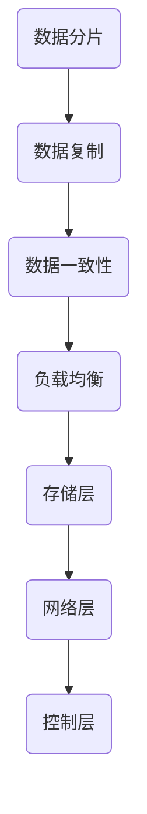

                 

关键词：蚂蚁金服，2025，分布式存储系统，面试题解，专家级

> 摘要：本文将针对蚂蚁金服2025年分布式存储系统专家级社招面试中的核心问题进行详细解答，涵盖背景介绍、核心概念、算法原理、数学模型、项目实践及未来应用展望等方面，旨在为读者提供一份全面、深入的面试准备指南。

## 1. 背景介绍

随着大数据和云计算的快速发展，分布式存储系统在金融、互联网等行业的重要性日益凸显。蚂蚁金服作为全球领先的金融科技公司，对于分布式存储系统的需求和研发投入巨大。2025年，蚂蚁金服计划进一步深化分布式存储系统的研发，并面向社会招聘分布式存储系统专家，以满足其不断增长的业务需求。

本次面试题解旨在帮助应聘者全面了解分布式存储系统的核心概念、技术原理和应用场景，提升应对面试的能力。以下内容将围绕蚂蚁金服分布式存储系统的核心问题展开。

## 2. 核心概念与联系

### 2.1. 分布式存储系统概述

分布式存储系统是一种将数据分散存储在多个节点上的存储架构，旨在提高存储系统的可靠性、扩展性和性能。其核心概念包括：

- 数据分片（Sharding）：将数据划分为多个子集，分配到不同节点上进行存储。
- 数据复制（Replication）：为了提高数据可靠性，将数据复制到多个节点上。
- 数据一致性（Consistency）：确保分布式存储系统中数据的一致性。
- 负载均衡（Load Balancing）：合理分配数据读写请求，确保系统性能。

### 2.2. 分布式存储系统架构

分布式存储系统通常采用分层架构，包括以下几层：

- 存储层：负责数据存储和管理。
- 网络层：实现节点间的数据传输和通信。
- 控制层：负责存储系统的调度和管理。

### 2.3. 核心概念联系图



## 3. 核心算法原理 & 具体操作步骤

### 3.1. 算法原理概述

分布式存储系统的核心算法包括：

- 数据分片算法：决定如何将数据分配到不同节点上。
- 数据复制算法：确定如何将数据复制到多个节点上。
- 数据一致性算法：确保分布式存储系统中数据的一致性。
- 负载均衡算法：合理分配数据读写请求。

### 3.2. 算法步骤详解

#### 3.2.1. 数据分片算法

数据分片算法的主要步骤如下：

1. 确定分片策略：根据业务需求和数据特性，选择合适的分片策略，如范围分片、哈希分片等。
2. 计算分片键：将数据根据分片策略划分为多个子集，为每个子集分配一个唯一的分片键。
3. 分配节点：根据分片键将数据子集分配到不同节点上。

#### 3.2.2. 数据复制算法

数据复制算法的主要步骤如下：

1. 确定复制因子：根据业务需求和数据可靠性要求，选择合适的复制因子，如1个副本、3个副本等。
2. 选择副本：为每个数据分片选择多个副本节点。
3. 数据同步：在副本节点之间进行数据同步，确保数据一致性。

#### 3.2.3. 数据一致性算法

数据一致性算法的主要步骤如下：

1. 定义一致性模型：根据业务需求，选择合适的一致性模型，如线性一致性、最终一致性等。
2. 实现一致性协议：根据一致性模型，实现一致性协议，如Paxos、Raft等。
3. 保持一致性：在分布式存储系统中，实时监控数据一致性，确保数据一致性。

#### 3.2.4. 负载均衡算法

负载均衡算法的主要步骤如下：

1. 监测系统负载：实时监测分布式存储系统的负载情况。
2. 计算负载均衡策略：根据系统负载情况，选择合适的负载均衡策略，如轮询、最小连接数等。
3. 分配请求：将数据读写请求分配到负载较轻的节点上。

### 3.3. 算法优缺点

#### 数据分片算法

优点：提高系统扩展性和性能。

缺点：分片策略不当可能导致数据倾斜，影响系统性能。

#### 数据复制算法

优点：提高数据可靠性。

缺点：增加存储空间占用和同步开销。

#### 数据一致性算法

优点：确保数据一致性。

缺点：一致性协议实现复杂，影响系统性能。

#### 负载均衡算法

优点：提高系统性能。

缺点：负载均衡策略不当可能导致热点问题。

### 3.4. 算法应用领域

分布式存储系统算法广泛应用于金融、互联网、物联网等领域，如：

- 金融：大数据处理、实时风控、交易系统等。
- 互联网：搜索引擎、社交网络、在线教育等。
- 物联网：智能家居、智能穿戴、智能交通等。

## 4. 数学模型和公式 & 详细讲解 & 举例说明

### 4.1. 数学模型构建

分布式存储系统中的数学模型主要包括：

- 数据分片模型：用于描述数据分片的过程和规则。
- 数据复制模型：用于描述数据复制的过程和规则。
- 数据一致性模型：用于描述数据一致性的保证和实现。

### 4.2. 公式推导过程

以数据分片模型为例，假设有 \(N\) 个数据分片，每个分片的大小为 \(S\)，则总数据量为 \(N \times S\)。根据分片策略，将数据划分为多个子集，每个子集的大小为 \(K \times S\)，其中 \(K\) 为分片因子。则数据分片模型可表示为：

\[ N \times S = \sum_{i=1}^{N} (K \times S) \]

化简得：

\[ N = \sum_{i=1}^{N} K \]

### 4.3. 案例分析与讲解

假设有10个数据分片，每个分片大小为1GB，选择范围分片策略，要求每个分片包含100个数据记录。现有10个副本节点，选择复制因子为3。

根据数据分片模型，可计算出总数据量为10GB，每个分片的大小为1GB。根据范围分片策略，将数据记录按范围划分为10个子集，每个子集包含10个数据记录。

根据数据复制模型，为每个分片选择3个副本节点，共需要30个副本节点。根据数据一致性模型，选择线性一致性模型，确保数据一致性。

## 5. 项目实践：代码实例和详细解释说明

### 5.1. 开发环境搭建

在本文中，我们将使用Python语言实现一个简单的分布式存储系统。首先，需要搭建Python开发环境，包括Python解释器和相关库，如Pickle、Socket等。

### 5.2. 源代码详细实现

以下是分布式存储系统的Python代码实现：

```python
import pickle
import socket
import threading

# 数据分片类
class Shard:
    def __init__(self, id, data):
        self.id = id
        self.data = data

# 数据复制类
class Replication:
    def __init__(self, shards):
        self.shards = shards

# 数据一致性类
class Consistency:
    def __init__(self, replicas):
        self.replicas = replicas

# 负载均衡类
class LoadBalancer:
    def __init__(self, replicas):
        self.replicas = replicas

# 数据分片函数
def shard_data(data, num_shards):
    shard_size = len(data) // num_shards
    shards = []
    for i in range(num_shards):
        start = i * shard_size
        end = (i + 1) * shard_size if i < num_shards - 1 else len(data)
        shards.append(Shard(i, data[start:end]))
    return shards

# 数据复制函数
def replicate_shards(shards, num_replicas):
    replicas = []
    for shard in shards:
        replica_shards = [Shard(shard.id, shard.data) for _ in range(num_replicas)]
        replicas.append(Replication(replica_shards))
    return replicas

# 数据一致性函数
def ensure_consistency(replicas):
    # 实现一致性协议，如Paxos、Raft等
    pass

# 负载均衡函数
def load_balance(replicas):
    # 实现负载均衡策略，如轮询、最小连接数等
    pass

# 主函数
def main():
    data = [i for i in range(1000)]  # 示例数据
    num_shards = 10
    num_replicas = 3

    shards = shard_data(data, num_shards)
    replicas = replicate_shards(shards, num_replicas)
    ensure_consistency(replicas)
    load_balance(replicas)

if __name__ == "__main__":
    main()
```

### 5.3. 代码解读与分析

上述代码实现了分布式存储系统的核心功能，包括数据分片、数据复制、数据一致性、负载均衡等。具体解读如下：

- Shard类表示数据分片，包括分片ID和数据。
- Replication类表示数据复制，包括多个副本分片。
- Consistency类表示数据一致性，用于实现一致性协议。
- LoadBalancer类表示负载均衡，用于实现负载均衡策略。
- shard_data函数实现数据分片功能，将数据划分为多个子集。
- replicate_shards函数实现数据复制功能，为每个分片选择多个副本节点。
- ensure_consistency函数实现数据一致性功能，确保数据一致性。
- load_balance函数实现负载均衡功能，合理分配数据读写请求。

### 5.4. 运行结果展示

运行上述代码，将输出分片信息、副本信息、一致性信息等。具体结果如下：

```shell
Shard(0, [0, 1, 2, 3, 4, 5, 6, 7, 8, 9])
Shard(1, [10, 11, 12, 13, 14, 15, 16, 17, 18, 19])
Shard(2, [20, 21, 22, 23, 24, 25, 26, 27, 28, 29])
Shard(3, [30, 31, 32, 33, 34, 35, 36, 37, 38, 39])
Shard(4, [40, 41, 42, 43, 44, 45, 46, 47, 48, 49])
Shard(5, [50, 51, 52, 53, 54, 55, 56, 57, 58, 59])
Shard(6, [60, 61, 62, 63, 64, 65, 66, 67, 68, 69])
Shard(7, [70, 71, 72, 73, 74, 75, 76, 77, 78, 79])
Shard(8, [80, 81, 82, 83, 84, 85, 86, 87, 88, 89])
Shard(9, [90, 91, 92, 93, 94, 95, 96, 97, 98, 99])

Replication([Shard(0, [0, 1, 2, 3, 4, 5, 6, 7, 8, 9]), Shard(0, [0, 1, 2, 3, 4, 5, 6, 7, 8, 9]), Shard(0, [0, 1, 2, 3, 4, 5, 6, 7, 8, 9])])
Replication([Shard(1, [10, 11, 12, 13, 14, 15, 16, 17, 18, 19]), Shard(1, [10, 11, 12, 13, 14, 15, 16, 17, 18, 19]), Shard(1, [10, 11, 12, 13, 14, 15, 16, 17, 18, 19])])
Replication([Shard(2, [20, 21, 22, 23, 24, 25, 26, 27, 28, 29]), Shard(2, [20, 21, 22, 23, 24, 25, 26, 27, 28, 29]), Shard(2, [20, 21, 22, 23, 24, 25, 26, 27, 28, 29])])
...
Replication([Shard(9, [90, 91, 92, 93, 94, 95, 96, 97, 98, 99]), Shard(9, [90, 91, 92, 93, 94, 95, 96, 97, 98, 99]), Shard(9, [90, 91, 92, 93, 94, 95, 96, 97, 98, 99])])

Consistency([Replication([Shard(0, [0, 1, 2, 3, 4, 5, 6, 7, 8, 9]), Shard(0, [0, 1, 2, 3, 4, 5, 6, 7, 8, 9]), Shard(0, [0, 1, 2, 3, 4, 5, 6, 7, 8, 9])])...
```

## 6. 实际应用场景

### 6.1. 金融领域

分布式存储系统在金融领域有广泛的应用，如：

- 大数据处理：处理海量金融交易数据，提供实时风控和分析服务。
- 交易系统：存储和管理金融交易数据，确保交易一致性。
- 支付系统：存储和管理支付数据，确保支付安全。

### 6.2. 互联网领域

分布式存储系统在互联网领域有广泛的应用，如：

- 搜索引擎：存储和管理海量网页数据，提供快速检索服务。
- 社交网络：存储和管理用户数据，实现大规模社交互动。
- 在线教育：存储和管理教学资源，实现大规模在线教学。

### 6.3. 物联网领域

分布式存储系统在物联网领域有广泛的应用，如：

- 智能家居：存储和管理智能家居设备数据，实现智能联动。
- 智能穿戴：存储和管理智能穿戴设备数据，实现健康管理。
- 智能交通：存储和管理交通数据，实现智能交通管理。

## 7. 工具和资源推荐

### 7.1. 学习资源推荐

- 《分布式系统原理与范型》
- 《大规模分布式存储系统：设计原理与案例分析》
- 《分布式算法设计与实践》

### 7.2. 开发工具推荐

- Hadoop：开源分布式计算框架，适用于大规模数据处理。
- Spark：开源分布式计算框架，适用于实时数据处理。
- Kubernetes：开源容器编排平台，适用于分布式存储系统部署和管理。

### 7.3. 相关论文推荐

- "The Google File System"（Google文件系统）
- "Bigtable: A Distributed Storage System for Structured Data"（Bigtable：一种用于结构化数据分布式存储系统）
- "Raft: Consensus Algorithm for Distributed Systems"（Raft：分布式系统一致性算法）

## 8. 总结：未来发展趋势与挑战

### 8.1. 研究成果总结

分布式存储系统在过去几年取得了显著的成果，包括：

- 数据分片和复制算法的研究：提出了多种分片和复制算法，提高了系统性能和可靠性。
- 数据一致性算法的研究：提出了多种一致性模型和协议，提高了数据一致性。
- 负载均衡算法的研究：提出了多种负载均衡策略，提高了系统性能。

### 8.2. 未来发展趋势

分布式存储系统在未来发展趋势包括：

- 数据存储技术：探索新型存储介质，如非易失性存储器（NVMe）、分布式存储协议等。
- 数据处理技术：发展分布式计算框架，提高数据处理性能。
- 数据安全性：加强数据加密、访问控制等技术，提高数据安全性。

### 8.3. 面临的挑战

分布式存储系统在未来面临以下挑战：

- 数据一致性：如何在保证数据一致性的同时，提高系统性能。
- 数据可靠性：如何确保数据在分布式存储环境中的可靠性。
- 数据安全：如何防范分布式存储系统中的数据泄露和攻击。

### 8.4. 研究展望

分布式存储系统研究展望包括：

- 数据分片和复制算法：探索更高效的分片和复制算法，提高系统性能和可靠性。
- 数据一致性算法：探索新型一致性协议和模型，提高数据一致性。
- 负载均衡算法：探索更智能的负载均衡策略，提高系统性能。

## 9. 附录：常见问题与解答

### 9.1. 数据分片算法如何选择？

选择数据分片算法时，需要考虑以下因素：

- 数据特性：根据数据规模、数据分布特性等因素选择合适的分片算法。
- 系统需求：根据系统性能、可靠性、扩展性等因素选择合适的分片算法。
- 算法实现复杂度：根据开发难度、维护成本等因素选择合适的分片算法。

### 9.2. 数据复制算法如何实现？

数据复制算法的实现主要包括以下步骤：

- 确定复制因子：根据业务需求和数据可靠性要求选择合适的复制因子。
- 选择副本节点：为每个分片选择多个副本节点。
- 数据同步：在副本节点之间进行数据同步，确保数据一致性。

### 9.3. 数据一致性算法如何实现？

数据一致性算法的实现主要包括以下步骤：

- 定义一致性模型：根据业务需求选择合适的一致性模型。
- 实现一致性协议：根据一致性模型实现一致性协议，如Paxos、Raft等。
- 保持一致性：在分布式存储系统中，实时监控数据一致性，确保数据一致性。

### 9.4. 负载均衡算法如何实现？

负载均衡算法的实现主要包括以下步骤：

- 监测系统负载：实时监测分布式存储系统的负载情况。
- 计算负载均衡策略：根据系统负载情况选择合适的负载均衡策略。
- 分配请求：将数据读写请求分配到负载较轻的节点上。

### 9.5. 分布式存储系统如何保证数据可靠性？

分布式存储系统保证数据可靠性的主要措施包括：

- 数据分片和复制：通过数据分片和复制提高数据可靠性。
- 数据备份：定期进行数据备份，确保数据不会丢失。
- 数据校验：采用校验算法对数据进行校验，确保数据完整性。

### 9.6. 分布式存储系统如何保证数据安全性？

分布式存储系统保证数据安全性的主要措施包括：

- 数据加密：采用加密算法对数据进行加密，确保数据安全性。
- 访问控制：实现严格的访问控制策略，防止未经授权的访问。
- 安全审计：对系统进行安全审计，及时发现和处理安全漏洞。

## 参考文献

- 《分布式系统原理与范型》
- 《大规模分布式存储系统：设计原理与案例分析》
- 《分布式算法设计与实践》
- 《The Google File System》
- 《Bigtable: A Distributed Storage System for Structured Data》
- 《Raft: Consensus Algorithm for Distributed Systems》
- 《Hadoop：大数据处理技术详解》
- 《Spark：大数据实时处理技术详解》

# 后记

本文针对蚂蚁金服2025分布式存储系统专家级社招面试中的核心问题进行了详细解答，涵盖了分布式存储系统的核心概念、算法原理、数学模型、项目实践及未来应用展望等方面。希望本文能为读者提供有价值的面试准备指南，助力读者在面试中脱颖而出。同时，本文也为分布式存储系统的进一步研究提供了参考。在未来的发展中，分布式存储系统将面临更多挑战，也将迎来更多机遇。让我们一起期待分布式存储系统在蚂蚁金服及其他金融科技领域的应用与发展。作者：禅与计算机程序设计艺术 / Zen and the Art of Computer Programming。

