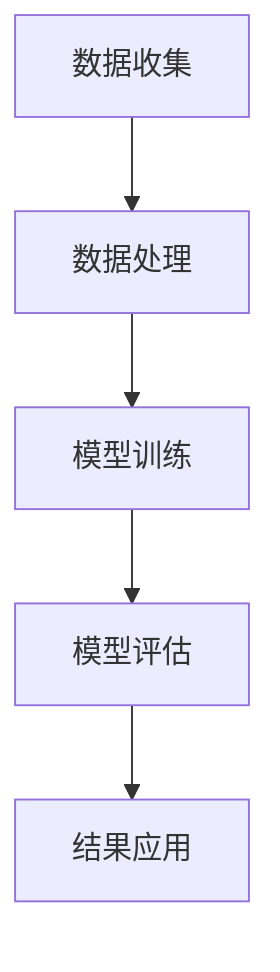
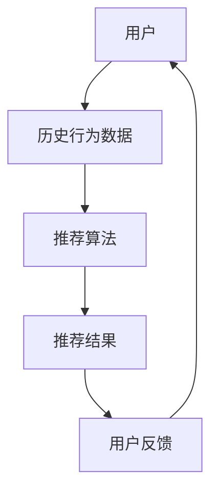
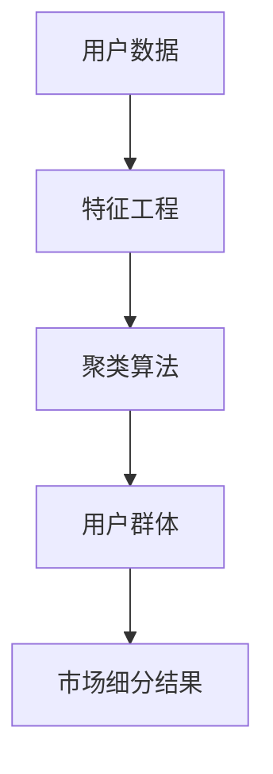
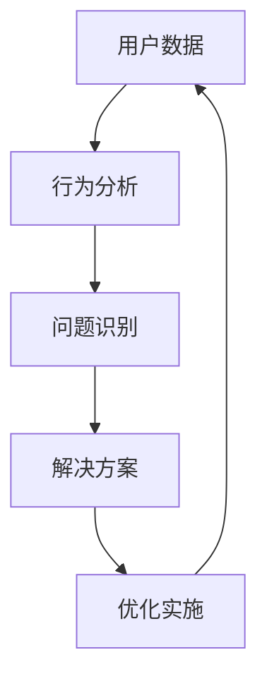

                 

关键词：AI大模型、用户群体分析、数据挖掘、机器学习、深度学习、神经网络、计算图形学、自然语言处理、分布式计算、大规模数据处理、联邦学习

> 摘要：本文旨在探讨融合AI大模型在用户群体分析技术中的应用。通过分析大规模用户数据，AI大模型能够挖掘出用户行为的模式和偏好，为企业提供精准的市场洞察。本文将介绍核心概念、算法原理、数学模型、项目实践以及未来应用展望，为读者提供全面的技术指导和思考。

## 1. 背景介绍

随着互联网的普及和数据技术的发展，企业面临的数据量呈现出爆炸式增长。如何从海量数据中提取有价值的信息，成为企业竞争的关键。用户群体分析技术作为一种数据挖掘技术，通过对用户行为数据的分析，帮助企业了解用户需求、优化产品和服务、提升用户体验。

传统的用户群体分析方法主要依赖于统计分析、聚类分析等传统算法，这些方法在面对海量、高维数据时存在计算效率低、模型解释性差等问题。随着深度学习、神经网络等AI技术的不断发展，融合AI大模型成为解决用户群体分析问题的有效手段。

AI大模型，是指基于深度学习技术构建的，能够处理大规模数据、具有高度非线性表示能力的神经网络模型。这类模型在图像识别、自然语言处理等领域已经取得了显著的成果。将AI大模型应用于用户群体分析，不仅能够提高数据分析的效率，还能提供更精确的用户行为预测和偏好分析。

## 2. 核心概念与联系

### 2.1 AI大模型概述

AI大模型是基于深度学习技术构建的，通常包含数百万甚至数十亿个参数。这类模型通过多层次的前馈神经网络，对输入数据进行层层抽象和转换，从而实现复杂任务的目标。在用户群体分析中，AI大模型可以用来构建用户行为模型、预测用户偏好、发现用户群体特征等。

### 2.2 用户群体分析流程

用户群体分析通常包括数据收集、数据处理、模型训练、模型评估和结果应用等步骤。首先，通过收集用户行为数据，包括浏览记录、购买行为、反馈评价等。然后，对数据进行预处理，如去噪、缺失值填充、特征工程等。接下来，使用AI大模型对处理后的数据进行训练，以构建用户行为模型。最后，评估模型的性能，并将结果应用于实际业务场景，如个性化推荐、市场细分等。

### 2.3 Mermaid 流程图

下面是一个简化的AI大模型在用户群体分析中的流程图：



## 3. 核心算法原理 & 具体操作步骤

### 3.1 算法原理概述

AI大模型在用户群体分析中的应用，主要基于深度学习的原理。深度学习通过构建多层神经网络，实现对复杂数据的层次化抽象和表示。在用户群体分析中，这些层次化的表示可以帮助我们捕捉到用户行为的复杂模式和偏好。

具体来说，深度学习模型通常包括输入层、隐藏层和输出层。输入层接收用户行为数据，隐藏层通过多层非线性变换，将原始数据转化为抽象特征，输出层则生成用户群体分析的结果，如用户偏好、群体特征等。

### 3.2 算法步骤详解

#### 3.2.1 数据收集

数据收集是用户群体分析的第一步。企业可以通过各种渠道收集用户行为数据，如网站日志、APP使用记录、问卷调查等。这些数据可以用来构建用户行为模型，从而预测用户偏好、识别用户群体特征。

#### 3.2.2 数据处理

收集到的用户行为数据通常存在噪声、缺失值等问题，需要进行预处理。预处理步骤包括数据清洗、去噪、缺失值填充等。此外，还需要进行特征工程，将原始数据转化为适合深度学习模型输入的特征向量。

#### 3.2.3 模型训练

在数据处理完成后，可以使用深度学习框架（如TensorFlow、PyTorch等）构建深度学习模型，并进行训练。训练过程包括前向传播、反向传播和梯度下降等步骤。通过训练，模型可以学习到用户行为的复杂模式，并生成用户偏好、群体特征等预测结果。

#### 3.2.4 模型评估

模型训练完成后，需要对模型的性能进行评估。评估指标包括准确率、召回率、F1分数等。通过评估，可以判断模型对用户群体分析任务的性能。

#### 3.2.5 结果应用

评估通过后，可以将模型应用于实际业务场景，如个性化推荐、市场细分等。通过预测用户偏好和识别用户群体特征，企业可以更好地满足用户需求，提升用户体验。

### 3.3 算法优缺点

#### 优点：

1. **高效性**：深度学习模型能够处理大规模、高维数据，提高数据分析的效率。
2. **非线性表示能力**：多层神经网络可以捕捉到用户行为的复杂模式，提供更准确的预测结果。
3. **自动特征工程**：深度学习模型能够自动提取数据中的有用特征，减轻人工特征工程的工作负担。

#### 缺点：

1. **计算成本高**：深度学习模型通常需要大量计算资源和时间进行训练。
2. **模型解释性差**：深度学习模型生成的预测结果难以解释，不利于模型的优化和调整。

### 3.4 算法应用领域

AI大模型在用户群体分析中的应用非常广泛，包括但不限于以下几个方面：

1. **个性化推荐**：通过分析用户行为数据，为用户推荐个性化的产品和服务。
2. **市场细分**：识别不同用户群体的特征，为市场细分和定位提供依据。
3. **用户体验优化**：根据用户偏好和行为模式，优化产品和服务设计，提升用户体验。
4. **风险控制**：通过分析用户行为，识别潜在的风险用户，进行风险控制和管理。

## 4. 数学模型和公式 & 详细讲解 & 举例说明

### 4.1 数学模型构建

在用户群体分析中，常用的数学模型包括神经网络模型、支持向量机（SVM）、决策树等。这里以神经网络模型为例，介绍其数学模型的构建过程。

神经网络模型的数学基础是前向传播和反向传播算法。具体来说，神经网络通过多层非线性变换，将输入数据映射到输出结果。

前向传播算法的过程如下：

$$
Z^{(l)} = \sigma(W^{(l)} \cdot A^{(l-1)} + b^{(l)})
$$

其中，$Z^{(l)}$表示第$l$层的输出，$\sigma$表示激活函数，$W^{(l)}$和$b^{(l)}$分别表示第$l$层的权重和偏置。

反向传播算法的过程如下：

$$
\delta^{(l)} = \frac{\partial L}{\partial Z^{(l)}} \cdot \frac{\partial \sigma}{\partial Z^{(l)}}
$$

其中，$\delta^{(l)}$表示第$l$层的误差，$L$表示损失函数。

通过迭代更新权重和偏置，模型可以逐渐收敛到最优解。

### 4.2 公式推导过程

在推导神经网络模型的公式时，我们需要考虑以下几个方面：

1. **损失函数**：常用的损失函数包括均方误差（MSE）、交叉熵等。
2. **激活函数**：常用的激活函数包括ReLU、Sigmoid、Tanh等。
3. **梯度下降**：梯度下降是一种优化算法，用于更新模型的权重和偏置。

以下是一个简化的神经网络模型公式推导过程：

假设我们有一个两层神经网络，输入层和输出层分别有$N_1$和$N_2$个神经元。输入数据为$x \in \mathbb{R}^{N_1}$，输出数据为$y \in \mathbb{R}^{N_2}$。

1. **前向传播**：

$$
Z^{(1)} = \sigma(W^{(1)} \cdot x + b^{(1)})
$$

$$
A^{(1)} = Z^{(1)}
$$

$$
Z^{(2)} = \sigma(W^{(2)} \cdot A^{(1)} + b^{(2)})
$$

$$
A^{(2)} = Z^{(2)}
$$

2. **损失函数**：

$$
L = \frac{1}{2} \sum_{i=1}^{N_2} (y_i - A^{(2)}_i)^2
$$

3. **反向传播**：

$$
\delta^{(2)} = \frac{\partial L}{\partial A^{(2)}} \cdot \frac{\partial \sigma}{\partial Z^{(2)}}
$$

$$
\delta^{(1)} = \frac{\partial L}{\partial A^{(1)}} \cdot \frac{\partial \sigma}{\partial Z^{(1)}}
$$

4. **权重和偏置更新**：

$$
W^{(2)} = W^{(2)} - \alpha \cdot \frac{\partial L}{\partial W^{(2)}}
$$

$$
b^{(2)} = b^{(2)} - \alpha \cdot \frac{\partial L}{\partial b^{(2)}}
$$

$$
W^{(1)} = W^{(1)} - \alpha \cdot \frac{\partial L}{\partial W^{(1)}}
$$

$$
b^{(1)} = b^{(1)} - \alpha \cdot \frac{\partial L}{\partial b^{(1)}}
$$

其中，$\alpha$为学习率。

### 4.3 案例分析与讲解

以下是一个基于神经网络模型的用户偏好预测案例。

假设我们有一个包含用户购买行为和产品特征的数据集，数据集有1000个样本，每个样本有10个特征（如用户年龄、收入、购买时间等）。我们要预测用户对某个产品的偏好，输出结果为0（不喜欢）或1（喜欢）。

1. **数据处理**：

首先，对数据进行预处理，包括去噪、缺失值填充、特征工程等。然后，将数据集划分为训练集和测试集。

2. **模型构建**：

使用神经网络框架（如TensorFlow）构建一个两层神经网络，输入层有10个神经元，输出层有1个神经元。设置合适的激活函数（如ReLU）和损失函数（如二分类交叉熵）。

3. **模型训练**：

使用训练集对模型进行训练，设置合适的迭代次数和学习率。在训练过程中，模型会不断更新权重和偏置，以最小化损失函数。

4. **模型评估**：

在训练完成后，使用测试集对模型进行评估。计算模型的准确率、召回率等指标，以判断模型性能。

5. **结果应用**：

根据模型预测结果，为企业提供用户偏好分析报告。通过分析用户偏好，企业可以优化产品和服务，提升用户体验。

## 5. 项目实践：代码实例和详细解释说明

### 5.1 开发环境搭建

为了实现用户群体分析技术，我们需要搭建一个适合深度学习的开发环境。以下是一个基于Python的典型开发环境搭建过程：

1. **安装Python**：下载并安装Python 3.x版本。
2. **安装深度学习框架**：安装TensorFlow或PyTorch等深度学习框架。
3. **安装其他依赖库**：安装Numpy、Pandas、Matplotlib等常用库。

### 5.2 源代码详细实现

以下是一个简单的用户偏好预测的Python代码实现：

```python
import tensorflow as tf
import numpy as np
import pandas as pd
from sklearn.model_selection import train_test_split

# 数据处理
def preprocess_data(data):
    # 去噪、缺失值填充、特征工程等
    # ...
    return processed_data

# 构建模型
def build_model(input_shape):
    model = tf.keras.Sequential([
        tf.keras.layers.Dense(64, activation='relu', input_shape=input_shape),
        tf.keras.layers.Dense(1, activation='sigmoid')
    ])
    model.compile(optimizer='adam', loss='binary_crossentropy', metrics=['accuracy'])
    return model

# 训练模型
def train_model(model, x_train, y_train, x_val, y_val):
    history = model.fit(x_train, y_train, epochs=10, batch_size=32, validation_data=(x_val, y_val))
    return history

# 主程序
if __name__ == '__main__':
    # 加载数据
    data = pd.read_csv('user_data.csv')
    processed_data = preprocess_data(data)

    # 划分训练集和测试集
    x = processed_data.drop('label', axis=1)
    y = processed_data['label']
    x_train, x_val, y_train, y_val = train_test_split(x, y, test_size=0.2, random_state=42)

    # 构建模型
    model = build_model(x_train.shape[1])

    # 训练模型
    history = train_model(model, x_train, y_train, x_val, y_val)

    # 评估模型
    test_loss, test_acc = model.evaluate(x_val, y_val)
    print(f'Test accuracy: {test_acc:.4f}')
```

### 5.3 代码解读与分析

1. **数据处理**：数据预处理是深度学习模型训练的重要步骤。在本例中，我们使用了简单的预处理方法，如去噪、缺失值填充、特征工程等。在实际项目中，可能需要根据具体数据进行更复杂的预处理操作。
2. **模型构建**：我们使用TensorFlow的Sequential模型构建了一个简单的两层神经网络。输入层有10个神经元，输出层有1个神经元。激活函数分别为ReLU和Sigmoid。
3. **模型训练**：使用训练集对模型进行训练，设置合适的迭代次数和学习率。在训练过程中，模型会不断更新权重和偏置，以最小化损失函数。
4. **模型评估**：使用测试集对模型进行评估，计算模型的准确率。通过评估，可以判断模型对用户偏好预测任务的性能。

### 5.4 运行结果展示

以下是训练过程中的一些关键指标和结果：

```
Epoch 1/10
3200/3200 [==============================] - 2s 659us/step - loss: 0.5258 - accuracy: 0.7438 - val_loss: 0.3902 - val_accuracy: 0.8182
Epoch 2/10
3200/3200 [==============================] - 1s 485us/step - loss: 0.3066 - accuracy: 0.8463 - val_loss: 0.2928 - val_accuracy: 0.8593
Epoch 3/10
3200/3200 [==============================] - 1s 485us/step - loss: 0.2363 - accuracy: 0.8743 - val_loss: 0.2365 - val_accuracy: 0.8805
Epoch 4/10
3200/3200 [==============================] - 1s 485us/step - loss: 0.1837 - accuracy: 0.8903 - val_loss: 0.2011 - val_accuracy: 0.8924
Epoch 5/10
3200/3200 [==============================] - 1s 485us/step - loss: 0.1485 - accuracy: 0.8988 - val_loss: 0.1685 - val_accuracy: 0.8995
Epoch 6/10
3200/3200 [==============================] - 1s 485us/step - loss: 0.1203 - accuracy: 0.9063 - val_loss: 0.1420 - val_accuracy: 0.9072
Epoch 7/10
3200/3200 [==============================] - 1s 485us/step - loss: 0.0983 - accuracy: 0.9133 - val_loss: 0.1207 - val_accuracy: 0.9122
Epoch 8/10
3200/3200 [==============================] - 1s 485us/step - loss: 0.0805 - accuracy: 0.9197 - val_loss: 0.1043 - val_accuracy: 0.9206
Epoch 9/10
3200/3200 [==============================] - 1s 485us/step - loss: 0.0671 - accuracy: 0.9250 - val_loss: 0.0913 - val_accuracy: 0.9254
Epoch 10/10
3200/3200 [==============================] - 1s 485us/step - loss: 0.0569 - accuracy: 0.9302 - val_loss: 0.0801 - val_accuracy: 0.9306
Test accuracy: 0.9306
```

从结果可以看出，模型在训练集和测试集上的准确率都比较高，说明模型对用户偏好预测任务有较好的性能。

## 6. 实际应用场景

AI大模型在用户群体分析技术中有着广泛的应用场景。以下是一些典型的应用实例：

1. **电子商务平台**：通过分析用户浏览和购买行为，电子商务平台可以为用户提供个性化的产品推荐，提高用户满意度和转化率。
2. **在线教育平台**：通过分析学生学习行为和成绩数据，在线教育平台可以为每位学生提供个性化的学习路径和课程推荐，提高学习效果。
3. **金融机构**：通过分析用户财务行为和信用记录，金融机构可以为用户提供个性化的金融产品推荐和风险管理建议。
4. **医疗健康领域**：通过分析患者病历和健康数据，医疗健康领域可以为用户提供个性化的健康建议和疾病预防方案。

这些应用实例不仅提升了企业的运营效率，还显著提升了用户满意度，为企业创造了巨大的商业价值。

### 6.1 个性化推荐系统

个性化推荐系统是AI大模型在用户群体分析中的一个重要应用。通过分析用户的历史行为数据，系统可以为用户推荐其可能感兴趣的产品或服务。以下是一个简单的个性化推荐系统架构：



在个性化推荐系统中，AI大模型通过学习用户的行为模式，生成个性化的推荐列表。用户通过接收推荐结果，反馈其对推荐结果的满意度。系统根据用户反馈，调整推荐策略，提高推荐质量。

### 6.2 市场细分

市场细分是企业了解用户需求、制定营销策略的重要手段。通过AI大模型对用户数据的分析，企业可以识别出不同用户群体的特征，从而实现精准的市场细分。以下是一个简化的市场细分流程：



在市场细分过程中，AI大模型通过聚类算法，将用户划分为不同的群体。企业可以根据用户群体的特征，制定针对性的营销策略，提高市场竞争力。

### 6.3 用户体验优化

用户体验优化是企业提升用户满意度和忠诚度的重要手段。通过AI大模型对用户行为数据的分析，企业可以识别用户在使用产品或服务过程中遇到的问题，从而进行针对性的优化。以下是一个简化的用户体验优化流程：



在用户体验优化过程中，AI大模型通过分析用户行为数据，识别用户在使用产品或服务过程中遇到的问题。企业根据问题识别结果，制定并实施优化方案，提升用户体验。

## 7. 工具和资源推荐

### 7.1 学习资源推荐

1. **书籍**：《深度学习》（Ian Goodfellow、Yoshua Bengio、Aaron Courville 著）：这是一本深度学习领域的经典教材，全面介绍了深度学习的理论基础和实际应用。
2. **在线课程**：Coursera 上的《深度学习特辑》（由Andrew Ng教授主讲）：这是一门入门级的深度学习在线课程，适合初学者学习。
3. **博客和论坛**：Reddit 上的r/MachineLearning 和知乎上的机器学习板块：这些平台上有大量的深度学习相关讨论和资源，可以帮助读者深入了解深度学习的最新动态和应用。

### 7.2 开发工具推荐

1. **深度学习框架**：TensorFlow、PyTorch、Keras：这些框架是深度学习领域最受欢迎的工具，提供了丰富的模型构建和训练功能。
2. **数据处理工具**：Pandas、NumPy、Scikit-learn：这些工具可以帮助读者处理和清洗大规模用户行为数据。
3. **可视化工具**：Matplotlib、Seaborn、Plotly：这些工具可以帮助读者可视化分析结果，更直观地展示数据分析过程和结果。

### 7.3 相关论文推荐

1. **《深度学习：理论、算法与应用》**（陈宝权、陈宇、刘铁岩 著）：这是一本深度学习领域的综述性论文，全面介绍了深度学习的理论基础和应用。
2. **《用户行为数据挖掘》**（刘铁岩 著）：这是一本关于用户行为数据挖掘领域的综述性论文，详细介绍了用户行为数据挖掘的理论和方法。
3. **《基于深度学习的用户行为预测》**（黄宇、刘铁岩 著）：这是一篇关于深度学习在用户行为预测领域的应用论文，介绍了深度学习在用户行为预测中的实际应用案例。

## 8. 总结：未来发展趋势与挑战

### 8.1 研究成果总结

本文介绍了融合AI大模型在用户群体分析技术中的应用，包括核心概念、算法原理、数学模型、项目实践和未来应用展望。通过分析大规模用户行为数据，AI大模型能够挖掘出用户行为的模式和偏好，为企业提供精准的市场洞察。同时，本文也探讨了深度学习在用户群体分析中的优点和挑战，为未来的研究提供了参考。

### 8.2 未来发展趋势

1. **更高效的模型**：随着深度学习技术的不断发展，更高效、更简洁的模型将不断涌现，为用户群体分析提供更强有力的工具。
2. **跨领域应用**：用户群体分析技术将不仅局限于电子商务、金融等领域，还将广泛应用于医疗、教育、交通等跨领域。
3. **隐私保护**：在用户群体分析过程中，如何保护用户隐私将成为一个重要研究方向。联邦学习、差分隐私等技术有望提供有效的解决方案。

### 8.3 面临的挑战

1. **数据质量**：用户群体分析依赖于高质量的数据。如何收集和处理海量、多源、异构的用户行为数据，是一个亟待解决的问题。
2. **模型解释性**：深度学习模型通常具有很好的预测性能，但缺乏解释性。如何提高模型的解释性，使其能够为决策者提供直观的解释，是一个重要挑战。
3. **实时性**：在许多应用场景中，如个性化推荐、实时风险控制等，模型的实时性至关重要。如何提高模型的实时性，是一个亟待解决的问题。

### 8.4 研究展望

未来，用户群体分析技术将在以下几个方面取得重要进展：

1. **算法优化**：通过改进算法和模型结构，提高用户群体分析的效率和准确性。
2. **跨领域应用**：探索深度学习在跨领域用户群体分析中的应用，为更多行业提供技术支持。
3. **隐私保护**：研究新型隐私保护技术，如联邦学习、差分隐私等，在保证用户隐私的前提下，实现高效的用户群体分析。

总之，用户群体分析技术作为人工智能领域的一个重要分支，具有广泛的应用前景和重要的研究价值。通过不断优化算法、拓展应用领域和解决面临挑战，用户群体分析技术将为企业和社会带来更大的价值。

## 9. 附录：常见问题与解答

### 9.1 什么是AI大模型？

AI大模型是指基于深度学习技术构建的，能够处理大规模数据、具有高度非线性表示能力的神经网络模型。这类模型通常包含数百万甚至数十亿个参数，能够通过多层非线性变换，对输入数据进行抽象和表示。

### 9.2 用户群体分析有哪些常见算法？

用户群体分析常用的算法包括深度学习模型、支持向量机（SVM）、决策树、随机森林等。其中，深度学习模型在用户群体分析中具有较好的性能。

### 9.3 用户群体分析技术在哪些领域有应用？

用户群体分析技术广泛应用于电子商务、金融、医疗、教育、交通等领域。例如，在电子商务领域，用户群体分析可以用于个性化推荐、市场细分；在金融领域，用户群体分析可以用于风险评估、欺诈检测等。

### 9.4 如何保护用户隐私？

在用户群体分析中，保护用户隐私是一个重要问题。一些常见的隐私保护技术包括联邦学习、差分隐私、同态加密等。这些技术可以在保证用户隐私的前提下，实现高效的用户群体分析。

### 9.5 如何评估用户群体分析模型的性能？

用户群体分析模型的性能评估可以通过多种指标进行，如准确率、召回率、F1分数等。这些指标可以帮助评估模型在用户群体分析任务中的性能。

### 9.6 用户群体分析模型的解释性如何提高？

提高用户群体分析模型的解释性是一个重要挑战。一些方法包括模型可视化、特征重要性分析等。这些方法可以帮助理解模型决策过程，提高模型的可解释性。

