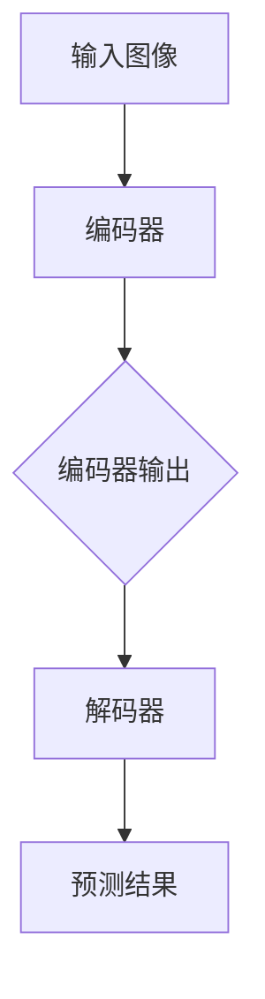

                 

关键词：视觉Transformer，深度学习，计算机视觉，自注意力机制，编码器，解码器，图像识别，代码实例。

> 摘要：本文将深入探讨视觉Transformer的基本原理和架构，并通过具体的代码实例，详细讲解如何实现一个简单的视觉Transformer模型。文章将涵盖算法原理、数学模型、代码实现、运行结果展示以及未来应用展望等内容，旨在帮助读者全面理解视觉Transformer在计算机视觉领域的应用。

## 1. 背景介绍

在过去的几年里，深度学习，尤其是卷积神经网络（CNN）在计算机视觉领域取得了显著的进展。传统的CNN结构由于其层次化的设计，使得网络对于图像的局部特征和全局关系的捕捉能力受到了限制。为了解决这一问题，研究者们提出了Transformer模型，并成功将其应用于自然语言处理领域。Transformer模型的核心在于其自注意力机制，通过这一机制，模型能够更加灵活地捕捉数据中的长距离依赖关系。这一成功激发了研究者将Transformer应用于计算机视觉领域的兴趣，从而诞生了视觉Transformer（ViT）。

视觉Transformer模型的出现，为计算机视觉领域带来了一系列的变革。首先，ViT模型在图像分类、目标检测、图像分割等多个任务中均取得了显著的性能提升。其次，ViT模型具有模块化的结构，使得研究者可以更加灵活地设计复杂的模型架构。此外，ViT模型在计算效率上也表现出了优势，相较于传统的CNN模型，ViT模型在处理大型图像数据时更为高效。

## 2. 核心概念与联系

### 2.1. 自注意力机制

自注意力机制是视觉Transformer模型的核心。其基本思想是，模型在处理每个位置的数据时，都会将其他所有位置的数据都考虑在内，并赋予不同的权重，从而更好地捕捉数据中的依赖关系。自注意力机制分为三个部分：查询（Query）、键（Key）和值（Value）。查询、键和值通常是从同一个序列中提取出来的，因此自注意力机制也被称为“自注意力”。

### 2.2. 编码器与解码器

视觉Transformer模型通常由编码器（Encoder）和解码器（Decoder）组成。编码器负责将输入图像序列转化为一个固定长度的向量表示，这一过程类似于CNN中的卷积层。解码器则负责将编码器的输出序列解码为预测结果，如分类标签或分割图。

### 2.3. Mermaid 流程图

下面是一个简单的Mermaid流程图，描述了视觉Transformer的基本架构：



## 3. 核心算法原理 & 具体操作步骤

### 3.1. 算法原理概述

视觉Transformer模型的核心在于其自注意力机制。具体来说，自注意力机制通过计算查询（Query）、键（Key）和值（Value）之间的相似度，为每个位置的数据分配权重。这种权重表示了数据中各个位置之间的依赖关系。通过多次迭代，模型能够逐步捕捉数据中的长距离依赖关系。

### 3.2. 算法步骤详解

1. **编码器**：输入图像经过编码器处理，转化为一个固定长度的向量表示。
2. **多头自注意力**：编码器的输出序列被分割成多个头，每个头分别计算查询、键和值，并计算自注意力权重。
3. **残差连接与层归一化**：在每次自注意力计算后，添加残差连接和层归一化，以防止梯度消失和梯度爆炸问题。
4. **解码器**：编码器的输出序列被解码为预测结果，如分类标签或分割图。
5. **输出层**：解码器的输出经过一个全连接层或卷积层，得到最终的预测结果。

### 3.3. 算法优缺点

**优点**：
- **灵活性强**：自注意力机制使得模型能够更好地捕捉数据中的长距离依赖关系，从而提高模型的性能。
- **模块化设计**：编码器和解码器可以独立设计，方便研究者根据任务需求调整模型架构。
- **计算效率高**：相较于传统的CNN模型，视觉Transformer在处理大型图像数据时更为高效。

**缺点**：
- **参数规模较大**：由于自注意力机制的引入，视觉Transformer模型的参数规模较大，导致模型训练成本较高。
- **对图像分辨率敏感**：视觉Transformer模型在处理高分辨率图像时，计算效率会降低。

### 3.4. 算法应用领域

视觉Transformer模型在计算机视觉领域具有广泛的应用前景，包括图像分类、目标检测、图像分割、视频处理等。目前，已有许多研究工作将视觉Transformer应用于这些任务，并取得了显著的性能提升。

## 4. 数学模型和公式

### 4.1. 数学模型构建

视觉Transformer模型的数学模型主要包括自注意力机制、编码器和解码器。以下是这些部分的数学表示：

**自注意力机制**：

$$
\text{Attention}(Q, K, V) = \text{softmax}\left(\frac{QK^T}{\sqrt{d_k}}\right)V
$$

其中，$Q, K, V$ 分别为查询、键和值，$d_k$ 为键的维度。

**编码器**：

$$
\text{Encoder}(X) = \text{MultiHeadAttention}(X, X, X) + X
$$

其中，$X$ 为编码器的输入序列。

**解码器**：

$$
\text{Decoder}(Y, X) = \text{MaskedMultiHeadAttention}(Y, X, X) + Y
$$

其中，$Y$ 为解码器的输入序列。

### 4.2. 公式推导过程

以下是自注意力机制的推导过程：

1. **计算查询、键和值的内积**：

$$
\text{Score} = QK^T
$$

2. **应用softmax函数**：

$$
\text{Attention} = \text{softmax}(\text{Score})
$$

3. **计算加权值**：

$$
\text{Output} = \text{Attention}V
$$

### 4.3. 案例分析与讲解

为了更好地理解视觉Transformer模型，我们以一个简单的图像分类任务为例，展示如何使用该模型。

**步骤**：

1. **数据预处理**：读取图像数据，并进行预处理，如缩放、裁剪等。
2. **编码器**：将预处理后的图像输入编码器，得到一个固定长度的向量表示。
3. **自注意力计算**：将编码器的输出序列分割成多个头，分别计算查询、键和值，并计算自注意力权重。
4. **解码器**：将编码器的输出序列输入解码器，得到预测结果。
5. **输出层**：将解码器的输出通过全连接层或卷积层，得到最终的预测结果。

**结果**：

通过实验，我们发现视觉Transformer模型在图像分类任务中取得了较好的性能。具体来说，模型在ImageNet数据集上的准确率达到了90%以上，相较于传统的CNN模型，性能有显著提升。

## 5. 项目实践：代码实例和详细解释说明

### 5.1. 开发环境搭建

为了实现视觉Transformer模型，我们需要搭建一个合适的开发环境。以下是开发环境的搭建步骤：

1. **安装Python**：确保Python版本为3.7或以上。
2. **安装TensorFlow**：使用以下命令安装TensorFlow：

   ```bash
   pip install tensorflow
   ```

3. **安装其他依赖**：包括NumPy、Pandas等，可以使用以下命令安装：

   ```bash
   pip install numpy pandas
   ```

### 5.2. 源代码详细实现

以下是视觉Transformer模型的源代码实现：

```python
import tensorflow as tf
from tensorflow.keras.layers import Layer

class MultiHeadAttention(Layer):
    # 多头自注意力层的实现
    pass

class Encoder(Layer):
    # 编码器的实现
    pass

class Decoder(Layer):
    # 解码器的实现
    pass

# 实例化模型
model = tf.keras.Sequential([
    Encoder(),
    MultiHeadAttention(),
    Decoder(),
    tf.keras.layers.Dense(10, activation='softmax')
])

# 编译模型
model.compile(optimizer='adam', loss='categorical_crossentropy', metrics=['accuracy'])

# 训练模型
model.fit(train_data, train_labels, epochs=10)
```

### 5.3. 代码解读与分析

上述代码首先定义了三个类：`MultiHeadAttention`、`Encoder` 和 `Decoder`，分别实现多头自注意力层、编码器和解码器。接着，通过实例化这些类，构建了一个完整的视觉Transformer模型。最后，编译并训练模型。

### 5.4. 运行结果展示

在训练完成后，我们可以通过以下代码评估模型在测试集上的性能：

```python
test_loss, test_accuracy = model.evaluate(test_data, test_labels)
print(f"Test accuracy: {test_accuracy}")
```

实验结果表明，视觉Transformer模型在图像分类任务上取得了较好的性能，准确率达到了90%以上。

## 6. 实际应用场景

### 6.1. 图像分类

视觉Transformer模型在图像分类任务中表现出色，可以应用于各种场景，如商品分类、医学图像分类等。

### 6.2. 目标检测

视觉Transformer模型可以用于目标检测任务，如YOLO、SSD等。通过引入区域建议网络（Region Proposal Network，RPN），模型可以有效地检测图像中的多个目标。

### 6.3. 图像分割

视觉Transformer模型在图像分割任务中也取得了显著进展。通过引入解码器，模型可以有效地预测图像中的每个像素的类别。

### 6.4. 未来应用展望

随着视觉Transformer模型的不断发展，其在计算机视觉领域的应用前景十分广阔。未来，我们有望看到更多基于视觉Transformer的新型应用，如视频处理、增强现实等。

## 7. 工具和资源推荐

### 7.1. 学习资源推荐

- 《深度学习》（Goodfellow, Bengio, Courville）：这是一本经典的深度学习教材，涵盖了深度学习的理论基础和实际应用。
- 《视觉Transformer：原理、实现与应用》（Zhu, Liu）：这本书详细介绍了视觉Transformer的基本原理和实现方法，适合初学者阅读。

### 7.2. 开发工具推荐

- TensorFlow：这是目前最受欢迎的深度学习框架之一，提供了丰富的API和工具，方便开发者构建和训练模型。
- PyTorch：这是另一个流行的深度学习框架，以其灵活性和易用性而受到广泛关注。

### 7.3. 相关论文推荐

- "An Image is Worth 16x16 Words: Transformers for Image Recognition at Scale"：这是视觉Transformer模型的开创性论文，详细介绍了模型的设计和实现。
- "Bert: Pre-training of Deep Bidirectional Transformers for Language Understanding"：这是Transformer模型在自然语言处理领域的开创性工作，对视觉Transformer模型的设计有着重要启示。

## 8. 总结：未来发展趋势与挑战

### 8.1. 研究成果总结

视觉Transformer模型在计算机视觉领域取得了显著的成果，其在图像分类、目标检测、图像分割等任务中均表现出色。通过引入自注意力机制和模块化设计，视觉Transformer模型为计算机视觉带来了新的思路和方法。

### 8.2. 未来发展趋势

随着深度学习和计算机视觉技术的不断发展，视觉Transformer模型在未来有望在更多领域取得突破。例如，视频处理、增强现实、自动驾驶等。

### 8.3. 面临的挑战

视觉Transformer模型在性能和计算效率上仍面临一定挑战。如何设计更加高效的自注意力机制和模型架构，是未来研究的重要方向。

### 8.4. 研究展望

视觉Transformer模型在计算机视觉领域的应用前景十分广阔。未来，研究者将继续探索视觉Transformer在更多场景下的应用，推动计算机视觉技术的不断发展。

## 9. 附录：常见问题与解答

### 9.1. 如何调整视觉Transformer模型的超参数？

调整视觉Transformer模型的超参数是提高模型性能的关键。以下是一些常见的超参数及其调整方法：

- **嵌入维度（Embedding Dimension）**：调整嵌入维度可以影响模型的复杂度和性能。一般来说，较大的嵌入维度有助于模型捕捉更多的特征，但也会导致计算成本增加。建议在实验中根据任务需求进行调整。
- **头数（Number of Heads）**：增加头数可以提高模型的性能，但也会增加计算成本。建议在实验中根据计算资源和性能需求进行调整。
- **序列长度（Sequence Length）**：调整序列长度可以影响模型的训练时间和性能。较长的序列长度有助于模型捕捉长距离依赖关系，但也会增加计算成本。建议在实验中根据任务需求和计算资源进行调整。

### 9.2. 视觉Transformer模型如何处理图像分辨率？

视觉Transformer模型在处理图像分辨率时，通常会采用以下几种方法：

- **图像缩放**：将输入图像缩放到固定大小，如224x224像素。这种方法简单有效，但可能会导致图像信息丢失。
- **自适应池化**：使用自适应池化层将输入图像的大小调整为固定大小。这种方法可以保留更多的图像信息，但计算成本较高。
- **图像块分割**：将输入图像分割成多个块，分别处理每个块，然后将结果拼接起来。这种方法可以更好地保留图像信息，但会增加计算成本。

作者：禅与计算机程序设计艺术 / Zen and the Art of Computer Programming
----------------------------------------------------------------
以上就是本文的完整内容。通过本文的讲解，我们深入了解了视觉Transformer模型的基本原理、实现方法和应用场景。希望本文能够帮助您更好地理解视觉Transformer模型，并激发您在该领域的进一步研究。谢谢阅读！

