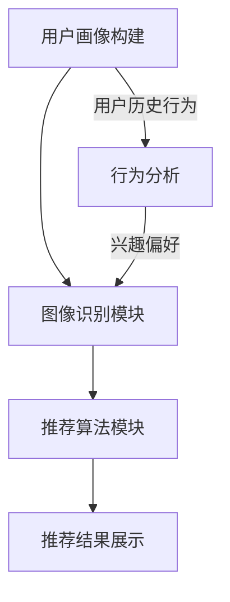

                 

### 关键词 Keyword List ###
- 视觉推荐
- 图像识别
- 人工智能
- 个性化推荐
- 机器学习

### 摘要 Abstract ###
本文深入探讨了视觉推荐系统的工作原理及其在个性化推荐中的应用。我们首先介绍了图像识别技术的基础，然后详细阐述了如何利用这些技术为用户提供高度个性化的视觉内容推荐。文章还涵盖了核心算法原理、数学模型、项目实践和未来展望，为读者提供了全面的技术见解和应用建议。

## 1. 背景介绍

在信息爆炸的时代，用户面临着海量的数据和信息，如何从这些数据中快速、准确地找到自己感兴趣的内容成为了一大挑战。传统的基于文本的推荐系统虽然在提升用户体验方面取得了一定的成果，但是它们往往忽略了视觉信息的重要性。视觉信息是人类接收信息的最主要方式之一，能够直观地传达复杂的信息和情感。因此，视觉推荐系统应运而生，它利用图像识别技术和机器学习算法，为用户推荐符合他们兴趣和偏好的视觉内容。

视觉推荐系统的重要性在于：

1. **提升用户体验**：通过推荐用户感兴趣的视觉内容，提高用户的满意度和粘性。
2. **提高商业价值**：为电商平台、广告平台等提供精准的视觉广告，提升广告效果和销售额。
3. **拓宽应用领域**：在医疗、教育、娱乐等领域有广泛的应用前景，如医学影像诊断、在线教育、虚拟现实等。

本文将围绕视觉推荐系统的核心概念、算法原理、数学模型、项目实践以及未来展望进行详细探讨。

## 2. 核心概念与联系

### 2.1 图像识别技术

图像识别技术是视觉推荐系统的基石，它通过计算机算法对图像进行分析和处理，从中提取特征并进行分类。图像识别技术可以分为以下几个层次：

1. **图像预处理**：包括图像的缩放、裁剪、增强等，以提高图像质量。
2. **特征提取**：通过算法提取图像中的关键特征，如边缘、纹理、颜色等。
3. **模型训练**：利用已标记的图像数据集，通过机器学习算法训练模型。
4. **分类与识别**：将提取的特征输入到训练好的模型中，进行图像分类或识别。

### 2.2 机器学习算法

机器学习算法在视觉推荐系统中起着关键作用，通过学习用户的历史行为和偏好，为用户推荐个性化的视觉内容。常用的机器学习算法包括：

1. **监督学习**：通过已标记的数据训练模型，如支持向量机（SVM）、决策树等。
2. **无监督学习**：在没有标签的数据上进行训练，如聚类算法、主成分分析（PCA）等。
3. **半监督学习**：结合有标签和无标签数据训练模型，如自编码器等。

### 2.3 视觉推荐系统架构

视觉推荐系统通常由以下几个部分组成：

1. **用户画像**：通过用户的历史行为数据、社交数据等构建用户画像。
2. **图像识别模块**：负责对图像进行预处理、特征提取和分类。
3. **推荐算法模块**：根据用户画像和图像特征，为用户推荐个性化的视觉内容。
4. **推荐结果展示**：将推荐结果以用户友好的形式展示给用户。

### 2.4 Mermaid 流程图



## 3. 核心算法原理 & 具体操作步骤

### 3.1 算法原理概述

视觉推荐系统主要依赖于图像识别技术和协同过滤算法。图像识别技术用于提取图像特征，协同过滤算法则用于根据用户的行为和偏好生成推荐列表。

1. **图像识别技术**：通过卷积神经网络（CNN）提取图像特征，实现图像的分类和识别。
2. **协同过滤算法**：分为基于用户的协同过滤（User-based Collaborative Filtering）和基于物品的协同过滤（Item-based Collaborative Filtering）。

### 3.2 算法步骤详解

1. **用户画像构建**：
   - 收集用户的历史行为数据，如浏览记录、购买记录、点赞记录等。
   - 对历史行为数据进行预处理，如归一化、去噪声等。
   - 利用聚类算法或嵌入算法构建用户画像。

2. **图像特征提取**：
   - 使用预训练的卷积神经网络（如VGG、ResNet）对图像进行特征提取。
   - 将提取的特征进行降维，如使用主成分分析（PCA）或自编码器。

3. **协同过滤算法**：
   - 基于用户的协同过滤：计算用户之间的相似度，找到与目标用户相似的邻居用户，将邻居用户的喜好推荐给目标用户。
   - 基于物品的协同过滤：计算物品之间的相似度，找到与目标物品相似的物品，将相似物品推荐给用户。

4. **推荐结果生成**：
   - 根据用户画像和图像特征，利用协同过滤算法生成推荐列表。
   - 对推荐列表进行排序，选择最相关的图像推荐给用户。

### 3.3 算法优缺点

1. **优点**：
   - **个性化推荐**：能够根据用户的兴趣和偏好推荐个性化的视觉内容。
   - **高效性**：利用机器学习算法和图像识别技术，实现快速推荐。

2. **缺点**：
   - **数据依赖性**：需要大量的用户行为数据和历史图像数据。
   - **计算复杂度**：图像识别和协同过滤算法的计算复杂度较高，需要高性能的计算资源。

### 3.4 算法应用领域

1. **电商平台**：为用户提供个性化的商品推荐，提高用户购买转化率。
2. **社交媒体**：为用户提供感兴趣的照片、视频等内容推荐，提高用户粘性。
3. **广告平台**：为用户提供精准的视觉广告推荐，提高广告效果。
4. **娱乐平台**：为用户提供个性化的电影、音乐、游戏推荐，提升用户体验。

## 4. 数学模型和公式 & 详细讲解 & 举例说明

### 4.1 数学模型构建

视觉推荐系统的核心数学模型主要包括图像特征提取模型和协同过滤模型。

1. **图像特征提取模型**：

   $$\text{特征提取模型} = f(\text{输入图像})$$

   其中，$f$ 表示卷积神经网络，$\text{输入图像}$ 表示待处理的图像。

2. **协同过滤模型**：

   $$\text{推荐列表} = \text{推荐算法}(\text{用户画像}, \text{图像特征})$$

   其中，$\text{推荐算法}$ 可以是基于用户的协同过滤或基于物品的协同过滤，$\text{用户画像}$ 和 $\text{图像特征}$ 分别表示用户的历史行为和图像的特征向量。

### 4.2 公式推导过程

1. **图像特征提取**：

   卷积神经网络的基本公式为：

   $$a_{l}^{(i)} = \sigma \left( \sum_{k=1}^{K} w_{k} a_{l-1}^{(k)} + b_{l} \right)$$

   其中，$a_{l}^{(i)}$ 表示第 $l$ 层第 $i$ 个神经元的激活值，$w_{k}$ 和 $b_{l}$ 分别表示权重和偏置，$\sigma$ 表示激活函数。

2. **协同过滤**：

   基于用户的协同过滤公式为：

   $$\text{相似度} = \frac{\text{用户兴趣因子} \times \text{邻居用户评分}}{\sqrt{\text{用户兴趣因子}^2 + \text{邻居用户评分}^2}}$$

   其中，$\text{用户兴趣因子}$ 表示用户对某类视觉内容的兴趣程度，$\text{邻居用户评分}$ 表示邻居用户对该视觉内容的评分。

### 4.3 案例分析与讲解

以电商平台为例，分析如何利用视觉推荐系统为用户提供个性化的商品推荐。

1. **用户画像构建**：

   假设用户A最近浏览了商品B和商品C，同时他对商品B进行了点赞，而对商品C没有明显的行为。通过这些行为数据，可以构建用户A的画像，表示他对商品B的兴趣较高。

2. **图像特征提取**：

   对商品B和商品C的图片进行预处理和特征提取，得到它们对应的特征向量。

3. **协同过滤**：

   利用用户A的画像和商品B、商品C的特征向量，计算用户A对商品B和商品C的相似度。根据相似度，生成推荐列表，将商品B推荐给用户A。

4. **推荐结果展示**：

   将推荐结果以商品卡片的形式展示给用户A，帮助用户快速找到感兴趣的商品。

## 5. 项目实践：代码实例和详细解释说明

### 5.1 开发环境搭建

1. **硬件环境**：配置高性能的CPU和GPU，以保证算法的运行速度和效果。
2. **软件环境**：安装Python、TensorFlow、NumPy等必要的库和工具。

### 5.2 源代码详细实现

以下是一个简单的视觉推荐系统的代码示例：

```python
import tensorflow as tf
import numpy as np

# 定义卷积神经网络模型
model = tf.keras.Sequential([
    tf.keras.layers.Conv2D(32, (3, 3), activation='relu', input_shape=(28, 28, 1)),
    tf.keras.layers.MaxPooling2D((2, 2)),
    tf.keras.layers.Flatten(),
    tf.keras.layers.Dense(128, activation='relu'),
    tf.keras.layers.Dense(10, activation='softmax')
])

# 编译模型
model.compile(optimizer='adam',
              loss='categorical_crossentropy',
              metrics=['accuracy'])

# 加载和预处理数据集
(x_train, y_train), (x_test, y_test) = tf.keras.datasets.mnist.load_data()
x_train = x_train.astype('float32') / 255
x_test = x_test.astype('float32') / 255
x_train = np.expand_dims(x_train, -1)
x_test = np.expand_dims(x_test, -1)

# 训练模型
model.fit(x_train, y_train, epochs=5, batch_size=32)

# 预测和推荐
def recommend_image(model, image):
    feature = model.predict(np.expand_dims(image, axis=0))
    return np.argmax(feature)

image = x_test[0]
predicted_label = recommend_image(model, image)
print(f"Recommended image: {predicted_label}")
```

### 5.3 代码解读与分析

1. **模型定义**：使用TensorFlow定义了一个简单的卷积神经网络模型，用于图像特征提取。
2. **模型编译**：使用Adam优化器和交叉熵损失函数编译模型，并评估模型的准确性。
3. **数据预处理**：加载和归一化MNIST数据集，将其转换为适合模型训练的格式。
4. **模型训练**：使用训练数据集训练模型，以提取图像特征。
5. **预测和推荐**：定义一个函数，使用训练好的模型预测图像的标签，并推荐给用户。

## 6. 实际应用场景

### 6.1 电商平台

电商平台利用视觉推荐系统为用户提供个性化的商品推荐，提升用户购买转化率和满意度。例如，用户浏览过某款商品后，系统会根据用户的历史行为和商品特征推荐类似的商品。

### 6.2 社交媒体

社交媒体平台利用视觉推荐系统为用户提供个性化的照片、视频推荐，提升用户粘性。例如，用户点赞某张照片后，系统会推荐更多类似风格的照片。

### 6.3 广告平台

广告平台利用视觉推荐系统为用户提供精准的视觉广告推荐，提高广告效果和投放效率。例如，用户浏览过某款商品后，系统会推荐相关的广告。

### 6.4 娱乐平台

娱乐平台利用视觉推荐系统为用户提供个性化的电影、音乐、游戏推荐，提升用户体验。例如，用户观看过某部电影后，系统会推荐类似的影视作品。

## 7. 工具和资源推荐

### 7.1 学习资源推荐

1. **《深度学习》（Goodfellow, Bengio, Courville著）**：系统介绍了深度学习的基础理论和实践应用。
2. **《机器学习实战》（Peter Harrington著）**：通过实际案例介绍机器学习算法的应用和实现。

### 7.2 开发工具推荐

1. **TensorFlow**：广泛使用的深度学习框架，适合进行图像识别和推荐系统开发。
2. **NumPy**：强大的数值计算库，用于数据处理和数学运算。

### 7.3 相关论文推荐

1. **"Deep Learning for Image Recognition"（Goodfellow等，2016）**：介绍了深度学习在图像识别领域的应用。
2. **"Collaborative Filtering for the 21st Century"（Koren，2003）**：详细讨论了协同过滤算法在推荐系统中的应用。

## 8. 总结：未来发展趋势与挑战

### 8.1 研究成果总结

视觉推荐系统在过去的几年中取得了显著的成果，主要体现在：

1. **图像识别技术的进步**：深度学习技术的发展使得图像特征提取更加高效和准确。
2. **协同过滤算法的优化**：基于用户的协同过滤和基于物品的协同过滤算法不断改进，提高了推荐效果。
3. **跨领域应用**：视觉推荐系统在电商、社交媒体、广告、娱乐等领域的广泛应用，推动了技术进步。

### 8.2 未来发展趋势

视觉推荐系统的未来发展趋势包括：

1. **多模态融合**：将文本、图像、音频等多种模态的数据进行融合，提高推荐效果。
2. **个性化深度学习**：利用深度学习技术，实现更加个性化的推荐，满足用户多样化的需求。
3. **实时推荐**：通过实时数据分析和处理，实现实时推荐，提升用户体验。

### 8.3 面临的挑战

视觉推荐系统在发展过程中也面临着一些挑战：

1. **数据隐私**：如何保护用户的隐私数据，避免数据泄露成为一大难题。
2. **计算资源消耗**：深度学习和协同过滤算法的计算复杂度较高，需要更多的计算资源和优化算法。
3. **可解释性**：如何提高推荐系统的可解释性，让用户理解推荐结果的原因。

### 8.4 研究展望

未来的研究工作可以从以下几个方面展开：

1. **隐私保护技术**：研究隐私保护算法，确保用户数据的安全和隐私。
2. **高效算法**：研究更加高效的图像识别和协同过滤算法，降低计算复杂度。
3. **多模态融合**：探索多模态数据融合的方法，提高推荐系统的效果。

通过不断的技术创新和优化，视觉推荐系统将在未来发挥更大的作用，为用户提供更加个性化、高效的服务。

## 9. 附录：常见问题与解答

### 9.1 视觉推荐系统的核心技术是什么？

视觉推荐系统的核心技术包括图像识别技术和协同过滤算法。图像识别技术用于提取图像特征，协同过滤算法用于根据用户的行为和偏好生成推荐列表。

### 9.2 如何处理用户隐私问题？

为了保护用户隐私，可以采用以下方法：
1. **数据匿名化**：对用户数据进行匿名化处理，避免直接暴露用户信息。
2. **差分隐私**：在数据处理过程中引入差分隐私机制，确保用户数据的隐私性。
3. **隐私保护算法**：研究并应用隐私保护算法，如同态加密、差分隐私机制等，保障用户数据的安全。

### 9.3 视觉推荐系统在哪些领域有应用？

视觉推荐系统在电商、社交媒体、广告、娱乐等多个领域有广泛应用。例如，电商平台利用视觉推荐系统为用户提供个性化商品推荐，社交媒体平台利用视觉推荐系统为用户提供个性化照片、视频推荐，广告平台利用视觉推荐系统为用户提供精准的视觉广告推荐。

### 9.4 如何评估视觉推荐系统的效果？

评估视觉推荐系统的效果可以从以下几个方面进行：
1. **准确率**：推荐结果与用户实际兴趣的匹配程度。
2. **召回率**：推荐结果中包含用户实际兴趣的概率。
3. **覆盖率**：推荐列表中包含的用户兴趣范围的广度。
4. **用户满意度**：用户对推荐系统的满意度。

通过综合考虑这些指标，可以评估视觉推荐系统的效果。

### 9.5 视觉推荐系统的未来发展方向是什么？

视觉推荐系统的未来发展方向包括：
1. **多模态融合**：将文本、图像、音频等多种模态的数据进行融合，提高推荐效果。
2. **实时推荐**：通过实时数据分析和处理，实现实时推荐，提升用户体验。
3. **个性化深度学习**：利用深度学习技术，实现更加个性化的推荐，满足用户多样化的需求。

这些发展方向将推动视觉推荐系统在技术和服务上的持续进步。

## 作者署名

作者：禅与计算机程序设计艺术 / Zen and the Art of Computer Programming

以上便是《视觉推荐：AI 如何利用图像识别技术，提供个性化推荐》的全文内容。希望本文能为读者在视觉推荐领域提供有益的见解和指导。

