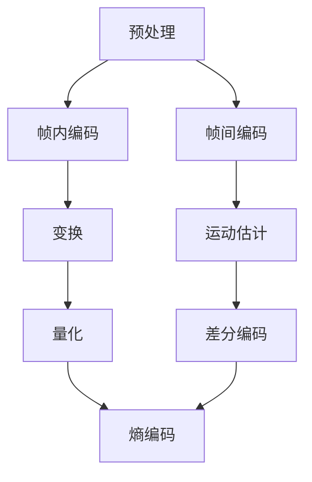

                 

关键词：视频编码，视频压缩，H.264，HEVC，图像质量，数据传输，算法优化，实际应用。

> 摘要：本文将深入探讨视频编码和压缩领域中的两大核心技术——H.264和HEVC。通过对这两种视频编码标准的详细介绍，分析其在图像质量、数据传输效率、算法复杂度等方面的优劣，帮助读者全面理解视频编码技术，并展望其未来的发展趋势。

## 1. 背景介绍

随着互联网的迅猛发展和数字化媒体的普及，视频内容的需求日益增长。然而，视频数据的巨大体积使得数据传输和处理成为一个巨大的挑战。为了应对这一挑战，视频编码和压缩技术应运而生。视频编码的目的是将视频数据转换成一种更高效的形式，以便于存储和传输。视频压缩则旨在通过去除冗余信息，降低视频文件的大小。

视频编码和压缩技术的发展经历了多个阶段。从早期的MPEG-1、MPEG-2到H.263，再到H.264和最新的HEVC，每一种新标准都代表了视频编码和压缩技术的重大进步。本文将重点介绍H.264和HEVC这两种主流的视频编码标准，分析其技术特点和应用场景。

### 1.1 H.264

H.264，也称为MPEG-4 Part 10或AVC（Advanced Video Coding），是视频编码领域的一项重要技术。它于2003年正式发布，旨在提供比MPEG-2更高效的视频压缩，同时保持较高的图像质量。H.264广泛应用于高清电视、网络视频、移动通信等领域，成为事实上的标准。

### 1.2 HEVC

HEVC，即H.265或也称为MPEG-H Part 2，是继H.264之后推出的新一代视频编码标准。它于2013年正式发布，旨在提供比H.264更高效率的压缩。HEVC的压缩效率比H.264提高了约50%，因此在同样的质量下，HEVC生成的文件大小可以比H.264小一半左右。这使得HEVC在超高清（UHD）视频传输、大带宽网络以及移动设备上具有更广泛的应用前景。

## 2. 核心概念与联系

### 2.1 基础概念

视频编码和压缩的核心概念包括：图像序列、帧内编码、帧间编码、变换、量化、熵编码等。这些概念构成了视频编码技术的基石，也是理解H.264和HEVC的重要基础。

- **图像序列**：视频是由一系列连续的图像帧组成的序列。每一帧代表视频在特定时刻的状态。
- **帧内编码**：帧内编码仅处理单个图像帧，不依赖于其他帧。它通过去除帧内的冗余信息来实现压缩。
- **帧间编码**：帧间编码利用图像帧之间的时间冗余进行压缩。它通过比较不同帧之间的差异来实现压缩。
- **变换**：变换是将图像数据转换成一种更适合压缩的形式。在H.264和HEVC中，常用的变换包括离散余弦变换（DCT）和小波变换。
- **量化**：量化是将变换后的系数进行精确到特定位的表示，从而去除部分冗余信息。
- **熵编码**：熵编码是一种无损压缩技术，它通过统计频率较高的符号使用较短的编码，而频率较低的符号使用较长的编码，从而实现压缩。

### 2.2 架构原理

H.264和HEVC的架构原理基本相同，都包括以下几个主要步骤：

1. **预处理**：包括色彩空间转换、缩放、去隔行等操作。
2. **帧内编码**：对当前帧进行编码，包括DCT变换、量化、熵编码等步骤。
3. **帧间编码**：利用运动估计和补偿对参考帧进行编码，包括运动补偿、运动估计、差分编码等步骤。
4. **熵编码**：对编码后的数据使用熵编码技术进行进一步压缩。

### 2.3 Mermaid 流程图

下面是H.264和HEVC的核心流程的Mermaid流程图表示：



## 3. 核心算法原理 & 具体操作步骤

### 3.1 算法原理概述

H.264和HEVC的核心算法原理主要包括以下几个部分：

1. **变换与量化**：通过DCT或小波变换将图像数据转换成更适合压缩的形式，然后通过量化去除冗余信息。
2. **运动估计与补偿**：通过比较参考帧和当前帧的差异，估计运动矢量并进行运动补偿，减少帧间冗余。
3. **熵编码**：使用熵编码技术对编码后的数据进行进一步压缩。

### 3.2 算法步骤详解

#### 3.2.1 帧内编码

1. **预处理**：进行色彩空间转换，将RGB色彩空间转换为YUV色彩空间。
2. **块划分**：将图像划分为16x16或4x4的块。
3. **DCT变换**：对每个块进行DCT变换。
4. **量化**：对DCT系数进行量化，减少精度以实现压缩。
5. **熵编码**：使用熵编码技术（如Huffman编码）对量化后的DCT系数进行编码。

#### 3.2.2 帧间编码

1. **运动估计**：比较当前帧和参考帧，估计运动矢量。
2. **运动补偿**：根据运动矢量对参考帧进行补偿，生成预测帧。
3. **差分编码**：对当前帧和预测帧之间的差异进行编码。
4. **熵编码**：对差分编码后的数据进行熵编码。

### 3.3 算法优缺点

#### H.264

- **优点**：
  - 高效的压缩算法，能够实现较高的数据压缩率。
  - 支持多种分辨率和格式，适用于各种应用场景。
  - 具有良好的实时性能，适合实时视频传输和处理。

- **缺点**：
  - 算法复杂度较高，对硬件资源要求较高。
  - 在某些场景下，图像质量可能不如HEVC。

#### HEVC

- **优点**：
  - 更高的压缩效率，能够在相同质量下生成更小的文件。
  - 支持更高的分辨率和帧率，适用于超高清视频传输。
  - 改进了算法结构，降低了复杂度。

- **缺点**：
  - 编码和解码速度相对较慢，对硬件资源要求较高。
  - 需要更多的带宽进行传输。

### 3.4 算法应用领域

H.264和HEVC在多个领域得到了广泛应用：

- **高清电视**：H.264是当前主流的高清电视视频编码标准，HEVC则有望成为未来超高清电视的标准。
- **网络视频**：网络视频平台普遍采用H.264和HEVC进行视频编码和传输，以实现高效的数据传输和流畅的视频播放。
- **移动通信**：随着移动设备屏幕分辨率的提高，HEVC成为移动通信领域的重要技术，能够提供更好的视频观看体验。
- **多媒体应用**：H.264和HEVC在多媒体播放器、视频会议系统、监控摄像头等领域也得到了广泛应用。

## 4. 数学模型和公式 & 详细讲解 & 举例说明

### 4.1 数学模型构建

视频编码和压缩中的数学模型主要包括变换模型和熵编码模型。

#### 变换模型

1. **DCT变换**：
   $$ 
   C(u, v) = \sum_{x=0}^{N-1} \sum_{y=0}^{N-1} A(x, y) \cdot \cos\left(\frac{(2x+1)u\pi}{N}\right) \cdot \cos\left(\frac{(2y+1)v\pi}{N}\right)
   $$
   其中，$A(x, y)$ 为原始图像数据，$C(u, v)$ 为变换后的系数。

2. **量化**：
   $$
   Q(u, v) = \frac{C(u, v)}{2^q}
   $$
   其中，$q$ 为量化步长。

#### 熵编码模型

1. **Huffman编码**：
   $$
   L(x) = -\sum_{x} p(x) \log_2 p(x)
   $$
   其中，$p(x)$ 为符号 $x$ 的概率。

### 4.2 公式推导过程

#### DCT变换推导

DCT变换的推导过程涉及复数变换和对偶变换，这里仅简要概述：

1. 复数变换：
   $$
   Z = \sum_{x=0}^{N-1} \sum_{y=0}^{N-1} A(x, y) \cdot \cos\left(\frac{(2x+1)u\pi}{N}\right) \cdot \cos\left(\frac{(2y+1)v\pi}{N}\right)
   $$

2. 对偶变换：
   $$
   C(u, v) = \sum_{x=0}^{N-1} \sum_{y=0}^{N-1} A(x, y) \cdot \cos\left(\frac{(2x+1)u\pi}{N}\right) \cdot \cos\left(\frac{(2y+1)v\pi}{N}\right)
   $$

#### 量化推导

量化过程实际上是对DCT系数进行舍入处理，以减少精度：

$$
Q(u, v) = \text{round}\left(\frac{C(u, v)}{2^q}\right)
$$

### 4.3 案例分析与讲解

#### 案例一：H.264帧内编码

假设我们有一幅128x128的图像，将其划分为16x16的块。我们首先对每个块进行DCT变换，然后对DCT系数进行量化。

- **DCT变换**：
  - 对每个16x16块，计算DCT系数。

- **量化**：
  - 设量化步长 $q=0.5$，对每个DCT系数进行量化。

- **熵编码**：
  - 使用Huffman编码对量化后的DCT系数进行编码。

#### 案例二：HEVC帧间编码

假设我们有一个I帧和一个P帧，我们需要对P帧进行帧间编码。

- **运动估计**：
  - 对P帧和I帧进行差值计算，估计运动矢量。

- **运动补偿**：
  - 根据运动矢量对I帧进行补偿，生成预测帧。

- **差分编码**：
  - 对P帧和预测帧之间的差值进行编码。

- **熵编码**：
  - 对差分编码后的数据进行熵编码。

## 5. 项目实践：代码实例和详细解释说明

### 5.1 开发环境搭建

为了演示H.264和HEVC的编码过程，我们需要搭建一个开发环境。以下是一个基本的开发环境搭建步骤：

1. 安装FFmpeg，这是一个开源的音频视频处理工具，支持H.264和HEVC编码。
2. 配置CMake，这是一个跨平台的构建工具，用于编译FFmpeg。
3. 编写CMakeLists.txt文件，定义编译选项和构建步骤。

### 5.2 源代码详细实现

以下是一个简单的H.264编码示例代码，展示了如何使用FFmpeg进行视频编码：

```c
#include <libavcodec/avcodec.h>
#include <libavformat/avformat.h>

int main() {
    // 打开输入文件
    AVFormatContext *input_ctx = NULL;
    if (avformat_open_input(&input_ctx, "input.mp4", NULL, NULL) < 0) {
        // 打开输入文件失败
        return -1;
    }

    // 读取输入文件的流信息
    if (avformat_find_stream_info(input_ctx, NULL) < 0) {
        // 读取流信息失败
        return -1;
    }

    // 找到视频流
    AVStream *video_stream = NULL;
    for (int i = 0; i < input_ctx->nb_streams; i++) {
        if (input_ctx->streams[i]->codecpar->codec_type == AVMEDIA_TYPE_VIDEO) {
            video_stream = input_ctx->streams[i];
            break;
        }
    }

    // 打开编码器
    AVCodec *codec = avcodec_find_encoder(AV_CODEC_ID_H264);
    AVCodecContext *codec_ctx = avcodec_alloc_context3(codec);
    if (avcodec_open2(codec_ctx, codec, NULL) < 0) {
        // 打开编码器失败
        return -1;
    }

    // 配置编码器参数
    codec_ctx->bit_rate = 10000000; // 视频比特率
    codec_ctx->gop_size = 30; // 关键帧间隔
    codec_ctx->max_frame_rate = 30; // 视频帧率

    // 编码视频
    AVPacket packet;
    AVFrame *frame = av_frame_alloc();
    while (av_read_frame(input_ctx, &packet) >= 0) {
        if (packet.stream_index != video_stream->index) {
            av_packet_unref(&packet);
            continue;
        }

        if (avcodec_send_packet(codec_ctx, &packet) < 0) {
            // 发送包失败
            break;
        }

        while (avcodec_receive_packet(codec_ctx, &packet) >= 0) {
            // 处理编码后的包
            // ...
            av_packet_unref(&packet);
        }
    }

    // 关闭编码器
    avcodec_close(codec_ctx);
    av_free(codec_ctx);

    // 关闭输入文件
    avformat_close_input(&input_ctx);

    return 0;
}
```

### 5.3 代码解读与分析

上述代码演示了如何使用FFmpeg进行H.264视频编码。以下是代码的关键部分解读：

- **打开输入文件**：使用avformat_open_input函数打开输入文件，并获取输入文件的流信息。
- **读取流信息**：使用avformat_find_stream_info函数读取输入文件的流信息，找到视频流。
- **打开编码器**：使用avcodec_find_encoder函数查找编码器，使用avcodec_alloc_context3函数分配编码器上下文，使用avcodec_open2函数打开编码器。
- **配置编码器参数**：根据需求配置编码器参数，如比特率、关键帧间隔和视频帧率。
- **编码视频**：使用avcodec_send_packet函数发送输入帧到编码器，使用avcodec_receive_packet函数接收编码后的包。
- **关闭编码器**：使用avcodec_close函数关闭编码器，使用av_free函数释放编码器上下文。
- **关闭输入文件**：使用avformat_close_input函数关闭输入文件。

### 5.4 运行结果展示

在成功编译并运行上述代码后，我们将在输出文件中看到H.264编码的视频数据。可以使用FFmpeg工具查看输出视频的详细信息，如比特率、分辨率和帧率等。

```bash
ffprobe output.mp4
```

## 6. 实际应用场景

H.264和HEVC在多个实际应用场景中发挥了重要作用。以下是一些典型的应用场景：

### 6.1 高清电视

高清电视是H.264和HEVC的主要应用领域之一。这两种编码标准提供了高效的视频压缩，使得高清电视信号的传输和存储变得更加容易。例如，在我国广泛使用的有线和卫星电视信号中，H.264和HEVC已成为主要的标准。

### 6.2 网络视频

随着网络带宽的提升和流媒体服务的普及，H.264和HEVC在在线视频播放中得到了广泛应用。例如，YouTube、Netflix和Amazon Prime Video等平台都使用H.264和HEVC进行视频编码和传输，以提供高质量的在线观看体验。

### 6.3 移动通信

随着移动设备的屏幕分辨率和帧率的提高，HEVC成为移动通信领域的重要技术。它能够提供更高的压缩效率，使得在有限的带宽下实现高质量的视频传输成为可能。例如，4G和5G网络中的高清视频通话和直播应用广泛采用HEVC编码。

### 6.4 多媒体应用

H.264和HEVC在多媒体播放器、视频会议系统、监控摄像头等领域也得到了广泛应用。这些应用场景对视频压缩效率和图像质量有较高的要求，H.264和HEVC能够满足这些需求。

## 7. 工具和资源推荐

为了更好地学习和应用视频编码和压缩技术，以下是一些建议的工

