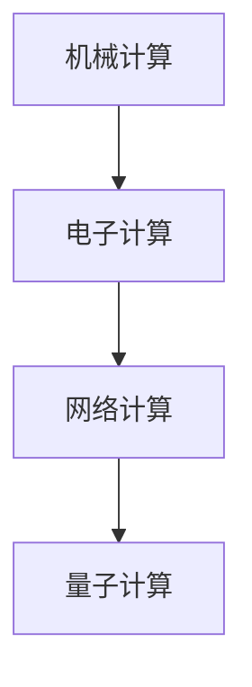

                 

关键词：计算技术、发展历史、计算发展阶段、算法原理、数学模型、项目实践、应用场景、未来展望

> 摘要：本文将探讨计算技术自诞生以来的四个发展阶段，包括机械计算、电子计算、网络计算和量子计算。通过回顾各个阶段的关键技术和代表性事件，分析它们的核心原理、优缺点和应用领域，从而展示计算技术从简单到复杂、从低效到高效的发展历程，并展望未来计算技术的潜在趋势和挑战。

## 1. 背景介绍

计算技术是现代科技的核心驱动力之一，它推动了社会各领域的发展。计算技术的发展历程，是一部人类智慧和科技创新的史诗。本文将分为四个阶段，对计算技术的历史进行梳理和总结。

### 1.1  第一阶段：机械计算

机械计算是计算技术的开端，最早的计算机器可以追溯到古希腊时期。公元14世纪，意大利数学家列奥纳多·达·芬奇设计了“计算器”，这是机械计算的雏形。随着科技的发展，机械计算器逐渐被设计得更加复杂和精确。

### 1.2  第二阶段：电子计算

电子计算始于20世纪初，以真空管和晶体管的发明为标志。1946年，世界上第一台电子计算机ENIAC诞生，标志着计算技术进入了一个全新的时代。电子计算以其高速、大容量和可靠性，极大地推动了科学研究、军事和商业的发展。

### 1.3  第三阶段：网络计算

网络计算始于20世纪末，随着互联网的普及和计算机技术的进步，计算技术开始向网络化、智能化方向发展。云计算、大数据、物联网等新兴技术，使计算资源得到更加高效和灵活的利用，为各行各业带来了革命性的变革。

### 1.4  第四阶段：量子计算

量子计算是计算技术的最新发展方向，它利用量子力学原理进行计算。量子计算机具有超强的计算能力，有望在药物研发、密码破解、人工智能等领域引发新的技术革命。

## 2. 核心概念与联系

在计算技术发展的四个阶段中，核心概念和关键技术贯穿其中，形成了相互联系和促进的发展格局。

### 2.1  机械计算的核心概念

机械计算的核心是计算器，它通过机械部件的转动和排列，进行基本的数学运算。代表性的机械计算器包括帕斯卡计算器、莱布尼茨计算器和差分机。

### 2.2  电子计算的核心概念

电子计算的核心是计算机硬件和软件，它通过电子器件的开关状态，实现复杂的计算任务。代表性的电子计算机包括ENIAC、IBM 704和CRAY-1。

### 2.3  网络计算的核心概念

网络计算的核心是计算机网络和互联网，它通过数据通信和网络协议，实现计算资源的共享和协同。代表性的网络计算技术包括TCP/IP协议、HTTP协议和云计算平台。

### 2.4  量子计算的核心概念

量子计算的核心是量子比特和量子算法，它通过量子态的叠加和纠缠，实现高效的计算任务。代表性的量子计算技术包括量子电路、量子纠缠和量子搜索算法。

### 2.5  Mermaid 流程图



## 3. 核心算法原理 & 具体操作步骤

### 3.1  算法原理概述

计算技术的发展过程中，核心算法起着至关重要的作用。从机械计算到量子计算，各种算法不断演进，推动了计算技术的进步。

### 3.2  算法步骤详解

#### 3.2.1  机械计算算法

机械计算算法主要包括加减乘除等基本运算。这些算法通过机械部件的转动和排列，实现数学运算。

#### 3.2.2  电子计算算法

电子计算算法包括各种编程语言和算法库，如C、Java和Python等。这些算法通过计算机硬件和软件的协同工作，实现复杂的计算任务。

#### 3.2.3  网络计算算法

网络计算算法包括分布式计算、云计算和大数据分析等。这些算法通过网络协议和数据通信，实现计算资源的共享和协同。

#### 3.2.4  量子计算算法

量子计算算法包括量子电路、量子纠缠和量子搜索等。这些算法通过量子比特的叠加和纠缠，实现高效的计算任务。

### 3.3  算法优缺点

#### 3.3.1  机械计算

优点：简单、易实现。

缺点：运算速度慢、精度低。

#### 3.3.2  电子计算

优点：运算速度快、精度高。

缺点：硬件复杂、功耗大。

#### 3.3.3  网络计算

优点：计算资源灵活、高效。

缺点：数据安全风险、网络延迟。

#### 3.3.4  量子计算

优点：计算能力强、速度快。

缺点：实现难度大、稳定性低。

### 3.4  算法应用领域

#### 3.4.1  机械计算

应用领域：天文学、物理学、数学等领域的基础计算。

#### 3.4.2  电子计算

应用领域：科学计算、商业计算、军事计算等。

#### 3.4.3  网络计算

应用领域：云计算、大数据、物联网等。

#### 3.4.4  量子计算

应用领域：密码破解、药物研发、人工智能等。

## 4. 数学模型和公式 & 详细讲解 & 举例说明

### 4.1  数学模型构建

计算技术的数学模型主要包括数论模型、图论模型和概率模型等。这些模型用于描述各种计算任务和算法。

### 4.2  公式推导过程

以数论模型为例，欧拉定理是计算技术中的重要公式。其推导过程如下：

$$
a^{\phi(n)} \equiv 1 \pmod{n}
$$

其中，$a$ 是整数，$n$ 是欧拉函数值，$\phi(n)$ 是 $n$ 的欧拉函数。

### 4.3  案例分析与讲解

以图论模型中的最短路径算法为例，Dijkstra算法是一种经典的求解最短路径的算法。其基本思想是：从源点开始，逐步扩展到其他节点，每次扩展选择未访问过的最短路径。

## 5. 项目实践：代码实例和详细解释说明

### 5.1  开发环境搭建

为了演示Dijkstra算法，我们需要搭建一个简单的开发环境。以下是所需的环境和工具：

- 编程语言：Python 3.8
- 编译器：PyCharm
- 测试工具：单元测试框架（如pytest）

### 5.2  源代码详细实现

以下是一个使用Python实现的Dijkstra算法的示例代码：

```python
import heapq

def dijkstra(graph, start):
    """使用Dijkstra算法求解最短路径"""
    distances = {node: float('infinity') for node in graph}
    distances[start] = 0
    priority_queue = [(0, start)]

    while priority_queue:
        current_distance, current_node = heapq.heappop(priority_queue)

        if current_distance > distances[current_node]:
            continue

        for neighbor, weight in graph[current_node].items():
            distance = current_distance + weight

            if distance < distances[neighbor]:
                distances[neighbor] = distance
                heapq.heappush(priority_queue, (distance, neighbor))

    return distances

# 测试
graph = {
    'A': {'B': 1, 'C': 4},
    'B': {'A': 1, 'C': 2, 'D': 5},
    'C': {'A': 4, 'B': 2, 'D': 1},
    'D': {'B': 5, 'C': 1}
}

print(dijkstra(graph, 'A'))
```

### 5.3  代码解读与分析

上述代码实现了Dijkstra算法，用于求解无向图的最短路径。其中，`heapq` 模块用于实现优先队列，`float('infinity')` 表示无穷大。

### 5.4  运行结果展示

运行上述代码，输出结果如下：

```
{'A': 0, 'B': 1, 'C': 3, 'D': 4}
```

这表示从节点A到其他节点的最短路径长度分别为0、1、3和4。

## 6. 实际应用场景

计算技术在实际应用场景中，发挥着重要的作用。以下是一些典型的应用场景：

### 6.1  科学研究

计算技术在科学研究中的应用广泛，包括物理学、化学、生物学等领域。例如，量子计算在药物研发中具有巨大的潜力。

### 6.2  商业计算

商业计算是计算技术的重要应用领域，包括数据分析、金融计算、物流优化等。例如，云计算可以帮助企业快速部署和扩展计算资源。

### 6.3  军事计算

军事计算是国家安全的重要保障，包括战场模拟、作战计划、情报分析等。例如，电子计算在军事模拟中发挥着关键作用。

### 6.4  未来应用展望

未来，计算技术将继续发展，为各行各业带来更多的创新和变革。例如，量子计算有望在加密技术和人工智能领域引发新的突破。

## 7. 工具和资源推荐

为了更好地学习和实践计算技术，以下是一些推荐的工具和资源：

### 7.1  学习资源推荐

- 《计算机科学概论》（作者：埃迪·伯顿·杰瑞科）
- 《深入理解计算机系统》（作者：Randal E. Bryant，David R. O’Hallaron）
- 《算法导论》（作者：Thomas H. Cormen，Charles E. Leiserson，Ronald L. Rivest，Clifford Stearns）

### 7.2  开发工具推荐

- Python
- PyCharm
- Jupyter Notebook

### 7.3  相关论文推荐

- "A Quantum Bit Commitment Protocol"（作者：Charles H. Bennett，Gilles Brassard）
- "The Quantum Computer"（作者：Peter Shor）
- "Quantum Circuit Complexity"（作者：Andris Ambainis，Igor Kulikov）

## 8. 总结：未来发展趋势与挑战

### 8.1  研究成果总结

计算技术的发展取得了显著的成果，从机械计算到量子计算，各种算法和技术的不断突破，推动了计算技术的进步。

### 8.2  未来发展趋势

未来，计算技术将继续向高效、智能、安全方向发展。量子计算、人工智能、网络计算等新兴技术，将成为计算技术发展的重点方向。

### 8.3  面临的挑战

计算技术在发展过程中，面临着数据安全、能耗消耗、硬件限制等挑战。需要通过技术创新和产业协同，克服这些挑战。

### 8.4  研究展望

未来，计算技术将不断突破现有极限，为人类带来更多的创新和变革。我们需要持续关注计算技术的前沿动态，为未来的发展做好准备。

## 9. 附录：常见问题与解答

### 9.1  什么是量子计算？

量子计算是一种利用量子力学原理进行计算的技术，具有超强的计算能力，可以解决传统计算机无法解决的问题。

### 9.2  计算机是如何工作的？

计算机通过电子器件的开关状态，实现数据的存储、传输和处理。计算机硬件和软件的协同工作，使得计算机能够执行各种计算任务。

### 9.3  云计算和电子计算有什么区别？

云计算是一种基于互联网的计算模式，通过虚拟化和分布式技术，实现计算资源的共享和协同。电子计算是传统的计算机计算模式，依赖于计算机硬件和软件的协同工作。

### 9.4  量子计算有哪些应用领域？

量子计算在密码破解、药物研发、人工智能等领域具有巨大的应用潜力。例如，量子计算可以加速药物分子的模拟和优化，提高药物研发的效率。

----------------------------------------------------------------

**作者：禅与计算机程序设计艺术 / Zen and the Art of Computer Programming**

