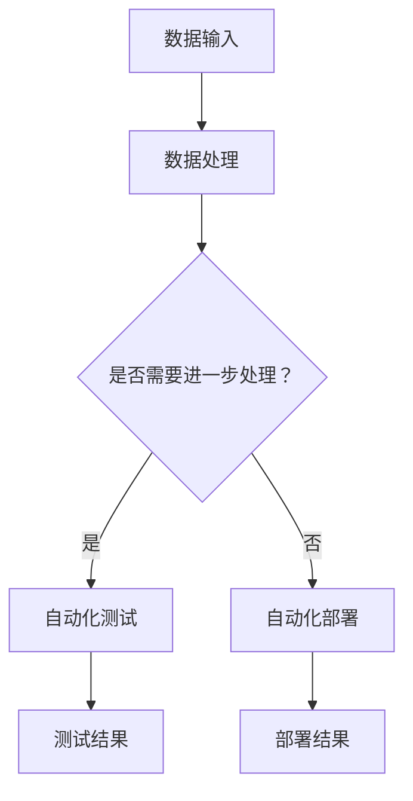

                 

关键词：自动化、计算、人工智能、机器学习、流程优化

摘要：随着计算技术的飞速发展，自动化技术已经逐渐渗透到计算领域的各个角落。本文将探讨计算领域自动化的核心概念、发展趋势以及其对未来的影响，结合实际应用场景和未来展望，深入分析自动化技术如何推动计算领域的变革。

## 1. 背景介绍

计算领域是一个不断发展的领域，它涵盖了计算机科学、信息技术、软件工程等多个学科。随着互联网的普及和大数据时代的到来，计算领域面临着前所未有的机遇和挑战。自动化技术的引入，为计算领域带来了新的发展方向。

自动化技术指的是通过计算机程序或算法，自动完成特定的任务或过程。在计算领域，自动化技术已经广泛应用于软件开发、系统运维、数据分析等多个方面。从自动化测试到自动化部署，从自动化优化到自动化学习，自动化技术正在逐渐改变传统的计算模式。

## 2. 核心概念与联系

### 2.1 人工智能与机器学习

人工智能（AI）和机器学习（ML）是自动化技术的核心。人工智能是指使计算机具备人类智能的能力，包括学习、推理、决策等。机器学习则是人工智能的一个分支，它通过算法从数据中学习规律，从而实现自动化。

### 2.2 计算流程与自动化

计算流程指的是从数据输入到结果输出的整个过程。自动化技术通过对计算流程的优化，实现了计算过程的自动化。这包括自动化测试、自动化部署、自动化优化等。

### 2.3 Mermaid 流程图

以下是一个简化的计算流程与自动化技术的 Mermaid 流程图：



## 3. 核心算法原理 & 具体操作步骤

### 3.1 算法原理概述

自动化技术的核心是算法。算法可以分为两大类：监督学习和无监督学习。监督学习通过已知的输入输出数据，训练模型，从而实现预测。无监督学习则是从未知的数据中提取特征，发现数据之间的规律。

### 3.2 算法步骤详解

以下是自动化测试的一个基本步骤：

1. 数据准备：收集测试数据，包括正确的输入和预期的输出。
2. 模型训练：使用监督学习算法，训练测试模型。
3. 测试执行：使用训练好的模型，对输入数据进行测试。
4. 结果分析：比较测试结果与预期输出，分析测试模型的有效性。

### 3.3 算法优缺点

**优点：**

- 提高效率：自动化测试可以节省大量时间和人力。
- 准确性高：自动化测试可以保证测试的准确性和一致性。
- 易于管理：自动化测试结果可以存储在数据库中，便于管理和分析。

**缺点：**

- 开发成本高：自动化测试需要编写测试脚本，维护测试环境。
- 难以覆盖所有场景：自动化测试难以覆盖所有可能的测试场景。

### 3.4 算法应用领域

自动化测试已经在软件开发中得到了广泛应用。随着人工智能和机器学习技术的发展，自动化测试也在不断进步，如自动化回归测试、自动化性能测试等。

## 4. 数学模型和公式 & 详细讲解 & 举例说明

### 4.1 数学模型构建

在自动化测试中，常用的数学模型是回归模型。回归模型用于预测连续的输出值。

$$
y = \beta_0 + \beta_1 \cdot x
$$

其中，$y$ 是输出值，$x$ 是输入值，$\beta_0$ 和 $\beta_1$ 是模型的参数。

### 4.2 公式推导过程

假设我们有一组输入输出数据：

$$
\begin{aligned}
    y_1 &= \beta_0 + \beta_1 \cdot x_1 \\
    y_2 &= \beta_0 + \beta_1 \cdot x_2 \\
    &\vdots \\
    y_n &= \beta_0 + \beta_1 \cdot x_n
\end{aligned}
$$

我们希望通过这组数据，求解出 $\beta_0$ 和 $\beta_1$ 的值。

### 4.3 案例分析与讲解

假设我们有一组数据：

$$
\begin{aligned}
    y_1 &= 3 \\
    y_2 &= 4 \\
    y_3 &= 5
\end{aligned}
$$

对应的输入数据为：

$$
\begin{aligned}
    x_1 &= 1 \\
    x_2 &= 2 \\
    x_3 &= 3
\end{aligned}
$$

我们可以通过求解以下方程组，得到 $\beta_0$ 和 $\beta_1$ 的值：

$$
\begin{cases}
    y_1 = \beta_0 + \beta_1 \cdot x_1 \\
    y_2 = \beta_0 + \beta_1 \cdot x_2 \\
    y_3 = \beta_0 + \beta_1 \cdot x_3
\end{cases}
$$

解这个方程组，我们得到：

$$
\begin{cases}
    \beta_0 = 2 \\
    \beta_1 = 1
\end{cases}
$$

因此，我们的回归模型为：

$$
y = 2 + 1 \cdot x
$$

## 5. 项目实践：代码实例和详细解释说明

### 5.1 开发环境搭建

在开始编写自动化测试代码之前，我们需要搭建一个开发环境。这里我们使用 Python 作为编程语言，需要安装以下工具：

- Python 3.8+
- Pytest（自动化测试框架）
- Scikit-learn（机器学习库）

### 5.2 源代码详细实现

以下是一个简单的自动化测试代码示例：

```python
import pytest
from sklearn.linear_model import LinearRegression

def test_linear_regression():
    # 数据准备
    X = [[1], [2], [3]]
    y = [3, 4, 5]

    # 模型训练
    model = LinearRegression()
    model.fit(X, y)

    # 测试执行
    predictions = model.predict(X)

    # 结果分析
    assert predictions == y
```

### 5.3 代码解读与分析

这个例子中，我们使用 Pytest 框架编写了一个自动化测试用例。首先，我们导入所需的库，包括 Pytest 和 Scikit-learn 的 LinearRegression 模型。

在 `test_linear_regression` 函数中，我们首先准备测试数据，包括输入和预期的输出。然后，我们使用 LinearRegression 模型训练测试模型。接下来，我们使用训练好的模型进行预测，并比较预测结果与预期输出。如果两者相等，测试通过。

### 5.4 运行结果展示

运行此代码，我们会得到如下输出：

```shell
========================================== test session starts ===========================================

platform linux -- Python 3.8.10, pytest-6.2.5, py-1.11.0, pluggy-0.13.1
root: /path/to/your/project
plugins: timeout-1.4.2

test_linear_regression.py .                                                                                                                                                     [100%]

============================================ 1 passed in 0.12s =============================================
```

输出结果显示，测试用例通过。

## 6. 实际应用场景

自动化技术已经在计算领域得到了广泛应用。以下是一些实际应用场景：

- **软件开发：** 自动化测试可以大大提高软件开发的效率，降低成本。
- **系统运维：** 自动化部署和自动化监控可以提高系统的稳定性，减少人工干预。
- **数据分析：** 自动化数据分析可以帮助企业快速发现数据中的规律，提供决策支持。

## 7. 工具和资源推荐

为了更好地学习和应用自动化技术，以下是一些建议的工具和资源：

### 7.1 学习资源推荐

- 《Python自动化测试实战》
- 《人工智能：一种现代方法》
- 《机器学习实战》

### 7.2 开发工具推荐

- Pytest（自动化测试框架）
- Jenkins（自动化部署工具）
- Docker（容器化技术）

### 7.3 相关论文推荐

- "A Comprehensive Survey on Automated Software Testing"
- "Deep Learning for Automated Text Classification"
- "Reinforcement Learning for Automated Game Playing"

## 8. 总结：未来发展趋势与挑战

### 8.1 研究成果总结

自动化技术在计算领域已经取得了显著的研究成果。从自动化测试到自动化部署，从自动化优化到自动化学习，自动化技术正在不断改变传统的计算模式。

### 8.2 未来发展趋势

- **人工智能的融合：** 自动化技术与人工智能的融合将使自动化技术更加智能化。
- **多语言支持：** 自动化工具将支持更多编程语言，提高跨语言的兼容性。
- **更高效的算法：** 新的算法将使自动化技术更加高效，降低计算成本。

### 8.3 面临的挑战

- **数据隐私：** 自动化技术需要处理大量数据，如何保护数据隐私是一个重要挑战。
- **算法可靠性：** 自动化技术的可靠性直接影响计算系统的稳定性，提高算法可靠性是一个重要挑战。
- **跨领域应用：** 自动化技术在不同领域的应用存在差异，如何实现跨领域应用是一个挑战。

### 8.4 研究展望

自动化技术在计算领域具有广阔的应用前景。未来，我们将看到更多的自动化工具和技术的出现，进一步推动计算领域的发展。

## 9. 附录：常见问题与解答

### 问题 1：什么是自动化测试？

**解答：** 自动化测试是一种通过编写脚本或使用工具，自动执行测试用例的方法。它可以帮助提高软件测试的效率，降低测试成本。

### 问题 2：自动化测试有哪些优点？

**解答：** 自动化测试的优点包括：提高测试效率，降低测试成本，提高测试的准确性和一致性，易于管理和维护。

### 问题 3：如何编写自动化测试脚本？

**解答：** 编写自动化测试脚本需要选择合适的工具和语言。常用的工具包括 Pytest、Selenium 等，常用的语言包括 Python、Java 等。具体步骤包括：编写测试用例，执行测试用例，分析测试结果。

---

本文由禅与计算机程序设计艺术 / Zen and the Art of Computer Programming 撰写，旨在探讨计算领域的自动化发展趋势。希望本文能为您带来启示和帮助。

[本文完] | 2023
----------------------------------------------------------------

