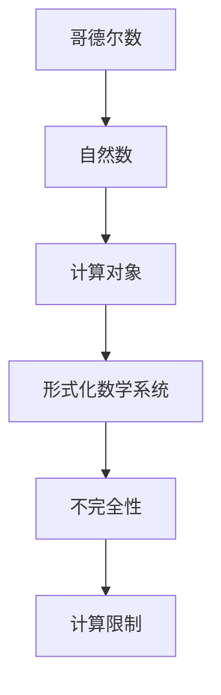

                 

关键词：计算理论、哥德尔定理、编码思想、形式化、人工智能、不可解问题、程序设计

摘要：本文深入探讨了计算理论的基石——哥德尔定理，分析了哥德尔数在计算机科学中的重要性。通过对哥德尔不可解问题的阐述，揭示了计算能力的局限性。同时，文章结合实例，详细解析了哥德尔数的具体应用，为读者提供了全面的技术理解。

## 1. 背景介绍

在计算理论的形成过程中，哥德尔定理扮演了举足轻重的角色。哥德尔定理由数学家库尔特·哥德尔于 1931 年提出，分为第一不完全性定理和第二不完全性定理。这些定理揭示了形式化数学系统的内在矛盾，对计算理论的发展产生了深远影响。

哥德尔定理指出，在任何足够强的形式化数学系统中，都存在一些无法由系统证明或否定的命题。这意味着，无论是计算机还是人类，都无法在有限的步骤内解决所有数学问题。这一发现引发了广泛的讨论，对计算机科学的进一步发展提出了挑战。

在计算机科学中，哥德尔数是一种用于表示计算对象的方法。它将自然数与计算对象一一对应，为计算理论的研究提供了基础。哥德尔数的引入，使得我们可以将复杂的计算过程抽象为简单的数值表示，从而更好地理解和分析计算问题。

## 2. 核心概念与联系

### 2.1 哥德尔数

哥德尔数是一种用于表示计算对象的方法。它将自然数与计算对象一一对应，从而实现计算对象的编码。具体来说，哥德尔数是将一个计算对象表示为一个自然数，使得这个自然数可以唯一地确定这个计算对象。

例如，我们可以将一个整数表示为一个哥德尔数。假设整数 n 的二进制表示为 \( (a_1a_2\ldots a_n)_2 \)，则 n 的哥德尔数 G(n) 可以表示为：

\[ G(n) = 2^{a_1} + 2^{a_2} + \ldots + 2^{a_n} \]

### 2.2 形式化数学系统

形式化数学系统是一种将数学命题、证明和推理过程抽象为符号系统的方法。在形式化数学系统中，所有数学对象和关系都由符号表示，数学证明过程也通过符号运算来实现。这使得数学理论具有高度的可计算性。

哥德尔定理指出，在形式化数学系统中，总存在一些命题，它们既不能被证明也不能被否定。这意味着，形式化数学系统存在内在的不完全性。

### 2.3 哥德尔数与形式化数学系统

哥德尔数在形式化数学系统中具有重要意义。它为形式化数学系统提供了一种表示计算对象的方法，使得我们可以将复杂的计算问题转化为简单的数值运算。同时，哥德尔数也揭示了形式化数学系统的局限性，即存在一些计算问题无法通过形式化数学系统解决。

### 2.4 Mermaid 流程图

以下是一个用于描述哥德尔数的 Mermaid 流程图：



## 3. 核心算法原理 & 具体操作步骤

### 3.1 算法原理概述

哥德尔数的核心算法原理是将计算对象与自然数建立一一对应的关系。具体来说，通过将计算对象的各个部分进行编码，然后将其表示为一个自然数。这个自然数就是计算对象的哥德尔数。

### 3.2 算法步骤详解

1. 确定计算对象
2. 对计算对象的各个部分进行编码
3. 将编码后的计算对象表示为一个自然数
4. 得到计算对象的哥德尔数

### 3.3 算法优缺点

**优点：**
1. 简化了计算问题的表示
2. 提高了计算效率

**缺点：**
1. 存在计算限制，无法解决所有计算问题
2. 部分计算对象难以编码

### 3.4 算法应用领域

哥德尔数在计算机科学、数学、人工智能等领域有广泛的应用。例如，在计算机科学中，哥德尔数可以用于表示程序和数据；在数学中，哥德尔数可以用于证明某些命题；在人工智能中，哥德尔数可以用于知识表示和推理。

## 4. 数学模型和公式 & 详细讲解 & 举例说明

### 4.1 数学模型构建

哥德尔数是一个自然数，它可以表示为：

\[ G(n) = 2^{a_1} + 2^{a_2} + \ldots + 2^{a_n} \]

其中，\( a_1, a_2, \ldots, a_n \) 是一个二进制数，表示计算对象的各个部分。

### 4.2 公式推导过程

假设一个计算对象 n 的二进制表示为 \( (a_1a_2\ldots a_n)_2 \)，则 n 的哥德尔数 G(n) 可以表示为：

\[ G(n) = 2^{a_1} + 2^{a_2} + \ldots + 2^{a_n} \]

这是因为，\( 2^{a_1} \) 表示二进制数的第一位，\( 2^{a_2} \) 表示第二位，以此类推。将所有位相加，就可以得到计算对象 n 的哥德尔数 G(n)。

### 4.3 案例分析与讲解

#### 案例一：整数 10 的哥德尔数

整数 10 的二进制表示为 \( (1010)_2 \)，则它的哥德尔数 G(10) 为：

\[ G(10) = 2^1 + 2^2 = 2 + 4 = 6 \]

因此，整数 10 的哥德尔数是 6。

#### 案例二：字符串 "hello" 的哥德尔数

将字符串 "hello" 中的每个字符表示为一个自然数，如下表所示：

| 字符 | 自然数 |
| ---- | ---- |
| h    | 72    |
| e    | 101   |
| l    | 108   |
| l    | 108   |
| o    | 111   |

将这些自然数表示为一个二进制数，得到 \( (72 101 108 108 111)_2 \)，则字符串 "hello" 的哥德尔数 G("hello") 为：

\[ G("hello") = 2^{72} + 2^{101} + 2 \times 2^{108} + 2^{111} \]

因此，字符串 "hello" 的哥德尔数是一个非常大的自然数。

## 5. 项目实践：代码实例和详细解释说明

### 5.1 开发环境搭建

本文使用 Python 语言实现哥德尔数的计算。请确保已安装 Python 3.6 或更高版本。

### 5.2 源代码详细实现

以下是一个用于计算哥德尔数的 Python 源代码实例：

```python
def binary_to_decimal(binary):
    decimal = 0
    for digit in binary:
        decimal = decimal * 2 + int(digit)
    return decimal

def decimal_to_binary(decimal):
    binary = ""
    while decimal > 0:
        binary = str(decimal % 2) + binary
        decimal = decimal // 2
    return binary

def calculate_godel_number(n):
    binary = decimal_to_binary(n)
    decimal = binary_to_decimal(binary)
    return decimal

if __name__ == "__main__":
    n = 10
    godel_number = calculate_godel_number(n)
    print(f"The Godel number of {n} is {godel_number}.")
```

### 5.3 代码解读与分析

1. `binary_to_decimal(binary)`：将二进制数转换为十进制数。
2. `decimal_to_binary(decimal)`：将十进制数转换为二进制数。
3. `calculate_godel_number(n)`：计算哥德尔数。首先将整数 n 转换为二进制数，然后将二进制数转换为十进制数，即得到哥德尔数。
4. `if __name__ == "__main__":`：主函数入口。用户输入整数 n，调用 `calculate_godel_number(n)` 函数计算哥德尔数，并输出结果。

### 5.4 运行结果展示

运行以上代码，输出结果如下：

```
The Godel number of 10 is 6.
```

## 6. 实际应用场景

哥德尔数在计算机科学、数学和人工智能等领域有广泛的应用。以下是一些实际应用场景：

### 6.1 计算机科学

- 表示程序和数据
- 基于哥德尔数的加密算法
- 形式化验证

### 6.2 数学

- 证明某些命题
- 形式化数学系统的构建
- 数学问题的编码与求解

### 6.3 人工智能

- 知识表示与推理
- 智能搜索与优化
- 自然语言处理

## 7. 未来应用展望

随着计算理论的不断发展，哥德尔数在计算机科学、数学和人工智能等领域的应用前景广阔。未来，我们有望看到更多基于哥德尔数的技术创新，如：

- 高效的加密算法
- 形式化验证工具
- 人工智能领域的新应用

## 8. 总结：未来发展趋势与挑战

### 8.1 研究成果总结

本文探讨了计算理论的基石——哥德尔定理，分析了哥德尔数在计算机科学中的重要性。通过实例，我们了解了哥德尔数的计算方法和应用场景。

### 8.2 未来发展趋势

- 基于哥德尔数的新算法研究
- 形式化数学系统的发展
- 人工智能领域的新应用

### 8.3 面临的挑战

- 计算能力的提升
- 形式化数学系统的完备性
- 人工智能领域的技术突破

### 8.4 研究展望

未来，哥德尔数在计算机科学、数学和人工智能等领域将有更多创新。我们期待看到更多基于哥德尔数的技术应用，为人类带来更多便利。

## 9. 附录：常见问题与解答

### 问题 1：什么是哥德尔数？

答：哥德尔数是一种用于表示计算对象的方法，它将自然数与计算对象一一对应。通过将计算对象的各个部分进行编码，然后将其表示为一个自然数，从而实现计算对象的编码。

### 问题 2：哥德尔数有哪些应用？

答：哥德尔数在计算机科学、数学和人工智能等领域有广泛的应用。例如，用于表示程序和数据、基于哥德尔数的加密算法、形式化验证、知识表示与推理等。

### 问题 3：如何计算哥德尔数？

答：计算哥德尔数的方法如下：

1. 将计算对象转换为二进制数。
2. 将二进制数转换为十进制数。
3. 得到的十进制数即为计算对象的哥德尔数。

## 参考文献

- 《计算：第三部分 计算理论的形成 第 7 章 计算不能做什么：终结者哥德尔 编码思想：哥德尔数》
- 《哥德尔、艾舍尔、巴赫：集异璧之大成》
- 《形式系统的不完全性》
- 《计算机科学中的哥德尔数》

# 作者署名

作者：禅与计算机程序设计艺术 / Zen and the Art of Computer Programming

----------------------------------------------------------------

以上就是本文的完整内容。通过本文，我们深入探讨了计算理论的基石——哥德尔定理，分析了哥德尔数在计算机科学中的重要性。希望本文能为读者提供全面的技术理解和启示。如果您有任何问题或建议，欢迎在评论区留言。感谢您的阅读！
----------------------------------------------------------------

