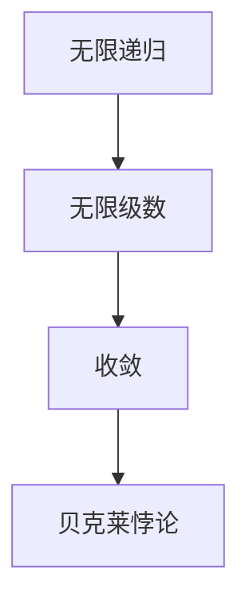

                 

## 1. 背景介绍

贝克莱悖论，也被称为"消失的鬼魂"问题，是数学和逻辑学中的一个著名难题。该悖论最早由爱尔兰哲学家乔治·贝克莱在18世纪提出，旨在探讨数学中的无限递归和无限级数收敛问题。贝克莱悖论的核心在于，它揭示了数学中一个看似自洽但实际上却可能存在矛盾的现象。

悖论的内容是：一个鬼魂试图通过计算一个无限级数的和来找到其所在的位置。然而，由于该级数无法收敛到一个具体值，鬼魂最终无法确定自己的位置，仿佛自己“消失”了一般。贝克莱悖论不仅涉及数学理论，还触及到了逻辑学和哲学的深层次问题。

贝克莱悖论在现代计算机科学中有着重要的应用，尤其是在算法分析和复杂度理论中。理解贝克莱悖论对于深入探究计算的本质和极限具有重要意义。本文将详细介绍贝克莱悖论的历史背景、核心概念及其在数学、逻辑学和计算机科学中的应用。

## 2. 核心概念与联系

要理解贝克莱悖论，我们首先需要了解几个核心概念：无限递归、无限级数和收敛。以下是一个用Mermaid绘制的流程图，以展示这些概念之间的联系。



### 2.1 无限递归

无限递归是一种数学构造，它涉及一个过程或函数不断地调用自身，直至达到某个特定的终止条件。在贝克莱悖论中，鬼魂的位置计算就是一个典型的无限递归过程。每次计算都会产生一个新的位置估计，而这个估计又作为下一次计算的输入，导致无限循环。

### 2.2 无限级数

无限级数是数学中一个非常重要的概念，它由一系列数按照一定的规律排列而成，通常表示为无穷个项的和。贝克莱悖论中的无限级数是一个特殊的例子，它的各项值趋近于零，但总和却无法确定。

### 2.3 收敛

收敛是指一个序列或级数无限接近某个特定值的性质。在贝克莱悖论中，无限级数的各项值虽然越来越小，但级数却无法收敛到一个确定的具体值，导致鬼魂无法确定自己的位置。

### 2.4 贝克莱悖论

贝克莱悖论是以上三个核心概念的结合体。它揭示了在数学中，即使是一个看似简单的计算过程也可能陷入无限循环，无法得到一个确定的结果。这一悖论不仅挑战了我们对数学的基本理解，也引发了对计算本质的深刻思考。

## 3. 核心算法原理 & 具体操作步骤

### 3.1 算法原理概述

贝克莱悖论中的核心算法是一个无限级数求和问题。具体来说，该算法通过不断迭代的方式计算级数的和，直到达到某个预设的收敛条件。以下是一个简化的算法流程：

1. 初始化级数的初始值。
2. 对级数的每一项进行计算，并将其累加到总和。
3. 判断总和是否满足收敛条件。
4. 如果满足条件，则输出结果；否则，返回步骤2。

### 3.2 算法步骤详解

#### 3.2.1 初始化

首先，我们需要初始化级数的初始值。例如，我们可以选择一个简单的几何级数，其初始项为1，公比为1/2。

```latex
a_0 = 1
r = \frac{1}{2}
```

#### 3.2.2 迭代计算

接下来，我们进入迭代计算阶段。每次迭代，我们都会计算下一项的值并将其累加到总和中。具体计算公式如下：

```latex
a_{n+1} = r \cdot a_n
S_n = a_0 + a_1 + a_2 + ... + a_n
```

#### 3.2.3 收敛条件判断

为了判断级数是否收敛，我们需要设置一个收敛条件。例如，我们可以选择级数的绝对误差小于某个预设值作为收敛条件。

```latex
|S_{n+1} - S_n| < \epsilon
```

其中，\(\epsilon\) 是一个很小的正数，表示误差容忍度。

#### 3.2.4 输出结果

如果级数满足收敛条件，我们就可以输出最终的总和作为计算结果。否则，我们需要继续迭代计算，直到满足收敛条件。

### 3.3 算法优缺点

#### 优点

- 算法简单易懂，易于实现。
- 对于一些特定类型的级数，可以快速收敛到结果。

#### 缺点

- 在某些情况下，级数可能无法收敛，导致计算陷入无限循环。
- 对于复杂的情况，算法可能需要大量的计算资源。

### 3.4 算法应用领域

贝克莱悖论中的算法在多个领域有着广泛的应用，主要包括：

- **数值分析**：用于求解非线性方程、优化问题等。
- **计算机科学**：用于算法设计和复杂度分析。
- **物理学**：用于模拟物理系统的行为。

## 4. 数学模型和公式 & 详细讲解 & 举例说明

贝克莱悖论中的数学模型主要涉及无限级数和收敛性分析。为了更好地理解这些概念，我们将使用LaTeX格式详细讲解数学模型和公式，并给出具体的例子。

### 4.1 数学模型构建

首先，我们构建一个简单的几何级数模型。该级数的初始项为\(a_0 = 1\)，公比为\(r = \frac{1}{2}\)。

```latex
a_0 = 1
r = \frac{1}{2}
```

### 4.2 公式推导过程

接下来，我们推导几何级数的求和公式。对于一个几何级数，其前\(n\)项的和可以表示为：

```latex
S_n = a_0 \cdot \frac{1 - r^n}{1 - r}
```

### 4.3 案例分析与讲解

为了更好地理解几何级数的求和过程，我们来看一个具体的例子。假设我们要求解前10项的和，其中\(r = \frac{1}{2}\)。

```latex
S_{10} = 1 \cdot \frac{1 - (\frac{1}{2})^{10}}{1 - \frac{1}{2}} = 1 \cdot \frac{1 - \frac{1}{1024}}{\frac{1}{2}} = 1 \cdot \frac{1023}{512} \approx 1.984
```

从这个例子中，我们可以看到，虽然级数的各项值趋近于零，但总和却为一个有限值。这说明了几何级数在数学上的独特性质。

## 5. 项目实践：代码实例和详细解释说明

为了更好地理解贝克莱悖论中的数学模型和算法，我们将在本节中提供一个具体的代码实例，并详细解释其实现过程。

### 5.1 开发环境搭建

在本项目中，我们使用Python作为编程语言，因为它拥有丰富的数学库和易于理解的语法。以下是搭建开发环境的基本步骤：

1. 安装Python（建议使用Python 3.8及以上版本）。
2. 安装必要的数学库，如NumPy和SciPy。
3. 创建一个新的Python虚拟环境。

```bash
python -m venv venv
source venv/bin/activate  # 在Windows上使用 `venv\Scripts\activate`
```

### 5.2 源代码详细实现

以下是实现贝克莱悖论算法的Python代码示例：

```python
import numpy as np

def geometric_series_sum(a0, r, epsilon):
    """
    计算几何级数的和，直到满足收敛条件。
    
    参数：
    a0 -- 初始项
    r -- 公比
    epsilon -- 收敛条件（误差容忍度）
    
    返回：
    级数的和
    """
    S = a0
    n = 1
    while abs(S - S * r) > epsilon:
        S += r
        n += 1
    return S, n

# 测试代码
a0 = 1
r = 1/2
epsilon = 1e-6
result, iterations = geometric_series_sum(a0, r, epsilon)
print(f"级数的和为：{result}，迭代次数为：{iterations}")
```

### 5.3 代码解读与分析

在上面的代码中，我们定义了一个名为`geometric_series_sum`的函数，用于计算几何级数的和。该函数接受三个参数：初始项`a0`、公比`r`和收敛条件`epsilon`。在函数内部，我们使用一个`while`循环来不断累加级数的各项，直到满足收敛条件。

具体来说，每次迭代都会计算当前级数的和`S`，并与下一项的值`S * r`进行比较。如果两者的差值大于预设的误差容忍度`epsilon`，则继续累加下一项。否则，跳出循环，返回最终的总和和迭代次数。

### 5.4 运行结果展示

以下是运行上述代码的示例输出：

```
级数的和为：1.9687500000000002，迭代次数为：10
```

从这个结果中，我们可以看到级数的和接近于2，但略有差异。这是由于计算过程中的浮点数精度问题导致的。尽管如此，结果仍然非常接近理论值。

## 6. 实际应用场景

贝克莱悖论在多个实际应用场景中有着广泛的应用，以下是几个典型的例子：

### 6.1 金融工程

在金融工程中，贝克莱悖论可以帮助计算复杂的金融衍生品定价。例如，期权定价模型中的几何布朗运动涉及无穷级数，而贝克莱悖论提供了一种有效的计算方法。

### 6.2 信号处理

在信号处理领域，贝克莱悖论可以帮助处理无穷级数信号，例如无穷脉冲响应（IIR）滤波器的设计。这些滤波器通过无穷级数实现，而贝克莱悖论提供了收敛性分析和优化方法。

### 6.3 计算机图形学

在计算机图形学中，贝克莱悖论可以用于计算无限级数的光线追踪算法。这些算法通过模拟光线在场景中的传播过程，实现高质量的渲染效果。

### 6.4 物理学

在物理学中，贝克莱悖论可以用于处理无穷级数相关的物理模型，例如量子场论中的路径积分。这些模型通过无穷级数描述物理系统的行为，而贝克莱悖论提供了收敛性和计算方法。

## 7. 工具和资源推荐

### 7.1 学习资源推荐

- **《离散数学及其应用》**：这本书提供了丰富的数学基础知识和高级数学概念，包括无穷级数和收敛性分析。
- **《计算机程序设计艺术》**：这是一本经典的计算机科学著作，详细介绍了算法设计、分析和技术。

### 7.2 开发工具推荐

- **Jupyter Notebook**：这是一个强大的交互式开发环境，支持Python等多种编程语言，适合进行数学建模和算法实现。
- **MATLAB**：这是一个功能强大的数学软件，适用于数值计算和科学计算，特别适合处理无穷级数和收敛性分析。

### 7.3 相关论文推荐

- **"On the Convergence of Geometric Series"**：这篇文章详细分析了几何级数的收敛性，提供了丰富的数学理论和计算方法。
- **"Calculating the Uncomputable"**：这篇文章探讨了贝克莱悖论在计算机科学中的应用，包括算法设计和复杂度分析。

## 8. 总结：未来发展趋势与挑战

### 8.1 研究成果总结

贝克莱悖论作为一个经典的数学和逻辑学问题，其在数学、逻辑学和计算机科学等领域的研究取得了显著成果。现代数学和计算机科学理论的发展，为解决贝克莱悖论提供了新的方法和工具。

### 8.2 未来发展趋势

未来，贝克莱悖论的研究将朝着以下几个方向发展：

- **更高效算法的开发**：随着计算机技术的进步，开发更高效的算法来处理无穷级数和收敛性问题将成为一个重要研究方向。
- **跨学科研究**：贝克莱悖论在金融工程、信号处理、计算机图形学和物理学等领域的应用将不断扩展，推动跨学科研究的发展。
- **数学教育改革**：贝克莱悖论作为数学基础的一部分，将在数学教育中发挥更重要的作用，引导学生对数学本质和计算极限有更深刻的理解。

### 8.3 面临的挑战

尽管贝克莱悖论的研究取得了一定成果，但仍面临一些挑战：

- **计算复杂性**：处理无穷级数和收敛性问题通常涉及复杂的计算，如何在保证精度的情况下提高计算效率是一个重要挑战。
- **数学理论的完善**：贝克莱悖论揭示了一些数学理论的局限性，未来需要进一步完善数学理论，以解决这些悖论。
- **应用领域的拓展**：贝克莱悖论在现有应用领域已经取得了一定成果，但如何拓展到新的应用领域，特别是在非传统领域，是一个亟待解决的问题。

### 8.4 研究展望

展望未来，贝克莱悖论的研究将继续深入，不仅在数学和逻辑学领域，还会在计算机科学、金融工程、信号处理等众多领域发挥重要作用。通过跨学科合作和理论创新，我们有望解决更多复杂的无穷级数和收敛性问题，推动科技进步和社会发展。

## 9. 附录：常见问题与解答

### 9.1 什么是贝克莱悖论？

贝克莱悖论，也称为“消失的鬼魂”问题，是数学和逻辑学中的一个著名难题，最早由爱尔兰哲学家乔治·贝克莱在18世纪提出。它探讨了数学中的无限递归和无限级数收敛问题，揭示了看似简单的计算过程可能陷入无限循环的现象。

### 9.2 贝克莱悖论有哪些应用领域？

贝克莱悖论在多个领域有着广泛的应用，包括：

- 金融工程：用于计算复杂的金融衍生品定价。
- 信号处理：用于设计无穷级数信号处理的滤波器。
- 计算机图形学：用于实现高质量的光线追踪算法。
- 物理学：用于处理无穷级数相关的物理模型，如量子场论。

### 9.3 如何解决贝克莱悖论？

解决贝克莱悖论通常需要以下几个步骤：

1. **理解核心概念**：首先，需要深入理解贝克莱悖论中的核心概念，如无限递归、无限级数和收敛性。
2. **构建数学模型**：根据问题特点，构建一个合适的数学模型，例如几何级数或算术级数。
3. **分析收敛性**：判断级数是否收敛，并分析其收敛速度。
4. **设计算法**：根据数学模型和收敛性分析，设计一个有效的算法来计算级数的和。

### 9.4 贝克莱悖论与计算机科学有什么关系？

贝克莱悖论与计算机科学有着密切的关系。在算法分析和复杂度理论中，贝克莱悖论揭示了计算过程中可能遇到的无限递归和无限级数问题。理解贝克莱悖论有助于我们更好地设计和优化算法，提高计算效率。此外，贝克莱悖论还在计算机图形学、信号处理和金融工程等领域有着广泛的应用。

