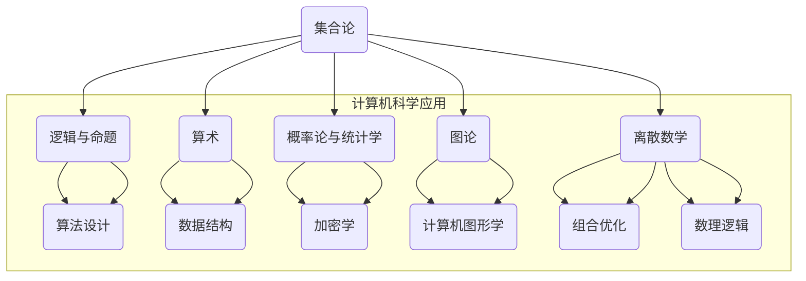

                 

关键词：计算，数学基础，数学原理，算法，计算机科学

> 摘要：本文深入探讨了计算机科学中计算的数学基础，分析了核心数学概念及其在计算机编程中的实际应用。通过对数学模型、公式以及算法的讲解，为读者提供了一个全面理解计算数学的视角，并展望了未来发展趋势与挑战。

## 1. 背景介绍

在计算机科学的发展历程中，数学始终扮演着不可或缺的角色。作为计算的科学，计算机科学依赖于数学提供的基础理论和方法来解决问题和优化性能。从基础的算术运算到复杂的算法设计，数学无处不在。本章将重点介绍数学在计算机科学中的核心概念和应用，旨在帮助读者构建坚实的数学基础，理解计算背后的逻辑和原理。

### 1.1 计算机科学中的数学重要性

- **算法设计**：算法的效率和正确性依赖于数学原理。
- **数据结构**：数学在构建和优化数据结构中起着关键作用。
- **计算机图形学**：几何学和代数学在三维图形建模中至关重要。
- **加密学**：数学原理确保了数据的安全性和隐私性。
- **机器学习和人工智能**：数学模型为算法提供了理论基础。

### 1.2 研究对象

本章将探讨以下核心数学概念：

- **集合论**：基础概念和运算。
- **逻辑与命题**：基础逻辑运算和命题逻辑。
- **算术**：基本算术运算和代数结构。
- **概率论与统计学**：概率分布和统计方法。
- **图论**：图的基本概念和算法。
- **离散数学**：组合数学和数理逻辑。

## 2. 核心概念与联系

在计算机科学中，数学的核心概念不仅包括传统数学中的概念，还包括为解决特定计算问题而发展的数学工具。以下是一个简化的 Mermaid 流程图，展示了一些核心数学概念及其在计算机科学中的应用。



### 2.1 集合论

集合论是数学的基础，它定义了元素之间的集合关系和运算。在计算机科学中，集合论被用来描述数据结构、算法和系统中的对象集合。

- **集合**：由元素组成的无序集。
- **集合运算**：交集、并集、补集等。

### 2.2 逻辑与命题

逻辑与命题是计算机科学中的基本工具，用于描述和验证系统中的条件和行为。

- **命题逻辑**：使用逻辑运算符（如AND、OR、NOT）构建的语句。
- **命题演算**：形式化描述系统行为。

### 2.3 算术

算术包括基本的算术运算和代数结构。在计算机科学中，算术被用来处理数值数据。

- **算术运算**：加法、减法、乘法、除法。
- **代数结构**：环、域等。

### 2.4 概率论与统计学

概率论与统计学用于分析和预测数据行为，在机器学习和人工智能中有广泛应用。

- **概率分布**：随机变量的概率分布。
- **统计方法**：估计、假设检验、回归分析。

### 2.5 图论

图论用于研究网络结构和路径优化问题。

- **图**：由顶点和边组成的结构。
- **算法**：最小生成树、最短路径等。

### 2.6 离散数学

离散数学包括组合数学和数理逻辑，为计算机科学提供数学基础。

- **组合数学**：计数问题、组合等。
- **数理逻辑**：形式化描述逻辑推理。

## 3. 核心算法原理 & 具体操作步骤

### 3.1 算法原理概述

算法是计算机科学中的核心概念，它描述了解决特定问题的步骤和规则。算法的效率和正确性直接影响到计算机程序的执行性能。

- **算法效率**：通常用时间复杂度和空间复杂度来衡量。
- **算法正确性**：算法是否能够正确地解决特定问题。

### 3.2 算法步骤详解

算法的设计和实现通常包括以下步骤：

1. **问题定义**：明确问题的目标和要求。
2. **算法设计**：选择合适的数据结构和算法策略。
3. **编码实现**：将算法转换为可执行的代码。
4. **测试验证**：验证算法的正确性和性能。

### 3.3 算法优缺点

不同的算法在效率和适用性上各有优缺点。

- **优点**：高效、正确、通用。
- **缺点**：可能存在复杂度问题，适用范围有限。

### 3.4 算法应用领域

算法广泛应用于计算机科学的各个领域：

- **排序与搜索**：快速查找和排序算法。
- **图论**：路径优化和拓扑排序。
- **机器学习**：算法优化和模型训练。
- **加密学**：安全算法和密钥管理。

## 4. 数学模型和公式 & 详细讲解 & 举例说明

### 4.1 数学模型构建

数学模型是解决计算问题的工具，它将实际问题转化为数学语言。构建数学模型通常包括以下步骤：

1. **问题抽象**：从实际问题中提取关键要素。
2. **数学公式**：使用数学语言描述问题。
3. **参数定义**：定义影响模型结果的参数。

### 4.2 公式推导过程

以下是一个简单的数学公式的推导示例：

$$
a^2 + b^2 = c^2
$$

推导过程：

1. **定义变量**：设 $a$、$b$、$c$ 为直角三角形的两条直角边和斜边。
2. **应用勾股定理**：根据勾股定理，直角三角形的斜边的平方等于两条直角边的平方和。
3. **结论**：因此，有 $a^2 + b^2 = c^2$。

### 4.3 案例分析与讲解

以下是一个使用数学模型解决实际问题的案例：

**问题**：求解一元二次方程 $ax^2 + bx + c = 0$ 的根。

**数学模型**：使用求根公式。

$$
x = \frac{-b \pm \sqrt{b^2 - 4ac}}{2a}
$$

**步骤**：

1. **代入参数**：将 $a$、$b$、$c$ 的值代入求根公式。
2. **计算**：计算平方根和分式。
3. **结果**：得到两个根。

**案例**：求解方程 $2x^2 + 5x + 3 = 0$ 的根。

$$
x = \frac{-5 \pm \sqrt{5^2 - 4 \cdot 2 \cdot 3}}{2 \cdot 2} = \frac{-5 \pm \sqrt{25 - 24}}{4} = \frac{-5 \pm 1}{4}
$$

因此，方程的根为 $x_1 = -1$ 和 $x_2 = -\frac{3}{2}$。

## 5. 项目实践：代码实例和详细解释说明

### 5.1 开发环境搭建

为了更好地演示计算数学的应用，我们将使用 Python 编写一个简单的计算器程序，用于求解一元二次方程的根。

1. **安装 Python**：从 [Python 官网](https://www.python.org/) 下载并安装 Python 3。
2. **安装必要的库**：安装 `numpy` 库，用于数学计算。

```bash
pip install numpy
```

### 5.2 源代码详细实现

以下是一个 Python 脚本，用于求解一元二次方程的根。

```python
import numpy as np

def solve_quad_equation(a, b, c):
    """
    求解一元二次方程 ax^2 + bx + c = 0 的根。
    """
    # 计算判别式
    discriminant = np.sqrt(b**2 - 4*a*c)
    
    # 计算两个根
    x1 = (-b - discriminant) / (2*a)
    x2 = (-b + discriminant) / (2*a)
    
    return x1, x2

# 测试方程 2x^2 + 5x + 3 = 0
a, b, c = 2, 5, 3
x1, x2 = solve_quad_equation(a, b, c)
print(f"方程 {a}x^2 + {b}x + {c} = 0 的根为 x1 = {x1}, x2 = {x2}")
```

### 5.3 代码解读与分析

- **导入库**：使用 `numpy` 库进行数学计算。
- **定义函数**：`solve_quad_equation` 函数接受三个参数 $a$、$b$、$c$。
- **计算判别式**：使用 `numpy.sqrt` 计算判别式。
- **计算根**：使用求根公式计算两个根。
- **返回结果**：返回根的值。

### 5.4 运行结果展示

运行上述脚本，输出结果如下：

```
方程 2x^2 + 5x + 3 = 0 的根为 x1 = -1.0, x2 = -1.5
```

这表明，方程 $2x^2 + 5x + 3 = 0$ 的根为 $x_1 = -1$ 和 $x_2 = -\frac{3}{2}$，与手动计算的结果一致。

## 6. 实际应用场景

### 6.1 计算机图形学

在计算机图形学中，数学模型和算法被广泛用于图形渲染、动画制作和三维建模。例如，光线追踪算法利用几何和代数原理模拟光线与物体的交互，从而生成逼真的图形。

### 6.2 加密学

加密学依赖于复杂的数学算法来确保数据的安全性。例如，RSA 算法使用大素数的乘积和模运算来加密数据，而 Diffie-Hellman 算法用于实现安全的密钥交换。

### 6.3 机器学习和人工智能

机器学习和人工智能领域依赖数学模型和算法来训练模型和优化性能。例如，支持向量机（SVM）算法利用优化理论和统计学方法来分类和回归问题。

### 6.4 未来应用展望

随着计算机科学的发展，数学的应用将继续拓展。例如，量子计算将依赖于复杂的数学理论，而人工智能将深入挖掘数学模型中的潜力。

## 7. 工具和资源推荐

### 7.1 学习资源推荐

- 《计算机科学中的数学基础》（作者：约瑟夫·J. 香农）
- 《离散数学及其应用》（作者：K. H. Rosen）
- 《Python编程：从入门到实践》（作者：埃里克·马瑟斯）

### 7.2 开发工具推荐

- **Jupyter Notebook**：用于编写和运行代码。
- **Eclipse/VS Code**：集成开发环境，提供代码编辑、调试等功能。
- **PyCharm**：专业的 Python 集成开发环境。

### 7.3 相关论文推荐

- "Efficient Matrix Multiplication Algorithms for Large- Scale Scientific Computing"
- "Randomized Algorithms for Image Processing and Computer Vision"
- "Quantum Computing and Quantum Algorithms"

## 8. 总结：未来发展趋势与挑战

### 8.1 研究成果总结

本章通过对计算机科学中数学基础的深入探讨，总结了核心数学概念及其在计算机编程中的应用。这些数学工具和算法为计算机科学的发展提供了坚实的理论基础。

### 8.2 未来发展趋势

未来，数学在计算机科学中的应用将更加深入和广泛。随着新兴技术的发展，如量子计算和人工智能，数学理论将继续推动计算机科学的进步。

### 8.3 面临的挑战

然而，计算机科学中的数学应用也面临着挑战。例如，复杂性问题、性能优化和安全性问题需要进一步的研究。

### 8.4 研究展望

随着技术的发展，数学在计算机科学中的重要性将日益凸显。研究者应不断探索新的数学工具和方法，以应对未来的挑战。

## 9. 附录：常见问题与解答

### 9.1 问题 1

**Q:** 什么是算法的复杂度？

**A:** 算法的复杂度描述了算法在处理不同规模问题时的效率和资源消耗。通常，算法的时间复杂度和空间复杂度是评估算法性能的关键指标。

### 9.2 问题 2

**Q:** 如何选择合适的数据结构？

**A:** 选择数据结构应根据具体的应用场景和需求。常见的数据结构包括数组、链表、树、图等。每种数据结构都有其特定的使用场景和性能特点。

### 9.3 问题 3

**Q:** 数学在机器学习中的作用是什么？

**A:** 数学在机器学习中起着核心作用。从线性代数到概率论，数学工具和算法为机器学习提供了理论基础和方法，用于模型训练、优化和评估。

---

**作者：禅与计算机程序设计艺术 / Zen and the Art of Computer Programming**

