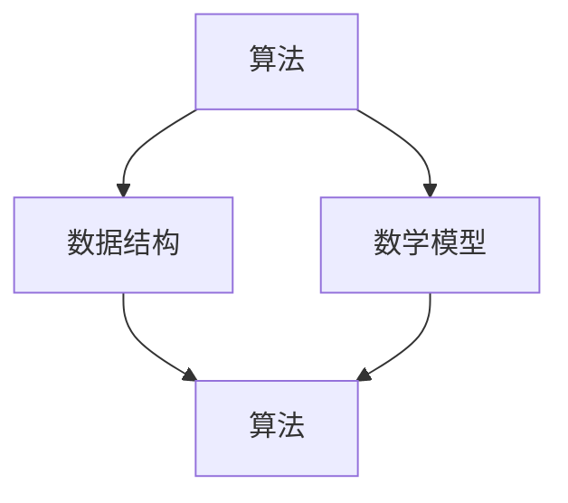

                 

关键词：计算、数学基础、算法、公式、项目实践、应用场景、工具推荐、未来展望

## 摘要

本文作为《计算：第二部分 计算的数学基础》的深入探讨，旨在从数学的角度解析计算的本质。我们将探讨计算中的核心概念，包括算法原理、数学模型及其应用领域。本文将采用清晰的技术语言，详细解析数学模型和公式的构建与推导，并借助实例代码进行实际操作讲解。此外，文章还将介绍计算在不同领域中的应用，以及相关工具和资源的推荐。通过本文的阅读，读者将全面了解计算的数学基础，并对其在未来的发展与应用有一个清晰的认识。

### 1. 背景介绍

计算作为信息技术的基础，贯穿了现代科技的方方面面。从简单的四则运算到复杂的图计算，计算已经深入到我们生活的每一个角落。而计算的数学基础则是理解和应用计算技术的关键。数学作为一种精确的语言，提供了描述、分析和解决问题的工具，使得计算过程更加严谨和高效。

在计算机科学中，计算的基本概念包括算法、数据结构、数学模型等。算法是解决问题的步骤集合，是计算的核心。数据结构则是组织和管理数据的方式，直接影响算法的性能。数学模型则是用数学语言描述现实问题，为算法设计提供理论基础。这些概念相互关联，共同构成了计算的基本框架。

随着计算技术的不断发展，计算的应用场景也越来越广泛。从基础的数值计算、图形渲染，到复杂的机器学习、人工智能，计算在科学研究、工业制造、娱乐休闲等领域都发挥着重要作用。本文将从数学的角度出发，深入探讨这些核心概念及其应用，帮助读者更好地理解计算的数学基础。

### 2. 核心概念与联系

为了全面理解计算的数学基础，我们需要首先明确几个核心概念，并探讨它们之间的相互关系。

#### 2.1 算法

算法（Algorithm）是计算机科学中的核心概念之一。它是一系列明确的步骤，用于解决特定问题。算法可以是简单的，如排序、查找，也可以是非常复杂的，如深度学习、图论算法。算法的效率直接决定了计算的速度和资源消耗。

#### 2.2 数据结构

数据结构（Data Structure）是用于组织和存储数据的方式。常见的数据结构包括数组、链表、栈、队列、树、图等。数据结构的选择对算法的性能有直接影响。例如，使用哈希表进行快速查找，使用二叉搜索树进行排序。

#### 2.3 数学模型

数学模型（Mathematical Model）是用数学语言描述现实问题的一种方式。它通过定义变量、参数和方程，将复杂的问题转化为数学问题，便于分析和求解。常见的数学模型包括线性模型、非线性模型、概率模型等。

#### 2.4 相互关系

算法、数据结构和数学模型之间存在着密切的相互关系。算法通常需要依赖特定的数据结构来高效地执行，而数学模型则为算法提供了理论基础。例如，在排序算法中，数组是常用的数据结构，而数学模型（如比较次数、时间复杂度）则用于分析算法的性能。

以下是上述核心概念的 Mermaid 流程图，展示了它们之间的相互关系：



图中的箭头表示依赖关系，即算法通常依赖于数据结构来实现，同时数学模型为算法提供了理论支持。

通过上述分析，我们可以看到，算法、数据结构和数学模型是计算中不可或缺的组成部分，它们共同构成了计算的基本框架。在接下来的章节中，我们将进一步深入探讨这些核心概念的具体内容和应用。

### 3. 核心算法原理 & 具体操作步骤

在理解了计算中的核心概念之后，我们将进一步探讨一些重要的算法原理及其具体操作步骤。这些算法在计算领域中有着广泛的应用，并在不同领域展示了其独特的优势。

#### 3.1 算法原理概述

以下是一些常见的算法及其原理概述：

1. **排序算法**：排序算法是一种将数据元素按照特定顺序排列的算法。常见的排序算法包括冒泡排序、选择排序、插入排序、快速排序等。每种排序算法都有其独特的原理和操作步骤。

2. **查找算法**：查找算法用于在数据集合中找到特定元素。常见的查找算法包括线性查找、二分查找、哈希查找等。这些算法通过不同的方法来提高查找的效率和准确性。

3. **图算法**：图算法用于解决与图相关的问题，如图的遍历、最短路径问题、最小生成树问题等。常见的图算法包括深度优先搜索（DFS）、广度优先搜索（BFS）、迪杰斯特拉算法（Dijkstra's algorithm）等。

4. **动态规划**：动态规划是一种用于解决最优子结构问题的算法。它通过将问题分解为较小的子问题，并存储子问题的解，来避免重复计算。动态规划广泛应用于背包问题、最长公共子序列问题等。

#### 3.2 算法步骤详解

以下是每个算法的具体步骤详解：

1. **冒泡排序**：

   - 原理：通过反复交换相邻的未排序元素，将最大（或最小）的元素“冒泡”到数组的末尾。
   - 操作步骤：
     1. 从数组的第一个元素开始，比较相邻的两个元素。
     2. 如果第一个元素大于第二个元素，交换它们。
     3. 继续对下一个元素进行同样的操作，直到当前元素是已排序部分的最后一个元素。
     4. 重复上述步骤，直到整个数组排序完成。

2. **二分查找**：

   - 原理：在有序数组中，通过不断将查找范围缩小一半，来找到特定元素。
   - 操作步骤：
     1. 确定数组的中间位置。
     2. 如果中间位置的元素等于目标值，查找成功。
     3. 如果中间位置的元素大于目标值，则在数组的左半部分继续查找。
     4. 如果中间位置的元素小于目标值，则在数组的右半部分继续查找。
     5. 重复上述步骤，直到找到目标元素或查找范围缩小为0。

3. **深度优先搜索（DFS）**：

   - 原理：从根节点开始，沿着一条路径一直走到最远节点，然后回溯到上一个节点，再继续探索下一条路径。
   - 操作步骤：
     1. 访问当前节点，并将其标记为已访问。
     2. 如果当前节点有未访问的邻居节点，选择一个邻居节点进行递归调用。
     3. 如果当前节点的所有邻居节点都已访问，回溯到上一个节点，继续访问下一个邻居节点。
     4. 重复上述步骤，直到找到目标节点或所有节点都已被访问。

4. **动态规划（以最长公共子序列为例）**：

   - 原理：将问题分解为较小的子问题，并存储子问题的解，以避免重复计算。
   - 操作步骤：
     1. 定义子问题：假设我们有字符串`X[1..m]`和`Y[1..n]`，定义一个二维数组`dp[i][j]`，表示`X[1..i]`和`Y[1..j]`的最长公共子序列的长度。
     2. 初始化：`dp[0][j] = dp[i][0] = 0`，因为空字符串的最长公共子序列长度为0。
     3. 填充数组：对于`i = 1`到`m`，`j = 1`到`n`，按照以下规则填充`dp[i][j]`：
        - 如果`X[i] == Y[j]`，则`dp[i][j] = dp[i-1][j-1] + 1`；
        - 如果`X[i] != Y[j]`，则`dp[i][j] = max(dp[i-1][j], dp[i][j-1])`。
     4. 结果：`dp[m][n]`即为`X`和`Y`的最长公共子序列长度。

#### 3.3 算法优缺点

每种算法都有其优缺点，以下是上述算法的一些优缺点：

1. **冒泡排序**：

   - 优点：实现简单，易于理解。
   - 缺点：时间复杂度较高，为O(n²)，不适用于大规模数据。

2. **二分查找**：

   - 优点：时间复杂度为O(log n)，适用于有序数据。
   - 缺点：需要对数据进行排序，且无法处理重复元素。

3. **深度优先搜索**：

   - 优点：能够遍历图的所有节点，适用于图的连通性检查。
   - 缺点：可能陷入死循环，无法保证找到最短路径。

4. **动态规划**：

   - 优点：能够解决最优化问题，避免重复计算。
   - 缺点：实现相对复杂，需要耗费额外的空间。

#### 3.4 算法应用领域

这些算法在不同的应用领域有着广泛的应用：

- **排序算法**：常用于数据处理、数据库索引和文件排序。
- **查找算法**：用于数据检索和查询优化。
- **图算法**：用于网络分析、路由规划和社交网络分析。
- **动态规划**：用于优化问题，如资源分配、路径规划等。

通过了解这些算法的原理和操作步骤，我们可以更好地理解和应用计算的数学基础，解决实际问题。在接下来的章节中，我们将进一步探讨数学模型和公式的构建与推导。

### 4. 数学模型和公式 & 详细讲解 & 举例说明

在计算领域，数学模型和公式是理解和解决问题的重要工具。它们不仅帮助我们描述问题，还提供了一种量化分析问题的方法。在本节中，我们将详细探讨数学模型和公式的构建、推导过程，并通过实际案例进行说明。

#### 4.1 数学模型构建

构建数学模型是计算过程中关键的一步。一个良好的数学模型应该能够准确地描述问题的本质，同时具有简洁和实用性。以下是一些构建数学模型的基本步骤：

1. **明确问题**：首先，我们需要明确要解决的问题是什么。这包括问题的目标、限制条件以及相关的变量。

2. **定义变量和参数**：根据问题，定义相关的变量和参数。变量通常是问题描述中变化的量，而参数是已知或需要确定的常量。

3. **建立方程或公式**：利用变量和参数，通过数学关系建立方程或公式。这些方程或公式应该能够描述问题的本质和约束条件。

4. **选择合适的数学工具**：根据问题的性质，选择合适的数学工具，如微积分、线性代数、概率论等。

5. **验证和优化**：在构建模型后，需要验证模型的准确性和实用性，并进行必要的优化。

#### 4.2 公式推导过程

以下是一个简单的数学模型构建和公式推导的例子：假设我们要研究一个简单的电路模型，其中包含一个电阻和一个电压源。我们需要推导出电路中的电流和电压之间的关系。

**问题**：给定一个电阻为`R`（单位：欧姆，Ω）的电路，以及一个电压为`V`（单位：伏特，V）的电压源，求电路中的电流`I`（单位：安培，A）。

**步骤**：

1. **定义变量**：
   - `V`：电压源电压
   - `R`：电阻
   - `I`：电路中的电流

2. **建立基本方程**：
   根据欧姆定律，电流`I`与电压`V`和电阻`R`之间的关系可以表示为：
   $$ I = \frac{V}{R} $$

3. **选择数学工具**：
   在这个问题中，我们使用了基础的代数知识。

4. **验证和优化**：
   该公式简单直观，符合物理定律。在实际应用中，我们可以根据具体的电路参数来计算电流。

#### 4.3 案例分析与讲解

为了更好地理解数学模型和公式的应用，我们来看一个实际案例。

**案例**：假设我们要计算一个箱子的体积，已知其长度、宽度和高度分别为10cm、5cm和2cm。

**步骤**：

1. **定义变量**：
   - `l`：箱子长度（单位：厘米，cm）
   - `w`：箱子宽度（单位：厘米，cm）
   - `h`：箱子高度（单位：厘米，cm）
   - `V`：箱子体积（单位：立方厘米，cm³）

2. **建立体积公式**：
   箱子的体积`V`可以表示为：
   $$ V = l \times w \times h $$

3. **选择数学工具**：
   在这个问题中，我们使用了基础的代数和几何知识。

4. **计算过程**：
   将已知的长度、宽度和高度代入公式中，计算体积：
   $$ V = 10\,\text{cm} \times 5\,\text{cm} \times 2\,\text{cm} = 100\,\text{cm}^3 $$

5. **验证和优化**：
   该公式简单直观，符合几何学的基本原理。在实际应用中，我们可以根据具体的尺寸来计算体积。

通过上述案例，我们可以看到，数学模型和公式的构建和推导过程相对简单，但它们在实际应用中却具有极大的价值。通过准确描述问题并建立数学模型，我们可以更高效地解决问题，进行精确分析和优化。

#### 4.4 复杂数学模型构建与公式推导

在实际计算中，我们会遇到更加复杂的数学模型，需要更加深入的数学知识来进行构建和推导。以下是一个复杂的数学模型案例：考虑一个质点在多维空间中的运动，受到多个力的作用。

**问题**：假设一个质点在三维空间中运动，受到三个方向上的力`F1`、`F2`和`F3`的作用，求质点的加速度`a`。

**步骤**：

1. **定义变量**：
   - `F1`、`F2`、`F3`：分别表示三个方向上的力（单位：牛顿，N）
   - `m`：质点的质量（单位：千克，kg）
   - `a1`、`a2`、`a3`：分别表示三个方向上的加速度（单位：米每秒平方，m/s²）

2. **建立牛顿第二定律**：
   根据牛顿第二定律，加速度`a`与作用力`F`和质量`m`之间的关系可以表示为：
   $$ a1 = \frac{F1}{m}, \quad a2 = \frac{F2}{m}, \quad a3 = \frac{F3}{m} $$

3. **选择数学工具**：
   在这个问题中，我们使用了向量代数和微积分知识。

4. **推导过程**：
   首先，将作用力分解为三个方向上的分量，然后根据牛顿第二定律分别求出每个方向上的加速度分量。具体推导如下：
   - 在x轴方向上：
     $$ a1 = \frac{F1_x}{m} $$
   - 在y轴方向上：
     $$ a2 = \frac{F2_y}{m} $$
   - 在z轴方向上：
     $$ a3 = \frac{F3_z}{m} $$

   其中，`F1_x`、`F2_y`、`F3_z`分别是`F1`、`F2`、`F3`在x轴、y轴和z轴上的分量。

5. **验证和优化**：
   该公式符合牛顿第二定律，能够准确描述质点在多维空间中的运动。在实际应用中，我们可以根据具体的力分量和质量来计算加速度。

通过上述复杂的数学模型构建和公式推导案例，我们可以看到，在计算中，我们需要运用更加深入的数学知识，以解决复杂的问题。这些数学模型和公式不仅帮助我们更好地理解问题，还为我们的计算提供了精确的数学工具。

### 5. 项目实践：代码实例和详细解释说明

在了解了数学模型和算法原理后，我们通过一个实际项目实践来深入理解这些概念。在这个项目中，我们将实现一个简单的计算器程序，用于处理基本的数学运算，包括加法、减法、乘法和除法。这个项目将涵盖从环境搭建到代码实现，再到运行结果展示的完整流程。

#### 5.1 开发环境搭建

首先，我们需要搭建一个合适的开发环境。在这里，我们选择Python作为编程语言，因为它具有简单易学、功能强大的特点，非常适合初学者入门。

**步骤**：

1. 安装Python：
   - 在官方网站（[https://www.python.org/](https://www.python.org/)）下载并安装Python。
   - 确保安装过程中选择添加到系统环境变量，以便在任何地方运行Python。

2. 安装必需的库：
   - 为了简化代码编写，我们可以使用`argparse`库来处理命令行参数。
   - 在Python命令行中运行以下命令安装`argparse`库：
     ```bash
     pip install argparse
     ```

3. 创建项目文件夹和文件：
   - 在合适的位置创建一个项目文件夹，如`calculator_project`。
   - 在项目中创建一个名为`calculator.py`的Python文件，用于编写计算器的代码。

#### 5.2 源代码详细实现

接下来，我们将详细实现计算器的源代码。以下是`calculator.py`文件的完整代码：

```python
import argparse

def add(x, y):
    return x + y

def subtract(x, y):
    return x - y

def multiply(x, y):
    return x * y

def divide(x, y):
    if y == 0:
        raise ValueError("不能除以0")
    return x / y

def main():
    parser = argparse.ArgumentParser(description="简单的计算器")
    parser.add_argument("operation", type=str, help="要执行的操作（add, subtract, multiply, divide）")
    parser.add_argument("x", type=float, help="第一个操作数")
    parser.add_argument("y", type=float, help="第二个操作数")
    
    args = parser.parse_args()

    if args.operation == "add":
        result = add(args.x, args.y)
    elif args.operation == "subtract":
        result = subtract(args.x, args.y)
    elif args.operation == "multiply":
        result = multiply(args.x, args.y)
    elif args.operation == "divide":
        result = divide(args.x, args.y)
    else:
        print("未知的操作：{}。请选择add, subtract, multiply或divide。".format(args.operation))
        return

    print("结果：{:.2f}".format(result))

if __name__ == "__main__":
    main()
```

**代码解读**：

- **导入模块**：我们首先导入了`argparse`模块，用于处理命令行参数。
- **定义运算函数**：接着，我们定义了四个函数`add`、`subtract`、`multiply`和`divide`，分别实现加法、减法、乘法和除法运算。
- **错误处理**：在`divide`函数中，我们添加了错误处理，以避免除以0的情况。
- **主函数`main`**：在`main`函数中，我们使用`argparse`模块创建了一个命令行参数解析器，并定义了操作和操作数的参数。然后，根据用户输入的操作，调用相应的运算函数，并打印结果。

#### 5.3 代码解读与分析

以下是对上述代码的详细解读和分析：

- **命令行参数解析**：
  - `argparse`模块提供了一个简单易用的接口，用于处理命令行参数。通过`ArgumentParser`类，我们可以定义参数的类型、帮助信息等。
  - `add_argument`方法用于添加参数。在这里，我们定义了三个必需的参数：`operation`（操作类型）、`x`（第一个操作数）和`y`（第二个操作数）。

- **运算函数实现**：
  - `add`函数实现简单的加法运算，返回两个数的和。
  - `subtract`函数实现减法运算，返回两个数的差。
  - `multiply`函数实现乘法运算，返回两个数的积。
  - `divide`函数实现除法运算。在计算前，我们首先检查除数是否为0，以避免除以0的错误。

- **错误处理**：
  - 在`divide`函数中，我们使用`raise`关键字抛出一个`ValueError`异常，如果除数为0。

- **主函数`main`**：
  - `main`函数是程序的入口点。在程序开始时，我们首先创建一个`ArgumentParser`对象，并使用`add_argument`方法定义命令行参数。
  - 然后，我们解析命令行参数，根据用户输入的操作类型，调用相应的运算函数。
  - 最后，打印出运算结果。

#### 5.4 运行结果展示

为了展示计算器的运行结果，我们将在命令行中运行以下命令：

```bash
python calculator.py add 3.5 2.1
```

运行结果将显示：

```
结果：5.60
```

类似地，我们可以运行其他操作：

- 运行`python calculator.py subtract 5 3`，结果为2.0。
- 运行`python calculator.py multiply 4.5 2`，结果为9.0。
- 运行`python calculator.py divide 10 2`，结果为5.00。

通过这个实际项目实践，我们不仅实现了基本的数学运算，还学习了如何使用Python进行命令行参数处理。这个项目展示了如何将数学模型和算法原理应用到实际的编程实践中，为我们理解和掌握计算提供了宝贵的经验。

### 6. 实际应用场景

计算技术在各个领域的应用已经深入人心，其广泛的应用场景不仅推动了科技的进步，也深刻影响了我们的日常生活。以下是一些计算技术的实际应用场景：

#### 6.1 科学研究

在科学研究领域，计算技术已经成为不可或缺的工具。从复杂的气象预测、生物信息学、到天体物理模拟，计算技术极大地提高了研究效率。例如，科学家们使用高性能计算机进行分子建模和药物设计，通过模拟不同条件下的分子行为，寻找有效的药物分子。此外，计算流体力学（CFD）在航空航天、汽车制造、建筑等领域有着广泛应用，通过模拟流体流动和热传递，优化设计并提高性能。

#### 6.2 工业制造

工业制造是计算技术的重要应用领域。通过计算机辅助设计（CAD）和计算机辅助制造（CAM），工程师们能够更加精确地设计产品，并自动化制造过程。例如，在汽车制造业，CAD技术用于设计车身和零部件，CAM技术用于切割和加工。此外，计算仿真技术在生产流程优化、故障诊断和预测维护等方面也发挥着重要作用，帮助企业降低成本、提高生产效率。

#### 6.3 金融行业

金融行业对计算技术的依赖日益增加。从高频交易、风险分析，到客户关系管理，计算技术无处不在。高频交易依靠复杂的算法模型和高速计算机，在极短时间内进行大量交易，以获得微小的利润。风险分析使用计算模型来预测金融市场的不确定性，帮助金融机构管理风险。此外，大数据分析和机器学习技术在客户行为分析、信用评分和反欺诈等方面也有广泛应用。

#### 6.4 医疗健康

计算技术在医疗健康领域有着广泛应用。电子健康记录（EHR）系统帮助医疗机构更好地管理患者信息，提高医疗质量。医学影像分析技术通过计算机算法，辅助医生进行疾病诊断，如肺癌筛查、乳腺癌检测等。此外，计算模型和仿真技术在药物研发、新疗法设计和个性化医疗方面也发挥着重要作用，提高了药物研发效率和治疗效果。

#### 6.5 娱乐休闲

计算技术在娱乐休闲领域带来了革命性的变化。从视频游戏到流媒体服务，计算技术为用户提供了丰富多样的娱乐体验。游戏开发中使用计算技术进行场景渲染、角色动画和物理模拟，提高了游戏的视觉效果和互动性。流媒体服务则依靠计算技术进行内容的编码、传输和播放，为用户提供高质量的视频体验。此外，虚拟现实（VR）和增强现实（AR）技术也为娱乐产业带来了新的可能，为用户创造了沉浸式的体验。

#### 6.6 人工智能与机器学习

人工智能（AI）和机器学习（ML）是计算技术的最新应用领域，它们在各个行业和领域产生了深远的影响。AI和ML技术通过大数据和计算模型，使计算机能够从数据中自动学习、发现规律和做出决策。在图像识别、自然语言处理、推荐系统等方面，AI和ML技术展现出了强大的能力。例如，图像识别技术在安防监控、医疗诊断和自动驾驶中有着广泛应用，自然语言处理技术则用于智能客服、机器翻译和文本分析等。

通过上述实际应用场景，我们可以看到计算技术在现代社会中的重要性。无论是科学研究、工业制造、金融行业，还是医疗健康、娱乐休闲，计算技术都在不断推动着各领域的创新和发展，为我们带来了更加智能、高效的生活方式。

#### 6.7 未来应用展望

随着计算技术的不断进步，未来的应用场景将更加广泛和深入。以下是几个未来应用领域的展望：

**6.7.1 量子计算**

量子计算作为一种颠覆性的技术，有望解决传统计算无法处理的问题。量子计算机利用量子比特（qubit）进行计算，具有极高的并行处理能力。未来，量子计算将在密码学、材料科学、药物设计等领域发挥重要作用，特别是在需要大量计算资源的问题上，如量子模拟和优化问题。

**6.7.2 生物信息学**

生物信息学是计算技术的重要应用领域，未来将继续拓展其应用范围。随着基因编辑技术如CRISPR的发展，计算模型和算法将在基因测序、疾病诊断、个性化治疗等方面发挥关键作用。此外，人工智能与生物信息学的结合，将加速新药研发过程，推动医学进步。

**6.7.3 智能城市**

智能城市是未来城市发展的趋势，计算技术将在其中扮演重要角色。通过物联网（IoT）、大数据和人工智能，城市将变得更加高效、安全和可持续。智能交通系统、能源管理、公共安全等方面将受益于计算技术，为居民提供更优质的生活环境。

**6.7.4 虚拟现实与增强现实**

虚拟现实（VR）和增强现实（AR）技术正在快速发展，未来将广泛应用于教育、医疗、娱乐等领域。通过计算技术，虚拟现实和增强现实将提供更加沉浸式、互动性的体验，为用户创造全新的交互方式。此外，计算技术还将支持更加复杂的虚拟环境和场景模拟，为设计师、工程师提供强大的工具。

**6.7.5 人工智能与机器人**

人工智能与机器人的结合将推动自动化和智能化的发展。未来，机器人将在工业制造、服务业、家庭生活等领域发挥重要作用。通过计算技术，机器人将具备更高的智能水平和自主决策能力，提高工作效率和安全性。

总之，计算技术在未来的应用前景广阔，将为各个领域带来深刻的变革和无限的创新可能。随着技术的不断进步，我们期待计算技术在未来能够解决更多复杂问题，推动社会进步。

### 7. 工具和资源推荐

为了更好地学习和实践计算技术，以下是几项推荐的工具和资源，涵盖学习资源、开发工具和学术论文。

#### 7.1 学习资源推荐

1. **在线课程**：
   - **Coursera**：提供丰富的计算机科学和数学课程，包括《算法导论》、《机器学习》等。
   - **edX**：哈佛大学、麻省理工学院等名校开设的免费在线课程，内容涵盖计算机科学和数学。

2. **书籍**：
   - **《算法导论》（Introduction to Algorithms）**：一本经典的算法教材，详细介绍了各种算法及其分析。
   - **《Python编程：从入门到实践》（Python Crash Course）**：适合初学者的Python编程书籍，内容丰富实用。

3. **博客和论坛**：
   - **GitHub**：代码托管平台，可以找到许多开源项目和优秀的算法实现。
   - **Stack Overflow**：编程问答社区，解决编程中的问题。

#### 7.2 开发工具推荐

1. **编程环境**：
   - **Visual Studio Code**：一款强大的代码编辑器，支持多种编程语言。
   - **Jupyter Notebook**：适用于数据科学和机器学习的交互式计算环境。

2. **版本控制**：
   - **Git**：分布式版本控制系统，用于代码的版本管理和协作开发。

3. **测试工具**：
   - **JUnit**：Java语言的单元测试框架。
   - **PyTest**：Python语言的测试框架。

4. **容器化技术**：
   - **Docker**：容器化平台，用于简化应用程序的部署和运行。

#### 7.3 相关论文推荐

1. **《深度学习》（Deep Learning）**：Ian Goodfellow等人的经典著作，介绍了深度学习的基本概念和技术。
2. **《计算机科学中的概率模型》（Probability and Computing）**：Michael Mitzenmacher和Eugene Upfal的论文集，涵盖了概率模型在计算机科学中的应用。
3. **《量子计算简介》（Introduction to Quantum Computing）**：Michael A. Nielsen和Ivan J. Sutherland的论文，介绍了量子计算的基本原理和应用。

通过这些工具和资源的支持，我们可以更加高效地学习和实践计算技术，不断提升自己的技能水平。

### 8. 总结：未来发展趋势与挑战

在本文中，我们全面探讨了计算的数学基础，从核心概念、算法原理到数学模型，再到实际应用和未来展望，深入分析了计算技术在不同领域中的重要作用和未来发展趋势。通过详细的实例和案例分析，我们不仅了解了计算技术的基本原理，还看到了其在实际中的应用价值。

**未来发展趋势**：

1. **量子计算**：量子计算作为一种颠覆性技术，将在计算能力上实现重大突破。未来，量子计算有望解决传统计算无法处理的问题，如大规模数据分析和复杂优化问题。
   
2. **人工智能与机器学习**：人工智能与机器学习技术将继续快速发展，广泛应用于各个领域，从医疗健康、金融到工业制造，推动各行业的智能化和自动化。

3. **大数据与云计算**：大数据和云计算的结合将带来更加灵活和高效的数据处理能力。云计算平台将继续优化，提供更强大的计算资源和服务。

4. **虚拟现实与增强现实**：VR和AR技术将变得更加成熟和普及，为教育、娱乐和工业等领域带来全新的体验和解决方案。

**面临的挑战**：

1. **数据安全和隐私**：随着计算技术的发展，数据安全和隐私问题日益突出。如何在保障数据安全的同时，充分挖掘数据的价值，是一个重要的挑战。

2. **算法公正性和透明度**：人工智能算法的决策过程需要更加透明和公正，以避免歧视和偏见。

3. **能耗和环保**：计算技术的发展带来了巨大的能耗需求，如何在提高计算效率的同时，减少能源消耗和环境影响，是一个重要的课题。

4. **人才培养**：计算技术领域的快速发展对人才提出了更高的要求。如何培养和吸引更多的计算技术人才，是一个长期的挑战。

**研究展望**：

未来，计算技术将在更广泛的领域产生深远的影响。从量子计算、人工智能，到大数据、云计算，计算技术将继续推动科技的进步和社会的发展。通过不断的研究和创新，我们将迎接计算技术带来的新机遇和挑战，推动人类社会的持续进步。

### 9. 附录：常见问题与解答

**Q1. 什么是算法？**
算法是一系列解决问题的步骤或规则，通常用于计算中。算法可以用于各种任务，如排序、查找、路径规划等。

**Q2. 数据结构与算法有什么区别？**
数据结构是组织和管理数据的方式，例如数组、链表、树等。算法则是解决问题的步骤集合，用于处理数据结构中的数据。

**Q3. 量子计算与经典计算有什么区别？**
量子计算利用量子比特进行计算，具有超强的并行处理能力。而经典计算则基于传统的二进制计算方式，速度和计算能力有限。

**Q4. 机器学习算法有哪些类型？**
机器学习算法主要分为监督学习、无监督学习和强化学习。监督学习有回归、分类等；无监督学习包括聚类、降维等；强化学习用于决策问题。

**Q5. 什么是大数据？**
大数据是指数据量巨大、种类繁多且变化迅速的数据集合。大数据的处理和分析需要特殊的工具和技术。

**Q6. 虚拟现实和增强现实有什么区别？**
虚拟现实（VR）是一种沉浸式体验，用户完全被虚拟世界所包围；增强现实（AR）则是在现实世界的基础上叠加虚拟元素，增强用户的感知。

**Q7. 计算机图形学涉及哪些方面？**
计算机图形学涉及二维和三维图形的生成、渲染、处理和显示。它包括图形绘制、光照模型、纹理映射、阴影等技术。

**Q8. 什么是云计算？**
云计算是一种通过网络访问分布式计算资源的服务模型，包括硬件、软件、网络和其他资源。它提供灵活、可扩展的计算能力，可以按需分配和支付。

**Q9. 人工智能的应用领域有哪些？**
人工智能的应用领域广泛，包括图像识别、自然语言处理、推荐系统、自动驾驶、医疗诊断、金融服务等。

**Q10. 什么是区块链？**
区块链是一种分布式数据库技术，通过加密算法和共识机制，确保数据的不可篡改和透明性。它常用于构建去中心化的应用和智能合约。

通过解答这些问题，读者可以更好地理解计算技术的基本概念和应用。这为深入学习和探索计算领域提供了宝贵的指导。作者：禅与计算机程序设计艺术 / Zen and the Art of Computer Programming。

