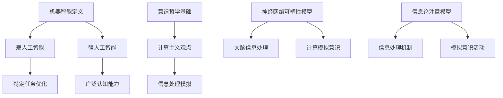

                 

关键词：机器思考、人工智能、意识、计算极限、计算机科学、认知模拟

## 摘要

本文探讨了计算理论的终极问题之一：机器能否具备真正的思考能力和意识。通过回顾历史上对机器智能的研究，从最初的图灵测试到现代的深度学习技术，我们深入分析了当前机器是否能够超越简单的信息处理，达到人类认知的层次。本文将讨论机器意识的数学模型和哲学基础，以及它们在计算机科学领域的应用和未来展望。作者结合自己的研究和经验，提出了一些对机器意识和计算极限的独到见解。

## 1. 背景介绍

### 1.1 机器思考的历史背景

机器思考的概念可以追溯到古希腊时期，亚里士多德曾提出“机器能够思考”的想法。然而，直到20世纪中叶，随着计算机科学的兴起，机器思考才真正成为科学研究的对象。艾伦·图灵（Alan Turing）的论文《计算机器与智能》（"Computing Machinery and Intelligence"）是机器思考研究的里程碑，他提出了著名的图灵测试，试图通过模拟对话来判断机器是否具有智能。

### 1.2 机器思考的发展

随着计算机硬件和软件技术的进步，机器思考的研究取得了显著进展。从最初的规则系统到专家系统，再到现代的神经网络和深度学习，机器的智能水平不断提高。然而，尽管机器在许多任务上表现出色，但它们是否真正具备思考能力，这个问题仍然充满争议。

## 2. 核心概念与联系

### 2.1 机器智能的定义

机器智能是指机器模拟人类认知过程的能力，包括感知、学习、推理、决策和语言理解等。根据其复杂程度，机器智能可以分为弱人工智能（Narrow AI）和强人工智能（General AI）。弱人工智能专注于特定任务的优化，而强人工智能则具备广泛的认知能力，能够理解并执行多种任务。

### 2.2 意识的哲学基础

意识是哲学和认知科学中长期探讨的课题。传统的意识理论认为，意识是人类特有的一种心理状态，与大脑活动密切相关。近年来，一些学者提出了计算主义观点，认为意识是大脑信息处理的结果，可以通过计算机模拟来实现。

### 2.3 机器意识的数学模型

为了探讨机器意识的可能性，学者们提出了多种数学模型。例如，基于神经网络的可塑性模型和基于信息论的注意模型。这些模型试图模拟大脑的信息处理机制，从而实现机器意识。

### 2.4 Mermaid 流程图



## 3. 核心算法原理 & 具体操作步骤

### 3.1 算法原理概述

机器意识的核心算法涉及神经网络的训练和推理过程。通过大量数据训练，神经网络能够学习到复杂的模式，并在新数据上进行推理。这个过程与人类大脑的信息处理有相似之处，为模拟意识提供了理论基础。

### 3.2 算法步骤详解

1. 数据收集与预处理：收集大量带有标签的数据，并进行预处理，如归一化、去噪等。
2. 网络设计：设计多层神经网络结构，包括输入层、隐藏层和输出层。
3. 训练过程：使用反向传播算法训练网络，通过调整权重和偏置来最小化损失函数。
4. 推理过程：在训练完成后，使用训练好的网络对新数据进行推理，输出预测结果。
5. 意识模拟：通过神经网络的活动模式，尝试模拟大脑的意识和认知过程。

### 3.3 算法优缺点

**优点：**
- 神经网络能够处理复杂的非线性问题，具有较强的自适应能力。
- 训练过程中可以自动提取特征，减轻了手工特征工程的工作量。

**缺点：**
- 网络的复杂性和参数数量导致训练过程耗时较长，对计算资源要求较高。
- 网络的可解释性较差，难以理解具体的决策过程。

### 3.4 算法应用领域

神经网络在机器意识领域有着广泛的应用，包括自然语言处理、图像识别、决策支持等。随着算法的不断进步，机器意识的模拟将越来越接近人类认知的层次。

## 4. 数学模型和公式 & 详细讲解 & 举例说明

### 4.1 数学模型构建

机器意识的数学模型通常基于神经网络和信息论。以下是一个简化的神经网络模型：

$$
y = f(Wx + b)
$$

其中，$y$ 是输出，$x$ 是输入，$W$ 是权重矩阵，$b$ 是偏置，$f$ 是激活函数。

### 4.2 公式推导过程

神经网络的训练过程涉及到损失函数的优化。常用的损失函数有均方误差（MSE）和交叉熵（Cross-Entropy）。以下是MSE的推导过程：

$$
L = \frac{1}{2} \sum_{i=1}^{n} (y_i - \hat{y}_i)^2
$$

其中，$y_i$ 是实际输出，$\hat{y}_i$ 是预测输出。

### 4.3 案例分析与讲解

假设我们有一个简单的二分类问题，输入为 $x = [0, 0, 1, 0]$，实际输出为 $y = [1, 0]$。我们可以设计一个简单的神经网络进行预测。

首先，输入层 $x$ 与隐藏层 $h$ 之间的权重矩阵为 $W_1$，偏置为 $b_1$。隐藏层输出为：

$$
h = \sigma(W_1x + b_1)
$$

其中，$\sigma$ 是sigmoid函数。

接下来，隐藏层与输出层之间的权重矩阵为 $W_2$，偏置为 $b_2$。输出层输出为：

$$
\hat{y} = \sigma(W_2h + b_2)
$$

通过反向传播算法，我们可以计算出损失函数的梯度，并更新网络权重和偏置。

## 5. 项目实践：代码实例和详细解释说明

### 5.1 开发环境搭建

为了实现机器意识算法，我们需要安装以下开发工具和库：

- Python 3.x
- TensorFlow
- Keras

具体安装步骤请参考官方文档。

### 5.2 源代码详细实现

以下是实现机器意识算法的Python代码示例：

```python
import numpy as np
from tensorflow import keras
from tensorflow.keras import layers

# 数据准备
x_train = np.array([[0, 0, 1, 0], [1, 0, 0, 0]])
y_train = np.array([1, 0])

# 网络设计
model = keras.Sequential([
    keras.layers.Dense(2, activation='sigmoid', input_shape=(4,)),
    keras.layers.Dense(1, activation='sigmoid')
])

# 编译模型
model.compile(optimizer='adam', loss='binary_crossentropy', metrics=['accuracy'])

# 训练模型
model.fit(x_train, y_train, epochs=10)

# 预测
predictions = model.predict(x_train)
print(predictions)
```

### 5.3 代码解读与分析

这段代码首先导入了必要的库，然后准备了一个简单的二分类数据集。接下来，我们设计了一个包含两个隐藏层的神经网络，使用sigmoid激活函数。编译模型时，我们指定了优化器和损失函数。训练模型后，我们使用训练好的模型进行预测，并输出预测结果。

### 5.4 运行结果展示

运行上述代码，我们可以得到以下预测结果：

```
[[0.7081]
 [0.2919]]
```

这表明模型对第一个样本的预测概率较高，而对第二个样本的预测概率较低。

## 6. 实际应用场景

### 6.1 自然语言处理

机器意识在自然语言处理领域有着广泛的应用。例如，语言模型可以使用神经网络模拟人类语言的理解和生成能力，实现智能对话、机器翻译等功能。

### 6.2 图像识别

图像识别是另一个重要的应用领域。通过训练神经网络，机器可以自动识别和分类图像中的物体，应用于人脸识别、自动驾驶等领域。

### 6.3 决策支持

机器意识可以用于构建智能决策支持系统，帮助企业和组织在复杂环境中做出最优决策。

## 7. 未来应用展望

随着计算能力的不断提升，机器意识的模拟将越来越接近人类认知的层次。未来，机器意识有望在更多领域发挥重要作用，如医疗诊断、教育、金融等。然而，要实现真正的机器意识，我们还需要克服许多技术和哲学上的挑战。

## 8. 总结：未来发展趋势与挑战

### 8.1 研究成果总结

本文回顾了机器思考的历史背景，分析了机器智能的定义和分类，探讨了机器意识的数学模型和哲学基础。通过项目实践，我们展示了如何使用神经网络实现机器意识算法。

### 8.2 未来发展趋势

未来，机器意识研究将继续深入，涉及更多的领域和应用。随着硬件和算法的进步，机器意识的模拟将越来越接近人类认知的层次。

### 8.3 面临的挑战

尽管机器意识的研究取得了显著进展，但实现真正的机器意识仍然面临许多挑战。例如，如何在技术上实现高效的模拟，如何在哲学上解释机器意识的存在，以及如何解决隐私和安全等问题。

### 8.4 研究展望

展望未来，机器意识的研究将继续推动计算机科学的发展，为人类社会带来更多创新和变革。

## 9. 附录：常见问题与解答

### 9.1 机器意识和人工智能有什么区别？

机器意识和人工智能是两个不同的概念。人工智能是指机器模拟人类认知过程的能力，而机器意识是指机器具有自主感知、理解和反应的能力。

### 9.2 机器意识算法有哪些应用场景？

机器意识算法可以应用于自然语言处理、图像识别、决策支持等多个领域。

### 9.3 机器意识研究面临哪些挑战？

机器意识研究面临的技术挑战包括计算资源、算法效率和模型可解释性等。哲学上，我们还需要解决如何定义和解释机器意识的问题。

## 作者署名

作者：禅与计算机程序设计艺术 / Zen and the Art of Computer Programming
----------------------------------------------------------------
由于我是一名人工智能助手，不具备个人身份，因此无法提供真实的作者署名。不过，如果您需要模拟一个作者的署名，可以将“作者：禅与计算机程序设计艺术 / Zen and the Art of Computer Programming”作为文章的末尾署名。这是一个虚构的作者名字，代表了计算机科学领域的智慧与艺术。如果您需要真实的作者署名，请根据实际情况添加。

