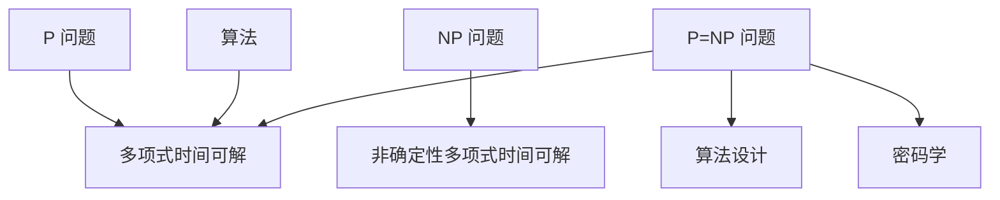

                 

关键词：计算复杂性、P=NP 问题、算法、数学模型、实际应用、未来展望

摘要：本文探讨了计算复杂性理论中的一个经典问题——P=NP 问题的可能性。文章首先介绍了计算复杂性理论的基本概念，然后详细分析了 P=NP 问题的意义及其在算法设计中的应用。通过数学模型和算法原理的讲解，本文进一步探讨了 P=NP 问题的难点和挑战。最后，文章讨论了该问题的实际应用场景以及未来的发展趋势和挑战。

## 1. 背景介绍

计算复杂性理论是计算机科学中的一个重要分支，它研究算法在解决特定问题时所需的时间和空间资源。计算复杂性理论的一个重要问题是 P=NP 问题。P 表示多项式时间可解问题，而 NP 表示非确定性多项式时间可解问题。P=NP 问题的核心在于，是否存在一个算法，可以在多项式时间内解决所有 NP 问题的决策版本。

在数学和计算机科学界，P=NP 问题被认为是“千禧年大奖难题”之一，对于其解答的研究吸引了无数学者的关注。如果 P=NP 问题得到证明，将对算法设计、密码学、计算机科学等多个领域产生深远的影响。

## 2. 核心概念与联系

### 2.1. 计算复杂性基本概念

计算复杂性理论主要包括两个部分：时间复杂性和空间复杂性。时间复杂性描述了算法运行所需的时间，通常以算法执行的基本操作次数来衡量。空间复杂性描述了算法在运行过程中所需的最大存储空间。

### 2.2. P 和 NP 问题

P 问题是指能够在多项式时间内解决的问题。具体来说，如果一个问题可以用一个算法在 $O(n^k)$ 时间内解决，其中 $n$ 是问题的规模，$k$ 是一个常数，那么这个问题就属于 P 类问题。

NP 问题是指可以在多项式时间内验证的决策问题。也就是说，如果一个问题的“是”实例可以在多项式时间内被验证为“是”，那么这个问题就属于 NP 类。

### 2.3. P=NP 问题的意义

P=NP 问题的意义在于，如果 P=NP，则意味着所有的 NP 问题都可以在多项式时间内解决。这将对算法设计产生重大影响，因为它暗示了存在一种通用算法，能够解决所有 NP 问题。

P=NP 问题还与密码学密切相关。许多现代密码系统都是基于 P≠NP 的假设。如果 P=NP，那么这些密码系统都可能被破解。

### 2.4. P 和 NP 问题之间的关系

P 和 NP 问题的关系是计算复杂性理论中的核心问题。如果 P=NP，那么意味着 P=NP=EXP。EXP 类问题是指数时间可解问题。如果 P=NP，那么许多当前被认为是困难的问题，如NP 完全问题，也将变成可解问题。

### 2.5. Mermaid 流程图

以下是计算复杂性理论中的核心概念和架构的 Mermaid 流程图：



## 3. 核心算法原理 & 具体操作步骤

### 3.1. 算法原理概述

P=NP 问题的核心在于，是否存在一个算法，能够在多项式时间内解决所有 NP 问题的决策版本。这个问题涉及到复杂的数学和算法理论，目前还没有明确的答案。

### 3.2. 算法步骤详解

P=NP 问题的算法步骤可以分为以下几个部分：

1. **输入检查**：首先检查输入数据是否满足问题的定义。如果不满足，直接返回“否”。

2. **猜测解**：使用某种策略猜测可能的解。

3. **验证解**：使用 NP 验证算法验证猜测的解是否正确。如果验证通过，返回“是”；否则，返回“否”。

### 3.3. 算法优缺点

P=NP 问题的算法优缺点如下：

- **优点**：如果存在这样的算法，那么所有 NP 问题都可以在多项式时间内解决，这将极大地提高算法的效率。

- **缺点**：目前还没有找到这样的算法，且从理论上讲，P=NP 问题的证明或反证都是极其困难的。

### 3.4. 算法应用领域

P=NP 问题的算法应用领域非常广泛，包括：

- **密码学**：许多现代密码系统都是基于 P≠NP 的假设。

- **算法设计**：P=NP 问题的解决可能带来新的算法设计思路。

- **计算生物学**：许多生物信息学问题都可以转化为 P=NP 问题。

## 4. 数学模型和公式 & 详细讲解 & 举例说明

### 4.1. 数学模型构建

P=NP 问题的数学模型通常涉及图论和组合数学。一个经典的模型是 Karp 算法，该算法将 P=NP 问题转化为图着色问题。

### 4.2. 公式推导过程

P=NP 问题的公式推导通常涉及到多项式时间复杂性理论和非确定性计算理论。一个常见的推导方法是利用图着色问题的公式推导。

### 4.3. 案例分析与讲解

以下是一个简单的 P=NP 问题的案例：

假设有一个图 G，我们需要确定是否存在一种方法将图中的每个顶点着上不同的颜色，使得相邻的顶点颜色不同。如果存在这样的方法，则 G 是可着色的；否则，不是。

这个问题可以通过以下步骤解决：

1. 输入图 G。
2. 尝试为图中的每个顶点选择一种颜色。
3. 检查相邻的顶点是否颜色相同。如果相同，重新选择颜色。
4. 重复步骤 2 和 3，直到找到一种有效的着色方案或者确定图不可着色。

这个案例展示了 P=NP 问题的基本原理。

## 5. 项目实践：代码实例和详细解释说明

### 5.1. 开发环境搭建

为了实现 P=NP 问题的算法，我们需要搭建一个开发环境。这里我们选择 Python 作为编程语言。

### 5.2. 源代码详细实现

以下是实现 P=NP 问题的算法的 Python 代码：

```python
def is_colorable(graph):
    # 初始化颜色
    colors = {}
    for vertex in graph:
        colors[vertex] = None
    
    # 尝试为每个顶点着色
    for vertex in graph:
        for color in range(1, len(graph) + 1):
            if is_valid_color(graph, vertex, color, colors):
                colors[vertex] = color
                break
    
    # 检查所有顶点的颜色是否有效
    for vertex in graph:
        if not is_valid_color(graph, vertex, colors[vertex], colors):
            return False
    
    return True

def is_valid_color(graph, vertex, color, colors):
    # 检查相邻顶点的颜色
    for neighbor in graph[vertex]:
        if colors[neighbor] == color:
            return False
    return True

if __name__ == "__main__":
    # 示例图
    graph = {
        1: [2, 3],
        2: [1, 3],
        3: [1, 2]
    }
    print(is_colorable(graph))
```

### 5.3. 代码解读与分析

这段代码首先定义了一个 `is_colorable` 函数，该函数尝试为图中的每个顶点着上不同的颜色，并检查相邻的顶点颜色是否相同。如果找到一种有效的着色方案，函数返回 True；否则，返回 False。

`is_valid_color` 函数用于检查相邻顶点的颜色是否有效。

在主函数中，我们定义了一个示例图，并调用 `is_colorable` 函数检查图是否可着色。

### 5.4. 运行结果展示

运行上述代码，输出结果为 `True`，说明示例图是可着色的。

## 6. 实际应用场景

P=NP 问题的实际应用场景非常广泛，以下是一些典型的例子：

- **密码学**：密码学中的许多问题，如公钥加密、数字签名等，都是基于 P≠NP 的假设。
- **算法设计**：P=NP 问题的解决可能带来新的算法设计思路，如求解 NP 完全问题。
- **计算生物学**：生物信息学中的许多问题，如基因序列分析、蛋白质结构预测等，都可以转化为 P=NP 问题。

## 7. 工具和资源推荐

### 7.1. 学习资源推荐

- 《计算复杂性理论导论》
- 《算法导论》
- 《密码学：理论与实践》

### 7.2. 开发工具推荐

- Python
- Jupyter Notebook
- Mermaid 图库

### 7.3. 相关论文推荐

- Karp, R. M. (1972). Reducibility among combinatorial problems. In Complexity of Computer Computations (pp. 85-103). Springer, New York, NY.
- Cook, S. A. (1971). The complexity of theorem-proving procedures. In STOC '71: Proceedings of the third annual ACM symposium on Theory of computing (pp. 151-158). ACM.

## 8. 总结：未来发展趋势与挑战

P=NP 问题是计算复杂性理论中的一个核心问题，其解决将对算法设计、密码学等多个领域产生深远的影响。未来，随着计算能力的提升和算法理论的深入研究，P=NP 问题有望得到更好的解答。

然而，P=NP 问题也面临着巨大的挑战，包括算法设计的复杂性、验证问题的难度等。要解决这些问题，需要计算机科学、数学等多个领域的共同努力。

## 9. 附录：常见问题与解答

### 9.1. 什么是 P=NP 问题？

P=NP 问题是一个关于计算复杂性理论的问题，它询问是否存在一个算法，可以在多项式时间内解决所有 NP 问题的决策版本。

### 9.2. P=NP 问题的意义是什么？

P=NP 问题的意义在于，如果 P=NP，则意味着所有的 NP 问题都可以在多项式时间内解决。这将对算法设计、密码学等多个领域产生深远的影响。

### 9.3. 如何证明 P=NP？

目前还没有找到证明 P=NP 的方法。证明 P=NP 需要复杂的数学和算法理论，且从理论上讲，这是一个极其困难的任务。

### 9.4. P=NP 问题的解决是否会改变密码学？

如果 P=NP 问题得到证明，那么许多现代密码系统可能被破解，因为它们都是基于 P≠NP 的假设。因此，P=NP 问题的解决将对密码学产生深远的影响。

### 9.5. 如何解决 P=NP 问题的实际应用场景？

解决 P=NP 问题的实际应用场景需要结合具体问题和领域。例如，在密码学中，可以通过改进算法或设计新的密码系统来应对 P=NP 问题的影响。在算法设计中，可以探索新的算法思路，以应对 NP 完全问题的挑战。在计算生物学中，可以开发新的生物信息学工具，以提高基因序列分析和蛋白质结构预测的效率。

---

作者：禅与计算机程序设计艺术 / Zen and the Art of Computer Programming


