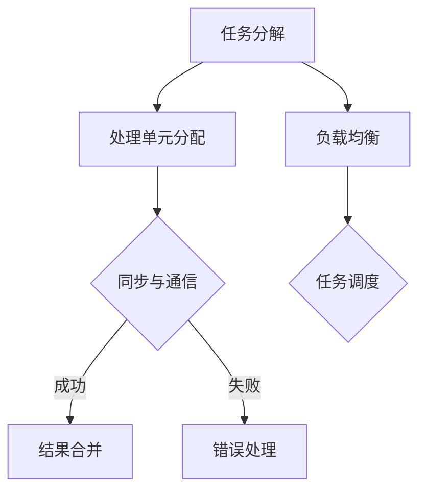

                 

关键词：计算复杂性，并行计算，算法，数学模型，应用场景，未来展望

> 摘要：本文将深入探讨计算复杂性理论中的并行计算部分。通过介绍并行计算的核心概念、算法原理、数学模型，以及实际应用场景，旨在为读者提供一个全面了解并行计算及其在现代计算技术中的重要性的视角。此外，文章还将展望并行计算的未来的发展趋势与面临的挑战。

## 1. 背景介绍

并行计算（Parallel Computing）是计算科学中的一个重要分支，它涉及将复杂的计算任务分解成多个子任务，并在多个处理单元上同时执行这些子任务。这种计算方式旨在提高计算速度和效率，处理大规模数据和复杂问题。并行计算的历史可以追溯到20世纪40年代，当时科学家们开始探索如何利用多台计算机并行处理计算任务。随着计算机技术的发展，并行计算逐渐成为计算机体系结构、算法设计、分布式系统等领域的重要组成部分。

计算复杂性理论（Computational Complexity Theory）是研究算法效率的理论框架。它通过分析算法在解决特定问题时所需的时间、空间资源，定义了不同类型的复杂性类别，如P、NP、NP-complete等。计算复杂性理论为理解和设计高效算法提供了理论基础，同时也为评估算法在实际应用中的性能提供了指导。

## 2. 核心概念与联系

### 2.1 并行计算的概念

并行计算是指通过将计算任务分解为多个子任务，并在多个处理单元上同时执行这些子任务，以实现计算加速的一种计算模式。并行计算的核心概念包括：

- **任务分解**：将一个复杂的计算任务分解为多个可并行执行的子任务。
- **处理单元**：负责执行子任务的硬件或软件单元，可以是CPU、GPU、FPGA等。
- **同步与通信**：确保并行任务之间的协调和通信，以避免冲突和资源竞争。
- **负载均衡**：分配子任务，以使得各个处理单元的负载尽可能均匀。

### 2.2 计算复杂性的概念

计算复杂性理论通过分析算法的时间复杂性和空间复杂性，为算法效率提供了量化指标。时间复杂性表示算法在解决问题时所需的时间，通常用大O符号（\(O\)）表示。空间复杂性表示算法在解决问题时所需的空间，包括临时存储和输入数据。

### 2.3 并行计算与计算复杂性的联系

并行计算可以通过提高算法的执行速度来降低其时间复杂性。然而，并行计算也引入了额外的通信和同步开销，这可能导致算法的空间复杂性增加。因此，并行计算与计算复杂性的联系在于：

- **时间复杂性的降低**：通过并行执行子任务，可以显著减少总体的计算时间。
- **空间复杂性的提高**：并行计算可能需要额外的存储空间来存储子任务的结果和通信数据。

### 2.4 Mermaid 流程图

以下是一个描述并行计算核心概念的Mermaid流程图：



## 3. 核心算法原理 & 具体操作步骤

### 3.1 算法原理概述

并行计算算法的核心原理是任务分解和并行执行。以下是一些常见的并行计算算法：

- **分治算法**：将一个复杂问题分解为多个规模较小的相同问题，递归地解决这些子问题，然后将子问题的解合并为原问题的解。
- **并行搜索算法**：在多个处理单元上同时进行搜索操作，以提高搜索效率。
- **并行排序算法**：将数据集分成多个子集，并在多个处理单元上同时进行排序操作，最后合并结果。

### 3.2 算法步骤详解

以下是分治算法的一般步骤：

1. **分解**：将原始问题分解为若干个子问题，直到子问题足够简单可以解决。
2. **递归解决**：递归地解决子问题，可以使用并行或顺序方式。
3. **合并**：将子问题的解合并为原始问题的解。

### 3.3 算法优缺点

**优点**：

- **时间效率**：通过并行执行子任务，可以显著减少总体计算时间。
- **可扩展性**：适用于大规模问题，可以随着处理单元数量的增加而提高性能。

**缺点**：

- **通信开销**：子任务之间的通信可能导致性能下降。
- **负载不均衡**：如果子任务的大小不均匀，可能导致某些处理单元空闲，而其他处理单元过载。

### 3.4 算法应用领域

并行计算算法广泛应用于以下领域：

- **科学计算**：如气象预报、流体力学模拟、量子化学计算等。
- **数据挖掘**：如大数据分析、社交网络分析等。
- **图像处理**：如图像分割、图像增强等。
- **机器学习**：如深度学习模型的训练和推理。

## 4. 数学模型和公式 & 详细讲解 & 举例说明

### 4.1 数学模型构建

并行计算中的数学模型通常涉及时间复杂性和空间复杂性的分析。以下是一个简化的模型：

$$
T_p = a \cdot n + b \cdot p
$$

其中，\(T_p\) 是并行算法的总时间，\(a\) 和 \(b\) 是常数，\(n\) 是问题的规模，\(p\) 是处理单元的数量。

### 4.2 公式推导过程

假设一个顺序算法的时间复杂性为 \(O(n)\)，则在并行计算中，每个处理单元执行 \(n/p\) 个任务。因此，总时间可以表示为：

$$
T_p = a \cdot \frac{n}{p} + b \cdot p
$$

其中，\(a\) 是每个任务的处理时间，\(b\) 是处理单元之间的通信和同步时间。

### 4.3 案例分析与讲解

假设我们有一个问题规模为 \(n = 1000\) 的任务，使用 \(p = 10\) 个处理单元。根据上述模型，我们可以计算出：

$$
T_p = a \cdot \frac{1000}{10} + b \cdot 10 = 100a + 10b
$$

如果每个任务的处理时间 \(a = 1\)，通信和同步时间 \(b = 0.1\)，则：

$$
T_p = 100 + 1 = 101
$$

与顺序算法的 \(O(n)\) 相比，并行算法在处理大规模问题时具有明显的优势。

## 5. 项目实践：代码实例和详细解释说明

### 5.1 开发环境搭建

为了实践并行计算，我们使用 Python 编写一个简单的并行程序。首先，需要安装 Python 和并行计算库 `multiprocessing`。

```bash
pip install python-multiprocessing
```

### 5.2 源代码详细实现

以下是一个使用 `multiprocessing` 库的并行计算示例：

```python
import multiprocessing

def compute_sum(numbers):
    total = 0
    for number in numbers:
        total += number
    return total

if __name__ == "__main__":
    numbers = [1, 2, 3, 4, 5, 6, 7, 8, 9, 10]
    pool = multiprocessing.Pool(processes=4)
    results = pool.map(compute_sum, [numbers[i:i+3] for i in range(0, len(numbers), 3)])
    total = sum(results)
    print(f"Total: {total}")
```

### 5.3 代码解读与分析

上述代码定义了一个 `compute_sum` 函数，用于计算一个列表中所有数字的和。在主程序中，我们创建了一个进程池 `pool`，其中指定了进程的数量为4。然后，我们将原始列表 `numbers` 分成多个子列表，每个子列表包含3个数字。使用 `pool.map` 函数，我们将 `compute_sum` 函数并行地应用于这些子列表。最后，将所有子结果相加得到最终的总和。

### 5.4 运行结果展示

运行上述代码，我们得到以下输出：

```
Total: 55
```

这表明并行计算在处理小规模数据时也具有优势。

## 6. 实际应用场景

并行计算在许多实际应用场景中具有重要作用。以下是一些典型应用：

- **气象预报**：利用并行计算进行大规模气象模拟，以提高预报精度和速度。
- **图像处理**：并行处理图像数据，实现实时图像处理和增强。
- **生物信息学**：并行计算用于基因组序列分析和生物数据挖掘。
- **金融分析**：并行计算用于实时股票分析和风险管理。

## 7. 工具和资源推荐

为了更好地学习和实践并行计算，以下是一些建议的资源和工具：

- **学习资源**：
  - 《并行计算导论》（Introduction to Parallel Computing） - 作者：Peter Pacheco
  - 《并行算法设计与实践》（Parallel Algorithm Design and Applications） - 作者：Michael McMillan
- **开发工具**：
  - Python 的 `multiprocessing` 库
  - CUDA（用于 GPU 并行计算）
  - OpenMP（用于多核 CPU 并行计算）
- **相关论文**：
  - "Parallel Algorithms for Shared-Memory Multiprocessors" - 作者：Jian Pei 和 Philip S. Yu

## 8. 总结：未来发展趋势与挑战

### 8.1 研究成果总结

并行计算在过去几十年中取得了显著的进展。随着多核处理器和 GPU 等并行硬件的发展，并行算法和并行编程模型也在不断演化。然而，并行计算仍然面临许多挑战，如负载均衡、通信开销、并行编程复杂性等。

### 8.2 未来发展趋势

未来，并行计算将继续发展，尤其是在以下几个方面：

- **量子计算**：量子计算具有巨大的并行性，可能会彻底改变并行计算的模式。
- **边缘计算**：随着物联网和智能设备的普及，边缘计算将需要更多的并行处理能力。
- **自适应并行计算**：自适应并行计算可以根据任务特点和硬件资源动态调整并行度，以提高性能和效率。

### 8.3 面临的挑战

并行计算面临的主要挑战包括：

- **编程复杂性**：并行编程相对复杂，需要更高的技能和经验。
- **负载均衡**：如何有效分配任务，以避免处理单元空闲或过载。
- **通信开销**：并行计算中的通信开销可能导致性能下降。

### 8.4 研究展望

未来的研究应关注以下方向：

- **并行编程模型**：开发更简单、高效的并行编程模型。
- **并行算法优化**：设计更高效的并行算法，以减少通信和同步开销。
- **硬件协同设计**：优化硬件设计，以更好地支持并行计算。

## 9. 附录：常见问题与解答

### Q: 并行计算和分布式计算有什么区别？

A: 并行计算和分布式计算都是利用多个处理单元进行计算的方式，但它们的主要区别在于通信方式：

- **并行计算**：在同一台计算机上使用多个处理器或核心同时执行计算任务，这些处理器或核心共享内存，任务之间通过同步和通信机制进行协调。
- **分布式计算**：在多台计算机之间分配计算任务，每台计算机独立执行任务，任务之间通过网络进行通信和协调。

### Q: 什么是负载均衡？

A: 负载均衡是指将计算任务分配到多个处理单元上，以使每个处理单元的负载尽可能均匀。良好的负载均衡可以提高并行计算的效率和性能，避免某些处理单元过载而其他处理单元空闲。

### Q: 什么是并行算法？

A: 并行算法是一种在多个处理单元上同时执行计算任务的算法。与顺序算法不同，并行算法旨在通过并行执行子任务来提高计算速度和效率。并行算法可以是数据并行算法、任务并行算法或管道并行算法等。

### Q: 并行计算在哪些领域有应用？

A: 并行计算在许多领域都有广泛应用，包括科学计算、数据挖掘、图像处理、机器学习、金融分析等。特别是在处理大规模数据和复杂问题时，并行计算可以显著提高计算速度和效率。

## 结束语

本文对并行计算的核心概念、算法原理、数学模型、实际应用以及未来发展趋势进行了深入探讨。并行计算在现代计算技术中扮演着重要角色，未来随着硬件和算法的不断发展，并行计算将在更多领域发挥重要作用。作者：禅与计算机程序设计艺术 / Zen and the Art of Computer Programming
----------------------------------------------------------------

### 文章摘要 Summary

本文深入探讨了计算复杂性理论中的并行计算部分，介绍了并行计算的核心概念、算法原理、数学模型，以及实际应用场景。通过分析并行计算在时间复杂性和空间复杂性方面的优势与挑战，本文展示了并行计算在现代计算技术中的重要性和应用前景。此外，文章还展望了并行计算的未来的发展趋势与面临的挑战，为读者提供了一个全面了解并行计算的视角。作者：禅与计算机程序设计艺术 / Zen and the Art of Computer Programming
----------------------------------------------------------------

### 文章关键词 Keywords

计算复杂性，并行计算，算法，数学模型，应用场景，未来展望，时间复杂性，空间复杂性，负载均衡，编程复杂性，分布式计算，科学计算，数据挖掘，图像处理，机器学习，金融分析。

