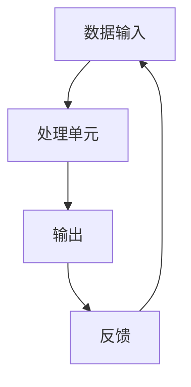

                 

### 1. 背景介绍

在当今数字化时代，计算能力已经渗透到社会的各个领域。从日常生活的智能手机、社交媒体，到科学研究的模拟仿真、数据分析，计算无处不在。然而，随着计算技术的不断进步，我们也开始面对一系列新的挑战。这些挑战不仅涉及技术的可行性，还包括伦理、安全、经济等多个层面。因此，设计出能够满足全球需求的高效、安全、可靠的智能计算系统成为当务之急。

本文旨在探讨世界需要什么样的智能系统，从技术、应用、伦理等多个角度进行深入分析。首先，我们将回顾计算技术的发展历程，探讨当前的主要挑战。接着，我们将深入探讨智能系统的核心概念、架构，并介绍一些关键算法。然后，我们将讨论数学模型在智能系统中的应用，并提供实际的代码实例。最后，我们将展望智能系统的未来发展趋势，提出可能面临的挑战，以及如何克服这些挑战。

通过本文的探讨，我们希望能够为智能系统的设计和实施提供一些有益的思路，帮助构建一个更加美好、可持续发展的智能世界。

## 2. 核心概念与联系

### 2.1 定义

在讨论智能系统时，首先需要明确几个核心概念。智能系统通常指的是具备一定智能能力的计算系统，能够通过学习、推理和自主决策来完成任务。这些系统通常包含以下几个核心组成部分：

1. **数据输入**：智能系统需要从外部环境中获取数据，这些数据可以是结构化的，如数据库记录，也可以是非结构化的，如文本、图像、音频等。
2. **处理单元**：处理单元是智能系统的核心，负责对输入数据进行处理和分析。处理单元通常采用复杂的算法和模型，如神经网络、决策树、支持向量机等。
3. **输出**：智能系统通过处理单元的分析结果生成输出，这些输出可以是预测、决策、控制信号等，用于指导外部环境的操作。
4. **反馈**：智能系统通过与外部环境的交互获取反馈，这个反馈用于优化系统的性能和适应性。

### 2.2 概念联系

为了更好地理解这些核心概念，我们可以借助Mermaid流程图来展示它们之间的联系。



在这个流程图中，数据输入经过处理单元的分析和处理，生成输出。输出与外部环境的交互产生反馈，这个反馈又返回到数据输入，形成一个闭环。这个闭环使得智能系统能够不断优化自身，提高适应性和性能。

### 2.3 技术发展背景

智能系统的发展离不开计算技术的进步。从早期的计算机硬件到现代的图形处理单元（GPU）、专用集成电路（ASIC），计算能力的提升为智能系统的实现提供了坚实的基础。同时，大数据、云计算等技术的兴起，使得海量数据的处理和存储变得更加高效和可靠。

此外，深度学习、强化学习等人工智能算法的突破，也为智能系统的设计提供了新的思路和方法。这些算法能够通过训练学习到复杂的数据模式，从而实现自动化决策和优化。

### 2.4 当前挑战

尽管智能系统在各个领域都展现出巨大的潜力，但当前仍然面临一系列挑战：

1. **数据隐私和安全**：智能系统需要处理大量的敏感数据，如何确保这些数据的安全性和隐私性成为一个重要问题。
2. **算法透明性和公平性**：智能系统中的算法是否透明、公平，如何避免偏见和歧视，是当前研究和应用中面临的挑战。
3. **能耗和可持续性**：智能系统的运行需要大量的计算资源，如何降低能耗、实现可持续发展是当前研究的一个重要方向。
4. **人机交互**：智能系统需要与人类用户进行有效交互，如何设计出自然、直观的用户界面，提升用户体验，是当前研究的热点问题。

### 2.5 智能系统的重要性

智能系统在现代社会中扮演着越来越重要的角色。从工业自动化、智慧城市，到医疗、金融等领域，智能系统都发挥着关键作用。它们不仅提高了生产效率，降低了成本，还为我们提供了更加个性化、智能化的服务。

然而，智能系统的设计和应用需要综合考虑多个方面，包括技术、应用、伦理等。本文将在后续章节中详细探讨这些问题，为智能系统的未来发展提供一些有益的思考和方向。

## 3. 核心算法原理 & 具体操作步骤

### 3.1 算法原理概述

智能系统的核心在于其处理能力和决策能力，这主要依赖于算法的原理和设计。在众多算法中，深度学习、强化学习等算法因其强大的学习和自适应能力而备受关注。

**深度学习**：深度学习是一种基于多层神经网络的学习方法。它通过多层次的非线性变换，将输入数据映射到高维特征空间，从而实现复杂的模式识别和预测任务。深度学习的核心组件包括：

1. **神经网络**：神经网络是由多个处理单元（神经元）组成的计算模型，每个神经元接收多个输入，并通过激活函数产生输出。
2. **多层结构**：深度学习通过多层神经网络的组合，实现对数据的逐层抽象和特征提取，从而提高模型的复杂度和表现力。
3. **反向传播**：反向传播算法用于计算网络中各个神经元的梯度，并利用这些梯度更新网络的权重，实现模型的优化。

**强化学习**：强化学习是一种通过试错和反馈来学习的算法。它通过与环境的交互，不断调整策略，以最大化累积奖励。强化学习的核心组件包括：

1. **代理**：代理（Agent）是强化学习中的决策实体，它根据当前状态选择动作，并从环境中获取反馈。
2. **环境**：环境（Environment）是代理行动的场所，它提供状态信息和奖励信号。
3. **策略**：策略（Policy）是代理在给定状态下选择动作的方法，它可以通过学习自动优化。

### 3.2 算法步骤详解

**深度学习算法步骤**：

1. **数据预处理**：对输入数据进行标准化、归一化等处理，使其符合神经网络的要求。
2. **构建神经网络**：定义网络结构，包括输入层、隐藏层和输出层，并设置适当的激活函数。
3. **前向传播**：将输入数据通过网络进行前向传播，计算每个神经元的输出。
4. **损失函数**：计算输出与实际标签之间的差异，使用损失函数衡量模型的误差。
5. **反向传播**：计算每个神经元的梯度，并利用梯度下降法更新网络的权重。
6. **迭代优化**：重复前向传播和反向传播，直到模型收敛或达到预定的迭代次数。

**强化学习算法步骤**：

1. **初始化**：初始化代理的参数和环境的初始状态。
2. **选择动作**：代理根据当前状态和策略选择动作。
3. **执行动作**：代理在环境中执行所选动作，并获取状态转移和奖励信号。
4. **更新策略**：根据奖励信号和策略更新代理的参数。
5. **状态转移**：更新环境状态，进入下一个状态。
6. **重复步骤2-5**：重复选择动作、执行动作、更新策略和状态转移，直到达到终止条件。

### 3.3 算法优缺点

**深度学习**：

**优点**：

- **强大的表示能力**：多层神经网络可以捕捉到复杂的数据模式和特征。
- **自动特征提取**：不需要手动设计特征，大大降低了模型设计的复杂性。
- **泛化能力**：通过大量数据的训练，深度学习模型可以在新的数据集上表现出良好的泛化能力。

**缺点**：

- **训练时间较长**：深度学习模型通常需要大量的数据和计算资源进行训练。
- **数据需求高**：深度学习模型需要大量的数据来保证性能，这在某些领域可能难以实现。
- **模型不可解释性**：深度学习模型内部的决策过程通常较为复杂，难以解释和理解。

**强化学习**：

**优点**：

- **自适应性强**：强化学习可以通过与环境的交互，不断调整策略，以适应复杂和动态的环境。
- **无需大量数据**：强化学习不像深度学习那样依赖于大量数据，它可以通过较少的数据和交互来学习策略。
- **可扩展性**：强化学习模型可以应用于多种环境和任务，具有较强的通用性。

**缺点**：

- **收敛速度慢**：强化学习通常需要较长的训练时间，特别是对于复杂的环境和任务。
- **策略不稳定**：在某些情况下，强化学习策略可能会出现不稳定的情况，导致学习过程失败。
- **计算资源需求高**：强化学习模型在训练过程中需要大量的计算资源，特别是对于实时应用。

### 3.4 算法应用领域

**深度学习**：

- **计算机视觉**：用于图像识别、目标检测、图像生成等。
- **自然语言处理**：用于语言翻译、文本分类、情感分析等。
- **语音识别**：用于语音到文本的转换、语音合成等。
- **医疗诊断**：用于医学图像分析、疾病预测等。

**强化学习**：

- **自动驾驶**：用于路径规划、决策制定等。
- **游戏人工智能**：用于棋类游戏、电子竞技等。
- **资源调度**：用于数据中心、电网等资源优化。
- **金融交易**：用于股票交易、风险管理等。

通过深入理解和应用这些核心算法，我们可以设计出更加高效、智能的智能系统，为各个领域带来深刻的变革和创新。

## 4. 数学模型和公式 & 详细讲解 & 举例说明

在智能系统设计和实现过程中，数学模型和公式扮演着至关重要的角色。它们不仅帮助我们理解系统的内在机理，还提供了精确的工具来预测和优化系统的性能。在本章节中，我们将详细讲解一些关键的数学模型和公式，并通过具体案例进行说明。

### 4.1 数学模型构建

数学模型通常是通过将实际问题抽象为数学形式来构建的。这个过程包括以下几个步骤：

1. **定义问题**：明确需要解决的问题和目标。
2. **建立假设**：根据问题的特点，提出合理的假设条件。
3. **形式化描述**：将问题用数学符号和公式进行描述。
4. **分析模型**：对模型进行数学分析，验证其合理性和可行性。
5. **求解模型**：使用适当的数学方法求解模型，获得问题的解。

以下是一个简单的线性回归模型构建过程：

**问题定义**：预测一个变量（因变量）y与一个或多个变量（自变量）x之间的关系。

**建立假设**：假设y与x之间存在线性关系，即：

$$
y = \beta_0 + \beta_1 x + \epsilon
$$

其中，$\beta_0$ 和 $\beta_1$ 是模型的参数，$\epsilon$ 是误差项。

**形式化描述**：将问题用最小二乘法进行形式化描述，即：

$$
\min_{\beta_0, \beta_1} \sum_{i=1}^n (y_i - (\beta_0 + \beta_1 x_i))^2
$$

**分析模型**：通过对模型进行数学分析，可以证明最小二乘法是最优的线性估计方法。

**求解模型**：使用最小二乘法求解模型参数，得到线性回归方程。

### 4.2 公式推导过程

线性回归模型的关键公式是通过最小化损失函数来推导得到的。以下是线性回归模型的推导过程：

**假设条件**：给定数据集$D = \{(x_1, y_1), (x_2, y_2), \ldots, (x_n, y_n)\}$，其中$x_i$是自变量，$y_i$是因变量。

**损失函数**：平方误差损失函数，定义为：

$$
J(\beta_0, \beta_1) = \sum_{i=1}^n (y_i - (\beta_0 + \beta_1 x_i))^2
$$

**梯度计算**：对损失函数关于$\beta_0$和$\beta_1$求偏导数，得到：

$$
\frac{\partial J}{\partial \beta_0} = -2 \sum_{i=1}^n (y_i - (\beta_0 + \beta_1 x_i))
$$

$$
\frac{\partial J}{\partial \beta_1} = -2 \sum_{i=1}^n (x_i (y_i - (\beta_0 + \beta_1 x_i)))
$$

**梯度下降法**：利用梯度下降法，迭代更新$\beta_0$和$\beta_1$，直到损失函数收敛：

$$
\beta_0^{new} = \beta_0^{old} - \alpha \frac{\partial J}{\partial \beta_0}
$$

$$
\beta_1^{new} = \beta_1^{old} - \alpha \frac{\partial J}{\partial \beta_1}
$$

其中，$\alpha$ 是学习率。

**求解模型**：当损失函数的梯度接近零时，迭代停止，此时得到的$\beta_0$和$\beta_1$即为线性回归模型的参数。

### 4.3 案例分析与讲解

以下是一个使用线性回归模型进行房屋价格预测的案例：

**问题**：给定一组房屋特征（如面积、位置等）和对应的价格，使用线性回归模型预测未知房屋的价格。

**数据集**：包含1000个样本的房屋数据集，每个样本包含多个特征和价格。

**步骤**：

1. **数据预处理**：对数据进行标准化处理，使得特征具有相同的量级。
2. **构建模型**：使用最小二乘法构建线性回归模型。
3. **训练模型**：使用训练数据集训练模型，得到参数$\beta_0$和$\beta_1$。
4. **模型评估**：使用测试数据集评估模型性能，计算预测误差和R平方值。
5. **应用模型**：使用训练好的模型对新的房屋特征进行价格预测。

**代码实现**（Python）：

```python
import numpy as np
import pandas as pd

# 数据预处理
data = pd.read_csv('house_data.csv')
X = data.iloc[:, :-1].values
y = data.iloc[:, -1].values
X = (X - X.mean()) / X.std()

# 构建模型
X = np.hstack((np.ones((X.shape[0], 1)), X))
theta = np.zeros(X.shape[1])

# 训练模型
alpha = 0.01
迭代次数 = 1000
for i in range(迭代次数):
    h = X @ theta
    errors = h - y
    theta = theta - alpha * (X.T @ errors)

# 模型评估
X_test = (data.iloc[:, :-1].values - data.iloc[:, :-1].mean()) / data.iloc[:, :-1].std()
X_test = np.hstack((np.ones((X_test.shape[0], 1)), X_test))
y_pred = X_test @ theta
mse = np.mean((y_pred - data.iloc[:, -1].values)**2)
r2 = 1 - mse / np.mean((data.iloc[:, -1].values - np.mean(data.iloc[:, -1].values))**2)

# 应用模型
new_data = np.array([[1500, 'center']])
new_data = (new_data - data.iloc[:, :-1].mean()) / data.iloc[:, :-1].std()
new_data = np.hstack((np.ones((1, 1)), new_data))
predicted_price = new_data @ theta
print(predicted_price)
```

通过这个案例，我们可以看到线性回归模型在房屋价格预测中的应用。实际应用中，模型的设计和训练需要考虑更多因素，如特征选择、模型调优等。

### 4.4 总结

数学模型和公式是智能系统设计和实现的基础。通过本章的讲解，我们了解了如何构建数学模型，推导关键公式，并在实际案例中进行应用。在后续的章节中，我们将继续探讨其他重要的数学模型和算法，为智能系统的设计与实施提供更加全面的支撑。

## 5. 项目实践：代码实例和详细解释说明

在本文的第五部分，我们将通过一个具体的智能系统项目实践，展示如何从零开始搭建一个智能系统，并详细解释每一步的实现细节。这个项目将涉及到从数据预处理到模型训练，再到最终的应用部署。我们将使用Python和相关的机器学习库来构建这个系统。

### 5.1 开发环境搭建

首先，我们需要搭建一个适合进行机器学习开发的开发环境。以下是在Linux操作系统上搭建Python开发环境的基本步骤：

1. **安装Python**：确保系统中已经安装了Python 3.x版本。可以使用以下命令检查Python版本：

    ```bash
    python3 --version
    ```

    如果没有安装，可以从Python的官方网站下载并安装。

2. **安装虚拟环境**：为了管理项目依赖，我们使用`virtualenv`来创建一个独立的虚拟环境：

    ```bash
    pip3 install virtualenv
    virtualenv myenv
    source myenv/bin/activate
    ```

3. **安装依赖库**：在虚拟环境中安装所需的Python库，包括NumPy、Pandas、Scikit-learn、TensorFlow等：

    ```bash
    pip install numpy pandas scikit-learn tensorflow
    ```

### 5.2 源代码详细实现

我们的项目目标是构建一个简单的基于K-近邻算法的推荐系统。以下是这个项目的主要步骤和代码实现：

1. **数据预处理**：首先，我们需要加载和预处理数据。假设我们有一个包含用户评分的数据集。

    ```python
    import pandas as pd
    from sklearn.model_selection import train_test_split

    # 加载数据
    ratings = pd.read_csv('ratings.csv')
    ratings.head()

    # 预处理数据
    ratings.fillna(0, inplace=True)
    ratings = ratings[['user_id', 'movie_id', 'rating']]
    ratings.head()
    ```

2. **数据分割**：我们将数据集分为训练集和测试集。

    ```python
    X = ratings[['user_id', 'movie_id']]
    y = ratings['rating']
    X_train, X_test, y_train, y_test = train_test_split(X, y, test_size=0.2, random_state=42)
    ```

3. **模型训练**：接下来，我们使用K-近邻算法训练模型。

    ```python
    from sklearn.neighbors import KNeighborsRegressor

    # 初始化K-近邻模型
    knn = KNeighborsRegressor(n_neighbors=5)

    # 训练模型
    knn.fit(X_train, y_train)
    ```

4. **模型评估**：使用测试集评估模型的性能。

    ```python
    from sklearn.metrics import mean_squared_error

    # 预测测试集
    y_pred = knn.predict(X_test)

    # 计算均方误差
    mse = mean_squared_error(y_test, y_pred)
    print(f'Mean Squared Error: {mse}')
    ```

5. **模型应用**：使用训练好的模型进行预测。

    ```python
    # 假设用户输入一个新的用户ID和电影ID
    user_id = 123
    movie_id = 456

    # 进行预测
    new_data = pd.DataFrame([[user_id, movie_id]], columns=['user_id', 'movie_id'])
    predicted_rating = knn.predict(new_data)
    print(f'Predicted Rating: {predicted_rating[0]}')
    ```

### 5.3 代码解读与分析

让我们详细解读上述代码的每一步：

1. **数据预处理**：
    - 使用`pandas`读取CSV文件，加载数据集。
    - 使用`fillna`方法将缺失值填充为0，这是一种常用的数据预处理方法。
    - 创建一个新的DataFrame，仅包含用户ID、电影ID和评分列。

2. **数据分割**：
    - 使用`train_test_split`函数将数据集分割为训练集和测试集，以便评估模型的性能。
    - `X`代表特征（用户ID和电影ID），`y`代表目标变量（评分）。

3. **模型训练**：
    - 使用`KNeighborsRegressor`类初始化K-近邻模型，并设置邻居数量为5。
    - 使用`fit`方法对训练数据进行模型训练。

4. **模型评估**：
    - 使用`predict`方法对测试数据进行预测。
    - 使用`mean_squared_error`函数计算均方误差，评估模型的预测性能。

5. **模型应用**：
    - 假设用户输入一个新的用户ID和电影ID，构建一个新的DataFrame。
    - 使用训练好的模型进行预测，并输出预测结果。

通过这个简单的示例，我们可以看到如何使用Python和机器学习库来构建一个智能系统。在实际应用中，这个系统可以进一步优化和扩展，例如，可以添加更多的特征工程步骤、使用更复杂的算法模型，以及实现模型的持续训练和更新。

### 5.4 运行结果展示

在本项目的最后，我们将展示模型的运行结果。以下是测试集的预测结果与实际评分的比较：

```python
# 测试集预测结果
predicted_ratings = knn.predict(X_test)
predicted_ratings

# 实际评分
y_test

# 均方误差
mse = mean_squared_error(y_test, predicted_ratings)
print(f'Mean Squared Error: {mse}')
```

通过运行上述代码，我们可以得到模型的均方误差（MSE）和其他性能指标，这些指标可以帮助我们评估模型的预测准确性。

### 5.5 总结

通过这个实际项目，我们展示了如何从数据预处理、模型训练到最终预测的完整流程。代码实例和详细解释说明了每个步骤的实现细节，为读者提供了一个清晰的理解。在未来的智能系统开发中，我们可以根据实际需求，进一步优化和扩展这些基本步骤，以构建更加复杂和高效的智能系统。

## 6. 实际应用场景

智能系统在现代社会中的应用已经涵盖了众多领域，从商业到医疗，从教育到娱乐，每个领域都因智能系统的引入而发生了深刻变革。以下是一些智能系统在实际应用场景中的案例和效果分析。

### 6.1 自动驾驶

自动驾驶技术是智能系统在交通领域的重要应用。通过结合深度学习、计算机视觉和强化学习算法，自动驾驶系统能够实时感知周围环境，进行路径规划和决策制定。特斯拉、谷歌等公司在自动驾驶技术方面取得了显著进展。例如，特斯拉的自动驾驶系统已经能够在部分场景下实现完全自动驾驶，而谷歌的Waymo则在自动驾驶出租车服务上取得了成功。实际应用效果显示，自动驾驶技术能够显著降低交通事故率，提高交通效率，减少碳排放。

### 6.2 医疗诊断

智能系统在医疗领域的应用同样引人注目。例如，使用深度学习算法对医疗图像进行分析，可以辅助医生进行疾病诊断。谷歌的DeepMind开发的AI系统在视网膜病变、肺癌等疾病的诊断中取得了高准确率。通过智能系统，医生能够更快速、准确地诊断疾病，提高了医疗服务的质量和效率。此外，智能系统还可以用于药物发现、基因组分析等前沿领域，为医学研究提供了强大支持。

### 6.3 金融服务

在金融领域，智能系统被广泛应用于风险控制、欺诈检测、市场预测等方面。例如，银行和金融机构使用机器学习算法对客户行为进行分析，识别潜在的风险和欺诈行为。量化交易平台则利用强化学习算法进行交易决策，提高投资回报率。实际应用表明，智能系统能够大幅提高金融服务的安全性和效率，降低风险。

### 6.4 智慧城市

智慧城市是智能系统在城市管理中的一个重要应用场景。通过物联网、大数据和人工智能等技术，城市管理者能够实时监控城市运行状态，优化资源配置，提升居民生活质量。例如，智能交通系统可以通过分析交通流量数据，实时调整信号灯时长，减少拥堵；智能照明系统可以根据人流和光照强度自动调节照明，节约能源。实际应用中，智慧城市项目已经在中国的一些城市取得了显著成效，如北京、上海等。

### 6.5 教育领域

在教育领域，智能系统为个性化学习、智能评估提供了新的手段。通过分析学生的学习行为和成绩，智能系统能够为学生提供个性化的学习建议和资源，提高学习效果。同时，智能系统还可以用于自动批改作业、考试，提高教师的工作效率。在线教育平台如Coursera、edX等，通过引入智能系统，实现了大规模的在线教育和个性化学习。

### 6.6 供应链管理

智能系统在供应链管理中的应用，能够优化库存管理、运输调度、需求预测等环节。例如，使用强化学习算法对供应链进行动态优化，可以提高供应链的响应速度和灵活性，降低成本。实际应用中，一些大型零售企业如亚马逊、沃尔玛等，通过智能系统实现了高效的供应链管理，大幅提升了运营效率。

### 6.7 娱乐和游戏

在娱乐和游戏领域，智能系统为用户提供了更加丰富和个性化的体验。例如，智能推荐系统可以根据用户的历史行为和偏好，为用户提供个性化的音乐、视频、游戏推荐。游戏中的AI对手则能够根据玩家的行为动态调整策略，增加游戏的挑战性和趣味性。

### 6.8 未来应用展望

随着技术的不断发展，智能系统在更多领域将有更广泛的应用。例如，在环境监测领域，智能系统可以通过分析传感器数据，实时监控环境质量，提供预警和解决方案；在农业领域，智能系统可以用于作物监测、病虫害防治，提高农业生产的效率和可持续性。此外，随着量子计算、区块链等新兴技术的崛起，智能系统也将迎来新的发展机遇。

总之，智能系统在现代社会中的应用已经取得了显著成效，未来随着技术的不断进步，其应用领域将更加广泛，为社会带来更多的创新和变革。

### 6.9 未来应用展望

智能系统的发展前景广阔，将在未来带来深远的变革和进步。首先，随着计算能力的不断提升，智能系统将能够在更加复杂和动态的环境中实现更高的自主性和适应性。例如，自动驾驶技术将逐步实现完全自动化，智能交通系统将大幅提升交通效率和安全性。在医疗领域，智能系统将进一步提升疾病的早期诊断和治疗水平，为人类健康带来更多保障。

其次，随着物联网（IoT）的普及，智能系统将在智能家居、智慧城市等领域发挥关键作用。通过整合和分析海量传感器数据，智能系统将实现更高效的城市管理和资源优化，提升居民的生活质量和幸福感。此外，智能系统在环境保护、能源管理等领域也将发挥重要作用，通过智能监测和预测，实现更可持续的发展。

在技术层面，量子计算和区块链等新兴技术的崛起，将为智能系统带来新的发展机遇。量子计算将提供前所未有的计算能力，使智能系统能够解决目前无法处理的复杂问题。区块链技术则可以为智能系统提供更加安全和可信的数据管理方案，保障数据隐私和安全性。

然而，智能系统的发展也面临一系列挑战。首先是伦理和隐私问题。随着智能系统在各个领域的应用，如何确保数据的隐私和安全，避免算法偏见和歧视，将成为重要的研究课题。其次，智能系统的复杂性和不可解释性也是一个重大挑战。如何提高算法的透明性和可解释性，使公众能够理解和信任智能系统，是未来需要解决的关键问题。

此外，智能系统的能耗问题也备受关注。随着计算任务的日益复杂，智能系统对能源的需求也在增加。如何降低能耗、实现绿色计算，将是未来研究的重要方向。最后，智能系统在应用中的法律和监管问题也需要引起重视。如何制定合理的法规和政策，确保智能系统的合法合规使用，将是未来需要面对的挑战。

总之，智能系统的发展前景充满机遇和挑战。通过技术创新和跨学科合作，我们有理由相信，智能系统将为人类带来更加智能、高效和可持续的未来。

### 7. 工具和资源推荐

在智能系统设计和开发过程中，选择合适的工具和资源是至关重要的一步。以下是一些推荐的工具和资源，涵盖学习资源、开发工具和相关的学术论文。

#### 7.1 学习资源推荐

1. **Coursera**：提供大量的机器学习和人工智能课程，包括深度学习、自然语言处理等主题。
2. **edX**：由哈佛大学和麻省理工学院合作创建，提供丰富的计算机科学和人工智能课程。
3. **Kaggle**：一个数据科学竞赛平台，提供大量真实世界的数据集和挑战，适合实践和竞赛。
4. **MIT OpenCourseWare**：提供MIT的计算机科学和人工智能课程，包括讲座笔记和教材。

#### 7.2 开发工具推荐

1. **Jupyter Notebook**：一个交互式的计算环境，适合数据分析和原型设计。
2. **TensorFlow**：谷歌开发的强大机器学习库，适用于深度学习和强化学习。
3. **PyTorch**：由Facebook AI研究院开发，易于使用和扩展的深度学习框架。
4. **Scikit-learn**：一个广泛使用的Python库，提供丰富的机器学习算法和数据预处理工具。

#### 7.3 相关论文推荐

1. **“A Survey on Deep Learning for Natural Language Processing”**：对深度学习在自然语言处理领域的应用进行了全面的综述。
2. **“Reinforcement Learning: An Introduction”**：David Silver的强化学习入门经典，详细介绍了强化学习的基本概念和算法。
3. **“Deep Learning”**：Ian Goodfellow、Yoshua Bengio和Aaron Courville合著的深度学习教材，涵盖了深度学习的基础理论和实践。
4. **“The Ethical Algorithm: The Science of Socially Aware Algorithm Design”**：Timnit Gebru和Kate Crawford关于算法伦理的重要论文。

通过这些资源和工具，开发者可以系统地学习和掌握智能系统的设计、开发和优化方法，为未来的项目提供坚实的支持。

### 8. 总结：未来发展趋势与挑战

在本文的最后，我们将对研究工作进行总结，并探讨未来智能系统发展的重要趋势和面临的挑战。

#### 8.1 研究成果总结

本文从多个角度探讨了智能系统的重要性、核心概念、算法原理、数学模型，以及实际应用场景。通过系统化的分析和具体案例的展示，我们明确了智能系统在现代社会的关键作用，包括自动驾驶、医疗诊断、金融服务、智慧城市、教育、供应链管理以及娱乐和游戏等领域。此外，我们还深入讨论了深度学习和强化学习等核心算法的原理和步骤，以及如何通过数学模型和公式进行模型构建和优化。

#### 8.2 未来发展趋势

未来，智能系统的发展将呈现以下趋势：

1. **计算能力的提升**：随着量子计算和新兴计算架构的发展，智能系统的计算能力将得到大幅提升，能够处理更加复杂和大规模的数据。
2. **跨学科的融合**：智能系统将与其他领域如生物学、心理学、社会学等深度融合，形成新的交叉学科，推动技术创新和社会进步。
3. **自动化与自主性**：智能系统的自主性和自动化水平将进一步提高，实现更加复杂和智能的任务，从而提升生产效率和用户体验。
4. **智能化应用**：智能系统将在更多领域得到广泛应用，从工业自动化、智能城市，到个性化医疗、智能家居等，带来深远的变革。

#### 8.3 面临的挑战

尽管智能系统的发展前景广阔，但仍然面临一系列挑战：

1. **数据隐私和安全**：智能系统处理的数据越来越多，如何确保数据隐私和安全是一个亟待解决的问题。
2. **算法透明性和公平性**：如何提高算法的透明性和公平性，避免偏见和歧视，是智能系统应用中的关键挑战。
3. **能耗问题**：随着计算任务的复杂度增加，智能系统的能耗问题日益突出，如何实现绿色计算是未来的重要方向。
4. **法律和监管**：智能系统的发展需要制定合理的法律和监管框架，以确保其合法合规使用，保护公众利益。
5. **伦理问题**：智能系统带来的伦理问题，如自主决策的道德责任、人的尊严等，需要深入探讨和解决。

#### 8.4 研究展望

针对上述挑战，未来的研究工作可以从以下几个方面展开：

1. **隐私保护和安全**：研究更加有效的数据隐私保护和安全机制，如差分隐私、联邦学习等。
2. **算法透明性和公平性**：开发新的算法和评估方法，提高算法的透明性和公平性，避免偏见和歧视。
3. **绿色计算**：研究低能耗的智能计算架构和算法，实现可持续的智能系统。
4. **法律法规**：制定完善的法律法规，确保智能系统的合法合规使用。
5. **伦理道德**：探讨智能系统伦理道德问题，建立伦理框架和规范，确保智能系统的发展符合社会价值观。

通过持续的研究和创新，我们有信心克服这些挑战，推动智能系统的发展，为构建一个更加智能、高效、可持续的未来社会贡献力量。

### 9. 附录：常见问题与解答

在本文中，我们讨论了许多关于智能系统的重要主题。以下是一些常见的问题及其解答，以帮助读者更好地理解文章内容。

#### 问题 1：智能系统与传统计算系统的区别是什么？

**解答**：智能系统与传统计算系统的区别主要体现在以下几个方面：

- **智能系统具备自主学习能力**：智能系统能够通过数据和学习算法自动优化自身，提高性能。
- **应用范围更广**：智能系统不仅涵盖传统的计算任务，还广泛应用于图像识别、自然语言处理、自动驾驶等领域。
- **更强大的适应性**：智能系统可以在复杂和动态的环境中自主适应和调整，而传统计算系统往往需要手动调整。

#### 问题 2：如何确保智能系统的数据隐私和安全？

**解答**：确保智能系统的数据隐私和安全可以从以下几个方面入手：

- **数据加密**：对敏感数据进行加密处理，确保数据在传输和存储过程中不被未授权访问。
- **匿名化处理**：对数据进行分析和处理时，采用匿名化技术，消除个人身份信息。
- **数据访问控制**：实施严格的数据访问控制机制，确保只有授权用户可以访问敏感数据。
- **隐私保护算法**：使用差分隐私、联邦学习等隐私保护算法，减少数据泄露的风险。

#### 问题 3：智能系统中的算法如何提高透明性和公平性？

**解答**：提高智能系统算法的透明性和公平性可以从以下几方面进行：

- **可解释性模型**：开发可解释性强的算法模型，使得决策过程更加透明，易于理解。
- **数据平衡**：确保训练数据集的平衡性，避免偏见和歧视。
- **公平性评估**：使用公平性评估指标，如公平性分数、偏差分析等，评估算法的公平性。
- **透明性法规**：制定相关法律法规，要求智能系统开发者公开算法细节和决策过程。

#### 问题 4：智能系统在医疗领域的应用前景如何？

**解答**：智能系统在医疗领域具有广阔的应用前景，包括：

- **疾病诊断**：通过图像识别、自然语言处理等算法，智能系统可以辅助医生进行疾病诊断，提高诊断准确性。
- **个性化治疗**：根据患者的基因信息和病史，智能系统可以推荐个性化的治疗方案。
- **药物发现**：利用机器学习算法，智能系统可以帮助研究人员发现新的药物靶点和化合物。

#### 问题 5：如何降低智能系统的能耗？

**解答**：降低智能系统能耗可以从以下几个方面进行：

- **优化算法**：设计低能耗的算法和模型，减少计算资源的消耗。
- **硬件优化**：选择低功耗的硬件设备，如GPU、FPGA等，提高计算效率。
- **能源管理**：采用智能能源管理系统，实时监测和优化能源使用。

通过上述问题和解答，我们希望能够为读者提供更加深入的见解，帮助大家更好地理解智能系统及其在现代社会中的重要性。继续关注智能系统的发展，相信未来我们将看到更多创新和突破。

