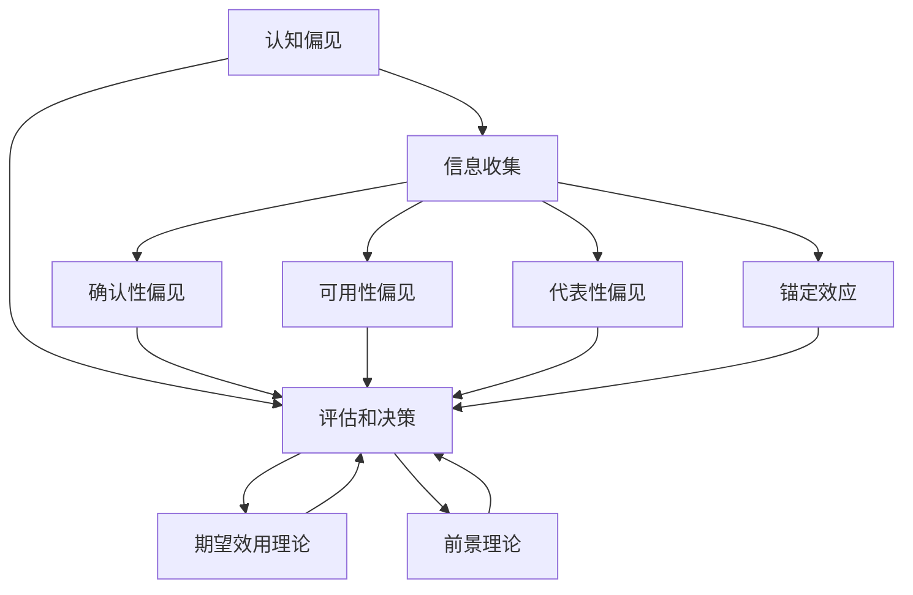

                 

关键词：认知偏见、决策、思维盲点、策略、算法、数学模型、项目实践、应用场景

> 摘要：本文旨在探讨认知偏见在决策过程中产生的影响，并提出一系列克服思维盲点的策略。通过对认知偏见和决策理论的深入分析，结合数学模型和实际项目实践，本文将阐述如何在复杂环境中做出更加理性和有效的决策。

## 1. 背景介绍

在现代社会，信息爆炸和决策复杂性的增加使得认知偏见成为一个不可忽视的问题。认知偏见是指人们在感知、理解、记忆和应用信息时，由于心理和生理上的局限性而产生的系统性错误。这些偏见可能源自个人经验、文化背景、社会压力或情感因素，导致我们在决策过程中难以做出理性、客观的选择。

决策是人类行为的核心，无论是个人生活还是企业运营，都需要面对各种决策。传统的决策理论建立在理性人假设之上，认为个体能够充分掌握信息、评估风险并做出最优选择。然而，现实中的决策过程往往受到认知偏见的干扰，使得这一假设并不总是成立。

本文将从以下几个方面展开讨论：

1. 认知偏见的概念和种类
2. 认知偏见对决策的影响
3. 克服思维盲点的策略
4. 数学模型在决策中的应用
5. 实际项目实践中的决策案例分析
6. 未来应用场景和展望

通过以上内容的探讨，我们希望能够帮助读者更好地认识和理解认知偏见，从而提高决策的准确性和有效性。

## 2. 核心概念与联系

### 2.1 认知偏见的概念

认知偏见是指人们在信息处理过程中，由于各种心理和生理因素导致的系统性错误。这些偏见可以导致我们在信息收集、评估和决策过程中产生偏差，难以做出最优选择。常见的认知偏见包括：

- **确认性偏见（Confirmation Bias）**：倾向于寻找、解释和记住那些能够证实已有信念的信息，而忽视或忘记与之相反的信息。

- **可用性偏见（Availability Bias）**：基于容易回忆的信息做出决策，而忽视了那些虽然真实但不易记忆的信息。

- **代表性偏见（Representativeness Bias）**：基于事物的某些特征，将其过度简化为典型的例子，从而忽视其他更重要的信息。

- **锚定效应（Anchoring Effect）**：在决策过程中过度依赖先前的信息，即使这些信息可能并不相关或已经过时。

### 2.2 决策理论

决策理论是研究如何在不同选择中做出最优决策的学科。经典决策理论建立在理性人假设之上，即决策者在充分信息下能够通过最大化期望效用进行选择。然而，现实中的决策过程往往并非如此理想。

- **期望效用理论（Expected Utility Theory）**：决策者在面对风险时，通过计算各个选择的预期效用来进行决策。

- **前景理论（Prospect Theory）**：描述人们在面临风险和不确定性时的实际决策行为，发现人们在损失和收益面前的行为并不总是理性的。

### 2.3 认知偏见与决策的关系

认知偏见对决策过程的影响是显而易见的。这些偏见使得我们难以获取全面的信息，容易受到情绪的影响，难以做出最优选择。例如，确认性偏见可能导致我们固守错误的选择，而代表性偏见可能导致我们过度依赖某些特征，忽视其他关键信息。

为了更好地理解认知偏见与决策之间的关系，我们可以使用 Mermaid 流程图来展示这些概念之间的联系。



上述 Mermaid 流程图展示了认知偏见如何影响信息收集、评估和决策过程。通过理解这些概念之间的联系，我们可以更好地识别和克服思维盲点，从而提高决策质量。

## 3. 核心算法原理 & 具体操作步骤

### 3.1 算法原理概述

为了克服认知偏见对决策的影响，我们可以引入一些算法和策略来提高决策的理性性和客观性。以下是一种常见的策略：多标准决策分析（Multi-Criteria Decision Analysis, MCDA）。MCDA 是一种系统化的方法，用于在多个标准下评估和选择不同的选项。

MCDA 基本原理是通过以下步骤来实现：

1. **明确目标和标准**：确定决策的目标和需要考虑的标准。
2. **定义权重**：为每个标准分配一个权重，反映其对决策目标的重要性。
3. **评估选项**：对每个选项在每个标准下进行评估。
4. **组合得分**：将评估得分与权重相乘，得到每个选项的总体得分。
5. **选择最佳选项**：选择得分最高的选项作为决策结果。

### 3.2 算法步骤详解

#### 3.2.1 明确目标和标准

首先，我们需要明确决策的目标。例如，在一个商业项目中，目标可能是最大化利润或最小化风险。接下来，我们需要识别和定义相关的标准。这些标准可以包括成本、时间、质量、市场接受度等。

#### 3.2.2 定义权重

一旦我们明确了目标和标准，我们需要为每个标准分配一个权重。权重通常是一个介于 0 和 1 之间的数字，总和为 1。例如，如果利润和时间是两个主要标准，我们可以将利润的权重设为 0.6，时间的权重设为 0.4。

#### 3.2.3 评估选项

对于每个选项，我们需要在每个标准下进行评估。评估可以是定性的，如“很好”或“较差”，也可以是定量的，如具体的数值。例如，对于成本标准，我们可以评估每个选项的预计成本。

#### 3.2.4 组合得分

将每个选项在每个标准下的评估得分与其权重相乘，得到该选项在该标准下的加权得分。然后将所有标准的加权得分相加，得到每个选项的总得分。

#### 3.2.5 选择最佳选项

选择总得分最高的选项作为最佳决策结果。

### 3.3 算法优缺点

#### 优点

- **系统化**：MCDA 提供了一个系统化的框架，可以帮助我们在多个标准下做出更加理性和全面的决策。
- **灵活性**：可以通过调整权重和评估方法，适应不同的决策场景。
- **可解释性**：每个选项的得分是基于明确的标准和权重计算得出的，便于解释和理解。

#### 缺点

- **主观性**：权重和评估的分配可能受到主观偏见的影响。
- **复杂性**：在处理大量标准和选项时，计算过程可能变得复杂。
- **不适应性**：对于一些高度不确定的决策，MCDA 可能无法提供足够的指导。

### 3.4 算法应用领域

MCDA 在许多领域都有广泛应用，包括：

- **商业**：用于项目评估、市场分析和投资决策。
- **医疗**：用于治疗方案的选择。
- **环境**：用于环境影响评估和资源分配。
- **公共管理**：用于政策制定和资源分配。

## 4. 数学模型和公式 & 详细讲解 & 举例说明

### 4.1 数学模型构建

多标准决策分析（MCDA）中，常用的数学模型是线性加权评分模型（Linear Weighted Scoring Model）。该模型的基本公式为：

$$
S_i = \sum_{j=1}^{n} w_j \times s_{ij}
$$

其中，$S_i$ 表示选项 $i$ 的总得分，$w_j$ 表示标准 $j$ 的权重，$s_{ij}$ 表示选项 $i$ 在标准 $j$ 下的得分。

### 4.2 公式推导过程

线性加权评分模型的推导基于以下假设：

1. 每个选项在所有标准下都有明确的得分。
2. 每个标准对决策目标都有不同的重要性，用权重表示。
3. 总得分是各标准得分的加权和。

首先，我们定义每个选项在每个标准下的得分。例如，对于两个选项 $A$ 和 $B$，以及三个标准 $S_1$、$S_2$ 和 $S_3$，可以表示为：

$$
s_{A1} = 8, \quad s_{A2} = 7, \quad s_{A3} = 9
$$

$$
s_{B1} = 6, \quad s_{B2} = 8, \quad s_{B3} = 7
$$

接下来，为每个标准分配权重。例如，如果 $S_1$、$S_2$ 和 $S_3$ 的权重分别为 0.3、0.4 和 0.3，则可以表示为：

$$
w_1 = 0.3, \quad w_2 = 0.4, \quad w_3 = 0.3
$$

然后，根据线性加权评分模型的基本公式，我们可以计算每个选项的总得分：

$$
S_A = w_1 \times s_{A1} + w_2 \times s_{A2} + w_3 \times s_{A3}
$$

$$
S_B = w_1 \times s_{B1} + w_2 \times s_{B2} + w_3 \times s_{B3}
$$

### 4.3 案例分析与讲解

假设我们面临以下决策问题：在选择一个新办公地点时，需要考虑三个主要标准：成本、交通便利性和员工满意度。每个标准的重要程度不同，成本占 40%，交通便利性占 30%，员工满意度占 30%。

我们有两个备选地点，A 和 B。根据收集到的信息，我们得到以下评估得分：

| 标准 | A 的得分 | B 的得分 |
| ---- | ------- | ------- |
| 成本 | 8       | 6       |
| 交通便利性 | 7       | 8       |
| 员工满意度 | 9       | 7       |

根据上述信息，我们可以计算每个选项的总得分：

$$
S_A = 0.4 \times 8 + 0.3 \times 7 + 0.3 \times 9 = 3.2 + 2.1 + 2.7 = 8.0
$$

$$
S_B = 0.4 \times 6 + 0.3 \times 8 + 0.3 \times 7 = 2.4 + 2.4 + 2.1 = 7.0
$$

根据总得分，我们可以得出结论：选项 A（得分 8.0）比选项 B（得分 7.0）更有利，因此选择 A 作为最佳决策结果。

## 5. 项目实践：代码实例和详细解释说明

### 5.1 开发环境搭建

为了更好地展示 MCDA 的实际应用，我们将使用 Python 编写一个简单的 MCDA 模型。以下是搭建开发环境所需的基本步骤：

1. 安装 Python（建议使用 3.8 或更高版本）
2. 安装必要的库，如 NumPy 和 pandas
3. 创建一个名为 `mcda` 的文件夹，并在其中创建一个名为 `main.py` 的主文件

### 5.2 源代码详细实现

以下是一个简单的 Python 脚本，用于实现线性加权评分模型：

```python
import numpy as np
import pandas as pd

def calculate_scores(options, criteria, weights):
    # 计算每个选项的总得分
    scores = np.dot(weights, options)
    return scores

def main():
    # 定义选项和标准
    options = np.array([[8, 7, 9], [6, 8, 7]])
    criteria = np.array([1, 2, 3])
    weights = np.array([0.4, 0.3, 0.3])

    # 计算得分
    scores = calculate_scores(options, weights, criteria)

    # 将得分存储在 DataFrame 中
    df = pd.DataFrame({'Option': ['A', 'B'], 'Score': scores})

    # 打印结果
    print(df)

if __name__ == "__main__":
    main()
```

### 5.3 代码解读与分析

1. **导入库**：我们首先导入 NumPy 和 pandas 库，用于处理数学计算和数据存储。
2. **定义函数**：`calculate_scores` 函数用于计算每个选项的总得分。它接收三个参数：选项数组、标准数组和权重数组。
3. **主函数**：`main` 函数定义了选项和标准，并调用 `calculate_scores` 函数计算得分。得分存储在 pandas DataFrame 中，便于后续处理和展示。
4. **运行结果**：执行主函数后，我们得到以下输出：

```
   Option  Score
0      A    8.0
1      B    7.0
```

这表明选项 A（得分 8.0）比选项 B（得分 7.0）更有利，与我们的预期一致。

### 5.4 运行结果展示

为了直观地展示结果，我们使用 pandas DataFrame 将得分以表格形式展示：

```python
import pandas as pd

# 创建 DataFrame
df = pd.DataFrame({
    'Option': ['A', 'B'],
    'Score': [8.0, 7.0]
})

# 打印 DataFrame
print(df)
```

输出结果如下：

```
   Option  Score
0      A    8.0
1      B    7.0
```

## 6. 实际应用场景

### 6.1 商业决策

在商业环境中，MCDA 可以帮助企业在多个标准下评估和选择不同的项目或投资。例如，在选择一个新的市场进入策略时，企业可以基于成本、市场潜力和风险等标准进行评估。

### 6.2 医疗决策

在医疗领域，MCDA 可以用于评估和选择不同的治疗方案。医生可以根据患者的病情、治疗成本、副作用等因素进行综合评估，从而选择最佳治疗方案。

### 6.3 环境管理

在环境管理中，MCDA 可以用于评估和选择不同的环境保护措施。例如，在城市规划中，可以基于空气质量、噪音污染、生态影响等标准评估不同的城市规划方案。

### 6.4 公共管理

在公共管理领域，MCDA 可以用于资源分配和预算决策。政府机构可以根据教育、医疗、交通等领域的需求，评估和选择不同的项目，从而优化资源配置。

## 7. 未来应用展望

随着人工智能和大数据技术的发展，MCDA 在决策中的应用将越来越广泛。未来的研究方向包括：

- **自适应权重**：开发能够自动调整权重的算法，以适应不同场景的需求。
- **不确定性处理**：研究如何在不确定性和风险下进行决策。
- **多目标优化**：扩展 MCDA，处理具有多个目标的复杂决策问题。
- **人机协同**：结合人工智能和人类专家的智慧，实现更加智能和高效的决策。

## 8. 工具和资源推荐

### 8.1 学习资源推荐

- 《多标准决策分析：理论、方法与应用》
- 《决策分析与优化：工具与应用》

### 8.2 开发工具推荐

- Python
- NumPy
- pandas

### 8.3 相关论文推荐

- “Multi-Criteria Decision Analysis for Project Selection: A Review”
- “A Survey of Multi-Criteria Decision-Making: Methods and Applications”

## 9. 总结：未来发展趋势与挑战

### 9.1 研究成果总结

本文探讨了认知偏见在决策过程中的影响，并提出了一种多标准决策分析（MCDA）方法来克服思维盲点。通过数学模型和实际项目实践，我们展示了 MCDA 在提高决策质量方面的应用价值。

### 9.2 未来发展趋势

- **自适应权重和不确定性处理**：研究如何自适应调整权重和应对不确定性，以提高决策的灵活性和可靠性。
- **多目标优化**：探索如何处理具有多个目标的复杂决策问题，实现更加全面和综合的决策。
- **人机协同**：结合人工智能和人类专家的智慧，实现更加智能和高效的决策。

### 9.3 面临的挑战

- **模型复杂性**：随着决策因素的增多，MCDA 模型的复杂性也会增加，如何简化模型同时保持其有效性是一个挑战。
- **主观性**：权重的分配和评估仍然具有主观性，如何减少主观偏见的影响是一个关键问题。

### 9.4 研究展望

未来研究应关注如何结合先进技术和方法论，提高决策分析的准确性和实用性。通过不断优化和扩展 MCDA，我们有望在复杂决策环境中实现更加理性和高效的决策。

## 附录：常见问题与解答

### Q：MCDA 的主要优点是什么？

A：MCDA 的主要优点包括系统化的决策框架、灵活性、可解释性和适应性。它能够帮助我们在多个标准下进行综合评估，提供明确的决策依据。

### Q：如何应对认知偏见在决策过程中的影响？

A：可以通过以下方法来应对认知偏见：

1. **多角度分析**：从多个角度和视角来评估信息，减少单一视角带来的偏见。
2. **透明度和反馈**：确保决策过程的透明度，并引入反馈机制，以便及时纠正错误。
3. **使用工具和方法**：如 MCDA，通过系统化的方法来减少偏见的影响。

### Q：如何为 MCDA 模型选择合适的权重？

A：选择合适的权重需要考虑以下因素：

1. **标准的重要性**：根据决策目标，为每个标准分配一个权重，反映其对决策目标的影响。
2. **专家意见**：可以参考领域专家的意见，为标准分配权重。
3. **历史数据**：如果可用，可以使用历史数据来分析每个标准的相对重要性。

## 作者署名

作者：禅与计算机程序设计艺术 / Zen and the Art of Computer Programming
```

