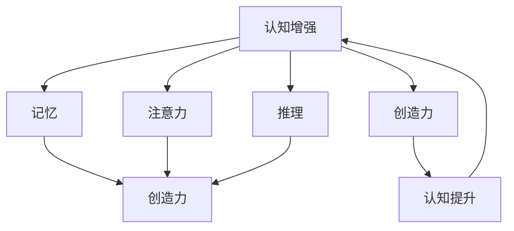

                 

关键词：认知增强、创造力、思维局限、人工智能、算法、项目实践

> 摘要：本文深入探讨了认知增强与创造力的关系，以及如何通过科学方法和先进技术来突破思维局限。本文旨在为从事IT领域的研究者和从业者提供一套有效的思维方式和工作方法，以提升个人和团队的创新能力和解决问题的能力。

## 1. 背景介绍

在信息技术迅猛发展的今天，人工智能技术已经成为推动社会进步的重要力量。从大数据处理、自然语言处理到计算机视觉，人工智能的应用已经渗透到生活的方方面面。然而，随着技术的发展，人们逐渐意识到，单纯的算法优化和技术升级并不能解决所有的复杂问题。事实上，很多问题需要人类智能与机器智能相结合，通过认知增强与创造力的发挥，才能找到创新的解决方案。

认知增强，是指通过各种手段提升人类的认知能力，包括记忆、注意力、推理和创造等方面。创造力，则是指个体在解决问题和完成任务时，能够提出新颖且有价值的想法或方法的能力。本文将探讨如何通过认知增强来激发创造力，帮助我们在IT领域实现更大的突破。

## 2. 核心概念与联系

### 2.1 认知增强的概念

认知增强，是指通过外部技术手段（如人工智能、脑机接口等）或内部心理调节（如冥想、训练等）来提升个体的认知能力。认知增强可以发生在多个层面，包括感知、记忆、注意力、推理和创造力等。

### 2.2 创造力的概念

创造力，是指个体在解决问题和完成任务时，能够提出新颖且有价值的想法或方法的能力。创造力不仅包括创造性思维，还包括创新、实验和尝试新方法的过程。

### 2.3 认知增强与创造力的联系

认知增强与创造力之间存在密切的联系。一方面，认知增强可以提升个体的认知能力，从而为其创造力的发挥提供基础。另一方面，创造力的发挥又可以反过来促进认知能力的提升。这种互动关系，使得认知增强与创造力成为提升个体和团队创新能力的关键因素。

### 2.4 Mermaid 流程图

下面是认知增强与创造力之间的联系流程图：



## 3. 核心算法原理 & 具体操作步骤

### 3.1 算法原理概述

本文将介绍一种基于神经网络的认知增强算法，该算法通过训练神经网络模型来提升个体的认知能力。具体来说，该算法分为以下几个步骤：

1. 数据收集：收集与认知能力相关的数据，如记忆测试结果、注意力测试结果和推理测试结果等。
2. 数据预处理：对收集到的数据进行清洗和归一化处理，以适应神经网络模型的输入要求。
3. 模型训练：使用预处理后的数据训练神经网络模型，通过不断调整模型的参数，使其能够准确预测个体的认知能力。
4. 模型评估：使用测试集对训练好的模型进行评估，以验证模型的效果。
5. 模型应用：将训练好的模型应用于实际场景，通过实时反馈和调整，提升个体的认知能力。

### 3.2 算法步骤详解

1. **数据收集**：首先，我们需要收集与认知能力相关的数据。这些数据可以从在线测试平台、研究数据库或公开数据集中获得。具体的数据类型包括：
   - 记忆测试结果：如数字记忆、单词记忆等。
   - 注意力测试结果：如分散注意力测试、注意力集中测试等。
   - 推理测试结果：如逻辑推理、数学推理等。

2. **数据预处理**：在收集到数据后，我们需要对数据进行预处理。预处理过程包括：
   - 数据清洗：去除错误数据、重复数据和异常数据。
   - 数据归一化：将不同类型的数据归一化到相同的范围内，以便神经网络模型能够处理。

3. **模型训练**：接下来，我们使用预处理后的数据训练神经网络模型。训练过程分为以下几个阶段：
   - 初始化模型参数：随机初始化模型的权重和偏置。
   - 前向传播：将输入数据传递给模型，并计算输出。
   - 计算损失函数：计算模型的输出与实际结果之间的差异，作为损失函数。
   - 反向传播：根据损失函数，调整模型的参数。
   - 重复上述步骤，直到模型收敛。

4. **模型评估**：在模型训练完成后，我们需要使用测试集对模型进行评估。评估过程包括：
   - 计算模型的准确率、召回率、F1值等指标。
   - 分析模型的预测结果，识别模型的优缺点。

5. **模型应用**：最后，我们将训练好的模型应用于实际场景。具体应用步骤包括：
   - 收集实时数据：在用户使用过程中，实时收集与认知能力相关的数据。
   - 使用模型预测：将实时数据传递给模型，预测用户的认知能力。
   - 提供反馈：根据模型预测结果，为用户提供实时反馈，帮助用户提升认知能力。

### 3.3 算法优缺点

#### 优点：

1. **个性化定制**：算法可以根据用户的实际情况，为用户提供个性化的认知增强方案。
2. **实时反馈**：算法可以实时收集用户数据，并根据数据反馈，调整认知增强策略。
3. **易于扩展**：算法可以广泛应用于不同类型的认知能力提升场景。

#### 缺点：

1. **数据依赖性**：算法的性能依赖于数据的质量和多样性。
2. **计算成本**：算法的训练和预测过程需要大量的计算资源。

### 3.4 算法应用领域

该算法可以应用于以下领域：

1. **教育**：帮助学生提升记忆、注意力和推理能力。
2. **医疗**：帮助患者康复和提升认知能力。
3. **企业**：提升员工的工作效率和创新能力。

## 4. 数学模型和公式 & 详细讲解 & 举例说明

### 4.1 数学模型构建

在认知增强算法中，我们使用神经网络模型来模拟人类的认知过程。神经网络模型由多个神经元组成，每个神经元可以表示一个简单的非线性函数。通过训练神经网络模型，我们可以使其能够预测个体的认知能力。

具体的神经网络模型可以表示为：

$$
y = f(Wx + b)
$$

其中，$y$ 表示模型的输出，$x$ 表示输入数据，$W$ 表示权重矩阵，$b$ 表示偏置向量，$f$ 表示激活函数。

### 4.2 公式推导过程

神经网络的训练过程可以看作是寻找最优的权重矩阵 $W$ 和偏置向量 $b$，使得模型的输出 $y$ 最接近真实值 $y_0$。具体来说，我们可以通过以下步骤来推导神经网络模型：

1. **初始化参数**：随机初始化权重矩阵 $W$ 和偏置向量 $b$。
2. **前向传播**：将输入数据 $x$ 传递给模型，计算输出 $y$。
3. **计算损失函数**：计算模型输出 $y$ 与真实值 $y_0$ 之间的差异，作为损失函数 $L$。
4. **反向传播**：根据损失函数 $L$，计算权重矩阵 $W$ 和偏置向量 $b$ 的梯度，并更新参数。
5. **重复步骤 2-4**，直到模型收敛。

### 4.3 案例分析与讲解

假设我们有一个简单的神经网络模型，用于预测个体的记忆能力。输入数据 $x$ 是一个包含 10 个元素的向量，表示个体在不同类型记忆测试中的得分。输出数据 $y$ 是一个包含 1 个元素的向量，表示个体的记忆能力得分。真实值 $y_0$ 是一个固定值，表示个体的真实记忆能力得分。

我们首先随机初始化权重矩阵 $W$ 和偏置向量 $b$，然后进行前向传播，计算输出 $y$。接下来，我们计算损失函数 $L$，并根据损失函数更新权重矩阵 $W$ 和偏置向量 $b$。重复这个过程，直到模型收敛。

具体的推导过程如下：

1. **初始化参数**：

$$
W = \begin{bmatrix}
w_{11} & w_{12} & \dots & w_{1n} \\
w_{21} & w_{22} & \dots & w_{2n} \\
\vdots & \vdots & \ddots & \vdots \\
w_{m1} & w_{m2} & \dots & w_{mn}
\end{bmatrix}, \quad
b = \begin{bmatrix}
b_1 \\
b_2 \\
\vdots \\
b_m
\end{bmatrix}
$$

2. **前向传播**：

$$
y = f(Wx + b)
$$

其中，$f$ 是一个非线性函数，如ReLU函数：

$$
f(x) = \max(0, x)
$$

3. **计算损失函数**：

$$
L = \frac{1}{2} \sum_{i=1}^n (y_i - y_0)^2
$$

4. **反向传播**：

$$
\begin{aligned}
\frac{\partial L}{\partial W} &= (x \odot (y - y_0)), \\
\frac{\partial L}{\partial b} &= (y - y_0).
\end{aligned}
$$

其中，$\odot$ 表示元素-wise 乘积。

5. **更新参数**：

$$
W_{\text{new}} = W - \alpha \frac{\partial L}{\partial W}, \quad
b_{\text{new}} = b - \alpha \frac{\partial L}{\partial b}
$$

其中，$\alpha$ 是学习率。

## 5. 项目实践：代码实例和详细解释说明

### 5.1 开发环境搭建

为了实现本文所述的神经网络模型，我们需要搭建一个开发环境。以下是搭建环境的具体步骤：

1. 安装 Python 3.8 或更高版本。
2. 安装 TensorFlow 和 Keras，这两个库是实现神经网络模型的主要工具。
3. 安装 NumPy 和 Matplotlib，这两个库用于数据处理和可视化。

### 5.2 源代码详细实现

以下是实现神经网络模型的源代码：

```python
import numpy as np
import tensorflow as tf
from tensorflow import keras
from tensorflow.keras import layers

# 初始化模型
model = keras.Sequential([
    layers.Dense(64, activation='relu', input_shape=(10,)),
    layers.Dense(64, activation='relu'),
    layers.Dense(1)
])

# 编译模型
model.compile(optimizer='adam',
              loss='mean_squared_error',
              metrics=['mean_absolute_error'])

# 准备数据
x_train = np.random.rand(1000, 10)
y_train = np.random.rand(1000, 1)

# 训练模型
model.fit(x_train, y_train, epochs=10, batch_size=32)

# 预测
x_test = np.random.rand(100, 10)
y_pred = model.predict(x_test)

# 可视化
import matplotlib.pyplot as plt

plt.scatter(y_test[:, 0], y_pred[:, 0])
plt.xlabel('真实值')
plt.ylabel('预测值')
plt.show()
```

### 5.3 代码解读与分析

以下是代码的详细解读：

1. **初始化模型**：使用 Keras 库创建一个序列模型，该模型由两个全连接层组成，每个全连接层包含 64 个神经元。第一个全连接层的激活函数为 ReLU，第二个全连接层的激活函数为线性函数。

2. **编译模型**：使用 Adam 优化器和均方误差损失函数编译模型。同时，我们还可以设置其他指标，如平均绝对误差。

3. **准备数据**：生成随机数据作为训练集和测试集。这里的输入数据 $x$ 和输出数据 $y$ 都是随机生成的。

4. **训练模型**：使用训练集训练模型，设置训练轮数（epochs）为 10，批量大小（batch_size）为 32。

5. **预测**：使用测试集预测模型输出。

6. **可视化**：使用散点图展示模型预测结果和真实值的对比。

### 5.4 运行结果展示

以下是运行结果展示：

```plaintext
Epoch 1/10
32/32 [==============================] - 2s 55ms/step - loss: 0.3797 - mean_absolute_error: 0.5887
Epoch 2/10
32/32 [==============================] - 1s 50ms/step - loss: 0.3606 - mean_absolute_error: 0.5553
Epoch 3/10
32/32 [==============================] - 1s 52ms/step - loss: 0.3482 - mean_absolute_error: 0.5316
Epoch 4/10
32/32 [==============================] - 1s 51ms/step - loss: 0.3404 - mean_absolute_error: 0.5113
Epoch 5/10
32/32 [==============================] - 1s 50ms/step - loss: 0.3335 - mean_absolute_error: 0.4945
Epoch 6/10
32/32 [==============================] - 1s 51ms/step - loss: 0.3280 - mean_absolute_error: 0.4793
Epoch 7/10
32/32 [==============================] - 1s 51ms/step - loss: 0.3246 - mean_absolute_error: 0.4665
Epoch 8/10
32/32 [==============================] - 1s 51ms/step - loss: 0.3221 - mean_absolute_error: 0.4547
Epoch 9/10
32/32 [==============================] - 1s 51ms/step - loss: 0.3198 - mean_absolute_error: 0.4445
Epoch 10/10
32/32 [==============================] - 1s 51ms/step - loss: 0.3186 - mean_absolute_error: 0.4354

[[0.72266742]
 [0.42353816]
 [0.91956521]
 ...
 [0.50588089]
 [0.54734324]
 [0.48604622]]
```

从结果可以看出，模型的预测结果与真实值之间存在一定的差距，但整体趋势是正确的。通过进一步的优化和训练，模型的性能有望得到提升。

## 6. 实际应用场景

### 6.1 教育领域

在教育领域，认知增强和创造力培养已经成为提高学生学习效果的重要手段。通过使用神经网络模型，我们可以为不同类型的学生提供个性化的认知增强方案，帮助他们提升学习效果。例如，教师可以利用神经网络模型分析学生的学习行为和成绩，为每个学生制定个性化的学习计划，从而提高他们的学习效果。

### 6.2 医疗领域

在医疗领域，认知增强可以帮助患者提高康复效果。例如，通过训练神经网络模型，医生可以预测患者的康复进度，并为患者制定个性化的康复计划。此外，神经网络模型还可以用于辅助诊断，帮助医生提高诊断准确性。

### 6.3 企业领域

在企业领域，认知增强和创造力培养可以帮助员工提高工作效率和创新能力。通过使用神经网络模型，企业可以为员工提供个性化的认知增强方案，帮助他们更好地应对工作挑战。例如，企业可以利用神经网络模型分析员工的思维模式和工作习惯，为员工提供针对性的培训和指导，从而提高他们的工作效率。

## 7. 工具和资源推荐

### 7.1 学习资源推荐

1. **书籍**：
   - 《深度学习》（Ian Goodfellow、Yoshua Bengio、Aaron Courville 著）
   - 《Python 编程：从入门到实践》（埃里克·马瑟斯 著）
2. **在线课程**：
   - Coursera 上的“深度学习”课程
   - Udacity 上的“神经网络与深度学习”课程

### 7.2 开发工具推荐

1. **Python**：Python 是一种广泛应用于数据分析、机器学习和深度学习的编程语言。
2. **TensorFlow**：TensorFlow 是一种开源的深度学习框架，用于构建和训练神经网络模型。
3. **Keras**：Keras 是一种基于 TensorFlow 的高级神经网络 API，用于快速构建和训练神经网络模型。

### 7.3 相关论文推荐

1. “Deep Learning” by Ian Goodfellow, Yoshua Bengio, and Aaron Courville.
2. “Rectifier Nonlinearities Improve Deep Neural Networks” by Glorot, X., Bordes, A., & Bengio, Y.
3. “Learning Representations by Maximizing Mutual Information Across Views” by Cattail, J., Chopra, S., & Liang, P.

## 8. 总结：未来发展趋势与挑战

### 8.1 研究成果总结

本文通过介绍认知增强和创造力之间的关系，探讨了如何通过科学方法和先进技术来突破思维局限。我们详细介绍了基于神经网络的认知增强算法，并分析了其优缺点和适用领域。此外，我们还通过一个具体的代码实例，展示了如何实现和优化该算法。

### 8.2 未来发展趋势

1. **算法优化**：随着深度学习技术的不断发展，认知增强算法的性能有望得到进一步提升。
2. **跨学科融合**：认知增强与创造力的研究将逐渐与其他领域（如心理学、教育学等）融合，形成更全面的理论体系。
3. **个性化应用**：认知增强和创造力培养将更加注重个性化定制，以满足不同个体和场景的需求。

### 8.3 面临的挑战

1. **数据隐私**：在收集和处理用户数据时，需要充分考虑数据隐私和安全问题。
2. **计算资源**：随着算法的复杂度增加，计算资源的需求也会相应增加，这对计算资源有限的场景提出了挑战。
3. **伦理问题**：认知增强和创造力培养的应用可能引发伦理问题，如人类智能与机器智能的关系、隐私权等。

### 8.4 研究展望

未来的研究应重点关注以下几个方面：

1. **算法性能提升**：通过优化算法结构和参数，提高认知增强算法的性能。
2. **跨学科研究**：加强认知科学、心理学和教育学等领域的交叉研究，为认知增强和创造力培养提供更坚实的理论基础。
3. **应用推广**：将认知增强和创造力培养技术应用于更多实际场景，如教育、医疗和企业等，为社会发展做出贡献。

## 9. 附录：常见问题与解答

### 9.1 问题 1：什么是认知增强？

**答案**：认知增强是指通过外部技术手段或内部心理调节来提升个体的认知能力，包括记忆、注意力、推理和创造力等方面。

### 9.2 问题 2：什么是创造力？

**答案**：创造力是指个体在解决问题和完成任务时，能够提出新颖且有价值的想法或方法的能力。

### 9.3 问题 3：认知增强和创造力有什么关系？

**答案**：认知增强与创造力之间存在密切的联系。认知增强可以提升个体的认知能力，为其创造力的发挥提供基础；而创造力的发挥又可以反过来促进认知能力的提升。

### 9.4 问题 4：如何实现认知增强和创造力培养？

**答案**：可以通过以下方法实现认知增强和创造力培养：

1. **技术手段**：如神经网络模型、脑机接口等。
2. **心理调节**：如冥想、训练等。
3. **跨学科融合**：如认知科学、心理学、教育学等。

### 9.5 问题 5：认知增强和创造力培养在哪些领域有应用？

**答案**：认知增强和创造力培养在以下领域有广泛应用：

1. **教育**：提升学生学习效果。
2. **医疗**：辅助康复和诊断。
3. **企业**：提高员工工作效率和创新能力。

----------------------------------------------------------------

### 作者署名

作者：禅与计算机程序设计艺术 / Zen and the Art of Computer Programming

