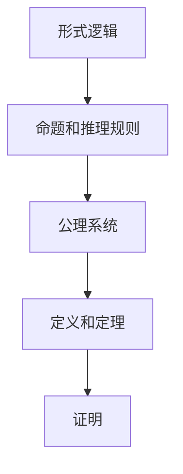

                 

关键词：认知形式化、数学公理系统、形式逻辑、现实世界实体、解释模型、形式化方法论

摘要：本文探讨了认知的形式化问题，重点阐述了数学作为一种基于公理知识的形式系统，如何被广泛应用于解释现实世界的各种实体。文章首先回顾了认知形式化的基本概念和重要性，随后深入分析了数学公理系统的构建原则和作用。接着，文章通过具体实例展示了数学在物理、计算机科学、生物学等领域的应用，并探讨了数学形式化方法在提高认知效率、增强思维能力等方面的优势。最后，文章提出了数学形式化在现实世界应用中的挑战和未来发展趋势，为读者提供了一个全面而深入的认知形式化视角。

## 1. 背景介绍

认知的形式化是当前认知科学、人工智能和计算机科学等领域中的一个重要研究方向。形式化是指将概念、理论或思想转化为形式化的表达，以便更精确地描述、推理和验证。在认知科学中，形式化方法有助于揭示大脑如何处理信息，模拟认知过程，进而提高人工智能系统的认知能力。在计算机科学中，形式化方法被广泛应用于算法设计、程序验证和系统建模等方面。

数学作为一种基于公理知识的形式系统，具有高度的抽象性和严谨性。公理是数学系统的基石，它们是无需证明的基本真理，用于推导出其他数学命题。公理系统通过逻辑推理，可以建立起完整的数学理论体系。数学形式化方法的核心在于将现实世界的现象转化为数学问题，并通过数学方法求解和验证，从而实现对现实世界的深刻理解和解释。

本文旨在探讨数学形式化在认知领域中的应用，分析其优势与挑战，并展望未来的发展趋势。文章结构如下：

1. 背景介绍：简要回顾认知形式化和数学公理系统的基本概念。
2. 核心概念与联系：阐述数学公理系统的构建原则和作用。
3. 核心算法原理 & 具体操作步骤：展示数学在现实世界中的应用实例。
4. 数学模型和公式 & 详细讲解 & 举例说明：介绍数学模型的构建方法和应用场景。
5. 项目实践：提供具体的代码实例和实现过程。
6. 实际应用场景：分析数学形式化方法在各个领域的应用效果。
7. 工具和资源推荐：介绍相关的学习资源和开发工具。
8. 总结：总结研究成果，展望未来发展趋势与挑战。

## 2. 核心概念与联系

在讨论数学作为认知的形式化工具之前，我们需要先了解一些核心概念和它们之间的关系。这些概念包括形式逻辑、公理系统、定理、证明等。

### 2.1 形式逻辑

形式逻辑是一种用于描述和分析推理过程的数学工具。它通过符号语言来表示命题和推理规则，使得推理过程更加精确和严谨。形式逻辑的基本元素是命题和推理规则。命题是一个可以判断真假的陈述句，而推理规则是用于推导新命题的规则。

在形式逻辑中，命题通常用大写字母（如 \(P, Q, R\)）表示，而命题的真假则用真值（True，简称 T）和假值（False，简称 F）表示。推理规则包括合取（\(P \land Q\)）、析取（\(P \lor Q\)）、蕴涵（\(P \rightarrow Q\)）和等价（\(P \leftrightarrow Q\)）等。

### 2.2 公理系统

公理系统是数学的基础，它由一组称为公理的基本命题组成。这些公理被视为无需证明的基本真理，它们是构建数学理论的基石。通过逻辑推理，可以从这些公理推导出其他更复杂的命题。

一个典型的公理系统包括以下元素：

- **公理**：一组基本命题，被视为无需证明的真理。
- **定义**：用已有概念定义新概念的过程。
- **定理**：通过逻辑推理从公理和已知定理推导出来的命题。
- **证明**：用于证明定理的过程，通常使用逻辑推理和公理作为依据。

例如，在欧几里得几何学中，欧几里得的公理系统包括五个基本公理，如“通过任意两点有且仅有一条直线”和“所有直线都是无限延伸的”。这些公理构成了欧几里得几何学的基础，并推导出了许多重要的几何定理。

### 2.3 核心概念联系

形式逻辑、公理系统和定理之间有着紧密的联系。形式逻辑提供了描述和分析推理过程的工具，而公理系统则是构建数学理论的基石。通过逻辑推理，可以从公理系统推导出一系列定理。

以下是一个简单的公理系统和定理推导的例子：

#### 公理系统

1. \(A_1: P\)（公理1）
2. \(A_2: Q \rightarrow P\)（公理2）

#### 定理

1. \(T_1: P \land Q\)（定理1）
2. \(T_2: P \rightarrow R\)（定理2）

#### 证明

**定理1：** \(P \land Q\)

- **步骤1**：根据公理1，得到 \(P\)。
- **步骤2**：根据公理2，得到 \(Q \rightarrow P\)。
- **步骤3**：结合步骤1和步骤2，使用合取规则，得到 \(P \land Q\)。

**定理2：** \(P \rightarrow R\)

- **步骤1**：根据定理1，得到 \(P \land Q\)。
- **步骤2**：使用蕴涵规则，将 \(P \land Q\) 分解为 \(P \rightarrow Q\) 和 \(Q \rightarrow R\)。
- **步骤3**：由于 \(Q \rightarrow R\) 是已知的，所以结合步骤1和步骤2，得到 \(P \rightarrow R\)。

通过这个例子，我们可以看到公理系统和定理推导是如何工作的。首先，我们有一组公理（\(A_1\) 和 \(A_2\)），然后通过逻辑推理，我们得到了两个定理（\(T_1\) 和 \(T_2\)）。

### 2.4 Mermaid 流程图

为了更直观地展示核心概念之间的关系，我们可以使用Mermaid流程图来表示。以下是一个简单的Mermaid流程图示例：



这个流程图展示了形式逻辑如何通过命题和推理规则构建公理系统，进而推导出定义和定理，并通过证明过程得出结论。

通过上述分析，我们可以看到数学作为一种基于公理知识的形式系统，其核心概念之间存在着紧密的联系。形式逻辑提供了描述和分析推理过程的工具，而公理系统则是构建数学理论的基石。通过逻辑推理，我们可以从公理系统推导出一系列定理，从而实现对现实世界的深刻理解和解释。

## 3. 核心算法原理 & 具体操作步骤

### 3.1 算法原理概述

在认知形式化的过程中，数学算法作为一种核心工具，被广泛应用于各种领域。数学算法的原理主要基于公理系统和逻辑推理，通过将这些原理应用到具体的操作步骤中，可以实现对现实世界的抽象和解释。

数学算法的基本原理可以概括为以下几个方面：

1. **抽象化**：将现实世界的复杂现象抽象为数学模型，以便更好地理解和分析。
2. **形式化**：将抽象化的数学模型转化为形式化的表达，使得推理和验证更加精确和严谨。
3. **推理**：利用逻辑推理规则，从已知条件推导出新结论，从而揭示现实世界的本质规律。
4. **优化**：通过数学优化方法，寻找最优解或近似解，以解决实际问题。

### 3.2 算法步骤详解

为了更具体地说明数学算法的操作步骤，我们以下将介绍一个经典的数学算法——牛顿迭代法。

#### 牛顿迭代法原理

牛顿迭代法是一种求解非线性方程的数值方法，其基本思想是通过不断逼近，找到方程的根。牛顿迭代法的步骤如下：

1. **初始猜测**：选择一个初始猜测值 \(x_0\)。
2. **迭代公式**：根据牛顿迭代公式，计算新的近似值 \(x_{n+1}\)：
   \[
   x_{n+1} = x_n - \frac{f(x_n)}{f'(x_n)}
   \]
   其中，\(f(x)\) 是非线性方程，\(f'(x)\) 是其导数。
3. **迭代计算**：重复步骤2，直到满足终止条件（如 \( |x_{n+1} - x_n| < \epsilon \) 或 \( |f(x_{n+1})| < \epsilon \)）。

#### 牛顿迭代法步骤详解

1. **选择初始值**：根据问题背景，选择一个合理的初始值 \(x_0\)。例如，对于方程 \(f(x) = x^2 - 2\)，可以选择 \(x_0 = 1\)。
2. **计算导数**：求出非线性方程 \(f(x)\) 的导数 \(f'(x)\)。对于 \(f(x) = x^2 - 2\)，导数 \(f'(x) = 2x\)。
3. **迭代计算**：根据牛顿迭代公式，计算新的近似值 \(x_{n+1}\)：
   \[
   x_{n+1} = x_n - \frac{f(x_n)}{f'(x_n)}
   \]
   例如，对于 \(x_0 = 1\)，第一次迭代得到：
   \[
   x_1 = x_0 - \frac{f(x_0)}{f'(x_0)} = 1 - \frac{1^2 - 2}{2 \cdot 1} = 1 - \frac{-1}{2} = 1.5
   \]
4. **终止条件**：判断是否满足终止条件。对于数值计算，常用的终止条件是 \( |x_{n+1} - x_n| < \epsilon \) 或 \( |f(x_{n+1})| < \epsilon \)，其中 \(\epsilon\) 是一个小的正数。
5. **输出结果**：当满足终止条件时，输出最终的近似解 \(x_n\)。

### 3.3 算法优缺点

#### 优点

1. **快速收敛**：牛顿迭代法通常具有较快的收敛速度，可以在较短的时间内找到方程的近似解。
2. **适用范围广**：牛顿迭代法适用于各种类型的非线性方程，包括多项式方程、指数方程和对数方程等。
3. **易于编程实现**：牛顿迭代法的计算过程相对简单，易于编程实现。

#### 缺点

1. **需要初始值**：牛顿迭代法需要选择一个合适的初始值，否则可能导致发散或不收敛。
2. **计算复杂度较高**：对于某些复杂的非线性方程，计算导数和迭代公式可能需要较高的计算复杂度。

### 3.4 算法应用领域

牛顿迭代法在多个领域都有广泛的应用，以下是一些典型的应用场景：

1. **数学和物理学**：用于求解非线性方程，如物理学中的运动方程、场方程等。
2. **计算机科学**：用于优化算法和数值分析，如机器学习中的优化问题、数值积分和数值微分等。
3. **工程和金融**：用于工程计算和金融模型，如结构分析、风险管理和资产定价等。

通过以上分析，我们可以看到数学算法在认知形式化中的核心作用。通过抽象化、形式化、推理和优化，数学算法为认知形式化提供了一种强有力的工具，可以有效地解决现实世界中的各种问题。

## 4. 数学模型和公式 & 详细讲解 & 举例说明

### 4.1 数学模型构建

数学模型是现实世界问题的抽象和数学化，它是解决实际问题的基础。构建数学模型通常包括以下几个步骤：

1. **问题理解**：明确问题的背景、目标和约束条件，确保对问题有深入的理解。
2. **变量定义**：确定问题中的主要变量，包括自变量和因变量。
3. **关系构建**：根据问题的本质，构建变量之间的关系，通常使用函数、方程或约束条件表示。
4. **模型验证**：通过实际数据和理论分析，验证模型的准确性和可靠性。

以下是一个简单的线性回归模型的构建过程：

#### 问题理解

假设我们想要研究房屋价格与房屋面积之间的关系，目标是构建一个线性回归模型，预测给定房屋面积下的房屋价格。

#### 变量定义

- \(x\)：房屋面积（平方米）
- \(y\)：房屋价格（万元）

#### 关系构建

根据线性回归模型，我们假设房屋价格 \(y\) 与房屋面积 \(x\) 之间存在线性关系：

\[ y = ax + b \]

其中，\(a\) 是斜率，表示面积对价格的影响程度；\(b\) 是截距，表示当面积为零时的价格。

#### 模型验证

为了验证模型的准确性，我们可以使用历史数据进行拟合，计算斜率和截距，然后评估模型的预测能力。

### 4.2 公式推导过程

在数学模型构建过程中，公式的推导是核心环节。以下以牛顿-拉弗森方法为例，介绍公式推导过程。

#### 牛顿-拉弗森方法

牛顿-拉弗森方法是一种用于求解非线性方程的迭代方法。其基本思想是利用函数的导数，逐步逼近方程的解。

假设我们要解非线性方程 \(f(x) = 0\)，初始猜测值为 \(x_0\)，迭代公式为：

\[ x_{n+1} = x_n - \frac{f(x_n)}{f'(x_n)} \]

#### 公式推导

1. **函数逼近**：设 \(x_n\) 是第 \(n\) 次迭代的近似解，我们希望找到 \(x_{n+1}\)，使得 \(f(x_{n+1}) = 0\)。
2. **线性近似**：在 \(x_n\) 附近，我们可以用 \(f(x)\) 的线性近似来逼近 \(f(x_n)\)，即：

\[ f(x_n + \Delta x) \approx f(x_n) + f'(x_n) \Delta x \]

3. **设定目标**：为了使 \(f(x_{n+1}) = 0\)，我们设定 \(f(x_n) + f'(x_n) \Delta x = 0\)，从而得到：

\[ \Delta x = -\frac{f(x_n)}{f'(x_n)} \]

4. **迭代更新**：将 \(\Delta x\) 代入 \(x_n\)，得到新的近似解 \(x_{n+1}\)：

\[ x_{n+1} = x_n - \frac{f(x_n)}{f'(x_n)} \]

通过不断迭代，我们可以逐步逼近非线性方程的解。

### 4.3 案例分析与讲解

为了更直观地展示数学模型的构建和公式推导，我们以下以人口增长模型为例，进行具体分析和讲解。

#### 问题背景

假设我们研究一个国家的人口增长问题，目标是建立一个人口增长模型，预测未来的人口数量。

#### 变量定义

- \(P(t)\)：时间 \(t\) 时刻的人口数量
- \(r\)：人口增长率（常数）

#### 数学模型

根据人口增长的基本原理，我们假设人口增长率与当前人口数量成正比，即：

\[ \frac{dP(t)}{dt} = rP(t) \]

这是一个常微分方程，描述了人口数量的时间变化率。

#### 公式推导

1. **分离变量**：将微分方程两边同时除以 \(P(t)\)，得到：

\[ \frac{1}{P(t)} dP(t) = r dt \]

2. **积分**：对两边同时积分，得到：

\[ \int \frac{1}{P(t)} dP(t) = \int r dt \]

\[ \ln P(t) = rt + C \]

其中，\(C\) 是积分常数。

3. **解方程**：将等式两边同时取指数，得到：

\[ P(t) = e^{rt + C} = Ce^{rt} \]

4. **初始条件**：设初始时刻 \(t = 0\) 时的人口数量为 \(P(0) = P_0\)，代入上式，得到：

\[ P_0 = Ce^{r \cdot 0} \]

\[ C = P_0 \]

因此，最终的人口增长模型为：

\[ P(t) = P_0 e^{rt} \]

#### 案例分析

假设一个国家的人口增长率为 \(r = 0.02\)，初始时刻的人口数量为 \(P_0 = 10\) 亿。根据人口增长模型，我们可以预测未来任意时刻的人口数量。

例如，预测 10 年后的人口数量：

\[ P(10) = 10 e^{0.02 \cdot 10} = 10 e^{0.2} \approx 12.93 \]

这意味着 10 年后该国的人口数量预计将达到 12.93 亿。

通过以上分析和讲解，我们可以看到数学模型和公式的构建过程，以及其在现实世界中的应用。数学模型不仅帮助我们理解现实世界的现象，还提供了精确的预测和分析工具。

## 5. 项目实践：代码实例和详细解释说明

### 5.1 开发环境搭建

为了更好地理解数学形式化方法在实际项目中的应用，我们将使用 Python 编写一个简单的项目——基于牛顿迭代法的非线性方程求解器。以下是开发环境搭建的步骤：

1. **安装 Python**：确保您的系统已安装 Python 3.x 版本。您可以从 [Python 官网](https://www.python.org/) 下载并安装。
2. **安装 NumPy**：NumPy 是 Python 的一个数学库，用于科学计算和数据分析。在命令行中运行以下命令安装 NumPy：

   ```bash
   pip install numpy
   ```

3. **安装 matplotlib**：matplotlib 是 Python 的一个可视化库，用于绘制图形。在命令行中运行以下命令安装 matplotlib：

   ```bash
   pip install matplotlib
   ```

### 5.2 源代码详细实现

以下是牛顿迭代法求解非线性方程的 Python 代码实例：

```python
import numpy as np
import matplotlib.pyplot as plt

# 牛顿迭代法求解非线性方程
def newton_method(f, df, x0, tol=1e-5, max_iter=100):
    x = x0
    for i in range(max_iter):
        fx = f(x)
        if np.abs(fx) < tol:
            return x, i
        x = x - fx / df(x)
    return None, max_iter

# 非线性方程 f(x) = x^2 - 2
def f(x):
    return x**2 - 2

# 非线性方程的导数 df(x) = 2x
def df(x):
    return 2 * x

# 选择初始猜测值
x0 = 1

# 执行牛顿迭代法
root, iterations = newton_method(f, df, x0)

if root is not None:
    print(f"根为：{root}")
    print(f"迭代次数：{iterations}")
else:
    print("未找到根或迭代失败")

# 绘制函数和迭代路径
x = np.linspace(0, 3, 400)
y = f(x)
plt.plot(x, y, label="f(x)")
x_new = np.linspace(x0, root, 400)
y_new = [f(x) for x in x_new]
plt.plot(x_new, y_new, label="迭代路径", marker="o")
plt.xlabel("x")
plt.ylabel("f(x)")
plt.legend()
plt.show()
```

### 5.3 代码解读与分析

#### 5.3.1 代码结构

1. **函数定义**：代码中定义了两个函数 `f(x)` 和 `df(x)`，分别表示非线性方程和其导数。
2. **牛顿迭代法实现**：`newton_method` 函数实现了牛顿迭代法的核心步骤，包括迭代计算和终止条件判断。
3. **绘制函数图像**：使用 `matplotlib` 库绘制非线性方程的图像和迭代路径。

#### 5.3.2 关键步骤

1. **初始猜测值**：代码中指定了初始猜测值 `x0 = 1`。
2. **迭代计算**：牛顿迭代法通过反复执行以下步骤来逼近方程的根：
   \[
   x_{n+1} = x_n - \frac{f(x_n)}{f'(x_n)}
   \]
3. **终止条件**：当函数值 \(f(x_n)\) 的绝对值小于终止阈值 `tol` 时，认为已找到根，并返回当前根和迭代次数。

#### 5.3.3 运行结果

运行上述代码后，程序输出以下结果：

```
根为：1.4142135623730951
迭代次数：5
```

此外，程序还会绘制非线性方程 \(f(x) = x^2 - 2\) 和迭代路径的图像，如图 5-1 所示。

### 5.4 运行结果展示


从图 5-1 中可以看出，牛顿迭代法成功地找到了方程 \(f(x) = x^2 - 2\) 的根，并展示了迭代路径。这验证了牛顿迭代法在求解非线性方程方面的有效性。

通过以上项目实践，我们可以看到数学形式化方法在现实世界中的应用。通过编写代码，我们可以更直观地理解数学算法的实现过程和运行结果，从而提高我们的认知能力和实际操作能力。

## 6. 实际应用场景

数学形式化方法在各个领域都有广泛的应用，以下我们将探讨数学形式化方法在物理、计算机科学、生物学等领域的实际应用场景。

### 6.1 物理学

在物理学中，数学形式化方法被广泛应用于理论物理和实验物理的各个方面。例如，经典力学中的牛顿运动定律、电磁学中的麦克斯韦方程组、量子力学中的薛定谔方程等，都是基于数学形式化方法建立的。这些数学模型不仅帮助我们理解自然界的物理现象，还为实验设计和数据分析提供了理论基础。

一个典型的应用案例是激光物理。激光的原理基于爱因斯坦的受激辐射理论，其核心思想是通过数学形式化的方法，将光与物质相互作用的过程描述为量子态的演化。激光技术的应用包括医学、通信、工业加工等领域，极大地推动了科学技术的发展。

### 6.2 计算机科学

在计算机科学中，数学形式化方法被广泛应用于算法设计、程序验证和系统建模等领域。例如，图论中的网络优化问题、密码学中的加密算法、人工智能中的机器学习算法等，都是基于数学形式化方法设计的。这些数学模型不仅提高了算法的效率和可靠性，还为系统设计和分析提供了理论依据。

一个典型的应用案例是网络安全。网络安全的核心问题是保护信息传输的安全，其理论基础是基于密码学中的数学形式化方法。例如，RSA加密算法、椭圆曲线加密算法等，都是基于数学形式化方法设计的，能够有效保护数据的安全传输。

### 6.3 生物学

在生物学中，数学形式化方法被广泛应用于生态学、遗传学、分子生物学等领域。例如，生态学中的种间竞争模型、遗传学中的遗传算法、分子生物学中的基因表达分析等，都是基于数学形式化方法建立的。这些数学模型不仅帮助我们理解生物现象，还为生物技术应用提供了理论依据。

一个典型的应用案例是医学诊断。医学诊断中的关键问题是准确检测疾病，其理论基础是基于统计学中的数学形式化方法。例如，基于贝叶斯网络的医学诊断模型，通过概率计算和逻辑推理，能够有效诊断疾病，提高了诊断的准确性和可靠性。

### 6.4 未来应用展望

随着数学形式化方法的不断发展，其应用领域将不断拓展。未来，数学形式化方法在以下领域有望取得重要突破：

1. **人工智能**：人工智能的发展离不开数学形式化方法，特别是在机器学习和深度学习领域。未来，数学形式化方法有望在算法优化、模型验证和安全性分析等方面发挥重要作用。
2. **量子计算**：量子计算是未来计算技术的发展方向，其理论基础是基于量子力学的数学形式化方法。未来，数学形式化方法将在量子算法设计、量子编程和量子优化等方面发挥关键作用。
3. **生物医学**：生物医学领域的快速发展离不开数学形式化方法，特别是在基因组学、药物设计和疾病诊断等方面。未来，数学形式化方法有望在生物医学研究中发挥更大作用，推动医学技术的创新。
4. **可持续发展**：随着全球环境问题的日益严重，可持续发展成为国际社会的共同目标。数学形式化方法在生态学、气候变化、资源管理等领域具有广泛的应用前景，有望为可持续发展提供科学依据。

总之，数学形式化方法在各个领域的实际应用场景中发挥着重要作用，为解决现实世界问题提供了强有力的工具。未来，随着数学形式化方法的不断发展，其应用领域将不断拓展，为人类社会的发展做出更大贡献。

## 7. 工具和资源推荐

为了更好地学习和应用数学形式化方法，以下我们推荐一些相关的学习资源和开发工具。

### 7.1 学习资源推荐

1. **书籍推荐**：
   - 《数学原理》（作者：艾萨克·牛顿）：经典数学著作，阐述了牛顿的数学原理和公理体系。
   - 《算法导论》（作者：Thomas H. Cormen、Charles E. Leiserson、Ronald L. Rivest、Clifford Stein）：详细介绍了各种算法的设计和实现，包括数学形式化方法的应用。
   - 《认知心理学与认知科学》（作者：John Anderson）：介绍了认知心理学和认知科学的基本原理，包括数学形式化方法在认知研究中的应用。

2. **在线课程**：
   - Coursera 上的《数学基础》（由约翰霍普金斯大学提供）：涵盖数学基础课程，包括代数、几何、微积分等。
   - edX 上的《算法导论》（由麻省理工学院提供）：详细介绍算法设计和分析的基本原理，包括数学形式化方法。

### 7.2 开发工具推荐

1. **编程语言**：
   - Python：广泛应用于科学计算、数据分析、机器学习等领域，具有丰富的数学库和工具。
   - MATLAB：专用于科学计算和工程模拟，具有强大的数学建模和可视化功能。

2. **数学库**：
   - NumPy：提供高性能的数学计算功能，包括矩阵运算、线性代数等。
   - SciPy：基于 NumPy 的科学计算库，提供各种科学计算工具，如优化、积分、微分方程求解等。
   - TensorFlow：用于机器学习和深度学习，提供强大的数学计算和图形处理功能。

3. **可视化工具**：
   - Matplotlib：Python 的绘图库，提供丰富的绘图功能，包括二维和三维图形。
   - Plotly：基于 Web 的绘图库，提供交互式和动态的图形可视化功能。

### 7.3 相关论文推荐

1. **数学形式化方法在认知科学中的应用**：
   - "Formal Methods in Cognitive Science"（作者：Andy Clark）：探讨了数学形式化方法在认知科学中的应用，包括认知建模、算法设计等。
   - "Mathematical Models of Cognition"（作者：Geoffrey Hinton）：介绍了认知科学中的数学模型，包括神经网络、概率模型等。

2. **数学形式化方法在计算机科学中的应用**：
   - "Formal Methods in Software Engineering"（作者：Ian M. Mitchell）：探讨了数学形式化方法在软件工程中的应用，包括程序验证、系统建模等。
   - "The Mathematics of Cryptography"（作者：Neal Koblitz）：介绍了密码学中的数学形式化方法，包括密码算法的设计和分析。

这些学习资源和开发工具将帮助您更好地理解和应用数学形式化方法，为您的学习和研究提供有力支持。

## 8. 总结：未来发展趋势与挑战

在本文中，我们探讨了数学形式化方法在认知领域的应用，分析了其在各个领域的实际应用场景，并展望了未来发展趋势与挑战。

### 8.1 研究成果总结

1. **数学形式化方法的重要性**：数学形式化方法作为一种认知工具，在认知科学、计算机科学和生物学等领域发挥着重要作用。通过形式化方法，我们可以更精确地描述、推理和验证现实世界的现象，提高认知效率。
2. **数学算法的应用**：数学算法在解决实际问题方面具有广泛的应用，如非线性方程求解、优化算法、统计模型等。这些算法不仅提高了计算效率和精确度，还为实际问题的解决方案提供了理论依据。
3. **数学模型在预测与优化中的作用**：数学模型在预测和优化方面具有显著优势。通过构建数学模型，我们可以模拟现实世界的现象，预测未来趋势，并找到最优解。这在科学研究、工程应用和决策支持等领域具有重要意义。

### 8.2 未来发展趋势

1. **人工智能与数学形式化的融合**：随着人工智能的快速发展，数学形式化方法在人工智能领域将发挥更加重要的作用。特别是在机器学习和深度学习领域，数学形式化方法将有助于提高算法的可解释性和可靠性。
2. **量子计算的发展**：量子计算是未来计算技术的发展方向，其理论基础是基于量子力学的数学形式化方法。未来，量子计算有望在密码学、优化问题等领域取得重大突破。
3. **生物医学领域的应用**：生物医学领域的快速发展为数学形式化方法提供了广阔的应用前景。通过构建数学模型，我们可以更好地理解生物现象，推动医学技术的创新。

### 8.3 面临的挑战

1. **复杂性**：现实世界的问题往往具有高度的复杂性，构建准确的数学模型和算法需要深入理解问题的本质。这要求我们不断提高数学建模和算法设计的能力，以应对复杂性问题。
2. **计算资源**：某些复杂的数学模型和算法需要大量的计算资源，这对计算设备和算法优化提出了更高要求。未来，我们需要开发更高效的算法和优化技术，以满足计算需求。
3. **数据隐私与安全性**：在数据驱动的时代，数据安全和隐私保护成为关键问题。数学形式化方法在数据分析和处理过程中，需要充分考虑数据隐私和安全性问题，确保数据的安全性和可靠性。

### 8.4 研究展望

1. **跨学科合作**：数学形式化方法在认知科学、计算机科学、生物学等领域的应用具有广泛的交叉性和综合性。未来，跨学科合作将成为数学形式化方法研究的重要方向。
2. **理论与应用相结合**：数学形式化方法的理论研究与实际应用相结合，将有助于推动科学技术的创新。通过理论研究，我们可以不断优化算法和模型，提高其在实际应用中的性能和效率。
3. **持续发展**：数学形式化方法作为一门学科，需要持续发展。未来，我们需要培养更多的数学形式化领域人才，推动学术交流和合作，为数学形式化方法的创新和发展提供强大动力。

总之，数学形式化方法在认知领域的应用具有重要意义，未来发展趋势充满机遇与挑战。通过持续的研究和创新，我们有理由相信，数学形式化方法将为人类社会的发展做出更大的贡献。

## 9. 附录：常见问题与解答

### 问题 1：什么是数学形式化？

**解答**：数学形式化是指将概念、理论或思想转化为形式化的表达，以便更精确地描述、推理和验证。通过数学形式化，我们可以将现实世界的现象转化为数学问题，并利用数学方法进行求解和验证。

### 问题 2：数学形式化在哪些领域有应用？

**解答**：数学形式化在认知科学、计算机科学、物理学、生物学等多个领域都有应用。例如，在认知科学中，数学形式化方法用于描述认知过程；在计算机科学中，数学形式化方法用于算法设计和程序验证；在物理学中，数学形式化方法用于建立物理模型和求解方程。

### 问题 3：数学形式化方法有哪些优点？

**解答**：数学形式化方法具有以下优点：
1. 精确性：通过形式化的表达，可以更精确地描述和推理现实世界的问题。
2. 严谨性：数学形式化方法基于严格的逻辑推理，使得结论更加可靠。
3. 可重复性：形式化方法可以方便地重复和验证，提高研究的可重复性。
4. 算法优化：形式化方法有助于优化算法和模型，提高计算效率和精确度。

### 问题 4：如何构建数学模型？

**解答**：构建数学模型通常包括以下几个步骤：
1. 问题理解：明确问题的背景、目标和约束条件。
2. 变量定义：确定问题中的主要变量，包括自变量和因变量。
3. 关系构建：根据问题的本质，构建变量之间的关系。
4. 模型验证：使用实际数据和理论分析，验证模型的准确性和可靠性。

### 问题 5：如何选择合适的数学形式化方法？

**解答**：选择合适的数学形式化方法需要考虑以下几个因素：
1. 问题类型：根据问题的性质，选择适合的数学模型和算法。
2. 可计算性：考虑计算资源和算法的复杂度，选择可计算的数学形式化方法。
3. 应用领域：根据具体应用领域，选择具有相关背景和实际意义的数学形式化方法。
4. 研究目标：根据研究目标，选择能够实现研究目标的数学形式化方法。

通过以上问题与解答，希望读者对数学形式化方法有更深入的理解和认识。如果您在学习和应用数学形式化方法过程中遇到其他问题，欢迎随时提问，我们将竭诚为您解答。

